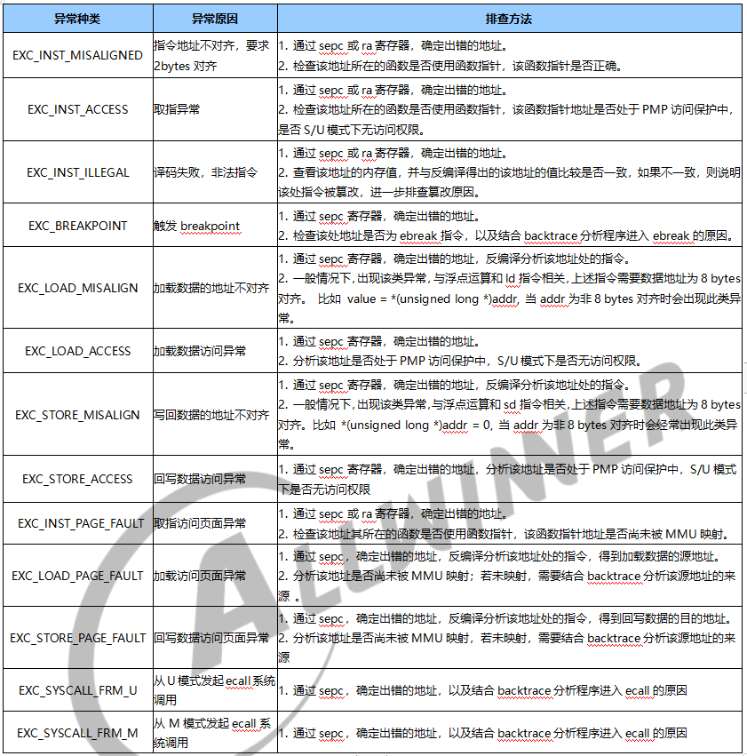

# RTOS 调试指南

此文档介绍  FreeRTOS 系统方案支持的常用软件调试方法，帮助相关开发人员快速高效地进行软件调试，提高解决软件问题的效率。

## 栈回溯

栈回溯是指获取程序的调用链信息，通过栈回溯信息，能帮助开发者快速理清程序执行流程，提高分析问题的效率。

### 用途

1. 获取程序调用关系，理清程序执行流程。
2. 在系统触发异常时，快速分析异常所在位置及其调用链。
3. 在分析某任务卡死原因时，可以通过对该任务进行栈回溯，快速分析卡死点。
4. 分析某些资源如 sem、mutex 的获取、释放信息。

### 配置

```
Kernel Options ‑‑‑>
    Backtrace Select (debug backtrace by machine code) ‑‑‑>
        (X) debug backtrace by machine code  // 通过解析机器码方式进行回溯
        ( ) debug backtrace by frame pointer // 通过解析frame pointer方式进行回溯
        ( ) no backtrace                     // 关闭栈回溯
```

### 接口介绍

```c
int backtrace(char *taskname, void *output[], int size, int offset, print_function print_func);
```

参数：

- taskname : 任务名字；可为NULL，表示回溯当前任务
- output : 栈回溯结果保存数组，可以为NULL
- size : output数组大小，可为0
- offset : 栈回溯保存结果的偏移，可为0
- print_func : 打印函数，可用printf

返回值：

- level : 回溯层次

### 终端命令

在设备端的终端界面上支持使用 backtrace 命令对指定的任务进行回溯。

```
作用：查看指定任务堆栈回溯信息
用法：backtrace [taskname]
```

### 回溯信息解析

1. 在 PC 端开发环境中，在 FreeRTOS SDK 根目录下，执行 source envsetup.sh
2. 在 PC 端开发环境中，在 FreeRTOS SDK 的 lichee/rtos 目录下创建 backtrace.txt 文件，然后将回溯信息从终端中拷贝出来，并保存到 backtrace.txt 文件中。
3. 在 PC 端开发环境中，执行 callstack backtrace.txt 命令，会获取以下回溯信息。

```
mhd_start_scan at /xxx/mhd_apps_scan.c:334 #mhd_start_scan表示函数名，/xxx/mhd_apps_scan.c表示函数所在的文件路径，334表示函数调用处的行号。

mhd_softap_start at /xxx/mhd_apps_softap.c:263
wifi_recv_cb at /xxx/mhd_api_test.c:624
mhd_get_host_sleep at /xxx/mhd_apps_wifi.c:81
bswap_16 at /xxx/aw‑alsa‑lib/bswap.h:39
(inlined by) convert_from_s16 at ??:?
linear_init at /xxx/pcm_rate_linear.c:378
resampler_basic_interpolate_single at /xxx/resample_speexdsp.c:395
__fill_vb2_buffer at /xxx/videobuf2‑v4l2.c:392
cci_read at /xxx/cci_helper.c:728
ecdsa_signature_to_asn1 at /xxx/ecdsa.c:294
cmd_wifi_fwlog at /xxx/mhd_api_test.c:449
# 函数调用顺序为从下到上，即cmd_wifi_fwlog ‑> ecdsa_signature_to_asn1 ‑> cci_read ... ‑> mhd_start_scan
```

### 注意事项

请确保执行解析命令时所指定的 rt_system.elf 为系统固件所对应的 rt_system.elf 文件，否则解析后的栈回溯信息无法确保正确。

## addr2line 分析

发生异常时，如果栈回溯失败，可以通过 addr2line 工具，对打印出来的栈上数据进行分析，从而确定栈回溯信息。需要注意的是，使用该方法调试的开发人员，需要提前了解一些 ARM 体系架构和入栈出栈等相关知识。

### 用途

在栈回溯失败时，使用 addr2line 从栈上数据中分析栈回溯信息。

### 用法

发生异常时当前栈内容打印如下：

```
dump stack memory:
0x40940f18: 0x40639028 0x4099ba68 0x00000000 0x00000000
0x40940f28: 0x00000000 0x00000000 0x00000000 0x00000000
0x40940f38: 0x00000000 0x00000000 0x00000000 0x00000000
0x40940f48: 0x00000000 0x00000000 0x00000000 0x00000000
0x40940f58: 0x00000000 0x00000000 0x00000000 0x00000000
0x40940f68: 0x00000000 0x00000000 0x00000000 0x00000000
0x40940f78: 0x00000000 0x00000000 0x00000000 0x00000000
0x40940f88: 0x00000000 0x00000000 0x00000000 0x00000000
0x40940f98: 0x00000000 0x404f3680 0x00000001 0x4099ba68
0x40940fa8: 0x4099ba68 0x00000001 0x4099b628 0x00000542
0x40940fb8: 0x4099bb68 0x40141388 0x4099ba68 0x404f3680
0x40940fc8: 0x4099a628 0x4099ba68 0x4099bb6a 0x40142214
0x40940fd8: 0x40141e2c 0x00000000 0x40141e2c 0xdeadbeef
0x40940fe8: 0xdeadbeef 0xdeadbeef 0xdeadbeef 0xdeadbeef
0x40940ff8: 0xdeadbeef 0x400d88b4 0x00000000 0x0001b63d
```

对所有的内存数据使用下列命令进行分析。

```
$(SDK_ROOT)/lichee/rtos/tools/gcc‑arm‑melis‑eabi‑8‑2019‑q3‑update/bin/arm‑melis‑eabi‑addr2line ‑a address ‑e rt_system.elf ‑f

# SDK_ROOT 表示SDK根目录
# ‑f：显示函数名
# ‑a：address为打印出来的地址
# ‑e：程序文件
```

### 分析

对于无法解析的内存数据予以丢弃后，可得到以下有效的分析信息。

```
0x40141388
msh_exec
/xxx/finsh_cli/msh.c:415

0x40142214
finsh_thread_entry
/xxx/finsh_cli/shell_entry.c:746
# 函数调用关系　finsh_thread_entry ‑> msh_exec
```

## 内存泄露分析

FreeRTOS 系统提供轻量级的内存泄露分析功能，启动内存泄露分析后，每当申请内存时，将该内存块挂入链表中，释放时将其从链表中摘除。最终还存在于链表之中的，便是可疑的内存泄露点。

### 用途

可用于分析、定位 FreeRTOS 系统的内存泄露问题。

### 配置

```
System components ‑‑‑>
    aw components ‑‑‑>
        Memleak Components Support ‑‑‑>
            [*] Tina RTOS Memleak #使能内存泄露分析工具
            (16) Tina RTOS Memleak Backtrace Level @ 内存泄露分析栈回溯层数
```

### 终端命令

####  memleak

```
作用：内存泄露分析
用法：
	memleak 1 使能内存泄露分析，记录所有内存块申请信息
    memleak 0 关闭内存泄露分析，删除所有内存块的申请信息
    memleak 1 thread_name1 thread_name2 使能内存泄露分析，记录指定任务的内存块申请信息
    memleak show 不关闭内存泄露分析，打印出所有内存块申请信息
```

#### memallocate

```
作用：查看指定任务的内存泄露分析信息
用法：memallocate thread_name
```

### 内存泄露 log 分析

关闭内存泄露检测时，会打印可疑的内存泄露点及其回溯信息，开发者可根据回溯信息，参考栈回溯章节进行分析。

```
001: ptr = 0x404c7800, size = 0x00000400.
    backtrace : 0x401da778
    backtrace : 0x4013cd78
    backtrace : 0x4013b190
    backtrace : 0x401b7c44
    backtrace : 0x401e1854
    
# ptr : 存留在链表中的内存块地址
# size : 存留在链表中的内存块大小
# backtrace : 申请该内存块时的栈回溯信息
```

## 内存重复释放检查

FreeRTOS 系统提供轻量级的内存重复释放分析功能，在内存堆管理器初始化完成之后，使能内存重复释放检测功能，每当申请内存时，将该内存块挂入链表中，释放时将其从链表中摘除。如果释放一个不存在于该链表中的内存块时，说明之前已经释放过该块内存，则本次释放即为内存重复释放。

### 用途

分析是否存在内存重复释放，以及找到第 2 次释放同一个内存块的调用链信息

### 配置

```
System components ‑‑‑>
    aw components ‑‑‑>
        Memleak Components Support ‑‑‑>
            [*] Tina RTOS Memleak #使能内存泄露分析工具
            [*] Tina RTOS Double Free Check #使能内存重复释放检查
```

### 内存重复释放 log 分析

```
double free checked!!!
backtrace : 0x401da778
backtrace : 0x4013cd78
backtrace : 0x4013b190
backtrace : 0x401b7c44
backtrace : 0x401e1854
```

出现 double free checked!!! 即表示存在内存重复释放现象，打印出来的栈回溯信息是第二次释放该内存块时的调用链信息。

## 系统崩溃异常分析

系统崩溃异常主要是指 CPU 因非法地址访问、指令译码错误等原因，进入了异常模式，表现形式为系统打印异常栈信息和寄存器信息。

### Cortex‑M33 CPU 软件异常分析

####  M33 CPU 异常类型

Cortex‑M33 是采用 ARMv8m 指令集架构的处理器，其软件异常处理类型符合 ARMv8m 软件异常类型。其异常类型如下：

1. Bus Fault。触发该异常的原因有：取指失败（prefetch abort)、数据读/写失败（data abort)。BFSR 寄存器会保存产生 bus fault 的原因。
2. MemManage Fault。触发该异常的原因有：访问 MPU 设置区域覆盖范围之外的地址、往只读region 写数据、用户级下访问了只允许在特权级下访问的地址、在不可执行的存储器区域试图取指。MFSR 寄存器保存产生该异常的原因，MMSR 寄存器保存了导致异常的地址。
3. User Fault。触发该异常的原因有：执行了未定义的指令、尝试进入 ARM 状态、使用 LDRM/STRM 多重加载/存储指令时，地址没有对齐、除数为零、任何未对齐的访问。UFSR 寄存器保存了产生该异常的原因。其中需要注意一点，device memory 在任何情况下都不允许非对齐访问。
4. Hard Fault。触发该异常的原因有：Bus fault、MemManage Fault 以及用法 fault 上访的结果、在异常处理中读取异常向量表时产生的总线 fault 也按硬 fault 处理。HFSR 寄存器保存了产生该异常的原因。

####  M33 CPU 软件异常分析方法

1. 确认异常类型。
2. 栈回溯分析。栈回溯是指在系统崩溃之后，会打印发生异常时的栈回溯信息，供开发者进行分析，可参考栈回溯章节进行分析

#### 崩溃 log 分析

```c
# appos pstack:0x8146480 msp:0x81fffd0 psp:0x81464a0
# appos pstack 表示异常发生后经 CPU 硬件入栈后 SP 寄存器的值，也表明了异常发生时正在使用哪个栈
# msp 表示异常发生后 msp 寄存器的值
# psp 表示异常发生后 psp 寄存器的值，异常发生时 SP = psp/msp ‑ 0x40 (64个字节用来保存异常后的寄存器现场)
# msplim/psplim ： 异常现场的 msplim 和 psplim 寄存器的值
# usage fault happen : 表示此时触发 usage(user) fault
# cause:undefine instruction 表示是触发了 user fault 中的非法指令异常
# CPU registers: 表示异常现场通用寄存器的值
# backtrace information : 表示异常现场的栈回溯信息
# 剩下信息表示对应地址的值

exception:6 happen!!
appos pstack:0x8146480 msp:0x81fffd0 psp:0x81464a0
msplim:0x0 psplim:0x8142550
usage fault happen, UFSR:0x1, cause:undefine instruction
CPU registers:
R00:[081464A0]: 0x00000001
R01:[081464A4]: 0x083adf48
R02:[081464A8]: 0x00000001
R03:[081464AC]: 0x080cf115
R04:[08146480]: 0x083adec0
R05:[08146484]: 0x083ae000
R06:[08146488]: 0x0811b574
R07:[0814648C]: 0x00000000
R08:[08146490]: 0x08080808
R09:[08146494]: 0x09090909
R10:[08146498]: 0x10101010
R11:[0814649C]: 0x11111111
R12:[081464B0]: 0x00000000
R13(SP):[081464C0]: 0x081464c0
R14(LR):[081464B4]: 0x080c8d95
R15(PC):[081464B8]: 0x080cf114
xPSR:[081464BC]: 0x61000000
SHCSR:0x00070008 step:0
‑‑‑‑backtrace information‑‑‑‑
backtrace : 0X080CF115
backtrace fail!
backtrace : 0X080C8D92
backtrace : 0X080C6C66
backtrace : 0X080C7CE0
backtrace : 0X080DAD25
‑‑‑‑‑‑‑‑‑‑‑‑‑‑‑‑‑‑‑‑‑‑‑‑‑‑‑‑‑
stack info:
[081464C0]: 0x003adec0 0x0844ae00 0x08130eb0 0x080c6c69
[081464D0]: 0x0813e470 0x080d8bcf 0x10000000 0x00000000
[081464E0]: 0x00000000 0x00000006 0x0813e220 0x0813e470
[081464F0]: 0x05050505 0x0813e140 0x05050505 0x0813e180
[08146500]: 0x07070707 0x08080808 0x09090909 0x10101010
[08146510]: 0x11111111 0x080c7ce3 0x080c6afb 0x08130eb0
[08146520]: 0x10101010 0x11111111 0x0813e180 0x01010101
.......
[LR]:0x80c8d95
[080C8B90]: 0xf73bbaa5 0xf73bbaa1 0xf73bba9d 0xe92dba99
[080C8BA0]: 0x28024ff0 0x4605b085 0xdc06468a 0x30e0f64a
[080C8BB0]: 0x000ff6c0 0xf837f008 0x2810e008 0xf64add0c
.......
```

###  RISC‑V CPU 软件异常分析



在 RISCV 架构中，该类问题的分析方法如下：

1. 确认异常类型。
2. 栈回溯分析。栈回溯是指在系统崩溃之后，会打印发生异常时的栈回溯信息，供开发者进行分析，可参考栈回溯章节进行分析
3. 查看 sepc 寄存器。当系统发生异常时，会将异常指令的地址保存到 sepc 寄存器中。如果 sepc明显是一个非法的指令地址，可查看 ra 寄存器来确定异常地址
4. 反编译查看异常指令，确定异常的直接原因并进行分析。常用反编译方法 riscv64‑unknown‑elf‑objdump ‑d xxx.elf。xxx.elf 需要根据 sepc 寄存器的值，确认其所属模块，然后选定对应的elf 文件。

!> 部分采用 RISC‑V 指令集的芯片不一定会运行 S 模式，只会运行 M 模式，所以此处所指的 sepc 和 mepc 可根据实际情况进行替换，其他 RISC‑V 寄存器同理

```
# EXC_STORE_PAGE_FAULT: 回写数据访问页面异常，可参考[RISCV异常分析]来分析
# gprs : 通用寄存器的值
# sepc : 异常发生时pc寄存器的值
# sstatus : 异常发生时sstaus寄存器的值
# sscratch : 异常发生时sscratch寄存器的值
# backtrace : 异常发生时栈回溯信息
# dump stack memory : 异常发生时栈的数据内容
# dump sepc memory : 异常发生时sepc地址指向的数据内容

=====================================================================================================
EXC_BREAKPOINT
=====================================================================================================
gprs:
x0:0x0000000000000000 ra:0x0000000008252828 sp:0x000000000844aef0 gp:0x00000000083695b0
tp:0x0000000000000000 t0:0x0000000000000009 t1:0x0000000000000002 t2:0x0000000000000000
s0:0x000000000844af00 s1:0x0000000000000000 a0:0x0000000000000001 a1:0x000000000844af00
a2:0x0000000000000000 a3:0x0000000000000000 a4:0x0000000000000000 a5:0x0000000008252162
a6:0x0000000000000000 a7:0x0000000000000008 s2:0x0000000000000001 s3:0x000000000844b180
s5:0x0000000000000800 s5:0x0000000008329c88 s6:0x00000000082fca88 s7:0xa5a5a5a5a5a5a5a5
s8:0xa5a5a5a5a5a5a5a5 s9:0xa5a5a5a5a5a5a5a5 s10:0xa5a5a5a5a5a5a5a5 s11:0xa5a5a5a5a5a5a5a5
t3:0x0000000000000022 t4:0x000000000844af08 t5:0x000000000000003b t6:0x0000000000000020
other:
mepc :0x0000000008252162
mcause :0x0000000000000003
mtval :0x0000000000000000
mstatus :0x0000000a00003980
mscratch:0x0000000000000000
‑‑‑‑‑‑‑backtrace‑‑‑‑‑‑‑‑‑‑‑
backtrace : 0X08252162
backtrace : invalid lr(0000000000000000)
backtrace : 0X08252826
backtrace : 0X08251D52
backtrace : 0X082520B4
backtrace : 0X082F6694
‑‑‑‑‑‑‑‑‑‑‑‑‑‑‑‑‑‑‑‑‑‑‑‑‑‑‑
==> Round [1] <==
Total Heap Size : 4587992 Bytes ( 4480 KB)
Free : 3893696 Bytes ( 3802 KB)
Min Free : 3851104 Bytes ( 3760 KB)
dump_memory:stack
0x000000000844AE70: 0xa5a5a5a5 0xa5a5a5a5 0xa5a5a5a5 0xa5a5a5a5
0x000000000844AE80: 0xa5a5a5a5 0xa5a5a5a5 0xa5a5a5a5 0xa5a5a5a5
0x000000000844AE90: 0xa5a5a5a5 0xa5a5a5a5 0xa5a5a5a5 0xa5a5a5a5
0x000000000844AEA0: 0xa5a5a5a5 0xa5a5a5a5 0xa5a5a5a5 0xa5a5a5a5
0x000000000844AEB0: 0xa5a5a5a5 0xa5a5a5a5 0xa5a5a5a5 0xa5a5a5a5
0x000000000844AEC0: 0xa5a5a5a5 0xa5a5a5a5 0xa5a5a5a5 0xa5a5a5a5
0x000000000844AED0: 0xa5a5a5a5 0xa5a5a5a5 0xa5a5a5a5 0xa5a5a5a5
0x000000000844AEE0: 0x00000800 0x00000000 0x0825281c 0x00000000
0x000000000844AEF0: 0x00000000 0x00000001 0x0844b005 0x00000000
0x000000000844AF00: 0x0844b000 0x00000000 0x00000000 0x00000000
.......
dump_memory:mepc
0x00000000082520E6: 0xbfb90084 0xfe07871b 0x0ff77713 0x05e00693
0x00000000082520F6: 0xf4e6e8e3 0x0ff00713 0xf4e404e3 0x0084d78b
0x0000000008252106: 0x74132405 0xbf2d0ff4 0xf4067179 0xe42af022
.......
dump_memory:x1
0x0000000008252818: 0xe61ff0ef 0x691cc519 0x85a2c789 0x9782854a
0x0000000008252828: 0x30834485 0x34032281 0x85262201 0x21013903
0x0000000008252838: 0x21813483 0x23010113 0x71198082 0xeccef4a6
0x0000000008252848: 0x0010c497 0x45448493 0x0010c997 0x44898993
0x0000000008252858: 0xf0caf8a2 0x0009a403 0x0004a903 0xe0dae8d2
0x0000000008252868: 0xf862fc5e 0xf06af466 0xe4d6fc86 0x8b2aec6e
0x0000000008252878: 0xe4028bae 0x0014d797 0x4607a223 0x000d8c17
0x0000000008252888: 0x124c0c13 0x06800a13 0x03a00c93 0x03f00d13
.......
dump_memory:x3
0x00000000083695A0: 0x082c9752 0x00000000 0x00000000 0x00000000
0x00000000083695B0: 0x00000000 0x00000000 0x08348148 0x00000000
0x00000000083695C0: 0x00000000 0x00000000 0x082c8b80 0x00000000
0x00000000083695D0: 0x082cab12 0x00000000 0x00000000 0x00000000
0x00000000083695E0: 0x08349070 0x00000000 0x00000000 0x00000000
0x00000000083695F0: 0x082d19ce 0x00000000 0x082d174c 0x00000000
0x0000000008369600: 0x00000000 0x00000000 0x0834caa8 0x00000000
0x0000000008369610: 0x00000000 0x00000000 0x00000000 0x00000000
.......
```

## 断点调试

断点调试是指利用 CPU 的硬件断点或者软件断点来进行调试，通过对指定的地址设置断点，当程序执行到该地址时，触发软件取指异常，再根据异常信息进行分析。通过使用该方法，可以迅速判断程序是否执行到指定的地址。目前该功能仅在使用 Cortex‑M33 CPU 的芯片上支持。

### 用途

可用于分析软件执行流程，以及快速分析函数调用参数、返回值等。

### 配置

```
System components ‑‑‑>
    aw components ‑‑‑>
        Watchpoint Components Support ‑‑‑>
            [*] Tina RTOS Watchpoint # 使用断点与观察点
```

### 终端命令

```
作用 : 设置程序断点，当前仅使用硬件断点
用法 : breakpoint [set | remove] addr
    set : 设置断点
    remove : 取消断点
    addr : 在该地址设置断点
```

### 接口介绍

#### 设置断点

```c
int gdb_set_hw_break(unsigned long addr);
```

参数

- addr : 待设置断点的地址

返回值
- 0 : 设置断点成功
-  ‑1 : 设置断点失败

#### 移除断点

```c
int gdb_remove_hw_break(unsigned long addr);
```

参数

- addr : 待移除断点的地址

返回值

- 0 : 移除断点成功
- -1 : 移除断点失败

### 断点异常分析

断点异常分析，可参考系统崩溃异常分析章节进行分析。

## 观察点调试

观察点调试是指利用 CPU 的硬件观察点来进行调试，通过对指定的地址设置指定属性的观察点，当 CPU 对该地址进行指定属性的操作时，会触发数据访问异常，然后再根据异常信息进行分析。通过使用该方法，可以迅速判断某块内存是否被修改、读取或者访问。目前该功能仅在使用 Cortex‑M33 CPU 的芯片上支持。

### 观察点属性表

| 属性   | 作用                     |
| ------ | ------------------------ |
| write  | 监视写操作               |
| read   | 监视读操作               |
| access | 监视访问操作，包括读和写 |

### 用途

可用于分析某块内存处是否被篡改等问题。

### 配置

```
System components ‑‑‑>
    aw components ‑‑‑>
        Watchpoint Components Support ‑‑‑>
            [*] Tina RTOS Watchpoint # 使用断点与观察点
```

### 终端命令

```
作用 : 设置硬件观察点，当前仅使用硬件断点
用法 : watchpoint [write | read | access | remove] addr
    write : 监视写操作
    read : 监视读操作
    access : 监视访问操作
    remove : 取消观察点
    addr : 在该地址设置/取消观察点
```

### 接口介绍

#### 设置观察点

```c
int gdb_set_hw_watch(unsigned long addr, enum gdb_bptype type);
```

参数

- addr : 待设置断点的地址

- type : 观察点类型

返回值

- 0 : 设置观察点成功

- ‑1 : 设置观察点失败

#### 移除观察点

```c
int gdb_remove_hw_watch(unsigned long addr);
```

参数

- addr : 待移除观察点的地址

返回值

- 0 : 移除观察点成功

- ‑1 : 移除观察点失败

### 观察点异常分析

观察点异常分析，可参考系统崩溃异常分析章节进行分析。