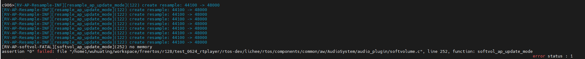

# 内存泄露调试案例

## 问题背景

硬件：R128
软件：FreeRTOS + rtplayer_test(Cedarx)+ AudioSystem

## 问题复现

复现步骤：

1. rtplayer_test /data/boot.mp3
2. 串口输入"l", 循环播放
3. 串口输入"b" , 播放器后台执行

## 具体表现

rtplayer_test 循环播放老化音频十几分钟后，音乐停止播放，报错如下：



## 问题分析

1. 根据上面报错的log,播放停止时，系统内存不足；在老化过程中出现的内存不足，一般是某处存在内存泄漏

2. reboot重启，重新执行老化播放流程，串口执行free命令，观察内存的剩余情况：

首次播放时的内存：

```
c906>free
==> Round [1] <==
Total Heap Size :  1907128 Bytes    ( 1862 KB)
           Free :   547632 Bytes    (  534 KB)
       Min Free :   536208 Bytes    (  523 KB)


      List Task MIN Free Stack(unit: word)
Task          State  Priority  Stack      #
************************************************
Name            State   Pri     HWM     Idx     StkCur          StkBot
adb-shell       X       4       394     44      0x87233a0       0x8722650
AudioDecode     R       4       3872    49      0x874d2c0       0x87459c0
IDLE            R       0       52      2       0x863dfe0       0x863de40
tcpip           B       3       470     12      0x8677ae0       0x8676c30
Demux           B       6       3126    47      0x87333a0       0x872b960
usb-hardware-sc B       6       8018    14      0x871a3a0       0x870a630
adbd-input      B       5       900     24      0x876eb90       0x876cec0
amp-admin       B       6       4002    11      0x8675ab0       0x866dda0
AudioMT2pb      B       4       3882    52      0x8779be0       0x8772050
AudioRender     B       6       3350    50      0x8756950       0x874ed30
amp-ser2        B       6       4006    8       0x865d830       0x8655b00
amp-ser3        B       6       4006    9       0x8665910       0x865dbe0
amp-ser4        B       6       4006    10      0x866d9f0       0x8665cc0
hub-main-thread B       6       8082    13      0x870a2b0       0x86fa620
adbd-shell-ser- B       4       906     45      0x8726330       0x8724660
XPlayer         B       4       3912    48      0x8744e10       0x873d220
AudioMT2        B       4       1907    18      0x873cb00       0x8738e10
RTplayerThread  B       4       3989    51      0x876a630       0x8762980
CLI             B       6       3772    15      0x8722060       0x871a640
Tmr Svc         B       6       374     3       0x863f070       0x863e320
amp-send-task   B       6       930     4       0x8642db0       0x8641070
amp-recv-task   B       6       924     5       0x8644e90       0x8643150
adbd-output     B       5       843     25      0x8770cd0       0x876f060
adb-event       B       5       894     46      0x872a300       0x87286d0
amp-ser0        B       6       4006    6       0x864d670       0x8645940
amp-ser1        B       6       4006    7       0x8655750       0x864da20
```

播放几次后的内存情况：

```language
c906>free
==> Round [1] <==
Total Heap Size :  1907128 Bytes    ( 1862 KB)
           Free :   456992 Bytes    (  446 KB)
       Min Free :   453440 Bytes    (  442 KB)


      List Task MIN Free Stack(unit: word)
Task          State  Priority  Stack      #
************************************************
Name            State   Pri     HWM     Idx     StkCur          StkBot
adb-shell       X       4       394     44      0x87235b0       0x8722650
AudioDecode     R       4       3872    49      0x874d5e0       0x87459c0
IDLE            R       0       52      2       0x863dfe0       0x863de40
tcpip           B       3       458     12      0x8677ae0       0x8676c30
usb-hardware-sc B       6       8018    14      0x871a3a0       0x870a630
adbd-input      B       5       900     24      0x876eb90       0x876cec0
amp-admin       B       6       4002    11      0x8675ab0       0x866dda0
AudioMT2pb      B       4       3882    52      0x8779be0       0x8772050
AudioRender     B       6       3350    50      0x8756950       0x874ed30
CLI             B       6       3772    15      0x8722060       0x871a640
Tmr Svc         B       6       374     3       0x863f070       0x863e320
amp-ser0        B       6       4006    6       0x864d670       0x8645940
amp-ser1        B       6       4006    7       0x8655750       0x864da20
amp-ser2        B       6       4006    8       0x865d830       0x8655b00
amp-ser3        B       6       4006    9       0x8665910       0x865dbe0
amp-ser4        B       6       4006    10      0x866d9f0       0x8665cc0
hub-main-thread B       6       8082    13      0x870a2b0       0x86fa620
XPlayer         B       4       3912    48      0x8744e10       0x873d220
AudioMT2        B       4       1907    18      0x873cb00       0x8738e10
adbd-output     B       5       843     25      0x8770cd0       0x876f060
amp-recv-task   B       6       924     5       0x8644e90       0x8643150
Demux           B       6       3126    47      0x8733150       0x872b960
amp-send-task   B       6       924     4       0x8642db0       0x8641070
adb-event       B       5       890     46      0x872a2a0       0x87286d0
adbd-shell-ser- B       4       906     45      0x8726330       0x8724660
RTplayerThread  B       4       3989    51      0x876a630       0x8762980
```

观察Free项的剩余内存，可发现在老化播放过程中，内存不断减少，存在泄漏。

### 泄漏点定位
可借助memleak工具，定位内存泄漏处。mrtos menuconfig选上memleak

```
-> System components                                                                    
 -> aw components                                                                         
  -> Memleak Components Support   
    [*] Tina RTOS Memleak                    # 使能内存泄露分析工具
    (16)  Tina RTOS Memleak Backtrace Level  # 内存泄露分析栈回溯层数                 
    [ ]   Tina RTOS Double Free Check                                                     
```

memleak用法如下

```language
作用：内存泄露分析
用法：memleak 1 使能内存泄露分析，记录所有内存块申请、释放信息
memleak 0 关闭内存泄露分析，删除所有内存块的申请、释放信息
memleak 1 thread_name1 thread_name2 使能内存泄露分析，记录指定任务的内存块申请、释放信息
```

串口执行memleak 1

音频老化测试（参考复现步骤），音频播放几次后，执行rtpc q 命令退出播放

串口执行memleak 0

关闭内存泄露检测时，会打印可疑的内存泄露点及其回溯信息;

有两个地方：

```
	007: ptr = 0x08760960, size = 0x00000f00, thread = AudioRender
        backtrace : 0x08336AEE
        backtrace : 0x08336B46
        backtrace : 0x08396D52
        backtrace : 0x084B025E
        backtrace : 0x08446856
        backtrace : 0x084496C6
    008: ptr = 0x0875f990, size = 0x00000f00, thread = AudioRender
        backtrace : 0x08336AEE
        backtrace : 0x08336B46
        backtrace : 0x0839757E
        backtrace : 0x084B025E
        backtrace : 0x08446856
        backtrace : 0x084496C6
```

callstack 回溯

```
pvPortMalloc at /workspace/freertos/r128/test_0624_rtplayer/rtos-dev/lichee/rtos/kernel/FreeRTOS-orig/Source/portable/MemMang/heap_4.c:658
pvPortCalloc at /workspace/freertos/r128/test_0624_rtplayer/rtos-dev/lichee/rtos/kernel/FreeRTOS-orig/Source/portable/MemMang/heap_4.c:577
softvol_ap_update_mode at /workspace/freertos/r128/test_0624_rtplayer/rtos-dev/lichee/rtos/components/common/aw/AudioSystem/audio_plugin/softvolume.c:250
_AudioTrackStart at //workspace/rtos-r128/lichee/rtos/components/common/aw/AudioSystem/AudioTrack.c:163
RTSoundDeviceStart at /workspace/codec_lib/cedarx_rtos/temp/rtos_cedarx/cedarx/rtos_out/libcore/playback/src/rtosSoundControl.c:766
startSoundDevice at /workspace/codec_lib/cedarx_rtos/temp/rtos_cedarx/cedarx/rtos_out/libcore/playback/src/audioRenderComponent.c:800
 (inlined by) doRender at /workspace/codec_lib/cedarx_rtos/temp/rtos_cedarx/cedarx/rtos_out/libcore/playback/src/audioRenderComponent.c:942
 (inlined by) doRender at /workspace/codec_lib/cedarx_rtos/temp/rtos_cedarx/cedarx/rtos_out/libcore/playback/src/audioRenderComponent.c:898
```

通过回溯信息，发现在`resample_ap_update_mode`处产生了内存泄漏。

## 根本原因

播放器老化过程中，只调用`AudioTrackCreate`一次，循环播放时会多次调用`_AudioTrackStart`，最后退出播放才调用`AudioTrackDestroy`销毁；所以`softvol_ap_update_mode`这里，老化过程会多次调用到，会有多次分配，但只在退出时`AudioTrackDestroy`里才销毁。

## 解决方法

只在`AudioTrackCreateWithStream`时创建一次，`AudioTrackDestroy`，测试10小时左右未出现内存泄漏
