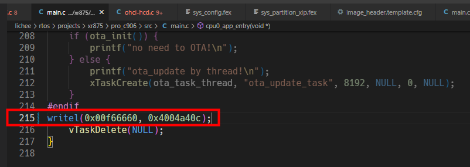
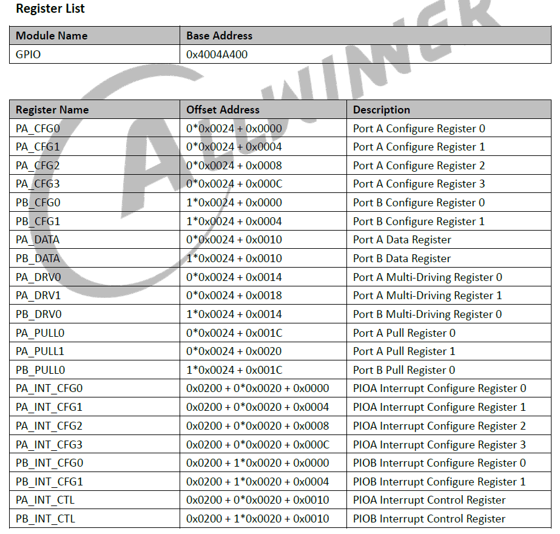
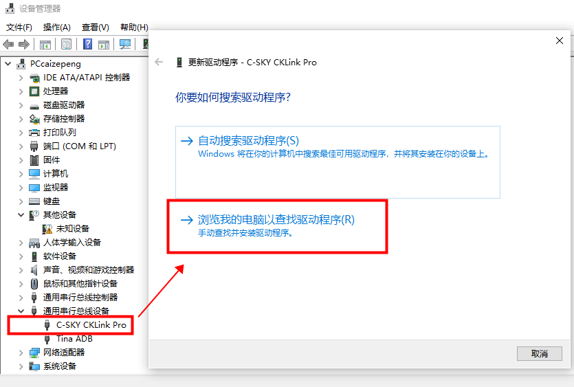
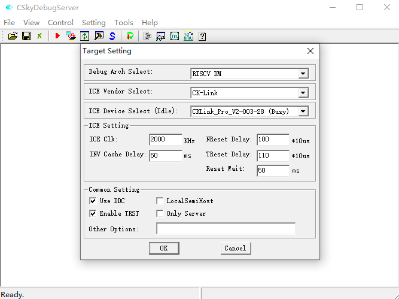
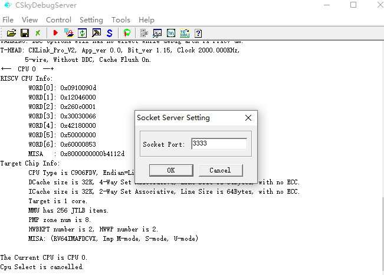
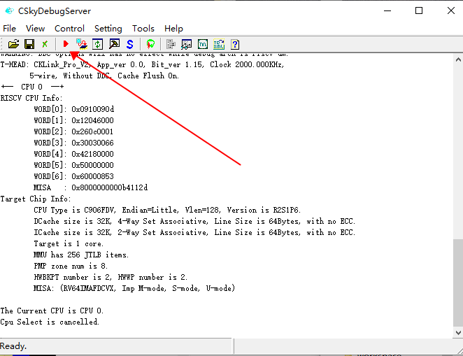
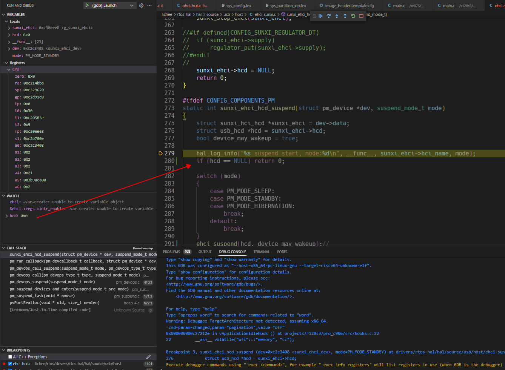

# 使用 VSCode 调试 

## 调试 XuanTie C906 核心

### 准备工具

- T-Head DebugServer（CSkyDebugServer） - 搭建调试服务器
  - 下载地址：[T-Head DebugServer](https://xuantie.t-head.cn/community/download?id=4202772147627692032)
  - 手册：[T-Head Debugger Server User Guide](https://xuantie.t-head.cn/community/download?id=4170589434888130560)
  - 驱动：[cklink_dirvers](https://xuantie.t-head.cn/community/download?id=689487495854817280)
- VSCode - 开发&调试
  - 下载地址：[VSCode](https://code.visualstudio.com/)

### 配置 SDK 启用调试功能

在对应的C906的 `main.c` 函数最后面加上下列代码，配置 GPIO MUX 为 JTAG

```c
writel(0x00f66660, 0x4004a40c);
```



参考手册：



然后编译下载。

### 安装驱动

连接上CKLink，在设备管理器新增的USB设备上->右键->更新驱动程序->浏览我的电脑以查找驱动程序->浏览对应的驱动然后包括子文件夹->然后下一步即可。



### 运行配置CSkyDebugServer

```
CSkyDebugServer->setting->Target Setting
```



```
CSkyDebugServer->setting->Socket Setting
```



### 启动CSkyDebugServer

确保R128正常运行，CKLink 正常连接，点击红色按钮启动调试



此时如果电脑本地上有编译环境，可以使用 `riscv64-unknown-elf-gdb` 进行调试，假设编译获得的文件路径为 `/lichee/rtos/build/r128_module_c906/img/rt_system.elf`，运行命令如下：

```
riscv64-unknown-elf-gdb -ex 'set arch riscv:rv64' -ex 'file ./lichee/rtos/build/r128_module_c906/img/rt_system.elf' -ex 'set remotetimeout 20' -ex 'target remote 127.0.0.1:3333'
```

也可以如下操作

```
riscv64-unknown-elf-gdb ./lichee/rtos/build/r128_module_c906/img/rt_system.elf

控制台界面输入
set remotetimeout 20
target remote :3333
才可以建立连接
```

### 配置 VSCode

配置如下 `.vscode/launch.json` 文件

```json
{
    // Use IntelliSense to learn about possible attributes.
    // Hover to view descriptions of existing attributes.
    // For more information, visit: https://go.microsoft.com/fwlink/?linkid=830387
    "version": "0.2.0",
    "configurations": [
        {
            "name": "(gdb) Launch",
            "type": "cppdbg",
            "request": "launch",
            "program": "${workspaceFolder}/lichee/rtos/build/r128_module_c906/img/rt_system.elf", // 对应板子方案的elf文件
            "args": [],
            "stopAtEntry": false,
            "cwd": "${fileDirname}",
            "environment": [],
            "externalConsole": false,
            "MIMode": "gdb",
            "miDebuggerPath": "${workspaceFolder}/lichee/rtos/tools/riscv64-elf-x86_64-20201104/bin/riscv64-unknown-elf-gdb",
            "miDebuggerServerAddress": "localhost:3333", // 端口号，本文电脑的CSkyDebugServer端口3333
            "setupCommands": [ // 不能省略否则会报错，报错如下
                {
                    "description": "Enable pretty-printing for gdb",
                    "text": "set remotetimeout 20",
                    "ignoreFailures": true
                }
            ]
        }
    ]
}
```
省略后的报错：

```
Remote replied unexpectedly to 'vMustReplyEmpty': PacketSize=1000;QStartNoAckMode+;qThreadExtraInfo+;qXfer:features:read+
```

### 开始调试

点击 VSCode 调试按键，开始调试。


