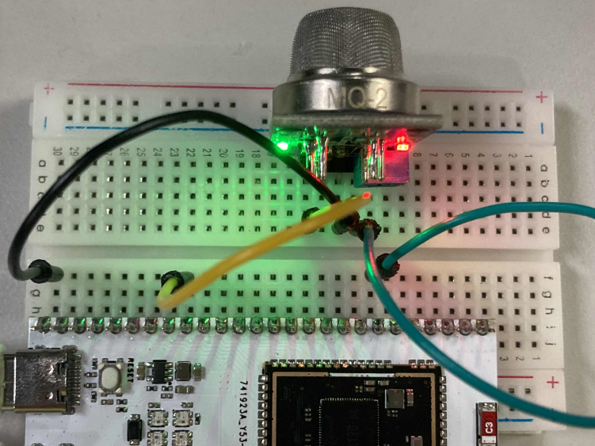
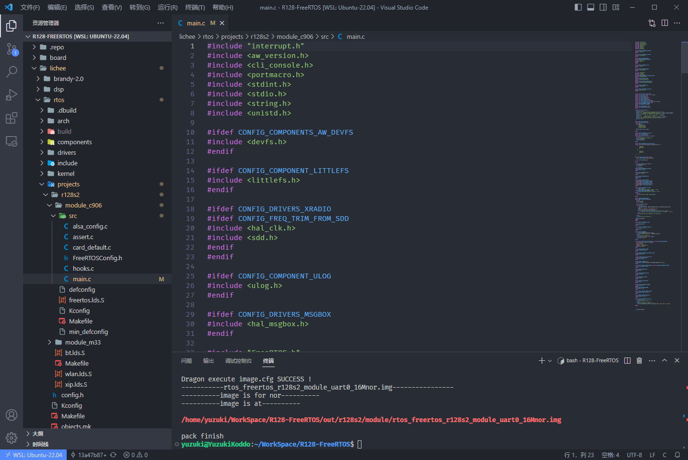

# ADC驱动烟雾传感器

| 本文案例代码 | 下载地址 |
| ---------------------- | -------------------------------------- |
| ADC驱动烟雾传感器案例代码 | https://www.aw-ol.com/downloads?cat=24 |

## 原理介绍

MQ-2型烟雾传感器属于二氧化锡半导体气敏材料，属于表面离子式N型半 导体。当处于200、300℃温度时，二氧化锡吸附空气中的氧，形成氧的负离子吸附，使半导体中的电子密度减少，从而使其电阻值增加。当与烟雾接触时，如果晶粒间界处的势垒受到该烟雾的调制而变化，就会引起表而电导率的变化。利用这一点就可以获得这种烟雾存在的信息，烟雾浓度越大，电导率越大输出电阻越低。MQ2气体传感器可以很灵敏的检测到空气中的烟雾、液化气、丁烷、丙烷、甲烷、酒精、氢气等气体。

首先我们搭建电路，如下：



| 引脚 | 按键     |
| ---- | -------- |
| PB0  | MQ2 AO脚 |
| GND  | MQ2 GND  |
| 3V3  | MQ2 VCC  |

## 载入方案

我们使用的开发板是 R128-Devkit，需要开发 C906 核心的应用程序，所以载入方案选择`r128s2_module_c906`

```bash
$ source envsetup.sh 
$ lunch_rtos 1
```


## 勾选 GPADC 驱动

`mrtos_menuconfig` 找到下列驱动

```
Drivers Options  --->
    soc related device drivers  --->
        GPADC devices --->
            [*] enable gpadc driver
            [*]   enable power protect driver
```


## 编写程序

打开你喜欢的编辑器，修改文件：`lichee/rtos/projects/r128s2/module_c906/src/main.c`



### 引入头文件

```c
#include <sunxi_hal_gpadc.h>
```


由于MQ2是一个加热器驱动的传感器，如果长时间存放，传感器的校准可能会漂移。

长时间存放后首次使用时，传感器必须充分预热24-48小时以确保最大精度。

如果最近使用过传感器，则只需5-10分钟即可完全预热。 在预热期间，传感器读数通常很高，然后逐渐降低直到稳定。

为了实现预热功能，我们先实现一个 `sleep` 函数，等待预热完成再读取 ADC 电压值。

```c
static inline int msleep(int ms) {
    vTaskDelay(ms / portTICK_RATE_MS); 
}
```


## ADC 功能配置

#### GPADC 初始化接口

GPADC 模块初始化，主要初始化时钟，中断以及采样率配置等，这里我们初始化并检查即可。

```c
int hal_gpadc_init(void)
```

#### GPADC 通道初始化

选择并配置 GPADC 某个通道，这里配置初始化0通道。

```c
hal_gpadc_channel_init(0);
```

#### GPADC 读取电压接口

读取0通道的ADC电压数据。

```c
ret = gpadc_read_channel_data(0)
```

### 完整代码如下

```c
// 预热模块
msleep(20000);

// 初始化 GPADC
if(hal_gpadc_init() != 0){
    printf("ADC Init failed!\n");
}

// 初始化通道
hal_gpadc_channel_init(0);

// 读取电压
while(1){
    uint32_t vol_data = gpadc_read_channel_data(0);
    printf("channel 0 vol data is %u\n", vol_data);
}

// 释放通道，这里没有用到
hal_gpadc_channel_exit(0);
// 释放GPADC，这里没有用到
hal_gpadc_deinit();
```

## 结果

烧录后可以看到输出的电压值。

