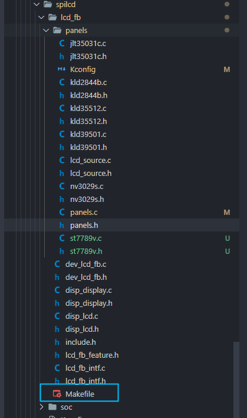
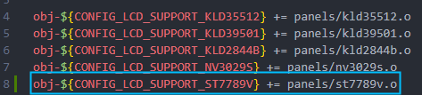

# DBI驱动ST7789V1.3寸LCD

之前介绍了 R128 平台使用 SPI 驱动显示屏 ST7789V1.3寸 LCD，接下来介绍的是使用 DBI 接口驱动。

R128 平台提供了 SPI DBI 的 SPI TFT 接口，具有如下特点：

- Supports DBI Type C 3 Line/4 Line Interface Mode
- Supports 2 Data Lane Interface Mode
- Supports data source from CPU or DMA
- Supports RGB111/444/565/666/888 video format
- Maximum resolution of RGB666 240 x 320@30Hz with single data lane
- Maximum resolution of RGB888 240 x 320@60Hz or 320 x 480@30Hz with dual data lane
- Supports tearing effect
- Supports software flexible control video frame rate

同时，提供了 SPILCD 驱动框架以供 SPI 屏幕使用。

此次适配的SPI屏为 `ZJY130S0800TG01`，使用的是 DBI 进行驱动。

DBI接口的全称是 `Display Bus Serial Interface` ，在显示屏数据手册中，一般会说这是SPI接口，所以有人会误认为SPI屏可以使用 `normal spi` 去直接驱动。

SPI 接口就是俗称的4线模式，这是因为发送数据时需要额外借助`DC`线来区分命令和数据，与`sclk`，`cs`和`sda`共四线。


DBI 分为多种接口，包括

```
0：L3I1
1：L3I2
2：L4I1
3：L4I2
4：D2LI
```

`L3I1`和`L3I2`是三线模式（不需要`DC`脚），区别是读时序，也就是是否需要额外脚来读寄存器。读写时序图如下：

- L3I1写时序

]

- L3I1读时序


`L4I1`和`L4I2`是四线模式，与spi接口协议一样，区别是DC脚的控制是否自动化控制，另外I2和I1的区别是读时序，也就是否需要额外脚来读取寄存器。
- L4I写时序


- L4I读时序


`D2LI`是两data lane模式。发送命令部分时序与读时序与`L3I1`一致，下图是发送数据时的时序，不同像素格式时钟周期数量不一样。
- D2LI写时序


可以知道，在3线模式时，发送命令前有1位A0用于指示当前发送的是数据，还是命令。而命令后面接着的数据就没有这个A0位了，代表 SPI 需要在 9 位和 8 位之间来回切换，而在读数据时，更是需要延时 `dummy clock` 才能读数据，`normal spi` 都很难，甚至无法实现。所以 `normal spi` 只能模拟 4 线的 DBI 的写操作。读操作只能通过模拟IO来实现。

对于R128这类支持 DBI 接口的CPU，可以选择不去了解 SPI。直接选用 DBI 来驱动屏幕。由于不需要模拟延时和切换数据，屏幕驱动效率将有明显提升。


引脚配置如下：

| R128 Devkit | TFT 模块 |
| :---------- | :------- |
| PA12        | CS       |
| PA13        | SCL      |
| PA18        | SDA      |
| PA9         | BLK      |
| PA20        | RES      |
| PA19        | DC       |
| 3V3         | VCC      |
| GND         | GND      |

## 载入方案

我们使用的开发板是 R128-Devkit，需要开发 C906 核心的应用程序，所以载入方案选择 `r128s2_module_c906`

```bash
$ source envsetup.sh 
$ lunch_rtos 1
```


## 设置 DBI 驱动

屏幕使用的是SPI驱动，所以需要勾选SPI驱动，运行 `mrtos_menuconfig` 进入配置页面。前往下列地址找到 `SPI Devices`

```c
Drivers Options  --->
    soc related device drivers  --->
        DBI Devices --->
        -*- enable dbi driver
```


### 配置 SPI 引脚

DBI同样使用 SPI 控制器，所以需要配置SPI的相关配置。打开你喜欢的编辑器，修改文件：`board/r128s2/module/configs/sys_config.fex`，在这里我们不需要用到SPI WP引脚，注释掉即可。SPI HOLD 需要作为 DC 脚接入LCD模块。

```
;----------------------------------------------------------------------------------
;SPI controller configuration
;----------------------------------------------------------------------------------
;Please config spi in dts
[spi1]
spi1_used       = 1
spi1_cs_number  = 1
spi1_cs_bitmap  = 1
spi1_cs0        = port:PA12<6><0><3><default>
spi1_sclk       = port:PA13<6><0><3><default>
spi1_mosi       = port:PA18<6><0><3><default>
spi1_miso       = port:PA21<6><0><3><default>
spi1_hold       = port:PA19<6><0><2><default>
;spi1_wp         = port:PA20<6><0><2><default>
```


## 设置 PWM 驱动

屏幕背光使用的是PWM驱动，所以需要勾选PWM驱动，运行 `mrtos_menuconfig` 进入配置页面。前往下列地址找到 `PWM Devices`

```
Drivers Options  --->
    soc related device drivers  --->
        PWM Devices --->
        -*- enable pwm driver
```


### 配置 PWM 引脚

打开你喜欢的编辑器，修改文件：`board/r128s2/module/configs/sys_config.fex`，增加 PWM1 节点

```
[pwm1]
pwm_used        = 1
pwm_positive    = port:PA9<4><0><3><default>
```


## 设置 SPI LCD 驱动

SPI LCD 由专门的驱动管理。运行 `mrtos_menuconfig` 进入配置页面。前往下列地址找到 `SPILCD Devices` ，注意同时勾选 `spilcd hal APIs test` 方便测试使用。

```
Drivers Options  --->
    soc related device drivers  --->
        [*] DISP Driver Support(spi_lcd)
        [*]   spilcd hal APIs test
```


## 编写 SPI LCD 显示屏驱动

### 获取屏幕初始化序列

首先询问屏厂提供驱动源码


找到 LCD 的初始化序列代码


找到屏幕初始化的源码


整理后的初始化代码如下：

```c
LCD_WR_REG(0x11); // Sleep out 
delay_ms(120);    // Delay 120ms 
//************* Start Initial Sequence **********// 
LCD_WR_REG(0x36);
LCD_WR_DATA8(0x00);

LCD_WR_REG(0x3A);     
LCD_WR_DATA8(0x05);   

LCD_WR_REG(0xB2);     
LCD_WR_DATA8(0x1F);   
LCD_WR_DATA8(0x1F);   
LCD_WR_DATA8(0x00);   
LCD_WR_DATA8(0x33);   
LCD_WR_DATA8(0x33);   

LCD_WR_REG(0xB7);     
LCD_WR_DATA8(0x35);   

LCD_WR_REG(0xBB);     
LCD_WR_DATA8(0x20);   // 2b

LCD_WR_REG(0xC0);     
LCD_WR_DATA8(0x2C);   

LCD_WR_REG(0xC2);     
LCD_WR_DATA8(0x01);   

LCD_WR_REG(0xC3);     
LCD_WR_DATA8(0x01);   

LCD_WR_REG(0xC4);     
LCD_WR_DATA8(0x18);   // VDV, 0x20:0v

LCD_WR_REG(0xC6);     
LCD_WR_DATA8(0x13);   // 0x13:60Hz   

LCD_WR_REG(0xD0);     
LCD_WR_DATA8(0xA4);   
LCD_WR_DATA8(0xA1);   

LCD_WR_REG(0xD6);     
LCD_WR_DATA8(0xA1);   // sleep in后，gate输出为GND

LCD_WR_REG(0xE0);     
LCD_WR_DATA8(0xF0);   
LCD_WR_DATA8(0x04);   
LCD_WR_DATA8(0x07);   
LCD_WR_DATA8(0x04);   
LCD_WR_DATA8(0x04);   
LCD_WR_DATA8(0x04);   
LCD_WR_DATA8(0x25);   
LCD_WR_DATA8(0x33);   
LCD_WR_DATA8(0x3C);   
LCD_WR_DATA8(0x36);   
LCD_WR_DATA8(0x14);   
LCD_WR_DATA8(0x12);   
LCD_WR_DATA8(0x29);   
LCD_WR_DATA8(0x30);   

LCD_WR_REG(0xE1);     
LCD_WR_DATA8(0xF0);   
LCD_WR_DATA8(0x02);   
LCD_WR_DATA8(0x04);   
LCD_WR_DATA8(0x05);   
LCD_WR_DATA8(0x05);   
LCD_WR_DATA8(0x21);   
LCD_WR_DATA8(0x25);   
LCD_WR_DATA8(0x32);   
LCD_WR_DATA8(0x3B);   
LCD_WR_DATA8(0x38);   
LCD_WR_DATA8(0x12);   
LCD_WR_DATA8(0x14);   
LCD_WR_DATA8(0x27);   
LCD_WR_DATA8(0x31);   

LCD_WR_REG(0xE4);     
LCD_WR_DATA8(0x1D);   // 使用240根gate  (N+1)*8
LCD_WR_DATA8(0x00);   // 设定gate起点位置
LCD_WR_DATA8(0x00);   // 当gate没有用完时，bit4(TMG)设为0

LCD_WR_REG(0x21);     

LCD_WR_REG(0x29);     
```

### 用现成驱动改写 SPI LCD 驱动

选择一个现成的 SPI LCD 改写即可，这里选择 `nv3029s.c` 驱动来修改


复制这两个驱动，重命名为 `st7789v.c`


先编辑 `st7789v.h` 将 `nv3029s` 改成 `st7789v`


```c
#ifndef _ST7789V_H
#define _ST7789V_H

#include "panels.h"

struct __lcd_panel st7789v_panel;

#endif /*End of file*/
```

编辑 `st7789v.c` 将 `nv3029s` 改成 `st7789v`


### 编写初始化序列

先删除 `static void LCD_panel_init(unsigned int sel)` 中的初始化函数。


然后将屏厂提供的初始化序列复制进来


然后按照 `spi_lcd` 框架的接口改写驱动接口，具体接口如下

| 屏厂函数       | SPILCD框架接口         |
| :------------- | :--------------------- |
| `LCD_WR_REG`   | `sunxi_lcd_cmd_write`  |
| `LCD_WR_DATA8` | `sunxi_lcd_para_write` |
| `delay_ms`     | `sunxi_lcd_delay_ms`   |

可以直接进行替换


完成后如下


然后对照屏厂提供的驱动修改 `address` 函数


做如下修改

```c
static void address(unsigned int sel, int x, int y, int width, int height)
{
	sunxi_lcd_cmd_write(sel, 0x2B); /* Set row address */
	sunxi_lcd_para_write(sel, (y >> 8) & 0xff);
	sunxi_lcd_para_write(sel, y & 0xff);
	sunxi_lcd_para_write(sel, (height >> 8) & 0xff);
	sunxi_lcd_para_write(sel, height & 0xff);
	sunxi_lcd_cmd_write(sel, 0x2A); /* Set coloum address */
	sunxi_lcd_para_write(sel, (x >> 8) & 0xff);
	sunxi_lcd_para_write(sel, x & 0xff);
	sunxi_lcd_para_write(sel, (width >> 8) & 0xff);
	sunxi_lcd_para_write(sel, width & 0xff);
	sunxi_lcd_cmd_write(sel, 0x2c);
}
```

完成驱动如下

```c
#include "st7789v.h"

static void LCD_power_on(u32 sel);
static void LCD_power_off(u32 sel);
static void LCD_bl_open(u32 sel);
static void LCD_bl_close(u32 sel);
static void LCD_panel_init(u32 sel);
static void LCD_panel_exit(u32 sel);
#define RESET(s, v) sunxi_lcd_gpio_set_value(s, 0, v)
#define power_en(sel, val) sunxi_lcd_gpio_set_value(sel, 0, val)

static struct disp_panel_para info[LCD_FB_MAX];

static void address(unsigned int sel, int x, int y, int width, int height)
{
	sunxi_lcd_cmd_write(sel, 0x2B); /* Set row address */
	sunxi_lcd_para_write(sel, (y >> 8) & 0xff);
	sunxi_lcd_para_write(sel, y & 0xff);
	sunxi_lcd_para_write(sel, (height >> 8) & 0xff);
	sunxi_lcd_para_write(sel, height & 0xff);
	sunxi_lcd_cmd_write(sel, 0x2A); /* Set coloum address */
	sunxi_lcd_para_write(sel, (x >> 8) & 0xff);
	sunxi_lcd_para_write(sel, x & 0xff);
	sunxi_lcd_para_write(sel, (width >> 8) & 0xff);
	sunxi_lcd_para_write(sel, width & 0xff);
	sunxi_lcd_cmd_write(sel, 0x2c);
}

static void LCD_panel_init(unsigned int sel)
{
	if (bsp_disp_get_panel_info(sel, &info[sel])) {
		lcd_fb_wrn("get panel info fail!\n");
		return;
	}

	sunxi_lcd_cmd_write(sel, 0x11); // Sleep out 
	sunxi_lcd_delay_ms(120);    // Delay 120ms 
	//************* Start Initial Sequence **********// 
	sunxi_lcd_cmd_write(sel, 0x36);
	sunxi_lcd_para_write(sel, 0x00);

	sunxi_lcd_cmd_write(sel, 0x3A);     
	sunxi_lcd_para_write(sel, 0x05);   

	sunxi_lcd_cmd_write(sel, 0xB2);     
	sunxi_lcd_para_write(sel, 0x1F);   
	sunxi_lcd_para_write(sel, 0x1F);   
	sunxi_lcd_para_write(sel, 0x00);   
	sunxi_lcd_para_write(sel, 0x33);   
	sunxi_lcd_para_write(sel, 0x33);   

	sunxi_lcd_cmd_write(sel, 0xB7);     
	sunxi_lcd_para_write(sel, 0x35);   

	sunxi_lcd_cmd_write(sel, 0xBB);     
	sunxi_lcd_para_write(sel, 0x20);   // 2b

	sunxi_lcd_cmd_write(sel, 0xC0);     
	sunxi_lcd_para_write(sel, 0x2C);   

	sunxi_lcd_cmd_write(sel, 0xC2);     
	sunxi_lcd_para_write(sel, 0x01);   

	sunxi_lcd_cmd_write(sel, 0xC3);     
	sunxi_lcd_para_write(sel, 0x01);   

	sunxi_lcd_cmd_write(sel, 0xC4);     
	sunxi_lcd_para_write(sel, 0x18);   // VDV, 0x20:0v

	sunxi_lcd_cmd_write(sel, 0xC6);     
	sunxi_lcd_para_write(sel, 0x13);   // 0x13:60Hz   

	sunxi_lcd_cmd_write(sel, 0xD0);     
	sunxi_lcd_para_write(sel, 0xA4);   
	sunxi_lcd_para_write(sel, 0xA1);   

	sunxi_lcd_cmd_write(sel, 0xD6);     
	sunxi_lcd_para_write(sel, 0xA1);   // sleep in后，gate输出为GND

	sunxi_lcd_cmd_write(sel, 0xE0);     
	sunxi_lcd_para_write(sel, 0xF0);   
	sunxi_lcd_para_write(sel, 0x04);   
	sunxi_lcd_para_write(sel, 0x07);   
	sunxi_lcd_para_write(sel, 0x04);   
	sunxi_lcd_para_write(sel, 0x04);   
	sunxi_lcd_para_write(sel, 0x04);   
	sunxi_lcd_para_write(sel, 0x25);   
	sunxi_lcd_para_write(sel, 0x33);   
	sunxi_lcd_para_write(sel, 0x3C);   
	sunxi_lcd_para_write(sel, 0x36);   
	sunxi_lcd_para_write(sel, 0x14);   
	sunxi_lcd_para_write(sel, 0x12);   
	sunxi_lcd_para_write(sel, 0x29);   
	sunxi_lcd_para_write(sel, 0x30);   

	sunxi_lcd_cmd_write(sel, 0xE1);     
	sunxi_lcd_para_write(sel, 0xF0);   
	sunxi_lcd_para_write(sel, 0x02);   
	sunxi_lcd_para_write(sel, 0x04);   
	sunxi_lcd_para_write(sel, 0x05);   
	sunxi_lcd_para_write(sel, 0x05);   
	sunxi_lcd_para_write(sel, 0x21);   
	sunxi_lcd_para_write(sel, 0x25);   
	sunxi_lcd_para_write(sel, 0x32);   
	sunxi_lcd_para_write(sel, 0x3B);   
	sunxi_lcd_para_write(sel, 0x38);   
	sunxi_lcd_para_write(sel, 0x12);   
	sunxi_lcd_para_write(sel, 0x14);   
	sunxi_lcd_para_write(sel, 0x27);   
	sunxi_lcd_para_write(sel, 0x31);   

	sunxi_lcd_cmd_write(sel, 0xE4);     
	sunxi_lcd_para_write(sel, 0x1D);   // 使用240根gate  (N+1)*8
	sunxi_lcd_para_write(sel, 0x00);   // 设定gate起点位置
	sunxi_lcd_para_write(sel, 0x00);   // 当gate没有用完时，bit4(TMG)设为0

	sunxi_lcd_cmd_write(sel, 0x21);     

	sunxi_lcd_cmd_write(sel, 0x29);   

	if (info[sel].lcd_x < info[sel].lcd_y)
		address(sel, 0, 0, info[sel].lcd_x - 1, info[sel].lcd_y - 1);
	else
		address(sel, 0, 0, info[sel].lcd_y - 1, info[sel].lcd_x - 1);
}

static void LCD_panel_exit(unsigned int sel)
{
	sunxi_lcd_cmd_write(sel, 0x28);
	sunxi_lcd_delay_ms(20);
	sunxi_lcd_cmd_write(sel, 0x10);
	sunxi_lcd_delay_ms(20);
	sunxi_lcd_pin_cfg(sel, 0);
}

static s32 LCD_open_flow(u32 sel)
{
	lcd_fb_here;
	/* open lcd power, and delay 50ms */
	LCD_OPEN_FUNC(sel, LCD_power_on, 50);
	/* open lcd power, than delay 200ms */
	LCD_OPEN_FUNC(sel, LCD_panel_init, 200);

	LCD_OPEN_FUNC(sel, lcd_fb_black_screen, 50);
	/* open lcd backlight, and delay 0ms */
	LCD_OPEN_FUNC(sel, LCD_bl_open, 0);

	return 0;
}

static s32 LCD_close_flow(u32 sel)
{
	lcd_fb_here;
	/* close lcd backlight, and delay 0ms */
	LCD_CLOSE_FUNC(sel, LCD_bl_close, 50);
	/* open lcd power, than delay 200ms */
	LCD_CLOSE_FUNC(sel, LCD_panel_exit, 10);
	/* close lcd power, and delay 500ms */
	LCD_CLOSE_FUNC(sel, LCD_power_off, 10);

	return 0;
}

static void LCD_power_on(u32 sel)
{
	/* config lcd_power pin to open lcd power0 */
	lcd_fb_here;
	power_en(sel, 1);

	sunxi_lcd_power_enable(sel, 0);

	sunxi_lcd_pin_cfg(sel, 1);
	RESET(sel, 1);
	sunxi_lcd_delay_ms(100);
	RESET(sel, 0);
	sunxi_lcd_delay_ms(100);
	RESET(sel, 1);
}

static void LCD_power_off(u32 sel)
{
	lcd_fb_here;
	/* config lcd_power pin to close lcd power0 */
	sunxi_lcd_power_disable(sel, 0);
	power_en(sel, 0);
}

static void LCD_bl_open(u32 sel)
{
	sunxi_lcd_pwm_enable(sel);
	/* config lcd_bl_en pin to open lcd backlight */
	sunxi_lcd_backlight_enable(sel);
	lcd_fb_here;
}

static void LCD_bl_close(u32 sel)
{
	/* config lcd_bl_en pin to close lcd backlight */
	sunxi_lcd_backlight_disable(sel);
	sunxi_lcd_pwm_disable(sel);
	lcd_fb_here;
}


/* sel: 0:lcd0; 1:lcd1 */
static s32 LCD_user_defined_func(u32 sel, u32 para1, u32 para2, u32 para3)
{
	lcd_fb_here;
	return 0;
}

static int lcd_set_var(unsigned int sel, struct fb_info *p_info)
{
	return 0;
}

static int lcd_set_addr_win(unsigned int sel, int x, int y, int width, int height)
{
	address(sel, x, y, width, height);
	return 0;
}

static int lcd_blank(unsigned int sel, unsigned int en)
{
	return 0;
}

struct __lcd_panel st7789v_panel = {
    /* panel driver name, must mach the name of lcd_drv_name in sys_config.fex
       */
	.name = "st7789v",
	.func = {
		.cfg_open_flow = LCD_open_flow,
		.cfg_close_flow = LCD_close_flow,
		.lcd_user_defined_func = LCD_user_defined_func,
		.blank = lcd_blank,
		.set_var = lcd_set_var,
		.set_addr_win = lcd_set_addr_win,
	},
};
```

### 对接驱动框架

完成了屏幕驱动的编写，接下来需要对接到 SPILCD 驱动框架。首先编辑 `Kconfig`


增加 `st7789v` 的配置


```
config LCD_SUPPORT_ST7789V
    bool "LCD support st7789v panel"
    default n
    ---help---
        If you want to support st7789v panel for display driver, select it.
```

然后编辑 `panels.c` 在 `panel_array` 里增加 `st7789` 驱动的引用


如下图


```c
#ifdef CONFIG_LCD_SUPPORT_ST7789V
    &st7789v_panel,
#endif
```

之后编辑 `panels.h` 同样增加引用


如下图


```c
#ifdef CONFIG_LCD_SUPPORT_ST7789V
extern struct __lcd_panel st7789v_panel;
#endif
```

最后编辑外层的 `Makefile` 增加编译选项



如下所示



```c
obj-${CONFIG_LCD_SUPPORT_ST7789V} += panels/st7789v.o
```

### 选择 ST7789V 驱动

在 SPILCD 驱动选择界面可以看到 `LCD_FB panels select` 选择 SPI 屏幕的驱动

进入 `LCD_FB panels select` 选项


选择并勾选 `[*] LCD support st7789v panel`


### 配置 SPI LCD 引脚

这里是重点部分：打开你喜欢的编辑器，修改文件：`board/r128s2/module/configs/sys_config.fex`

```
[lcd_fb0]
lcd_used            = 1   
lcd_model_name      = "spilcd"   
lcd_driver_name     = "st7789v" 
; 屏幕规格配置
lcd_x               = 240
lcd_y               = 240  
lcd_width           = 48
lcd_height          = 48
; SPI 速率
lcd_data_speed      = 50
; PWM 背光配置项
lcd_pwm_used        = 1
lcd_pwm_ch          = 1
lcd_pwm_freq        = 5000 
lcd_pwm_pol         = 0 
lcd_backlight       = 100
; 配置 lcd_if = 1 为 DBI 模式，双缓冲
lcd_if              = 1
fb_buffer_num       = 2
; 配置屏幕传输数据的像素格式，这里是 LCDFB_FORMAT_RGB_565
lcd_pixel_fmt       = 10
; 配置 DBI 接口像素格式，这里是 RGB565
lcd_dbi_fmt         = 2
; 配置 DBI 时钟的行为模式，这里是自动停止模式。有数据就有时钟，没发数据就没有时钟
lcd_dbi_clk_mode    = 0
; 屏幕没有 TE 脚，配置 TE 为 0
lcd_dbi_te          = 0
; 配置屏幕 DBI 格式 L4I1
lcd_dbi_if          = 2
; 输入图像数据 RGB 顺序识别设置，这里配置是 RGB 格式
lcd_rgb_order       = 0
; 设置屏的刷新率，单位Hz。当lcd_dbi_te使能时，这个值设置无效。
lcd_fps             = 60
; 使用 SPI1 作为通讯接口
lcd_spi_bus_num     = 1
lcd_frm             = 2
lcd_gamma_en        = 1

lcd_power_num       = 0
lcd_gpio_regu_num   = 0
lcd_bl_percent_num  = 0

;RESET Pin
lcd_gpio_0          = port:PA20<1><0><2><0>
```

## 编译打包

运行命令 `mp` 编译打包，可以看到编译了 `st7789v.o`


## 测试

烧录启动之后，屏幕背光启动，但是屏幕全黑。


输入 `test_spilcd` ，屏幕显示蓝色。


输入 `lv_examples 1` 可以显示 `lvgl` 界面


## 常见问题

### LVGL 颜色异常

这是由于 LVGL 配置的 `LV_COLOR_DEPTH` 为 32，但是 SPI 屏配置为16位。请修改 `lv_conf.h`，也请注意 `LV_COLOR_16_SWAP` 仅有 SPI 需要设置为 1，在使用 DBI 驱动的时候不需要配置为 1。


### 出现部分花屏


- 检查 `address` 函数是否正确
- 检查 `sys_config.fex` 屏幕配置分辨率是否正确

### SPI LCD 颜色相关问题

首先，得先确定显示屏使用的是SPI接口，还是DBI接口，不同的接口，输入数据的解析方式是不一样的。

DBI接口的全称是 `Display Bus Serial Interface` ，在显示屏数据手册中，一般会说这是SPI接口，所以有人会误认为SPI屏可以使用 `normal spi` 去直接驱动。

阅读`lcd_dbi_if`部分的介绍可以知道，在3线模式时，发送命令前有1位A0用于指示当前发送的是数据，还是命令。而命令后面接着的数据就没有这个A0位了，代表SPI需要在9位和8位之间来回切换，而在读数据时，更是需要延时 `dummy clock` 才能读数据，`normal spi` 都很难，甚至无法实现。所以 `normal spi` 只能模拟4 线的DBI的写操作。

对于R128这类支持DBI接口的CPU，可以选择不去了解SPI。如果需要用到SPI去驱动显示屏，必须把显示屏设置成小端。

#### RGB565和RGB666

SPI显示屏一般支持RGB444,RGB565和RGB666，RGB444使用的比较少，所以只讨论RGB565和RGB666.

RGB565代表一个点的颜色由2字节组成，也就是R（红色）用5位表示，G（绿色）用6位表示，B（蓝色）用5位表示，如下图所示：


RGB666一个点的颜色由3字节组成，每个字节代表一个颜色，其中每个字节的低2位会无视，如下图所示：


#### SPI 接口

因为SPI接口的通讯效率不高，所以建议使用RGB565的显示，以 `jlt35031c` 显示屏为例，他的显示驱动芯片是 `ST7789v`，设置显示格式的方式是往 `3a` 寄存器写入`0x55（RGB565`）或者 `0x66（RGB666）`，在 `R128SDK` 中，已经把 `jlt35031c` 的通讯格式写死为 `0x55`，`lcd_pixel_fmt`配置选项无效：

```
sunxi_lcd_cmd_write(sel, 0x3a);
sunxi_lcd_para_write(sel, 0x55);
```

在例程中，输入的数据是 `0xff，0x00，0xff，0x00`，对于SPI接口，是按字节发送。实际上，例程只需要每次发送2字节即可，因为前后发送的都是相同的ff 00，所以没有看出问题。

根据对 `565` 的数据解析，我们拆分 `ff 00` 就可以得到红色分量是 `0b11111`，也就是 `31`，绿色是`0b111000`，也就是 `56`，，蓝色是 `0`.我们等效转换成 `RGB888`，有：

```
R = 31/31*255 = 255
G = 56/63*255 = 226
```

在调色板输入对应颜色，就可以得到黄色


因为 `DBI` 通讯效率较高，所以可以使用 `RGB565` 或者 `RGB666`，使用 `DBI` 接口，也就是 `lcd_if` 设置为`1`时，驱动会根据 `lcd_pixel_fmt` 配置寄存器，以 `SDK` 中的 `kld2844b.c` 为例，这显示屏的显示驱动也是 `ST7789`，但是不同的屏幕，厂家封装时已经限制了通讯方式，所以即使是能使用 DBI 接口的驱动芯片的屏幕，或许也用不了DBI。

```c
sunxi_lcd_cmd_write(sel, 0x3A); /* Interface Pixel Format */
/* 55----RGB565;66---RGB666 */
if (info[sel].lcd_pixel_fmt == LCDFB_FORMAT_RGB_565 ||
    info[sel].lcd_pixel_fmt == LCDFB_FORMAT_BGR_565) {
    sunxi_lcd_para_write(sel, 0x55);
    if (info[sel].lcd_pixel_fmt == LCDFB_FORMAT_RGB_565)
        rotate &= 0xf7;
    else
        rotate |= 0x08;
} else if (info[sel].lcd_pixel_fmt < LCDFB_FORMAT_RGB_888) {
    sunxi_lcd_para_write(sel, 0x66);
    if (info[sel].lcd_pixel_fmt == LCDFB_FORMAT_BGRA_8888 ||
        info[sel].lcd_pixel_fmt == LCDFB_FORMAT_BGRX_8888 ||
        info[sel].lcd_pixel_fmt == LCDFB_FORMAT_ABGR_8888 ||
        info[sel].lcd_pixel_fmt == LCDFB_FORMAT_XBGR_8888) {
        rotate |= 0x08;
    }
} else {
    sunxi_lcd_para_write(sel, 0x66);
}
```

对于 DBI 格式，不再是以字节的形式去解析，而是以字的方式去解析，为了统一，软件已经规定了，`RGB565` 格式时，字大小是2字节，也就是16位，而 `RGB666` 格式时，字大小是4字节，也就是32位。

对于 `RGB565` 格式，同样是设置为 `0xff,0x00`。因为屏幕是大端，而芯片存储方式是小端，所以芯片的 DBI 模块，会自动把数据从新排列，也就是实际上 DBI 发送数据时，会先发送`0x00`，再发送`0xff`，也就是红色分量为0，绿色分量为 `0b000111`，也就是7，蓝色分量是 `0x11111`，也就是31，我们同样转换成RGB888

```
G = 7/63*255 = 28
B= 31/31*255 = 255
```

在调色板上输入，可以得到蓝色。


如果是 `RGB666`，虽然占用的是3个字节，但是没有CPU是3字节对齐的，所以需要一次性输入4字节，然后 DBI 硬件模块，会自动舍弃1个字节，软件同意舍弃了最后一个字节。

依旧以例程为例，例程输入了 `0xff，0x00，0xff，0x00`，为了方便说明，标准为 `0xff(1)，0x00(1)，0xff(2)，0x00(2)`，其中 `0x00(2)`会被舍弃掉，然后发送顺序是`0xff(2)，0x00(1)，0xff(1)`，也就是 `0xff(2)` 是红色分量，`0xff(1)` 是蓝色分量，混合可以得到紫色。

