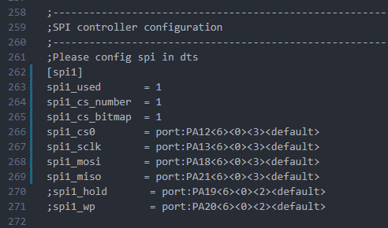
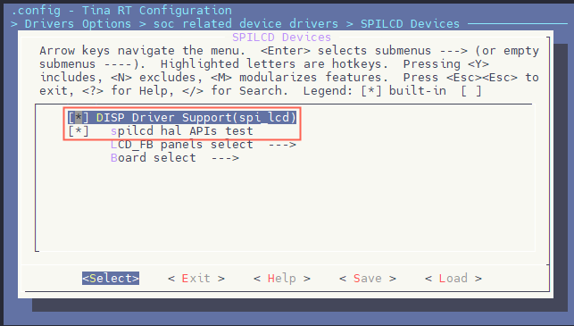
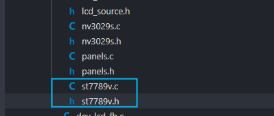
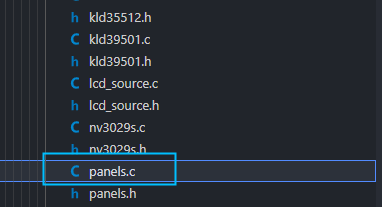

# SPI驱动ST7789V2.4寸LCD

R128 平台提供了 SPI DBI 的 SPI TFT 接口，具有如下特点：

- Supports DBI Type C 3 Line/4 Line Interface Mode
- Supports 2 Data Lane Interface Mode
- Supports data source from CPU or DMA
- Supports RGB111/444/565/666/888 video format
- Maximum resolution of RGB666 240 x 320@30Hz with single data lane
- Maximum resolution of RGB888 240 x 320@60Hz or 320 x 480@30Hz with dual data lane
- Supports tearing effect
- Supports software flexible control video frame rate

同时，提供了 SPILCD 驱动框架以供 SPI 屏幕使用。

此次适配的SPI屏为 `ZJY240S0800TG11`，使用的是 SPI 进行驱动。注意请购买带 CS 引脚的 SPI 屏幕，由于 ST7789v SPI 时序问题，CS 引脚直接接地可能会导致初始化无法写入。如果很不幸SPI TFT是不带 CS 的，请飞线出来连接 CS 引脚（如图所示）


引脚配置如下：

| R128 Devkit | TFT 模块   |
| ----------- | ---------- |
| PA12        | CS（飞线） |
| PA13        | CLK        |
| PA18        | MOSI       |
| PA9         | BLK        |
| PA20        | RES        |
| PA19        | DC         |
| 3V3         | VCC        |
| GND         | GND        |
| 悬空        | MISO       |

## 载入方案

我们使用的开发板是 R128-Devkit，需要开发 C906 核心的应用程序，所以载入方案选择 `r128s2_module_c906`

```bash
$ source envsetup.sh 
$ lunch_rtos 1
```


## 设置 SPI 驱动

屏幕使用的是SPI驱动，所以需要勾选SPI驱动，运行 `mrtos_menuconfig` 进入配置页面。前往下列地址找到 `SPI Devices` 

```c
Drivers Options  --->
    soc related device drivers  --->
        SPI Devices --->
        -*- enable spi driver
```


### 配置 SPI 引脚

打开你喜欢的编辑器，修改文件：`board/r128s2/module/configs/sys_config.fex`，在这里我们不需要用到 SPI HOLD与SPI WP引脚，注释掉即可。

```
;----------------------------------------------------------------------------------
;SPI controller configuration
;----------------------------------------------------------------------------------
;Please config spi in dts
[spi1]
spi1_used       = 1
spi1_cs_number  = 1
spi1_cs_bitmap  = 1
spi1_cs0        = port:PA12<6><0><3><default>
spi1_sclk       = port:PA13<6><0><3><default>
spi1_mosi       = port:PA18<6><0><3><default>
spi1_miso       = port:PA21<6><0><3><default>
;spi1_hold       = port:PA19<6><0><2><default>
;spi1_wp         = port:PA20<6><0><2><default>
```



## 设置 PWM 驱动

屏幕背光使用的是PWM驱动，所以需要勾选PWM驱动，运行 `mrtos_menuconfig` 进入配置页面。前往下列地址找到 `PWM Devices` 

```
Drivers Options  --->
    soc related device drivers  --->
        PWM Devices --->
        -*- enable pwm driver
```


### 配置 PWM 引脚

打开你喜欢的编辑器，修改文件：`board/r128s2/module/configs/sys_config.fex`，增加 PWM1 节点

```
[pwm1]
pwm_used        = 1
pwm_positive    = port:PA9<4><0><3><default>
```


## 设置 SPI LCD 驱动

SPI LCD 由专门的驱动管理。运行 `mrtos_menuconfig` 进入配置页面。前往下列地址找到 `SPILCD Devices` ，注意同时勾选 `spilcd hal APIs test` 方便测试使用。

```
Drivers Options  --->
    soc related device drivers  --->
        [*] DISP Driver Support(spi_lcd)
        [*]   spilcd hal APIs test
```



## 编写 SPI LCD 显示屏驱动

### 获取屏幕初始化序列

首先询问屏厂提供驱动源码


找到 LCD 的初始化序列代码


找到屏幕初始化的源码


整理后的初始化代码如下：

```c
LCD_WR_REG(0x11);
delay_ms(120); // Delay 120ms

// display and color format setting
LCD_WR_REG(0X36);
LCD_WR_DATA8(0x00);
LCD_WR_REG(0X3A);
LCD_WR_DATA8(0X05);

// ST7789S Frame rate setting
LCD_WR_REG(0xb2);
LCD_WR_DATA8(0x0c);
LCD_WR_DATA8(0x0c);
LCD_WR_DATA8(0x00);
LCD_WR_DATA8(0x33);
LCD_WR_DATA8(0x33);
LCD_WR_REG(0xb7);
LCD_WR_DATA8(0x35);

// ST7789S Power setting
LCD_WR_REG(0xbb);
LCD_WR_DATA8(0x35);
LCD_WR_REG(0xc0);
LCD_WR_DATA8(0x2c);
LCD_WR_REG(0xc2);
LCD_WR_DATA8(0x01);
LCD_WR_REG(0xc3);
LCD_WR_DATA8(0x13);
LCD_WR_REG(0xc4);
LCD_WR_DATA8(0x20);
LCD_WR_REG(0xc6);
LCD_WR_DATA8(0x0f);
LCD_WR_REG(0xca);
LCD_WR_DATA8(0x0f);
LCD_WR_REG(0xc8);
LCD_WR_DATA8(0x08);
LCD_WR_REG(0x55);
LCD_WR_DATA8(0x90);
LCD_WR_REG(0xd0);
LCD_WR_DATA8(0xa4);
LCD_WR_DATA8(0xa1);

// ST7789S gamma setting
LCD_WR_REG(0xe0);
LCD_WR_DATA8(0xd0);
LCD_WR_DATA8(0x00);
LCD_WR_DATA8(0x06);
LCD_WR_DATA8(0x09);
LCD_WR_DATA8(0x0b);
LCD_WR_DATA8(0x2a);
LCD_WR_DATA8(0x3c);
LCD_WR_DATA8(0x55);
LCD_WR_DATA8(0x4b);
LCD_WR_DATA8(0x08);
LCD_WR_DATA8(0x16);
LCD_WR_DATA8(0x14);
LCD_WR_DATA8(0x19);
LCD_WR_DATA8(0x20);
LCD_WR_REG(0xe1);
LCD_WR_DATA8(0xd0);
LCD_WR_DATA8(0x00);
LCD_WR_DATA8(0x06);
LCD_WR_DATA8(0x09);
LCD_WR_DATA8(0x0b);
LCD_WR_DATA8(0x29);
LCD_WR_DATA8(0x36);
LCD_WR_DATA8(0x54);
LCD_WR_DATA8(0x4b);
LCD_WR_DATA8(0x0d);
LCD_WR_DATA8(0x16);
LCD_WR_DATA8(0x14);
LCD_WR_DATA8(0x21);
LCD_WR_DATA8(0x20);
LCD_WR_REG(0x29);
```

### 用现成驱动改写 SPI LCD 驱动

选择一个现成的 SPI LCD 改写即可，这里选择 `nv3029s.c` 驱动来修改


复制这两个驱动，重命名为 `st7789v.c`



先编辑 `st7789v.h` 将 `nv3029s` 改成 `st7789v`


```c
#ifndef _ST7789V_H
#define _ST7789V_H

#include "panels.h"

struct __lcd_panel st7789v_panel;

#endif /*End of file*/
```

编辑 `st7789v.c` 将 `nv3029s` 改成 `st7789v`


### 编写初始化序列

先删除 `static void LCD_panel_init(unsigned int sel)` 中的初始化函数。


然后将屏厂提供的初始化序列复制进来


然后按照 `spi_lcd` 框架的接口改写驱动接口，具体接口如下

| 屏厂函数       | SPILCD框架接口         |
| -------------- | ---------------------- |
| `LCD_WR_REG`   | `sunxi_lcd_cmd_write`  |
| `LCD_WR_DATA8` | `sunxi_lcd_para_write` |
| `delay_ms`     | `sunxi_lcd_delay_ms`   |


完成驱动如下

```c
#include "st7789v.h"

static void LCD_power_on(u32 sel);
static void LCD_power_off(u32 sel);
static void LCD_bl_open(u32 sel);
static void LCD_bl_close(u32 sel);
static void LCD_panel_init(u32 sel);
static void LCD_panel_exit(u32 sel);
#define RESET(s, v) sunxi_lcd_gpio_set_value(s, 0, v)
#define power_en(sel, val) sunxi_lcd_gpio_set_value(sel, 0, val)

static struct disp_panel_para info[LCD_FB_MAX];

static void address(unsigned int sel, int x, int y, int width, int height)
{
	sunxi_lcd_cmd_write(sel, 0x2B); /* Set row address */
	sunxi_lcd_para_write(sel, (y >> 8) & 0xff);
	sunxi_lcd_para_write(sel, y & 0xff);
	sunxi_lcd_para_write(sel, (height >> 8) & 0xff);
	sunxi_lcd_para_write(sel, height & 0xff);
	sunxi_lcd_cmd_write(sel, 0x2A); /* Set coloum address */
	sunxi_lcd_para_write(sel, (x >> 8) & 0xff);
	sunxi_lcd_para_write(sel, x & 0xff);
	sunxi_lcd_para_write(sel, (width >> 8) & 0xff);
	sunxi_lcd_para_write(sel, width & 0xff);
	sunxi_lcd_cmd_write(sel, 0x2c);
}

static void LCD_panel_init(unsigned int sel)
{
	if (bsp_disp_get_panel_info(sel, &info[sel])) {
		lcd_fb_wrn("get panel info fail!\n");
		return;
	}

	sunxi_lcd_cmd_write(sel, 0x11);
	sunxi_lcd_delay_ms(120);

	/* display and color format setting */
	sunxi_lcd_cmd_write(sel, 0X36);
	sunxi_lcd_para_write(sel, 0x00);
	sunxi_lcd_cmd_write(sel, 0X3A);
	sunxi_lcd_para_write(sel, 0X05);

	/* ST7789S Frame rate setting */
	sunxi_lcd_cmd_write(sel, 0xb2);
	sunxi_lcd_para_write(sel, 0x0c);
	sunxi_lcd_para_write(sel, 0x0c);
	sunxi_lcd_para_write(sel, 0x00);
	sunxi_lcd_para_write(sel, 0x33);
	sunxi_lcd_para_write(sel, 0x33);
	sunxi_lcd_cmd_write(sel, 0xb7);
	sunxi_lcd_para_write(sel, 0x35);

	/* ST7789S Power setting */
	sunxi_lcd_cmd_write(sel, 0xbb);
	sunxi_lcd_para_write(sel, 0x35);
	sunxi_lcd_cmd_write(sel, 0xc0);
	sunxi_lcd_para_write(sel, 0x2c);
	sunxi_lcd_cmd_write(sel, 0xc2);
	sunxi_lcd_para_write(sel, 0x01);
	sunxi_lcd_cmd_write(sel, 0xc3);
	sunxi_lcd_para_write(sel, 0x13);
	sunxi_lcd_cmd_write(sel, 0xc4);
	sunxi_lcd_para_write(sel, 0x20);
	sunxi_lcd_cmd_write(sel, 0xc6);
	sunxi_lcd_para_write(sel, 0x0f);
	sunxi_lcd_cmd_write(sel, 0xca);
	sunxi_lcd_para_write(sel, 0x0f);
	sunxi_lcd_cmd_write(sel, 0xc8);
	sunxi_lcd_para_write(sel, 0x08);
	sunxi_lcd_cmd_write(sel, 0x55);
	sunxi_lcd_para_write(sel, 0x90);
	sunxi_lcd_cmd_write(sel, 0xd0);
	sunxi_lcd_para_write(sel, 0xa4);
	sunxi_lcd_para_write(sel, 0xa1);

	/* ST7789S gamma setting */
	sunxi_lcd_cmd_write(sel, 0xe0);
	sunxi_lcd_para_write(sel, 0xd0);
	sunxi_lcd_para_write(sel, 0x00);
	sunxi_lcd_para_write(sel, 0x06);
	sunxi_lcd_para_write(sel, 0x09);
	sunxi_lcd_para_write(sel, 0x0b);
	sunxi_lcd_para_write(sel, 0x2a);
	sunxi_lcd_para_write(sel, 0x3c);
	sunxi_lcd_para_write(sel, 0x55);
	sunxi_lcd_para_write(sel, 0x4b);
	sunxi_lcd_para_write(sel, 0x08);
	sunxi_lcd_para_write(sel, 0x16);
	sunxi_lcd_para_write(sel, 0x14);
	sunxi_lcd_para_write(sel, 0x19);
	sunxi_lcd_para_write(sel, 0x20);
	sunxi_lcd_cmd_write(sel, 0xe1);
	sunxi_lcd_para_write(sel, 0xd0);
	sunxi_lcd_para_write(sel, 0x00);
	sunxi_lcd_para_write(sel, 0x06);
	sunxi_lcd_para_write(sel, 0x09);
	sunxi_lcd_para_write(sel, 0x0b);
	sunxi_lcd_para_write(sel, 0x29);
	sunxi_lcd_para_write(sel, 0x36);
	sunxi_lcd_para_write(sel, 0x54);
	sunxi_lcd_para_write(sel, 0x4b);
	sunxi_lcd_para_write(sel, 0x0d);
	sunxi_lcd_para_write(sel, 0x16);
	sunxi_lcd_para_write(sel, 0x14);
	sunxi_lcd_para_write(sel, 0x21);
	sunxi_lcd_para_write(sel, 0x20);
	sunxi_lcd_cmd_write(sel, 0x29);

	if (info[sel].lcd_x < info[sel].lcd_y)
		address(sel, 0, 0, info[sel].lcd_x - 1, info[sel].lcd_y - 1);
	else
		address(sel, 0, 0, info[sel].lcd_y - 1, info[sel].lcd_x - 1);
}

static void LCD_panel_exit(unsigned int sel)
{
	sunxi_lcd_cmd_write(sel, 0x28);
	sunxi_lcd_delay_ms(20);
	sunxi_lcd_cmd_write(sel, 0x10);
	sunxi_lcd_delay_ms(20);
	sunxi_lcd_pin_cfg(sel, 0);
}

static s32 LCD_open_flow(u32 sel)
{
	lcd_fb_here;
	/* open lcd power, and delay 50ms */
	LCD_OPEN_FUNC(sel, LCD_power_on, 50);
	/* open lcd power, than delay 200ms */
	LCD_OPEN_FUNC(sel, LCD_panel_init, 200);

	LCD_OPEN_FUNC(sel, lcd_fb_black_screen, 50);
	/* open lcd backlight, and delay 0ms */
	LCD_OPEN_FUNC(sel, LCD_bl_open, 0);

	return 0;
}

static s32 LCD_close_flow(u32 sel)
{
	lcd_fb_here;
	/* close lcd backlight, and delay 0ms */
	LCD_CLOSE_FUNC(sel, LCD_bl_close, 50);
	/* open lcd power, than delay 200ms */
	LCD_CLOSE_FUNC(sel, LCD_panel_exit, 10);
	/* close lcd power, and delay 500ms */
	LCD_CLOSE_FUNC(sel, LCD_power_off, 10);

	return 0;
}

static void LCD_power_on(u32 sel)
{
	/* config lcd_power pin to open lcd power0 */
	lcd_fb_here;
	power_en(sel, 1);

	sunxi_lcd_power_enable(sel, 0);

	sunxi_lcd_pin_cfg(sel, 1);
	RESET(sel, 1);
	sunxi_lcd_delay_ms(100);
	RESET(sel, 0);
	sunxi_lcd_delay_ms(100);
	RESET(sel, 1);
}

static void LCD_power_off(u32 sel)
{
	lcd_fb_here;
	/* config lcd_power pin to close lcd power0 */
	sunxi_lcd_power_disable(sel, 0);
	power_en(sel, 0);
}

static void LCD_bl_open(u32 sel)
{
	sunxi_lcd_pwm_enable(sel);
	/* config lcd_bl_en pin to open lcd backlight */
	sunxi_lcd_backlight_enable(sel);
	lcd_fb_here;
}

static void LCD_bl_close(u32 sel)
{
	/* config lcd_bl_en pin to close lcd backlight */
	sunxi_lcd_backlight_disable(sel);
	sunxi_lcd_pwm_disable(sel);
	lcd_fb_here;
}


/* sel: 0:lcd0; 1:lcd1 */
static s32 LCD_user_defined_func(u32 sel, u32 para1, u32 para2, u32 para3)
{
	lcd_fb_here;
	return 0;
}

static int lcd_set_var(unsigned int sel, struct fb_info *p_info)
{
	return 0;
}

static int lcd_set_addr_win(unsigned int sel, int x, int y, int width, int height)
{
	address(sel, x, y, width, height);
	return 0;
}

static int lcd_blank(unsigned int sel, unsigned int en)
{
	return 0;
}

struct __lcd_panel st7789v_panel = {
    /* panel driver name, must mach the name of lcd_drv_name in sys_config.fex
       */
	.name = "st7789v",
	.func = {
		.cfg_open_flow = LCD_open_flow,
		.cfg_close_flow = LCD_close_flow,
		.lcd_user_defined_func = LCD_user_defined_func,
		.blank = lcd_blank,
		.set_var = lcd_set_var,
		.set_addr_win = lcd_set_addr_win,
	},
};
```

### 对接驱动框架

完成了屏幕驱动的编写，接下来需要对接到 SPILCD 驱动框架。首先编辑 `Kconfig` 


增加 `st7789v` 的配置


```
config LCD_SUPPORT_ST7789V
	bool "LCD support st7789v panel"
	default n
	---help---
		If you want to support st7789v panel for display driver, select it.
```

然后编辑 `panels.c` 在 `panel_array` 里增加 `st7789` 驱动的引用



如下图


```c
#ifdef CONFIG_LCD_SUPPORT_ST7789V
	&st7789v_panel,
#endif
```

之后编辑 `panels.h` 同样增加引用


如下图


```c
#ifdef CONFIG_LCD_SUPPORT_ST7789V
extern struct __lcd_panel st7789v_panel;
#endif
```

最后编辑外层的 `Makefile` 增加编译选项

 

如下所示


```c
obj-${CONFIG_LCD_SUPPORT_ST7789V} += panels/st7789v.o
```

### 选择 ST7789V 驱动

在 SPILCD 驱动选择界面可以看到 ` LCD_FB panels select` 选择 SPI 屏幕的驱动

进入 `LCD_FB panels select` 选项


选择并勾选 `[*] LCD support st7789v panel` 


### 配置 SPI LCD 引脚

打开你喜欢的编辑器，修改文件：`board/r128s2/module/configs/sys_config.fex`

```
[lcd_fb0]
lcd_used            = 1   
lcd_model_name      = "spilcd"   
lcd_driver_name     = "st7789v" 
lcd_x               = 240   
lcd_y               = 320  
lcd_width           = 37   
lcd_height          = 48  
lcd_data_speed      = 50
lcd_pwm_used        = 1
lcd_pwm_ch          = 1
lcd_pwm_freq        = 5000 
lcd_pwm_pol         = 0 
lcd_if              = 0
lcd_pixel_fmt       = 11 
lcd_dbi_fmt         = 2
lcd_dbi_clk_mode    = 1
lcd_dbi_te          = 1
fb_buffer_num       = 2
lcd_dbi_if          = 4
lcd_rgb_order       = 0
lcd_fps             = 60
lcd_spi_bus_num     = 1
lcd_frm             = 2
lcd_gamma_en        = 1
lcd_backlight       = 100

lcd_power_num       = 0
lcd_gpio_regu_num   = 0
lcd_bl_percent_num  = 0

lcd_spi_dc_pin      = port:PA19<1><0><3><0>
;RESET Pin
lcd_gpio_0          = port:PA20<1><0><2><0>
```

## 编译打包

运行命令 `mp` 编译打包，可以看到编译了 `st7789v.o`


## 测试

烧录启动之后，屏幕背光启动，但是屏幕全黑。


输入 `test_spilcd` ，屏幕显示黄色。


输入 `lv_examples 1` 可以显示 `lvgl` 界面


## 常见问题

### 屏幕白屏

屏幕白屏，但是背光亮起


白屏是因为屏幕没有初始化，需要检查屏幕初始化序列或者初始化数据是否正确。

### 屏幕花屏

 屏幕花屏，无法控制


花屏一般是因为屏幕初始化后没有正确设置 `addrwin`，或者初始化序列错误。

### LVGL 屏幕颜色不正确

出现反色，颜色异常


请配置 LVGL `LV_COLOR_DEPTH` 参数为 16，`LV_COLOR_16_SWAP` 为 1，这是由 SPI LCD 的特性决定的。


### 显示反色

运行  `test_spilcd` ，屏幕显示蓝色。

这是由于屏幕启动了 RB SWAP，一般是 `0x36` 寄存器修改

正常显示

```
sunxi_lcd_cmd_write(sel, 0X36);
sunxi_lcd_para_write(sel, 0x00);
```

反色显示

```
sunxi_lcd_cmd_write(sel, 0X36);
sunxi_lcd_para_write(sel, 0x08);
```

### LVGL 出现 DMA Over Size


这是由于 LVGL 配置的 `LV_COLOR_DEPTH` 为 32，但是 SPI 屏配置为16位。请修改 `lv_conf.h`


