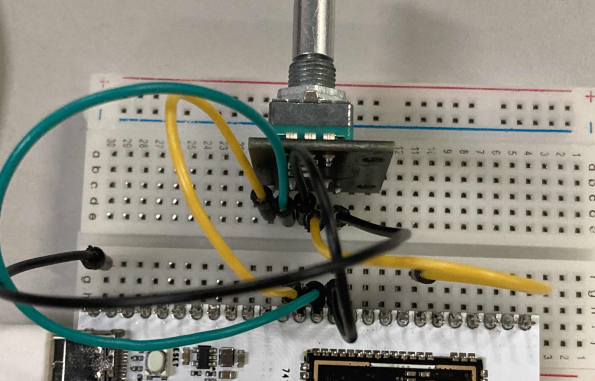
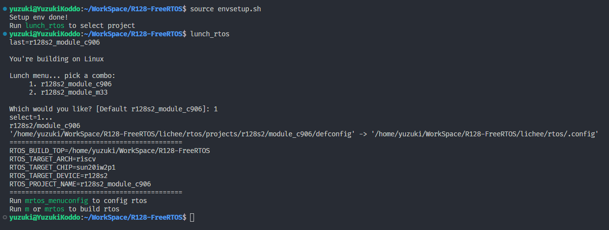
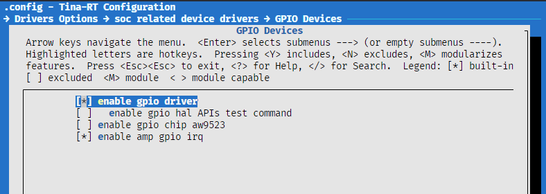
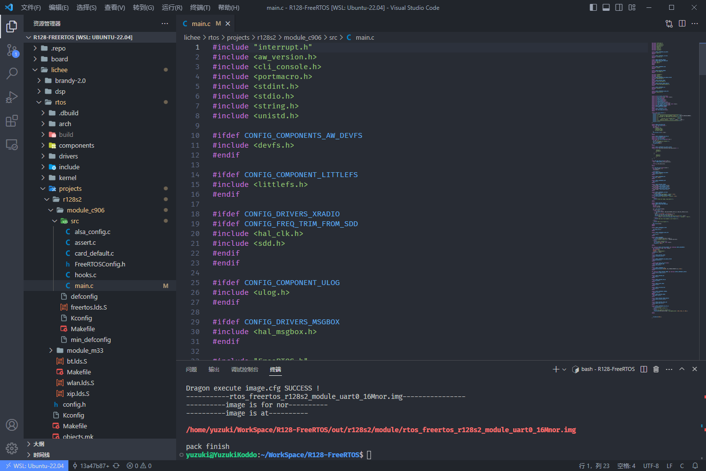
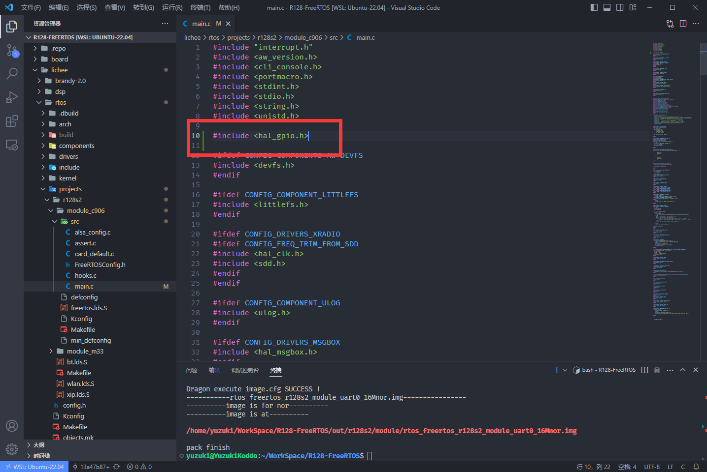
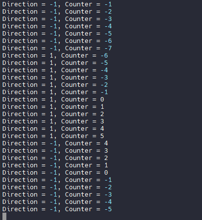

# 中断方式驱动旋转编码器

| 本文案例代码 | 下载地址 |
| ---------------------- | -------------------------------------- |
| 中断方式驱动旋转编码器案例代码 | https://www.aw-ol.com/downloads?cat=24 |

旋转编码器是一种位置传感器，可将旋钮的角位置（旋转）转换为用于确定旋钮旋转方向的输出信号。

由于其坚固性和良好的数字控制；它们被用于许多应用中，包括机器人技术，CNC机器和打印机。

旋转编码器有两种类型-绝对式和增量式。绝对编码器为我们提供旋钮的精确位置（以度为单位），而增量编码器报告轴已移动了多少增量。

编码器内部是一个槽形磁盘，该磁盘连接到公共接地引脚C以及两个接触针A和B。旋转旋钮时，A和B根据旋转旋钮的方向以特定顺序与公共接地引脚C接触。

当它们接触公共接地时，它们会产生信号。当一个引脚先于另一引脚接触时，这些信号就会彼此错开90°。这称为**正交编码**。


顺时针旋转旋钮时，首先连接A引脚，然后连接B引脚。逆时针旋转旋钮时，首先连接B引脚，然后连接A引脚。

通过跟踪每个引脚何时与地面连接或与地面断开，我们可以使用这些信号变化来确定旋钮的旋转方向。您可以通过在A更改状态时观察B的状态来做到这一点。

我们搭建电路，如下：



| 引脚 | 按键                |
| ---- | ------------------- |
| PA24 | 编码器 CLK          |
| PA25 | 编码器 DT           |
| PA29 | 编码器 SW（未使用） |

## 载入方案

我们使用的开发板是 R128-Devkit，需要开发 C906 核心的应用程序，所以载入方案选择`r128s2_module_c906`

```bash
$ source envsetup.sh 
$ lunch_rtos 1
```



## 勾选 GPIO 驱动

`mrtos_menuconfig` 找到下列驱动

```
Drivers Options  --->
    soc related device drivers  --->
            GPIO devices --->
                [*] enable GPIO driver
                [*] enbale GPIO hal APIs Test command
```



## 编写程序

打开你喜欢的编辑器，修改文件：`lichee/rtos/projects/r128s2/module_c906/src/main.c`



### 引入头文件

```c
#include <hal_gpio.h>
```



### 使用 GPIO 配置引脚

#### 配置 GPIO 的上下拉状态

使用 `hal_gpio_set_pull(gpio_pin_t pin, gpio_pull_status_t pull);` 来设置。这里我们设置 `PA25` 引脚为默认上拉状态。

```c
hal_gpio_set_pull(GPIOA(25), GPIO_PULL_UP);
```

#### 配置 GPIO 输入输出模式

使用 `hal_gpio_set_direction(gpio_pin_t pin, gpio_direction_t direction);` 来设置 GPIO 的输入输出模式，这里配置为输入模式。

```c
hal_gpio_set_direction(GPIOA(25), GPIO_DIRECTION_INPUT);
```

#### 配置 GPIO 的 MUX 功能

GPIO 通常有多种功能，需要配置 MUX 选择需要的功能，使用 `hal_gpio_pinmux_set_function(gpio_pin_t pin, gpio_muxsel_t function_index);` 来设置 GPIO 的复用功能，这里配置为GPIO 输入模式（`GPIO_MUXSEL_IN`）

```c
hal_gpio_pinmux_set_function(GPIOA(25), GPIO_MUXSEL_IN);
```

#### 获取 GPIO 的电平

使用 `int hal_gpio_get_data(gpio_pin_t pin, gpio_data_t *data);` 来获取 GPIO 的电平

```c
gpio_data_t gpio_data;
hal_gpio_get_data(GPIOA(25), &gpio_data);
```

#### 申请配置中断

使用 `hal_gpio_to_irq` 方法来申请中断号。`hal_gpio_irq_request` 绑定中断服务，`hal_gpio_irq_enable` 启用中断。这里配置一个

```
// 存放中断号
uint32_t irq_clk;
// 申请中断号
ret = hal_gpio_to_irq(ENC_CLK, &irq_clk);
if (ret < 0){
    printf("gpio to irq error, irq num:%d error num: %d\n", irq_clk, ret);
}

// 绑定中断处理函数
ret = hal_gpio_irq_request(irq_clk, gpio_irq_encode, IRQ_TYPE_EDGE_BOTH, NULL);
if (ret < 0){
    printf("request irq error, irq num:%d error num: %d\n", irq_clk, ret);
}

// 启用中断
ret = hal_gpio_irq_enable(irq_clk);
if (ret < 0){
    printf("request irq error, error num: %d\n", ret);
}
```

### 完整代码

```c
#include <stdio.h>
#include <stdint.h>
#include <string.h>
#include <unistd.h>
#include "interrupt.h"
#include <portmacro.h>
#include <cli_console.h>
#include <aw_version.h>
#include <hal_time.h>
#include <hal_gpio.h>

#include "FreeRTOS.h"
#include "task.h"
#include "tinatest.h"

extern int amp_init(void);

// 定义旋转编码器的引脚
#define ENC_CLK GPIOA(24)
#define ENC_DT GPIOA(25)
#define ENC_SW GPIOA(29)

// 相关全局变量存储
int encode_counter = 0;
int encode_current_clk;
int encode_lask_clk;
int current_dir = 0;

// 编码器中断处理函数
static hal_irqreturn_t gpio_irq_encode(void *data)
{
    // 获取引脚的高低电平状态
    gpio_data_t clk_value = GPIO_DATA_LOW;
    gpio_data_t dt_value = GPIO_DATA_LOW;
    hal_gpio_get_data(ENC_DT, &dt_value);
    hal_gpio_get_data(ENC_CLK, &clk_value);
    
    // 判断当前数据状态
    encode_current_clk = clk_value;
    if (encode_current_clk != encode_lask_clk && encode_current_clk == 1){
        // 判断正反转
        if (dt_value != encode_current_clk) {
            // 正转
            encode_counter ++;
            current_dir = 1;
        } else {
            // 反转
            encode_counter --;
            current_dir = -1;
        }
        printf("Direction = %d, Counter = %d\n", current_dir, encode_counter);
    }
    // 刷新当前状态
    encode_lask_clk = encode_current_clk;
    return 0;
}

void cpu0_app_entry(void *param)
{
    int ret = 0;
    
    // 初始化系统资源
    amp_init();

    // A24 -> CLK, A25 -> DT. A29 -> SW
    hal_gpio_set_pull(ENC_CLK, GPIO_PULL_DOWN_DISABLED);
    hal_gpio_set_direction(ENC_CLK, GPIO_DIRECTION_INPUT);
    hal_gpio_pinmux_set_function(ENC_CLK, GPIO_MUXSEL_IN);

    // 获取初始编码器 CLK 状态
    gpio_data_t clk_data;
    hal_gpio_get_data(ENC_CLK, &clk_data);
    encode_lask_clk = clk_data;

    hal_gpio_set_pull(ENC_DT, GPIO_PULL_DOWN_DISABLED);
    hal_gpio_set_direction(ENC_DT, GPIO_DIRECTION_INPUT);
    hal_gpio_pinmux_set_function(ENC_DT, GPIO_MUXSEL_IN);

    // 存放 CLK，DT 中断号
    uint32_t irq_clk, irq_dt;

    // 申请 ENC_CLK 为中断引脚，跳变触发
    ret = hal_gpio_to_irq(ENC_CLK, &irq_clk);
    if (ret < 0){
        printf("gpio to irq error, irq num:%d error num: %d\n", irq_clk, ret);
    }
    // 绑定中断处理函数
    ret = hal_gpio_irq_request(irq_clk, gpio_irq_encode, IRQ_TYPE_EDGE_BOTH, NULL);
    if (ret < 0){
        printf("request irq error, irq num:%d error num: %d\n", irq_clk, ret);
    }
    // 启用中断
    ret = hal_gpio_irq_enable(irq_clk);
    if (ret < 0){
        printf("request irq error, error num: %d\n", ret);
    }

    // 申请 ENC_DT 为中断引脚，跳变触发
    ret = hal_gpio_to_irq(ENC_DT, &irq_dt);
    if (ret < 0){
        printf("gpio to irq error, irq num:%d error num: %d\n", irq_dt, ret);
    }
    // 绑定中断处理函数
    ret = hal_gpio_irq_request(irq_dt, gpio_irq_encode, IRQ_TYPE_EDGE_BOTH, NULL);
    if (ret < 0){
        printf("request irq error, irq num:%d error num: %d\n", irq_dt, ret);
    }
    // 启用中断
    ret = hal_gpio_irq_enable(irq_dt);
    if (ret < 0){
        printf("request irq error, error num: %d\n", ret);
    }

    vTaskDelete(NULL);
}

```

## 结果

旋转旋转编码器即可看到计数变化

