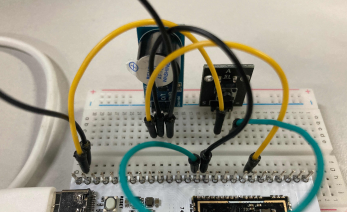
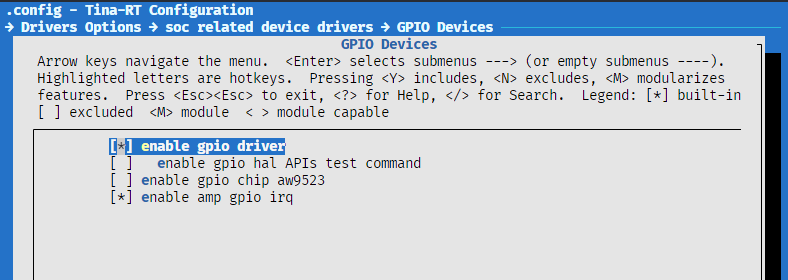
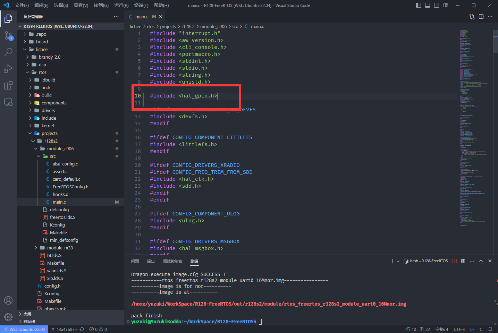

# 按键控制蜂鸣器

| 本文案例代码 | 下载地址 |
| ---------------------- | -------------------------------------- |
| 按键控制蜂鸣器案例代码 | https://www.aw-ol.com/downloads?cat=24 |

首先我们搭建电路，如下：



| 引脚 | 按键         |
| ---- | ------------ |
| PA25 | 按键1脚      |
| GND  | 按键3脚      |
| PA29 | 蜂鸣器触发脚 |

## 载入方案

我们使用的开发板是 R128-Devkit，需要开发 C906 核心的应用程序，所以载入方案选择`r128s2_module_c906`

```bash
$ source envsetup.sh 
$ lunch_rtos 1
```


## 勾选 GPIO 驱动

`mrtos_menuconfig` 找到下列驱动

```
Drivers Options  --->
    soc related device drivers  --->
            GPIO devices --->
                [*] enable GPIO driver
                [*] enbale GPIO hal APIs Test command
```



## 编写程序

打开你喜欢的编辑器，修改文件：`lichee/rtos/projects/r128s2/module_c906/src/main.c`


### 引入头文件

```c
#include <hal_gpio.h>
```



### 使用 GPIO 配置引脚

#### 配置 GPIO 的上下拉状态

使用 `hal_gpio_set_pull(gpio_pin_t pin, gpio_pull_status_t pull);` 来设置。这里我们设置 `PA25` 引脚为默认上拉状态。

```c
hal_gpio_set_pull(GPIOA(25), GPIO_PULL_UP);
```

#### 配置 GPIO 输入输出模式

使用 `hal_gpio_set_direction(gpio_pin_t pin, gpio_direction_t direction);` 来设置 GPIO 的输入输出模式，这里配置为输入模式。

```c
hal_gpio_set_direction(GPIOA(25), GPIO_DIRECTION_INPUT);
```

#### 配置 GPIO 的 MUX 功能

GPIO 通常有多种功能，需要配置 MUX 选择需要的功能，使用 `hal_gpio_pinmux_set_function(gpio_pin_t pin, gpio_muxsel_t function_index);` 来设置 GPIO 的复用功能，这里配置为GPIO 输入模式（`GPIO_MUXSEL_IN`）

```c
hal_gpio_pinmux_set_function(GPIOA(25), GPIO_MUXSEL_IN);
```

#### 获取 GPIO 的电平

使用 `int hal_gpio_get_data(gpio_pin_t pin, gpio_data_t *data);` 来获取 GPIO 的电平，这里配置 `PA25` 为高电平点亮 LED

```c
gpio_data_t gpio_data;
hal_gpio_get_data(GPIOA(25), GPIO_DATA_HIGH);
```

#### 配置 GPIO 的电平

使用 `hal_gpio_set_data(gpio_pin_t pin, gpio_data_t data);` 来配置 GPIO 的电平，这里配置 `PA18` 为高电平点亮 LED

```c
hal_gpio_set_data(GPIOA(18), GPIO_DATA_HIGH);
```

#### 完整的配置 GPIO

```c
gpio_data_t gpio_data;
// 配置按键输入脚为输入，默认拉高
hal_gpio_set_pull(GPIOA(25), GPIO_PULL_UP);
hal_gpio_set_direction(GPIOA(25), GPIO_DIRECTION_INPUT);
hal_gpio_pinmux_set_function(GPIOA(25), GPIO_MUXSEL_IN);

// 配置按键输入脚为输出，默认拉高
hal_gpio_set_pull(GPIOA(29), GPIO_PULL_UP);
hal_gpio_set_direction(GPIOA(29), GPIO_DIRECTION_OUTPUT);
hal_gpio_pinmux_set_function(GPIOA(29), GPIO_MUXSEL_OUT);
hal_gpio_set_data(GPIOA(29), GPIO_DATA_HIGH);

while(1){
    hal_gpio_get_data(GPIOA(25), &gpio_data);
    // 检测按键输入，如果有输入则输出buzz
    if(gpio_data == GPIO_DATA_LOW){
        printf("Key Pressed! And Buzz\n");
        hal_gpio_set_data(GPIOA(29), GPIO_DATA_LOW);
    } else {
        hal_gpio_set_data(GPIOA(29), GPIO_DATA_HIGH);
    }
}
```

## 结果

编译固件后烧录，按下按键蜂鸣器会发出声音，同时串口输出 `Key Pressed! And Buzz`