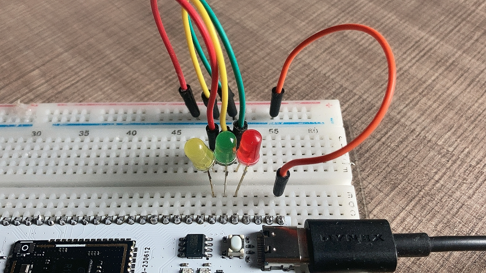
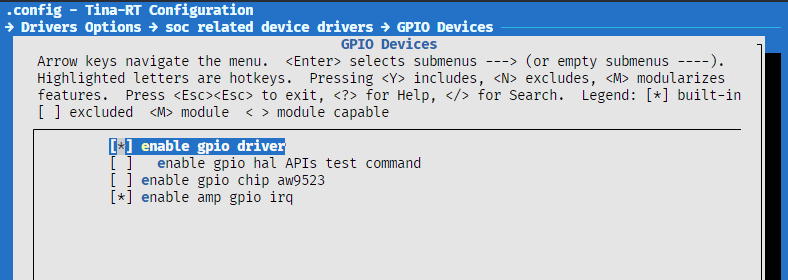
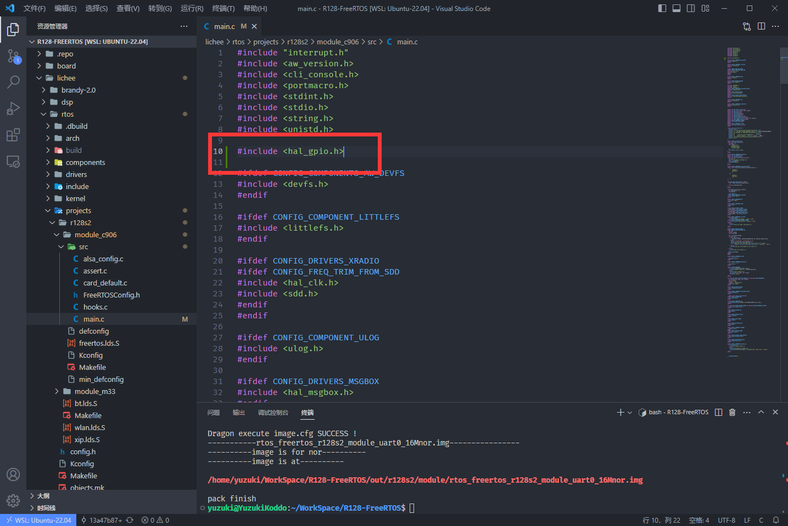
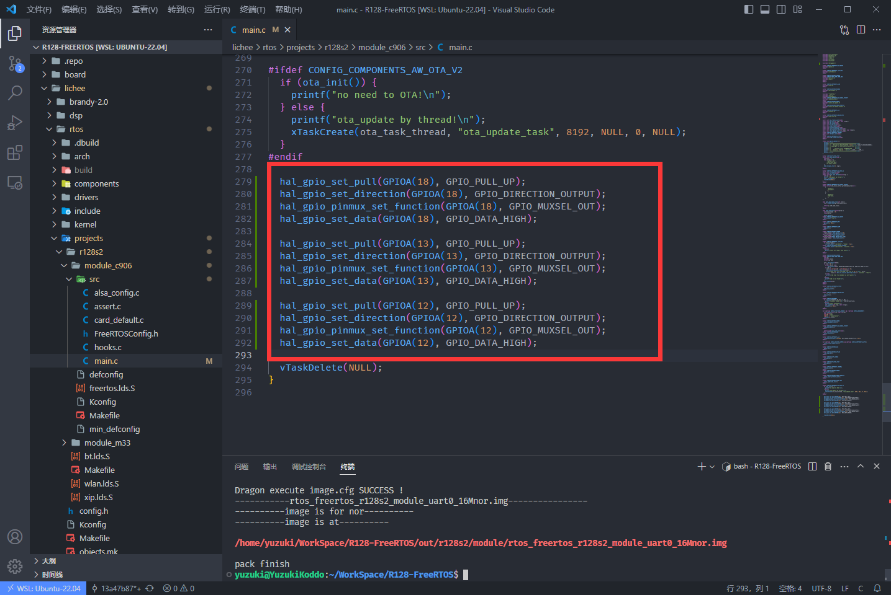
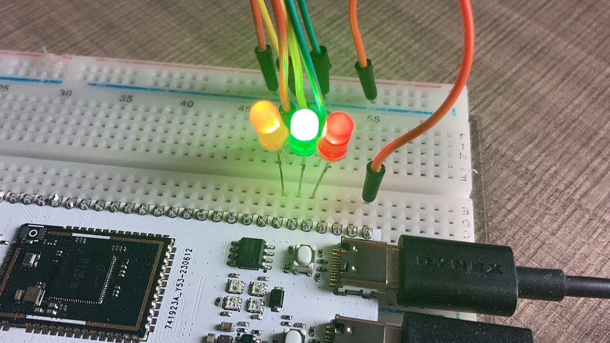
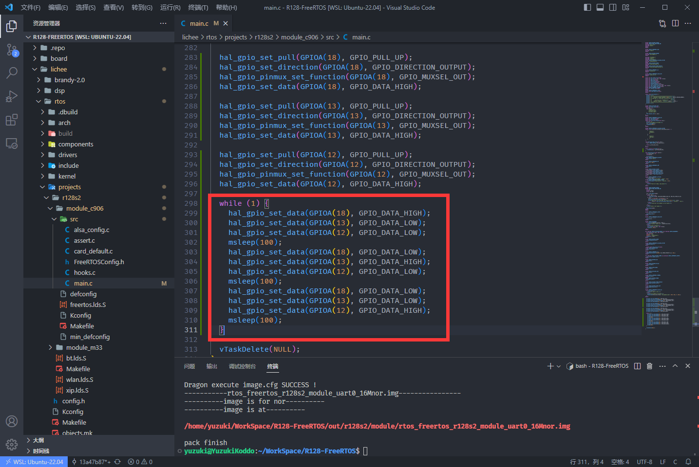

# 点亮一颗 LED 灯

| 本文案例代码 | 下载地址 |
| ---------------------- | -------------------------------------- |
| 点亮一颗 LED 灯案例代码 | https://www.aw-ol.com/downloads?cat=24 |

首先我们搭建电路，如下：



| 引脚   | LED    |
| ---- | ------ |
| PA18 | 红色 LED |
| PA13 | 绿色 LED |
| PA12 | 黄色 LED |

## [载入方案](https://yuzukihd.top/R128Module/#/r128/hello_world?id=载入方案)

我们使用的开发板是 R128-Devkit，需要开发 C906 核心的应用程序，所以载入方案选择`r128s2_module_c906`

```bash
$ source envsetup.sh 
$ lunch_rtos 1
```


## 勾选 GPIO 驱动

`mrtos_menuconfig` 找到下列驱动

```
Drivers Options  --->
    soc related device drivers  --->
            GPIO devices --->
                [*] enable GPIO driver
                [*] enbale GPIO hal APIs Test command
```



## 编写程序

打开你喜欢的编辑器，修改文件：`lichee/rtos/projects/r128s2/module_c906/src/main.c`


### 引入头文件

```c
#include <hal_gpio.h>
```



### 使用 GPIO 配置引脚

#### 配置 GPIO 的上下拉状态

使用 `hal_gpio_set_pull(gpio_pin_t pin, gpio_pull_status_t pull);` 来设置。这里我们设置 `PA18` 引脚为默认上拉状态。

```c
hal_gpio_set_pull(GPIOA(18), GPIO_PULL_UP);
```

#### 配置 GPIO 输入输出模式

使用 `hal_gpio_set_direction(gpio_pin_t pin, gpio_direction_t direction);` 来设置 GPIO 的输入输出模式，这里配置为输出模式。

```
hal_gpio_set_direction(GPIOA(18), GPIO_DIRECTION_OUTPUT);
```

#### 配置 GPIO 的 MUX 功能

GPIO 通常有多种功能，需要配置 MUX 选择需要的功能，使用 `hal_gpio_pinmux_set_function(gpio_pin_t pin, gpio_muxsel_t function_index);` 来设置 GPIO 的复用功能，这里配置为GPIO 输出模式（`GPIO_MUXSEL_OUT`）

```c
hal_gpio_pinmux_set_function(GPIOA(18), GPIO_MUXSEL_OUT);
```

#### 配置 GPIO 的电平

使用 `hal_gpio_set_data(gpio_pin_t pin, gpio_data_t data);` 来配置 GPIO 的电平，这里配置 `PA18` 为高电平点亮 LED

```c
hal_gpio_set_data(GPIOA(18), GPIO_DATA_HIGH);
```

#### 完整的配置 GPIO

```c
hal_gpio_set_pull(GPIOA(18), GPIO_PULL_UP); // 配置 GPIO 的上下拉状态
hal_gpio_set_direction(GPIOA(18), GPIO_DIRECTION_OUTPUT);  // 配置 GPIO 输入输出模式
hal_gpio_pinmux_set_function(GPIOA(18), GPIO_MUXSEL_OUT);  // 配置 GPIO 的 MUX 功能
hal_gpio_set_data(GPIOA(18), GPIO_DATA_HIGH);  // 配置 GPIO 的电平
```

以此类推，我们同时配置 `PA18`， `PA13`，`PA12` 的 GPIO

```c
hal_gpio_set_pull(GPIOA(18), GPIO_PULL_UP);
hal_gpio_set_direction(GPIOA(18), GPIO_DIRECTION_OUTPUT);
hal_gpio_pinmux_set_function(GPIOA(18), GPIO_MUXSEL_OUT);
hal_gpio_set_data(GPIOA(18), GPIO_DATA_HIGH);

hal_gpio_set_pull(GPIOA(13), GPIO_PULL_UP);
hal_gpio_set_direction(GPIOA(13), GPIO_DIRECTION_OUTPUT);
hal_gpio_pinmux_set_function(GPIOA(13), GPIO_MUXSEL_OUT);
hal_gpio_set_data(GPIOA(13), GPIO_DATA_HIGH);

hal_gpio_set_pull(GPIOA(12), GPIO_PULL_UP);
hal_gpio_set_direction(GPIOA(12), GPIO_DIRECTION_OUTPUT);
hal_gpio_pinmux_set_function(GPIOA(12), GPIO_MUXSEL_OUT);
hal_gpio_set_data(GPIOA(12), GPIO_DATA_HIGH);
```



## 结果

编译固件后烧录，可以看到三色 LED 灯同时亮起。



## 流水灯

为了实现流水灯，我们先实现一个 `sleep` 函数

```c
static inline int msleep(int ms) {
    vTaskDelay(ms / portTICK_RATE_MS); 
}
```


然后实现流水灯逻辑即可，之前已经设置过的GPIO状态不需要重复设置。

```c
while (1) {
    hal_gpio_set_data(GPIOA(18), GPIO_DATA_HIGH);
    hal_gpio_set_data(GPIOA(13), GPIO_DATA_LOW);
    hal_gpio_set_data(GPIOA(12), GPIO_DATA_LOW);
    msleep(100);
    hal_gpio_set_data(GPIOA(18), GPIO_DATA_LOW);
    hal_gpio_set_data(GPIOA(13), GPIO_DATA_HIGH);
    hal_gpio_set_data(GPIOA(12), GPIO_DATA_LOW);
    msleep(100);
    hal_gpio_set_data(GPIOA(18), GPIO_DATA_LOW);
    hal_gpio_set_data(GPIOA(13), GPIO_DATA_LOW);
    hal_gpio_set_data(GPIOA(12), GPIO_DATA_HIGH);
    msleep(100);
}
```


