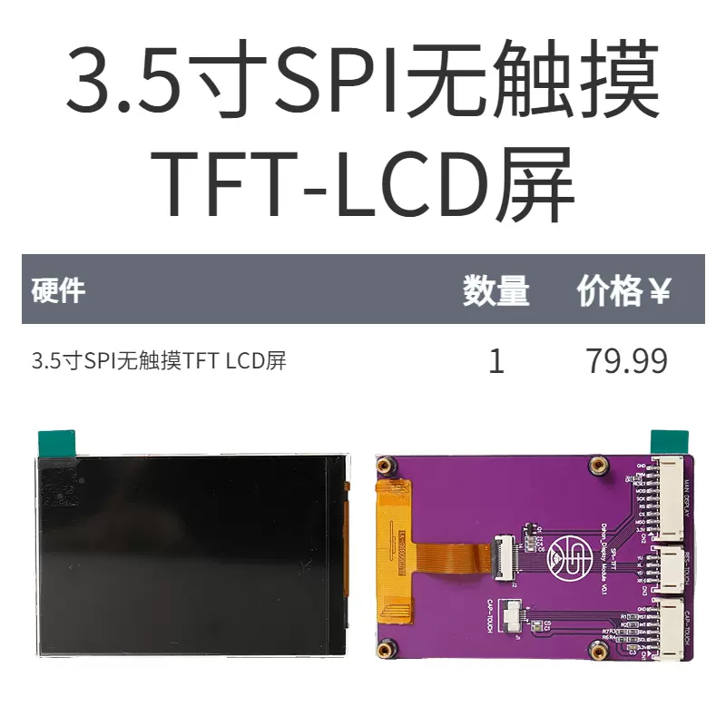
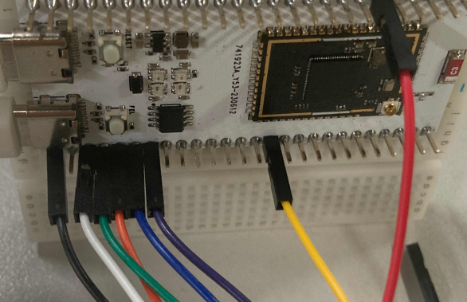
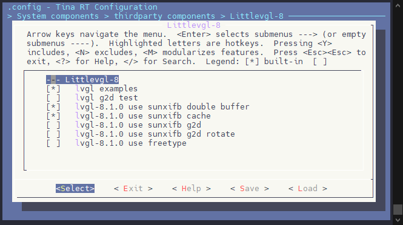
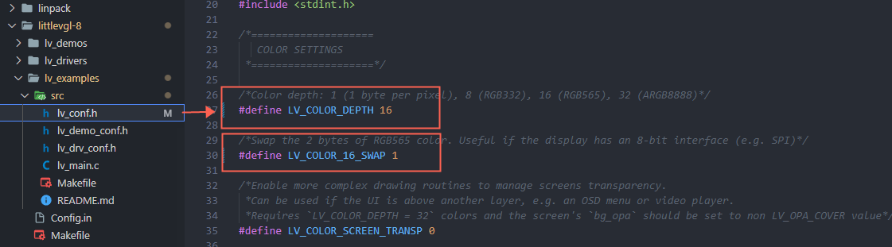
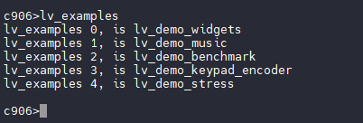
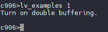
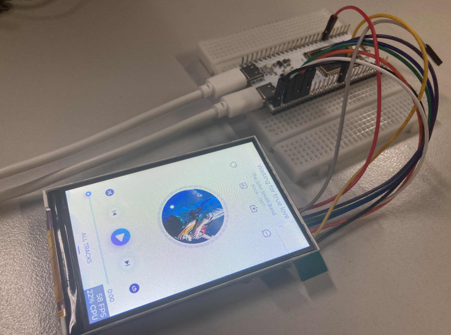

# LVGL 与 SPI TFT GUI

本次使用的是 Dshan_Display Module，如下图：



引脚配置如下：

| R128 Devkit | TFT 模块 |
| ----------- | -------- |
| PA12        | CS       |
| PA13        | SCK      |
| PA18        | MOSI     |
| PA9         | PWM      |
| PA20        | RESET    |
| PA19        | RS       |
| 3V3         | 3.3V     |
| GND         | GND      |



## 载入方案

我们使用的开发板是 R128-Devkit，需要开发 C906 核心的应用程序，所以载入方案选择 `r128s2_module_c906`

```bash
$ source envsetup.sh 
$ lunch_rtos 1
```


## 配置 SPI LCD 驱动

驱动配置请参照 《SPI 驱动 TFT LCD 屏》文章进行配置。

## 配置 LVGL 软件包

运行 `mrtos_menuconfig` 进入配置页面。在如下地址找到勾选相关软件包。

```
System components  --->
	thirdparty components  --->
		[*] Littlevgl-8  --->
			[*]   lvgl examples
			[*]   lvgl-8.1.0 use sunxifb double buffer
			[*]   lvgl-8.1.0 use sunxifb cache
```



## 修改 LVGL 显示配置

进入 `lichee/rtos-components/thirdparty/littlevgl-8/lv_examples/src/lv_conf.h` 找到 `LV_COLOR_DEPTH` 并修改为 16 位，`LV_COLOR_16_SWAP` 置为 1 进行红蓝颜色交换。



## 测试

编译打包刷写后，在控制台输入 `lv_examples`  可以查看相关命令。



运行 `lv_examples 1` 即可在屏幕显示 LVGL 界面。




