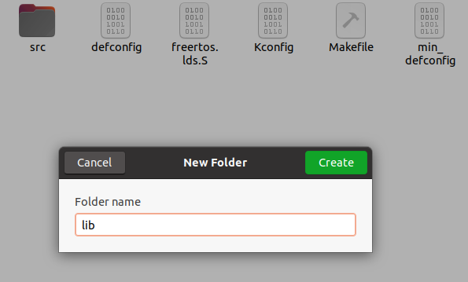

# NCNN 移植 R128

## 关于 NCNN


## 获取 NCNN 源码


## 配置工具链

### 下载工具链

前往平头哥网站，下载工具链：https://xuantie.t-head.cn/community/download?id=4049193882418745344

这里我们使用的是 `Xuantie-900-gcc-elf-newlib-x86_64-V2.4.0-20220428.tar.gz` 作为主要工具链


### 配置 R128 SDK 使用的工具链


### 配置 NCNN 使用的工具链

前往 NCNN 代码目录，新建一个文本文件名为 `r128.toolchain.cmake` 


然后写入以下内容，配置 NCNN 的编译环境

```cmake
set(CMAKE_SYSTEM_NAME Generic)
set(CMAKE_SYSTEM_PROCESSOR riscv64)
set(C906 True)
set(CMAKE_C_COMPILER_WORKS 1)

if(DEFINED ENV{RISCV_ROOT_PATH})
    file(TO_CMAKE_PATH $ENV{RISCV_ROOT_PATH} RISCV_ROOT_PATH)
else()
    message(FATAL_ERROR "RISCV_ROOT_PATH env must be defined")
endif()

set(RISCV_ROOT_PATH ${RISCV_ROOT_PATH} CACHE STRING "root path to riscv toolchain")

set(CMAKE_C_COMPILER "${RISCV_ROOT_PATH}/bin/riscv64-unknown-elf-gcc")
set(CMAKE_CXX_COMPILER "${RISCV_ROOT_PATH}/bin/riscv64-unknown-elf-g++")

set(CMAKE_FIND_ROOT_PATH "${RISCV_ROOT_PATH}/riscv64-unknown-elf")

set(CMAKE_SYSROOT "${RISCV_ROOT_PATH}/sysroot")

set(CMAKE_FIND_ROOT_PATH_MODE_PROGRAM NEVER)
set(CMAKE_FIND_ROOT_PATH_MODE_LIBRARY ONLY)
set(CMAKE_FIND_ROOT_PATH_MODE_INCLUDE ONLY)
set(CMAKE_FIND_ROOT_PATH_MODE_PACKAGE ONLY)

set(CMAKE_C_FLAGS "-march=rv64gcv0p7_zfh_xtheadc -mabi=lp64d -mtune=c906 -DC906=1 -static")
set(CMAKE_CXX_FLAGS "-march=rv64gcv0p7_zfh_xtheadc -mabi=lp64d -mtune=c906 -DC906=1 -static")

# cache flags
set(CMAKE_C_FLAGS "${CMAKE_C_FLAGS}" CACHE STRING "c flags")
set(CMAKE_CXX_FLAGS "${CMAKE_CXX_FLAGS}" CACHE STRING "c++ flags")

# export RISCV_ROOT_PATH=/home/nihui/osd/Xuantie-900-gcc-linux-5.10.4-glibc-x86_64-V2.4.0
# cmake -DCMAKE_TOOLCHAIN_FILE=../toolchains/r128.toolchain.cmake -DCMAKE_BUILD_TYPE=release -DNCNN_BUILD_TESTS=ON -DNCNN_OPENMP=OFF -DNCNN_THREADS=OFF -DNCNN_RUNTIME_CPU=OFF -DNCNN_RVV=ON -DNCNN_SIMPLEOCV=ON -DNCNN_BUILD_EXAMPLES=ON ..
```

## 整合 NCNN 到 R128 SDK 中

在方案中新建文件夹，命名为 `lib`



然后把刚才编译的两个 `lib` 拿过来

