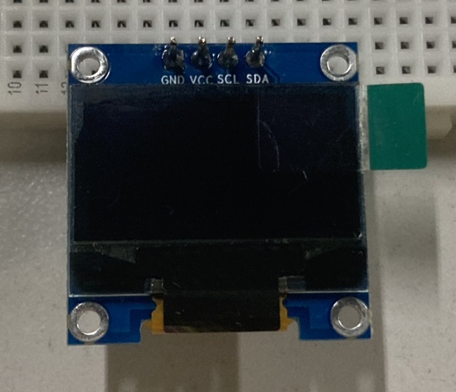
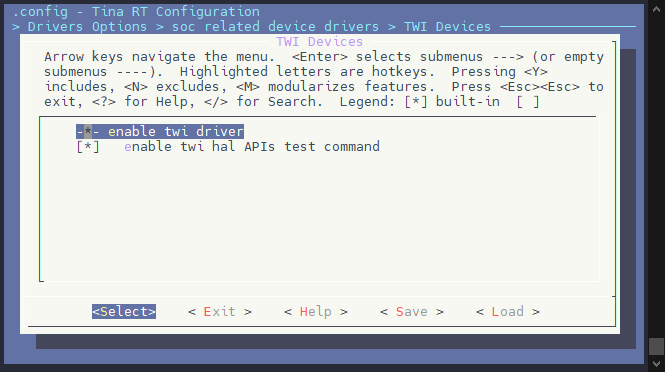
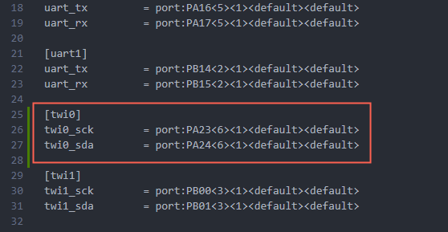
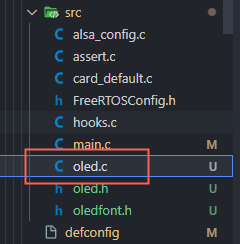
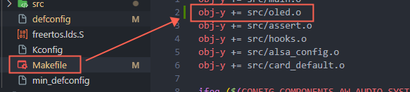
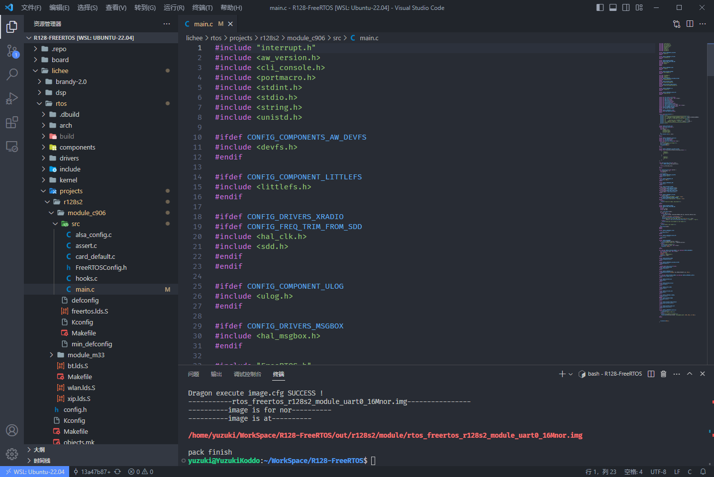
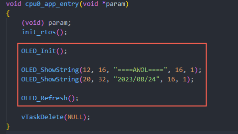
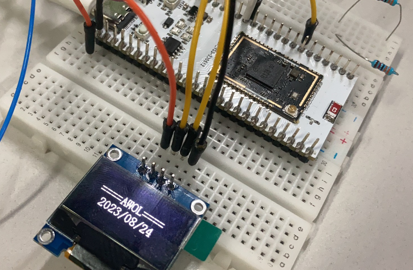

# 驱动 OLED 屏

| 本文案例代码 | 下载地址 |
| ---------------------- | -------------------------------------- |
| OLED驱动案例代码 | https://www.aw-ol.com/downloads?cat=24 |

OLED，即有机发光二极管（ Organic Light Emitting Diode）。 OLED 由于同时具备自发光，不需背 光源、对比度高、厚度薄、视角广、反应速度快、可用于挠曲性面板、使用温度范围广、构造及 制程较简单等优异之特性，被认为是下一代的平面显示器新兴应用技术。 

LCD 都需要背光，而 OLED 不需要，因为它是自发光的。这样同样的显示 OLED 效果要来得好一 些。以目前的技术，OLED 的尺寸还难以大型化，但是分辨率确可以做到很高。

在此我们使用的 是0.96寸OLED显示屏，该屏有以下特点： 

1. 0.96 寸 OLED 有黄蓝，白，蓝三种颜色可选；其中黄蓝是屏上 1/4 部分为黄光，下 3/4 为蓝； 而且是固定区域显示固定颜色，颜色和显示区域均不能修改；白光则为纯白，也就是黑底白字； 蓝色则为纯蓝，也就是黑底蓝字。
2. 分辨率为 128*64 
3. 多种接口方式；OLED 裸屏总共种接口包括：6800、8080 两种并行接口方式、3 线或 4 线的 串行 SPI 接口方式、 IIC 接口方式（只需要 2 根线就可以控制 OLED 了！），这五种接口是通过屏上的 BS0~BS2 来配置的。 

本次使用的是四针的IIC 模块，如下图：



引脚配置如下

| R128 Devkit | OLED |
| ----------- | ---- |
| PA23        | SCL  |
| PA24        | SDA  |
| GND         | GND  |
| 3V3         | VCC  |

## 载入方案

我们使用的开发板是 R128-Devkit，需要开发 C906 核心的应用程序，所以载入方案选择 `r128s2_module_c906`

```bash
$ source envsetup.sh 
$ lunch_rtos 1
```


## 设置 TWI 驱动

运行 `mrtos_menuconfig` 进入配置页面。前往下列地址找到 `TWI Devices` 

```
Drivers Options  --->
    soc related device drivers  --->
        	TWI Devices --->
        	-*- enable twi driver
```



## 配置 TWI 引脚

打开你喜欢的编辑器，修改文件：`board/r128s2/module/configs/sys_config.fex`

增加 TWI0 的配置，参考手册可知 PA23，PA24 的 TWI0 复用为 `6`

```ini
[twi0]
twi0_sck        = port:PA23<6><1><default><default>
twi0_sda        = port:PA24<6><1><default><default>
```



## 编写程序

打开你喜欢的编辑器，新增文件：`lichee/rtos/projects/r128s2/module_c906/src/oled.c` 用于编写 OLED 的驱动。



### 编写 OLED 驱动

使用一个宏储存 TWI 的地址和使用的 TWI 端口，并定义显存。

```c
#define OLED_IIC_ADDR 0x3c
#define OLED_IIC_PORT 0

uint8_t OLED_GRAM[144][8]; /* 显存 */
```

编写 OLED 的基础操作驱动 TWI 通讯函数。

```c
#define OLED_CMD 0 /*写命令 */
#define OLED_DATA 1 /* 写数据 */

void OLED_WR_Byte(uint8_t dat, uint8_t mode)
{
    twi_msg_t msg;
    twi_port_t port = OLED_IIC_PORT;

    uint8_t buf[2];

    if (mode)
        buf[0] = 0x40;
    else
        buf[0] = 0x00;
    buf[1] = dat;

    msg.flags = 0;
    msg.addr = OLED_IIC_ADDR;
    msg.len = 2;
    msg.buf = buf;
    hal_twi_control(port, I2C_RDWR, &msg);
}
```

编写 OLED 的驱动函数：显示开关

```c
void OLED_ColorTurn(uint8_t i)
{
    if (i == 0) {
        OLED_WR_Byte(0xA6, OLED_CMD); /* 正常显示 */
    }
    if (i == 1) {
        OLED_WR_Byte(0xA7, OLED_CMD); /* 反色显示 */
    }
}

```
编写 OLED 的驱动函数：反显设置
```c

void OLED_DisplayTurn(uint8_t i)
{
    if (i == 0) {
        OLED_WR_Byte(0xC8, OLED_CMD); /* 正常显示 */
        OLED_WR_Byte(0xA1, OLED_CMD);
    }
    if (i == 1) {
        OLED_WR_Byte(0xC0, OLED_CMD); /* 反转显示 */
        OLED_WR_Byte(0xA0, OLED_CMD);
    }
}
```
编写 OLED 的驱动函数：刷新屏幕
```c
void OLED_Refresh(void)
{
    for (int i = 0; i < 8; i++) {
        OLED_WR_Byte(0xb0 + i, OLED_CMD); //设置行起始地址
        OLED_WR_Byte(0x00, OLED_CMD); //设置低列起始地址
        OLED_WR_Byte(0x10, OLED_CMD); //设置高列起始地址
        OLED_WR_Byte(0x78, OLED_DATA);
        OLED_WR_Byte(0x40, OLED_DATA);
        for (int n = 0; n < 128; n++) {
            OLED_WR_Byte(OLED_GRAM[n][i], OLED_DATA);
        }
    }
}
```
编写 OLED 的驱动函数：清屏
```c
void OLED_Clear(void)
{
    for (int i = 0; i < 8; i++) {
        OLED_WR_Byte(0xb0 + i, OLED_CMD); //设置页地址（0~7）
        OLED_WR_Byte(0x00, OLED_CMD); //设置显示位置—列低地址
        OLED_WR_Byte(0x10, OLED_CMD); //设置显示位置—列高地址
        for (int n = 0; n < 128; n++)
            OLED_GRAM[n][i] = 0;
        OLED_Refresh(); //刷新GRAM内容
    }
}

```
编写 OLED 的驱动函数：画点
```c
void OLED_DrawPoint(uint8_t x, uint8_t y, uint8_t t)
{
    uint8_t i, m, n;
    i = y / 8;
    m = y % 8;
    n = 1 << m;
    if (t) {
        OLED_GRAM[x][i] |= n;
    }
    else {
        OLED_GRAM[x][i] = ~OLED_GRAM[x][i];
        OLED_GRAM[x][i] |= n;
        OLED_GRAM[x][i] = ~OLED_GRAM[x][i];
    }
}
```
编写 OLED 的驱动函数：画线
```c
void OLED_DrawLine(uint8_t x1, uint8_t y1, uint8_t x2, uint8_t y2, uint8_t mode)
{
    int xerr = 0, yerr = 0, delta_x, delta_y, distance;
    int incx, incy, uRow, uCol;
    delta_x = x2 - x1; //计算坐标增量
    delta_y = y2 - y1;
    uRow = x1; //画线起点坐标
    uCol = y1;
    if (delta_x > 0)
        incx = 1; //设置单步方向
    else if (delta_x == 0)
        incx = 0; //垂直线
    else {
        incx = -1;
        delta_x = -delta_x;
    }
    if (delta_y > 0)
        incy = 1;
    else if (delta_y == 0)
        incy = 0; //水平线
    else {
        incy = -1;
        delta_y = -delta_x;
    }
    if (delta_x > delta_y)
        distance = delta_x; //选取基本增量坐标轴
    else
        distance = delta_y;
    for (uint16_t t = 0; t < distance + 1; t++) {
        OLED_DrawPoint(uRow, uCol, mode); //画点
        xerr += delta_x;
        yerr += delta_y;
        if (xerr > distance) {
            xerr -= distance;
            uRow += incx;
        }
        if (yerr > distance) {
            yerr -= distance;
            uCol += incy;
        }
    }
}
```
编写 OLED 的驱动函数：画园
```c
void OLED_DrawCircle(uint8_t x, uint8_t y, uint8_t r)
{
    int a, b, num;
    a = 0;
    b = r;
    while (2 * b * b >= r * r) {
        OLED_DrawPoint(x + a, y - b, 1);
        OLED_DrawPoint(x - a, y - b, 1);
        OLED_DrawPoint(x - a, y + b, 1);
        OLED_DrawPoint(x + a, y + b, 1);

        OLED_DrawPoint(x + b, y + a, 1);
        OLED_DrawPoint(x + b, y - a, 1);
        OLED_DrawPoint(x - b, y - a, 1);
        OLED_DrawPoint(x - b, y + a, 1);

        a++;
        num = (a * a + b * b) - r * r; //计算画的点离圆心的距离
        if (num > 0) {
            b--;
            a--;
        }
    }
}
```
编写 OLED 的驱动函数：显示字符
```c
void OLED_ShowChar(uint8_t x, uint8_t y, uint8_t chr, uint8_t size1, uint8_t mode)
{
    uint8_t temp, size2, chr1;
    uint8_t x0 = x, y0 = y;
    if (size1 == 8)
        size2 = 6;
    else
        size2 = (size1 / 8 + ((size1 % 8) ? 1 : 0)) * (size1 / 2); //得到字体一个字符对应点阵集所占的字节数
    chr1 = chr - ' '; //计算偏移后的值
    for (uint8_t i = 0; i < size2; i++) {
        if (size1 == 8) {
            temp = asc2_0806[chr1][i];
        } //调用0806字体
        else if (size1 == 12) {
            temp = asc2_1206[chr1][i];
        } //调用1206字体
        else if (size1 == 16) {
            temp = asc2_1608[chr1][i];
        } //调用1608字体
        else if (size1 == 24) {
            temp = asc2_2412[chr1][i];
        } //调用2412字体
        else
            return;
        for (uint8_t m = 0; m < 8; m++) {
            if (temp & 0x01)
                OLED_DrawPoint(x, y, mode);
            else
                OLED_DrawPoint(x, y, !mode);
            temp >>= 1;
            y++;
        }
        x++;
        if ((size1 != 8) && ((x - x0) == size1 / 2)) {
            x = x0;
            y0 = y0 + 8;
        }
        y = y0;
    }
}
```
编写 OLED 的驱动函数：显示字符串
```c
void OLED_ShowString(uint8_t x, uint8_t y, uint8_t* chr, uint8_t size1, uint8_t mode)
{
    while ((*chr >= ' ') && (*chr <= '~')) //判断是不是非法字符!
    {
        OLED_ShowChar(x, y, *chr, size1, mode);
        if (size1 == 8)
            x += 6;
        else
            x += size1 / 2;
        chr++;
    }
}
```
编写 OLED 的驱动函数：显示数字
```c
void OLED_ShowNum(uint8_t x, uint8_t y, uint32_t num, uint8_t len, uint8_t size1, uint8_t mode)
{
    uint8_t temp, m = 0;
    if (size1 == 8)
        m = 2;
    for (uint8_t t = 0; t < len; t++) {
        temp = (num / OLED_Pow(10, len - t - 1)) % 10;
        if (temp == 0) {
            OLED_ShowChar(x + (size1 / 2 + m) * t, y, '0', size1, mode);
        }
        else {
            OLED_ShowChar(x + (size1 / 2 + m) * t, y, temp + '0', size1, mode);
        }
    }
}
```
编写 OLED 的驱动函数：配置位置
```c
void OLED_Set_Pos(uint8_t x, uint8_t y)
{
    OLED_WR_Byte(0xb0 + y, OLED_CMD);
    OLED_WR_Byte(((x & 0xf0) >> 4) | 0x10, OLED_CMD);
    OLED_WR_Byte((x & 0x0f), OLED_CMD);
}
```
编写 OLED 的驱动函数：初始化屏幕
```c

void OLED_Init(void)
{
    hal_twi_init(OLED_IIC_PORT); //-- init TWI

    OLED_WR_Byte(0xAE, OLED_CMD);//--turn off oled panel
    OLED_WR_Byte(0x00, OLED_CMD);//---set low column address
    OLED_WR_Byte(0x10, OLED_CMD);//---set high column address
    OLED_WR_Byte(0x40, OLED_CMD);//--set start line address  Set Mapping RAM Display Start Line (0x00~0x3F)
    OLED_WR_Byte(0x81, OLED_CMD);//--set contrast control register
    OLED_WR_Byte(0xCF, OLED_CMD); // Set SEG Output Current Brightness
    OLED_WR_Byte(0xA1, OLED_CMD);//--Set SEG/Column Mapping     0xa0左右反置 0xa1正常
    OLED_WR_Byte(0xC8, OLED_CMD);//Set COM/Row Scan Direction   0xc0上下反置 0xc8正常
    OLED_WR_Byte(0xA6, OLED_CMD);//--set normal display
    OLED_WR_Byte(0xA8, OLED_CMD);//--set multiplex ratio(1 to 64)
    OLED_WR_Byte(0x3f, OLED_CMD);//--1/64 duty
    OLED_WR_Byte(0xD3, OLED_CMD);//-set display offset Shift Mapping RAM Counter (0x00~0x3F)
    OLED_WR_Byte(0x00, OLED_CMD);//-not offset
    OLED_WR_Byte(0xd5, OLED_CMD);//--set display clock divide ratio/oscillator frequency
    OLED_WR_Byte(0x80, OLED_CMD);//--set divide ratio, Set Clock as 100 Frames/Sec
    OLED_WR_Byte(0xD9, OLED_CMD);//--set pre-charge period
    OLED_WR_Byte(0xF1, OLED_CMD);//Set Pre-Charge as 15 Clocks & Discharge as 1 Clock
    OLED_WR_Byte(0xDA, OLED_CMD);//--set com pins hardware configuration
    OLED_WR_Byte(0x12, OLED_CMD);
    OLED_WR_Byte(0xDB, OLED_CMD);//--set vcomh
    OLED_WR_Byte(0x40, OLED_CMD);//Set VCOM Deselect Level
    OLED_WR_Byte(0x20, OLED_CMD);//-Set Page Addressing Mode (0x00/0x01/0x02)
    OLED_WR_Byte(0x02, OLED_CMD);//
    OLED_WR_Byte(0x8D, OLED_CMD);//--set Charge Pump enable/disable
    OLED_WR_Byte(0x14, OLED_CMD);//--set(0x10) disable
    OLED_WR_Byte(0xA4, OLED_CMD);// Disable Entire Display On (0xa4/0xa5)
    OLED_WR_Byte(0xA6, OLED_CMD);// Disable Inverse Display On (0xa6/a7)
    OLED_Clear();
    OLED_WR_Byte(0xAF, OLED_CMD); /*display ON*/  
}
```

我们把这些驱动放到一个单独的文件里，命名为 `oled.c`，完整内容如下：

```c
#include <sunxi_hal_twi.h>

#include "oledfont.h"

#define OLED_IIC_ADDR 0x3c
#define OLED_IIC_PORT 0

#define OLED_CMD 0 /*写命令 */
#define OLED_DATA 1 /* 写数据 */

uint8_t OLED_GRAM[144][8]; /* 显存 */

void OLED_WR_Byte(uint8_t dat, uint8_t mode)
{
    twi_msg_t msg;
    twi_port_t port = OLED_IIC_PORT;

    uint8_t buf[2];

    if (mode)
        buf[0] = 0x40;
    else
        buf[0] = 0x00;
    buf[1] = dat;

    msg.flags = 0;
    msg.addr = OLED_IIC_ADDR;
    msg.len = 2;
    msg.buf = buf;
    hal_twi_control(port, I2C_RDWR, &msg);
}

uint32_t OLED_Pow(uint8_t m, uint8_t n)
{
    uint32_t result = 1;
    while (n--)
        result *= m;
    return result;
}

void OLED_ColorTurn(uint8_t i)
{
    if (i == 0) {
        OLED_WR_Byte(0xA6, OLED_CMD); /* 正常显示 */
    }
    if (i == 1) {
        OLED_WR_Byte(0xA7, OLED_CMD); /* 反色显示 */
    }
}

void OLED_DisplayTurn(uint8_t i)
{
    if (i == 0) {
        OLED_WR_Byte(0xC8, OLED_CMD); /* 正常显示 */
        OLED_WR_Byte(0xA1, OLED_CMD);
    }
    if (i == 1) {
        OLED_WR_Byte(0xC0, OLED_CMD); /* 反转显示 */
        OLED_WR_Byte(0xA0, OLED_CMD);
    }
}

void OLED_Refresh(void)
{
    for (int i = 0; i < 8; i++) {
        OLED_WR_Byte(0xb0 + i, OLED_CMD); //设置行起始地址
        OLED_WR_Byte(0x00, OLED_CMD); //设置低列起始地址
        OLED_WR_Byte(0x10, OLED_CMD); //设置高列起始地址
        OLED_WR_Byte(0x78, OLED_DATA);
        OLED_WR_Byte(0x40, OLED_DATA);
        for (int n = 0; n < 128; n++) {
            OLED_WR_Byte(OLED_GRAM[n][i], OLED_DATA);
        }
    }
}

void OLED_Clear(void)
{
    for (int i = 0; i < 8; i++) {
        OLED_WR_Byte(0xb0 + i, OLED_CMD); //设置页地址（0~7）
        OLED_WR_Byte(0x00, OLED_CMD); //设置显示位置—列低地址
        OLED_WR_Byte(0x10, OLED_CMD); //设置显示位置—列高地址
        for (int n = 0; n < 128; n++)
            OLED_GRAM[n][i] = 0;
        OLED_Refresh(); //刷新GRAM内容
    }
}

void OLED_DrawPoint(uint8_t x, uint8_t y, uint8_t t)
{
    uint8_t i, m, n;
    i = y / 8;
    m = y % 8;
    n = 1 << m;
    if (t) {
        OLED_GRAM[x][i] |= n;
    }
    else {
        OLED_GRAM[x][i] = ~OLED_GRAM[x][i];
        OLED_GRAM[x][i] |= n;
        OLED_GRAM[x][i] = ~OLED_GRAM[x][i];
    }
}

void OLED_DrawLine(uint8_t x1, uint8_t y1, uint8_t x2, uint8_t y2, uint8_t mode)
{
    int xerr = 0, yerr = 0, delta_x, delta_y, distance;
    int incx, incy, uRow, uCol;
    delta_x = x2 - x1; //计算坐标增量
    delta_y = y2 - y1;
    uRow = x1; //画线起点坐标
    uCol = y1;
    if (delta_x > 0)
        incx = 1; //设置单步方向
    else if (delta_x == 0)
        incx = 0; //垂直线
    else {
        incx = -1;
        delta_x = -delta_x;
    }
    if (delta_y > 0)
        incy = 1;
    else if (delta_y == 0)
        incy = 0; //水平线
    else {
        incy = -1;
        delta_y = -delta_x;
    }
    if (delta_x > delta_y)
        distance = delta_x; //选取基本增量坐标轴
    else
        distance = delta_y;
    for (uint16_t t = 0; t < distance + 1; t++) {
        OLED_DrawPoint(uRow, uCol, mode); //画点
        xerr += delta_x;
        yerr += delta_y;
        if (xerr > distance) {
            xerr -= distance;
            uRow += incx;
        }
        if (yerr > distance) {
            yerr -= distance;
            uCol += incy;
        }
    }
}

void OLED_DrawCircle(uint8_t x, uint8_t y, uint8_t r)
{
    int a, b, num;
    a = 0;
    b = r;
    while (2 * b * b >= r * r) {
        OLED_DrawPoint(x + a, y - b, 1);
        OLED_DrawPoint(x - a, y - b, 1);
        OLED_DrawPoint(x - a, y + b, 1);
        OLED_DrawPoint(x + a, y + b, 1);

        OLED_DrawPoint(x + b, y + a, 1);
        OLED_DrawPoint(x + b, y - a, 1);
        OLED_DrawPoint(x - b, y - a, 1);
        OLED_DrawPoint(x - b, y + a, 1);

        a++;
        num = (a * a + b * b) - r * r; //计算画的点离圆心的距离
        if (num > 0) {
            b--;
            a--;
        }
    }
}

void OLED_ShowChar(uint8_t x, uint8_t y, uint8_t chr, uint8_t size1, uint8_t mode)
{
    uint8_t temp, size2, chr1;
    uint8_t x0 = x, y0 = y;
    if (size1 == 8)
        size2 = 6;
    else
        size2 = (size1 / 8 + ((size1 % 8) ? 1 : 0)) * (size1 / 2); //得到字体一个字符对应点阵集所占的字节数
    chr1 = chr - ' '; //计算偏移后的值
    for (uint8_t i = 0; i < size2; i++) {
        if (size1 == 8) {
            temp = asc2_0806[chr1][i];
        } //调用0806字体
        else if (size1 == 12) {
            temp = asc2_1206[chr1][i];
        } //调用1206字体
        else if (size1 == 16) {
            temp = asc2_1608[chr1][i];
        } //调用1608字体
        else if (size1 == 24) {
            temp = asc2_2412[chr1][i];
        } //调用2412字体
        else
            return;
        for (uint8_t m = 0; m < 8; m++) {
            if (temp & 0x01)
                OLED_DrawPoint(x, y, mode);
            else
                OLED_DrawPoint(x, y, !mode);
            temp >>= 1;
            y++;
        }
        x++;
        if ((size1 != 8) && ((x - x0) == size1 / 2)) {
            x = x0;
            y0 = y0 + 8;
        }
        y = y0;
    }
}

void OLED_ShowString(uint8_t x, uint8_t y, uint8_t* chr, uint8_t size1, uint8_t mode)
{
    while ((*chr >= ' ') && (*chr <= '~')) //判断是不是非法字符!
    {
        OLED_ShowChar(x, y, *chr, size1, mode);
        if (size1 == 8)
            x += 6;
        else
            x += size1 / 2;
        chr++;
    }
}

void OLED_ShowNum(uint8_t x, uint8_t y, uint32_t num, uint8_t len, uint8_t size1, uint8_t mode)
{
    uint8_t temp, m = 0;
    if (size1 == 8)
        m = 2;
    for (uint8_t t = 0; t < len; t++) {
        temp = (num / OLED_Pow(10, len - t - 1)) % 10;
        if (temp == 0) {
            OLED_ShowChar(x + (size1 / 2 + m) * t, y, '0', size1, mode);
        }
        else {
            OLED_ShowChar(x + (size1 / 2 + m) * t, y, temp + '0', size1, mode);
        }
    }
}

void OLED_Set_Pos(uint8_t x, uint8_t y)
{
    OLED_WR_Byte(0xb0 + y, OLED_CMD);
    OLED_WR_Byte(((x & 0xf0) >> 4) | 0x10, OLED_CMD);
    OLED_WR_Byte((x & 0x0f), OLED_CMD);
}

void OLED_Init(void)
{
    hal_twi_init(OLED_IIC_PORT); //-- init TWI

    OLED_WR_Byte(0xAE, OLED_CMD);//--turn off oled panel
    OLED_WR_Byte(0x00, OLED_CMD);//---set low column address
    OLED_WR_Byte(0x10, OLED_CMD);//---set high column address
    OLED_WR_Byte(0x40, OLED_CMD);//--set start line address  Set Mapping RAM Display Start Line (0x00~0x3F)
    OLED_WR_Byte(0x81, OLED_CMD);//--set contrast control register
    OLED_WR_Byte(0xCF, OLED_CMD); // Set SEG Output Current Brightness
    OLED_WR_Byte(0xA1, OLED_CMD);//--Set SEG/Column Mapping     0xa0左右反置 0xa1正常
    OLED_WR_Byte(0xC8, OLED_CMD);//Set COM/Row Scan Direction   0xc0上下反置 0xc8正常
    OLED_WR_Byte(0xA6, OLED_CMD);//--set normal display
    OLED_WR_Byte(0xA8, OLED_CMD);//--set multiplex ratio(1 to 64)
    OLED_WR_Byte(0x3f, OLED_CMD);//--1/64 duty
    OLED_WR_Byte(0xD3, OLED_CMD);//-set display offset Shift Mapping RAM Counter (0x00~0x3F)
    OLED_WR_Byte(0x00, OLED_CMD);//-not offset
    OLED_WR_Byte(0xd5, OLED_CMD);//--set display clock divide ratio/oscillator frequency
    OLED_WR_Byte(0x80, OLED_CMD);//--set divide ratio, Set Clock as 100 Frames/Sec
    OLED_WR_Byte(0xD9, OLED_CMD);//--set pre-charge period
    OLED_WR_Byte(0xF1, OLED_CMD);//Set Pre-Charge as 15 Clocks & Discharge as 1 Clock
    OLED_WR_Byte(0xDA, OLED_CMD);//--set com pins hardware configuration
    OLED_WR_Byte(0x12, OLED_CMD);
    OLED_WR_Byte(0xDB, OLED_CMD);//--set vcomh
    OLED_WR_Byte(0x40, OLED_CMD);//Set VCOM Deselect Level
    OLED_WR_Byte(0x20, OLED_CMD);//-Set Page Addressing Mode (0x00/0x01/0x02)
    OLED_WR_Byte(0x02, OLED_CMD);//
    OLED_WR_Byte(0x8D, OLED_CMD);//--set Charge Pump enable/disable
    OLED_WR_Byte(0x14, OLED_CMD);//--set(0x10) disable
    OLED_WR_Byte(0xA4, OLED_CMD);// Disable Entire Display On (0xa4/0xa5)
    OLED_WR_Byte(0xA6, OLED_CMD);// Disable Inverse Display On (0xa6/a7)
    OLED_Clear();
    OLED_WR_Byte(0xAF, OLED_CMD); /*display ON*/  
}
```

同时提供对应的头文件 `oled.h`，`oledfont.h` 由于较大，见文章末尾。

```c
#ifndef __OLED_H
#define __OLED_H

/* 发送一个字节 
 * mode:数据/命令标志 0,表示命令;1,表示数据;
 */
void OLED_WR_Byte(uint8_t dat, uint8_t mode);

/* Pow 函数 */
uint32_t OLED_Pow(uint8_t m, uint8_t n);

/* 反显函数 */
void OLED_ColorTurn(uint8_t i);

/* 屏幕旋转180度 */
void OLED_DisplayTurn(uint8_t i);

/* 更新显存到OLED */
void OLED_Refresh(void);

/* OLED 清屏 */
void OLED_Clear(void);

/* 画点 
 * x: 0~127
 * y: 0~63
 * t: 1 填充 0,清空	
 */
void OLED_DrawPoint(uint8_t x, uint8_t y, uint8_t t);

/* 画线
 * x1, y1: 起点坐标
 * x2, y2: 结束坐标
 */
void OLED_DrawLine(uint8_t x1, uint8_t y1, uint8_t x2, uint8_t y2, uint8_t mode);

/* 画圆
 * x, y: 圆心坐标
 * r: 圆的半径
 */

void OLED_DrawCircle(uint8_t x, uint8_t y, uint8_t r);

/* 在指定位置显示一个字符,包括部分字符
 * x: 0 ~ 127
 * y: 0 ~ 63
 * size1: 选择字体 6x8/6x12/8x16/12x24
 * mode: 0,反色显示; 1,正常显示
 */
void OLED_ShowChar(uint8_t x, uint8_t y, uint8_t chr, uint8_t size1, uint8_t mode);

/* 显示字符串
 * x: 0 ~ 127
 * y: 0 ~ 63
 * *chr: 字符串起始地址 
 * size1: 选择字体 6x8/6x12/8x16/12x24
 * mode: 0,反色显示; 1,正常显示
 */
void OLED_ShowString(uint8_t x, uint8_t y, uint8_t* chr, uint8_t size1, uint8_t mode);

/* 显示数字
 * x: 0 ~ 127
 * y: 0 ~ 63
 * num: 要显示的数字 
 * len: 数字的位数
 * size1: 选择字体 6x8/6x12/8x16/12x24
 * mode: 0,反色显示; 1,正常显示
 */
void OLED_ShowNum(uint8_t x, uint8_t y, uint32_t num, uint8_t len, uint8_t size1, uint8_t mode);

/* 初始化 OLED */
void OLED_Init(void);

#endif
```

然后把 `oled.c` 加入编译，修改 `lichee/rtos/projects/r128s2/module_c906/Makefile`加入

```c
obj-y += src/oled.o
```



### 编写主程序

打开你喜欢的编辑器，修改文件：`lichee/rtos/projects/r128s2/module_c906/src/main.c`



```c
OLED_Init();

OLED_ShowString(12, 16, "====AWOL====", 16, 1);
OLED_ShowString(20, 32, "2023/08/24", 16, 1);

OLED_Refresh();
```

初始化 OLED，然后显示字符串。



## 结果

驱动了 OLED 屏



## 附录

`oledfont.h`：

```c
#ifndef __OLEDFONT_H
#define __OLEDFONT_H
const unsigned char asc2_0806[][6] = {
    { 0x00, 0x00, 0x00, 0x00, 0x00, 0x00 }, // sp
    { 0x00, 0x00, 0x00, 0x2f, 0x00, 0x00 }, // !
    { 0x00, 0x00, 0x07, 0x00, 0x07, 0x00 }, // "
    { 0x00, 0x14, 0x7f, 0x14, 0x7f, 0x14 }, // #
    { 0x00, 0x24, 0x2a, 0x7f, 0x2a, 0x12 }, // $
    { 0x00, 0x62, 0x64, 0x08, 0x13, 0x23 }, // %
    { 0x00, 0x36, 0x49, 0x55, 0x22, 0x50 }, // &
    { 0x00, 0x00, 0x05, 0x03, 0x00, 0x00 }, // '
    { 0x00, 0x00, 0x1c, 0x22, 0x41, 0x00 }, // (
    { 0x00, 0x00, 0x41, 0x22, 0x1c, 0x00 }, // )
    { 0x00, 0x14, 0x08, 0x3E, 0x08, 0x14 }, // *
    { 0x00, 0x08, 0x08, 0x3E, 0x08, 0x08 }, // +
    { 0x00, 0x00, 0x00, 0xA0, 0x60, 0x00 }, // ,
    { 0x00, 0x08, 0x08, 0x08, 0x08, 0x08 }, // -
    { 0x00, 0x00, 0x60, 0x60, 0x00, 0x00 }, // .
    { 0x00, 0x20, 0x10, 0x08, 0x04, 0x02 }, // /
    { 0x00, 0x3E, 0x51, 0x49, 0x45, 0x3E }, // 0
    { 0x00, 0x00, 0x42, 0x7F, 0x40, 0x00 }, // 1
    { 0x00, 0x42, 0x61, 0x51, 0x49, 0x46 }, // 2
    { 0x00, 0x21, 0x41, 0x45, 0x4B, 0x31 }, // 3
    { 0x00, 0x18, 0x14, 0x12, 0x7F, 0x10 }, // 4
    { 0x00, 0x27, 0x45, 0x45, 0x45, 0x39 }, // 5
    { 0x00, 0x3C, 0x4A, 0x49, 0x49, 0x30 }, // 6
    { 0x00, 0x01, 0x71, 0x09, 0x05, 0x03 }, // 7
    { 0x00, 0x36, 0x49, 0x49, 0x49, 0x36 }, // 8
    { 0x00, 0x06, 0x49, 0x49, 0x29, 0x1E }, // 9
    { 0x00, 0x00, 0x36, 0x36, 0x00, 0x00 }, // :
    { 0x00, 0x00, 0x56, 0x36, 0x00, 0x00 }, // ;
    { 0x00, 0x08, 0x14, 0x22, 0x41, 0x00 }, // <
    { 0x00, 0x14, 0x14, 0x14, 0x14, 0x14 }, // =
    { 0x00, 0x00, 0x41, 0x22, 0x14, 0x08 }, // >
    { 0x00, 0x02, 0x01, 0x51, 0x09, 0x06 }, // ?
    { 0x00, 0x32, 0x49, 0x59, 0x51, 0x3E }, // @
    { 0x00, 0x7C, 0x12, 0x11, 0x12, 0x7C }, // A
    { 0x00, 0x7F, 0x49, 0x49, 0x49, 0x36 }, // B
    { 0x00, 0x3E, 0x41, 0x41, 0x41, 0x22 }, // C
    { 0x00, 0x7F, 0x41, 0x41, 0x22, 0x1C }, // D
    { 0x00, 0x7F, 0x49, 0x49, 0x49, 0x41 }, // E
    { 0x00, 0x7F, 0x09, 0x09, 0x09, 0x01 }, // F
    { 0x00, 0x3E, 0x41, 0x49, 0x49, 0x7A }, // G
    { 0x00, 0x7F, 0x08, 0x08, 0x08, 0x7F }, // H
    { 0x00, 0x00, 0x41, 0x7F, 0x41, 0x00 }, // I
    { 0x00, 0x20, 0x40, 0x41, 0x3F, 0x01 }, // J
    { 0x00, 0x7F, 0x08, 0x14, 0x22, 0x41 }, // K
    { 0x00, 0x7F, 0x40, 0x40, 0x40, 0x40 }, // L
    { 0x00, 0x7F, 0x02, 0x0C, 0x02, 0x7F }, // M
    { 0x00, 0x7F, 0x04, 0x08, 0x10, 0x7F }, // N
    { 0x00, 0x3E, 0x41, 0x41, 0x41, 0x3E }, // O
    { 0x00, 0x7F, 0x09, 0x09, 0x09, 0x06 }, // P
    { 0x00, 0x3E, 0x41, 0x51, 0x21, 0x5E }, // Q
    { 0x00, 0x7F, 0x09, 0x19, 0x29, 0x46 }, // R
    { 0x00, 0x46, 0x49, 0x49, 0x49, 0x31 }, // S
    { 0x00, 0x01, 0x01, 0x7F, 0x01, 0x01 }, // T
    { 0x00, 0x3F, 0x40, 0x40, 0x40, 0x3F }, // U
    { 0x00, 0x1F, 0x20, 0x40, 0x20, 0x1F }, // V
    { 0x00, 0x3F, 0x40, 0x38, 0x40, 0x3F }, // W
    { 0x00, 0x63, 0x14, 0x08, 0x14, 0x63 }, // X
    { 0x00, 0x07, 0x08, 0x70, 0x08, 0x07 }, // Y
    { 0x00, 0x61, 0x51, 0x49, 0x45, 0x43 }, // Z
    { 0x00, 0x00, 0x7F, 0x41, 0x41, 0x00 }, // [
    { 0x00, 0x55, 0x2A, 0x55, 0x2A, 0x55 }, // 55
    { 0x00, 0x00, 0x41, 0x41, 0x7F, 0x00 }, // ]
    { 0x00, 0x04, 0x02, 0x01, 0x02, 0x04 }, // ^
    { 0x00, 0x40, 0x40, 0x40, 0x40, 0x40 }, // _
    { 0x00, 0x00, 0x01, 0x02, 0x04, 0x00 }, // '
    { 0x00, 0x20, 0x54, 0x54, 0x54, 0x78 }, // a
    { 0x00, 0x7F, 0x48, 0x44, 0x44, 0x38 }, // b
    { 0x00, 0x38, 0x44, 0x44, 0x44, 0x20 }, // c
    { 0x00, 0x38, 0x44, 0x44, 0x48, 0x7F }, // d
    { 0x00, 0x38, 0x54, 0x54, 0x54, 0x18 }, // e
    { 0x00, 0x08, 0x7E, 0x09, 0x01, 0x02 }, // f
    { 0x00, 0x18, 0xA4, 0xA4, 0xA4, 0x7C }, // g
    { 0x00, 0x7F, 0x08, 0x04, 0x04, 0x78 }, // h
    { 0x00, 0x00, 0x44, 0x7D, 0x40, 0x00 }, // i
    { 0x00, 0x40, 0x80, 0x84, 0x7D, 0x00 }, // j
    { 0x00, 0x7F, 0x10, 0x28, 0x44, 0x00 }, // k
    { 0x00, 0x00, 0x41, 0x7F, 0x40, 0x00 }, // l
    { 0x00, 0x7C, 0x04, 0x18, 0x04, 0x78 }, // m
    { 0x00, 0x7C, 0x08, 0x04, 0x04, 0x78 }, // n
    { 0x00, 0x38, 0x44, 0x44, 0x44, 0x38 }, // o
    { 0x00, 0xFC, 0x24, 0x24, 0x24, 0x18 }, // p
    { 0x00, 0x18, 0x24, 0x24, 0x18, 0xFC }, // q
    { 0x00, 0x7C, 0x08, 0x04, 0x04, 0x08 }, // r
    { 0x00, 0x48, 0x54, 0x54, 0x54, 0x20 }, // s
    { 0x00, 0x04, 0x3F, 0x44, 0x40, 0x20 }, // t
    { 0x00, 0x3C, 0x40, 0x40, 0x20, 0x7C }, // u
    { 0x00, 0x1C, 0x20, 0x40, 0x20, 0x1C }, // v
    { 0x00, 0x3C, 0x40, 0x30, 0x40, 0x3C }, // w
    { 0x00, 0x44, 0x28, 0x10, 0x28, 0x44 }, // x
    { 0x00, 0x1C, 0xA0, 0xA0, 0xA0, 0x7C }, // y
    { 0x00, 0x44, 0x64, 0x54, 0x4C, 0x44 }, // z
    { 0x14, 0x14, 0x14, 0x14, 0x14, 0x14 }, // horiz lines
};
//12*12 ASCII字符集点阵
const unsigned char asc2_1206[95][12] = {
    { 0x00, 0x00, 0x00, 0x00, 0x00, 0x00, 0x00, 0x00, 0x00, 0x00, 0x00, 0x00 }, /*" ",0*/
    { 0x00, 0x00, 0xFC, 0x00, 0x00, 0x00, 0x00, 0x00, 0x02, 0x00, 0x00, 0x00 }, /*"!",1*/
    { 0x00, 0x0C, 0x02, 0x0C, 0x02, 0x00, 0x00, 0x00, 0x00, 0x00, 0x00, 0x00 }, /*""",2*/
    { 0x90, 0xD0, 0xBC, 0xD0, 0xBC, 0x90, 0x00, 0x03, 0x00, 0x03, 0x00, 0x00 }, /*"#",3*/
    { 0x18, 0x24, 0xFE, 0x44, 0x8C, 0x00, 0x03, 0x02, 0x07, 0x02, 0x01, 0x00 }, /*"$",4*/
    { 0x18, 0x24, 0xD8, 0xB0, 0x4C, 0x80, 0x00, 0x03, 0x00, 0x01, 0x02, 0x01 }, /*"%",5*/
    { 0xC0, 0x38, 0xE4, 0x38, 0xE0, 0x00, 0x01, 0x02, 0x02, 0x01, 0x02, 0x02 }, /*"&",6*/
    { 0x08, 0x06, 0x00, 0x00, 0x00, 0x00, 0x00, 0x00, 0x00, 0x00, 0x00, 0x00 }, /*"'",7*/
    { 0x00, 0x00, 0x00, 0xF8, 0x04, 0x02, 0x00, 0x00, 0x00, 0x01, 0x02, 0x04 }, /*"(",8*/
    { 0x00, 0x02, 0x04, 0xF8, 0x00, 0x00, 0x00, 0x04, 0x02, 0x01, 0x00, 0x00 }, /*")",9*/
    { 0x90, 0x60, 0xF8, 0x60, 0x90, 0x00, 0x00, 0x00, 0x01, 0x00, 0x00, 0x00 }, /*"*",10*/
    { 0x20, 0x20, 0xFC, 0x20, 0x20, 0x00, 0x00, 0x00, 0x01, 0x00, 0x00, 0x00 }, /*"+",11*/
    { 0x00, 0x00, 0x00, 0x00, 0x00, 0x00, 0x08, 0x06, 0x00, 0x00, 0x00, 0x00 }, /*",",12*/
    { 0x20, 0x20, 0x20, 0x20, 0x20, 0x00, 0x00, 0x00, 0x00, 0x00, 0x00, 0x00 }, /*"-",13*/
    { 0x00, 0x00, 0x00, 0x00, 0x00, 0x00, 0x00, 0x02, 0x00, 0x00, 0x00, 0x00 }, /*".",14*/
    { 0x00, 0x80, 0x60, 0x1C, 0x02, 0x00, 0x04, 0x03, 0x00, 0x00, 0x00, 0x00 }, /*"/",15*/
    { 0xF8, 0x04, 0x04, 0x04, 0xF8, 0x00, 0x01, 0x02, 0x02, 0x02, 0x01, 0x00 }, /*"0",16*/
    { 0x00, 0x08, 0xFC, 0x00, 0x00, 0x00, 0x00, 0x02, 0x03, 0x02, 0x00, 0x00 }, /*"1",17*/
    { 0x18, 0x84, 0x44, 0x24, 0x18, 0x00, 0x03, 0x02, 0x02, 0x02, 0x02, 0x00 }, /*"2",18*/
    { 0x08, 0x04, 0x24, 0x24, 0xD8, 0x00, 0x01, 0x02, 0x02, 0x02, 0x01, 0x00 }, /*"3",19*/
    { 0x40, 0xB0, 0x88, 0xFC, 0x80, 0x00, 0x00, 0x00, 0x00, 0x03, 0x02, 0x00 }, /*"4",20*/
    { 0x3C, 0x24, 0x24, 0x24, 0xC4, 0x00, 0x01, 0x02, 0x02, 0x02, 0x01, 0x00 }, /*"5",21*/
    { 0xF8, 0x24, 0x24, 0x2C, 0xC0, 0x00, 0x01, 0x02, 0x02, 0x02, 0x01, 0x00 }, /*"6",22*/
    { 0x0C, 0x04, 0xE4, 0x1C, 0x04, 0x00, 0x00, 0x00, 0x03, 0x00, 0x00, 0x00 }, /*"7",23*/
    { 0xD8, 0x24, 0x24, 0x24, 0xD8, 0x00, 0x01, 0x02, 0x02, 0x02, 0x01, 0x00 }, /*"8",24*/
    { 0x38, 0x44, 0x44, 0x44, 0xF8, 0x00, 0x00, 0x03, 0x02, 0x02, 0x01, 0x00 }, /*"9",25*/
    { 0x00, 0x00, 0x10, 0x00, 0x00, 0x00, 0x00, 0x00, 0x02, 0x00, 0x00, 0x00 }, /*":",26*/
    { 0x00, 0x00, 0x20, 0x00, 0x00, 0x00, 0x00, 0x00, 0x06, 0x00, 0x00, 0x00 }, /*";",27*/
    { 0x00, 0x20, 0x50, 0x88, 0x04, 0x02, 0x00, 0x00, 0x00, 0x00, 0x01, 0x02 }, /*"<",28*/
    { 0x90, 0x90, 0x90, 0x90, 0x90, 0x00, 0x00, 0x00, 0x00, 0x00, 0x00, 0x00 }, /*"=",29*/
    { 0x00, 0x02, 0x04, 0x88, 0x50, 0x20, 0x00, 0x02, 0x01, 0x00, 0x00, 0x00 }, /*">",30*/
    { 0x18, 0x04, 0xC4, 0x24, 0x18, 0x00, 0x00, 0x00, 0x02, 0x00, 0x00, 0x00 }, /*"?",31*/
    { 0xF8, 0x04, 0xE4, 0x94, 0xF8, 0x00, 0x01, 0x02, 0x02, 0x02, 0x02, 0x00 }, /*"@",32*/
    { 0x00, 0xE0, 0x9C, 0xF0, 0x80, 0x00, 0x02, 0x03, 0x00, 0x00, 0x03, 0x02 }, /*"A",33*/
    { 0x04, 0xFC, 0x24, 0x24, 0xD8, 0x00, 0x02, 0x03, 0x02, 0x02, 0x01, 0x00 }, /*"B",34*/
    { 0xF8, 0x04, 0x04, 0x04, 0x0C, 0x00, 0x01, 0x02, 0x02, 0x02, 0x01, 0x00 }, /*"C",35*/
    { 0x04, 0xFC, 0x04, 0x04, 0xF8, 0x00, 0x02, 0x03, 0x02, 0x02, 0x01, 0x00 }, /*"D",36*/
    { 0x04, 0xFC, 0x24, 0x74, 0x0C, 0x00, 0x02, 0x03, 0x02, 0x02, 0x03, 0x00 }, /*"E",37*/
    { 0x04, 0xFC, 0x24, 0x74, 0x0C, 0x00, 0x02, 0x03, 0x02, 0x00, 0x00, 0x00 }, /*"F",38*/
    { 0xF0, 0x08, 0x04, 0x44, 0xCC, 0x40, 0x00, 0x01, 0x02, 0x02, 0x01, 0x00 }, /*"G",39*/
    { 0x04, 0xFC, 0x20, 0x20, 0xFC, 0x04, 0x02, 0x03, 0x00, 0x00, 0x03, 0x02 }, /*"H",40*/
    { 0x04, 0x04, 0xFC, 0x04, 0x04, 0x00, 0x02, 0x02, 0x03, 0x02, 0x02, 0x00 }, /*"I",41*/
    { 0x00, 0x04, 0x04, 0xFC, 0x04, 0x04, 0x06, 0x04, 0x04, 0x03, 0x00, 0x00 }, /*"J",42*/
    { 0x04, 0xFC, 0x24, 0xD0, 0x0C, 0x04, 0x02, 0x03, 0x02, 0x00, 0x03, 0x02 }, /*"K",43*/
    { 0x04, 0xFC, 0x04, 0x00, 0x00, 0x00, 0x02, 0x03, 0x02, 0x02, 0x02, 0x03 }, /*"L",44*/
    { 0xFC, 0x3C, 0xC0, 0x3C, 0xFC, 0x00, 0x03, 0x00, 0x03, 0x00, 0x03, 0x00 }, /*"M",45*/
    { 0x04, 0xFC, 0x30, 0xC4, 0xFC, 0x04, 0x02, 0x03, 0x02, 0x00, 0x03, 0x00 }, /*"N",46*/
    { 0xF8, 0x04, 0x04, 0x04, 0xF8, 0x00, 0x01, 0x02, 0x02, 0x02, 0x01, 0x00 }, /*"O",47*/
    { 0x04, 0xFC, 0x24, 0x24, 0x18, 0x00, 0x02, 0x03, 0x02, 0x00, 0x00, 0x00 }, /*"P",48*/
    { 0xF8, 0x84, 0x84, 0x04, 0xF8, 0x00, 0x01, 0x02, 0x02, 0x07, 0x05, 0x00 }, /*"Q",49*/
    { 0x04, 0xFC, 0x24, 0x64, 0x98, 0x00, 0x02, 0x03, 0x02, 0x00, 0x03, 0x02 }, /*"R",50*/
    { 0x18, 0x24, 0x24, 0x44, 0x8C, 0x00, 0x03, 0x02, 0x02, 0x02, 0x01, 0x00 }, /*"S",51*/
    { 0x0C, 0x04, 0xFC, 0x04, 0x0C, 0x00, 0x00, 0x02, 0x03, 0x02, 0x00, 0x00 }, /*"T",52*/
    { 0x04, 0xFC, 0x00, 0x00, 0xFC, 0x04, 0x00, 0x01, 0x02, 0x02, 0x01, 0x00 }, /*"U",53*/
    { 0x04, 0x7C, 0x80, 0xE0, 0x1C, 0x04, 0x00, 0x00, 0x03, 0x00, 0x00, 0x00 }, /*"V",54*/
    { 0x1C, 0xE0, 0x3C, 0xE0, 0x1C, 0x00, 0x00, 0x03, 0x00, 0x03, 0x00, 0x00 }, /*"W",55*/
    { 0x04, 0x9C, 0x60, 0x9C, 0x04, 0x00, 0x02, 0x03, 0x00, 0x03, 0x02, 0x00 }, /*"X",56*/
    { 0x04, 0x1C, 0xE0, 0x1C, 0x04, 0x00, 0x00, 0x02, 0x03, 0x02, 0x00, 0x00 }, /*"Y",57*/
    { 0x0C, 0x84, 0x64, 0x1C, 0x04, 0x00, 0x02, 0x03, 0x02, 0x02, 0x03, 0x00 }, /*"Z",58*/
    { 0x00, 0x00, 0xFE, 0x02, 0x02, 0x00, 0x00, 0x00, 0x07, 0x04, 0x04, 0x00 }, /*"[",59*/
    { 0x00, 0x0E, 0x30, 0xC0, 0x00, 0x00, 0x00, 0x00, 0x00, 0x01, 0x02, 0x00 }, /*"\",60*/
    { 0x00, 0x02, 0x02, 0xFE, 0x00, 0x00, 0x00, 0x04, 0x04, 0x07, 0x00, 0x00 }, /*"]",61*/
    { 0x00, 0x04, 0x02, 0x04, 0x00, 0x00, 0x00, 0x00, 0x00, 0x00, 0x00, 0x00 }, /*"^",62*/
    { 0x00, 0x00, 0x00, 0x00, 0x00, 0x00, 0x08, 0x08, 0x08, 0x08, 0x08, 0x08 }, /*"_",63*/
    { 0x00, 0x00, 0x02, 0x00, 0x00, 0x00, 0x00, 0x00, 0x00, 0x00, 0x00, 0x00 }, /*"`",64*/
    { 0x00, 0x40, 0xA0, 0xA0, 0xC0, 0x00, 0x00, 0x01, 0x02, 0x02, 0x03, 0x02 }, /*"a",65*/
    { 0x04, 0xFC, 0x20, 0x20, 0xC0, 0x00, 0x00, 0x03, 0x02, 0x02, 0x01, 0x00 }, /*"b",66*/
    { 0x00, 0xC0, 0x20, 0x20, 0x60, 0x00, 0x00, 0x01, 0x02, 0x02, 0x02, 0x00 }, /*"c",67*/
    { 0x00, 0xC0, 0x20, 0x24, 0xFC, 0x00, 0x00, 0x01, 0x02, 0x02, 0x03, 0x02 }, /*"d",68*/
    { 0x00, 0xC0, 0xA0, 0xA0, 0xC0, 0x00, 0x00, 0x01, 0x02, 0x02, 0x02, 0x00 }, /*"e",69*/
    { 0x00, 0x20, 0xF8, 0x24, 0x24, 0x04, 0x00, 0x02, 0x03, 0x02, 0x02, 0x00 }, /*"f",70*/
    { 0x00, 0x40, 0xA0, 0xA0, 0x60, 0x20, 0x00, 0x07, 0x0A, 0x0A, 0x0A, 0x04 }, /*"g",71*/
    { 0x04, 0xFC, 0x20, 0x20, 0xC0, 0x00, 0x02, 0x03, 0x02, 0x00, 0x03, 0x02 }, /*"h",72*/
    { 0x00, 0x20, 0xE4, 0x00, 0x00, 0x00, 0x00, 0x02, 0x03, 0x02, 0x00, 0x00 }, /*"i",73*/
    { 0x00, 0x00, 0x20, 0xE4, 0x00, 0x00, 0x08, 0x08, 0x08, 0x07, 0x00, 0x00 }, /*"j",74*/
    { 0x04, 0xFC, 0x80, 0xE0, 0x20, 0x20, 0x02, 0x03, 0x02, 0x00, 0x03, 0x02 }, /*"k",75*/
    { 0x04, 0x04, 0xFC, 0x00, 0x00, 0x00, 0x02, 0x02, 0x03, 0x02, 0x02, 0x00 }, /*"l",76*/
    { 0xE0, 0x20, 0xE0, 0x20, 0xC0, 0x00, 0x03, 0x00, 0x03, 0x00, 0x03, 0x00 }, /*"m",77*/
    { 0x20, 0xE0, 0x20, 0x20, 0xC0, 0x00, 0x02, 0x03, 0x02, 0x00, 0x03, 0x02 }, /*"n",78*/
    { 0x00, 0xC0, 0x20, 0x20, 0xC0, 0x00, 0x00, 0x01, 0x02, 0x02, 0x01, 0x00 }, /*"o",79*/
    { 0x20, 0xE0, 0x20, 0x20, 0xC0, 0x00, 0x08, 0x0F, 0x0A, 0x02, 0x01, 0x00 }, /*"p",80*/
    { 0x00, 0xC0, 0x20, 0x20, 0xE0, 0x00, 0x00, 0x01, 0x02, 0x0A, 0x0F, 0x08 }, /*"q",81*/
    { 0x20, 0xE0, 0x40, 0x20, 0x20, 0x00, 0x02, 0x03, 0x02, 0x00, 0x00, 0x00 }, /*"r",82*/
    { 0x00, 0x60, 0xA0, 0xA0, 0x20, 0x00, 0x00, 0x02, 0x02, 0x02, 0x03, 0x00 }, /*"s",83*/
    { 0x00, 0x20, 0xF8, 0x20, 0x00, 0x00, 0x00, 0x00, 0x01, 0x02, 0x02, 0x00 }, /*"t",84*/
    { 0x20, 0xE0, 0x00, 0x20, 0xE0, 0x00, 0x00, 0x01, 0x02, 0x02, 0x03, 0x02 }, /*"u",85*/
    { 0x20, 0xE0, 0x20, 0x80, 0x60, 0x20, 0x00, 0x00, 0x03, 0x01, 0x00, 0x00 }, /*"v",86*/
    { 0x60, 0x80, 0xE0, 0x80, 0x60, 0x00, 0x00, 0x03, 0x00, 0x03, 0x00, 0x00 }, /*"w",87*/
    { 0x20, 0x60, 0x80, 0x60, 0x20, 0x00, 0x02, 0x03, 0x00, 0x03, 0x02, 0x00 }, /*"x",88*/
    { 0x20, 0xE0, 0x20, 0x80, 0x60, 0x20, 0x08, 0x08, 0x07, 0x01, 0x00, 0x00 }, /*"y",89*/
    { 0x00, 0x20, 0xA0, 0x60, 0x20, 0x00, 0x00, 0x02, 0x03, 0x02, 0x02, 0x00 }, /*"z",90*/
    { 0x00, 0x00, 0x20, 0xDE, 0x02, 0x00, 0x00, 0x00, 0x00, 0x07, 0x04, 0x00 }, /*"{",91*/
    { 0x00, 0x00, 0x00, 0xFF, 0x00, 0x00, 0x00, 0x00, 0x00, 0x0F, 0x00, 0x00 }, /*"|",92*/
    { 0x00, 0x02, 0xDE, 0x20, 0x00, 0x00, 0x00, 0x04, 0x07, 0x00, 0x00, 0x00 }, /*"}",93*/
    { 0x02, 0x01, 0x02, 0x04, 0x04, 0x02, 0x00, 0x00, 0x00, 0x00, 0x00, 0x00 }, /*"~",94*/
};
//16*16 ASCII字符集点阵
const unsigned char asc2_1608[][16] = {
    { 0x00, 0x00, 0x00, 0x00, 0x00, 0x00, 0x00, 0x00, 0x00, 0x00, 0x00, 0x00, 0x00, 0x00, 0x00, 0x00 }, /*" ",0*/
    { 0x00, 0x00, 0x00, 0xF8, 0x00, 0x00, 0x00, 0x00, 0x00, 0x00, 0x00, 0x33, 0x30, 0x00, 0x00, 0x00 }, /*"!",1*/
    { 0x00, 0x10, 0x0C, 0x06, 0x10, 0x0C, 0x06, 0x00, 0x00, 0x00, 0x00, 0x00, 0x00, 0x00, 0x00, 0x00 }, /*""",2*/
    { 0x40, 0xC0, 0x78, 0x40, 0xC0, 0x78, 0x40, 0x00, 0x04, 0x3F, 0x04, 0x04, 0x3F, 0x04, 0x04, 0x00 }, /*"#",3*/
    { 0x00, 0x70, 0x88, 0xFC, 0x08, 0x30, 0x00, 0x00, 0x00, 0x18, 0x20, 0xFF, 0x21, 0x1E, 0x00, 0x00 }, /*"$",4*/
    { 0xF0, 0x08, 0xF0, 0x00, 0xE0, 0x18, 0x00, 0x00, 0x00, 0x21, 0x1C, 0x03, 0x1E, 0x21, 0x1E, 0x00 }, /*"%",5*/
    { 0x00, 0xF0, 0x08, 0x88, 0x70, 0x00, 0x00, 0x00, 0x1E, 0x21, 0x23, 0x24, 0x19, 0x27, 0x21, 0x10 }, /*"&",6*/
    { 0x10, 0x16, 0x0E, 0x00, 0x00, 0x00, 0x00, 0x00, 0x00, 0x00, 0x00, 0x00, 0x00, 0x00, 0x00, 0x00 }, /*"'",7*/
    { 0x00, 0x00, 0x00, 0xE0, 0x18, 0x04, 0x02, 0x00, 0x00, 0x00, 0x00, 0x07, 0x18, 0x20, 0x40, 0x00 }, /*"(",8*/
    { 0x00, 0x02, 0x04, 0x18, 0xE0, 0x00, 0x00, 0x00, 0x00, 0x40, 0x20, 0x18, 0x07, 0x00, 0x00, 0x00 }, /*")",9*/
    { 0x40, 0x40, 0x80, 0xF0, 0x80, 0x40, 0x40, 0x00, 0x02, 0x02, 0x01, 0x0F, 0x01, 0x02, 0x02, 0x00 }, /*"*",10*/
    { 0x00, 0x00, 0x00, 0xF0, 0x00, 0x00, 0x00, 0x00, 0x01, 0x01, 0x01, 0x1F, 0x01, 0x01, 0x01, 0x00 }, /*"+",11*/
    { 0x00, 0x00, 0x00, 0x00, 0x00, 0x00, 0x00, 0x00, 0x80, 0xB0, 0x70, 0x00, 0x00, 0x00, 0x00, 0x00 }, /*",",12*/
    { 0x00, 0x00, 0x00, 0x00, 0x00, 0x00, 0x00, 0x00, 0x00, 0x01, 0x01, 0x01, 0x01, 0x01, 0x01, 0x01 }, /*"-",13*/
    { 0x00, 0x00, 0x00, 0x00, 0x00, 0x00, 0x00, 0x00, 0x00, 0x30, 0x30, 0x00, 0x00, 0x00, 0x00, 0x00 }, /*".",14*/
    { 0x00, 0x00, 0x00, 0x00, 0x80, 0x60, 0x18, 0x04, 0x00, 0x60, 0x18, 0x06, 0x01, 0x00, 0x00, 0x00 }, /*"/",15*/
    { 0x00, 0xE0, 0x10, 0x08, 0x08, 0x10, 0xE0, 0x00, 0x00, 0x0F, 0x10, 0x20, 0x20, 0x10, 0x0F, 0x00 }, /*"0",16*/
    { 0x00, 0x10, 0x10, 0xF8, 0x00, 0x00, 0x00, 0x00, 0x00, 0x20, 0x20, 0x3F, 0x20, 0x20, 0x00, 0x00 }, /*"1",17*/
    { 0x00, 0x70, 0x08, 0x08, 0x08, 0x88, 0x70, 0x00, 0x00, 0x30, 0x28, 0x24, 0x22, 0x21, 0x30, 0x00 }, /*"2",18*/
    { 0x00, 0x30, 0x08, 0x88, 0x88, 0x48, 0x30, 0x00, 0x00, 0x18, 0x20, 0x20, 0x20, 0x11, 0x0E, 0x00 }, /*"3",19*/
    { 0x00, 0x00, 0xC0, 0x20, 0x10, 0xF8, 0x00, 0x00, 0x00, 0x07, 0x04, 0x24, 0x24, 0x3F, 0x24, 0x00 }, /*"4",20*/
    { 0x00, 0xF8, 0x08, 0x88, 0x88, 0x08, 0x08, 0x00, 0x00, 0x19, 0x21, 0x20, 0x20, 0x11, 0x0E, 0x00 }, /*"5",21*/
    { 0x00, 0xE0, 0x10, 0x88, 0x88, 0x18, 0x00, 0x00, 0x00, 0x0F, 0x11, 0x20, 0x20, 0x11, 0x0E, 0x00 }, /*"6",22*/
    { 0x00, 0x38, 0x08, 0x08, 0xC8, 0x38, 0x08, 0x00, 0x00, 0x00, 0x00, 0x3F, 0x00, 0x00, 0x00, 0x00 }, /*"7",23*/
    { 0x00, 0x70, 0x88, 0x08, 0x08, 0x88, 0x70, 0x00, 0x00, 0x1C, 0x22, 0x21, 0x21, 0x22, 0x1C, 0x00 }, /*"8",24*/
    { 0x00, 0xE0, 0x10, 0x08, 0x08, 0x10, 0xE0, 0x00, 0x00, 0x00, 0x31, 0x22, 0x22, 0x11, 0x0F, 0x00 }, /*"9",25*/
    { 0x00, 0x00, 0x00, 0xC0, 0xC0, 0x00, 0x00, 0x00, 0x00, 0x00, 0x00, 0x30, 0x30, 0x00, 0x00, 0x00 }, /*":",26*/
    { 0x00, 0x00, 0x00, 0x80, 0x00, 0x00, 0x00, 0x00, 0x00, 0x00, 0x80, 0x60, 0x00, 0x00, 0x00, 0x00 }, /*";",27*/
    { 0x00, 0x00, 0x80, 0x40, 0x20, 0x10, 0x08, 0x00, 0x00, 0x01, 0x02, 0x04, 0x08, 0x10, 0x20, 0x00 }, /*"<",28*/
    { 0x40, 0x40, 0x40, 0x40, 0x40, 0x40, 0x40, 0x00, 0x04, 0x04, 0x04, 0x04, 0x04, 0x04, 0x04, 0x00 }, /*"=",29*/
    { 0x00, 0x08, 0x10, 0x20, 0x40, 0x80, 0x00, 0x00, 0x00, 0x20, 0x10, 0x08, 0x04, 0x02, 0x01, 0x00 }, /*">",30*/
    { 0x00, 0x70, 0x48, 0x08, 0x08, 0x08, 0xF0, 0x00, 0x00, 0x00, 0x00, 0x30, 0x36, 0x01, 0x00, 0x00 }, /*"?",31*/
    { 0xC0, 0x30, 0xC8, 0x28, 0xE8, 0x10, 0xE0, 0x00, 0x07, 0x18, 0x27, 0x24, 0x23, 0x14, 0x0B, 0x00 }, /*"@",32*/
    { 0x00, 0x00, 0xC0, 0x38, 0xE0, 0x00, 0x00, 0x00, 0x20, 0x3C, 0x23, 0x02, 0x02, 0x27, 0x38, 0x20 }, /*"A",33*/
    { 0x08, 0xF8, 0x88, 0x88, 0x88, 0x70, 0x00, 0x00, 0x20, 0x3F, 0x20, 0x20, 0x20, 0x11, 0x0E, 0x00 }, /*"B",34*/
    { 0xC0, 0x30, 0x08, 0x08, 0x08, 0x08, 0x38, 0x00, 0x07, 0x18, 0x20, 0x20, 0x20, 0x10, 0x08, 0x00 }, /*"C",35*/
    { 0x08, 0xF8, 0x08, 0x08, 0x08, 0x10, 0xE0, 0x00, 0x20, 0x3F, 0x20, 0x20, 0x20, 0x10, 0x0F, 0x00 }, /*"D",36*/
    { 0x08, 0xF8, 0x88, 0x88, 0xE8, 0x08, 0x10, 0x00, 0x20, 0x3F, 0x20, 0x20, 0x23, 0x20, 0x18, 0x00 }, /*"E",37*/
    { 0x08, 0xF8, 0x88, 0x88, 0xE8, 0x08, 0x10, 0x00, 0x20, 0x3F, 0x20, 0x00, 0x03, 0x00, 0x00, 0x00 }, /*"F",38*/
    { 0xC0, 0x30, 0x08, 0x08, 0x08, 0x38, 0x00, 0x00, 0x07, 0x18, 0x20, 0x20, 0x22, 0x1E, 0x02, 0x00 }, /*"G",39*/
    { 0x08, 0xF8, 0x08, 0x00, 0x00, 0x08, 0xF8, 0x08, 0x20, 0x3F, 0x21, 0x01, 0x01, 0x21, 0x3F, 0x20 }, /*"H",40*/
    { 0x00, 0x08, 0x08, 0xF8, 0x08, 0x08, 0x00, 0x00, 0x00, 0x20, 0x20, 0x3F, 0x20, 0x20, 0x00, 0x00 }, /*"I",41*/
    { 0x00, 0x00, 0x08, 0x08, 0xF8, 0x08, 0x08, 0x00, 0xC0, 0x80, 0x80, 0x80, 0x7F, 0x00, 0x00, 0x00 }, /*"J",42*/
    { 0x08, 0xF8, 0x88, 0xC0, 0x28, 0x18, 0x08, 0x00, 0x20, 0x3F, 0x20, 0x01, 0x26, 0x38, 0x20, 0x00 }, /*"K",43*/
    { 0x08, 0xF8, 0x08, 0x00, 0x00, 0x00, 0x00, 0x00, 0x20, 0x3F, 0x20, 0x20, 0x20, 0x20, 0x30, 0x00 }, /*"L",44*/
    { 0x08, 0xF8, 0xF8, 0x00, 0xF8, 0xF8, 0x08, 0x00, 0x20, 0x3F, 0x00, 0x3F, 0x00, 0x3F, 0x20, 0x00 }, /*"M",45*/
    { 0x08, 0xF8, 0x30, 0xC0, 0x00, 0x08, 0xF8, 0x08, 0x20, 0x3F, 0x20, 0x00, 0x07, 0x18, 0x3F, 0x00 }, /*"N",46*/
    { 0xE0, 0x10, 0x08, 0x08, 0x08, 0x10, 0xE0, 0x00, 0x0F, 0x10, 0x20, 0x20, 0x20, 0x10, 0x0F, 0x00 }, /*"O",47*/
    { 0x08, 0xF8, 0x08, 0x08, 0x08, 0x08, 0xF0, 0x00, 0x20, 0x3F, 0x21, 0x01, 0x01, 0x01, 0x00, 0x00 }, /*"P",48*/
    { 0xE0, 0x10, 0x08, 0x08, 0x08, 0x10, 0xE0, 0x00, 0x0F, 0x18, 0x24, 0x24, 0x38, 0x50, 0x4F, 0x00 }, /*"Q",49*/
    { 0x08, 0xF8, 0x88, 0x88, 0x88, 0x88, 0x70, 0x00, 0x20, 0x3F, 0x20, 0x00, 0x03, 0x0C, 0x30, 0x20 }, /*"R",50*/
    { 0x00, 0x70, 0x88, 0x08, 0x08, 0x08, 0x38, 0x00, 0x00, 0x38, 0x20, 0x21, 0x21, 0x22, 0x1C, 0x00 }, /*"S",51*/
    { 0x18, 0x08, 0x08, 0xF8, 0x08, 0x08, 0x18, 0x00, 0x00, 0x00, 0x20, 0x3F, 0x20, 0x00, 0x00, 0x00 }, /*"T",52*/
    { 0x08, 0xF8, 0x08, 0x00, 0x00, 0x08, 0xF8, 0x08, 0x00, 0x1F, 0x20, 0x20, 0x20, 0x20, 0x1F, 0x00 }, /*"U",53*/
    { 0x08, 0x78, 0x88, 0x00, 0x00, 0xC8, 0x38, 0x08, 0x00, 0x00, 0x07, 0x38, 0x0E, 0x01, 0x00, 0x00 }, /*"V",54*/
    { 0xF8, 0x08, 0x00, 0xF8, 0x00, 0x08, 0xF8, 0x00, 0x03, 0x3C, 0x07, 0x00, 0x07, 0x3C, 0x03, 0x00 }, /*"W",55*/
    { 0x08, 0x18, 0x68, 0x80, 0x80, 0x68, 0x18, 0x08, 0x20, 0x30, 0x2C, 0x03, 0x03, 0x2C, 0x30, 0x20 }, /*"X",56*/
    { 0x08, 0x38, 0xC8, 0x00, 0xC8, 0x38, 0x08, 0x00, 0x00, 0x00, 0x20, 0x3F, 0x20, 0x00, 0x00, 0x00 }, /*"Y",57*/
    { 0x10, 0x08, 0x08, 0x08, 0xC8, 0x38, 0x08, 0x00, 0x20, 0x38, 0x26, 0x21, 0x20, 0x20, 0x18, 0x00 }, /*"Z",58*/
    { 0x00, 0x00, 0x00, 0xFE, 0x02, 0x02, 0x02, 0x00, 0x00, 0x00, 0x00, 0x7F, 0x40, 0x40, 0x40, 0x00 }, /*"[",59*/
    { 0x00, 0x0C, 0x30, 0xC0, 0x00, 0x00, 0x00, 0x00, 0x00, 0x00, 0x00, 0x01, 0x06, 0x38, 0xC0, 0x00 }, /*"\",60*/
    { 0x00, 0x02, 0x02, 0x02, 0xFE, 0x00, 0x00, 0x00, 0x00, 0x40, 0x40, 0x40, 0x7F, 0x00, 0x00, 0x00 }, /*"]",61*/
    { 0x00, 0x00, 0x04, 0x02, 0x02, 0x02, 0x04, 0x00, 0x00, 0x00, 0x00, 0x00, 0x00, 0x00, 0x00, 0x00 }, /*"^",62*/
    { 0x00, 0x00, 0x00, 0x00, 0x00, 0x00, 0x00, 0x00, 0x80, 0x80, 0x80, 0x80, 0x80, 0x80, 0x80, 0x80 }, /*"_",63*/
    { 0x00, 0x02, 0x02, 0x04, 0x00, 0x00, 0x00, 0x00, 0x00, 0x00, 0x00, 0x00, 0x00, 0x00, 0x00, 0x00 }, /*"`",64*/
    { 0x00, 0x00, 0x80, 0x80, 0x80, 0x80, 0x00, 0x00, 0x00, 0x19, 0x24, 0x22, 0x22, 0x22, 0x3F, 0x20 }, /*"a",65*/
    { 0x08, 0xF8, 0x00, 0x80, 0x80, 0x00, 0x00, 0x00, 0x00, 0x3F, 0x11, 0x20, 0x20, 0x11, 0x0E, 0x00 }, /*"b",66*/
    { 0x00, 0x00, 0x00, 0x80, 0x80, 0x80, 0x00, 0x00, 0x00, 0x0E, 0x11, 0x20, 0x20, 0x20, 0x11, 0x00 }, /*"c",67*/
    { 0x00, 0x00, 0x00, 0x80, 0x80, 0x88, 0xF8, 0x00, 0x00, 0x0E, 0x11, 0x20, 0x20, 0x10, 0x3F, 0x20 }, /*"d",68*/
    { 0x00, 0x00, 0x80, 0x80, 0x80, 0x80, 0x00, 0x00, 0x00, 0x1F, 0x22, 0x22, 0x22, 0x22, 0x13, 0x00 }, /*"e",69*/
    { 0x00, 0x80, 0x80, 0xF0, 0x88, 0x88, 0x88, 0x18, 0x00, 0x20, 0x20, 0x3F, 0x20, 0x20, 0x00, 0x00 }, /*"f",70*/
    { 0x00, 0x00, 0x80, 0x80, 0x80, 0x80, 0x80, 0x00, 0x00, 0x6B, 0x94, 0x94, 0x94, 0x93, 0x60, 0x00 }, /*"g",71*/
    { 0x08, 0xF8, 0x00, 0x80, 0x80, 0x80, 0x00, 0x00, 0x20, 0x3F, 0x21, 0x00, 0x00, 0x20, 0x3F, 0x20 }, /*"h",72*/
    { 0x00, 0x80, 0x98, 0x98, 0x00, 0x00, 0x00, 0x00, 0x00, 0x20, 0x20, 0x3F, 0x20, 0x20, 0x00, 0x00 }, /*"i",73*/
    { 0x00, 0x00, 0x00, 0x80, 0x98, 0x98, 0x00, 0x00, 0x00, 0xC0, 0x80, 0x80, 0x80, 0x7F, 0x00, 0x00 }, /*"j",74*/
    { 0x08, 0xF8, 0x00, 0x00, 0x80, 0x80, 0x80, 0x00, 0x20, 0x3F, 0x24, 0x02, 0x2D, 0x30, 0x20, 0x00 }, /*"k",75*/
    { 0x00, 0x08, 0x08, 0xF8, 0x00, 0x00, 0x00, 0x00, 0x00, 0x20, 0x20, 0x3F, 0x20, 0x20, 0x00, 0x00 }, /*"l",76*/
    { 0x80, 0x80, 0x80, 0x80, 0x80, 0x80, 0x80, 0x00, 0x20, 0x3F, 0x20, 0x00, 0x3F, 0x20, 0x00, 0x3F }, /*"m",77*/
    { 0x80, 0x80, 0x00, 0x80, 0x80, 0x80, 0x00, 0x00, 0x20, 0x3F, 0x21, 0x00, 0x00, 0x20, 0x3F, 0x20 }, /*"n",78*/
    { 0x00, 0x00, 0x80, 0x80, 0x80, 0x80, 0x00, 0x00, 0x00, 0x1F, 0x20, 0x20, 0x20, 0x20, 0x1F, 0x00 }, /*"o",79*/
    { 0x80, 0x80, 0x00, 0x80, 0x80, 0x00, 0x00, 0x00, 0x80, 0xFF, 0xA1, 0x20, 0x20, 0x11, 0x0E, 0x00 }, /*"p",80*/
    { 0x00, 0x00, 0x00, 0x80, 0x80, 0x80, 0x80, 0x00, 0x00, 0x0E, 0x11, 0x20, 0x20, 0xA0, 0xFF, 0x80 }, /*"q",81*/
    { 0x80, 0x80, 0x80, 0x00, 0x80, 0x80, 0x80, 0x00, 0x20, 0x20, 0x3F, 0x21, 0x20, 0x00, 0x01, 0x00 }, /*"r",82*/
    { 0x00, 0x00, 0x80, 0x80, 0x80, 0x80, 0x80, 0x00, 0x00, 0x33, 0x24, 0x24, 0x24, 0x24, 0x19, 0x00 }, /*"s",83*/
    { 0x00, 0x80, 0x80, 0xE0, 0x80, 0x80, 0x00, 0x00, 0x00, 0x00, 0x00, 0x1F, 0x20, 0x20, 0x00, 0x00 }, /*"t",84*/
    { 0x80, 0x80, 0x00, 0x00, 0x00, 0x80, 0x80, 0x00, 0x00, 0x1F, 0x20, 0x20, 0x20, 0x10, 0x3F, 0x20 }, /*"u",85*/
    { 0x80, 0x80, 0x80, 0x00, 0x00, 0x80, 0x80, 0x80, 0x00, 0x01, 0x0E, 0x30, 0x08, 0x06, 0x01, 0x00 }, /*"v",86*/
    { 0x80, 0x80, 0x00, 0x80, 0x00, 0x80, 0x80, 0x80, 0x0F, 0x30, 0x0C, 0x03, 0x0C, 0x30, 0x0F, 0x00 }, /*"w",87*/
    { 0x00, 0x80, 0x80, 0x00, 0x80, 0x80, 0x80, 0x00, 0x00, 0x20, 0x31, 0x2E, 0x0E, 0x31, 0x20, 0x00 }, /*"x",88*/
    { 0x80, 0x80, 0x80, 0x00, 0x00, 0x80, 0x80, 0x80, 0x80, 0x81, 0x8E, 0x70, 0x18, 0x06, 0x01, 0x00 }, /*"y",89*/
    { 0x00, 0x80, 0x80, 0x80, 0x80, 0x80, 0x80, 0x00, 0x00, 0x21, 0x30, 0x2C, 0x22, 0x21, 0x30, 0x00 }, /*"z",90*/
    { 0x00, 0x00, 0x00, 0x00, 0x80, 0x7C, 0x02, 0x02, 0x00, 0x00, 0x00, 0x00, 0x00, 0x3F, 0x40, 0x40 }, /*"{",91*/
    { 0x00, 0x00, 0x00, 0x00, 0xFF, 0x00, 0x00, 0x00, 0x00, 0x00, 0x00, 0x00, 0xFF, 0x00, 0x00, 0x00 }, /*"|",92*/
    { 0x00, 0x02, 0x02, 0x7C, 0x80, 0x00, 0x00, 0x00, 0x00, 0x40, 0x40, 0x3F, 0x00, 0x00, 0x00, 0x00 }, /*"}",93*/
    { 0x00, 0x06, 0x01, 0x01, 0x02, 0x02, 0x04, 0x04, 0x00, 0x00, 0x00, 0x00, 0x00, 0x00, 0x00, 0x00 }, /*"~",94*/
};
//24*24 ASICII字符集点阵
const unsigned char asc2_2412[][36] = {
    { 0x00, 0x00, 0x00, 0x00, 0x00, 0x00, 0x00, 0x00, 0x00, 0x00, 0x00, 0x00, 0x00, 0x00, 0x00, 0x00, 0x00, 0x00, 0x00, 0x00, 0x00, 0x00, 0x00, 0x00, 0x00, 0x00, 0x00, 0x00, 0x00, 0x00, 0x00, 0x00, 0x00, 0x00, 0x00, 0x00 }, /*" ",0*/
    { 0x00, 0x00, 0x00, 0x00, 0x00, 0xF0, 0xF0, 0xF0, 0x00, 0x00, 0x00, 0x00, 0x00, 0x00, 0x00, 0x00, 0x00, 0x01, 0x7F, 0x01, 0x00, 0x00, 0x00, 0x00, 0x00, 0x00, 0x00, 0x00, 0x00, 0x1C, 0x1C, 0x1C, 0x00, 0x00, 0x00, 0x00 }, /*"!",1*/
    { 0x00, 0x00, 0x80, 0x60, 0x30, 0x1C, 0x8C, 0x60, 0x30, 0x1C, 0x0C, 0x00, 0x00, 0x00, 0x00, 0x00, 0x00, 0x00, 0x00, 0x00, 0x00, 0x00, 0x00, 0x00, 0x00, 0x00, 0x00, 0x00, 0x00, 0x00, 0x00, 0x00, 0x00, 0x00, 0x00, 0x00 }, /*""",2*/
    { 0x00, 0x00, 0x00, 0xE0, 0x00, 0x00, 0x00, 0x00, 0x00, 0xE0, 0x00, 0x00, 0x00, 0x86, 0xE6, 0x9F, 0x86, 0x86, 0x86, 0x86, 0xE6, 0x9F, 0x86, 0x00, 0x00, 0x01, 0x1F, 0x01, 0x01, 0x01, 0x01, 0x01, 0x1F, 0x01, 0x01, 0x00 }, /*"#",3*/
    { 0x00, 0x00, 0x80, 0xC0, 0x60, 0x20, 0xF8, 0x20, 0xE0, 0xC0, 0x00, 0x00, 0x00, 0x00, 0x03, 0x07, 0x0C, 0x18, 0xFF, 0x70, 0xE1, 0x81, 0x00, 0x00, 0x00, 0x00, 0x07, 0x0F, 0x10, 0x10, 0x7F, 0x10, 0x0F, 0x07, 0x00, 0x00 }, /*"$",4*/
    { 0x80, 0x60, 0x20, 0x60, 0x80, 0x00, 0x00, 0x00, 0xE0, 0x20, 0x00, 0x00, 0x0F, 0x30, 0x20, 0x30, 0x9F, 0x70, 0xDC, 0x37, 0x10, 0x30, 0xC0, 0x00, 0x00, 0x00, 0x10, 0x0E, 0x03, 0x00, 0x07, 0x18, 0x10, 0x18, 0x07, 0x00 }, /*"%",5*/
    { 0x00, 0x00, 0xC0, 0x20, 0x20, 0xE0, 0xC0, 0x00, 0x00, 0x00, 0x00, 0x00, 0x80, 0xE0, 0x1F, 0x38, 0xE8, 0x87, 0x03, 0xC4, 0x3C, 0x04, 0x00, 0x00, 0x07, 0x0F, 0x18, 0x10, 0x10, 0x0B, 0x07, 0x0D, 0x10, 0x10, 0x08, 0x00 }, /*"&",6*/
    { 0x00, 0x80, 0x8C, 0x4C, 0x38, 0x00, 0x00, 0x00, 0x00, 0x00, 0x00, 0x00, 0x00, 0x00, 0x00, 0x00, 0x00, 0x00, 0x00, 0x00, 0x00, 0x00, 0x00, 0x00, 0x00, 0x00, 0x00, 0x00, 0x00, 0x00, 0x00, 0x00, 0x00, 0x00, 0x00, 0x00 }, /*"'",7*/
    { 0x00, 0x00, 0x00, 0x00, 0x00, 0x00, 0x80, 0xE0, 0x30, 0x08, 0x04, 0x00, 0x00, 0x00, 0x00, 0x00, 0x00, 0xFE, 0xFF, 0x01, 0x00, 0x00, 0x00, 0x00, 0x00, 0x00, 0x00, 0x00, 0x00, 0x00, 0x03, 0x0F, 0x18, 0x20, 0x40, 0x00 }, /*"(",8*/
    { 0x00, 0x04, 0x08, 0x30, 0xE0, 0x80, 0x00, 0x00, 0x00, 0x00, 0x00, 0x00, 0x00, 0x00, 0x00, 0x00, 0x01, 0xFF, 0xFE, 0x00, 0x00, 0x00, 0x00, 0x00, 0x00, 0x40, 0x20, 0x18, 0x0F, 0x03, 0x00, 0x00, 0x00, 0x00, 0x00, 0x00 }, /*")",9*/
    { 0x00, 0x00, 0x00, 0x00, 0x00, 0x00, 0xC0, 0x00, 0x00, 0x00, 0x00, 0x00, 0x00, 0x42, 0x66, 0x66, 0x3C, 0x18, 0xFF, 0x18, 0x3C, 0x66, 0x66, 0x42, 0x00, 0x00, 0x00, 0x00, 0x00, 0x00, 0x03, 0x00, 0x00, 0x00, 0x00, 0x00 }, /*"*",10*/
    { 0x00, 0x00, 0x00, 0x00, 0x00, 0x00, 0x80, 0x00, 0x00, 0x00, 0x00, 0x00, 0x00, 0x10, 0x10, 0x10, 0x10, 0x10, 0xFF, 0x10, 0x10, 0x10, 0x10, 0x10, 0x00, 0x00, 0x00, 0x00, 0x00, 0x00, 0x03, 0x00, 0x00, 0x00, 0x00, 0x00 }, /*"+",11*/
    { 0x00, 0x00, 0x00, 0x00, 0x00, 0x00, 0x00, 0x00, 0x00, 0x00, 0x00, 0x00, 0x00, 0x00, 0x00, 0x00, 0x00, 0x00, 0x00, 0x00, 0x00, 0x00, 0x00, 0x00, 0x00, 0x80, 0x8C, 0x4C, 0x38, 0x00, 0x00, 0x00, 0x00, 0x00, 0x00, 0x00 }, /*",",12*/
    { 0x00, 0x00, 0x00, 0x00, 0x00, 0x00, 0x00, 0x00, 0x00, 0x00, 0x00, 0x00, 0x00, 0x10, 0x10, 0x10, 0x10, 0x10, 0x10, 0x10, 0x10, 0x10, 0x10, 0x00, 0x00, 0x00, 0x00, 0x00, 0x00, 0x00, 0x00, 0x00, 0x00, 0x00, 0x00, 0x00 }, /*"-",13*/
    { 0x00, 0x00, 0x00, 0x00, 0x00, 0x00, 0x00, 0x00, 0x00, 0x00, 0x00, 0x00, 0x00, 0x00, 0x00, 0x00, 0x00, 0x00, 0x00, 0x00, 0x00, 0x00, 0x00, 0x00, 0x00, 0x00, 0x1C, 0x1C, 0x1C, 0x00, 0x00, 0x00, 0x00, 0x00, 0x00, 0x00 }, /*".",14*/
    { 0x00, 0x00, 0x00, 0x00, 0x00, 0x00, 0x00, 0x00, 0xE0, 0x38, 0x0C, 0x00, 0x00, 0x00, 0x00, 0x00, 0x80, 0x70, 0x1C, 0x03, 0x00, 0x00, 0x00, 0x00, 0x00, 0x60, 0x38, 0x0E, 0x01, 0x00, 0x00, 0x00, 0x00, 0x00, 0x00, 0x00 }, /*"/",15*/
    { 0x00, 0x00, 0x80, 0xC0, 0x60, 0x20, 0x20, 0x60, 0xC0, 0x80, 0x00, 0x00, 0x00, 0xFE, 0xFF, 0x01, 0x00, 0x00, 0x00, 0x00, 0x01, 0xFF, 0xFE, 0x00, 0x00, 0x01, 0x07, 0x0E, 0x18, 0x10, 0x10, 0x18, 0x0E, 0x07, 0x01, 0x00 }, /*"0",16*/
    { 0x00, 0x00, 0x80, 0x80, 0x80, 0xC0, 0xE0, 0x00, 0x00, 0x00, 0x00, 0x00, 0x00, 0x00, 0x00, 0x00, 0x00, 0xFF, 0xFF, 0x00, 0x00, 0x00, 0x00, 0x00, 0x00, 0x00, 0x10, 0x10, 0x10, 0x1F, 0x1F, 0x10, 0x10, 0x10, 0x00, 0x00 }, /*"1",17*/
    { 0x00, 0x80, 0x40, 0x20, 0x20, 0x20, 0x20, 0x60, 0xC0, 0x80, 0x00, 0x00, 0x00, 0x03, 0x03, 0x00, 0x80, 0x40, 0x20, 0x38, 0x1F, 0x07, 0x00, 0x00, 0x00, 0x1C, 0x1A, 0x19, 0x18, 0x18, 0x18, 0x18, 0x18, 0x1F, 0x00, 0x00 }, /*"2",18*/
    { 0x00, 0x80, 0xC0, 0x20, 0x20, 0x20, 0x60, 0xC0, 0x80, 0x00, 0x00, 0x00, 0x00, 0x03, 0x03, 0x00, 0x10, 0x10, 0x18, 0x2F, 0xE7, 0x80, 0x00, 0x00, 0x00, 0x07, 0x0F, 0x10, 0x10, 0x10, 0x10, 0x18, 0x0F, 0x07, 0x00, 0x00 }, /*"3",19*/
    { 0x00, 0x00, 0x00, 0x00, 0x00, 0x00, 0xC0, 0xE0, 0xF0, 0x00, 0x00, 0x00, 0x00, 0xC0, 0xB0, 0x88, 0x86, 0x81, 0x80, 0xFF, 0xFF, 0x80, 0x80, 0x00, 0x00, 0x00, 0x00, 0x00, 0x00, 0x10, 0x10, 0x1F, 0x1F, 0x10, 0x10, 0x00 }, /*"4",20*/
    { 0x00, 0x00, 0xE0, 0x60, 0x60, 0x60, 0x60, 0x60, 0x60, 0x60, 0x00, 0x00, 0x00, 0x00, 0x3F, 0x10, 0x08, 0x08, 0x08, 0x18, 0xF0, 0xE0, 0x00, 0x00, 0x00, 0x07, 0x0B, 0x10, 0x10, 0x10, 0x10, 0x1C, 0x0F, 0x03, 0x00, 0x00 }, /*"5",21*/
    { 0x00, 0x00, 0x80, 0xC0, 0x40, 0x20, 0x20, 0x20, 0xE0, 0xC0, 0x00, 0x00, 0x00, 0xFC, 0xFF, 0x21, 0x10, 0x08, 0x08, 0x08, 0x18, 0xF0, 0xE0, 0x00, 0x00, 0x01, 0x07, 0x0C, 0x18, 0x10, 0x10, 0x10, 0x08, 0x0F, 0x03, 0x00 }, /*"6",22*/
    { 0x00, 0x00, 0xC0, 0xE0, 0x60, 0x60, 0x60, 0x60, 0x60, 0xE0, 0x60, 0x00, 0x00, 0x00, 0x03, 0x00, 0x00, 0x00, 0xE0, 0x18, 0x07, 0x00, 0x00, 0x00, 0x00, 0x00, 0x00, 0x00, 0x00, 0x1F, 0x1F, 0x00, 0x00, 0x00, 0x00, 0x00 }, /*"7",23*/
    { 0x00, 0x80, 0xC0, 0x60, 0x20, 0x20, 0x20, 0x20, 0x60, 0xC0, 0x80, 0x00, 0x00, 0x87, 0xEF, 0x2C, 0x18, 0x18, 0x30, 0x30, 0x68, 0xCF, 0x83, 0x00, 0x00, 0x07, 0x0F, 0x08, 0x10, 0x10, 0x10, 0x10, 0x18, 0x0F, 0x07, 0x00 }, /*"8",24*/
    { 0x00, 0x00, 0xC0, 0xC0, 0x20, 0x20, 0x20, 0x20, 0xC0, 0x80, 0x00, 0x00, 0x00, 0x1F, 0x3F, 0x60, 0x40, 0x40, 0x40, 0x20, 0x10, 0xFF, 0xFE, 0x00, 0x00, 0x00, 0x0C, 0x1C, 0x10, 0x10, 0x10, 0x08, 0x0F, 0x03, 0x00, 0x00 }, /*"9",25*/
    { 0x00, 0x00, 0x00, 0x00, 0x00, 0x00, 0x00, 0x00, 0x00, 0x00, 0x00, 0x00, 0x00, 0x00, 0x00, 0x00, 0x00, 0x0E, 0x0E, 0x0E, 0x00, 0x00, 0x00, 0x00, 0x00, 0x00, 0x00, 0x00, 0x00, 0x1C, 0x1C, 0x1C, 0x00, 0x00, 0x00, 0x00 }, /*":",26*/
    { 0x00, 0x00, 0x00, 0x00, 0x00, 0x00, 0x00, 0x00, 0x00, 0x00, 0x00, 0x00, 0x00, 0x00, 0x00, 0x00, 0x00, 0x0C, 0x0C, 0x00, 0x00, 0x00, 0x00, 0x00, 0x00, 0x00, 0x00, 0x00, 0x00, 0x58, 0x38, 0x00, 0x00, 0x00, 0x00, 0x00 }, /*";",27*/
    { 0x00, 0x00, 0x00, 0x00, 0x00, 0x00, 0x00, 0x80, 0x40, 0x20, 0x10, 0x00, 0x00, 0x00, 0x10, 0x28, 0x44, 0x82, 0x01, 0x00, 0x00, 0x00, 0x00, 0x00, 0x00, 0x00, 0x00, 0x00, 0x00, 0x00, 0x01, 0x02, 0x04, 0x08, 0x10, 0x00 }, /*"<",28*/
    { 0x00, 0x00, 0x00, 0x00, 0x00, 0x00, 0x00, 0x00, 0x00, 0x00, 0x00, 0x00, 0x00, 0x84, 0x84, 0x84, 0x84, 0x84, 0x84, 0x84, 0x84, 0x84, 0x84, 0x00, 0x00, 0x00, 0x00, 0x00, 0x00, 0x00, 0x00, 0x00, 0x00, 0x00, 0x00, 0x00 }, /*"=",29*/
    { 0x00, 0x00, 0x10, 0x20, 0x40, 0x80, 0x00, 0x00, 0x00, 0x00, 0x00, 0x00, 0x00, 0x00, 0x00, 0x00, 0x00, 0x00, 0x01, 0x82, 0x44, 0x28, 0x10, 0x00, 0x00, 0x00, 0x10, 0x08, 0x04, 0x02, 0x01, 0x00, 0x00, 0x00, 0x00, 0x00 }, /*">",30*/
    { 0x00, 0xC0, 0x20, 0x20, 0x10, 0x10, 0x10, 0x10, 0x30, 0xE0, 0xC0, 0x00, 0x00, 0x03, 0x03, 0x00, 0x00, 0xF0, 0x10, 0x08, 0x0C, 0x07, 0x03, 0x00, 0x00, 0x00, 0x00, 0x00, 0x1C, 0x1C, 0x1C, 0x00, 0x00, 0x00, 0x00, 0x00 }, /*"?",31*/
    { 0x00, 0x00, 0x00, 0xC0, 0x40, 0x60, 0x20, 0x20, 0x20, 0x40, 0xC0, 0x00, 0x00, 0xFC, 0xFF, 0x01, 0xF0, 0x0E, 0x03, 0xC1, 0xFE, 0x03, 0x80, 0x7F, 0x00, 0x01, 0x07, 0x0E, 0x08, 0x11, 0x11, 0x10, 0x11, 0x09, 0x04, 0x02 }, /*"@",32*/
    { 0x00, 0x00, 0x00, 0x00, 0x80, 0xE0, 0xE0, 0x00, 0x00, 0x00, 0x00, 0x00, 0x00, 0x00, 0x80, 0x7C, 0x43, 0x40, 0x47, 0x7F, 0xF8, 0x80, 0x00, 0x00, 0x10, 0x18, 0x1F, 0x10, 0x00, 0x00, 0x00, 0x00, 0x13, 0x1F, 0x1C, 0x10 }, /*"A",33*/
    { 0x20, 0xE0, 0xE0, 0x20, 0x20, 0x20, 0x20, 0x60, 0xC0, 0x80, 0x00, 0x00, 0x00, 0xFF, 0xFF, 0x10, 0x10, 0x10, 0x10, 0x18, 0x2F, 0xE7, 0x80, 0x00, 0x10, 0x1F, 0x1F, 0x10, 0x10, 0x10, 0x10, 0x10, 0x18, 0x0F, 0x07, 0x00 }, /*"B",34*/
    { 0x00, 0x00, 0x80, 0xC0, 0x40, 0x20, 0x20, 0x20, 0x20, 0x60, 0xE0, 0x00, 0x00, 0xFC, 0xFF, 0x01, 0x00, 0x00, 0x00, 0x00, 0x00, 0x00, 0x01, 0x00, 0x00, 0x01, 0x07, 0x0E, 0x18, 0x10, 0x10, 0x10, 0x08, 0x04, 0x03, 0x00 }, /*"C",35*/
    { 0x20, 0xE0, 0xE0, 0x20, 0x20, 0x20, 0x20, 0x40, 0xC0, 0x80, 0x00, 0x00, 0x00, 0xFF, 0xFF, 0x00, 0x00, 0x00, 0x00, 0x00, 0x01, 0xFF, 0xFE, 0x00, 0x10, 0x1F, 0x1F, 0x10, 0x10, 0x10, 0x18, 0x08, 0x0E, 0x07, 0x01, 0x00 }, /*"D",36*/
    { 0x20, 0xE0, 0xE0, 0x20, 0x20, 0x20, 0x20, 0x20, 0x20, 0x60, 0x80, 0x00, 0x00, 0xFF, 0xFF, 0x10, 0x10, 0x10, 0x10, 0x7C, 0x00, 0x00, 0x00, 0x00, 0x10, 0x1F, 0x1F, 0x10, 0x10, 0x10, 0x10, 0x10, 0x10, 0x18, 0x06, 0x00 }, /*"E",37*/
    { 0x20, 0xE0, 0xE0, 0x20, 0x20, 0x20, 0x20, 0x20, 0x60, 0x60, 0x80, 0x00, 0x00, 0xFF, 0xFF, 0x10, 0x10, 0x10, 0x10, 0x7C, 0x00, 0x00, 0x01, 0x00, 0x10, 0x1F, 0x1F, 0x10, 0x00, 0x00, 0x00, 0x00, 0x00, 0x00, 0x00, 0x00 }, /*"F",38*/
    { 0x00, 0x00, 0x80, 0xC0, 0x60, 0x20, 0x20, 0x20, 0x40, 0xE0, 0x00, 0x00, 0x00, 0xFC, 0xFF, 0x01, 0x00, 0x00, 0x40, 0x40, 0xC0, 0xC1, 0x40, 0x40, 0x00, 0x01, 0x07, 0x0E, 0x18, 0x10, 0x10, 0x10, 0x0F, 0x0F, 0x00, 0x00 }, /*"G",39*/
    { 0x20, 0xE0, 0xE0, 0x20, 0x00, 0x00, 0x00, 0x00, 0x20, 0xE0, 0xE0, 0x20, 0x00, 0xFF, 0xFF, 0x10, 0x10, 0x10, 0x10, 0x10, 0x10, 0xFF, 0xFF, 0x00, 0x10, 0x1F, 0x1F, 0x10, 0x00, 0x00, 0x00, 0x00, 0x10, 0x1F, 0x1F, 0x10 }, /*"H",40*/
    { 0x00, 0x00, 0x20, 0x20, 0x20, 0xE0, 0xE0, 0x20, 0x20, 0x20, 0x00, 0x00, 0x00, 0x00, 0x00, 0x00, 0x00, 0xFF, 0xFF, 0x00, 0x00, 0x00, 0x00, 0x00, 0x00, 0x00, 0x10, 0x10, 0x10, 0x1F, 0x1F, 0x10, 0x10, 0x10, 0x00, 0x00 }, /*"I",41*/
    { 0x00, 0x00, 0x00, 0x00, 0x20, 0x20, 0x20, 0xE0, 0xE0, 0x20, 0x20, 0x20, 0x00, 0x00, 0x00, 0x00, 0x00, 0x00, 0x00, 0xFF, 0xFF, 0x00, 0x00, 0x00, 0x00, 0x60, 0xE0, 0x80, 0x80, 0x80, 0xC0, 0x7F, 0x3F, 0x00, 0x00, 0x00 }, /*"J",42*/
    { 0x20, 0xE0, 0xE0, 0x20, 0x00, 0x00, 0x20, 0xA0, 0x60, 0x20, 0x20, 0x00, 0x00, 0xFF, 0xFF, 0x30, 0x18, 0x7C, 0xE3, 0xC0, 0x00, 0x00, 0x00, 0x00, 0x10, 0x1F, 0x1F, 0x10, 0x00, 0x00, 0x01, 0x13, 0x1F, 0x1C, 0x18, 0x10 }, /*"K",43*/
    { 0x20, 0xE0, 0xE0, 0x20, 0x00, 0x00, 0x00, 0x00, 0x00, 0x00, 0x00, 0x00, 0x00, 0xFF, 0xFF, 0x00, 0x00, 0x00, 0x00, 0x00, 0x00, 0x00, 0x00, 0x00, 0x10, 0x1F, 0x1F, 0x10, 0x10, 0x10, 0x10, 0x10, 0x10, 0x18, 0x06, 0x00 }, /*"L",44*/
    { 0x20, 0xE0, 0xE0, 0xE0, 0x00, 0x00, 0x00, 0x00, 0xE0, 0xE0, 0xE0, 0x20, 0x00, 0xFF, 0x01, 0x3F, 0xFE, 0xC0, 0xE0, 0x1E, 0x01, 0xFF, 0xFF, 0x00, 0x10, 0x1F, 0x10, 0x00, 0x03, 0x1F, 0x03, 0x00, 0x10, 0x1F, 0x1F, 0x10 }, /*"M",45*/
    { 0x20, 0xE0, 0xE0, 0xC0, 0x00, 0x00, 0x00, 0x00, 0x00, 0x20, 0xE0, 0x20, 0x00, 0xFF, 0x00, 0x03, 0x07, 0x1C, 0x78, 0xE0, 0x80, 0x00, 0xFF, 0x00, 0x10, 0x1F, 0x10, 0x00, 0x00, 0x00, 0x00, 0x00, 0x03, 0x0F, 0x1F, 0x00 }, /*"N",46*/
    { 0x00, 0x00, 0x80, 0xC0, 0x60, 0x20, 0x20, 0x60, 0xC0, 0x80, 0x00, 0x00, 0x00, 0xFE, 0xFF, 0x01, 0x00, 0x00, 0x00, 0x00, 0x00, 0xFF, 0xFE, 0x00, 0x00, 0x01, 0x07, 0x0E, 0x18, 0x10, 0x10, 0x18, 0x0C, 0x07, 0x01, 0x00 }, /*"O",47*/
    { 0x20, 0xE0, 0xE0, 0x20, 0x20, 0x20, 0x20, 0x20, 0x60, 0xC0, 0x80, 0x00, 0x00, 0xFF, 0xFF, 0x20, 0x20, 0x20, 0x20, 0x20, 0x30, 0x1F, 0x0F, 0x00, 0x10, 0x1F, 0x1F, 0x10, 0x00, 0x00, 0x00, 0x00, 0x00, 0x00, 0x00, 0x00 }, /*"P",48*/
    { 0x00, 0x00, 0x80, 0xC0, 0x60, 0x20, 0x20, 0x60, 0xC0, 0x80, 0x00, 0x00, 0x00, 0xFE, 0xFF, 0x01, 0x00, 0x00, 0x00, 0x00, 0x00, 0xFF, 0xFE, 0x00, 0x00, 0x01, 0x07, 0x0E, 0x11, 0x11, 0x13, 0x3C, 0x7C, 0x67, 0x21, 0x00 }, /*"Q",49*/
    { 0x20, 0xE0, 0xE0, 0x20, 0x20, 0x20, 0x20, 0x20, 0x60, 0xC0, 0x80, 0x00, 0x00, 0xFF, 0xFF, 0x10, 0x10, 0x30, 0xF0, 0xD0, 0x08, 0x0F, 0x07, 0x00, 0x10, 0x1F, 0x1F, 0x10, 0x00, 0x00, 0x00, 0x03, 0x0F, 0x1C, 0x10, 0x10 }, /*"R",50*/
    { 0x00, 0x80, 0xC0, 0x60, 0x20, 0x20, 0x20, 0x20, 0x40, 0x40, 0xE0, 0x00, 0x00, 0x07, 0x0F, 0x0C, 0x18, 0x18, 0x30, 0x30, 0x60, 0xE0, 0x81, 0x00, 0x00, 0x1F, 0x0C, 0x08, 0x10, 0x10, 0x10, 0x10, 0x18, 0x0F, 0x07, 0x00 }, /*"S",51*/
    { 0x80, 0x60, 0x20, 0x20, 0x20, 0xE0, 0xE0, 0x20, 0x20, 0x20, 0x60, 0x80, 0x01, 0x00, 0x00, 0x00, 0x00, 0xFF, 0xFF, 0x00, 0x00, 0x00, 0x00, 0x01, 0x00, 0x00, 0x00, 0x00, 0x10, 0x1F, 0x1F, 0x10, 0x00, 0x00, 0x00, 0x00 }, /*"T",52*/
    { 0x20, 0xE0, 0xE0, 0x20, 0x00, 0x00, 0x00, 0x00, 0x00, 0x20, 0xE0, 0x20, 0x00, 0xFF, 0xFF, 0x00, 0x00, 0x00, 0x00, 0x00, 0x00, 0x00, 0xFF, 0x00, 0x00, 0x07, 0x0F, 0x18, 0x10, 0x10, 0x10, 0x10, 0x10, 0x08, 0x07, 0x00 }, /*"U",53*/
    { 0x20, 0x60, 0xE0, 0xE0, 0x20, 0x00, 0x00, 0x00, 0x20, 0xE0, 0x60, 0x20, 0x00, 0x00, 0x07, 0x7F, 0xF8, 0x80, 0x00, 0x80, 0x7C, 0x03, 0x00, 0x00, 0x00, 0x00, 0x00, 0x00, 0x07, 0x1F, 0x1C, 0x07, 0x00, 0x00, 0x00, 0x00 }, /*"V",54*/
    { 0x20, 0xE0, 0xE0, 0x20, 0x00, 0xE0, 0xE0, 0x20, 0x00, 0x20, 0xE0, 0x20, 0x00, 0x07, 0xFF, 0xF8, 0xE0, 0x1F, 0xFF, 0xFC, 0xE0, 0x1F, 0x00, 0x00, 0x00, 0x00, 0x03, 0x1F, 0x03, 0x00, 0x01, 0x1F, 0x03, 0x00, 0x00, 0x00 }, /*"W",55*/
    { 0x00, 0x20, 0x60, 0xE0, 0xA0, 0x00, 0x00, 0x20, 0xE0, 0x60, 0x20, 0x00, 0x00, 0x00, 0x00, 0x03, 0x8F, 0x7C, 0xF8, 0xC6, 0x01, 0x00, 0x00, 0x00, 0x00, 0x10, 0x18, 0x1E, 0x13, 0x00, 0x01, 0x17, 0x1F, 0x18, 0x10, 0x00 }, /*"X",56*/
    { 0x20, 0x60, 0xE0, 0xE0, 0x20, 0x00, 0x00, 0x00, 0x20, 0xE0, 0x60, 0x20, 0x00, 0x00, 0x01, 0x07, 0x3E, 0xF8, 0xE0, 0x18, 0x07, 0x00, 0x00, 0x00, 0x00, 0x00, 0x00, 0x10, 0x10, 0x1F, 0x1F, 0x10, 0x10, 0x00, 0x00, 0x00 }, /*"Y",57*/
    { 0x00, 0x80, 0x60, 0x20, 0x20, 0x20, 0x20, 0xA0, 0xE0, 0xE0, 0x20, 0x00, 0x00, 0x00, 0x00, 0x00, 0xC0, 0xF0, 0x3E, 0x0F, 0x03, 0x00, 0x00, 0x00, 0x00, 0x10, 0x1C, 0x1F, 0x17, 0x10, 0x10, 0x10, 0x10, 0x18, 0x06, 0x00 }, /*"Z",58*/
    { 0x00, 0x00, 0x00, 0x00, 0x00, 0xFC, 0x04, 0x04, 0x04, 0x04, 0x04, 0x00, 0x00, 0x00, 0x00, 0x00, 0x00, 0xFF, 0x00, 0x00, 0x00, 0x00, 0x00, 0x00, 0x00, 0x00, 0x00, 0x00, 0x00, 0x7F, 0x40, 0x40, 0x40, 0x40, 0x40, 0x00 }, /*"[",59*/
    { 0x00, 0x00, 0x10, 0xE0, 0x00, 0x00, 0x00, 0x00, 0x00, 0x00, 0x00, 0x00, 0x00, 0x00, 0x00, 0x00, 0x03, 0x1C, 0x60, 0x80, 0x00, 0x00, 0x00, 0x00, 0x00, 0x00, 0x00, 0x00, 0x00, 0x00, 0x00, 0x03, 0x0C, 0x70, 0x80, 0x00 }, /*"\",60*/
    { 0x00, 0x00, 0x04, 0x04, 0x04, 0x04, 0x04, 0xFC, 0x00, 0x00, 0x00, 0x00, 0x00, 0x00, 0x00, 0x00, 0x00, 0x00, 0x00, 0xFF, 0x00, 0x00, 0x00, 0x00, 0x00, 0x00, 0x40, 0x40, 0x40, 0x40, 0x40, 0x7F, 0x00, 0x00, 0x00, 0x00 }, /*"]",61*/
    { 0x00, 0x00, 0x00, 0x10, 0x08, 0x0C, 0x04, 0x0C, 0x08, 0x10, 0x00, 0x00, 0x00, 0x00, 0x00, 0x00, 0x00, 0x00, 0x00, 0x00, 0x00, 0x00, 0x00, 0x00, 0x00, 0x00, 0x00, 0x00, 0x00, 0x00, 0x00, 0x00, 0x00, 0x00, 0x00, 0x00 }, /*"^",62*/
    { 0x00, 0x00, 0x00, 0x00, 0x00, 0x00, 0x00, 0x00, 0x00, 0x00, 0x00, 0x00, 0x00, 0x00, 0x00, 0x00, 0x00, 0x00, 0x00, 0x00, 0x00, 0x00, 0x00, 0x00, 0x80, 0x80, 0x80, 0x80, 0x80, 0x80, 0x80, 0x80, 0x80, 0x80, 0x80, 0x80 }, /*"_",63*/
    { 0x00, 0x00, 0x00, 0x04, 0x04, 0x08, 0x08, 0x00, 0x00, 0x00, 0x00, 0x00, 0x00, 0x00, 0x00, 0x00, 0x00, 0x00, 0x00, 0x00, 0x00, 0x00, 0x00, 0x00, 0x00, 0x00, 0x00, 0x00, 0x00, 0x00, 0x00, 0x00, 0x00, 0x00, 0x00, 0x00 }, /*"`",64*/
    { 0x00, 0x00, 0x00, 0x00, 0x00, 0x00, 0x00, 0x00, 0x00, 0x00, 0x00, 0x00, 0x00, 0x00, 0x98, 0xD8, 0x44, 0x64, 0x24, 0x24, 0xFC, 0xF8, 0x00, 0x00, 0x00, 0x0F, 0x1F, 0x18, 0x10, 0x10, 0x10, 0x08, 0x1F, 0x1F, 0x10, 0x18 }, /*"a",65*/
    { 0x00, 0x20, 0xE0, 0xF0, 0x00, 0x00, 0x00, 0x00, 0x00, 0x00, 0x00, 0x00, 0x00, 0x00, 0xFF, 0xFF, 0x18, 0x08, 0x04, 0x04, 0x0C, 0xF8, 0xF0, 0x00, 0x00, 0x00, 0x1F, 0x0F, 0x18, 0x10, 0x10, 0x10, 0x18, 0x0F, 0x03, 0x00 }, /*"b",66*/
    { 0x00, 0x00, 0x00, 0x00, 0x00, 0x00, 0x00, 0x00, 0x00, 0x00, 0x00, 0x00, 0x00, 0xE0, 0xF8, 0x18, 0x04, 0x04, 0x04, 0x3C, 0x38, 0x00, 0x00, 0x00, 0x00, 0x03, 0x0F, 0x0C, 0x10, 0x10, 0x10, 0x10, 0x08, 0x06, 0x00, 0x00 }, /*"c",67*/
    { 0x00, 0x00, 0x00, 0x00, 0x00, 0x00, 0x00, 0x20, 0xE0, 0xF0, 0x00, 0x00, 0x00, 0xE0, 0xF8, 0x1C, 0x04, 0x04, 0x04, 0x08, 0xFF, 0xFF, 0x00, 0x00, 0x00, 0x03, 0x0F, 0x18, 0x10, 0x10, 0x10, 0x08, 0x1F, 0x0F, 0x08, 0x00 }, /*"d",68*/
    { 0x00, 0x00, 0x00, 0x00, 0x00, 0x00, 0x00, 0x00, 0x00, 0x00, 0x00, 0x00, 0x00, 0x00, 0xE0, 0xF8, 0x48, 0x44, 0x44, 0x44, 0x4C, 0x78, 0x70, 0x00, 0x00, 0x00, 0x03, 0x0F, 0x0C, 0x18, 0x10, 0x10, 0x10, 0x08, 0x04, 0x00 }, /*"e",69*/
    { 0x00, 0x00, 0x00, 0x00, 0x80, 0xC0, 0x60, 0x20, 0x20, 0xE0, 0xC0, 0x00, 0x00, 0x04, 0x04, 0x04, 0xFF, 0xFF, 0x04, 0x04, 0x04, 0x04, 0x00, 0x00, 0x00, 0x00, 0x10, 0x10, 0x1F, 0x1F, 0x10, 0x10, 0x10, 0x00, 0x00, 0x00 }, /*"f",70*/
    { 0x00, 0x00, 0x00, 0x00, 0x00, 0x00, 0x00, 0x00, 0x00, 0x00, 0x00, 0x00, 0x00, 0x00, 0x70, 0xF8, 0x8C, 0x04, 0x04, 0x8C, 0xF8, 0x74, 0x04, 0x0C, 0x00, 0x70, 0x76, 0xCF, 0x8D, 0x8D, 0x8D, 0x89, 0xC8, 0x78, 0x70, 0x00 }, /*"g",71*/
    { 0x00, 0x20, 0xE0, 0xF0, 0x00, 0x00, 0x00, 0x00, 0x00, 0x00, 0x00, 0x00, 0x00, 0x00, 0xFF, 0xFF, 0x08, 0x04, 0x04, 0x04, 0xFC, 0xF8, 0x00, 0x00, 0x00, 0x10, 0x1F, 0x1F, 0x10, 0x00, 0x00, 0x10, 0x1F, 0x1F, 0x10, 0x00 }, /*"h",72*/
    { 0x00, 0x00, 0x00, 0x00, 0x00, 0x60, 0x60, 0x00, 0x00, 0x00, 0x00, 0x00, 0x00, 0x00, 0x04, 0x04, 0x04, 0xFC, 0xFC, 0x00, 0x00, 0x00, 0x00, 0x00, 0x00, 0x00, 0x10, 0x10, 0x10, 0x1F, 0x1F, 0x10, 0x10, 0x10, 0x00, 0x00 }, /*"i",73*/
    { 0x00, 0x00, 0x00, 0x00, 0x00, 0x00, 0x00, 0x60, 0x60, 0x00, 0x00, 0x00, 0x00, 0x00, 0x00, 0x00, 0x04, 0x04, 0x04, 0xFC, 0xFC, 0x00, 0x00, 0x00, 0x00, 0x00, 0xC0, 0xC0, 0x80, 0x80, 0xC0, 0x7F, 0x3F, 0x00, 0x00, 0x00 }, /*"j",74*/
    { 0x00, 0x20, 0xE0, 0xF0, 0x00, 0x00, 0x00, 0x00, 0x00, 0x00, 0x00, 0x00, 0x00, 0x00, 0xFF, 0xFF, 0x80, 0xC0, 0xF4, 0x1C, 0x04, 0x04, 0x00, 0x00, 0x00, 0x10, 0x1F, 0x1F, 0x11, 0x00, 0x03, 0x1F, 0x1C, 0x10, 0x10, 0x00 }, /*"k",75*/
    { 0x00, 0x00, 0x20, 0x20, 0x20, 0xE0, 0xF0, 0x00, 0x00, 0x00, 0x00, 0x00, 0x00, 0x00, 0x00, 0x00, 0x00, 0xFF, 0xFF, 0x00, 0x00, 0x00, 0x00, 0x00, 0x00, 0x00, 0x10, 0x10, 0x10, 0x1F, 0x1F, 0x10, 0x10, 0x10, 0x00, 0x00 }, /*"l",76*/
    { 0x00, 0x00, 0x00, 0x00, 0x00, 0x00, 0x00, 0x00, 0x00, 0x00, 0x00, 0x00, 0x04, 0xFC, 0xFC, 0x08, 0x04, 0xFC, 0xFC, 0x08, 0x04, 0xFC, 0xFC, 0x00, 0x10, 0x1F, 0x1F, 0x10, 0x00, 0x1F, 0x1F, 0x10, 0x00, 0x1F, 0x1F, 0x10 }, /*"m",77*/
    { 0x00, 0x00, 0x00, 0x00, 0x00, 0x00, 0x00, 0x00, 0x00, 0x00, 0x00, 0x00, 0x00, 0x04, 0xFC, 0xFC, 0x08, 0x08, 0x04, 0x04, 0xFC, 0xF8, 0x00, 0x00, 0x00, 0x10, 0x1F, 0x1F, 0x10, 0x00, 0x00, 0x10, 0x1F, 0x1F, 0x10, 0x00 }, /*"n",78*/
    { 0x00, 0x00, 0x00, 0x00, 0x00, 0x00, 0x00, 0x00, 0x00, 0x00, 0x00, 0x00, 0x00, 0xE0, 0xF0, 0x18, 0x0C, 0x04, 0x04, 0x0C, 0x18, 0xF0, 0xE0, 0x00, 0x00, 0x03, 0x0F, 0x0C, 0x10, 0x10, 0x10, 0x10, 0x0C, 0x0F, 0x03, 0x00 }, /*"o",79*/
    { 0x00, 0x00, 0x00, 0x00, 0x00, 0x00, 0x00, 0x00, 0x00, 0x00, 0x00, 0x00, 0x00, 0x04, 0xFC, 0xFC, 0x08, 0x04, 0x04, 0x04, 0x0C, 0xF8, 0xF0, 0x00, 0x00, 0x80, 0xFF, 0xFF, 0x88, 0x90, 0x10, 0x10, 0x1C, 0x0F, 0x03, 0x00 }, /*"p",80*/
    { 0x00, 0x00, 0x00, 0x00, 0x00, 0x00, 0x00, 0x00, 0x00, 0x00, 0x00, 0x00, 0x00, 0xE0, 0xF8, 0x1C, 0x04, 0x04, 0x04, 0x08, 0xF8, 0xFC, 0x00, 0x00, 0x00, 0x03, 0x0F, 0x18, 0x10, 0x10, 0x90, 0x88, 0xFF, 0xFF, 0x80, 0x00 }, /*"q",81*/
    { 0x00, 0x00, 0x00, 0x00, 0x00, 0x00, 0x00, 0x00, 0x00, 0x00, 0x00, 0x00, 0x04, 0x04, 0x04, 0xFC, 0xFC, 0x10, 0x08, 0x04, 0x04, 0x0C, 0x0C, 0x00, 0x10, 0x10, 0x10, 0x1F, 0x1F, 0x10, 0x10, 0x10, 0x00, 0x00, 0x00, 0x00 }, /*"r",82*/
    { 0x00, 0x00, 0x00, 0x00, 0x00, 0x00, 0x00, 0x00, 0x00, 0x00, 0x00, 0x00, 0x00, 0x00, 0x30, 0x78, 0xCC, 0xC4, 0x84, 0x84, 0x84, 0x0C, 0x1C, 0x00, 0x00, 0x00, 0x1E, 0x18, 0x10, 0x10, 0x10, 0x11, 0x19, 0x0F, 0x06, 0x00 }, /*"s",83*/
    { 0x00, 0x00, 0x00, 0x00, 0x00, 0xC0, 0x00, 0x00, 0x00, 0x00, 0x00, 0x00, 0x00, 0x04, 0x04, 0x04, 0xFF, 0xFF, 0x04, 0x04, 0x04, 0x00, 0x00, 0x00, 0x00, 0x00, 0x00, 0x00, 0x0F, 0x1F, 0x10, 0x10, 0x10, 0x0C, 0x00, 0x00 }, /*"t",84*/
    { 0x00, 0x00, 0x00, 0x00, 0x00, 0x00, 0x00, 0x00, 0x00, 0x00, 0x00, 0x00, 0x00, 0x04, 0xFC, 0xFE, 0x00, 0x00, 0x00, 0x04, 0xFC, 0xFE, 0x00, 0x00, 0x00, 0x00, 0x0F, 0x1F, 0x18, 0x10, 0x10, 0x08, 0x1F, 0x0F, 0x08, 0x00 }, /*"u",85*/
    { 0x00, 0x00, 0x00, 0x00, 0x00, 0x00, 0x00, 0x00, 0x00, 0x00, 0x00, 0x00, 0x00, 0x04, 0x0C, 0x3C, 0xFC, 0xC4, 0x00, 0x00, 0xC4, 0x3C, 0x0C, 0x04, 0x00, 0x00, 0x00, 0x00, 0x01, 0x0F, 0x1E, 0x0E, 0x01, 0x00, 0x00, 0x00 }, /*"v",86*/
    { 0x00, 0x00, 0x00, 0x00, 0x00, 0x00, 0x00, 0x00, 0x00, 0x00, 0x00, 0x00, 0x04, 0x3C, 0xFC, 0xC4, 0x00, 0xE4, 0x7C, 0xFC, 0x84, 0x80, 0x7C, 0x04, 0x00, 0x00, 0x07, 0x1F, 0x07, 0x00, 0x00, 0x07, 0x1F, 0x07, 0x00, 0x00 }, /*"w",87*/
    { 0x00, 0x00, 0x00, 0x00, 0x00, 0x00, 0x00, 0x00, 0x00, 0x00, 0x00, 0x00, 0x00, 0x04, 0x04, 0x1C, 0x7C, 0xE4, 0xC0, 0x34, 0x1C, 0x04, 0x04, 0x00, 0x00, 0x10, 0x10, 0x1C, 0x16, 0x01, 0x13, 0x1F, 0x1C, 0x18, 0x10, 0x00 }, /*"x",88*/
    { 0x00, 0x00, 0x00, 0x00, 0x00, 0x00, 0x00, 0x00, 0x00, 0x00, 0x00, 0x00, 0x00, 0x04, 0x0C, 0x3C, 0xFC, 0xC4, 0x00, 0xC4, 0x3C, 0x04, 0x04, 0x00, 0x00, 0x00, 0xC0, 0x80, 0xC1, 0x37, 0x0E, 0x01, 0x00, 0x00, 0x00, 0x00 }, /*"y",89*/
    { 0x00, 0x00, 0x00, 0x00, 0x00, 0x00, 0x00, 0x00, 0x00, 0x00, 0x00, 0x00, 0x00, 0x00, 0x1C, 0x04, 0x04, 0xC4, 0xF4, 0x7C, 0x1C, 0x04, 0x00, 0x00, 0x00, 0x00, 0x10, 0x1C, 0x1F, 0x17, 0x11, 0x10, 0x10, 0x18, 0x0E, 0x00 }, /*"z",90*/
    { 0x00, 0x00, 0x00, 0x00, 0x00, 0x00, 0x00, 0xF8, 0x0C, 0x04, 0x00, 0x00, 0x00, 0x00, 0x00, 0x00, 0x00, 0x10, 0x28, 0xEF, 0x00, 0x00, 0x00, 0x00, 0x00, 0x00, 0x00, 0x00, 0x00, 0x00, 0x00, 0x3F, 0x60, 0x40, 0x00, 0x00 }, /*"{",91*/
    { 0x00, 0x00, 0x00, 0x00, 0x00, 0x00, 0xFF, 0x00, 0x00, 0x00, 0x00, 0x00, 0x00, 0x00, 0x00, 0x00, 0x00, 0x00, 0xFF, 0x00, 0x00, 0x00, 0x00, 0x00, 0x00, 0x00, 0x00, 0x00, 0x00, 0x00, 0xFF, 0x00, 0x00, 0x00, 0x00, 0x00 }, /*"|",92*/
    { 0x00, 0x00, 0x04, 0x0C, 0xF8, 0x00, 0x00, 0x00, 0x00, 0x00, 0x00, 0x00, 0x00, 0x00, 0x00, 0x00, 0xEF, 0x28, 0x10, 0x00, 0x00, 0x00, 0x00, 0x00, 0x00, 0x00, 0x40, 0x60, 0x3F, 0x00, 0x00, 0x00, 0x00, 0x00, 0x00, 0x00 }, /*"}",93*/
    { 0x00, 0x18, 0x06, 0x02, 0x02, 0x04, 0x08, 0x10, 0x20, 0x20, 0x30, 0x08, 0x00, 0x00, 0x00, 0x00, 0x00, 0x00, 0x00, 0x00, 0x00, 0x00, 0x00, 0x00, 0x00, 0x00, 0x00, 0x00, 0x00, 0x00, 0x00, 0x00, 0x00, 0x00, 0x00, 0x00 }, /*"~",94*/
};

#endif
```

