# SPI 与 DBI 性能对比

R128 平台的 SPI 接口参数如下

 * 全双工同步串行接口
 * Master/Slave模式可配置
 * 支持最大96MHz时钟频率
 * 支持SPI Mode0/1/2/3
 * 片选和时钟的极性和相位可配置
 * 5个时钟源
 * 支持中断或DMA传输
 * 支持多片选
 * 支持Standard Single/Dual/Quad SPI，FIFO深度64B
 * 支持BIT模式，用于3Wire场景，支持可编程0~32bits帧长度（仅支持Master模式，且不支持DMA和FIFO功能）
 * 支持DBI模式，用于显示设备场景，用于传输视频数据

R128 平台的 DBI 接口参数如下

- 支持DBI Type C 3线/4线接口模式
- 支持2数据通道接口模式
- 支持从CPU或DMA获取数据源
- 支持RGB111/444/565/666/888视频格式
- 在单数据通道下，最大分辨率为RGB666 240 x 320 @ 30Hz
- 在双数据通道下，最大分辨率为RGB888 240 x 320 @ 60Hz或320 x 480 @ 30Hz
- 支持TE
- 支持软件灵活控制视频帧率

## 测试结果

| 屏幕            | SPI 模式 lv_music_demo | SPI 模式 lv_benchmark | DBI 模式 lv_music_demo | DBI 模式 lv_benchmark |
| --------------- | ---------------------- | --------------------- | ---------------------- | --------------------- |
| 1.3 寸 240x240  | 33                     | 49                    | 38                     | 60                    |
| 2.4 寸 320x240  | 22                     | 30                    | 26                     | 36                    |
| 1.47 寸 172x320 | 33                     | 50                    | 38                     | 67                    |

## 测试数据

### ST7789v 1.3 寸 240x240 屏幕测试

#### DBI 模式

- lv_music_demo 跑分：38fps

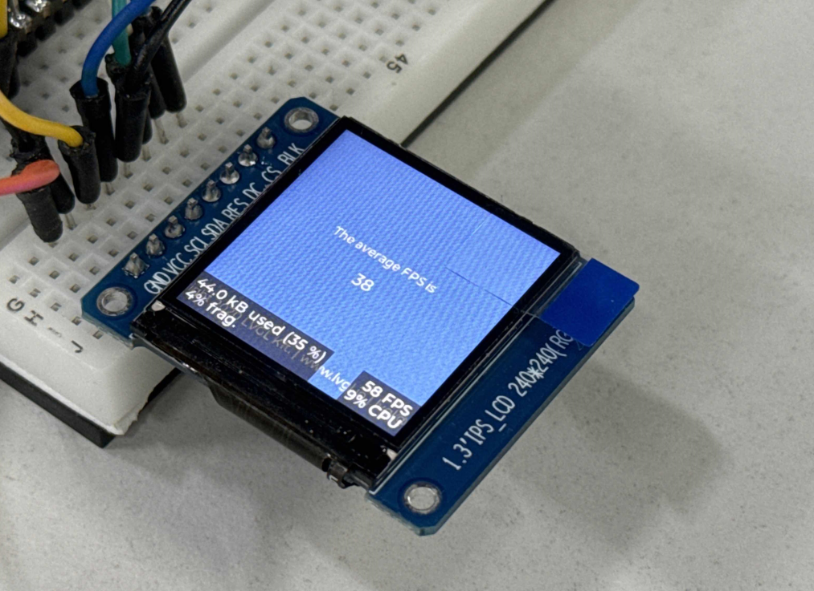

- lv_benchmark 跑分：60fps

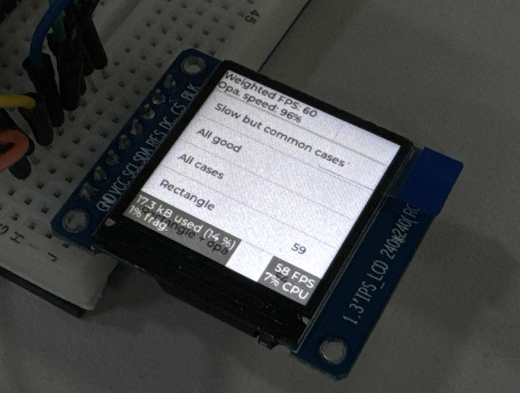

#### SPI 模式

- lv_music_demo 跑分：33fps

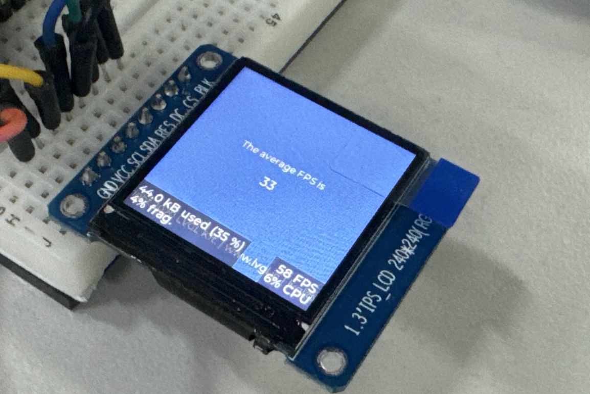

- lv_benchmark 跑分：49fps

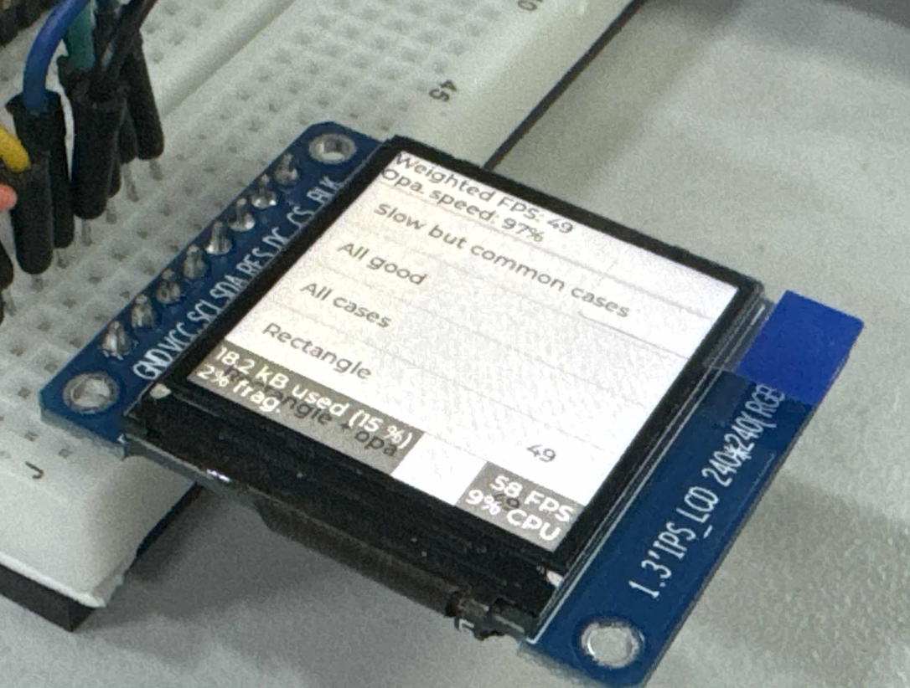

### ST7789v 2.4 寸 320x240 屏幕测试

#### DBI 模式

- lv_music_demo 跑分：26fps

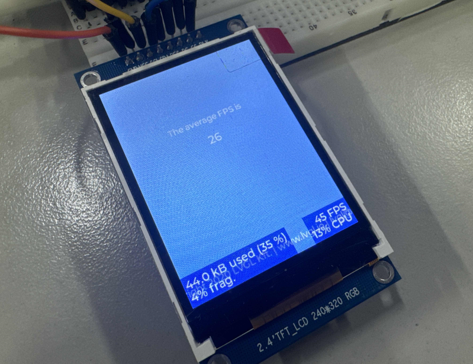

- lv_benchmark 跑分：36fps

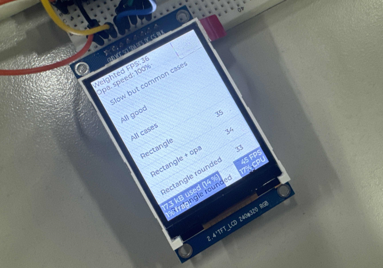

#### SPI 模式

- lv_music_demo 跑分：22fps

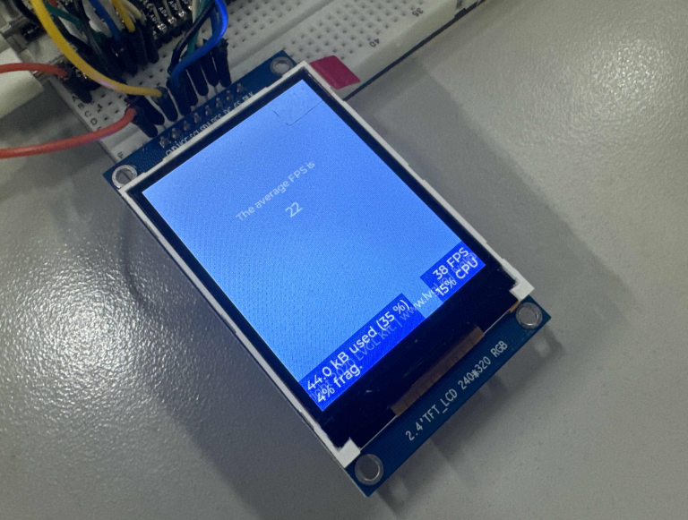

- lv_benchmark 跑分：30fps

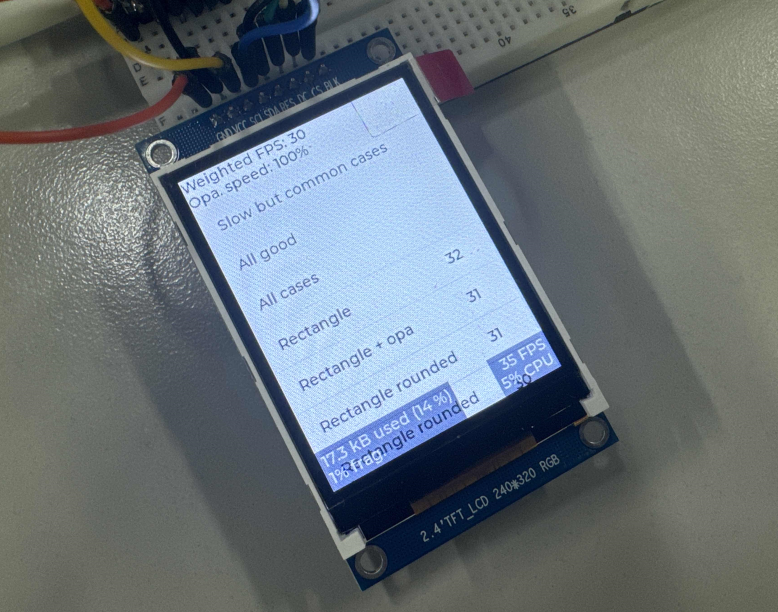

### ST7789v 1.47 寸 172x320 屏幕测试

#### DBI 模式

- lv_music_demo 跑分：38fps

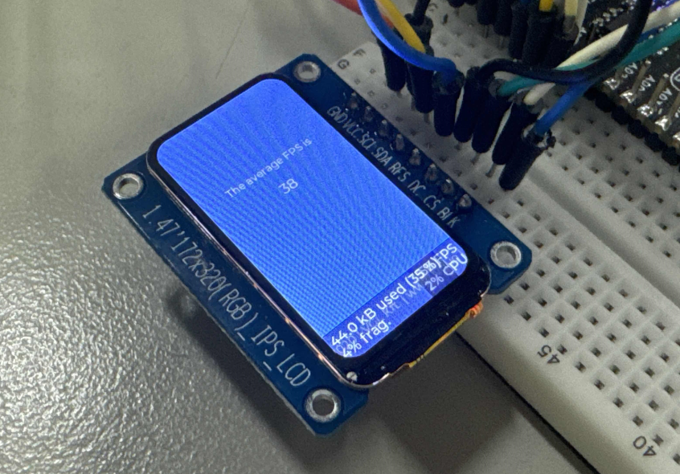

- lv_benchmark 跑分：67fps

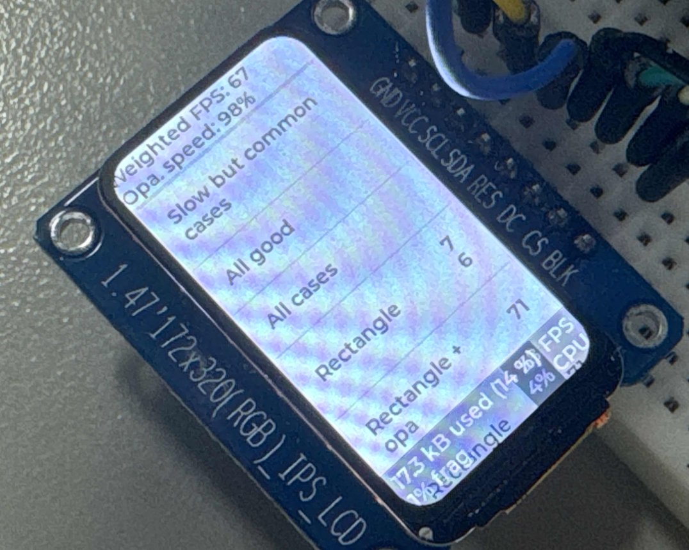

#### SPI 模式

- lv_music_demo 跑分：33fps

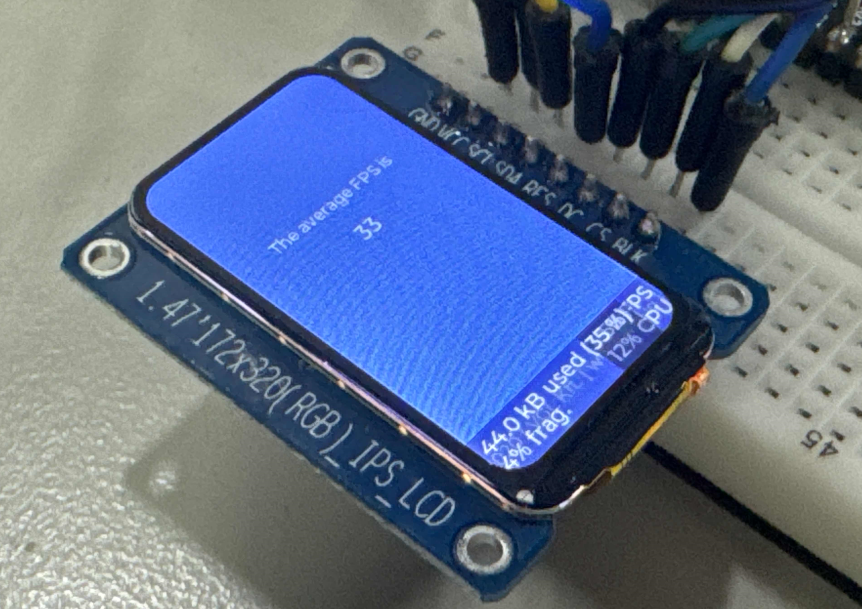

- lv_benchmark 跑分：50fps

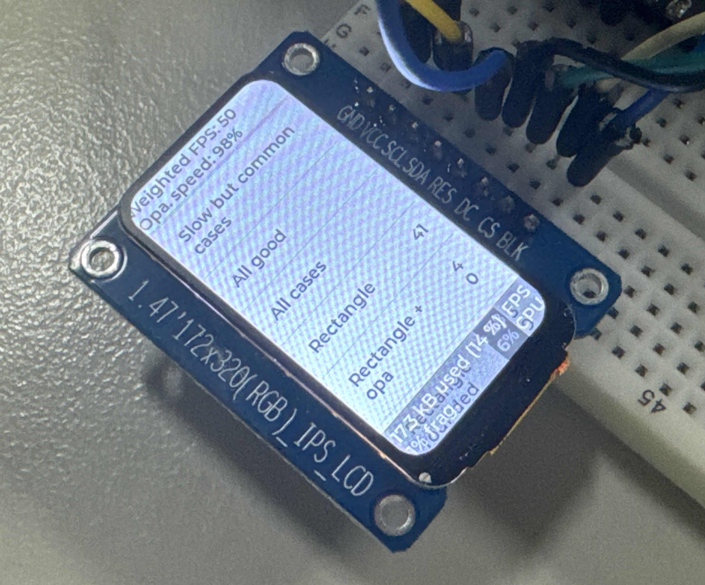

### RGB ST7701s 4寸 480x480 屏幕基准

- lv_benchmark 跑分：247fps

