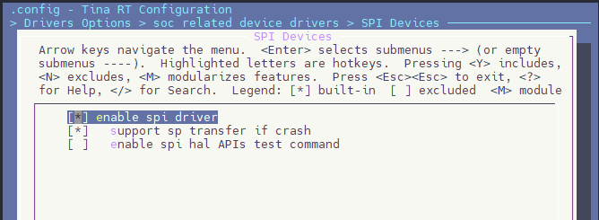

# SPI 驱动 TFT LCD 屏

R128 平台提供了 SPI DBI 的 SPI TFT 接口，具有如下特点：

- Supports DBI Type C 3 Line/4 Line Interface Mode
- Supports 2 Data Lane Interface Mode
- Supports data source from CPU or DMA
- Supports RGB111/444/565/666/888 video format
- Maximum resolution of RGB666 240 x 320@30Hz with single data lane
- Maximum resolution of RGB888 240 x 320@60Hz or 320 x 480@30Hz with dual data lane
- Supports tearing effect
- Supports software flexible control video frame rate

同时，提供了SPILCD驱动框架以供 SPI 屏幕使用。

本次使用的是 Dshan_Display Module，如下图：


引脚配置如下：

| R128 Devkit | TFT 模块 |
| ----------- | -------- |
| PA12        | CS       |
| PA13        | SCK      |
| PA18        | MOSI     |
| PA9         | PWM      |
| PA20        | RESET    |
| PA19        | RS       |
| 3V3         | 3.3V     |
| GND         | GND      |


## 载入方案

我们使用的开发板是 R128-Devkit，需要开发 C906 核心的应用程序，所以载入方案选择 `r128s2_module_c906`

```bash
$ source envsetup.sh 
$ lunch_rtos 1
```


## 设置 SPI 驱动

屏幕使用的是SPI驱动，所以需要勾选SPI驱动，运行 `mrtos_menuconfig` 进入配置页面。前往下列地址找到 `SPI Devices` 

```c
Drivers Options  --->
    soc related device drivers  --->
        SPI Devices --->
        -*- enable spi driver
```



### 配置 SPI 引脚

打开你喜欢的编辑器，修改文件：`board/r128s2/module/configs/sys_config.fex`，在这里我们不需要用到 SPI HOLD与SPI WP引脚，注释掉即可。

```
;----------------------------------------------------------------------------------
;SPI controller configuration
;----------------------------------------------------------------------------------
;Please config spi in dts
[spi1]
spi1_used       = 1
spi1_cs_number  = 1
spi1_cs_bitmap  = 1
spi1_cs0        = port:PA12<6><0><3><default>
spi1_sclk       = port:PA13<6><0><3><default>
spi1_mosi       = port:PA18<6><0><3><default>
spi1_miso       = port:PA21<6><0><3><default>
;spi1_hold       = port:PA19<6><0><2><default>
;spi1_wp         = port:PA20<6><0><2><default>
```


## 设置 PWM 驱动

屏幕背光使用的是PWM驱动，所以需要勾选PWM驱动，运行 `mrtos_menuconfig` 进入配置页面。前往下列地址找到 `PWM Devices` 

```
Drivers Options  --->
    soc related device drivers  --->
        PWM Devices --->
        -*- enable pwm driver
```


### 配置 PWM 引脚

打开你喜欢的编辑器，修改文件：`board/r128s2/module/configs/sys_config.fex`，增加 PWM1 节点

```
[pwm1]
pwm_used        = 1
pwm_positive    = port:PA9<4><0><3><default>
```


## 设置 SPI LCD 驱动

SPI LCD 由专门的驱动管理。运行 `mrtos_menuconfig` 进入配置页面。前往下列地址找到 `SPILCD Devices` ，注意同时勾选 `spilcd hal APIs test` 方便测试使用。

```
Drivers Options  --->
    soc related device drivers  --->
        [*] DISP Driver Support(spi_lcd)
        [*]   spilcd hal APIs test
```


### 选择驱动的显示屏

在 SPILCD 驱动选择界面可以看到 ` LCD_FB panels select` 选择 SPI 屏幕的驱动，**本文只注重于 SPI LCD 的使用，驱动编写请查看《SPILCD 屏幕驱动适配》**

进入 `LCD_FB panels select` 选项


选择并勾选 `[*] LCD support JLT35031C panel` 


### 配置 SPI LCD 引脚

打开你喜欢的编辑器，修改文件：`board/r128s2/module/configs/sys_config.fex`

```
;----------------------------------------------------------------------------------
;lcd_fb0 configuration
;----------------------------------------------------------------------------------
[lcd_fb0]
lcd_used            = 1              ; 使用显示屏
lcd_model_name      = "spilcd"       ; 模型：spilcd
lcd_driver_name     = "jlt35031c"    ; 屏幕驱动：jlt35031c
lcd_x               = 320            ; 屏幕宽分辨率
lcd_y               = 480            ; 屏幕高分辨率
lcd_width           = 49             ; 屏幕物理宽度
lcd_height          = 74             ; 屏幕物理高度
lcd_data_speed      = 60             ; SPI 驱动频率 60MHz
lcd_pwm_used        = 1              ; lcd使用pwm背光
lcd_pwm_ch          = 1              ; lcd使用pwm背光通道1
lcd_pwm_freq        = 5000           ; lcd使用pwm背光频率5000Hz
lcd_pwm_pol         = 0              ; lcd使用pwm背光相位0
lcd_if              = 0              ; lcd使用spi接口，0-spi, 1-dbi
lcd_pixel_fmt       = 11             ; 以下内容详见 SPILCD 文档
lcd_dbi_fmt         = 2
lcd_dbi_clk_mode    = 1
lcd_dbi_te          = 1
fb_buffer_num       = 2
lcd_dbi_if          = 4
lcd_rgb_order       = 0
lcd_fps             = 60
lcd_spi_bus_num     = 1
lcd_frm             = 2
lcd_gamma_en        = 1
lcd_backlight       = 100

lcd_power_num       = 0
lcd_gpio_regu_num   = 0
lcd_bl_percent_num  = 0

lcd_spi_dc_pin      = port:PA19<1><0><3><0> ; DC脚
;RESET Pin
lcd_gpio_0          = port:PA20<1><0><2><0> ; 复位脚
```


## 结果

以上配置完成后，编译打包烧录，上电后屏幕背光亮起，屏幕为黑色。


并且可以在 LOG 中看到 `[LCD_FB] lcd_fb_probe,line:103:` 和 `spi_clk_init()1609 [spi1] clk rate auto adjust to 48000000` SPI 初始化的 LOG。


然后可以用 `test_spilcd` 测试屏幕，日志如下


执行命令之后屏幕会变为黄色。


`test_spilcd` 代码如下：

```c
#include <stdio.h>
#include <stdlib.h>
#include <stdint.h>
#include <string.h>
#include <unistd.h>

#include <hal_cache.h>
#include <hal_mem.h>
#include <hal_log.h>
#include <hal_cmd.h>
#include <hal_lcd_fb.h>

static uint32_t width;
static uint32_t height;
static long int screensize = 0;
static char *fbsmem_start = 0;

static void lcdfb_fb_init(uint32_t yoffset, struct fb_info *p_info)
{
	p_info->screen_base = fbsmem_start;
	p_info->var.xres = width;
	p_info->var.yres = height;
	p_info->var.xoffset = 0;
	p_info->var.yoffset = yoffset;
}

int show_rgb(unsigned int sel)
{
	int i = 0, ret = -1;
	struct fb_info fb_info;
	int bpp = 4;
	unsigned char color[4] = {0xff,0x0,0xff,0x0};

	width = bsp_disp_get_screen_width(sel);
	height = bsp_disp_get_screen_height(sel);

	screensize = width * bpp * height;
	fbsmem_start = hal_malloc_coherent(screensize);

	hal_log_info("width = %d, height = %d, screensize = %d, fbsmem_start = %x\n",
			width, height, screensize, fbsmem_start);

	memset(fbsmem_start, 0, screensize);
	for (i = 0; i < screensize / bpp; ++i) {
		memcpy(fbsmem_start+i*bpp, color, bpp);
	}

	memset(&fb_info, 0, sizeof(struct fb_info));
	lcdfb_fb_init(0, &fb_info);
	hal_dcache_clean((unsigned long)fbsmem_start, screensize);
	bsp_disp_lcd_set_layer(sel, &fb_info);

	hal_free_coherent(fbsmem_start);
	return ret;
}

static int cmd_test_spilcd(int argc, char **argv)
{
    uint8_t ret;

    hal_log_info("Run spilcd hal layer test case\n");

    ret = show_rgb(0);

    hal_log_info("spilcd test finish\n");

    return ret;
}

FINSH_FUNCTION_EXPORT_CMD(cmd_test_spilcd, test_spilcd, spilcd hal APIs tests)
```

