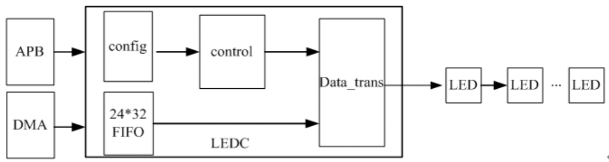
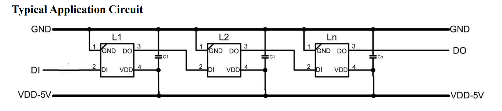
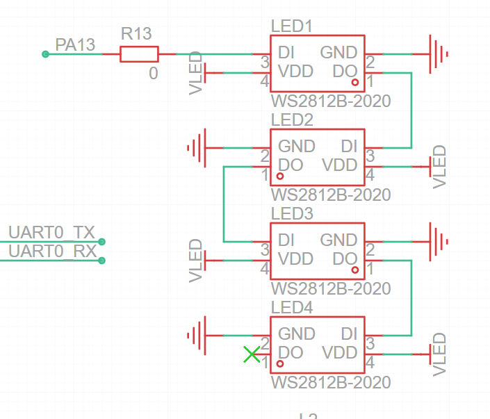

# 驱动 WS2812 流水灯

| 本文案例代码 | 下载地址 |
| ---------------------- | -------------------------------------- |
| 驱动 WS2812 流水灯案例代码 | https://www.aw-ol.com/downloads?cat=24 |

R128-DevKit 拥有4颗 WS2812 LED，本文将详细叙述如何点亮他们。


## LEDC 模块简介



LEDC 硬件方框图如上图所示，CPU 通过 APB 总线操作 LEDC 寄存器来控制 LEDC；当 CPU配置好 LEDC 的相关寄存器之后，通过 CPU 或 DMA 将 R、G、B 数据从 DRAM 搬到 LEDC FIFO 中，启动 LEDC 之后就可以通过 PIN 脚向外部的 LED 发送数据了。



LED 典型电路如图所示，其中 DI 表示控制数据输入脚，DO 表示控制数据输出脚。DI 端接收从控制器传过来的数据，每个 LED 内部的数据锁存器会存储 24bit 数据，剩余的数据经过内部整形处理电路整形放大后通过 DO 端口开始转发输出给下一个级联的 LED。因此，每经过一个LED，数据减少 24bit。


注意，如果在单次直接设置第 n 个 LED 的亮度和色彩的时候，前面 n-1 个 LED 的亮度数据会在第 n 个 LED 的数据前发送，不过这些数据将会是原来 n-1 个 LED 的亮度数据。

由于拥有独立的 LEDC 模块，在 R128 平台上驱动 WS2812 类似的 RGB LED 不需要使用 SPI 模拟，也不需要使用 PWM 配置时序。直接使用这个模块即可。

## 设置 LEDC 驱动

运行 `mrtos_menuconfig` 进入配置页面。前往下列地址找到 `LEDC Devices`

```
Drivers Options  --->
    soc related device drivers  --->
            LEDC devices --->
                [*] enable ledc driver
```

找到 LEDC Devices


勾选如下选项


## 配置 LEDC 参数

参考电路图可知，LEDC 模块连接的是 R128 的 `PA13` 引脚。参考手册可知 MUX 为 7



前往 `lichee/rtos/drivers/rtos-hal/hal/source/ledc/platform/ledc_sun20iw2.h` 并编辑 LEDC 的引脚和MUX

```c
#define LEDC_PIN	GPIOA(13)
#define LEDC_PINMUXSEL	7
```


然后编辑 `lichee/rtos/drivers/rtos-hal/hal/source/ledc/hal_ledc.c` 配置 WS2812 的时序参数：

```c
struct ledc_config ledc_config = {
	.led_count = 4,
	.reset_ns = 84,
	.t1h_ns = 1000,
	.t1l_ns = 1000,
	.t0h_ns = 580,
	.t0l_ns = 1000,
	.wait_time0_ns = 84,
	.wait_time1_ns = 84,
	.wait_data_time_ns = 600000,
	.output_mode = "GRB",
};
```


## 编译测试

编译后烧录开发板


可以用命令 `hal_ledc` 来测试

```
hal_ledc <LED号> <R|G|B> <亮度>
```

### 点亮红色 LED

运行命令

```
hal_ledc 1 R 100
```


即可点亮第一颗 LED


### 点亮绿色 LED

运行命令

```
hal_ledc 2 G 100
```


第二颗 LED 即可点亮绿色


## 实现七彩流水灯

前往项目文件夹编辑 `main.c`，这里我选择在 M33 核心上编写程序，所以选用的是  `lichee/rtos/projects/r128s2/module_m33/src/main.c` ，如果是编写 C906 核心的程序，请修改 `lichee/rtos/projects/r128s2/module_c906/src/main.c`

```c
#include <sunxi_hal_ledc.h>
#include <hal_cmd.h>
#include <hal_timer.h>

// 使用RGB 分量合成颜色值
#define MERAGECOLOR(G, R, B) (((uint32_t)G << 16) | ((uint16_t)R << 8) | B)
#define PIXEL_NUM 4

// 生成颜色
uint32_t WS281x_Wheel(uint8_t wheelPos) {
  wheelPos = 255 - wheelPos;
  if (wheelPos < 85) {
    return MERAGECOLOR(255 - wheelPos * 3, 0, wheelPos * 3);
  }
  if (wheelPos < 170) {
    wheelPos -= 85;
    return MERAGECOLOR(0, wheelPos * 3, 255 - wheelPos * 3);
  }
  wheelPos -= 170;
  return MERAGECOLOR(wheelPos * 3, 255 - wheelPos * 3, 0);
}

// 设置灯颜色
int LED_Color(int led_num, uint8_t R, uint8_t G, uint8_t B) {
  sunxi_set_led_brightness(led_num, MERAGECOLOR(G, R, B));
}

// 测试 LEDC
int ledc_test_loop() {
  int i = 0, j = 0, err;
  int mode = 0;
  uint8_t R = 0, G = 0, B = 0;

  err = hal_ledc_init();
  if (err) {
    printf("ledc init error\n");
    return -1;
  }

  while (1) {
    for (j = 0; j < 256; j++) {
      for (i = 0; i < PIXEL_NUM; i++) {
        sunxi_set_led_brightness(
            i + 1, WS281x_Wheel(((i * 256 / PIXEL_NUM) + j) & 255));
        msleep(1);
      }
      msleep(10);
    }
  }
  return 1;
}
```

并且将测试函数加入到 `cpu0_app_entry` 中。


重新烧录即可实现七彩流水灯


