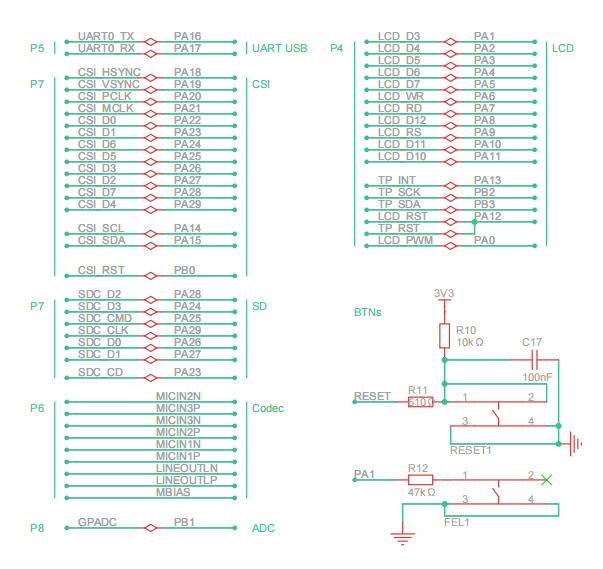
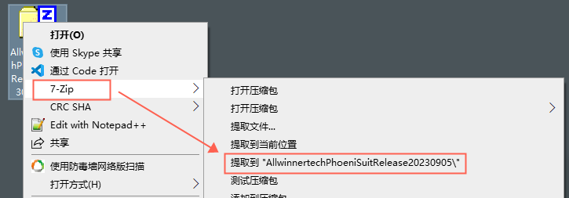

# R128 EVT 开发套件

针对 R128 模组，百问科技推出了 R128 EVT 开发套件作为快速开发评估工具。


- 板载 R128-S2-N16R16 模组
- 板载 USB Type C OTG
- 板载 UART 转 USB 芯片
- 板载 RESET，FEL 下载按键
- 板载 PMU，支持 USB 5V 供电和 DC 5~12V 供电
- 板载 4 寸 86 面板屏
- 板载 4 寸 FT5136 电容式触摸屏
- 板载 DVP 摄像头接口
- 板载双 MIC 
- 板载功放，支持 AEC 回音消除
- 板载 SD Card 卡槽
- 板载 ADC 按键
- IPEX 天线

## 资源下载

- 硬件工程开源地址：[https://oshwhub.com/gloomyghost/r128-module](https://oshwhub.com/gloomyghost/r128-module)
- 电路图：[SCH_R128_EVT_2023-10-20.pdf](https://www.aw-ol.com/downloads?cat=22)
- PCB：[ProDocument_R128-EVT_2023-10-20.epro](https://www.aw-ol.com/downloads?cat=22)
- GERBER：[Gerber_R128_EVT_2023-10-20.zip](https://www.aw-ol.com/downloads?cat=22)
- STL：[DXF_R128_EVT_2023-10-20.dxf](https://www.aw-ol.com/downloads?cat=22)
- 3D STEP：[3D_R128_EVT_2023-10-20.zip](https://www.aw-ol.com/downloads?cat=22)
- BOM：[BOM_R128-EVT_R128_EVT_2023-10-20.xlsx](https://www.aw-ol.com/downloads?cat=22)
- 点位图：[PickAndPlace_R128_EVT_2023-10-20.xlsx](https://www.aw-ol.com/downloads?cat=22)
- USB 转 UART 驱动下载：[CH341SER.EXE](https://www.wch.cn/downloads/CH341SER_EXE.html)

## 购买链接

- [百问科技淘宝店 - 全志R128 EVT](https://m.tb.cn/h.5T4uATe?tk=S079W0vCt6v)

## 原理图模块介绍

### 硬件框图


### PCB 框图


### 电源

EVT 支持 USB 供电与 DC 12V 直流供电，通过一个滑动开关控制电源。并且板载 5V 转 3.3V 电源芯片，为外设和 R128 提供最高 2A 的电流。


### R128 模组

R128 模组使用 SMT 贴装于 开发板上，其中的PA16，PA17脚复用为 UART 调试脚，已经在板上连接了 UART 转 USB 芯片。


### 系统按键与 IO 复用

EVT 板载 2 颗按键，控制 R128 芯片 RESET 与 FEL 烧录功能。

IO 复用如图所示，其中 SD 卡与摄像头 CSI 是共用 IO 状态，使用时需要注意。



### LCD 接口

EVT 板载 40 Pin LCD 接口，使用的协议是 intel 8080，其中支持电容式触摸屏。


### USB 与 UART

EVT 板载两个 USB Type-C 连接器，板载 CH340N USB 转 UART 接口芯片，方便开发使用。


### 麦克风与扬声器

开发板板载两颗模拟硅麦。并且板载功放电路与 AEC 回音消除电路。


### CSI 摄像头

EVT 支持 DVP 摄像头，型号 GC0308。


### TF Card

EVT 支持 SD 卡，支持最高 SDXC 规格


### ADC 按键

EVT 板载 ADC 按键，连接到 R128 模组的 PB1 引脚上


## 烧录测试固件

### 安装烧录软件

前往 [全志在线-资料下载](https://www.aw-ol.com/downloads?cat=5) 页面，选择下载 `AllwinnertechPhoeniSuitRelease20230905.zip`


将下载的压缩包解压，提取到文件夹中



在文件夹中找到需要的 Windows 版本，同样解压到文件夹中


找到 `PhoenixSuit.exe` 双击打开即可


打开后的软件如下所示


### 安装 USB 驱动

下载程序需要安装上 USB 驱动，驱动位于刚才安装的烧录软件 PhoenixSuit 的 Drivers 目录中：


在这里面可以找到两个驱动，安装 AW_Deiver


运行 `InstallUSBDrv.exe` 即可开始安装


安装过程中提示无法验证此驱动程序软件的发布者点击始终安装即可。


安装完成后，将 EVT 通过 USB TypeC 线接入电脑，注意需要插入 OTG 口，然后打开开关。


然后按住 FEL 按键，之后按一下 RESET 按键重置芯片，等待电脑连接后再松开 FEL 按键


连接的 DevKit 可以在 设备管理器-通用串行总线控制器看到设备：`USB Device(VID_1f3a_PID_efe8)`


如果没找到这个设备，但是看到了一个未知设备，请尝试手动安装驱动，详见 [开发环境搭建-Windows 驱动安装](https://r128.docs.aw-ol.com/r128/prepare_dev_env/)


### 获取测试固件

前往 [全志在线-资料下载](https://www.aw-ol.com/downloads?cat=21) 页面找到 R128 固件，选择下载 `R128EVT出厂固件` 


然后将固件 `rtos_freertos_r128s2_evt_uart0_16mnor.img` 解压缩出来。


### 烧录测试固件

打开 PhoneixSuit，选择一键刷机，点击浏览，选择下载的  `rtos_freertos_r128s2_evt_uart0_16mnor.img` 


配置烧录选项，选择全盘擦除升级


将 EVT 通过 USB TypeC 线接入电脑，注意需要插入 OTG 口，然后打开开关。


然后按住 FEL 按键，之后按一下 RESET 按键重置芯片，等待电脑连接后再松开 FEL 按键


然后就会进入烧录状态


提示固件烧写成功


可以看到屏幕点亮显示 LOGO


## R128 EVT 外设测试

### UART 控制台测试

烧录之后，可以使用 USB Type-C 数据线连接 EVT 开发板


然后配置为对应的 COM 口，波特率设置为 115200


即可访问控制台


### 显示屏测试

正常测试固件启动会显示 LOGO 图


可以使用以下命令测试显示屏

```
disp -c 0 1
```


此时屏幕将显示 ColorBar


### 摄像头测试

前往 [全志在线-资料下载](https://www.aw-ol.com/downloads?cat=21) 页面找到 R128 固件，选择下载 `R128EVT测试固件` ，烧录 `摄像头测试固件.img` 


如图接入摄像头


运行

```
camera_preview csi
```


显示屏会显示摄像头拍到的画面

### TF Card 测试

前往 [全志在线-资料下载](https://www.aw-ol.com/downloads?cat=21) 页面找到 R128 固件，选择下载 `R128EVT测试固件` ，烧录 `R128EVT SD卡测试固件.img` 


然后烧录启动后插入 TF 卡，注意请先把 SD 卡格式化为 FAT32 格式。请注意测试 SD 卡时请断开摄像头连接。


可以在 LOG 中查看到 SD 卡正常挂载。


