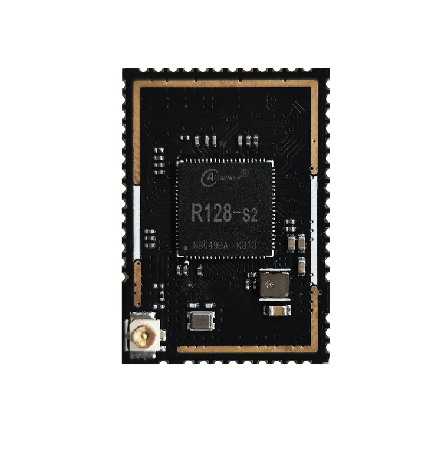
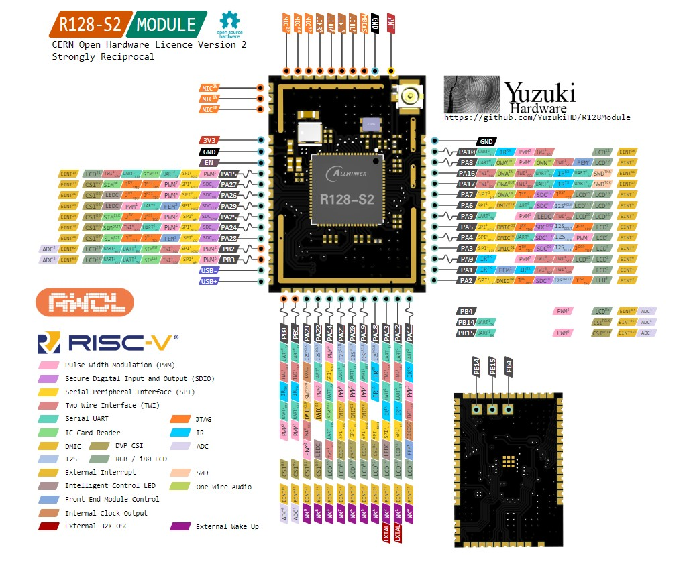

# R128 模块

针对 R128 芯片，百问科技提供推出了一种型号模块，如下表所示

| 型号                 | SoC     | CPU0           | CPU1        | DSP       | SRAM   | LS-PSRAM | HS-PSRAM | Flash         | DAC                                         |
| -------------------- | ------- | -------------- | ----------- | --------- | ------ | -------- | -------- | ------------- | ------------------------------------------- |
| R128-S2-N16R16 | R128-S2 | Arm M33 Star | C906 RISC-V | HIFI5 DSP | 1MByte | 8Mbyte   | 8Mbyte   | 16M NOR Flash | 2 Audio DAC LINEOUTLP/N LINEOUTRP/N |

## R128-S2-N16R16

### 详细参数

- XuanTie 64Bit RISC-V [GCV] C906 CPU, Support Vector 0.7
- Arm M33 Star MCU
- HiFi5 Audio DSP Xtensa LX7

- 1MB SRAM
- 8MB   SiP OSPI HS_PSRAM@800MHz
- 8MB   SiP OSPI  LS_PSRAM@AHB Clock with DMA
- 16MB SiP QSPI NOR

- RGB666, i8080, BT656, SPI Display up to 1024x768@60fps
- G2D 2D graphics acceleration
- DVP up to 1920x1088, JPEG encoding 1920x1088, 1024x768@40fps

- 3 Audio ADC, 24Bit, 8kHz-96kHz, Support 4 DMICs
- 2 Audio DAC, 24Bit, 8kHz-384kHZ
- USB2.0 OTG
- 3 * UART, 2 * SPI, 2 * TWI, 8 * PWM, 1 * 12Bit 10 Channels ADC
- IR TX/RX, LEDC up to 1024 * WS2812
- ISO 7816 Card Reader
- Wi-Fi Compatible with IEEE 802.11 b/g/n 2.4GHz
- Bluetooth 5.0 Dual Mode complies with V2.1/4.0/4.2/5.0, Support BR/EDR

- 25.5*18mm, IPEX ANT, ESP32-S3 Compatible Pinout

### 资源下载

- 硬件工程开源地址：https://oshwhub.com/gloomyghost/r128-module
- 电路原理图：[SCH_R128-S2_2023-10-08.pdf](https://www.aw-ol.com/downloads?cat=22)
- PCB图：[PCB_R128-S2_2023-10-08.pdf](https://www.aw-ol.com/downloads?cat=22)
- PCB：[ProDocument_R128-S2-N16R16_2023-10-08.epro](https://www.aw-ol.com/downloads?cat=22)
- GERBER：[SCH_R128-S2_2023-10-08.pdf](https://www.aw-ol.com/downloads?cat=22)
- ODB++：[odb++_pcb_2023-10-08.zip](https://www.aw-ol.com/downloads?cat=22)
- 3D STEP：[3D_R128-S2_2023-10-08.zip](https://www.aw-ol.com/downloads?cat=22)
- BOM：[BOM_R128-S2-N16R16_R128-S2_2023-10-08.xlsx](https://www.aw-ol.com/downloads?cat=22)
- 点位图：[PickAndPlace_R128-S2_2023-10-08.xlsx](https://www.aw-ol.com/downloads?cat=22)
- 引脚图：[R128-S2-N16R16_PINOUT.svg](https://www.aw-ol.com/downloads?cat=22)

### 购买链接

- [百问科技淘宝店 - 全志R128模组](https://m.tb.cn/h.5T4uATe?tk=S079W0vCt6v)

### 引脚图

- 压缩后图片较模糊请下载高清引脚图：[R128-S2-N16R16_PINOUT.svg](https://www.aw-ol.com/downloads?cat=22)

