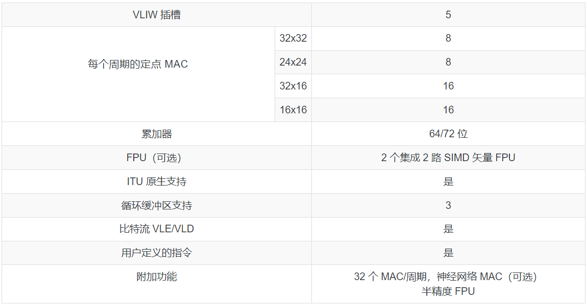
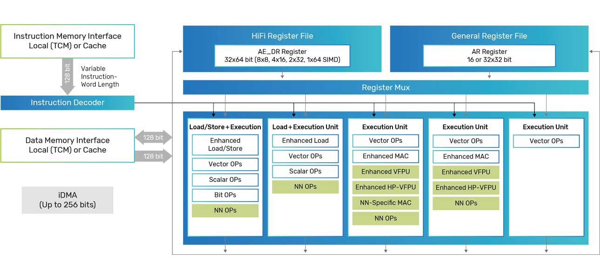

# DSP 简介

R128 内置 HIFI5 DSP，具有如下特点：

- 每个周期两个 128 位负载
- 与 HiFi 4 DSP 相比，用于预处理和后处理的 MAC 容量提高了 2 倍
- 与 HiFi 4 DSP 相比，用于神经网络处理的 MAC 容量提高了 4 倍，包括每个周期 32 个 16x8 或 16x4 MAC
- 每个周期可选八个单精度浮点 MAC。更新为：“每个周期 8 个单精度浮点 MAC
- 每个周期可选 16 个半精度浮点 MAC。更新为：“每个周期 16 个单精度浮点 MAC
- HiFi 神经网络库提供了在神经网络库处理（特别是语音）中常用的经过高度优化的库函数集合，可以轻松集成到流行的机器学习框架中
- 与完整的 HiFi DSP 产品系列的软件兼容，总共有超过 300 个 HiFi 优化的音频和语音编解码器以及音频增强软件包

## HIFI5 DSP 框图

## 相关资源

- [HIFI5 DSP 官网](https://www.cadence.com/zh_CN/home/tools/ip/tensilica-ip/hifi-dsps/hifi-5.html)
- [HIFI5 NN Lib](https://github.com/foss-xtensa/nnlib-hifi5)

- Xtensa Xplorer 下载地址：[Xplorer Software (SDK) Download](https://www.cadence.com/en_US/home/tools/ip/tensilica-ip/sdk-download.html)
- Xtensa Xplorer 授权申请： [Cadence Tensilica Offerings](https://www.cadence.com/en_US/home/tools/ip/tensilica-ip/technologies.html)
- Xtensa Xplorer 试用申请：[request an evaluation license](https://www.cadence.com/en_US/home/tools/ip/tensilica-ip/tensilica-sdk-evaluation-request-form.html)