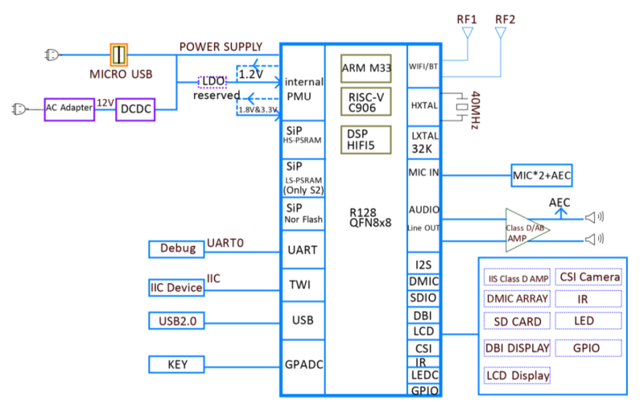
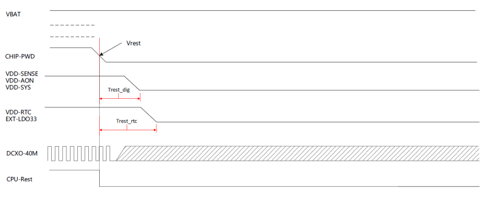
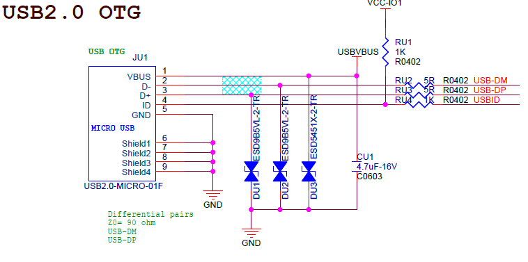

# 模组硬件设计指南

## 原理图设计

### 硬件系统框图

R128是一颗专为“音视频解码”而打造的全新高集成度 SoC，主要应用于智能物联和专用语音交互处理解决方案。

- 单片集成 MCU+RISCV+DSP+CODEC+WIFI/BT+PMU，提供生态配套成熟、完善的用于系统、应用和网络连接开发的高效算力；
- 集成 8MB/16MB/32MB PSRAM，为音视频解码、大容量存储、扫码以及网络连接提供充裕的高容量、高带宽的内存支持；
- 拥有丰富的音频接口 IIS/PCM、OWA、DMIC、LINEOUT、MICIN 以及通用通讯接口 IIC、UART、SDIO、 SPI、ISO7816卡接口；同时支持 U 盘、SD卡、IR-TX/RX；
- 内置 LDO、GPADC、LEDC，简化系统方案设计，降低 BOM成本。

### 硬件系统基本工作原理

R128硬件系统基本工作流程如下：

- 硬件系统正常上电，主控复位之后，CPU开始执行 BROM固化代码，对系统资源和关键外设进行配置及初始化，包括电源，时钟，总线，复位，存储接口等。
- 根据配置，在 BROM阶段将系统初始化信息（串口、PSRAM等）从存储介质读取到系统 SRAM，进行芯片及系统的进一步详细配置和初始化工作；执行完 Boot0 程序后进入 boot 阶段。
- 从外部存储介质中读取下一阶段需要的软件代码，启动操作系统，并对系统资源和外设进行管理。
- 操作系统启动之后，根据产品不同需求加载相关启动，比如 USB、音频、WIFI、显示、蓝牙等模块，最终完成开机启动，进入普通操作界面。
- 系统支持 watchdog 应用监视系统的运行，当程序跑飞或者发生死循环时，watchdog模块会发出一个复位信号，使 SOC复位，软件系统重新启动。

R128硬件系统组成如下表：

| 系统           | 说明                                                         |
| -------------- | ------------------------------------------------------------ |
| CPU小系统      | 时钟，复位，中断，系统配置                                   |
| 存储系统       | PSRAM，SPI NAND/SPI NOR/EMMC/SD CARD                         |
| 音频系统       | MIC IN、FMIN、IIS/PCM/TDM、DMIC、LINEOUT                     |
| 输入输出子系统 | RGB、SD CARD、USB OTG/HOST、TWI、UART、PWM、GPADC、TPADC、CSI、 IR TX/RX 等 |
| 电源系统       | DCDC、LDO                                                    |
| 无线           | WIFI/BT                                                      |
| 其他           | 功放、LED                                                    |

### CPU小系统

R128 CPU小系统包括时钟系统，系统配置 PIN、复位系统和 Debug 部分。

#### 时钟系统信号PIN说明

R128 硬件系统包含 DCXO 40M/RTC 32.768K 两个时钟，对应时钟信号说明如表所示。

| 信号名    | 信号描述     | 应用说明                             |
| --------- | ------------ | ------------------------------------ |
| HXTAL_IN  | DCXO晶振输入 | 默认使用 40M晶振，频率误差为 10PPM； |
| HXTAL_OUT | DCXO晶振输出 | 默认使用 40M晶振，频率误差为 10PPM； |
| LXTAL_IN  | 32K晶振输入  | 32.768K晶振电路，频率误差为 20PPM    |
| LXTAL_OUT | 32K晶振输出  | 32.768K晶振电路，频率误差为 20PPM    |

!> RTC 32.768K时钟可以从内部 RC振荡电路产生，可不使用外部 32K晶振。

#### 小系统配置说明

R128小系统配置 PIN说明如表所示。

| 信号名   | 信号说明                     | 应用说明                                        |
| -------- | ---------------------------- | ----------------------------------------------- |
| RESET    | system reset                 | 1，系统复位 PIN 2，Watchdog 输出 PIN        |
| CHIP-PWD | Chip power down/System reset | 1，内部 PMU 下电控制 pin； 2，系统复位 pin |
| PA1/FEL0 | FEL功能选择 pin 0            | 当[FEL0,FEL1]= 00时，SOC进入 FEL升级状态        |
| PA2/FEL1 | FEL功能选择 pin 1            | 当[FEL0,FEL1]= 00时，SOC进入 FEL升级状态        |

- RESET和 CHIP-PWD均可实现系统复位功能，但 CHIP-PWD包含 R128内部 PMU掉电控制功能，可让R128实现上电复位功能。
- RESET/CHIP-PWD信号上接下地电容默认为 1nF，用于滤波和增强 ESD 防护能力
- 为避免 SOC启动时误进入升级状态，PA1/FEL0和 PA2/FEL1 不能同时接下拉电阻。

#### 主晶振电路

- R128 DCXO模块推荐使用 40M 晶振以获得更好的射频性能。
- 晶振选型参考如下:
  - R128集成 WIFI/BT功能，为获得更好的射频性能，建议晶振选型频率容限与频率稳定性均≤ 10ppm
  - 晶体负载电容指标 CL，建议 CL≥10pF。CL过小会导致晶体温飘过大
  - 晶体驱动能力 DL，建议典型值 100uW，最大不超过 200uW。取值过小会影响晶体寿命。
- 外挂匹配电容大小根据晶振规格和 PCB而定，要求匹配电容+板级杂散电容总值等于晶振规格要求的负载电容大小。
- 串接电阻需要预留位置，便于调试振荡幅度处理 EMI 问题。

!> 晶振参数不得随意更改，需保证晶体自身负载电容、外挂匹配电容、PCB走线负载电容三者匹配。

#### 32.768K时钟电路

- 支持内部 RCOSC时钟，支持 HOSC校准，满足 32.768K时钟输出。
- 外挂 32.768K 晶振时，外挂匹配电容大小根据晶振规格和 PCB而定，要求匹配电容+板级杂散电容总值等于晶振规格要求的负载电容大小。
- LXTAL_IN/LXTAL_OUT 之间并接的电阻，必须保留，用于对频率微调。

!> 晶振参数不得随意更改，需保证晶体自身负载电容、外挂匹配电容、PCB走线负载电容三者匹配。

#### 复位电路设计

R128可以选择使用外部复位 IC提供复位信号，也可以使用内部复位源。

- 内部上电复位触发门槛：VBAT爬升至约 2.4V；
- 内部下电复位触发门槛：VBAT跌落至 3.0V/2.9V/2.8V/2.7V/2.6V/2.5V(软件可配置)，详见 R128用户手册；
- 使用外部复位 IC 复位，时长不得低于 64ms；
- RESET Pin放置 1nF电容。

#### DEBUG电路设计

R128支持 USB（OTG）、UART、JTAG与 SWD 等多种调试方式，客户可根据需要选择合适的调试方式，建议在设计时对相应的调试接口预留测试点方便后续调试验证。

### 电源系统设计

#### SOC端电源质量要求

R128集成 PMU，外部仅需提供 VBAT 电源即可满足 R128 电源应用需求，其他电源由内部 PMU 产生。

#### SOC端电源电容设计

R128 SOC端各电源要求滤波电容容值如下：

- VDD_LX管脚建议预留放置 1个 2.2uF电容；
- VDD_SENSE管脚建议放置 1个 4.7uF电容；

- VDD_CLK、VDD18_ANA1、VDD18_TX1、VDD18_ANA2、VDD18_TX2电源 pin建议各放置 1个 100nF电容，靠近管脚放置；

- VDD_DSP建议放置 1个 1uF电容，靠近管脚放置；
- VDD_RTC建议放置 1个 1uF电容，靠近管脚放置；

- VDD_SYS1、VDD_SYS2建议各放置 1 个 1uF电容，靠近管脚放置；
- VDD_AON建议放置 1个 1uF电容，VDD12_PSM 建议放置 1 个 100nF 电容，靠近管脚放置；

- VDD_3V3建议放置 1个 1uF电容， VDD33_LB1、VDD33_LB2 建议各放置 1 个 100nF 电容，靠近管脚放置；
- VDD_IO1、VDD_IO2、VDD_IO_5VTOL建议各放置 1 个 100nF 电容，靠近管脚放置；

- AVDD电源与 AGND之间至少 1个 2.2uF电容，靠近引脚放置。

#### 上电时序设计

R128各模块供电采用内部 PMU，其上电时序如图所示，时序描述如下：

- VBAT为 SOC外部电源输入，其上电至 2.4V附近触发内部 POR复位；
- 完成 POR 复位后，PMU各路 DCDC、LDO按照下图所示时序进行上电；

当使用外部 DCDC 或 LDO为 R128 的 VDD_IO1、VDD_IO2和 VDD_IO_5VTOL进行供电时，为避免电源从
IO漏电导致 SOC启动失败，建议使用 EXT_LDO（pin VDD_3V3）对外部 DCDC或 LDO 进行时序控制。

#### 下电时序设计

R128下电时序如图所示，时序描述如下：

- R128内部集成掉电复位功能，通过检测 VBAT电压触发复位，可软件使能掉电复位功能和配置门槛电压，详见 R128 用户手册描述；
- 复位信号拉低后，DXCO、RCOSC停止振荡，各路 DCDC、LDO停止输出。

### PSRAM 电路设计

R128内置 PSRAM，无需外部电路，只需满足 R128 电源设计要求即可。

### Flash 电路设计

R128支持合封 SPI Nor FLSAH，支持外挂 SPI Nand/Nor、eMMC，设计说明如下：

- 使用合封 SPI Nor FLASH 时，VDD-IO1必须使用 3.3V电源；
- 使用外挂 SPI Nand/Nor、eMMC 器件时，可选择从 PA24-PA29、PB4-PB7&PB14/15、PA2-PA7 三个地方启动；
- 启动介质选择支持 Try 与 eFuse Select 两种方式；
- Try 方式启动顺序为 SDC0->SPI NOR->SPI NAND->EMMC，该模式仅支持轮询 PA 口的启动介质
- eFuse Select方式启动顺序由 eFuse决定，具体启动顺序及烧码值可定制

#### SPI NOR/NAND 参考设计

### GPIO 电路设计

R128 有PA/PB 2 组GPIO,GPIO 逻辑电平与供电电压有关。

- 未使用的GPIO 优先建议接地或者Floating，软件设定为disabled 状态；
- IO 上拉电阻上拉电压选择IO 所在电源域。

| GPIO 分组 | 控制器电源域 | IO电源域     | IO电压       |
| --------- | ------------ | ------------ | ------------ |
| PA0~PA14  | VDD-SYS      | VDD-IO2      | 3.3V/1.8V    |
| PA18~PA23 | VDD-SYS      | VDD-IO2      | 3.3V/1.8V    |
| PA16~PA17 | VDD-SYS      | VDD-IO-5VTOL | 5V/3.3V/1.8V |
| PA15      | VDD-SYS      | VDD-IO1      | 3.3V/1.8V    |
| PA24~PA29 | VDD-SYS      | VDD-IO1      | 3.3V/1.8V    |
| PB0~PB15  | VDD-SYS      | VDD-IO1      | 3.3V/1.8V    |

### LED电路设计

R128集成 LEDC功能，可以直接驱动集成式 LED。

集成式 LED一般供电范围是 3.5～5.3V，Vih必须大于 0.7*VDD，如 WS2812C。当 VDD为 5V供电时，Vih必须大于 3.5V，已超出 SOC IO输出电压范围。解决方案：

- 5V供电串联 1N4148二极管，降低 VDD电压，理论 VDD电压为 4.3V，此时 Vih 大于 3V 即可；
- 市场已有 5V 供电且支持 3.3V逻辑控制的集成式 LED，如 WS2128B-V4/V5。

### USB电路设计

R128 USB接口具有 HOST和 OTG功能，在产品功能定义上需要注意区别。

- 若使用 Micro USB 供电，建议在 VBUS上放置限流和防倒灌 IC、TVS 保护器件；
- USB-ID 信号为 OTG 检测信号，上拉电压选择 USB-ID Pin所在电源域；
- USB-ID 信号到 SOC端的 GPIO 串接 1K~1.5K电阻提升 ESD性能；
- 建议在 VBUS 上放置稳压管和 TVS保护器件；
- D+/D-信号线为高速信号线，并接的 TVS 要求低容值，否则影响数据传输，以小于 4pF 为宜；串接预留 5 电阻。

### SD Card 电路设计

- SDC0-CLK串接 33R电阻，靠近 SoC摆放；
- SDC0-CMD和 SDC0-DET Pin芯片内部集成 15K上拉电阻，外部 10K上拉默认 NC；
- SDC0-DET串接 1K电阻，减缓信号下冲和提供 IO ESD能力；
- 靠近 SD 卡座，每个信号 Pin放置 ESD器件。
- SD卡座电源 VDD预留串联 0R电阻，防止卡插入时，瞬间大电流烧卡。

### 音频电路设计

- 3个 ADC，可支持 3 个差分 MIC 输入；
- 2个 DAC，R128-S1/S2可支持差分立体声输出，R128-S3可支持单声道差分音频输出；
- 支持 1 套 I2S/PCM 接口，支持 TDM模式，支持主从模式；
- 支持 OWA 输出，兼容 SPDIF 协议；
- 支持 DMIC 8 声道输入。

音频设计建议如下：

- AVDD对地电容为 2.2uF；VRA1对地电容为 470nF；VRA2对地电容为 470nF；MBIAS对地电容为 2.2uF；
- AVDD/VRA1/VRA2的 AGND通过 0R电阻单点到 GND；

- MIC1-3建议组合成 2MIC+1AEC 电路；

MIC和 AEC参考设计如图所示。AEC 回路电阻电容参数与功放输出幅度和算法公司要求有关，参数以实际开发环境为准。

##### 硅MIC参考电路

##### 驻极体MIC参考电路

### ADC电路设计

支持 1 路 GPADC 接口，12bit采样分辨率，9bit采样精度，单通道最高采样率为 1MHz，最大支持 8 通道，可以用作按键功能或采集电池电压使用。

- GPADC 量程范围为 0～2.5V，应用时建议使用 0.2～2.3V作为输入检测电平；
- 按键按键分压电阻，请使用推荐的阻值，如 5 个按键以下，推荐使用 1%精度电阻。添加按键时保证按键按下后，ADC网络电压范围为 0~1.08V，最小间隔大于 200mV。

### LCD电路接口

R128 支持一路 RGB屏接口和一路 SPI屏接口。其中 RGB屏接口可支持并行 RGB666 模式（1024x768@60fps）、串行 RGB模式（800x480@60fps）和 i8080模式（800x480@60fps），各种模式下管脚功能描述如下表。

SPI屏支持以下几种模式：

| 3 线 1 DATA | 3 线 2 DATA | 4线1 DATA | 4线2 DATA | 2 DATA Lane |
| ----------- | ----------- | --------- | --------- | ----------- |
| DBI-CSX     | DBI-CSX     | DBI-CSX   | DBI-CSX   | DBI-CSX     |
| /           | /           | DBI-DCX   | DBI-DCX   | /           |
| DBI-SCLK    | DBI-SCLK    | DBI-SCLK  | DBI-SCLK  | DBI-SCLK    |
| DBI-SDA     | DBI-SDO     | DBI-SDA   | DBI-SDO   | DBI-SDA     |
| /           | DBI-SDI     | /         | DBI-SDI   | WRX         |
| DBI-TE      | DBI-TE      | DBI-TE    | DBI-TE    | DBI-TE      |

#### DBI接口与SPI1复用关系

| SPI       | DBI                  |
| --------- | -------------------- |
| SPI1-CS   | DBI-CSX              |
| SPI1-CLK  | DBI-SCLK             |
| SPI1-MOSI | DBI-SDO/SDA          |
| SPI1-MISO | DBI-SDI(WRX)/TE/DC X |
| SPI1-HOLD | DBI-DCX/WRX          |
| SPI1-WP   | DBI-TE               |

### CSI电路接口

| PIN脚     | CSI接口     | 说明              | DVP   |
| --------- | ----------- | ----------------- | ----- |
| PA18/PB0  | NCSI0-HSYNC | 摄像头行同步      | HSYNC |
| PA19/PB1  | NCSI0-VSYNC | 摄像头场同步      | VSYNC |
| PA20/PB14 | NCSI0-PCLK  | 摄像头像素时钟    | PCLK  |
| PA21/PB15 | NCSI0-MCLK  | 摄像头主时钟      | MCLK  |
| PA22      | NCSI0-D0    | Parallel CSI Data | Y2    |
| PA23      | NCSI0-D1    | Parallel CSI Data | Y3    |
| PA27      | NCSI0-D2    | Parallel CSI Data | Y4    |
| PA26      | NCSI0-D3    | Parallel CSI Data | Y5    |
| PA29      | NCSI0-D4    | Parallel CSI Data | Y6    |
| PA25      | NCSI0-D5    | Parallel CSI Data | Y7    |
| PA24      | NCSI0-D6    | Parallel CSI Data | Y8    |
| PA28      | NCSI0-D7    | Parallel CSI Data | Y9    |

### 射频端口设计

射频输出端口（ANT pin）无需匹配电路，但可预留天线 PI 型匹配电路。如上图所示。为了方便天线PI型匹配电路调试，需在射频输出端口与天线间预留 0Ω电阻 WR1。如图所示。

因 R128 芯片射频前端已设计滤波器用于射频认证时滤除谐波杂散，因此，硬件方案端只需要预留一个PI型匹配电路用于匹配天线，无需额外多预留一个 PI型滤波网络用于滤除谐波杂散。

### 原理图设计其他

- I2C/TWI 最大支持 400Kbit/s 的传输速率，总线上加上拉电阻，推荐值为 2.0K~4.7K，上拉电源为对应 GPIO电源域，各设备地址不得有冲突；
- GPIO分配时，请确保电平相匹配，上拉的电压域必须为此 GPIO的电源域，以防外设向 SOC漏电情况发生；
- 串口调试电路 TX/RX 信号要加防倒灌电/隔离保护电路。可以选择 MOS管或二极管方案，二极管方案必须选择肖特基二极管。加工生产时为节约成本，MOS管和二极管隔离保护电路可以 NC，但板级至少要串接 100Ω电阻。 

## PCB设计

### 叠层设计

R128采用两层板或四层板设计。

#### 2层板设计参考

#### 4层板设计参考

### SoC Fanout

R128封装采用 8x8mm QFN设计，0.35mm ball pitch，0.17mm ball size，可支持 2 层板方案与 4 层板方案。

#### 两层板 Fanout 建议

- 尽量保证 SOC 背面 GND 完整；

#### 四层板 Fanout 建议

### 小系统 Layout 设计建议

#### 时钟系统Layout设计

R128 40Mhz 时钟建议 Layout 采用以下原则：

- 晶振尽量靠近 IC 摆放，使 HXTAL-OUT/HXTAL-IN 走线长度小于 400mil，减少 PCB走线寄生电容，保证晶振频偏精度；
- 晶体必须和 SOC放置同一面。避免换层过孔，增加杂散电容而引起频率偏移；
- 晶振的匹配电容必须靠近晶振管脚摆放；
- 晶振及其走线区域的外围和相邻层，用 GND屏蔽保护，禁止其它走线；
- 晶体下方不允许走线，内层或另一面无法避开时不能与时钟线平行走线。

#### 复位和系统配置Pin Layout 设计

复位和系统配置PIN 建议Layout 采用以下原则：

- SOC 复位信号上拉电阻靠近SOC，复位信号两边包地，对地1nF 电容靠近SOC 放置，提高ESD 性能；

#### SOC 电源Layout 设计

SOC 端电源建议Layout 采用以下原则：

- 每1A 电流对应40mil 线宽（铜厚1oz），电源换层尽量多打Via 孔，保证连接性;

### SPI FLASH Layout 设计

- SPI FLASH应靠近主控摆放，走线长度≤2000mil；
- 走线间距≥2倍线宽，CLK 单独包地处理；
- CLK信号串接电阻靠近主控摆放，串阻与主控连接走线距离≤300mil；
- DATA信号串接电阻为兼顾读写方向信号匹配，建议靠近链路中间放置。

### EMMC Layout 设计

- EMMC与主控间走线长度≤2000mil；线间距≥2W；D0~D3、DS 相对 CLK等长控制+/-300mil 以内；且 D0~D3 上使用过孔的数量尽量相同；
- 除 Reset 外，保证所有信号线控制阻抗 50Ω ；
- 电源走线线宽不小于 12mil；
- CLK和 DS 信号尽量包地处理，包地通过过孔与 GND 平面连接。如果不能包地,则保持线间距≥3倍线宽，所有信号避开高频信号；
- VCCQ, VCC, VDDi的所有去耦电容均靠近 eMMC摆放；
- CLK信号串接电阻靠近主控摆放，串阻与主控 CLK连接走线距离≤300mil；
- DS信号下拉电阻靠近 eMMC摆放。下拉电阻引入桩线长度≤200mil；

请注意：

1.	eMMC NC/RFU等保留引脚都悬空，不可为了走线方便将这些信号与电源、地、或其他 eMMC信号连接在一起。如果确实走线有困难，可适当修改 eMMC PCB 封装，去掉一些 NC/RFU 的 ball。
2.	如果期望eMMC运行在较高频率，则建议只使用eMMC，保证主控IO与eMMC点对点连接。如果NAND/eMMC双 Layout时，走线采用菊花链方式，将 eMMC 作为走线的终点，尽量减少分叉线长度

### SDIO Layout 设计

SDIO 建议 Layout 采用以下原则：

- CLK串接电阻靠近主控摆放；
- D0~D3相对 CLK等长控制<500mil；
- 走线尽量避开高频信号，信号线走线参考平面完整；
- 2层板设计时，CLK信号走线要求包地处理。

### USB Layout 设计

USB建议 Layout 采用以下原则：

- 阻抗要求：差分 90ohm
- 等长需求：差分对内长度差 50mil内，总长度控制在 4000mil以内；
- USB-5V 按照电流要求走线；
- USB-DM/USB-DP走线的过孔不超过 2个；
- USB-DM/USB-DP建议与其它信号的间距大于 10mil，保证 USB信号参考平面完整，避免走线走在器件下面或者与其他信号交叉；
- TVS器件需要靠近 USB座子摆放；
- USB座子金属外壳接地管脚 TOP面建议全铺接地。

### 音频 Layout 设计

SOC端音频部分建议 Layout 采用以下原则：

- AVCC/HPVCC/VRA1/VRA2/AGND接地电容、电阻依次靠近主控摆放；
- PCB走线 AVCC、VRA1、VRA2线宽≥10 mil；线长≤300mil，远离高速干扰信号；
- AGND走线线宽尽量大，空间允许情况下增加大片覆铜，若耳机座远离 SOC，建议 AGND 分别在 SOC端和耳机座端放置 0 ohm电阻到地，连接到 GND平面的过孔≥2个。

MIC 建议 Layout 采用以下原则：

- ESD 器件必须靠近 MIC 摆放，从 MIC 引出来的走线必须先经过 ESD器件，在连接其他器件；
- MICxP、MICxN，类差分走线，线宽 4mil，线距 4mil，包地。如果 MIC的滤波电容接地点是 EARCOM，则用 EARCOM 包地；

### LCD Layout 设计

RGB建议 Layout 采用以下原则：

- R\G\B、行场同步、DE等信号参考时钟做等长处理≤500mil；
- 时钟信号包地，串电阻靠近主控；

### CSI Layout 设计

CSI建议 Layout 采用以下原则：

- PCLK的对地电容靠近主控，串联电阻靠近模组；
- MCLK的对地电容靠近模组，串联电阻靠近主控；
- PCLK/MCLK信号包地处理，如空间受限，需保持该信号线在间距≤15mil 空间内无其他走线，尽量与 DATA 线拉开距离；
- 连接时保证较少的换层（MCLK、PCLK换层过孔≤2 个）；
- 走线间距大于 2 倍线宽；
- CSI接口走线长度要求控制在 4000mil以内；
- DATA、HSYNC、VSYNC 参考 PCLK做 500mil的组内等长，PCLK尽量不要因为追求等长而走蛇形线；
- PCLK包地需延长到 sensor和 IC近端。PCLK 两边不要出现 CSI_DATA 线，远离高速翻转的信号线，或用地线隔离。如果 PCLK 和 DATA的 BALL相邻，则 PCLK和 DATA在出线时就往不同层走。

### WIFI 和天线 Layout 设计

WIFI 建议 Layout 采用以下原则：

- 射频端口尽量靠近天线或天线接口，射频走线远离电源、LCD电路、摄像头、马达、HPOUT、USB等易产生干扰的模块；
- 天线馈线阻抗控制 50ohm，为了增大线宽减少损耗，通常馈线相邻层挖空，隔层参考参考平面需要是完整地，同层地距离天线馈线距离保持一致，两边多打地过孔；
- 射频线需要圆滑走线，不能换层，并进行包地处理，两边均匀的打地过孔，射频线需要远离时钟线的干扰；
- 合理布局天线馈线的匹配电容电阻，使馈线平滑，最短，无分支，无过孔，少拐角，避免阻抗突变；
- 如使用 PCB走线作天线，请确保天线走线附近区域完全净空，净空区大于 50mm²，天线本体至少距周围的金属 1cm以上；

## 热设计

### 热工作条件

- 热设计的最主要目的是确保电子设备中元器件的工作温度低于其最大的许可温度。
- 元器件的最大许可温度根据可靠性要求及失效率确定。对于半导体器件和集成电路，主要是控制结温 Tj，热设计要保证 Tj≤0.9*Tjmax，其中 Tjmax 是器件的最大许可结温。
- 对于 R128而言，其 Tjmax=125℃，设计应保证 Tj 应小于 112℃。

### 散热设计参考

#### 布局布线的热设计原则

- 大功耗器件尽量靠近 PCB板上的大面积地层铜箔，借助铜箔散热；QFN芯片的中间 EPAD是专门设计来散热的，因此一定要接到地层上；
- PCB 板上功耗大的器件，放在出风口附近；热敏感器件，放在进风口附近；不要将发热器件相互靠得太近，更不要将高的元器件挡在功耗大的器件前面；对于功率密度高的器件，建议不要靠压在PCB 的铜箔上散热，而要立起来，用散热器散热，功耗大的器件立起来自然散热时，建议将面积大的散热面与空气流动方向平行；
- PCB板上的元器件加散热器时，要注意使散热器的肋片方向与气流方向平行，对于确实无法保证这点的，可以使用对气流方向不敏感的指型散热器；
- 对模块内部不能够吹到风的 PCB 板，在布置元器件时，元器件与元器件之间，元器件与结构件之间应保持一定距离，以利空气流动，增强对流换热。
- 在 PCB上布置各种元器件时，应将功率大、发热量大的元器件放在 PCB边沿和顶部(重力 top面)，以利于散热；
- 应将不耐热的元件(如电解电容)放在靠近进风口的位置，而将本身发热而又耐热的元件(如电阻，变压器等)放在靠近出风口的位置；
- 在 PCB上布置各种元器件时，应将功率大、发热量大的元器件放在出风口的位置；
- 对热敏感元件，在结构上应采用“热屏蔽”方法解决：
  - 尽可能将热通路直接连接到热沉；
  - 减少高温与低温元器件之间的辐射耦合，加热屏蔽板，形成热区和冷区；
  - 尽量降低空气的温度梯度；
  - 将高温元器件安装在内表面高黑度，外表面低黑度的机壳中。

- 要保证印制线的载流容量，印制线的宽度必须适于电流的传导，不能引起超过允许的温升和压降。
- 较大的焊盘及大面积铜皮对管脚的散热十分有利，但在过波峰焊或回流焊时由于铜皮散热太快，容易造成焊接不良，必须进行隔热设计，如 GND 花接等，常见的隔热设计方法如图所示。

### 散热器选择原则

- 选择合适的散热器，不仅与散热器的大小有关，而且和地域、环境、温度（季节）、通风条件及安装密度，模块工作电流大小等因素有关。
- 接触面：要求发热件与散热器要有良好接触，尽可能降低接触热阻，所以最好有大的接触面，接触面还需要有较高的光洁度，为了弥补因接触面的粗糙而导致的贴合不良，可以在中间涂抹导热脂，可以有效降低接触热阻；
- 导热材料：铜、铝都有较好的导热性能，铜的导热系数虽然优于铝，但铜有密度太高、价格贵的缺点，所以实际应用中铝材是应用最多；
- 固定方式：这个也是比较重要的一环，如果不能把发热件与散热片良好接触，也是无法有效把热量传导到散热器上的，应用中有直接用螺丝钉紧固的，也有用弹簧片压固的，可以根据需要选择设计；
- 形状：包括页片与基材的形状尺寸，要有尽可能加大散热表面积，这样散热片的热量才能快速与周围空气对流，比如说增加页片数目，在页片上做波浪纹都是好办法；基材要厚一些比较好，长而薄的散热片效率很差，在远端基本上是不起作用的了自然对流：发热器件或者散热片的热量可以是依靠；
- 自然对流散热：在使用功率器件时最重要的是如何使其产生的热量有效地散发出去，以获得高可靠性。散热的最一般方法是把器件安装在散热器上，散热板将热量辐射到周围的空气中去，以及通过自然对流来散发热量。

### 器件安装的原则

- 元器件的安装应尽量减少元器件壳与散热器表面间的热阻，即接触热阻；
- 为尽量减小传导热阻，应采用短通路，即尽可能避免采用导热板或散热块把元器件的热量引到散热器表面，而元器件直接贴在散热器表面则是最经济、最可靠、最有效的散热措施；
- 为了改善器件与散热器接触面的状况，应在接触面涂导热介质，常用的导热介质有导热脂、导热胶、导热硅油、热绝缘胶等；
- 对器件须与散热器绝缘的情况，采用的绝缘材料应同时具有良好的导热性能，且能够承受一定的压力而不被刺穿；
- 把器件装配在散热器上时，应控制安装压力或力矩进行装配，压力不足会使接触热阻增加，压力过大会损坏器件；
- 将大功率混合微型电路芯片安装在比芯片面积大的散热片上；
- 对于多层印制线路板，应利用电镀通孔来减少通过线路板的传导热电阻。这些小孔就是热通路或称热道；
- 当利用接触界面导热时，采用下列措施使接触热阻减到最小。
  - 尽可能增大接触面积；
  - 确保接触表面平滑；
  - 利用软材料接触；
  - 扭紧所有螺栓以加大接触压力(注意不应残留过大应力)；
  - 利用合理的紧固件设计来保证接触压力均匀。

### 功耗管理参考建议

- 提高电源转换效率，对于小型化的产品或者对热设计要求较高的产品，电路设计时推荐采用 DCDC代替 LDO 供电，尽量少用高压差的 LDO；
- 软件优化场景功耗，不使用的内部模块或者外设，可以通过软件关闭相应模块的供电；
- 软件根据应用场景和 VF表实时选择合适的 CPU工作电压，以降低芯片功耗；
- 实时监控芯片内部温度 Sensor，限定芯片最高工作温度，保护芯片。

## EMC设计

### ESD设计

原理图 ESD设计建议参考如下：

- 系统挂死与 IO的抗 ESD能力有关，提高各接口输入 PIN的 ESD 能力有助于提高系统 ESD，如USB-ID/CARD-DET检测 PIN到 SOC端串接电阻提高 ESD性能；
- 各接口均要根据接口类型在电源和信号上预留合适的 ESD保护器件；
- Reset信号建议增加 1nF电容接地，电容靠近主控摆放 ；电容接地端需用过孔加强连接；Reset走线需要全程用 GND走线保护；
- 对于模组上的 reset 信号，需在模组上靠近芯片管脚的位置增加 1~100nF 电容接地；
- 关键敏感电源采用 LC 滤波设计。

PCB ESD设计建议参考如下：

- PCB层叠设计必须保证比较完整的 GND平面，所有的 ESD泄放路径直接通过过孔连接到这个完整的GND平面；其他层尽可能多的铺 GND。
- POWER平面要比 GND平面内缩不少于 3H（H指 POWER平面相对 GND平面的高度）。
- 在 PCB四周增加地保护环。
- 关键信号（RESET/Clock等）与板边距离不小于 5mm，同时必须与走线层的板边 GND铜皮距离不小于 10mils。
- CPU/晶振等 ESD敏感的关键器件，离外部金属接口的距离不小于 20mm，如果小于 20mm，建议预留金属屏蔽罩，并且距离其他板边不小于 5mm。
- 关键信号（RESET/Clock等）尽量避免与外部接口信号或经过 IO附近的走线相邻并行走线；如果不可避免，相邻并行的走线长度不超过 100mils；IO保护地下方尽量不要走线，在必须走线的情况下建议走内层。
- 无论外部接口信号还是内部信号，走线必须避免多余的桩线。
- 必须保证外部连接器金属外壳接地良好，在板边直接通过过孔连接 GND平面，每个 GND焊盘与 GND平面之间的连接过孔不少于 3 个。
- 对于部分 ESD 整改难度较大的 IO，可将 IO GND独立出来，与主 GND 用磁珠连接以防止静电能量进入主 GND（需在信号质量可接受的范围内）。
- 外部接口信号必须连接外部 ESD 器件，进行 ESD保护。如下图所示，外部接口信号 ESD 器件放置位置尽可能靠近外部连接器，与连接器间避免过孔；ESD器件接地端直接通过过孔连接到 GND平面，而且过孔数量不少于 3 个；从外部接口进来，必须最先看到 ESD器件；ESD器件的信号端与外部信号端必须尽可能短，尽可能宽，建议直接搭接在信号走线上。

软件 ESD 设计建议参考如下：

- 把不用的 IO 口设置为低电平；
- 加看门狗，对保护的目标状态位进行检测。

结构 ESD 设计建议参考如下：

- 建议在 PCB板双面四周均匀留出多个不小于 25mm2 的 GND裸露铜皮（此铜皮直接通过过孔与 GND平面相连），并通过导电棉与金属平面相连接；
- 把端口的地与金属壳相连接而加大 ESD的泄放空间。
- 如果结构允许，建议增加屏蔽罩，对关键电路进行屏蔽，同时必须保证屏蔽罩的各边良好接地；
- （避免屏蔽罩电荷积累，对内部信号放电）；
- 螺丝钉要避免伸入机构成为天线；
- 塑胶内层喷导电漆屏蔽。

### EMI设计

产品设计设计当初，应了解硬件系统有哪些时钟信号，对这些信号加以防护，以提高产品 EMI性能，减少后续 DEBUG 成本。

R128 各模块主时钟频率如表所示。

| 接口 | 时钟     | 时钟频率              | 是否支持展频 |
| ---- | -------- | --------------------- | ------------ |
| TWI  | TWI-SCK  | 100K~400 KHz          | 支持         |
| IIS  | IIS-MCLK | 24.576MHz、22.5792MHz | 支持         |
| SDIO | SDC-CLK  | 50MHz、100MHz、150MHz | 支持         |
| SPI  | SPI-CLK  | 50MHz、100MHz         | 支持         |
| USB  | DP/DM    | 12Mbps、480Mbps       | 不支持       |

EMI设计建议参考如下：

- 各接口按照各模块原理图和 PCB 设计要求进行。
- 多层板设计时，硬件系统上高速时钟线建议走内层；且较高速的单端的时钟线上均要预留 RC滤波电路，抑制高频分量，对于各模块时钟线进行包地处理。
- 差分对信号进行按照差分对要求走线，若无空间，需要满足 3W 原则。
- 排线座子合理布局，排线下方尽量不要有元器件和 PCB 走线；
- 若受结构限制，排线必须拉得很长，则建议排线座子信号线采用两两包地方式，排线必要时要采用带屏蔽线。
- PCB 背面预留一些空白地位置，使用导电泡棉与机壳金属接触，改善地回路；
- 喇叭线采用双绞线。

## Checklist

### 原理图设计Checklist

| 模块                   | 序号 | 检查内容                                                     | 级别     |
| ---------------------- | ---- | ------------------------------------------------------------ | -------- |
| BLOCK  DIAGRAM         | 1    | BLOCK DIAGRAM  页请根据实际产品进行更新                      | 建议     |
| POWER TREE             | 1    | POWER  TREE红色部分电源具有默认的电压和上电时序，SOC部分的电源分配不能调整。 | 必须遵守 |
|                        | 2    | 确保FLASH/LCD/TP/EPHY/WIFI等外设的电压与DCDC、LDO电源电压匹配。 | 建议     |
|                        | 3    | 确保DCDC、LDO各路电源的负载能力满足外设的需求。              | 必须遵守 |
|                        | 4    | POWER  TREE 页请根据实际产品进行更新                         | 建议     |
| POWER      (DCDC、LDO) | 1    | DCDC、LDO选型可以参考原理图；若使用原理图选型，电容按推荐设计，不要随意更改。 | 必须遵守 |
|                        | 2    | DCDC电源电感选型必须满足该路电源的电流需求。                 | 必须遵守 |
|                        | 3    | 评估好各路电源的工作电压和最大工作电流，并必须在各路DCDC、LDO电源上标注清楚，以便PCB  layout设计走线。 | 必须遵守 |
|                        | 4    | VDD_IO1、VDD_IO2、VDD_IO_5VTOL在使用外部DCDC/LDO进行供电时，为避免时序错误造成IC漏电，必须使用VDD_3V3电源对外部DCDC/LDO进行时序控制。 | 必须遵守 |
|                        | 5    | VDD_DSP电源建议预留一路外部LDO进行供电。                     | 建议     |
|                        | 6    | 若有其特殊待机场景或者供电需求，请列出让全志FAE确认。        | 必须遵守 |
| SOC                    | 1    | 晶振部分的电路设计必须符合参考设计，串并接电阻不能删除，并联电容不能随意更改。 | 必须遵守 |
|                        | 2    | 选用的晶振工作温度必须符合产品设计工作温度。                 | 建议     |
|                        | 3    | SOC部分的电源滤波电容必须与参考设计相同，不能修改容值，也不能删减个数，且要备注靠近SOC  pin放置。 | 必须遵守 |
|                        | 5    | CHIP-PWD和RESET信号上必须接1nF下地电容，靠近SOC  PIN放置。   | 必须遵守 |
|                        | 6    | 为避免SOC启动时误进入升级状态，PA1/FEL0和PA2/FEL1  不能同时接下拉对地电阻。 | 必须遵守 |
|                        | 7    | SOC的系统功能配置脚必须正确无误，无特殊需求可以保持与标案设计一致。 | 必须遵守 |
|                        | 8    | GPIO口使用时，需确保GPIO口电平匹配，若需要加上拉电阻，需保证上拉电压为其供电电压域，防止有漏电情况发生。 | 必须遵守 |
| FLASH                  | 1    | R128-S1/S2默认使用内置FLASH，此时VDD-IO1必须使用3.3V电源。   | 必须遵守 |
|                        | 2    | R128-S3无内置FLASH,必须使用外置FLASH、EMMC器件，建议使用PB口作为存储介质启动端口。 | 建议     |
|                        | 3    | R128可通过boot_sel烧码选择不同的启动介质与启动端口，具体烧码值建议联系全志FAE。 | 建议     |
|                        | 4    | FLASH、EMMC的物料选型必须采用全志AVL支持列表里面的型号。     | 建议     |
| RGB                    | 1    | R128支持RGB接口，使用时需保证LCD的IO电压与SOC端的IO电压保持一致，若不一致,必须做电平转换处理,建议使用3.3V  IO电平。 | 必须遵守 |
|                        | 2    | 确保LCD的背光电路与LCD的规格匹配，反馈电路必须采用精度为1%的电阻，电流采样电阻精度必须为1%，封装满足功率需求。 | 必须遵守 |
|                        | 3    | 确保LCD的正负压电源与LCD的规格匹配。                         | 必须遵守 |
|                        | 4    | 必须在原理图中标注清楚LCD部分电源的工作电压和最大工作电流，以便PCB  layout设计。 | 建议     |
| CTP                    | 1    | CTP的I2C必须接上拉电阻,CTP与SOC的IO电平必须匹配。            | 必须遵守 |
|                        | 2    | CTP的供电合理，不能存在漏电情况。                            | 必须遵守 |
| AUDIO                  | 1    | AVCC/VRA1/VRA2的AGND通过0R电阻单点到GND                      | 必须遵守 |
|                        | 2    | Audio  codec所有外围电阻以及电容的参数不能修改。             | 必须遵守 |
|                        | 3    | 所有喇叭、LINEIN、MIC接口必须接ESD器件，且靠近座子摆放。     | 建议     |
|                        | 4    | 单喇叭的默认使用LINEOUTLP/N信号。                            | 必须遵守 |
|                        | 5    | MIC单端或差分配置是否正确。                                  | 必须遵守 |
|                        | 6    | 功放的使能脚必须要有下拉电阻，推荐值为100K。                 | 必须遵守 |
|                        | 7    | 建议在原理图中标注清楚AUDIO部分电源的工作电压和最大工作电流，以便PCB  layout设计。 | 建议     |
| USB                    | 1    | USB接口支持OTG/HOST功能，USB电源建议通过限流开关进行控制。   | 建议     |
|                        | 2    | USB接口必须挂ESD器件，USB  D+/D-必须使用容抗小于5PF的ESD器件。 | 必须遵守 |
|                        | 3    | USB-DP/DM建议预留串接电阻位置,建议阻值5Ω。                   | 建议     |
|                        | 4    | USB具有OTG功能，USB-ID的设计必须参考标案原理图设计。         | 建议     |
|                        | 5    | 必须在原理图中标注清楚USB信号线的走线阻抗要求，以便PCB  layout设计。 | 建议     |
|                        | 6    | 必须在原理图中标注清楚USB电源的最大工作电流，以便PCB  layout设计。 | 建议     |
| CARD                   | 1    | SDC0-CLK信号需串接33R电阻，并靠近SOC摆放。                   | 必须遵守 |
|                        | 2    | SDC0所有信号都不需要外接上拉,禁止使用外部上拉。              | 建议     |
|                        | 3    | SD接口所有信号需挂ESD器件，若支持SD3.0高速模式，其中CLK、CMD、DATA信号的ESD器件容抗必须小于5PF。SD2.0需小于35PF。 | 必须遵守 |
|                        | 4    | Card-DET信号建议串1K电阻，提高系统ESD                        | 必须遵守 |
|                        | 5    | 建议在原理图中标注清楚TF卡信号线的走线阻抗要求，以便PCB  layout设计。 | 建议     |
|                        | 6    | 建议在原理图中标注清楚CARD电源的最大工作电流，以便PCB  layout设计。 | 建议     |
| WIFI/BT                | 1    | WIFI射频走线需靠近天线部分，要求平滑走线，远离电源、LCD电路、摄像头、马达、功放、USB等易产生干扰的模块。 | 必须遵守 |
|                        | 2    | 天线馈线阻抗控制50ohm，为了增大线宽减少损耗，通常馈线相邻层挖空，隔层参考参考平面需要是完整地，同层地距离天线馈线距离保持一致，两边多打地过孔； | 必须遵守 |
|                        | 3    | WiFi的天线需预留π型滤波电路，便于天线匹配调试。              | 必须遵守 |
|                        | 4    | 必须在原理图中标注清楚射频信号线的走线阻抗要求，以便PCB  layout设计。 | 建议     |
| KEY                    | 1    | GPADC网络的采样范围为0-1.08V，需保证任意两个按键按下时GPADC电压差必须>=0.2V。 | 必须遵守 |
|                        | 2    | GPADC按键阻值建议和参考设计保持一致，采用1%的高精度电阻；    | 必须遵守 |
|                        | 4    | GPADC按键建议保留去抖电容和ESD器件。                         | 建议     |
|                        | 5    | FEL、RESET按键建议保留去抖电容和ESD器件。                    | 建议     |
| DEBUG                  | 1    | UART0调试接口必须保留，建议串接100ohm电阻。                  | 必须遵守 |
|                        | 2    | JTAG调试接口预留测试点                                       | 建议     |
| ESD                    | 1    | 复位信号在靠近AP端，必须保留一个对GND的滤波电容，容值固定选择1nF。 | 建议     |
|                        | 2    | 部分与外部直连或者裸露的接口，如speaker、MIC、耳机、USB、TF、DCIN等，必须加上ESD器件  。 | 必须遵守 |
|                        | 3    | 所有按键必须挂ESD器件。                                      | 必须遵守 |
| DRC                    | 1    | 所有电气规格检查必须无ERROR，所有WARNING与QUESTION必须逐一确认合理，不合理的问题项需要优化处理。 | 建议     |
|                        | 2    | 所有物理规格检查必须无ERROR，所有WARNING与QUESTION必须逐一确认合理，不合理的问题项需要优化处理。 | 建议     |

### PCB设计 Checklist

| 模块      | 序号 | 检查内容                                                     | 级别     |
| --------- | ---- | ------------------------------------------------------------ | -------- |
| 基本要求  | 1    | 主控以及配套芯片封装是否有更改；                             | 必须遵守 |
|           | 2    | PCB  的叠层参数与阻抗控制                                    | 必须遵守 |
| SOC       | 3    | 晶振尽量靠近 IC  摆放，走线长度小于 400mil；                 | 必须遵守 |
|           | 4    | 晶振及其走线区域的外围和相邻层，用  GND 屏蔽保护。晶振及其走线区域的相邻层，禁止其它走线； | 必须遵守 |
|           | 5    | 所有模块的CLK串接电阻（SDC0-CLK/CARD-CLK/LCD-CLK）靠近主控摆放，串阻与主控CLK连接走线距离≤300mil； | 必须遵守 |
|           | 6    | 关键信号（EN，FEL等）单线包地，远离板边≥5mm。避免与外部接口信号（USB/SD/等）相邻并行走线；电容靠近主控摆放。 | 必须遵守 |
| 电源      | 7    | 电源铜箔尽量宽，换层过孔是否足够，一般定义1oz铜厚，宽度40mil铜箔可通过1A电流，V8X16的Via过0.5A电流。 | 必须遵守 |
| EMMC      | 8    | CLK和DS信号做包地处理，如果不能包地则保持3W间距；            | 必须遵守 |
|           | 9    | D0~D3、DS相对CLK等长控制≤300mil；                            | 必须遵守 |
|           | 10   | CLK  串接 33R 电阻靠近主控摆放，串阻与主控 CLK 连接走线距离≤300mil； | 必须遵守 |
|           | 11   | DS  下拉电阻靠近 EMMC 摆放。下拉电阻引入桩线长度≤200mil。    | 必须遵守 |
| SD-SDIO   | 12   | CLK做包地处理，如果不能包地则保持3W间距；                    | 必须遵守 |
|           | 13   | D0~D3相对CLK等长控制<500mil；                                | 必须遵守 |
|           | 14   | CLK  串接 电阻靠近主控摆放，串阻与主控 CLK 连接走线距离≤300mil。 | 必须遵守 |
| USB2.0    | 15   | 去耦电容和滤波电容，需要靠近IC摆放，接口ESD器件靠近连接器端摆放，且ESD器件与连接器的传输线长度要小于等于500mils。SS_TX串接的电容应靠近IC端摆放； | 必须遵守 |
|           | 16   | USB信号线DN\DP长度差50mil内，总长度控制在4000mil以内         | 必须遵守 |
| 音频      | 17   | AVCC、VRP、VRA1、VRA2和AGND接地电容、电阻靠近主控摆放；      | 必须遵守 |
|           | 18   | ESD  器件必须靠近MIC摆放，从MIC引出来的走线必须先经过ESD器件； | 必须遵守 |
|           | 19   | MICxP、MICxN，类差分走线，线宽4mil，线距4mil，包地。         | 必须遵守 |
| WIFI/BT   | 20   | WiFi模组尽量靠近天线或天线接口。远离电源、LCD电路、摄像头、SPEAKER等易产生干扰的模块。 | 必须遵守 |
|           | 21   | 射频线需要圆滑，不能换层，并进行包地处理，两边均匀的打地过孔，射频线需要远离时钟线的干扰； | 必须遵守 |
|           | 22   | 合理布局天线馈线的匹配电容电阻，使馈线平滑，最短，无分支，无过孔，少拐角，避免阻抗突变； | 必须遵守 |
|           | 23   | 用PCB走线作天线，请确保天线走线附近区域完全净空，净空区大于50mm²，天线本体至少距周围的金属1cm以上。 | 必须遵守 |
| SPI/FLASH | 24   | SPI、FLASH应靠近主控摆放，走线长度≦2000mil；                 | 必须遵守 |
|           | 25   | 走线间距≧2倍线宽，CLK单独包地处理；                          | 必须遵守 |
|           | 26   | 时钟信号串接电阻靠近阻抗摆放，串阻与主控连接走线距离≦300mil。 | 必须遵守 |
|           | 27   | 数据信号串接电阻为兼顾读写方向信号匹配，建议靠近链路中间放置。 | 建议     |
|           | 28   | 使用4线FLASH时，要求MISO/MOSI/WP/HOLD信号等长约束控制在300mil以内 | 必须遵守 |
| CSI       | 28   | PLCK对地电容靠近主控，串联电阻靠近模组；                     | 必须遵守 |
|           | 29   | MCLK对地电容靠近模组，串联电阻靠近主控；                     | 必须遵守 |
|           | 30   | HSync对地电容靠近主控；                                      | 必须遵守 |
|           | 31   | VSync、HSync、Data串联电阻靠近模组。                         | 必须遵守 |
| ESD       | 32   | 关键信号（RESET/Clock等）单线包地，远离板边≥5mm。避免与外部接口信号（USB/SD/等）相邻并行走线; | 必须遵守 |
|           | 33   | reset单线包地，1nF电容靠近主控摆放，电容接地端需用过孔加强连接; | 必须遵守 |
|           | 34   | 在PCB四周增加地保护环；DDR线束四周建议用GND保护;             | 必须遵守 |
|           | 35   | 部分与外部直连或者裸露的接口，如speaker、MIC、耳机、USB、SD等，必须加上ESD器件  ，走线路径为先经过ESD器件再到SOC。 | 必须遵守 |