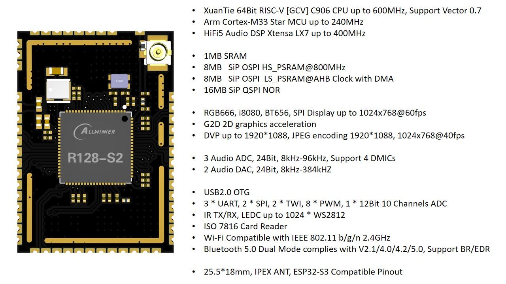

# R128 模块

针对 R128 芯片，我们推出了一种型号模块，如下表所示

| 型号                 | SoC     | CPU0           | CPU1        | DSP       | SRAM   | LS-PSRAM | HS-PSRAM | Flash         | DAC                                         |
| -------------------- | ------- | -------------- | ----------- | --------- | ------ | -------- | -------- | ------------- | ------------------------------------------- |
| R128-S2-WROOM-N16R16 | R128-S2 | Arm Cortex-M33 | C906 RISC-V | HIFI5 DSP | 1MByte | 8Mbyte   | 8Mbyte   | 16M NOR Flash | 2 Audio DAC LINEOUTLP/N LINEOUTRP/N |

## R128-S2-WROOM-N16R16

### 实物图

### 引脚图

- [高清引脚图.svg](https://www.aw-ol.com/downloads?cat=22)
