# 常见问题

## 打包出现：ERROR: update_mbr failed

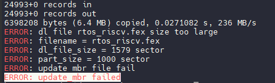

```c
24993+0 records in
24993+0 records out
6398208 bytes (6.4 MB) copied, 0.0271082 s, 236 MB/s
ERROR: dl file rtos_riscv.fex size too large
ERROR: filename = rtos_riscv.fex
ERROR: dl_file_size = 1579 sector
ERROR: part_size = 1000 sector
ERROR: update mbr file fail
ERROR: update_mbr failed
```

这是因为 `rtos_riscv.fex` 太大了，分区容量设置过小。

### 解决方法

- 确定打包使用的分区表

运行打包命令，找到打包使用发分区表。例如这里使用的是 `sys_partition_xip.fex` 

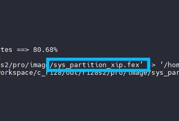

- 编辑分区表

使用 `cconfigs` 命令进入目录，找到打包使用的分区表，编辑修改

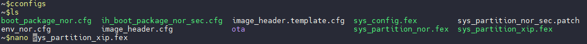

- 找到上面报错的行，修改 `size` 选项，单位是扇区。对于 NOR 方案请对齐。这里我们修改到 `7000`

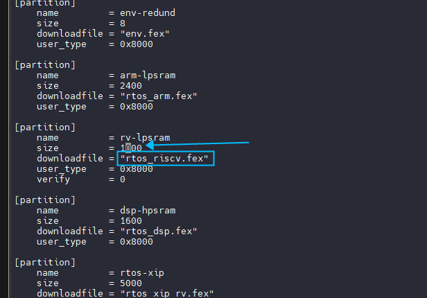

- 重新打包，正常通过

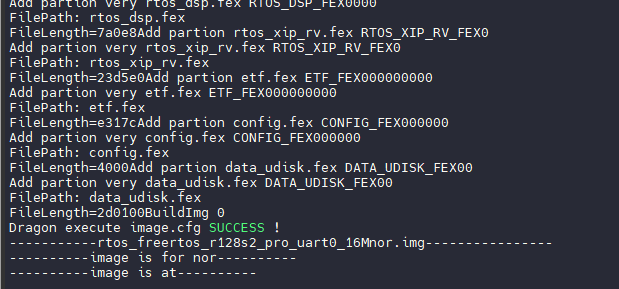

## 修改分区表后系统无法启动

有些时候，修改 `sys_partition_xxx.fex` 后系统无法启动，例如将 ` config` 的大小从 `32` 改到 `64` 后，系统无法启动卡死。

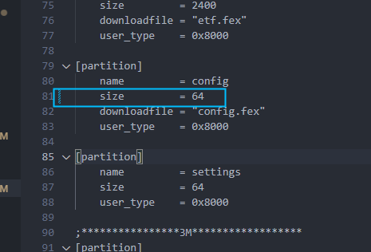

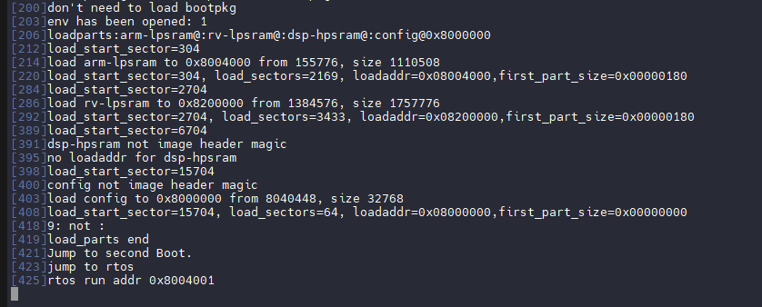

这是由于扩大分区后踩到内存了，一般配置 LPSRAM 前面 2M 给 M33 核使用，M33 的代码运行在前面 2M 上，另外这 2M 中的前 16K 是`sysconfig` 配置。

可以看到 M33 系统的启动地址为 `0x8004000` 但是 `config` 现在有 32K 载入到了 `0x8000000-0x8008000` 的内存中，覆盖了 `M33` 的部分内存，这样一般叫做 "踩内存"。

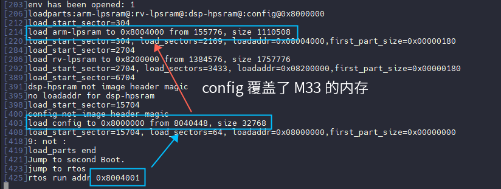

解决方法：

- 精简该分区，删除不需要的配置项

保持 `config` 大小为 `32`，删除不需要的配置项目减少 `config` 的大小。

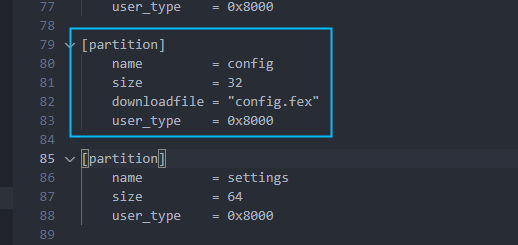

- 修改 M33 核心的运行地址，这里将 M33 核心往后移动了一部分，将启动地址配置到 `0x8008000`，同时注意修改内存长度防止踩到 C906 核心的内存，将 `0x1FC000` 改为 `0x1F8000`。

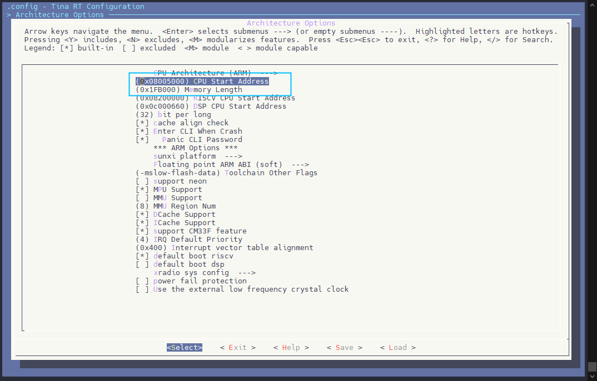

这样就不会踩到内存导致启动失败。正常启动。

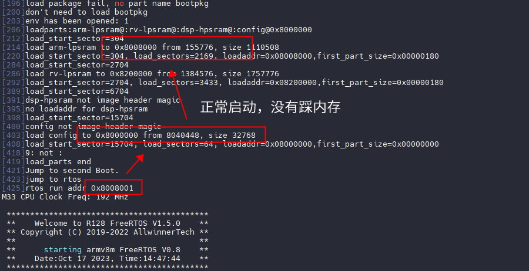
