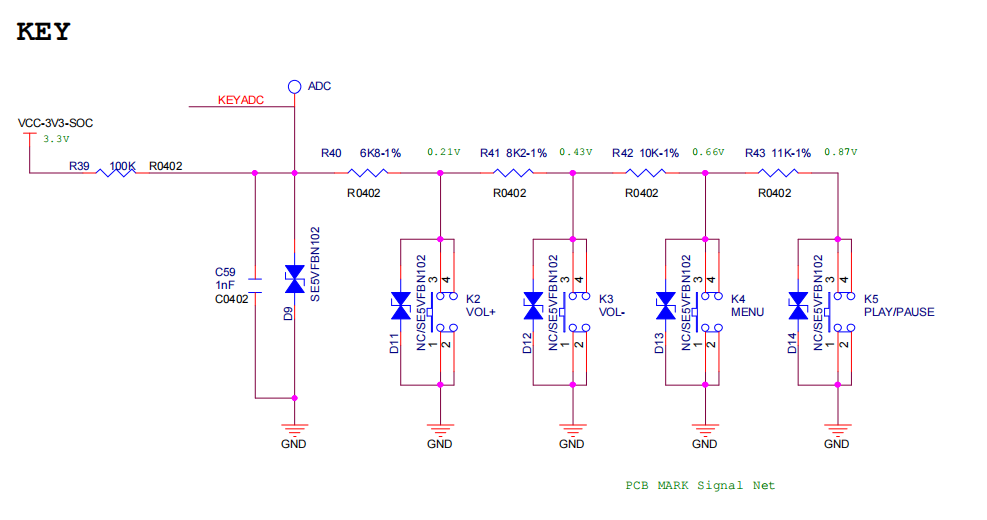

# ADC 按键配置方法

FreeRTOS平台上使用的按键为ADC-KEY，采用的ADC模块为GPADC。

按键功能驱动的实现是通过ADC分压，使每个按键检测的电压值不同，从而实现区分不同的按键。按下或者弹起中断之后，通过中断触发，主动检测当前电压识别出对应的按键。最后再通过input子系统将获取按键的键值并上报给应用层。

### GPADC-Key配置方法

按键结构体定义key_config的成员：

```
struct sunxikbd_config{
    unsigned int measure;    // 电压阈值
    char *name;				 // 功能名
    unsigned int key_num;    // 按键数量
    unsigned int scankeycodes[KEY_MAX_CNT];    // 按键的键值
    unsigned int key_vol[KEY_MAX_CNT];         // 按键的电压值
};

不同平台的配置可能不同，以r128为例，下面是r128的成员config：

static struct sunxikbd_config key_config = {
    .measure = 2500,
    .name = "gpadc-key",
    .key_num = 5,
    .key_vol = {164,415,646,900,1157},
    .scankeycodes = {115,114,139,164,116}
};
```

当前按键驱动的配置都是以hardcode的方式写入驱动代码中，也就是说按键的数量，不同按键对应的电压值，不同按键对应的KeyCode等等配置如果要修改的话，需要对源码进行修改。

如上述按键结构体的定义，以下两配置按照默认配置即可。

- measure：GPADC最大能够识别的电压值，需要根据UserMaual来设置。默认为2.5V。

- name：注册的按键驱动名称，会注册到input子系统中。

可以自定义的配置为：key_num，key_vol，scankeycodes。

- key_num: 按照实际硬件设计来设置。

- key_vol: 按照硬件，实际每个按键分压的情况来设置。

- scankeycodes：每个按键对应的KeyCode，方便应用通过input获得按下的按键时，能够识别是哪个按键按下了。

key_vol的配置方法，可以参考下图的GPADC-KEY的硬件设置。



在图中，VCC输入的电压为3.3V，通过分压关系，第一个按键的电压为0.21V，因此key_vol可以设置为210，以此类推。

## 驱动初始化方法

默认系统启动时，不会加载GPADC驱动以及按键驱动。

如果需要加载GPADC-Key驱动，需要调用以下函数：

```c
int sunxi_gpadc_key_init(void);
```

调用sunxi_gpadc_key_init()该函数即可完成GPADC驱动以及按键驱动的加载了，即可开始使用按键驱动。

## 应用调用方法

接下来继续介绍一下，应用中该如何获取按键按下的事件。

在FreeRTOS系统中，也移植了 Linux 的 input 子系统。GPADC-Key 中也是调用了 input 的接口，进行注册 input 设置，上报事件等动作。

在调用 `sunxi_gpadc_key_init()` 时，通过 `input_set_capability()` 去设置了事件的属性；通过`sunxi_input_register_device()` 注册了 `input` 设备；在按键按下触发中断时，也是通过 `input_report_key()` 和 `input_sync()` 上报 `input` 事件。

因此，在应用层想要获取input事件，可以直接通过input接口去获取，使用示例可如下例程：

```c
int input_func(void)
{
	int fd = -1;
	struct sunxi_input_event event;

	sunxi_gpadc_key_init(); // 驱动初始化

	fd = sunxi_input_open(DEVICE_NAME);
	if (fd < 0)
		return -1;

	while (1) {
		sunxi_input_readb(fd, &event, sizeof(struct sunxi_input_event));
		if (event.type != EV_KEY)
			continue;

		if (event.value == 0) {
			printf("key up\n");
			continue;
		}
		printf("key press: KeyCode:%d\n", event.code);
	}

	return 0;
}
```

