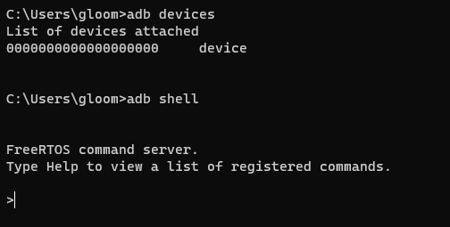

# USB 外设功能配置

## USB 功能简介

USB 功能模块包括了USB Host，USB Device 和OTG 功能。

USB Host 目前已经支持上的功能有：Mass Storage，UVC。

USB Device 目前已经支持上的功能有：ADB，UAC。

OTG 主要用作Host 与Device 的切换，如当板子通过 USB 线连接到 USB 主机 (PC) 上时，
此时 OTG 是加载成 USB Device；若当前板子是通过 OTG 线连接一个USB 设备，此时 OTG 则加载
成 USB Host。

## USB 外设特性

- Complies with USB 2.0 Specification
- Supports High-Speed (HS, 480-Mbps), Full-Speed (FS, 12-Mbps), and Low-Speed (LS, 1.5-Mbps) in Host mode
- Supports High-Speed (HS, 480 Mbps), Full-Speed (FS, 12 Mbps) in Device mode
- Supports the UTMI+ Level 3 interface. The 8-bit bidirectional data buses are used
- Supports bi-directional endpoint0 for Control transfer
- Supports up to 8 User-Configurable Endpoints for Bulk, Isochronous and Interrupt bi-directional transfers (Endpoint1, Endpoint2, Endpoint3, Endpoint4)
- Supports up to (4KB+64Bytes) FIFO for EPs (Including EP0)
- Supports High-Bandwidth Isochronous & Interrupt transfers
- Automated splitting/combining of packets for Bulk transfers
- Supports point-to-point and point-to-multipoint transfer in both Host and Peripheral mode
- Includes automatic ping capabilities
- Soft connect/disconnect function
- Performs all transaction scheduling in hardware
- Power Optimization and Power Management capabilities
- Includes interface to an external Normal DMA controller for every Eps

## USB 配置介绍

### `sys_config.fex` 配置说明

sys_config.fex 中主要是对 OTG 功能进行配置，各个配置的含义可如下所示：

| Key  | Value |
| ---- | ----- |
|[usbc0]|控制器0的配置。|
|usb_used:|USB使能标志。置1，表示系统中USB模块可用,置0,则表示系统USB禁用。|
|usb_port_type| USB端口的使用情况。 0: device only;1: host only;2: OTG;usb_detect_type: USB|端口的检查方式。0: 不做检测;1: vbus/id检查;2: id/dpdm检查|
|usb_detect_mode| USB端口的检查方式。0: 线程轮询;1: id中断触发|
|usb_id_gpio| USB ID pin脚配置。具体请参考gpio配置说明。|
|usb_det_vbus_gpio| USB DET_VBUS pin脚配置。具体请参考gpio配置说明。|
|usb_drv_vbus_gpio| USB DRY_VBUS pin脚配置。具体请参考gpio配置说明。|
|usb_drv_vbus_type| vbus设置方式。0: 无; 1: gpio; 2: axp。|
|usb_det_vbus_gpio| "axp_ctrl",表示axp 提供。|
|usbh_driver_level| usb驱动能力等级|
|usbh_irq_flag| usb中断标志|

示例：


```
;--------------------------------
;---       USB0控制标志
;--------------------------------
[usbc0]
usb_used                = 1
usb_port_type           = 2
usb_detect_type         = 1
usb_detect_mode         = 0
usb_id_gpio             = port:PB04<0><0><default><default>
usb_det_vbus_gpio       = port:PA24<0><0><default><default>
usb_drv_vbus_gpio       = port:PA29<1><0><default><default>
usb_drv_vbus_type       = 1
usbh_driver_level       = 5
usbh_irq_flag           = 0
```

### rtos menuconfig 配置说明

- 使能USB 驱动

```
‑> Drivers Options
    ‑> soc related device drivers
        ‑> USB Drivers
            [*] USB
```

- 使能OTG

```
‑> Drivers Options
    ‑> soc related device drivers
        ‑> USB Drivers
            [*] USB_MANAGER
```

- 使能USB Host

使能完USB Host 之后，还需要选择：OHCI 与EHCI（一共有0 和1 两组，对于R128 来说，只需要使能USB0）。另外，还要选择功能驱动（Mass Storage，UVC），不然只是使能USB Host 则无法正常运行USB Host 的功能。

USB Host 控制器驱动配置如下：

```
USB Host
‑> Drivers Options
    ‑> soc related device drivers
        ‑> USB Drivers
            [*] USB_HOST

OHCI
‑> Drivers Options
    ‑> soc related device drivers
        ‑> USB Drivers
            ‑> USB HOST
                [*] USB_OHCI_0

EHCI
‑> Drivers Options
    ‑> soc related device drivers
        ‑> USB Drivers
            ‑> USB HOST
                [*] USB_EHCI_0
```

- 使能USB Device

USB Device 除了UDC 的使能之外，也需要选择对应的功能驱动Gadget 以及功能驱动对应的上层应用。

USB Device 控制器驱动配置如下：

```
USB Device
‑> Drivers Options
    ‑> soc related device drivers
        ‑> USB Drivers
            [*] USB_DEVICE

USB Device使能dma通信
‑> Drivers Options
    ‑> soc related device drivers
        ‑> USB Drivers
            ‑> USB DEVICE
                [*] UDC_USE_DMA
```

## USB 源码结构

```
lichee/rtos‑hal/hal/source/usb
├── common/
├── core/
├── gadget/
│ ├── function/
├── hid/
│ ├── Class/
│ ├── Client/
│ │ ├── KeyBoard/
│ │ └── Mouse/
│ ├── Include/
├── host/
├── include/
├── manager/
├── platform/
├── storage/
│ ├── Class/
│ ├── Disk/
│ ├── include/
│ └── Misc/
├── udc/
└── uvc/
├── Class/
├── drv_webcam/
│ ├── dev_cfg/
│ └── webcam_core/
├── Include/
├── Misc/
└── Webcam/
```

- common: USB 驱动初始化公用文件。
- core: USB Host 驱动框架层文件。
- gadget: USB Deivce 功能驱动gadget 驱动总入口文件，function 则是各个功能驱动的驱动文件。
- hid: USB Host HID 协议及驱动文件。
- host: USB Host 硬件控制器驱动。
- include: USB 公用头文件。
- manager: USB OTG 驱动。
- platform: 不同平台的配置文件。
- storage: USB Host Mass Storage 协议及驱动文件。
- udc: USB Deivce 硬件控制器驱动。
- uvc: USB Host UVC 协议及驱动文件。

详细说明请见：[HAL USB](/sdk_module/usb)

## USB 常用功能说明

### 配置OTG 功能

OTG 功能下，需要根据USB ID 脚去进行Device/Host 模式的切换；如果需要支持NULL 模式（既不加载Device 也不加载Host 驱动）, 那么还需要VBUS 状态检测引脚。

涉及到的主要改动点：

```
在sys_config.fex，修改如下配置：
usb_port_type配置为2,即OTG模式。
usb_id_gpio配置对应的USB ID引脚。
usb_det_vbus_gpio, 需要根据实际情况进行配置:

1.如果需要检测VBUS状态，则按下面情况进行配置：
配置成对应的gpio即可。

2.如果不需要检测VBUS状态(缺少NULL模式)
那么直接填写USB ID的gpio配置(也就是VBUS与ID状态一致)。
```

USB OTG 驱动，会根据ID 和VBUS 的状态，自动切换成对应的模式。ID 和VBUS 的对应关系如下表：

| ID   | VBUS | 模式   |
| ---- | ---- | ------ |
| 0    | 0    | Host   |
| 1    | 0    | Null   |
| 0    | 1    | Host   |
| 1    | 1    | Device |

- ID 脚一般情况下为高电平，只有接入OTG 线时会拉低;
- VBUS 为1 表示micro USB 口有接入外部电源;
- 一般不会出现ID 为0，VBUS 为1 的情况。这表示接入OTG 线，但是还检测到VBUS;
- 如果没有VBUS 检测，ID 只有0 和1 的两种情况, 也就是说要么加载device 驱动，要么加载host 驱动; 这会带来一些影响：usb 相关时钟一直被打开，导致有一定功耗，以及硬件射频。

### USB Gadget 功能配置

USB Gadget 支持众多功能，它们的配置方法比较类似，只需要在mrtos_menuconfig 中选上对应的Gadget 功能驱动即可在系统初始化时自动加载。与Linux 不一样的是，RTOS 的gadget 功能配置全部hardcode 在功能驱动里，无需像Linux 一样需要在应用层手动进行gadget 配置。

另外，目前RTOS 的USB 驱动还不支持composite gadget，因此只能支持加载单一的gadget 功能驱动，无法同时多个功能。

#### ADB 功能

adb 的全称为Android Debug Bridge，就是起到调试桥的作用。通过ADB，可以直接在PC 上通过命令行控制小机端的控制台；也可以通过ADB 进行文件传输。

menuconfig 驱动相关配置：

```
‑> Drivers Options
    ‑> soc related device drivers
        ‑> USB Drivers
            ‑> USB DEVICE
                [*] DRIVERS_USB_GADGET_ADB
```

menuconfig ADBD 应用相关配置：

```
‑> System components
    ‑> aw components
        ‑> USB Components Support
            ‑> USB Gadget Support
                [*] adbd service
```

在RTOS 的USB 框架中，一旦加载了adb gadget，就会自动启用adbd 服务，直接连上PC 就可以使用了。

adb 正常启动的相关log：

```
[usb0] insmod device driver!
adbd version:AW‑V1.1.6, compiled on: Apr 11 2023 10:33:24
adbd service init successful
```

PC 运行效果图如下图所示：



#### UAC 功能

UAC 全称为USB Audio Class，USB 音频类。

通过UAC，可以实现实时获取音频设备的音频数据，并且通过UAC 实现操控设备音量，采样率，等参数。UAC 实现对外接音频操作，从用户功能来说，主要包括USB 麦克风、USB 声卡和其它音频设备的功能控制和接口标准。

menuconfig 驱动相关配置：

```
‑> Drivers Options
    ‑> soc related device drivers
        ‑> USB Drivers
            ‑> USB DEVICE
                [*] DRIVERS_USB_GADGET_UAC
```

menuconfig UACD 应用相关配置：

````
‑> System components
    ‑> aw components
        ‑> USB Components Support
            ‑> USB Gadget Support
                [*] uacd service

‑> System components
    ‑> aw components
        ‑> USB Components Support
            ‑> USB Gadget Support
                ‑> uacd audio function
                    [*] AudioSystem local audio
````

uacd 正常启动的相关log：

```
[usb0] insmod device driver!
uacd version:AW‑V0.5, compiled on: Apr 27 2023 10:44:02
[UACD‑INFO][u_audio_init] line:167 stream=1, rate=48000, ch=2, bits=16, audio_buf_size=192
[UACD‑INFO][u_audio_init] line:167 stream=0, rate=16000, ch=2, bits=16, audio_buf_size=64
[UACD‑INFO][u_audio_stop_capture] line:320
[UACD‑INFO][u_audio_stop_playback] line:457
[UACD‑INFO][u_audio_stop_capture] line:320
[UACD‑INFO][u_audio_stop_playback] line:457
```

启动成功之后，能够在PC 端看到新增了一个音频输入和输出的设备，如下图：


### USB Host 功能配置

接入OTG 线后，成功切换成 USB Host 的log 可参考如下：

```
[ehci‑usb0] insmod host driver!
calibration finish, val:0x19, usbc_no:0
ehci insmod status = 1
[usbh core]: add gen_dev SW USB2.0 'Enhanced' Host Controller (EHCI) Driver
[D(rv.)] devops: register dev(sunxi_timer) ok
USB 0.0 started, EHCI 1.00
[usbh core]: adding sub dev (config #1, interface 0)
usb match id suceessfull
[hub]: usb hub probe
[hub]: 1 port detected
[usbh hub]: local power source is good
[E(rv.)] pm device sunxi_ehci0(00000000082AE1D0) has already registered
[ohci‑usb0] insmod host driver!
calibration finish, val:0x19, usbc_no:0
[usbh core]: add gen_dev SW USB2.0 'Open' Host Controller (OHCI) Driver
[usbh core]: adding sub dev (config #1, interface 0)
usb match id suceessfull
[hub]: usb hub probe
[hub]: 1 port detected
[usbh hub]: local power source is good
[D(rv.)] devops: register dev(sunxi_ohci0) ok
```

#### U 盘功能

选上以下配置：

```
Mass Storage
‑> Drivers Options
    ‑> soc related device drivers
        ‑> USB Drivers
            ‑> USB HOST
                [*] Mass Storage support
                [*] USB CD support	
```

等待U 盘挂载成功，可以发现根目录下多了一个usb_msc 的文件夹，这个即是U 盘挂载的文件夹。可以通过该文件夹与U 盘进行读取/传输文件。

- 目前R128 只支持fat32 文件系统的U 盘，其他文件系统U 盘会挂载失败。
- 只支持挂载单分区的U 盘，如果U 盘被分解成了多个分区的话，只能挂载上第一个分区。

接入U 盘后，系统开始识别U 盘。成功识别到U 盘的log 信息如下：

```
ehci_irq: highspeed device connect
port debounce 0...
port debounce 0...
port debounce 25...
port debounce 50...
port debounce 75...
hub_port_init: udev address = 0
[hub_port_init]: new high speed USB device address 0
usb hub set new address(2)
[usbh core]: adding sub dev (config #1, interface 0)
usb match id suceessfull
mscDevProbe begin
[msc]: GetMaxLUN successful, max lun is 0
begin mscLunAdd
disk, send last lun msg.........
mscLun‑>LunNo=0
mscLun‑>mscDev‑>MaxLun=1
BlkDev‑>last_lun=1
Wrn: short transfer, urb_state(0), want_len(192), real_len(70)
Wrn: short transfer, urb_state(0), want_len(192), real_len(24)
‑‑‑‑‑‑‑‑‑‑‑‑‑‑‑‑‑Disk Information‑‑‑‑‑‑‑‑‑‑‑‑‑‑‑‑‑
WriteProtect = 0
MediaPresent = 1
WCE = 0
RCD = 0
capacity = 29532M, sector number = 60481536
sector_size = 512
DevNo = 0
ClassName =
DevName = SCSI_DISK_000
‑‑‑‑‑‑‑‑‑‑‑‑‑‑‑‑‑‑‑‑‑‑‑‑‑‑‑‑‑‑‑‑‑‑‑‑‑‑‑‑‑‑‑‑‑‑‑‑‑‑
hub_port = 1
cnt = 0
Classname = DISK
DevName = SCSI_DISK_000
DeviceName = SCSI_DISK_000
Vender = TOSHIBA USB FLASH DRIVE PMAP
Product = USB FLASH DRIVE PMAP
Serial = PMAP
HubPortNo = 1
DeviceType = 2
DiskRead: block(0, 1) is adjacence max capacity(39ae000), can't use special write
mount usb mass storage successull!!
..............................................................................
[USB Disk]: Register new device, class = [DISK], dev = [SCSI_DISK_000]
..............................................................................
end mscLunAdd
mscDevScanThread end...
```

然后通过ls 查看usb_msc，可以看到U 盘里的文件：

```
c906>ls
dev data usb_msc

c906>ls usb_msc
System Volume Information 3.txt
```

### USB 摄像头

选上以下配置：

```
UVC
‑> Drivers Options
    ‑> soc related device drivers
        ‑> USB Drivers
            ‑> USB HOST
                [*] USB_CAMERA
```

接上USB 摄像头后，成功识别出摄像头后会出现以下log:

```
ehci_irq: highspeed device connect
port debounce 0...
port debounce 0...
port debounce 25...
port debounce 50...
port debounce 75...
hub_port_init: udev address = 0
[hub_port_init]: new high speed USB device address 0
usb hub set new address(3)
[hub] :skipped 1 descriptor after configuration
skipped 6 descriptors after interface
skipped 1 descriptor after endpoint
skipped 26 descriptors after interface
num_ep:0
skipped 1 descriptor after endpoint
skipped 4 descriptors after interface
num_ep:0
num_ep:0
skipped 2 descriptors after interface
skipped 1 descriptor after endpoint
[usbh core]: adding sub dev (config #1, interface 0)
usb match id suceessfull
UVCDevProbe begin
Probing generic UVC device
device quirks 0x0
Found format MJPEG.
‑ 1920x1080 (30.0 fps)
‑ 1280x720 (30.0 fps)
‑ 640x480 (30.0 fps)
‑ 640x360 (30.0 fps)
‑ 352x288 (30.0 fps)
‑ 320x240 (30.0 fps)
‑ 320x180 (30.0 fps)
‑ 176x144 (30.0 fps)
‑ 160x120 (30.0 fps)
‑ 1920x1080(30.0 fps)
Found format YUV 4:2:2 (YUYV).
‑ 1920x1080 (5.0 fps)
‑ 1280x720 (10.0 fps)
‑ 640x480 (30.0 fps)
‑ 640x360 (30.0 fps)
‑ 352x288 (30.0 fps)
‑ 320x240 (30.0 fps)
‑ 320x180 (30.0 fps)
‑ 176x144 (30.0 fps)
‑ 160x120 (30.0 fps)
‑ 1920x1080 (5.0 fps)
Found UVC 1.00 device USB 2.0 Camera (0c45:6366)
num_altsetting=7
UVC device initialized.
DRV_WEBCAM_MInit
webcam plug in message...
[usbh core]: adding sub dev (config #1, interface 1)
[usbh core]: adding sub dev (config #1, interface 2)
[usbh core]: adding sub dev (config #1, interface 3)
```

通过log 信息能够看到，在识别出USB 摄像头后，会打印出该摄像头支持的格式以及分辨率。

接着通过uvc 测试命令，对UVC 功能进行测试：

```
usb uvc_test
```

测试命令调用完成之后，会在/data 目录下生成5 张名为/data/source_frame_x.jpg 的图片。通过adb pull 将图片拉到PC 端，然后在PC 端打开图片即可看到USB 摄像头拍下的照片。

## USB 调试方法

### USB OTG 功能调试

除了OTG 的自动切换功能，还可以进行手动的切换，需要使用到USB 命令。

USB Device/Host 的手动切换方法：

输入usb ‑h 能够看见usb 的全部命令。

- USB Device 的相关命令

```
usb udc {‑i|‑r} [<port>]
‑i：指的是指定需要进行切换的USB口。目前R128芯片只有USB0是支持Device模式的。
‑r：指的是remove，注销当前的Device模式。

比如说将USB0切换成Device模式，则运行：
usb udc ‑i 0
```

- USB Host 的相关命令

```
usb hci {‑i|‑r} [<port>]
‑i：指的是指定需要进行切换的USB口。
‑r：指的是remove，注销当前的Host模式。

比如说将USB0切换成Host模式，则运行：
usb hci ‑i 0
```

## USB 相关工具
### ADB

ADB 功能是从Android 移植过来的，设备端会运行adbd 服务，而Host 端(一般为PC) 通过adb工具进行调试，如adb shell, adb push/pull 等。

### ADB 功能说明

#### adb shell 功能

PC端执行adb shell,可进入控制台。

PC端执行adb shell + command, 例如adb shell ls /可以直接将结果输出到终端。


#### adb push/pull 功能

```
推送文件到小机端：
adb push test.bin /data

从小机端拉取文件：
adb pull /data/test.bin .
```


#### adb 网络连接

如果需要用此功能，需要额外进行menuconfig 的配置，配置方法如下：

```
‑> System components
    ‑> aw components
        ‑> USB Components Support
            ‑> USB Gadget Support
                [*] adb local transport
                (5555) adb local transport port
```

adb local transport port 是用于配置端口号的，用于在adb 网络连接时匹配端口的，默认为5555。

> 在进行网络adb 连接之前，需要保证PC 和小机端在同一个局域网中，并且可以ping 通。

小机端运行ifconfig，查看当前小机端的IP，假设IP为192.168.1.101。

则PC端执行adb connect 192.168.1.101建立连接，然后就可以开始执行adb shell等命令了。


