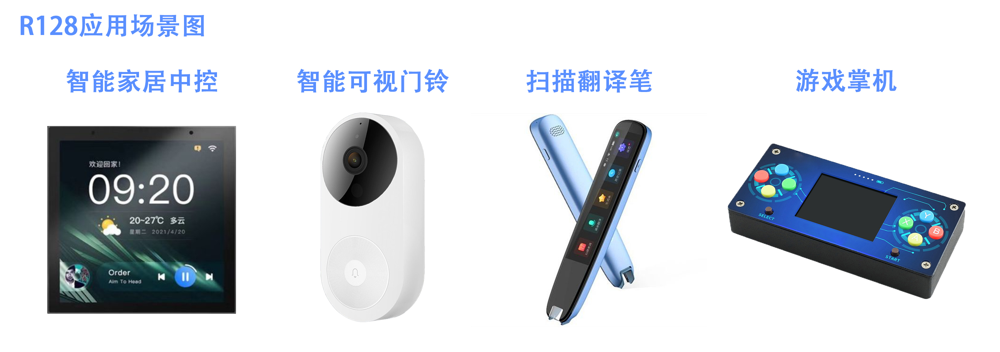
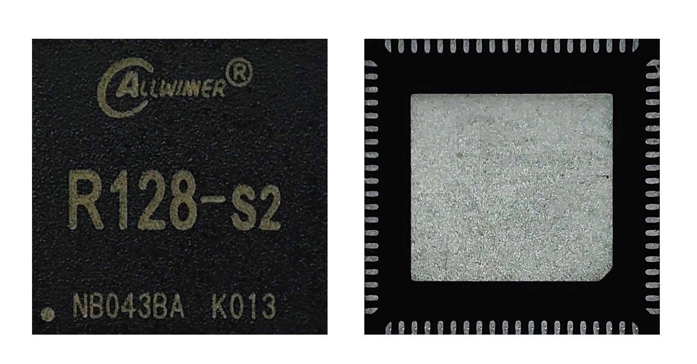
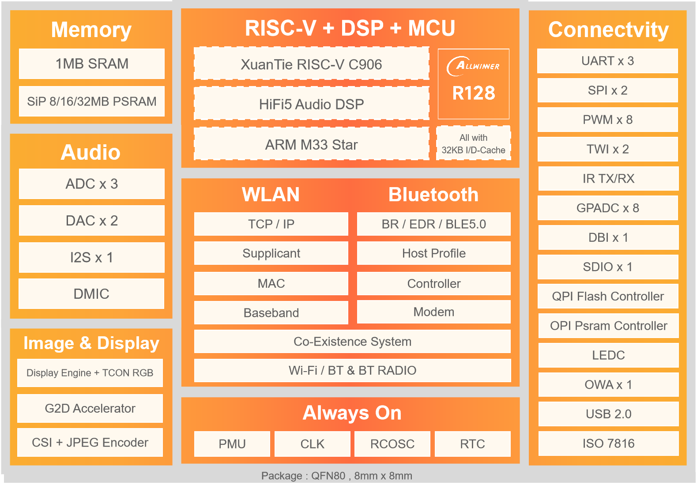

# 芯片简介

R128是一颗专为“音视频解码”而打造的全新高集成度 SoC，主要应用于智能物联和专用语音交互处理解决方案。

- 单片集成 MCU+RISCV+DSP+CODEC+WIFI/BT+PMU，提供生态配套成熟、完善的用于系统、应用和网络连接开发的高效算力；
- 集成 8MB/16MB/32MB PSRAM，为音视频解码、大容量存储、扫码以及网络连接提供充裕的高容量、高带宽的内存支持；
- 拥有丰富的音频接口 IIS/PCM、OWA、DMIC、LINEOUT、MICIN 以及通用通讯接口 IIC、UART、SDIO、 SPI、ISO7816卡接口；同时支持 U 盘、SD卡、IR-TX/RX；
- 内置 LDO、GPADC、LEDC，简化系统方案设计，降低 BOM成本。

## 芯片应用场景



## 芯片实物图



## 芯片框图



## 芯片特性简介

```
- XuanTie 64 bit RISC V C 906 CPU , up to 480 MHz
- HiFi5 Audio DSP up to 400 MHz
- Arm M33 Star MCU , up to 192 MHz

- Memories

  - 1MB SRAM

  - SiP 8 MB/16 MB Flash

  - 8 MB H S PSRAM in R128 S 1
  - 8 MB LS PSRAM & 8 MB HS PSRAM in R128 S2
  - 32 MB HS PSRAM in R128 S3
  - 2048 bit efuse

- Image and Graphics

  - Supports Graphic 2D accelerator with rotate, mixer, and 4 layers
  - Supports RGB output interface, up to 1024 x 768 @60 fps
  - Supports display engine

- Video Input

  - 8 bit parallel CSI interface
  - Supports both online and offline mode for JPEG encoder
  - Supports JPEG encoder, 1920 x 108 8

- Analog Audio Codec

  - 2 DAC channels 24 bit audio codec for R128 S1 and R128 S2
  - 1 DAC channel 24 bit for R128 S3
  - 3 ADC channels
  - Supports USB audio playback
  - Up to 119 dB SNR during DAC playback path (signal through DAC and lineout with A weighted filter)
  - Up to 98 dB SNR during ADC record path (signal through PGA and ADC with A weighted filter)

- One I2S/TDM/PCM external inte rface (I2S0

- Security Engine

  - Symmetrical algorithm: AES, DES, 3DES
  - Hash algorithm: MD5, SHA1, SHA224, SHA256, SHA384, SHA512, HMAC
  - Asymmetrical algorithm: RSA512/1024/2048bit
  - S upports TRNG

- External Peripherals

  - One USB 2.0 DRD
  - Up to 3 UART controllers (UART 0, UART1, UART2)
  - Up to 2 SPI controllers (SPI0, SPI1)
  - Up to 2 TWIs
  - One CIR RX and one CIR TX
  - Up to 8 PWM channels (PWM[ 7 0
  - Up to 7 GPADC input channels (R128 S1 & R128 S2)/8 channels (R128 S3)
  - One LEDC used to control the external intelligent control LED lamp

- Package

  - QFN80, 0.35 mm pitch, 8 mm x 8 mm body

```

## 不同版本芯片的区别

R128 共有R128-S1、R128-S2 和R128-S3 三个型号，各型号具体配置差异如下表：

| Contents       | R128-S1                                        | R128-S2                                        | R128-S3                      |
| -------------- | ---------------------------------------------- | ---------------------------------------------- | ---------------------------- |
| CPU            | M33 + C906                                     | M33 + C906                                     | M33 + C906                   |
| DSP            | HiFi5                                          | HiFi5                                          | HiFi5                        |
| PSRAM          | 8MB HS-PSRAM                                   | 8MB HS-PSRAM + 8MB LS-PSRAM                    | 32MB HS-PSRAM                |
| FLASH          | 8MB                                            | 16MB                                           | /                            |
| DAC            | 2 Audio DAC<br />LINEOUTLP/N <br />LINEOUTRP/N | 2 Audio DAC<br />LINEOUTLP/N <br />LINEOUTRP/N | 1 Audio DAC<br />LINEOUTLP/N |
| GPADC Channels | 7                                              | 7                                              | 8                            |
| Package        | `QFN80 8*8mm 0.35pitch`                        | `QFN80 8*8mm 0.35pitch`                        | `QFN80 8*8mm 0.35pitch`      |

请注意，R128-S1、R128-S2引脚封装是相同的，而 R128-S3 与R128-S1、R128-S2是不同的。具体请参照[芯片参数](/r128/chip_info/)章节

