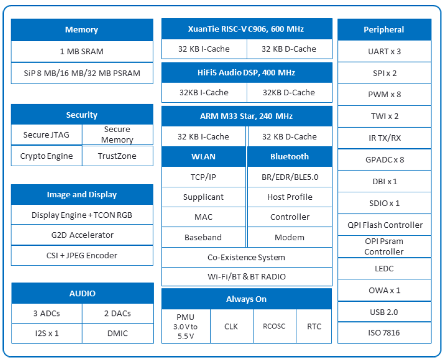

# 芯片简介

R128是一颗专为“音视频解码”而打造的全新高集成度 SoC，主要应用于智能物联和专用语音交互处理解决方案。

- 单片集成 MCU+RISCV+DSP+CODEC+WIFI/BT+PMU，提供生态配套成熟、完善的用于系统、应用和网络连接开发的高效算力；
- 集成 8MB/16MB/32MB PSRAM，为音视频解码、大容量存储、扫码以及网络连接提供充裕的高容量、高带宽的内存支持；
- 拥有丰富的音频接口 IIS/PCM、OWA、DMIC、LINEOUT、MICIN 以及通用通讯接口 IIC、UART、SDIO、 SPI、ISO7816卡接口；同时支持 U 盘、SD卡、IR-TX/RX；
- 内置 LDO、GPADC、LEDC，简化系统方案设计，降低 BOM成本。

## 芯片应用场景

## 芯片实物图

## 芯片框图

## 芯片特性

- **CPU Architecture**
  - XuanTie C906 64-bit RISC-V CPU up to 600 MHz 
    - 32 KB I-cache + 32 KB D-cache

  - ARM Cortex M33 Star@240 MHz MCU 
    - 32 KB I-cache + 32 KB D-cache
    - TrustZone 

-  **DSP Architecture**
  - HiFi5 Audio DSP@400 MHz 
    - 32 KB I-cache + 32 KB D-cache 

- **Memory Subsystem**
  -  **PSRAMC** 
    - Up to 2 PSRAM controllers (HS_PSRAMC, LS_PSRAMC) 
    - HS_PSRAMC:
      - 8 MB OPI PSRAM for R128-S1/R128-S2.
      - 32 MB OPI PSRAM for R128-S3. 
      - Supports AP memory PSRAM 
      - Supports 64 Mbit/256 Mbit PSRAM 
      - Supports OPI as the interface of PSRAM 
      - Supports the auto-refreshing and self-refreshing of PSRAM 
      - Supports up to 800 MHz PSRAM. The ratio of PSRAM controller and PSRAM clock is 1:4. 
      - Supports indirectly accessing the registers of PSRAM through interface configuration 
      - Supports caching reading/writing commands through CAM 
      - Supports out-of-order execution of commands 
      - Supports prefetching read passage 

    - LS_PSRAMC:
      - 8 MB OPI PSRAM for R128-S2 
      - Supports any frequency ratio of AHB and OPI clock 
      - Supports CPU/DMA to operate PSRAM through SBUS 
      - Supports PSRAM Wrap Mode (enter/exit) 
      - Supports APmemory APS3208 and APS6408 and Winbond W95*8 
      - Supports 4 offset address ranges 
      - Supports CBUS out-of-order reading/writing and XIP code execution 

  - **SMHC** 
    - Compatible with Secure Digital Memory (SD mem-version 2.0) 
    - Compatible with Secure Digital I/O (SDIO-version 3.0) 
    - Compatible with embedded MultiMediaCard (eMMC-version 5.0) 
    - Supports Card insertion and removal interrupt 
    - Supports hardware CRC generation and error detection 
    - Supports programmable baud rate 
    - Supports SDIO interrupts in 1-bit and 4-bit modes 
    - Supports block size of 1 to 65535 bytes 
    - Supports descriptor-based internal DMA controller 
    - Internal 1024-Bytes RX FIFO and 1024-Bytes TX FIFO 
    - Supports 1-bit, 4-bit SD and SDIO data bus width 
    - Supports 1-bit, 4-bit eMMC data bus width 

  - **Flash Controller & Flash Encryption**
    - Supports arbitrary frequency ratio of AHB clock and SPI clock 
    - Supports 4 segments of offset address range 
    - Supports receiving and transmitting in 1/2/4-wire SPI 
    - Supports up to `2^32Bytes` Nor-Flash (the common capacity is 64 MB, 128 MB and 256 MB) and 
    - large-capacity flash 
    - Supports flash programing and reading by configuring registers (SBUS) 
    - Supports out-of-order reading CBUS and running codes through XIP 
    - Supports continuous reading mode (enter/exit) and wrap mode (enter/exit) 
    - Supports the basic operation of SPI flash 
    - Supports 8 Mb SIP Nor Flash (for R128-S1) and 16 Mb SIP Nor Flash (for R128-S2) 
    - Supports real-time AES encoding and decoding when reading and writing data through SBUS data andreading data through CBUS

-  **System**
  - **PMU** 
    - Supports 2.2 V-5 V external single supply
    - Integrates DCDC/LDO and other power modules, and power all circuits within the IC
    - The internal digital circuit is divided into power domains. Each of them has independent power switch,which is determined by system low-power status.
    - Supports standby, hibernation and other low-power modes, which can be switched over by PMU.
    - Manages the opening and close of analog modules like DCDC/LDO, DCXO/DPLL. The starting duration is configured by the software.

  -  **GPRCM** 
    - Manages the power of this system
    - Manages the reset of each system
    - Manages the OSC clock

  - **CCU**
    - Up to 2 CCU controllers (CCU, CCU_AON)
    - CCU: 
      - Supports configuring module clock
      - Supports clock output control
      - Supports bus clock gating
      - Supports bus software reset

    - CCU_AON: 
      - Supports managing the OSC clock
      - Supports bus source and divisions
      - Supports configuring modules clock
      - Supports clock output control
      - Supports bus clock gating
      - Supports bus software reset

  - **BROM** 
    - On-chip memory 
    - Supports system boot from the following devices: 
      - SD/eMMC 
      - SPI Nor Flash 
      - SPI Nand Flash 

    - Supports secure boot and normal boot 
    - Secure brom supports load only certified firmware 
    - Secure brom ensures that the secure boot is a trusted environment 
    - Supports USB eFEX protocol and UART mboot protocol for firmware upgrade 

  - **DMAC**
    - Up to 2 DMACs 
    - Up to 16 DMA channels 
    - Provides 32 peripheral DMA requests for data reading and 32 peripheral DMA requests for data writing
    - Supports transferring data with a linked list 
    - Supports programmable 8-bit, 16-bit, 32-bit, and 64-bit data width 
    - Supports programmable DMA burst length 
    - DRQ response includes the waiting mode and handshake mode 
    - DMA channel support pause function 
    - Memory devices support non-aligned transfer 

  - **Timer** 
    - 8 timers: 5 for SW domain and 3 for AON domain 
    - Configurable counting clock: LOSC and OSC40M. Whether LOSC is internal low-frequency clock or external low-frequency clock (with greater accuracy) depends on LOSC_SRC_SEL. 
    - Supports 8 prescale factors 
    - Programmable 32-bit down timer 
    - Supports two timing modes: periodic mode and single counting mode 
    - Generates an interrupt when the count is decreased to 0 

  - **Watchdog** 
    - Up to 4 watchdogs, and one of them is secure world watchdog 
    - HOSC_32K clock sources and 32K system 
    - Supports 12 configurable initial count value 
    - Supports generating timeout interrupt 
    - Supports outputting reset signal 
    - Supports restarting timer 

  -  **RTC** 
    - Implements time counter and timing wakeup 
    - Provides counters for counting year, month, day, hour, minute, and second 
    - 4-channel clock sources: hosc_32K, rccal_32K, rcosc, losc_clk 
    - Configures initial value by software anytime 
    - Supports timing alarm, and generates interrupt and wakes up the PMU system 

  -  **Message Box**
    - Supports 3 CPU to transmit information through channels. Each CPU has a MSGBOX. 
      - CPU0: ARM CPU 
      - CPU1: RISC-V 
      - CPU2: DSP

    - There are four channels every two CPU, and the FIFO depth of one channel is 8 x 32 bits. 
    - Supports interrupts 

  - **Spinlock** 
    - Supports 32 lock units 
    - Two kinds of lock status: locked and unlocked 
    - Lock time of the processor is predictable (less than 200 cycles) 

- **Video and Graphics** 
  - **DE**
    - Supports output size up to 1024x1024 pixels 
    - Supports two alpha blending UI channels for main display 
    - Supports four overlay layers in each channel, and channel0 has an independent scaler 
    - Supports potter-duff compatible blending operation 
    - Supports input format ARGB8888/XRGB8888/RGB888/ARGB4444/ARGB1555/RGB565 
    - Supports SmartColor2.0 for excellent display experience 
      - Fully programmable color matrix 
      - Dynamic gamma 
    - Supports write back only for verification 
  -  **G2D** 
    - Supports layer size up to 1024x1024 pixels 
    - Supports pre-multiply alpha image data 
    - Supports color key 
    - Supports two pipes Porter-Duff alpha blending 
    - Supports multiple video formats 4:2: 0, 4:2:2, 4:1:1 and multiple pixel formats (8/16/24/32 bits graphics layer) 
    - Supports any format convert function above 
    - Supports 1/16× to 32× resize ratio
    - Supports 32-phase 8-tap horizontal anti-alias filter and 32-phase 4-tap vertical anti-alias filter. 
    - Supports window clip 
    - Supports FillRectangle, BitBlit, StretchBlit and MaskBlit 
    - Supports horizontal and vertical flip, clockwise 0/90/180/270 degree rotate for normal buffer 
  
-  **Video Input Interfaces**
  - **CSI & JPEG** 
    - CSI:
      - Supports YUV422 format input and YUV420 format NV12 output 
      - Supports scaling image down 1/2 and cropwin 
      - Supports receiving JPEG streams directly output by sensor 
      - Supports receiving the images with unconventional resolutions (X and Y can be an integer multiple of 16, such as: 192\*192, 304\*224) 
      - Supports receiving the images with conventional resolutions (such as 128\*128, 256\*256, 320\*240, 640\*480, 1280\*720, 1920\*1088) 
    - JPEG: 
      - Supports 640\*480@60fps in the online mode, and 640\*480@30fps in the offline mode 
      - Supports 1280\*720@40fps in the online mode, and 1280\*720@20fps in the offline mode 
      - Supports up to 1920\*1088 online/offline encoding 
      - Supports encoding after scaling images down 1/2 and cropwin 
      - Supports block output in the online mode to reduce SRAM usage and improve bandwidth utilization ratio 
      - Supports online/offline encoding (such as 192\*192 and 304\*224) the images with non-conventional resolution 
      - Supports the online/offline encoding the images with conventional resolution images 
  
-  **Video Output Interfaces** 
  
  -  **TCON_LCD** 
    - Supports RGB interface with DE/SYNC mode, up to 1024x768@60fps 
    - Supports serial RGB/dummy RGB interface, up to 800x480@60fps 
    - Supports i8080 interface, up to 800x480@60fps 
    - Supports BT656 interface for NTSC and PAL 
    - Supports RGB666 and RGB565 with dither function
  -  **SPI DBI**
    -  Supports DBI Type C 3 Line/4 Line Interface Mode 
    -  Supports 2 Data Lane Interface Mode 
    -  Supports data source from CPU or DMA 
    -  Supports RGB111/444/565/666/888 video format 
    -  Maximum resolution of RGB666 240 x 320@30Hz with single data lane 
    -  Maximum resolution of RGB888 240 x 320@60Hz or 320 x 480@30Hz with dual data lane 
    -  Supports tearing effect 
    -  Supports software flexible control video frame rate 
  
- **Audio Interfaces** 

  - **Audio Codec** 

    - HiFi Audio ADC 
      - 3-channel ADCs @ 24-bit 
      - Up to 95 dB SNR during ADC recording path (signal through PGA and ADC with A-weighted filter) 
      - 3 fully-differential analog microphone inputs with 0 dB~30 dB amplifier gain 
      - Supports sample rates ranging from 8 kHz to 96 kHz 
      - Digital volume control with 0.5 dB step 
      - Digital high-pass filter 
      - 128x24-bit FIFO for recording received data 
    - HiFi Audio DAC 
    
      - 2-channel DACs @ 24-bit (for R128-S1 and R128-S2) 
      - 1-channel DAC @ 24-bit (for R128-S3) 
      - Up to 105 dB SNR in the DAC playback path (signal through DAC and lineout with A-weighted filter) 
      - Supports sample rates ranging from 8 kHz to 384 kHz 
      - Digital volume control with 0.5 dB step 
      - 20-band Biquads filter for EQ 
      - 3-band dynamic range control 
      - 128x24-bit FIFO for playing transmitted data
      - Three differential microphone inputs: MICIN1P/N, MICIN2P/N, MICIN3P/N. 
      - Two stereo LINEOUT outputs: LINEOUTLP/N and LINEOUTRP/N (for R128 S1 and R128 S2) 
      - One single-end LINEOUT output: LINEOUTLP/N (for R128 S3) 
      - Built-in audio PLL with flexible clocking scheme 
      - DMA and interrupt support both receiving and transmitting 
      - Integrated ALDO for analog part 
      - One low-noise analog microphone bias output three audio inputs 
    - **I2S/PCM** 
    
      - Compliant with standard Philips Inter-IC sound (I2S) bus specification 
        - Left-justified, Right-justified, PCM mode, and TDM (Time Division Multiplexing) format 
        - Programmable PCM frame width: 1 BCLK width (short frame) and 2 BCLKs width (long frame) 
      - Transmit and Receive data FIFOs 
        - Programmable FIFO thresholds 
        - 128 depth x 32-bit width TXFIFO, 64 depth x 32-bit width RXFIFO 
      - Supports multiple function clock 
        - Clock up to 24.576MHz Data Output of I2S/PCM in Master mode (Only if the IO PAD and Peripheral I2S/PCM satisfy Timing Parameters) 
        - clock up to 12.288MHz Data Input of I2S/PCM in Master mode 
      - Supports TX/RX DMA Slave interface 
      - Supports Multiple application scenarios 
        - Up to 16 channel (fs = 48 kHz) which has adjustable width from 8-bit to 32-bit 
        - Sample rate from 8 kHz to 384 kHz (CHAN = 2) 
        - 8-bits u-law and 8-bits A-law companded sample 
      - Supports Master/Slave mode 
    - **DMIC** 
      - Supports up to 8 channels 
      - Sample rate from 8 kHz to 48 kHz 
    - **OWA**
      - In compliance with S/PDIF Interface 
      - Compatible with standard IEC-60958 and IEC-61937 
        - IEC-60958 supports 16-bit, 20-bit and 24-bit data formats 
        - IEC-61937 uses the IEC-60958 series for the conveying of non-linear PCM bit streams, each sub-frame transmits 16-bit 
      - TXFIFO and RXFIFO 
        - One 128×24bits TXFIFO and one 64×24bits RXFIFO for audio data transmission 
        - Programmable FIFO thresholds 
      - Supports TX/RX DMA slave interface
      - Supports multiple function clock 
        - Separate clock for OWA TX and OWA RX 
        - The clock of TX function includes a series of 24.576 MHz and 22.579 MHz frequency
        - The clock of RX function includes a series of 24.576\*8 MHz frequency (RX function clock 24.576\*8 MHz supports CDR of sample rate from 8 kHz to 192 kHz) 
      - Supports hardware parity on TX/RX
        - Hardware parity generation on the transmitter 
        - Hardware parity checking on the receiver 
      - Supports channel status capture for the receiver 
      - Supports channel sample rate capture on the receiver 
      - Supports insertion detection for the receiver 
      - Supports channel status insertion for the transmitter 
      - Supports interrupts and DMA 
  
-  **Security Subsystem** 

  - **Crypto Engine** 
    - Supports Symmetrical Algorithm: AES, DES, 3DES 
    - Supports 128-bits, 192-bits and 256-bits key size for AES 
    - Supports ECB, CBC, CTR, CTS, OFB, CFB modes for AES 
    - Supports 1, 8, 64, 128bit width for AES-CFB 
    - Supports 16bit, 32bit, 64bit, 128bit wide size for AES CTR 
    - Supports ECB, CBC, CTR, CBC_MAC modes for DES/3DES 
    - Supports 16bit, 32bit, 64bit wide size for DES/3DES CTR 
    - Supports Hash Algorithms: MD5, SHA1, SHA224, SHA256, SHA384, SHA512, HMAC 
    - Supports multi-package mode for MD5, SHA1, SHA224, SHA256, SHA384, SHA512 
    - Supports Asymmetrical Algorithm: RSA512/1024/2048bit 
    - Supports internal DMA Controller for data transmission with memory 
    - Supports secure and non-secure interfaces respectively 
    - Supports accessing Secure and non-secure interfaces by non-secure host when secure_mode is 0 

  -  **SMC** 
    - The SMC (GSecure Memory Control) is always secure, only secure CPU can access the SMC 
    - Sets secure area of HSPSRAM 
    - Sets secure property that Master accesses to HSPSRAM 

  -  **SPC** 
    - The SPC (Secure Peripherals Control) is always secure, only secure CPU can access the SPC 
    - Sets secure property of peripherals 
    - Supports safety access of flash controller 

- **USB2.0 DRD** 

  - Complies with USB 2.0 Specification 
  - Supports High-Speed (HS, 480-Mbps), Full-Speed (FS, 12-Mbps), and Low-Speed (LS, 1.5-Mbps) in Host mode 
  - Supports High-Speed (HS, 480 Mbps), Full-Speed (FS, 12 Mbps) in Device mode 
  - Supports the UTMI+ Level 3 interface. The 8-bit bidirectional data buses are used 
  - Supports bi-directional endpoint0 for Control transfer 
  - Supports up to 8 User-Configurable Endpoints for Bulk, Isochronous and Interrupt bi-directional transfers (Endpoint1, Endpoint2, Endpoint3, Endpoint4) 
  - Supports up to (4KB+64Bytes) FIFO for EPs (Including EP0) 
  - Supports High-Bandwidth Isochronous & Interrupt transfers 
  - Automated splitting/combining of packets for Bulk transfers 
  - Supports point-to-point and point-to-multipoint transfer in both Host and Peripheral mode 
  - Includes automatic ping capabilities 
  - Soft connect/disconnect function 
  - Performs all transaction scheduling in hardware 
  - Power Optimization and Power Management capabilities 
  - Includes interface to an external Normal DMA controller for every Eps 

-  **UART** 

  - Compatible with industry-standard 16450/16550 UARTs 
  - 64-Byte Transmit and receive data FIFOs 
  - Supports DMA controller interface 
  - Supports Software/ Hardware Flow Control 
  - Supports IrDA 1.0 SIR 
  - Supports RS-485 mode 

- **SPI** 

  - Up to 2 SPI controllers (SPI0, SPI1) 
  - The SPI0 only supports SPI mode. The SPI1 supports SPI mode and display bus interface (DBI) mode 
  - Full-duplex synchronous serial interface 
  - Master/slave configurable 
  - 8-bit wide by 64-entry FIFO for both transmitting and receiving data 
  - Polarity and phase of the Chip Select (SPI_SS) and SPI Clock (SPI_SCLK) are configurable 
  - Supports interrupts and DMA 
  - Supports mode0, mode1, mode2, and mode3 
  - Supports 3-wire/4-wire SPI 
  - Supports programmable serial data frame length: 0 bit to 32 bits 
  - Supports standard SPI, dual-output/dual-input SPI, dual I/O SPI, quad-output/quad-input SPI 
  - Supports maximum IO rate of the mass production: 100 MHz 
  - Supports 5 clock sources, Interrupt or DMA 

- **TWI** 

  - Supports 2 TWIs 
  - Software-programmable for Slave or Master 
  - Supports Repeated START signal 
  - Allows 10-bit addressing with TWI bus 
  - Performs arbitration and clock synchronization 
  - Owns address and General Call address detection 
  - Interrupt on address detection 
  - Supports speeds up to 400 kbits/s in fast mode 
  - Allows operation from a wide range of input clock frequencies 
  - TWI Driver Supportss packet transmission and DMA when TWI works in Master mode 

- **PWM** 

  - Supports 8 independent PWM channels (PWM0 to PWM7) 
    - Supports PWM continuous mode output 
    - Supports PWM pulse mode output, and the pulse number is configurable 
    - Output frequency range: 0 to 24 MHz or 0 to 100 MHz 
    - Various duty-cycle: 0% to 100% 
    - Minimum resolution: 1/65536 

  - Supports 4 complementary pairs output
    - PWM01 pair (PWM0 + PWM1), PWM23 pair (PWM2 + PWM3), PWM45 pair (PWM4 + PWM5), PWM67 pair (PWM6 + PWM7) 
    - Supports dead-zone generator, and the dead-zone time is configurable 

  - Supports 4 groups of PWM channel output for controlling stepping motors 
    - Supports any plural channels to form a group, and output the same duty-cycle pulse 
    - In group mode, the relative phase of the output waveform for each channel is configurable 

  - Supports 8 channels capture input 
    - Supports rising edge detection and falling edge detection for input waveform pulse
    - Supports pulse-width measurement for input waveform pulse 

- **GPADC** 

  - 12-bit Resolution and 10-bit effective SAR type A/D converter 
  - 9-channel multiplexer including 7 channels general purpose ADC (ADC0-ADC6) and 2 channels special ADC (ADC8, ADC12) for R128-S1 and R128-S2 
  - 10-channel multiplexer including 8 channels general purpose ADC (ADC0-ADC7) and 2 channels special 
  - ADC (ADC8, ADC12) for R128-S3 
  - The ADC8 is used for VBAT voltage detection and the ADC12 is used for temperature sensor 
  - 64 FIFO depth of data register 
  - Power Supply Voltage: 2.5V, Analog Input Range: 0 to 2.5V 
  - Maximum Sampling frequency: 1 MHz 
  - Support self-calibration 
  - Support data compare and interrupt 
  - Support four operation modes 
    - Single conversion mode
    - Single-cycle conversion mode 
    - Continuous conversion mode
    - Outbreak conversion mode 

- **CIR Receiver** 

  - Supports CIR remote control receiver 
  - Supports NEC IR protocol 
  - 64x8 bits RX FIFO for data buffer 
  - Programmable RX FIFO thresholds 
  - Supports interrupt 
  - Sample clock up to 1 MHz 

- **CIR Transmitter**

  - Supports CIR remote control transmitter 
  - 128 Bytes FIFO for data buffer 
  - Configurable carrier frequency 
  - Supports Interrupt and DMA 
  - Supports handshake mode and waiting mode of DMA

- **LEDC**

  - Configurable LED input high-/low-level width 
  - Configurable LED reset time 
  - LEDC data supports DMA configuration mode and CPU configuration mode 
  - Maximum 1024 LEDs serial connect 
  - LED data transmission rate up to 800 kbit/s 
  - Configurable RGB display mode 
  - Configurable default level of non-data output 

-  **SCR** 

  - Supports the ISO/IEC 7816-3:1997(E) and EMV2000 (4.0) Specifications 
  - Performs functions needed for complete smart card sessions, including: 
    - Card activation and deactivation 
    - Cold/warm reset 
    - Answer to Reset (ATR) response reception 
    - Data transfers to and from the card 

  - Supports adjustable clock rate and bit rate 
  - Configurable automatic byte repetition 
  - Supports commonly used communication protocols: 
    - T=0 for asynchronous half-duplex character transmission
    - T=1 for asynchronous half-duplex block transmission 

  - 128bits FIFO for data transmit & receive 
  - Supports FIFOs for receive and transmit buffers (up to 128 bits) with threshold 
  - Supports configurable timing functions: 
    - Smart card activation time 
    - Smart card reset time
    - Guard time 
    - Timeout timers 

  - Supports synchronous and any other non-ISO 7816 and non-EMV cards 

- **Wi-Fi MAC** 

  - 802.11d: Regulatory domain operation 
  - 802.11e: QoS including WMM 
  - 802.11h: Transmit power control dynamic and frequency selection 
  - 802.11i: Security including WPA2 compliance
  - 802.11w: Supports STA Mode with PMF, SA Query, SAE 
  -  **Wi-Fi Baseband** 
    - Compatible with IEEE 802.11 b/g/n standard on 2.4 GHz 
    - Up to 20 MHz bandwidth 
    - MCS0-7 data rate for 802.11n 
    - 6 MB-54MB data rate for 802.11g 
    - DSSS, CCK modulation with long and short preamble 
    - Short Guard Interval 
    - Long Guard Interval 
    - RX antenna Diversity 
    - Supports RX STBC 

  - **Wi-Fi Radio** 
    - Integrated 2.4GHz PA, LNA, and T/R switch 
    - Internal impedance matching network and harmonic filter allow chip to connect to antenna directly
    - High Power Amplifier with 3 V-5.5 V full range directly support XRADIOTECH's MPDTM technology ensure linearity tracking automatically to always keep EVM and mask within specifications 
    - Special Architecture and Device design to keep the reliability of PA and also deliver high output power (>25 dBm) 

- **Bluetooth Subsystem**
  - BLE V5.0 
    - Bluetooth 5.0 Dual Mode complies with V2.1/4.0/4.2/5.0" 
    - Supports GFSK, pi/4 DQPSK, and 8DPSK modulation 
    - Data rates support: 125Kbps, 500Kbps, 1Mbps, 2Mbps 
    - supports long range 
    - TRNG generator 
    - AES-128 data encryption with ECB and CCM mode 
    - Supports advertising extension 
    - Packet assembly and disassembly 
    - Data Whitening and De-whitening 
    - Data CRC generation and checking 
    - Packet filtering based on filter policies (white and resolving lists) 
    - Private address generation and Accelerate address resolution 
    - Access address generation and matching 
    - Frequency hopping and channel mapping 
    - RSSI Reporting to host
    
  - BR/EDR 
    - Adaptive Frequency Hopping 
    - SCO and eSCO support 
    - 1, 3 and 5 slots all packet types support 
    - Transcoders for A-law, µ-law and CVSD voice over air 
    - Supports piconet and scatternet 
    - Secure simple pairing 
    - Supports sniff/sniff subrating low power mode 
  - Transmits Power: -20 dBm (0.01 mW) to +10 dBm (10 mW) 
  - Receiver Sensitivity: 
    - 95.0 dBm@BR 
    - 98 dBm@BLE 1 Mbit/s 
    - 105 dBm@BLE S = 8 
- **Package** 
  - QFN80 balls, 0.35mm ball pitch, 8mm x 8mm body

## 不同版本芯片的区别

R128 共有R128-S1、R128-S2 和R128-S3 三个型号，各型号具体配置差异如下表：

| Contents       | R128-S1                                        | R128-S2                                        | R128-S3                      |
| -------------- | ---------------------------------------------- | ---------------------------------------------- | ---------------------------- |
| CPU            | M33 + C906                                     | M33 + C906                                     | M33 + C906                   |
| DSP            | HiFi5                                          | HiFi5                                          | HiFi5                        |
| PSRAM          | 8MB HS-PSRAM                                   | 8MB HS-PSRAM + 8MB LS-PSRAM                    | 32MB HS-PSRAM                |
| FLASH          | 8MB                                            | 16MB                                           | /                            |
| DAC            | 2 Audio DAC LINEOUTLP/N  LINEOUTRP/N | 2 Audio DAC LINEOUTLP/N  LINEOUTRP/N | 1 Audio DAC LINEOUTLP/N |
| GPADC Channels | 7                                              | 7                                              | 8                            |
| Package        | QFN80 8*8mm 0.35pitch                          | QFN80 8*8mm 0.35pitch                          | QFN80 8*8mm 0.35pitch        |

请注意，R128-S1、R128-S2引脚封装是相同的，而 R128-S3 与R128-S1、R128-S2是不同的。具体请参照《R128_PINOUT.xlsx》

