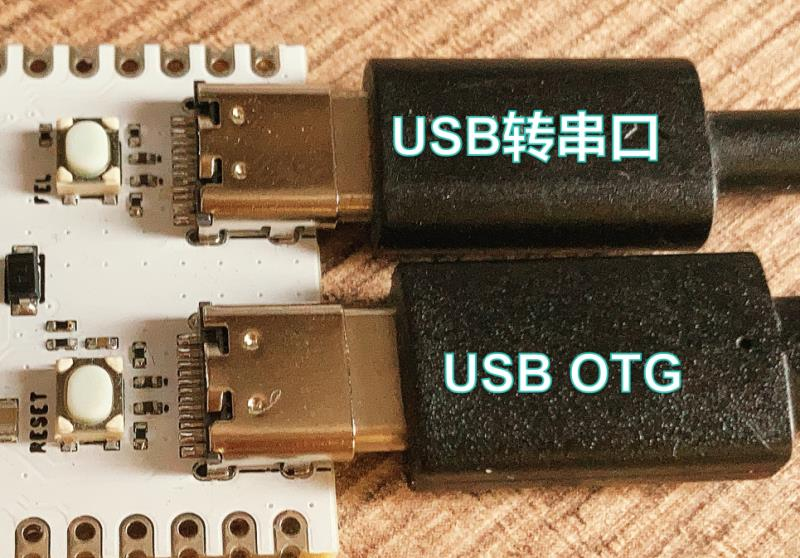

# 刷写固件

编译系统源码后，打包后生成的系统文件称之为固件。固件一般为`.img`格式。把固件下载到开发板或者产品上的过程称之为**烧写固件**。

## 烧录模式

R128 有两种烧录模式，分别为 USB 烧录与UART烧录。烧录模式以芯片 RST 时 PA1，PA2 引脚高低电平控制。

> R128 Module 默认配置为 USB 烧录，PA2 已经在模组通过下拉电阻下拉。

| PA1  | PA2  | 模式      |
| ---- | ---- | --------- |
| 1    | 1    | 非法模式  |
| 1    | 0    | 正常启动  |
| 0    | 1    | UART 下载 |
| 0    | 0    | USB 下载  |

## USB 烧写

R128 支持使用 USB 烧写系统。对于 Windows 用户可以使用 PhoenixSuit 进行烧写。是最常用的烧写工具，通过数据线将PC和开发板连接，把固件烧到开发板上。PhoenixSuit 支持分区烧写，适用于开发和小规模生产使用。

### PhoenixSuit - Windows

1. 打开PhoenixSuit
1. 点击浏览，选择固件
1. 点击全盘擦除升级


4. 使用 USB 数据线连接 USB OTG （USB转串口也可以连接，用于烧录查错）



5. 按住 `FEL` 键，然后点击 `RESET` 键重置开发板


6. `RESET` 点击后 PhoenixSuit 会自动进入烧录模式，开始下载


7. 烧录完成


#### PhoenixSuit 单独分区烧录

在开发的时候，会遇到只需要烧录单独分区的情况，例如只修改了 RV 核心的固件，不需要全盘下载。就可以选择单独分区烧录功能。

1. 选择单或多分区下载，PhoenixSuit 会解析固件并生成分区表
2. 选择需要下载的核心的固件


### PhoenixSuit - Linux

Linux 版本 PhoenixSuit 支持的发行版本包括 Ubuntu、Fedora、Redhat 及 CentOS 等几个常见的发行版本。目前驱动已经可以支持 4.11.0 版本以上内核，建议安装内核版本号大于4.11.0 的 Linux 发行版本。

#### 安装 PhoenixSuit - Linux

1. 下载 PhoenixSuit 到 Linux 中，解压


2. 安装依赖 dkms，对于 Ubuntu 可以用 `sudo apt install dkms dctrl_tools` 来安装


3. 打开终端，输入 `sudo ./PhoenixSuit.run` 来运行安装程序。


4. 使用 USB 数据线连接 USB OTG （USB转串口也可以连接，用于烧录查错）


5. 按住 `FEL` 键，然后点击 `RESET` 键重置开发板使其进入下载模式


6. 安装完成后可以用 `lsusb` 查看 USB 设备，找到 `ID 1f3a:efe8`，找到即安装完成。


#### 烧录

1. 使用命令 `sudo ./PhoenixSuit rtos_xxx_uart0_16Mnor.img ` 下载烧录 `rtos_xxx_uart0_16Mnor.img`


2. 显示 `Clos image OK!` 时，按住 `FEL` 引脚，点击 `RESET` 键使芯片进入下载模式


3. 开始烧录


4. 烧录完成


#### 虚拟机 Linux 烧录

1. 如果使用的是虚拟机连接开发板烧录，先运行 `sudo ./PhoenixSuit rtos_xxx_uart0_16Mnor.img ` 下载烧录 `rtos_xxx_uart0_16Mnor.img`，先进入下载模式。


2. 选择设备-USB，选择 Onda 设备连接虚拟机


3. 开始烧录，但是运行到 `Dev Plugout The Device Path is /dev/aw_efex0` 会卡住


4. 此时需要重新到 设备-USB 重新连接 USB 设备，这是因为芯片烧录时需要重置USB，导致USB编号变化，虚拟机不会自动连接。


5. 开始下载


6. 如果长时间没有重新连接 USB 设备，PhoenixSuit 会超时自动退出，报错如下


7. 如果刚才长时间没有重新连接，超时后连接上 USB 设备，重新运行`sudo ./PhoenixSuit rtos_xxx_uart0_16Mnor.img `下载命令。会出现 `Errpr!!!: PnpFesIn Error!` 这是因为烧录启动时的 USB 模式不匹配导致的，之前的操作导致USB进入了 `FFFF` 模式。此时需要按住 `FEL` 引脚，点击 `RESET` 键使芯片进入下载模式重新下载（下载模式会显示 `02B3`）


### PhoenixSuit - MacOS

1. 下载解压 `PhoneixSuit_MacOS.zip` 
2. 在 Mac 电脑中进入终端，将目录切到工具目录下
3. 执行命令 `chmod 777 ./phoenixsuit` 赋予运行权限
4. 使用命令 `./phoenixsuit rtos_xxx_uart0_16Mnor.img ` 下载烧录 `rtos_xxx_uart0_16Mnor.img`
5. 设备重新到 boot 的时候会自动进行烧写
6. 烧写成功，设备重启


### USB 烧写的流程

R128 系统的烧写流程如下：

1. 片内引导 BROM 初始化芯片，识别到 PA1，PA2 脚为 USB 烧录模式，初始化 USB
2. 上位机通过 USB 烧写 BOOT0 到 SRAM 中，并运行 BOOT0
3. BOOT0 初始化 PSRAM，返回完成信号等待上位机下载 BOOT1（U-Boot）
4. 上位机收到信号，下载 BOOT1（U-Boot）到 PSRAM 中，并引导运行 BOOT1（U-Boot）
5. BOOT1（U-Boot） 初始化系统资源，初始化内部 SPI NOR，USB2.0 等资源，等待上位机下载
6. 上位机下发固件，进入烧写模式，烧写固件

#### USB 烧录 log

```
[0]fes begin commit:61c5f1c6
[2]set pll end
[3]board init ok
[5]fake dram ok
[7]heap: 0x40a0000 size:0xe000
[9]lpsram init
[11]lspsram init aps64
[13]lspsram dqs:0x011b01b0
[18]psram chip APS64 init ok!, freq 1920000000
[22]Init psram controller ok
[24]hpsram init
[26]DRAM DQS gate is PD mode.
[29]DRAM BOOT DRIVE INFO 001: V2.00
[32]DRAM CLK = 800 MHZ
[34]dram_tpr11 = 0x0 , dram_tpr12 =0x0
[38]dram_tpr9 = 0x2222
[68]DRAM simple test OK.
[70]DRAM SIZE =8 MB
[82]fes1 done


U-Boot 2018.05-g024e8cd (Jul 04 2023 - 03:57:33 +0000) Allwinner Technology

[01.080]CPU:   Allwinner Family
[01.083]Model: sun20iw2
[01.086]DRAM:  8 MiB
[01.096]Relocation Offset is: 00799000
[01.131]secure enable bit: 0
[01.135]CPU=384 MHz,PLL6=192 Mhz,AHB=192 Mhz, APB1=96Mhz  MBus=4125Mhz
[01.142]sunxi flash type@0 not support fast burn key
[01.146]flash init start
[01.149]workmode = 16,storage type = 0
try card 0
set card number 0
get card number 0
[01.157][mmc]: mmc driver ver uboot2018:2021-07-19 14:09:00
[01.166][mmc]: get sdc_type fail and use default host:tm1.
[01.209][mmc]: can't find node "mmc0",will add new node
[01.214][mmc]: fdt err returned <no error>
[01.218][mmc]: Using default timing para
[01.221][mmc]: SUNXI SDMMC Controller Version:0x50310
[01.235][mmc]: mmc 0 cmd timeout 100 status 100
[01.240][mmc]: smc 0 err, cmd 8,  RTO
[01.243][mmc]: mmc 0 close bus gating and reset
[01.248][mmc]: mmc 0 cmd timeout 100 status 100
[01.253][mmc]: smc 0 err, cmd 55,  RTO
[01.256][mmc]: mmc 0 close bus gating and reset
[01.265][mmc]: mmc 0 cmd timeout 100 status 100
[01.269][mmc]: smc 0 err, cmd 1,  RTO
[01.272][mmc]: mmc 0 close bus gating and reset
[01.277][mmc]: Card did not respond to voltage select!
[01.282][mmc]: mmc_init: -95, time 56
[01.285][mmc]: mmc_init: mmc init fail, err -95
MMC init failed
try emmc fail
spi sunxi_slave->max_hz:50000000
sr3:0x68 --> 0x68
SF: Detected w25q128 with flag 0x301 with page size 256 Bytes, erase size 4 KiB, total 16 MiB
not boot mode, unlock all
[01.360]Loading Environment from SUNXI_FLASH... OK
[01.369]try to burn key
[01.372]out of usb burn from boot: not need burn key
Hit any key to stop autoboot:  0
sunxi work mode=0x10
run usb efex
delay time 2500
weak:otg_phy_config
usb init ok
set address 0xe
set address 0xe ok
SUNXI_EFEX_ERASE_TAG
erase_flag = 0x12
origin_erase_flag = 0x1
FEX_CMD_fes_verify_status
FEX_CMD_fes_verify last err=0
the 0 mbr table is ok
*************MBR DUMP***************
total mbr part 9

part[0] name      :env
part[0] classname :DISK
part[0] addrlo    :0x20
part[0] lenlo     :0x8
part[0] user_type :32768
part[0] keydata   :0
part[0] ro        :0

part[1] name      :env-redund
part[1] classname :DISK
part[1] addrlo    :0x28
part[1] lenlo     :0x8
part[1] user_type :32768
part[1] keydata   :0
part[1] ro        :0

part[2] name      :arm-lpsram
part[2] classname :DISK
part[2] addrlo    :0x30
part[2] lenlo     :0x960
part[2] user_type :32768
part[2] keydata   :0
part[2] ro        :0

part[3] name      :rv-lpsram
part[3] classname :DISK
part[3] addrlo    :0x990
part[3] lenlo     :0xfa0
part[3] user_type :32768
part[3] keydata   :0
part[3] ro        :0

part[4] name      :dsp-hpsram
part[4] classname :DISK
part[4] addrlo    :0x1930
part[4] lenlo     :0x640
part[4] user_type :32768
part[4] keydata   :0
part[4] ro        :0

part[5] name      :rtos-xip
part[5] classname :DISK
part[5] addrlo    :0x1f70
part[5] lenlo     :0x1388
part[5] user_type :32768
part[5] keydata   :0
part[5] ro        :0

part[6] name      :arm-b
part[6] classname :DISK
part[6] addrlo    :0x32f8
part[6] lenlo     :0x960
part[6] user_type :32768
part[6] keydata   :0
part[6] ro        :0

part[7] name      :config
part[7] classname :DISK
part[7] addrlo    :0x3c58
part[7] lenlo     :0x20
part[7] user_type :32768
part[7] keydata   :0
part[7] ro        :0

part[8] name      :UDISK
part[8] classname :DISK
part[8] addrlo    :0x3c78
part[8] lenlo     :0x0
part[8] user_type :33024
part[8] keydata   :0
part[8] ro        :0

need erase flash: 18
The Chip Erase size is: 16M ...
SUNXI_EFEX_MBR_TAG
mbr size = 0x4000
write primary GPT success
spinor: skip backup GPT
[43.156]update partition map
FEX_CMD_fes_verify_status
FEX_CMD_fes_verify last err=0
FEX_CMD_fes_verify_value, start 0x20, size high 0x0:low 0x1000
FEX_CMD_fes_verify_value 0x8c999e79
FEX_CMD_fes_verify_value, start 0x28, size high 0x0:low 0x1000
FEX_CMD_fes_verify_value 0x8c999e79
FEX_CMD_fes_verify_value, start 0x30, size high 0x0:low 0x121e48
FEX_CMD_fes_verify_value 0xe3775740
FEX_CMD_fes_verify_value, start 0x1930, size high 0x0:low 0x7a168
FEX_CMD_fes_verify_value 0x3b80dabd
FEX_CMD_fes_verify_value, start 0x1f70, size high 0x0:low 0x23c230
FEX_CMD_fes_verify_value 0x8bdd937b
FEX_CMD_fes_verify_value, start 0x32f8, size high 0x0:low 0xe8338
FEX_CMD_fes_verify_value 0x3e12775c
FEX_CMD_fes_verify_value, start 0x3c58, size high 0x0:low 0x3c00
FEX_CMD_fes_verify_value 0xe5de21c
flash sectors: 0x8000
FEX_CMD_fes_verify_value, start 0x3c78, size high 0x0:low 0x7e5400
FEX_CMD_fes_verify_value 0x4536d51f
bootfile_mode=4
SUNXI_EFEX_BOOT1_TAG
boot1 size = 0x8000, max size = 0x80000
uboot size = 0x124000
storage type = 3
skip toc1
FEX_CMD_fes_verify_status
FEX_CMD_fes_verify last err=0
bootfile_mode=4
SUNXI_EFEX_BOOT0_TAG
boot0 size = 0xc080
storage type = 3
burn first boot0 ok!
burn boot0 redund ok!
FEX_CMD_fes_verify_status
FEX_CMD_fes_verify last err=0
sunxi_efex_next_action=2
exit usb
next work 2
SUNXI_UPDATE_NEXT_ACTION_REBOOT
free spi flash
```

## UART 烧写

R128 支持使用 UART 烧写系统。

请注意：R128 Module 在硬件上下拉了 PA2 引脚，默认配置为USB下载模式。如果希望使用 UART 下载需要摘除 PA2 下拉电阻，或者外部上拉 PA2 到 3V3


PA2 下拉电阻为 47K，可以直接上拉 PA2 到 3V3 进入UART下载模式


### UART 下载设置

1. 打开 `PhoenixMC` 点击 `刷新` ，注意在下载过程中请断开各类串口监视器，不能占用串口，否则刷新找不到对应串口。
2. 配置串口波特率，一般选择 1500000 即可

如果选择太高的波特率会导致通讯错误，板载的  CH340C 仅支持最大2000000波特率


3. 点击 `刷新` 选择对应的串口
4. 点击调试进入调试界面


如果出现 `Open uart error!` 则表示没有关闭串口助手或者选择错了串口。


5. 配置 Flash 长度，例如 R128 内置 16M NOR Flash，这里就填入 `0x1000000` 也就是 16M 长度
6. 烧写前先擦除 Flash
7. 点击写入


8. 选择 16M 固件，注意这个固件后缀名是 `.bin` ，不是 USB 烧写的 `.img` 文件

> 注意：USB 烧写使用的是专有格式，需要 PhoenixSuit 解析并烧录，UART 烧写使用的是通用格式，为内置 SPI NOR 的镜像文件。


9. 提示文件较小，点击确定即可


10. 开始烧写


11. 烧写完成，下载结束


### UART mBoot 通讯协议

| Host | Main-CMD | Sub-CMD | CMD Value | Description              | Remarks                                        |
| ---- | -------- | ------- | --------- | ------------------------ | ---------------------------------------------- |
| PC   | 0x00     | 0x00    | 0x00      | Read 1 byte              |                                                |
| PC   | 0x00     | 0x01    | 0x01      | Write 1 byte             |                                                |
| PC   | 0x00     | 0x02    | 0x02      | Read 2 bytes             |                                                |
| PC   | 0x00     | 0x03    | 0x03      | Write 2 bytes            |                                                |
| PC   | 0x00     | 0x04    | 0x04      | Read 4 bytes             |                                                |
| PC   | 0x00     | 0x05    | 0x05      | Write 4 bytes            |                                                |
| PC   | 0x00     | 0x06    | 0x06      | Read 8 bytes             |                                                |
| PC   | 0x00     | 0x07    | 0x07      | Write 8 bytes            |                                                |
| PC   | 0x01     | 0x00    | 0x08      | Read n bytes             |                                                |
| PC   | 0x01     | 0x01    | 0x09      | Write n bytes            |                                                |
| PC   | 0x02     | 0x00    | 0x10      |                          | Change the UART transmission condition         |
| PC   | 0x02     | 0x01    | 0x11      |                          | Enable/Disable JTAG                            |
| PC   | 0x02     | 0x02    | 0x12      |                          | reboot                                         |
| PC   | 0x02     | 0x03    | 0x13      | Set PC pointer           |                                                |
| PC   | 0x02     | 0x04    | 0x14      |                          | Enable/disable MCU transmission and validation |
| PC   | 0x02     | 0x05    | 0x15      |                          | Obtain baud rate list                          |
| PC   | 0x02     | 0x06    | 0x16      |                          | Modify the buffer                              |
| PC   | 0x00     | 0x00    | 0x18      | Obtain flash information |                                                |
| PC   | 0x01     | 0x01    | 0x19      | Chip erase               |                                                |
| PC   | 0x01     | 0x02    | 0x1A      | Read n sectors           |                                                |
| PC   | 0x01     | 0x03    | 0x1B      | Write n sectors          |                                                |
| PC   | 0x01     | 0x04    | 0x1C      | Obtain flash information |                                                |
| PC   | 0x01     | 0x05    | 0x1D      | Chip erase               |                                                |
| PC   | 0x01     | 0x06    | 0x1E      | Read n sectors           |                                                |
| PC   | 0x01     | 0x07    | 0x1F      | Write n sectors          |                                                |
| MCU  | 0x00     | 0x00    |           |                          | Send message to PC                             |

## 烧录速度对比

| 烧录方式         | 擦除速度 | 烧录速度 |
| ---------------- | -------- | -------- |
| USB              | 30s      | 38s      |
| UART （1500000） | 60s      | 205s     |
| UART （115200）  | 60s      | 1466s    |

