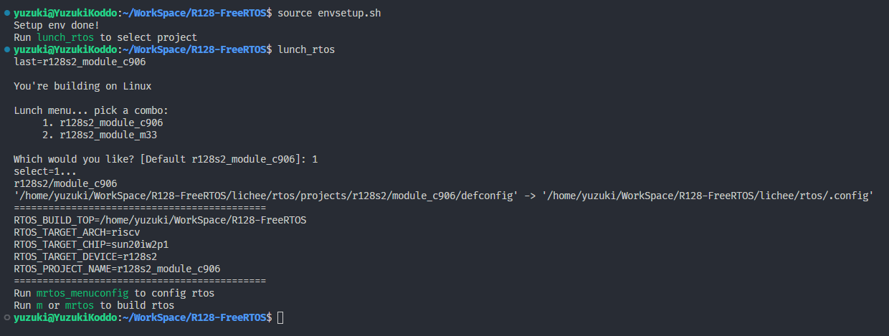
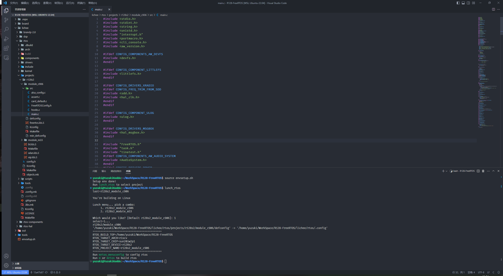
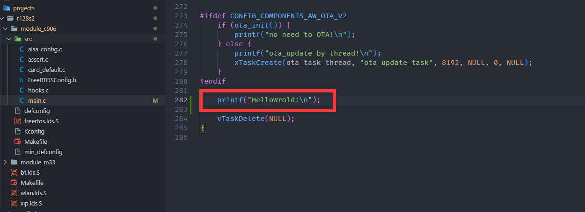
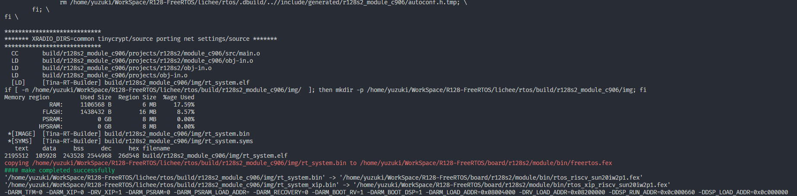
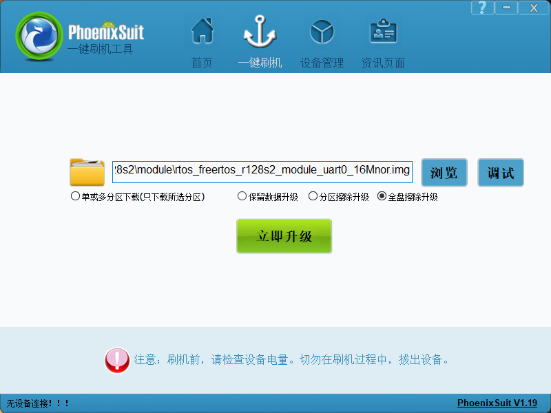
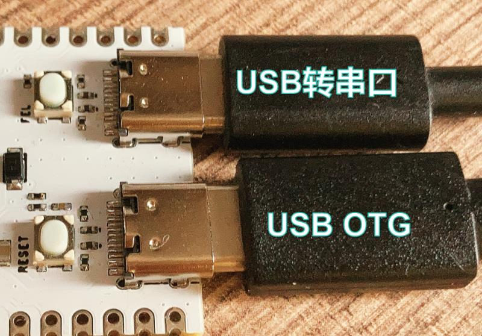
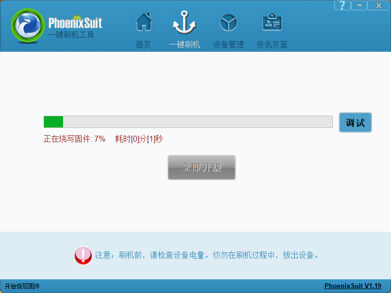
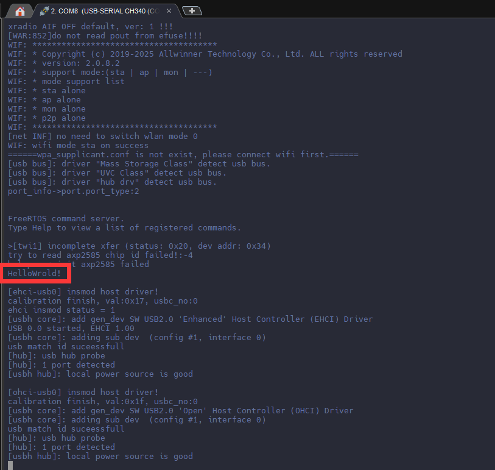

# 编写 HelloWorld

本文将介绍使用 R128 开发板从串口输出 HelloWorld 的方式介绍 SDK 软件开发流程。

## 载入方案

我们使用的开发板是 R128-Devkit，需要开发 C906 核心的应用程序，所以载入方案选择`r128s2_module_c906`

```bash
$ source envsetup.sh 
$ lunch_rtos 1
```



## 编辑程序

打开你喜欢的编辑器，修改文件：`lichee/rtos/projects/r128s2/module_c906/src/main.c`



由于是 FreeRTOS，我们在最后一行 `vTaskDelete(NULL)` 前加上 

```c
printf("HelloWrold!\n");
```



使用命令 `mp` 编译打包，可以看到刚才修改的 `main.c` 编译进去了



## 烧录程序

打开 PhoenixSuit 选择刚才编译出来的固件



开发板插入 USB OTG 和 串口，OTG用于烧录，串口用于查看输出。



然后按住 `FEL` 按键，轻点 `RESET` 按键开始烧录


烧录中，可以松开`FEL`按键了



烧录过程中串口会输出烧录的日志，对于排错很有帮助


## 查看结果

烧录完成后可以在日志中找到刚才编写的 Hello World 输出

