# SDK 入门

本文档旨在介绍基础的SDK编译，打包等操作，方便快速上手 SDK 开发。

## SDK 基础知识

R128 平台拥有三个核心，M33 Star 核心作为启动和安全核心，XuanTie C906 核心作为应用核运行用户 APP，HIFI5 作为算法核运行DSP算法。由于架构不同，不同的核心需要运行不同的 RTOS。

其中 M33 Star 和 C906 运行的是 `FreeRTOS V10.4.3` 同一个内核支持两个不同架构的核心，其外设、组件、驱动是相同的。特性如下：

- 支持 M33 Star（Armv8-M）、C906（Riscv-64） 架构
- FreeRTOS V10.4.3 内核
- 支持标准 posix 接口
- 支持系统接口，用于内核以外的模块调用内核函数的接口
- 支持文件系统，包含设备管理器、分区管理器、文件系统实体管理器等，例如 littlefs、fat 等，实现对不同设备类型、分区类型、文件系统类型的集成
- 支持 newlibc 库

而 HIFI5 运行的是 Cadence 所推荐的 `FreeRTOS V10.2.0` 内核，其部分组件与 M33/C906 核心不同。特性如下：

- 支持 Xtensa HIFI5 架构
- FreeRTOS V10.2.0 内核
- 支持系统接口，用于内核以外的模块调用内核函数的接口
- 支持 VFPU/NN 算法库

所以在开发过程中，M33/C906 使用的是一套 FreeRTOS SDK，HIFI5 使用的是另外的一套 FreeRTOS SDK。这里将介绍 M33/C906 的开发入门，HIFI5的相关开发将在 DSP 章节介绍。

- 异构计算相关在

### SDK 目录架构

下表是简化版本的 SDK 目录结构，具体的说明在 【[SDK入门 - SDK 架构与目录结构](/r128/sdk_tree?id=sdk-架构与目录结构)】中说明。

```
.
├── board               # 板级配置目录
│   ├── common          # 公共板级配置目录
│   │   ├── configs     # 公共板级配置
│   │   └── data        # 公共数据
│   └── r128s2          # R128 S2 芯片配置目录
│       └── module      # R128 S2 Module 模块板级配置目录
├── lichee              # 系统源码目录
│   ├── brandy-2.0      # 启动相关目录
│   ├── dsp             # HIFI5 FreeRTOS 系统、组件、应用
│   ├── rtos            # M33/C906 FreeRTOS 系统、组件、应用
│   ├── rtos-components # 公共应用组件，libc、多媒体、lvgl等
│   └── rtos-hal        # RTOS HAL驱动
├── out                 # 打包输出的临时文件与最终镜像文件
└── tools               # 用于存放打包相关的脚本、工具
```

## 初始化SDK环境

在编译之前，需要初始化 SDK 的环境，使用下列命令初始化环境。

```bash
source envsetup.sh
```

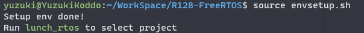

## 载入项目方案

使用下列命令载入方案

```bash
lunch_rtos
```

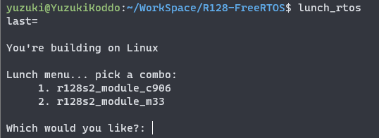

这里我们需要开发的是 `r128s2_module_c906` 方案，对应的是 R128 模块的最小化系统开发板的 C906 核心的 RTOS。输入 `1` 回车即可。

第一次载入方案会解压工具链，解压完成后会提示方案载入成功：

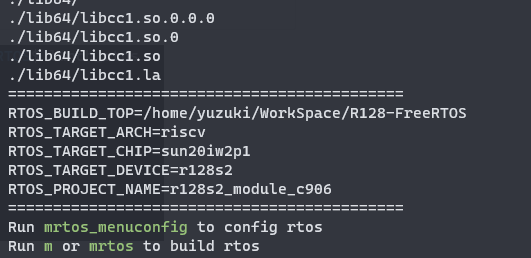

第二次开始就会跳过解压工具链，并且会记录上一次选择的方案。

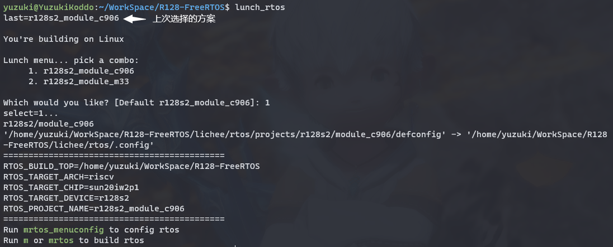

## 更换项目方案

在开发过程中如果需要开发 M33 核心方案，需要重新执行 ` lunch_rtos` 选择 M33 方案。

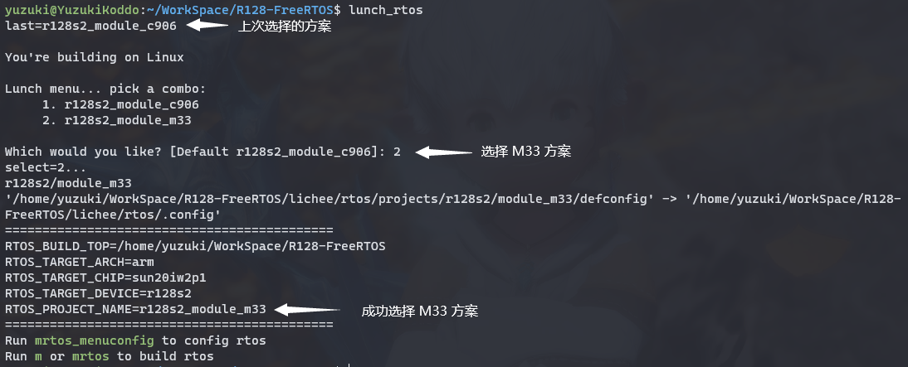

## 配置 RTOS 基本设置与软件包配置

SDK 提供了 `mrtos_menuconfig` 命令来配置基本SDK配置与软件包。相关文档位于 [RTOS软件包配置](https://yuzukihd.top/R128Module/#/sdk_base/rtos_package)。下图为进入的配置界面。

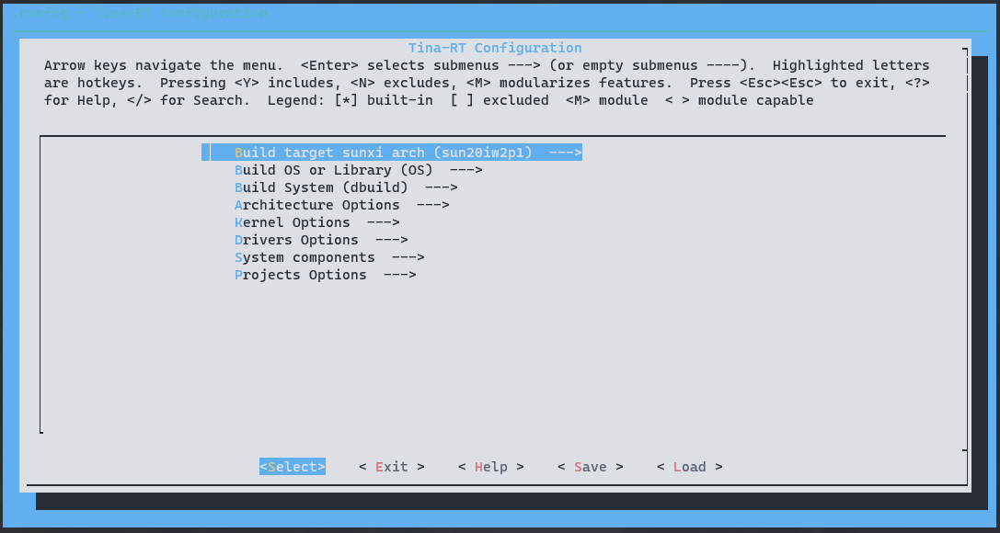

## 编译系统

可以使用 `m` 命令或者 `mrtos` 命令编译RTOS系统。

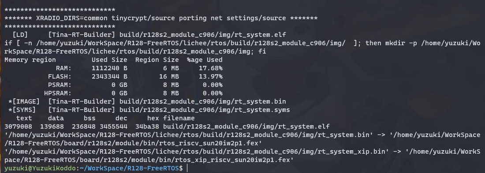

## 打包系统

使用 `p` 或者 `pack` 命令打包系统

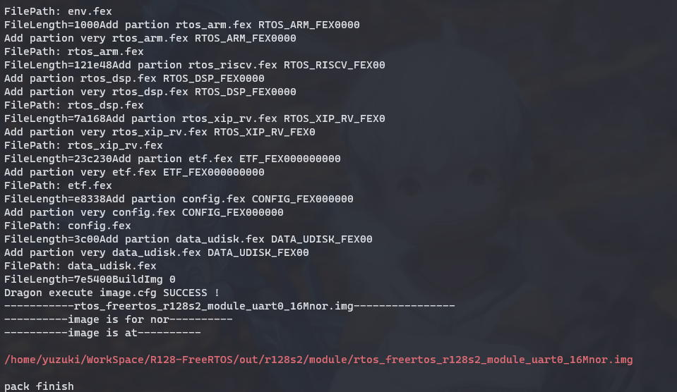

注意，打包如果出现 

````
err: failed to open bin file rtos_xxx.fex
Generate image file failed
ERROR: mkimage run error
````

则是因为系统配置勾选启用了这个核心但是实际没有编译这个核心的 RTOS 系统，导致找不到这个核心的 RTOS 的固件。这时候需要编译完成 RTOS 系统然后重新打包。例如报错 `err: failed to open bin file rtos_arm.fex` 

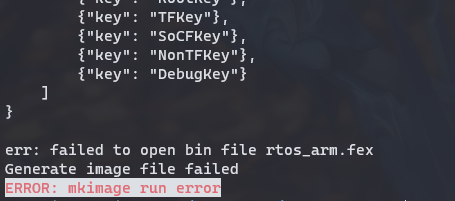

则需要编译对应的 `arm` 核心的固件，在这里是 m33 核心。`lunch_rtos` 选择 `M33` 核心，然后 `m` 编译。

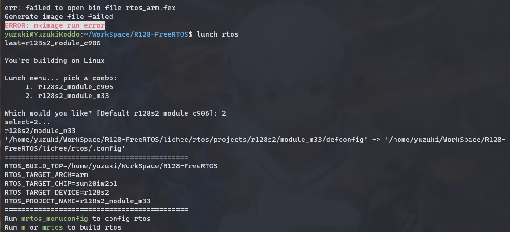

此时 `pack` 就可以通过了


## 扩展命令

了解上面的命令即可开始开发 RTOS ，不过 SDK 还提供了一些其他命令简化使用。

### 一键编译 + 打包

SDK 提供了 `mp` 命令以供一键编译 + 打包方案。

### 编译 `U-boot`

 可以使用 `muboot` 命令编译 `u-boot` 

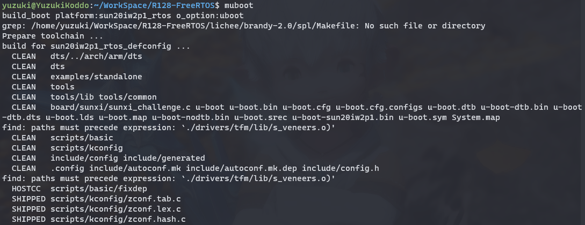

编译完成后会自动拷贝生成的镜像到指定位置等待打包

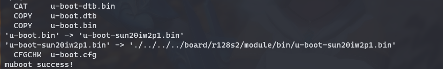

### 编译 `boot0` 

可以使用 `mboot0` 编译 `boot0`，编译完成后会自动拷贝生成的镜像到指定位置等待打包

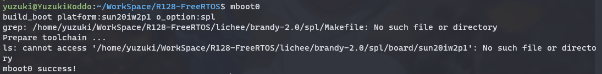

### 编译 `U-boot` + `boot0`

 可以使用 `mboot` 命令编译  `U-boot` + `boot0`

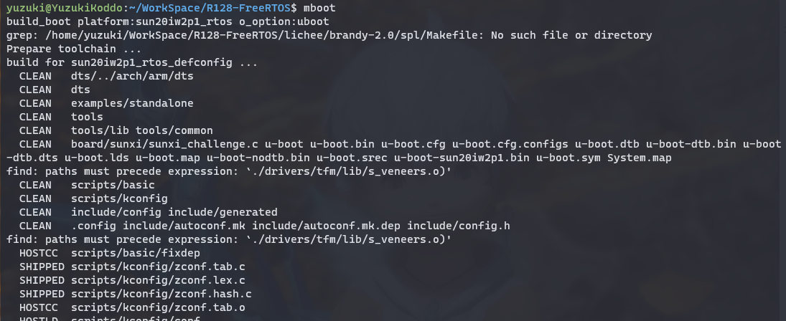

编译完成后会自动拷贝生成的镜像到指定位置等待打包

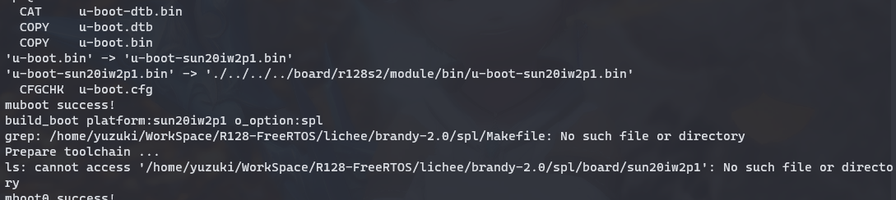

### 文件夹跳转快捷命令

```
- croot:        Jump to the top of the tree.
- cboot:        Jump to uboot.
- cboot0:       Jump to boot0.
- cbin:         Jump to uboot/boot0 bin directory.
- cconfigs:     Jump to configs of target.
- cout:         Jump to out directory of target.
- cdsp:         Jump to dsp.
- chal:         Jump to rtos-hal.
- ccomponents:  Jump to rtos-components.
- cbuild:       Jump to rtos build dir.
- cprojects:    Jump to rtos projects dir.
```

