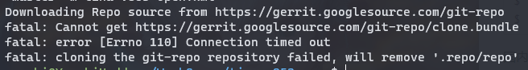

# 获取SDK

SDK 使用 Repo 工具管理，拉取 SDK 需要配置安装 Repo 工具。

> Repo is a tool built on top of Git. Repo helps manage many Git repositories, does the uploads to revision control systems, and automates parts of the development workflow. Repo is not meant to replace Git, only to make it easier to work with Git. The repo command is an executable Python script that you can put anywhere in your path.

Repo官网：[git-repo](https://gerrit.googlesource.com/git-repo)

## 安装 Repo 工具

可以用包管理器进行安装：

```bash
# Debian/Ubuntu.
$ sudo apt-get install repo

# Gentoo.
$ sudo emerge dev-vcs/repo
```

也可以手动单独安装：

```bash
$ mkdir -p ~/.bin
$ PATH="${HOME}/.bin:${PATH}"
$ curl https://storage.googleapis.com/git-repo-downloads/repo > ~/.bin/repo
$ chmod a+rx ~/.bin/repo
```

国内镜像源安装：

```bash
$ mkdir -p ~/.bin
$ PATH="${HOME}/.bin:${PATH}"
$ curl https://mirrors.bfsu.edu.cn/git/git-repo > ~/.bin/repo
$ chmod a+rx ~/.bin/repo
```

由于谷歌服务器位于国外，每次运行时Repo会检查更新导致下载较慢，国内用户可以配置镜像源。否则会像下图一样卡住不动然后失败。



### 更换镜像源

Repo 的运行过程中会尝试访问官方的 git 源更新自己，更换镜像源可以提高下载速度。将如下内容复制到你的`~/.bashrc` 里

```bash
$ echo export REPO_URL='https://mirrors.bfsu.edu.cn/git/git-repo' >> ~/.bashrc
$ source ~/.bashrc
```

如果您使用的是 dash、hash、 zsh 等 shell，请参照 shell 的文档配置。

### 配置保存身份认证

新版本 git 默认加强了安全性，身份认证不会保存，导致拉取 repo 需要多次输入密码，可以用下列命令配置：

```
git config --global credential.helper store
```


### 常见问题

- 卡在`Downloading Repo source from https://gerrit.googlesource.com/git-repo` 不动。
   - 国内网络较慢，参照上面的更换镜像源解决。

- 配置保存身份认证无效不启用
   - 检查是否运行了 `sudo git config --global credential.helper store` 使用了 `sudo` 后保存的信息会存储到 `root` 用户下并非当前用户。
- 出现错误 `fatal: cannot make  directory: File exists`
   - 之前拉取了 repo 但是不完整，需要删除 `.repo` 文件夹重新拉取


## SDK 拉取

以 `tina-v853-open` 为例，讲述如何拉取 SDK。

### 新建文件夹保存 SDK

使用 `mkdir` 命令新建文件夹，保存之后需要拉取的 SDK，然后 `cd` 进入到刚才新建的文件夹中。

```bash
$ mkdir tina-v853-open
$ cd tina-v853-open
```

### 初始化 Repo 仓库

使用 `repo init` 命令初始化仓库，`tina-v853-open` 的仓库地址是 `https://sdk.aw-ol.com/git_repo/V853Tina_Open/manifest.git` 需要执行命令：

```bash
$ repo init -u https://sdk.aw-ol.com/git_repo/V853Tina_Open/manifest.git -b master -m tina-v853-open.xml
```


如果提示 `Username for 'https://sdk.aw-ol.com':` 请输入 [全志在线开发者论坛](https://bbs.aw-ol.com/) 的用户名和密码。**（注：需要全志在线开发者论坛LV2等级以上用户才有权限拉取 SDK）**


### 拉取 SDK

使用命令 `repo sync` 拉取 SDK

```bash
$ repo sync
```

由于 SDK 普遍较大，拉取可能需要一定的时间。


### 创建开发环境

使用命令 `repo start` 创建开发环境分支

```bash
$ repo start devboard-v853-tina-for-awol --all
```


至此，SDK 获取完毕。