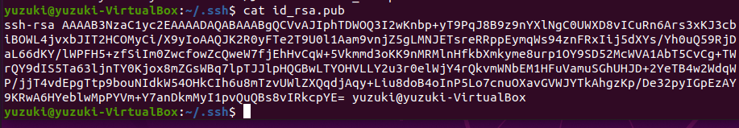
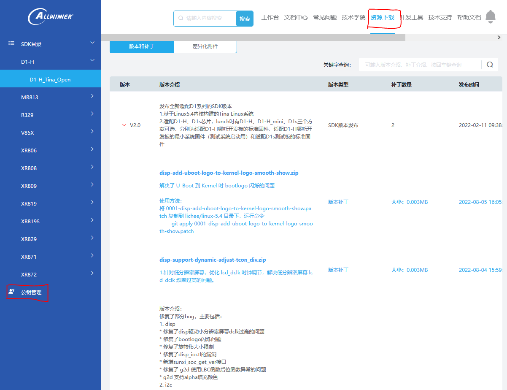
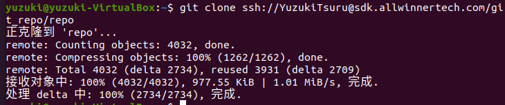

# 获取SDK

## 配置身份认证

SDK 获取需要使用 `Public Key` 方法认证登陆 SDK 资源站后下载 SDK。远程登录密码认证的方式有三种，`password`、`Keyboard Interactive`、`Public Key`。前面两种方式就是密码认证，含义都是一样大同小异。第三种是登录方式最安全的一种，不需要明文的密码传输，且绑定本地环境。

 `Public Key` 方法的客户端利用服务端发过来的私钥，进行登录的认证，认证服务端的公钥。从而实现安全的访问。

### 生成钥匙对

```shell
ssh-keygen
```

会询问你保存的位置与密码，默认回车即可，不需要配置。


前往生成的文件夹可以找到刚才生成的钥匙对。

```
cd ~/.ssh/
```


```
总用量 8
-rw------- 1 yuzuki yuzuki 2610 4月   6 11:16 id_rsa      # 密钥
-rw-r--r-- 1 yuzuki yuzuki  578 4月   6 11:16 id_rsa.pub  # 公钥
```

### 获取公钥

可以使用 `cat` 命令获取公钥

```
cat id_rsa.pub
```



输出的内容就是公钥，全部复制即可。


### 上传公钥到全志服务平台

登陆全志客户服务平台 [open.allwinnertech.com](https://open.allwinnertech.com/)，点击资源下载界面，在左侧栏找到公钥管理。



点击创建，把刚才复制的公钥复制过来。名称随意。


创建完成


### 测试是否配置成功

重启本地开发环境，让系统应用钥匙对的配置。


使用 `ssh` 命令测试是否可以正常访问远程服务器。

```shell
 ssh <改成你的用户名>@sdk.allwinnertech.com 
```


见到 `Welcome to Allwinnertech Cloud Service !` 就是配置成功了。

如果遇到需要输入密码的情况，就说明配置错误。例如这里没有正确大小写全志客户服务平台注册的用户名。


## 配置SDK拉取工具

SDK 使用本地化修改过的 `repo` 进行管理，与 Android 的 AOSP 的源码管理类似

### 拉取工具

使用 `git` 命令拉取 `repo` 管理工具。

```
git clone ssh://<你的用户名>@sdk.allwinnertech.com/git_repo/repo 
```



编辑 `repo` 工具，修改用户名

```
cd repo
gedit repo
```


将 `username` 改成全志客户服务注册的用户名，例如我的 `YuzukiTsuru`，然后保存。


然后将脚本拷贝到 `bin` 文件夹方便使用

```
chmod 777 repo
sudo cp repo /usr/bin/repo
```


然后运行 `repo` 查看是否正常运行。显示 `error: repo is not installed.  Use "repo init" to install it here.` 就是正常情况。


如果出现 `/usr/bin/env: “python”: 没有那个文件或目录`，用以下命令创建链接即可

```
sudo ln -s /usr/bin/python2 /usr/bin/python
```


## SDK 拉取

!> SDK 将在正式发布后开放下载