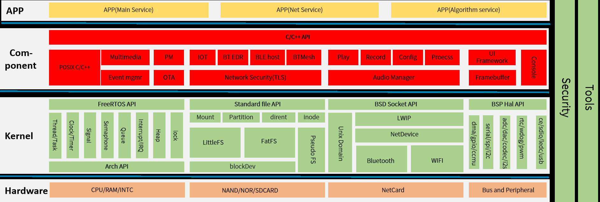

# SDK 架构与目录结构

R128 S2 是全志提供的一款 M33(ARM)+C906(RISCV-64)+HIFI5(Xtensa) 三核异构 SoC，同时芯片内部 SIP 有 1M SRAM、8M LSPSRAM、8M HSPSRAM 以及 16M NORFLASH。本文档作为 R128 FreeRTOS SDK 开发指南，旨在帮助软件开发工程师、技术支持工程师快速上手，熟悉 R128 FreeRTOS SDK 的开发流程。

## SDK 架构

R128 包含 3 个核，需要编译 M33+C906+HIFI5 共3 个核的镜像。启动时同时运行三个 RTOS 系统。其中 M33 与 C906 使用的是 FreeRTOS v10.4.3，从 https://www.freertos.org/RTOS.html 获取，HIFI5 使用的 FreeRTOS 是根据Cadence Support 的推荐的 [https://github.com/foss‑xtensa/amazon‑freertos](https://github.com/foss‑xtensa/amazon‑freertos) （tag：v1.7‑xtensa）版本

!> 开发 HIFI5 需要 Cadence Xtensa 的 IDE 工具, DSP 的 XCC 工具链包。Cadence Xtensa 的授权 License，用于服务器代码编译和 Xplorer 仿真使用。**这些工具需要向 Cadence 申请授权**，链接：[https://www.cadence.com/en_US/home/tools/ip/tensilica-ip/technologies.html](https://www.cadence.com/en_US/home/tools/ip/tensilica-ip/technologies.html)，Xplorer 下载链接：[https://www.cadence.com/en_US/home/tools/ip/tensilica-ip/sdk-download.html](https://www.cadence.com/en_US/home/tools/ip/tensilica-ip/sdk-download.html)。

## SDK 软件框架



R128 软件框架如上图所示，一共4 层，分别为硬件层、内核层、组件层、应用层。

- Hardware。硬件层包括处理器、内存、存储介质、无线网卡、总线以及外设等。
- Kernel。内核层包括FreeRTOS 核心系统、文件系统、网络系统、BSP 驱动等。
- Component。组件层包括控制台、多媒体、功耗管理、OTA、音频系统、显示系统、图像采集等。
- APP。应用层包括各种应用demo。

## SDK 目录结构

SDK 目录结构如下，重点目录进行了展开处理

```
.
├── board               # 板级配置目录
│   ├── common          # 公共板级配置目录
│   │   ├── configs     # 公共板级配置
│   │   └── data        # 公共数据
│   │       ├── reserve # Wi-Fi & BT 固件
│   │       ├── secret  # 公共安全区
│   │       └── UDISK   # 公共 UDISK 分区
│   └── r128s2          # R128 S2 芯片配置目录
│       ├── 86panel     # R128 S2 86面板开发板 板级配置目录 
│       │   ├── bin     # 86面板开发板固件，引导等bin
│       │   ├── configs # 86面板开发板配置文件，引脚复用，分区表等配置文件
│       │   │   └── ota # 86面板开发板配置文件，OTA相关配置文件
│       │   └── data    # 86面板开发板数据
│       │       ├── reserve
│       │       ├── secret
│       │       └── UDISK
│       └── module      # R128 S2 Module 模块板级配置目录
│           ├── bin     # R128 S2 Module 固件，引导等bin
│           ├── configs # R128 S2 Module 配置文件，引脚复用，分区表等配置文件
│           │   └── ota # R128 S2 Module 配置文件，OTA相关配置文件
│           └── data    # R128 S2 Module 数据
│               ├── reserve
│               ├── secret
│               └── UDISK
├── lichee              # 系统源码目录
│   ├── brandy-2.0      # 启动相关目录
│   │   ├── tools       # U-Boot 使用的工具链
│   │   └── u-boot-2018 # U-Boot 启动代码
│   ├── rtos            # M33/C906 FreeRTOS 系统、组件、应用
│   │   ├── arch        # 处理器架构相关代码
│   │   │   ├── arm     # ARM 处理器初始化、中断处理、异常处理、内存映射相关功能的实现
│   │   │   │   ├── armv8m
│   │   │   │   └── common
│   │   │   ├── common
│   │   │   └── risc-v  # RISC-V 处理器初始化、中断处理、异常处理、内存映射相关功能的实现
│   │   │       ├── c906
│   │   │       ├── common
│   │   │       ├── includes
│   │   │       └── sun20iw2p1
│   │   ├── build       # 编译临时文件输出目录
│   │   ├── components  # 应用组件，libc、多媒体、lvgl等
│   │   │   ├── aw      # Allwinner 提供的组件
│   │   │   │   ├── blkpart
│   │   │   │   ├── bluetooth
│   │   │   │   ├── ...
│   │   │   │   └── wireless_video
│   │   │   ├── common -> ../../rtos-components
│   │   │   └── thirdparty # 第三方提供的组件
│   │   │       ├── common
│   │   │       ├── console
│   │   │       ├── ...
│   │   │       └── vfs
│   │   ├── drivers     # RTOS 驱动
│   │   │   ├── drv
│   │   │   │   ├── bluetooth
│   │   │   │   ├── ...
│   │   │   │   └── wireless
│   │   │   ├── osal
│   │   │   │   └── src
│   │   │   └── rtos-hal -> ../../rtos-hal/
│   │   ├── include     # RTOS 头文件目录
│   │   │   ├── arch    # 架构相关头文件
│   │   │   │   ├── arm
│   │   │   │   └── riscv 
│   │   │   ├── drivers # 驱动相关头文件
│   │   │   ├── FreeRTOS_POSIX
│   │   │   ├── ...
│   │   │   └── sys
│   │   ├── kernel      # FreeRTOS 内核
│   │   ├── projects    # 方案工程目录，后文有详细介绍
│   │   ├── scripts     # 编译脚手架脚本
│   │   └── tools       # RTOS 使用的工具链
│   ├── rtos-components # 公共应用组件，libc、多媒体、lvgl等
│   │   ├── aw          # Allwinner 提供的公共应用组件
│   │   └── thirdparty  # 第三方提供的公共应用组件
│   └── rtos-hal        # RTOS HAL驱动
│       ├── hal         # HAL 驱动
│       ├── include     # HAL 头文件
│       └── tools       # HAL 相关工具
├── out                 # 打包输出的临时文件与最终镜像文件
│   └── r128s2
│       └── pro
└── tools               # 用于存放打包相关的脚本、工具
    ├── image-file
    ├── scripts
    ├── tool
    │   └── cppcheck
    ├── win-tools
    └── xradio-tools
        ├── data
        ├── HcidumpXr
        ├── NLink
        ├── NTest
        └── sdd_editor
```

R128 SDK 目录结构如上所示，主要包括如下几个关键目录：

- `board`：板级配置目录，用于存放芯片方案的配置文件，主要包括 `env` 配置、分区表配置、
  `sys_config.fex` 引脚复用配置等。
- `lichee/brandy‑2.0`：主要存放uboot 等代码。
- `lichee/rtos`：存放 M33/C906 FreeRTOS 系统、组件、应用。
- `lichee/rtos‑components`：公共组件目录。
- `lichee/rtos‑hal`：HAL BSP 驱动目录。用于存放各种驱动代码。
- `out`：用于保存打包时输出的临时文件与最终镜像文件。打包时自动生成此目录。
- `tools`：工具目录，用于存放打包相关的脚本、工具等。

### lichee/rtos 目录

```
lichee/rtos
    ├── arch        # 处理器架构相关
    ├── build       # 编译临时文件输出目录
    ├── components  # 组件
    ├── drivers     # 驱动
    ├── include
    ├── kernel      # FreeRTOS内核
    ├── projects    # 方案工程
    ├── scripts
    └── tools       # 工具链
```

lichee/rtos 目录主要包括arch（架构相关）、components（组件）、drivers（驱动）、include（头文件）、kernel（内核）、projects（工程）、toos(工具链) 几个目录。

#### arch 目录

arch 目录主要放置跟SoC 架构相关的内容，每个SoC 单独目录管理，主要包括跟R128 处理器相关的ARCH 初始化、中断处理、异常处理、内存映射相关功能的实现。

#### drivers 目录

drivers 目录包含R128 所需的外设驱动，主要包括各外设控制器驱动的具体实现（rtos‑hal 软连接）以及OSAL 层接口实现（osal）。

#### kernel 目录

kernel 目录主要包含FreeRTOS 的kernel 源码，ARMv8M 的portable 源码以及全志实现的系统功能相关代码。

```
.
├── FreeRTOS
│   ├── Makefile
│   └── Source
├── FreeRTOS-orig
│   ├── License
│   ├── Makefile
│   └── Source
├── Kconfig
├── Makefile
├── objects.mk
└── Posix
    ├── CMakeLists.txt
    ├── include
    ├── Makefile
    └── source
```

#### projects 目录

projects 目录下的每一个子目录代表一个SoC 类别，每个 SoC 类别下面存放对应的方案，每个方案都有 m33 与c906 目录，在这些目录下面实现各处理器上第一个任务，选择不同的 project 编译出来的 bin 具有不同功能。每个 `project` 有独立的 `FreeRTOSConfig` 配置。

```
.
├── config.h                       # 公共配置头文件
├── Kconfig                        # Kconfig 引索文件
├── Makefile                       # Makefile
├── objects.mk                     # Makefile 构建脚本
└── r128s2                         # R128 S2 平台方案
    ├── bt.lds.S                   # 蓝牙协议栈等链接脚本
    ├── Makefile                   # Makefile 构建脚本
    ├── 86panel_c906               # 86panel 方案 C906 RISC-V 核相关文件
    │   ├── defconfig              # 软件包配置文件
    │   ├── freertos.lds.S         # 链接脚本
    │   ├── Kconfig                # Kconfig 引索文件
    │   ├── Makefile               # Makefile 构建脚本
    │   └── src                    # 86panel 方案 C906 RISC-V 核相关源码
    │       ├── alsa_config.c      # alsa 框架插件配置文件
    │       ├── assert.c           # 断言处理
    │       ├── card_default.c     # 声卡配置文件
    │       ├── FreeRTOSConfig.h   # FreeRTOS 配置文件
    │       ├── hooks.c            # FreeRTOS 相关钩子函数配置
    │       └── main.c             # FreeRTOS 程序入口
    ├── wlan.lds.S                 # WiFi 链接文件
    └── xip.lds.S                  # xip 链接文件
```

#### Tools 目录

这个目录主要包含一些预编译好的交叉编译工具链，目前M33 基于GCC 8.3.1 的交叉编译环境，C906 基于GCC 8.4.0 的交叉编译器。

##### M33 编译器

```
Using built-in specs.
COLLECT_GCC=./arm-none-eabi-gcc
COLLECT_LTO_WRAPPER=/R128-FreeRTOS/lichee/rtos/tools/gcc-arm-none-eabi-8-2019-q3-update/bin/../lib/gcc/arm-none-eabi/8.3.1/lto-wrapper
Target: arm-none-eabi
Configured with: /tmp/jenkins/jenkins-GCC-8-build_toolchain_docker-594_20190704_1562200936/src/gcc/configure --target=arm-none-eabi --prefix=/tmp/jenkins/jenkins-GCC-8-build_toolchain_docker-594_20190704_1562200936/install-native --libexecdir=/tmp/jenkins/jenkins-GCC-8-build_toolchain_docker-594_20190704_1562200936/install-native/lib --infodir=/tmp/jenkins/jenkins-GCC-8-build_toolchain_docker-594_20190704_1562200936/install-native/share/doc/gcc-arm-none-eabi/info --mandir=/tmp/jenkins/jenkins-GCC-8-build_toolchain_docker-594_20190704_1562200936/install-native/share/doc/gcc-arm-none-eabi/man --htmldir=/tmp/jenkins/jenkins-GCC-8-build_toolchain_docker-594_20190704_1562200936/install-native/share/doc/gcc-arm-none-eabi/html --pdfdir=/tmp/jenkins/jenkins-GCC-8-build_toolchain_docker-594_20190704_1562200936/install-native/share/doc/gcc-arm-none-eabi/pdf --enable-languages=c,c++ --enable-plugins --disable-decimal-float --disable-libffi --disable-libgomp --disable-libmudflap --disable-libquadmath --disable-libssp --disable-libstdcxx-pch --disable-nls --disable-shared --disable-threads --disable-tls --with-gnu-as --with-gnu-ld --with-newlib --with-headers=yes --with-python-dir=share/gcc-arm-none-eabi --with-sysroot=/tmp/jenkins/jenkins-GCC-8-build_toolchain_docker-594_20190704_1562200936/install-native/arm-none-eabi --build=x86_64-linux-gnu --host=x86_64-linux-gnu --with-gmp=/tmp/jenkins/jenkins-GCC-8-build_toolchain_docker-594_20190704_1562200936/build-native/host-libs/usr --with-mpfr=/tmp/jenkins/jenkins-GCC-8-build_toolchain_docker-594_20190704_1562200936/build-native/host-libs/usr --with-mpc=/tmp/jenkins/jenkins-GCC-8-build_toolchain_docker-594_20190704_1562200936/build-native/host-libs/usr --with-isl=/tmp/jenkins/jenkins-GCC-8-build_toolchain_docker-594_20190704_1562200936/build-native/host-libs/usr --with-libelf=/tmp/jenkins/jenkins-GCC-8-build_toolchain_docker-594_20190704_1562200936/build-native/host-libs/usr --with-host-libstdcxx='-static-libgcc -Wl,-Bstatic,-lstdc++,-Bdynamic -lm' --with-pkgversion='GNU Tools for Arm Embedded Processors 8-2019-q3-update' --with-multilib-list=rmprofile
Thread model: single
gcc version 8.3.1 20190703 (release) [gcc-8-branch revision 273027] (GNU Tools for Arm Embedded Processors 8-2019-q3-update)
```

##### C906 RISC-V 编译器

```
Using built-in specs.
COLLECT_GCC=./riscv64-unknown-elf-gcc
COLLECT_LTO_WRAPPER=/R128-FreeRTOS/lichee/rtos/tools/riscv64-elf-x86_64-20201104/bin/../libexec/gcc/riscv64-unknown-elf/8.4.0/lto-wrapper
Target: riscv64-unknown-elf
Configured with: /ldhome/software/toolsbuild/slave/workspace/riscv64_build_elf_x86_64/build/../source/riscv/riscv-gcc/configure --target=riscv64-unknown-elf --with-mpc=/ldhome/software/toolsbuild/slave/workspace/riscv64_build_elf_x86_64/lib-for-gcc-x86_64-linux/ --with-mpfr=/ldhome/software/toolsbuild/slave/workspace/riscv64_build_elf_x86_64/lib-for-gcc-x86_64-linux/ --with-gmp=/ldhome/software/toolsbuild/slave/workspace/riscv64_build_elf_x86_64/lib-for-gcc-x86_64-linux/ --prefix=/ldhome/software/toolsbuild/slave/workspace/riscv64_build_elf_x86_64/install --disable-shared --disable-threads --enable-languages=c,c++ --with-system-zlib --enable-tls --enable-libgcctf --with-newlib --with-sysroot=/ldhome/software/toolsbuild/slave/workspace/riscv64_build_elf_x86_64/install/riscv64-unknown-elf --with-native-system-header-dir=/include --disable-libmudflap --disable-libssp --disable-libquadmath --disable-libgomp --disable-nls --src=../../source/riscv/riscv-gcc --with-pkgversion='T-HEAD RISCV Tools V1.10.2 B20201104' --enable-multilib --with-abi=lp64d --with-arch=rv64gcxthead 'CFLAGS_FOR_TARGET=-Os  -mcmodel=medany' 'CXXFLAGS_FOR_TARGET=-Os  -mcmodel=medany' CC=gcc CXX=g++
Thread model: single
gcc version 8.4.0 (T-HEAD RISCV Tools V1.10.2 B20201104)
```


