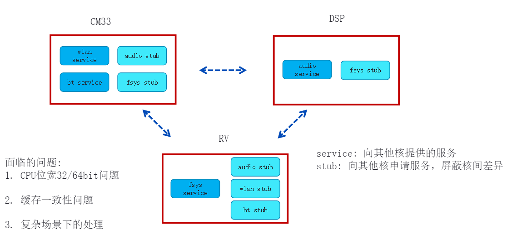
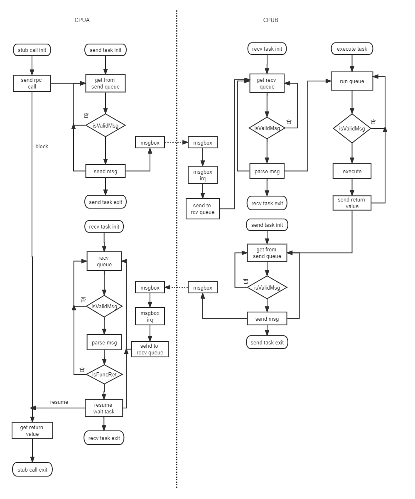
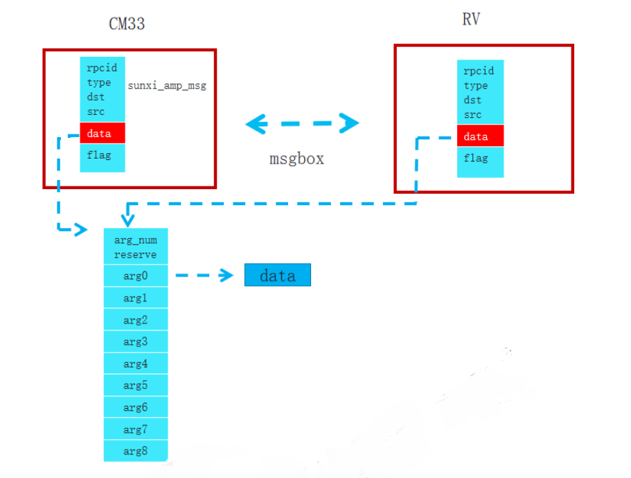
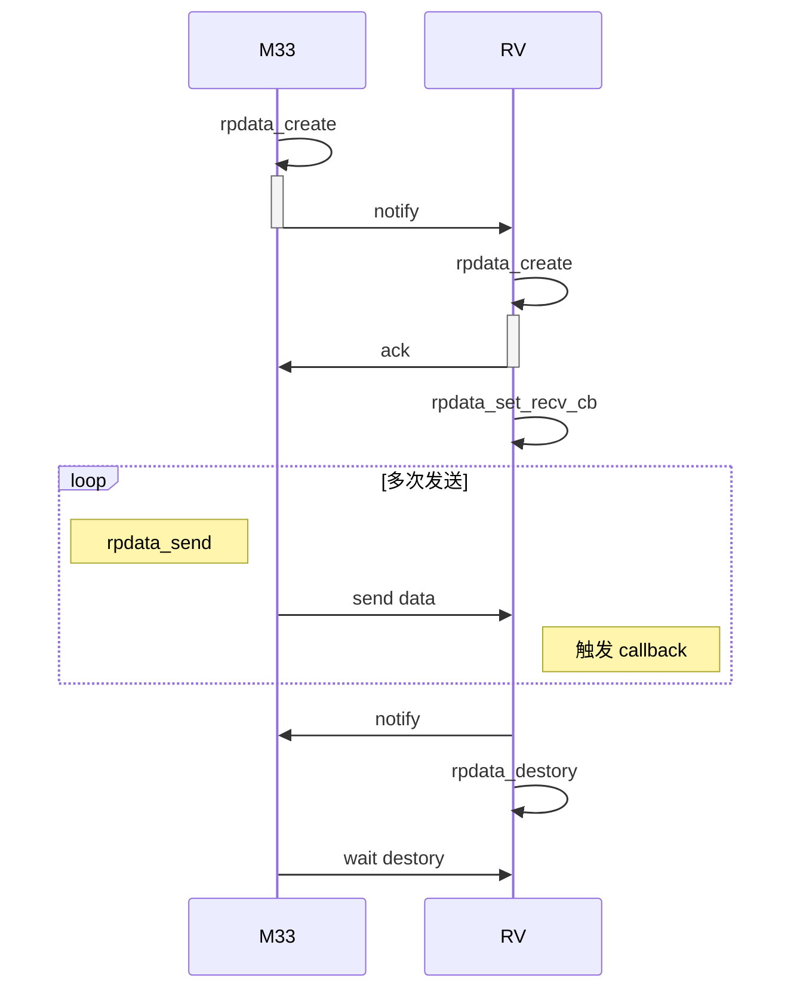

# RTOS 异构多核通信

## 异构多核通信介绍

R128 所带有的 M33 主核心与 C906, HIFI5 DSP 核心是完全不同的核心，为了最大限度的发挥他们的性能，协同完成某一任务，所以在不同的核心上面运行的系统也各不相同。这些不同架构的核心以及他们上面所运行的软件组合在一起，就成了 AMP 系统 （Asymmetric Multiprocessing System, 异构多处理系统）。

为了多核心协同工作，对于需要异构多核通信框架需要满足以下功能：

1. 隔离核间差异，把一部分服务部署在一个核上，另一部分服务部署在另外的核上，应用层代码只需通过标准接口来申请服务，其对底层服务具体在哪个核上实现无感知。
2. 同一个核，既可作为远程服务端，也可以作为客户端。

针对异构多核系统的特性，在进行远程服务调用时，需要解决以下几个问题：

1. 缓存一致性问题。缓存一致性是在异构多核系统中十分重要的问题，跨核调用者和服务提供者必须知道其使用的 buffer 是否会经过其他核的修改，是否会被其他核读取数据。若被其他核修改，那当前核使用时，需要先无效 buffer 对应的 dcache；若会被其他核读取，则当前核写完数据后，需要将 buffer 对应的 dcache 刷回下一级内存。如此一来，一旦远程服务的参数或返回值比较复杂，那么使用者和服务提供者就需要花大量的精力来理清每个 buffer 的使用关系，极大地增加了他们的负担。并且，为了避免对其他数据造成影响，冲刷 dcache 时也还需要保证其数据独占一个 cacheline，否则会将其他数据误刷。这也会增加处理缓存一致性问题的难度。
2. CPU 位宽不一致问题。在 R128 项目中，HIFI5 的 CPU 位宽为 32bit，C906 的 CPU 位宽为64bit，M33 的 CPU 位宽为 32bit。对于三种不同的核，软件上指针变量、long 类型变量的数据大小并不一致，那么就会导致同一个结构体在不同位宽的核上，其内存布局并不一致，三个核若直接读取则会发生错误。
3. 复杂场景处理问题。在多个核之间，需要考虑到远程服务端的并发处理能力、核间的嵌套调用关系、服务端函数的休眠、如何降低内存使用开销等。这些场景都是需要进行优化处理的，服务端的并发处理能力会影响到跨核远程服务的高效性；核间的嵌套调用以及服务函数的休眠，影响到远程调用服务的稳定性。



为了解决这些问题，提供了 Sunxi-AMP 框架提供异构通讯的接口。同时也提供了 rpdata 实现更加底层的异构通讯

## Sunxi‑AMP 简介

### Sunxi‑AMP 工作流程图



### 线程池

`amp_threadpool.c` 文件中实现了一个简易线程池，在系统启动时创建指定线程数量的线程池，以提升远程消息的处理效率。若处理远程消息较多，无法及时处理，则由动态增加线程池中线程的数量；若消息较少，则动态删除线程池中的线程。初始化时创建的线程数量由 `amp_threadpool.h` 中的 `AMP_THD_POOL_MIN_NUM` 宏来决定，其也表示线程池中至少存在的最小数量的处理线程。`AMP_THD_POOL_MAX_NUM` 表示线程池中能同时存在的处理线程的最大数量。动态新增处理线程的条件是消息接受队列中存在两个或以上的未处理消息并且当前线程池中存活线程数量小于 `AMP_THD_POOL_MAX_NUM`。动态删除处理线程的条件是 (正在处理消息的线程的数量 * 2) 小于系统中存活线程数量并且当前线程池中存活线程数量大于 `AMP_THD_POOL_MAX_NUM`。

### 远程调用实现方式

Sunxi‑AMP 目前支持 1 种远程跨核调用实现方式：

- 参数指针传递：将远程跨核调用服务参数的指针或者数据值进行直接传递。如果参数是指针类型，则直接传递该指针；如果参数是数值，则直接传递该数值。参数指针传递比较适合参数结构体简单、核间数据传递量大的场景。其缺点是处理缓存一致性比较麻烦。

直接通过指针来传递参数及返回值，数据传递过程中可以免于拷贝，消耗内存较少，性能较高。

以 `setConfig(struct config *data)` 函数为例，在发起 `setConfig` 远程调用时，会创建一个`sunxi_amp_msg_args` 结构体，会将 `setConfig` 的参数依次设置到 `sunxi_amp_msg_args` 的 `args` 数组中，然后将 `sunxi_amp_msg` 的 `data` 字段设置为 `sunxi_amp_msg_args` 结构体地址。通过 `msgbox` 将`sunxi_amp_msg` 发送给另外的一个核后，另外一个核重新组装 `sunxi_map_msg`，即可拿到参数数据。



### Sunxi‑AMP 数据结构

#### 消息结构

`sunxi_amp_msg` 结构体表示通过 `msgbox` 传输的消息内容，Sunxi‑AMP 远程跨核调用框架基于`sunxi_amp_msg` 消息来完成各种功能。一个完整的 `sunxi_amp_msg`，包含以下字段，总共 12字节。

```c
typedef struct _sunxi_amp_msg_t
{
    uint32_t rpcid: 16; // 远程调用 ID 值，高 8 位表示 service id，低 8 位表示 function id
    uint32_t prio: 5;   // 发送端任务优先级
    uint32_t type: 5;   // 消息类型
    uint32_t src: 3;    // 源地址，即表示从哪个核发出的消息
    uint32_t dst: 3;    // 目的地址，即表示该消息发送到哪个核上
    uint32_t data;      // 消息数据
    uint32_t flags;     // 消息标识，当前设置为线程句柄，用于在远程调用堵塞等待时唤醒该线程
} sunxi_amp_msg;
```

其中远程调用的 ID 分为两个部分，高 8 位表示远程服务组 ID，低 8 位表示某个远程服务组中的 `function ID`，也就是最多支持 256 个远程服务组，每个远程服务组最多支持 256 个远程调用。下面以 FSYS 文件系统服务为例，介绍 `rpcid` 的组成及其计算方法。

```c
#define RPCCALL_FSYS(y) (RPCNO(RPCNO_FSYS, RPCHandler_FSYS_t, y) | (RPCSERVICE_FSYS_DIR << 29) | SELF_DIRECTION << 26)
```

- `RPCCALL_FSYS(y)` 宏会自动计算 `rpcid` 以及 `src`, `dst` 三个字段的值。
- `RPCSERVICE_FSYS_DIR` 表示 `FSYS` 服务所在的核，它用来设置 `dst` 字段。
- `SELF_DIRECTION` 表示当前所在的核，用于设置 src 字段。
- `RPCNO(RPCNO_FSYS`, `RPCHandler_FSYS_t, y)` 用于计算 `rpcid`。其中，`RPCNO_FSYS` 计算出 `service ID`，放置于高 8 位，`RPCNO` 计算出 `function ID`，放置于低 8 位。

#### 消息类型

```c
MSG_SERIAL_FUNC_CALL   // 序列化远程服务调用
MSG_SERIAL_FUNC_RET    // 序列化远程服务返回值
MSG_SERIAL_FREE_BUFFER // 序列化远程服务释放内存
MSG_DIRECT_FUNC_CALL   // 参数指针传递远程服务调用
MSG_DIRECT_FUNC_RET    // 参数指针传递远程服务返回值
```

#### 指针传递远程调用时的参数结构体

`sunxi_amp_msg_args` 用来表示使用指针传递远程调用时的参数信息，`sunxi_amp_msg_args` 结构体的地址会被设置到 `sunxi_amp_msg` 的 `data` 字段进行传递。

```c
typedef struct _sunxi_amp_msg_args_t
{
    uint32_t args_num: 8;
    uint32_t reserved;
    uint32_t args[SUNXI_AMP_MAX_ARGS_NUM];
} sunxi_amp_msg_args;
```

#### 远程调用服务的服务函数表

`sunxi_amp_func_table` 用来表示远程调用服务的服务函数表。`args_num` 表示该服务的参数个数，`return_type` 表示该服务的返回值类型，`func` 表示服务函数指针。

```c
typedef struct _sunxi_amp_func_table
{
    uint32_t args_num: 8;
    uint32_t return_type: 8;
    sunxi_amp_service_func func;
} sunxi_amp_func_table;
```

## Sunxi-AMP 源码结构

```c
├── amp_core.c            # Sunxi‑AMP 核心处理代码，包含消息解析等
├── amp_msgbox.c          # Sunxi‑AMP msgbox 对接封装
├── amp_service.c         # 远程服务数组
├── amp_stub.c            # 触发远程服务的钩子函数
├── amp_test.c            # Sunxi‑AMP 单核测试文件
├── amp_threadpool.c      # Sunxi‑AMP 线程池
├── amp_threadpool.h      # 线程池头文件
├── Kconfig               # 配置文件
├── Makefile
├── msgbuffer.c           # 对接 erpc 实现的源码，已废弃
├── msgbuffer.h
├── service               # 已支持的远程调用服务
│   ├── audio             # 音频远程调用服务
│   ├── bt                # 蓝牙远程调用服务
│   ├── demo              # erpc 测试用例
│   ├── flashc            # flashc驱动远程调用服务
│   ├── fsys              # 文件系统远程调用服务
│   ├── misc              # 杂项远程调用服务，主要用于操作命令传递之类的场景
│   ├── net               # wifi 网络远程调用服务
│   ├── pm                # 休眠唤醒远程调用服务
│   ├── rpcconsole        # 控制台远程调用服务
│   ├── rpdata            # 远程数据获取调用服务，用于屏蔽复杂操作，使开发者仅关心数据获取及发送
│   └── tfm               # 安全系统远程调用服务
├── sunxi_amp.h
├── sunxi_amp_msg.h
├── sunxi_amp_status.h
├── sunxi_amp_table.h
└── tests                 # 多核通信压力测试
	└── test_stress.c
```

### 模块配置

M33 与 C906

```
System components ‑‑‑>
    aw components ‑‑‑>
        AMP Components Support ‑‑‑>
            [*] Tina RTOS AMP                    # 使能 Sunxi‑AMP 组件
            [*] AMP Funcall Thread               # 使能通过任务处理函数调用
            [*] AMP Funcall ThreadPool           # 使能线程池
            [*] AMP Change Service Task Priority # 使能优先级传递
```

## Sunxi-AMP 接口说明

头文件

```c
#include <sunxi_amp.h>
```

### 远程调用服务函数结构体

```c
typedef struct
{
    sunxi_amp_func_table *RPCHandler_FSYS;
    sunxi_amp_func_table *RPCHandler_NET;
    sunxi_amp_func_table *RPCHandler_BT;
    sunxi_amp_func_table *RPCHandler_DEMO;
    sunxi_amp_func_table *RPCHandler_ARM_CONSOLE;
    sunxi_amp_func_table *RPCHandler_DSP_CONSOLE;
    sunxi_amp_func_table *RPCHandler_RV_CONSOLE;
    sunxi_amp_func_table *RPCHandler_PMOFM33;
    sunxi_amp_func_table *RPCHandler_PMOFRV;
    sunxi_amp_func_table *RPCHandler_PMOFDSP;
    sunxi_amp_func_table *RPCHandler_FLASHC;
    sunxi_amp_func_table *RPCHandler_M33_MISC;
    sunxi_amp_func_table *RPCHandler_RV_MISC;
    sunxi_amp_func_table *RPCHandler_DSP_MISC;
    sunxi_amp_func_table *RPCHandler_AUDIO;
    sunxi_amp_func_table *RPCHandler_RPDATA;
    sunxi_amp_func_table *RPCHandler_TFM;
} RPCHandler_RPCT_t;
```

### AMP 信息结构体

```c
typedef struct _sunxi_amp_info_t
{
    QueueHandle_t send_queue; /*send to remote processor */
    QueueHandle_t recv_queue; /*receive from remote processor */
    TaskHandle_t  sendTask;   /*send to remote processor */
    TaskHandle_t  recvTask;   /*receive from remote processor */
    struct msg_endpoint sedp_arm;
    struct msg_endpoint sedp_rv;
    struct msg_endpoint sedp_dsp;
    sunxi_amp_wait wait;
    QueueHandle_t amp_msg_heap_mutex;
} sunxi_amp_info;
```

### AMP 消息结构体

```c
typedef struct _sunxi_amp_msg_t
{
    uint32_t rpcid: 16;
    uint32_t prio: 5;
    uint32_t type: 5;
    uint32_t src: 3;
    uint32_t dst: 3;
    uint32_t data;
    uint32_t flags;
} __attribute__((packed)) sunxi_amp_msg;
```

### AMP操作结构体

```c
typedef struct _sunxi_amp_msg_ops
{
    sunxi_amp_msg_func send_to_queue;
    sunxi_amp_msg_func send_to_dev;
    sunxi_amp_msg_func receive_from_dev;
    sunxi_amp_dev_init init;
} sunxi_amp_msg_ops;
```

### AMP 消息类型枚举

```c
enum MSG_TYPE
{
    MSG_SERIAL_FUNC_CALL = 0,
    MSG_SERIAL_FUNC_RET,
    MSG_SERIAL_FREE_BUFFER,
    MSG_DIRECT_FUNC_CALL,
    MSG_DIRECT_FUNC_RET,
    MSG_TYPE_NUM,
};
```

### AMP 消息返回值枚举

```c
enum FUNC_RETURN_TYPE
{
    RET_NULL = 0,
    RET_POINTER,
    RET_NUMBER_32,
    RET_NUMBER_64,
};
```

### AMP 消息发送方向枚举

```c
enum RPC_MSG_DIRECTION
{
    RPC_MSG_DIR_UNKNOWN = 0,
    RPC_MSG_DIR_CM33 = 1,
    RPC_MSG_DIR_RV,
    RPC_MSG_DIR_DSP,
};
```

### AMP 消息参数

```c
typedef struct _sunxi_amp_msg_args_t
{
    uint32_t args_num: 8;
    uint32_t reserved;
    uint32_t args[SUNXI_AMP_MAX_ARGS_NUM];
} __attribute__((packed)) sunxi_amp_msg_args;
```

### AMP 函数表结构体

```c
typedef struct _sunxi_amp_func_table
{
    uint32_t args_num: 8;
    uint32_t return_type: 8;
    sunxi_amp_service_func func;
} sunxi_amp_func_table;
```

### 获取 AMP 系统信息

函数原型

```c
sunxi_amp_info *get_amp_info(void);
```

参数：

- 无

返回值：

- sunxi_amp_info 结构体

### AMP发送消息

函数原型

```c
int hal_amp_msg_send(sunxi_amp_msg *msg);
```

参数：

- msg：消息结构体

返回值：

- 0：成功
- -1：失败

### 获取 AMP 操作

函数原型

```c
sunxi_amp_msg_ops *get_msg_ops(void);
```

参数：

- 无

返回值：

- sunxi_amp_msg_ops：操作结构体

### AMP接收消息

函数原型

```c
int hal_amp_msg_recv(sunxi_amp_msg *msg);
```

参数：

- msg：消息结构体

返回值：

- 0：成功
- -1：失败

### 发起远程函数调用

函数原型

```c
unsigned long func_stub(uint32_t id, int haveRet, int stub_args_num, void *stub_args[]);
```

参数：

- id : 远程服务函数的 ID 值
- haveRet ：是否存在返回值，在实际使用中，为了保证函数调用的顺序，该值需为 1
- stub_args_num : 远程服务函数的参数个数
- stub_args : 远程服务函数的参数

返回值：

- 远程服务函数的返回值

### 申请 cacheline 对齐的内存

函数原型

```c
void *amp_align_malloc(int size);
```

参数：

- size : 需要申请的内存大小

返回值：

- 申请的内存地址

### 释放 cacheline 对齐的内存

函数原型

```c
void amp_align_free(void *ptr);
```

参数：

- ptr：需要释放的内存地址

返回值：

- 无

### 申请 AMP 内存

函数原型

```c
void *amp_malloc(int size);
```

参数：

- size : 需要申请的内存大小

返回值：

- 申请的内存地址

### 释放 AMP 内存

函数原型

```c
void amp_free(void *ptr);
```

参数：

- ptr：需要释放的内存地址

返回值：

- 无

## Sunxi-AMP 使用范例

### 添加指针传递调用服务

添加指针传递远程调用服务的流程如下：

1. 可参考 `lichee/rtos‑components/aw/amp/service/fsys/` 远程文件系统服务。在 `lichee/rtos-components/aw/amp/service/` 下创建对应服务的文件夹 `fsys` 以及对应的 `service` 和 `stub` 端源文件，远程文件系统服务中为 `fsys_ser.c` 和 `fsys_stub.c`。可参考 `Makefile` 和 `Kconfig` 添加编译、配置新的远程调用服务

2. 在 `fsys_ser.c` 中创建 `sunxi_amp_func_table` 数组 `fsys_table`

3. 在 `amp_service.c` 中将 `fsys_table` 添加到 `func_table` 数组中

4. 在 `sunxi_amp_table.h` 中添加文件系统远程服务组的结构体 `RPCHandler_FSYS_t`，需要注意的是，`RPCHandler_FSYS_t` 结构体的成员变量需要与 `sunxi_amp`

5. 在 `sunxi_amp.h` 的 `RPCHandler_RPCT_t` 结构体定义中添加 `RPCHandler_FSYS` 指针

6. 在 `sunxi_amp.h` 中定义以下宏

```c
#define RPCNO_FSYS RPCCALL_RPCNO(RPCHandler_FSYS)
#define RPCSERVICE_FSYS_DIR (RPC_MSG_DIR_RV) // 此处需要根据实际部署远程文件系统服务的核而修改
#define RPCCALL_FSYS(y) (RPCNO(RPCNO_FSYS, RPCHandler_FSYS_t, y) | (RPCSERVICE_FSYS_DIR << 28) |
SELF_DIRECTION << 24)
```

**fsys_ser.c**

```c
#include <stdlib.h>
#include <stdio.h>
#include <string.h>
#include <statfs.h>
#include <dirent.h>
#include <unistd.h>
#include <fcntl.h>

#include "sunxi_amp.h"
#include <hal_cache.h>

extern int truncate (const char *__file, __off_t __length);
extern int fstatfs (int __fildes, struct statfs *__buf);

static int _open(const char *name, int nameSize, int flag)
{
    int ret;
    hal_dcache_invalidate((unsigned long)name, nameSize);
    ret = open(name, flag);
    hal_dcache_invalidate((unsigned long)name, nameSize);
    return ret;
}

static int _close(int fd)
{
    return close(fd);
}

static ssize_t _read(int fd, void *buffer, size_t size)
{
    ssize_t ret = -1;
    ret = read(fd, buffer, size);
    hal_dcache_clean((unsigned long)buffer, size);
    return ret;
}

static ssize_t _write(int fd, void *buffer, size_t size)
{
    ssize_t ret = -1;
    hal_dcache_invalidate((unsigned long)buffer, size);
    ret = write(fd, buffer, size);
    hal_dcache_clean((unsigned long)buffer, size);
    return ret;
}

static off_t _lseek(int fd, off_t offset, int whence)
{
    return lseek(fd, offset, whence);
}

static int _stat(const char *path, int pathSize, struct stat *st)
{
    int ret = -1;
    hal_dcache_invalidate((unsigned long)st, sizeof(*st));
    hal_dcache_invalidate((unsigned long)path, pathSize);
    ret = stat(path, st);
    hal_dcache_clean((unsigned long)st, sizeof(*st));
    return ret;
}

static int _fstat(int fd, struct stat *st)
{
    int ret = -1;
    hal_dcache_invalidate((unsigned long)st, sizeof(*st));
    ret = fstat(fd, st);
    hal_dcache_clean((unsigned long)st, sizeof(*st));
    return ret;
}

static int _unlink(const char *path, int pathSize)
{
    int ret = -1;
    hal_dcache_invalidate((unsigned long)path, pathSize);
    ret = unlink(path);
    hal_dcache_invalidate((unsigned long)path, pathSize);
    return ret;
}

static int _rename(const char *old, int oldSize, const char *new, int newSize)
{
    int ret = -1;
    hal_dcache_invalidate((unsigned long)new, newSize);
    hal_dcache_invalidate((unsigned long)old, oldSize);
    ret = rename(old, new);
    hal_dcache_invalidate((unsigned long)old, oldSize);
    hal_dcache_invalidate((unsigned long)new, newSize);
    return ret;
}

static DIR *_opendir(const char *path, int pathSize)
{
    DIR *ret = NULL;
    hal_dcache_invalidate((unsigned long)path, pathSize);
    ret = opendir(path);
    if (ret)
        hal_dcache_clean((unsigned long)ret, sizeof(*ret));
    hal_dcache_invalidate((unsigned long)path, pathSize);
    return ret;
}

static struct dirent *_readdir(DIR *pdir)
{
    struct dirent *ret = NULL;
    ret = readdir(pdir);
    if (ret)
        hal_dcache_clean((unsigned long)ret, sizeof(*ret));
    return ret;
}

static int _closedir(DIR *pdir)
{
    return closedir(pdir);
}

static int _mkdir(const char *name, int nameSize, mode_t mode)
{
    int ret;
    hal_dcache_invalidate((unsigned long)name, nameSize);
    ret = mkdir(name, mode);
    hal_dcache_invalidate((unsigned long)name, nameSize);
    return ret;
}

static int _rmdir(const char *name, int nameSize)
{
    int ret;
    hal_dcache_invalidate((unsigned long)name, nameSize);
    ret = rmdir(name);
    hal_dcache_invalidate((unsigned long)name, nameSize);
    return ret;
}

static int _access(const char *name, int nameSize, int amode)
{
    int ret;
    hal_dcache_invalidate((unsigned long)name, nameSize);
    ret = access(name, amode);
    hal_dcache_invalidate((unsigned long)name, nameSize);
    return ret;
}

static int _truncate(const char *name, int nameSize, off_t length)
{
    int ret;
    hal_dcache_invalidate((unsigned long)name, nameSize);
    ret = truncate(name, length);
    hal_dcache_invalidate((unsigned long)name, nameSize);
    return ret;
}

static int _statfs(const char *name, int nameSize, struct statfs *buf)
{
    int ret = -1;
    hal_dcache_invalidate((unsigned long)name, nameSize);
    ret = statfs(name, buf);
    hal_dcache_clean((unsigned long)buf, sizeof(*buf));
    return ret;
}

static int _fstatfs(int fd, struct statfs *buf)
{
    int ret = -1;
    ret = fstatfs(fd, buf);
    hal_dcache_clean((unsigned long)buf, sizeof(*buf));
    return ret;
}

static int _fsync(int fd)
{
    return fsync(fd);
}

sunxi_amp_func_table fsys_table[] =
{
    {.func = (void *)&_open, .args_num = 3, .return_type = RET_POINTER},
    {.func = (void *)&_close, .args_num = 1, .return_type = RET_POINTER},
    {.func = (void *)&_read, .args_num = 3, .return_type = RET_POINTER},
    {.func = (void *)&_write, .args_num = 3, .return_type = RET_POINTER},
    {.func = (void *)&_lseek, .args_num = 3, .return_type = RET_POINTER},
    {.func = (void *)&_fstat, .args_num = 2, .return_type = RET_POINTER},
    {.func = (void *)&_stat, .args_num = 3, .return_type = RET_POINTER},
    {.func = (void *)&_unlink, .args_num = 2, .return_type = RET_POINTER},
    {.func = (void *)&_rename, .args_num = 4, .return_type = RET_POINTER},
    {.func = (void *)&_opendir, .args_num = 2, .return_type = RET_POINTER},
    {.func = (void *)&_readdir, .args_num = 1, .return_type = RET_POINTER},
    {.func = (void *)&_closedir, .args_num = 1, .return_type = RET_POINTER},
    {.func = (void *)&_mkdir, .args_num = 3, .return_type = RET_POINTER},
    {.func = (void *)&_rmdir, .args_num = 2, .return_type = RET_POINTER},
    {.func = (void *)&_access, .args_num = 3, .return_type = RET_POINTER},
    {.func = (void *)&_truncate, .args_num = 3, .return_type = RET_POINTER},
    {.func = (void *)&_statfs, .args_num = 3, .return_type = RET_POINTER},
    {.func = (void *)&_fstatfs, .args_num = 2, .return_type = RET_POINTER},
    {.func = (void *)&_fsync, .args_num = 1, .return_type = RET_POINTER},
};
```

**fsys_stub.c**

```c
#include <stdlib.h>
#include <stdio.h>
#include <string.h>
#include <reent.h>

#include "sunxi_amp.h"

#include <hal_cache.h>

#ifndef _MAYBE_STATIC
#include <statfs.h>
#include <dirent.h>

#else
struct dirent
{
    int d_ino;          /*!< file number */
    uint8_t d_type;     /*!< not defined in POSIX, but present in BSD and Linux */
#define DT_UNKNOWN  0
#define DT_REG      1
#define DT_DIR      2
    char d_name[256];   /*!< zero-terminated file name */
};

typedef __uint64_t __fsblkcnt_t;

struct statfs
{
    uint32_t f_type;
    uint32_t f_bsize;
    __fsblkcnt_t f_blocks;
    __fsblkcnt_t f_bfree;
    __fsblkcnt_t f_bavail;
    __fsfilcnt_t f_files;
    __fsfilcnt_t f_ffree;
};

typedef struct
{
    uint16_t dd_vfs_idx; /*!< VFS index, not to be used by applications */
    uint16_t dd_rsv;     /*!< field reserved for future extension */
    /* remaining fields are defined by VFS implementation */
} DIR;
#endif


MAYBE_STATIC int open(const char *name, int flag, ...)
{
    void *args[3] = {0};
    int ret = -1;
    int nameSize = strlen(name) + 1;
    char *align_name = amp_align_malloc(nameSize);
    if (!align_name)
    {
        return -1;
    }
    memset(align_name, 0, nameSize);
    memcpy(align_name, name, nameSize);
    args[0] = align_name;
    args[1] = (void *)(unsigned long)nameSize;
    args[2] = (void *)(unsigned long)flag;
    hal_dcache_clean((unsigned long)align_name, nameSize);
    ret = func_stub(RPCCALL_FSYS(open), 1, ARRAY_SIZE(args), args);
    amp_align_free(align_name);
    return ret;
}

MAYBE_STATIC int close(int fd)
{
    void *args[1] = {0};
    args[0] = (void *)(unsigned long)fd;
    return func_stub(RPCCALL_FSYS(close), 1, ARRAY_SIZE(args), args);
}

MAYBE_STATIC ssize_t read(int fd, void *buffer, size_t size)
{
    void *args[3] = {0};
    ssize_t ret = -1;
    args[0] = (void *)(unsigned long)fd;
    args[1] = buffer;
    args[2] = (void *)(unsigned long)size;
    if (fd < 3)
    {
        return _read_r(_REENT, fd, buffer, size);
    }
    hal_dcache_invalidate((unsigned long)buffer, size);
    ret = func_stub(RPCCALL_FSYS(read), 1, ARRAY_SIZE(args), args);
    hal_dcache_invalidate((unsigned long)buffer, size);
    return ret;
}

MAYBE_STATIC ssize_t write(int fd, void *buffer, size_t size)
{
    void *args[3] = {0};
    args[0] = (void *)(unsigned long)fd;
    args[1] = buffer;
    args[2] = (void *)(unsigned long)size;
    if (fd < 3)
    {
        return _write_r(_REENT, fd, buffer, size);
    }
    hal_dcache_clean((unsigned long)buffer, size);
    return func_stub(RPCCALL_FSYS(write), 1, ARRAY_SIZE(args), args);
}

MAYBE_STATIC off_t lseek(int fd, off_t offset, int whence)
{
    void *args[3] = {0};
    args[0] = (void *)(unsigned long)fd;
    args[1] = (void *)(unsigned long)offset;
    args[2] = (void *)(unsigned long)whence;
    return func_stub(RPCCALL_FSYS(lseek), 1, ARRAY_SIZE(args), args);
}

#ifndef _MAYBE_STATIC
MAYBE_STATIC int fstat(int fd, struct stat *st)
{
    void *args[2] = {0};
    int ret = -1;
    struct stat *st_align = amp_align_malloc(sizeof(*st));
    if (!st_align)
    {
        return -1;
    }
    memset(st_align, 0, sizeof(*st));
    args[0] = (void *)(unsigned long)fd;
    args[1] = st_align;
    hal_dcache_clean((unsigned long)st_align, sizeof(struct stat));
    ret = func_stub(RPCCALL_FSYS(fstat), 1, ARRAY_SIZE(args), args);
    hal_dcache_invalidate((unsigned long)st_align, sizeof(struct stat));
    memcpy(st, st_align, sizeof(struct stat));
    amp_align_free(st_align);
    return ret;
}

MAYBE_STATIC int stat(const char *path, struct stat *st)
{
    void *args[3] = {0};
    int ret = -1;
    int pathSize = strlen(path) + 1;
    char *align_path = amp_align_malloc(pathSize);
    if (!align_path)
    {
        return -1;
    }
    memset(align_path, 0, pathSize);
    memcpy(align_path, path, pathSize);
    struct stat *st_align = amp_align_malloc(sizeof(*st));
    if (!st_align)
    {
        amp_align_free(align_path);
        return -1;
    }
    memset(st_align, 0, sizeof(*st));

    args[0] = align_path;
    args[1] = (void *)(unsigned long)pathSize;
    args[2] = st_align;

    hal_dcache_clean((unsigned long)align_path, pathSize);
    hal_dcache_clean((unsigned long)st_align, sizeof(struct stat));

    ret = func_stub(RPCCALL_FSYS(stat), 1, ARRAY_SIZE(args), args);

    hal_dcache_invalidate((unsigned long)st_align, sizeof(struct stat));
    memcpy(st, st_align, sizeof(struct stat));
    amp_align_free(st_align);
    amp_align_free(align_path);
    return ret;
}
#endif

MAYBE_STATIC int unlink(const char *path)
{
    void *args[2] = {0};
    int ret = -1;
    int pathSize = strlen(path) + 1;
    char *align_path = amp_align_malloc(pathSize);
    if (!align_path)
    {
        return -1;
    }
    memset(align_path, 0, pathSize);
    memcpy(align_path, path, pathSize);
    args[0] = align_path;
    args[1] = (void *)(unsigned long)pathSize;
    hal_dcache_clean((unsigned long)align_path, pathSize);
    ret = func_stub(RPCCALL_FSYS(unlink), 1, ARRAY_SIZE(args), args);
    amp_align_free(align_path);
    return ret;
}

#ifndef _MAYBE_STATIC
MAYBE_STATIC int rename(const char *old, const char *new)
{
    void *args[4] = {0};
    int ret = -1;
    int oldSize = strlen(old) + 1;
    int newSize = strlen(new) + 1;
    char *align_old = amp_align_malloc(oldSize);
    if (!align_old)
    {
        return -1;
    }
    char *align_new = amp_align_malloc(newSize);
    if (!align_new)
    {
        amp_align_free(align_old);
        return -1;
    }
    memset(align_new, 0, newSize);
    memcpy(align_new, new, newSize);
    memset(align_old, 0, oldSize);
    memcpy(align_old, old, oldSize);

    args[0] = align_old;
    args[1] = (void *)(unsigned long)oldSize;
    args[2] = align_new;
    args[3] = (void *)(unsigned long)newSize;
    hal_dcache_clean((unsigned long)align_old, oldSize);
    hal_dcache_clean((unsigned long)align_new, newSize);
    ret = func_stub(RPCCALL_FSYS(rename), 1, ARRAY_SIZE(args), args);
    amp_align_free(align_old);
    amp_align_free(align_new);
    return ret;
}
#endif

MAYBE_STATIC DIR *opendir(const char *path)
{
    DIR *ret = NULL;
    void *args[2] = {0};
    int pathSize = strlen(path) + 1;
    char *align_path = amp_align_malloc(pathSize);
    if (!align_path)
    {
        return NULL;
    }
    memset(align_path, 0, pathSize);
    memcpy(align_path, path, pathSize);
    args[0] = align_path;
    args[1] = (void *)(unsigned long)pathSize;
    hal_dcache_clean((unsigned long)align_path, pathSize);
    ret = (void *)func_stub(RPCCALL_FSYS(opendir), 1, ARRAY_SIZE(args), args);
    if (ret)
    {
        hal_dcache_invalidate((unsigned long)ret, sizeof(*ret));
    }
    amp_align_free(align_path);
    return ret;
}

MAYBE_STATIC struct dirent *readdir(DIR *pdir)
{
    struct dirent *ent = NULL;
    void *args[1] = {0};
    args[0] = pdir;
    hal_dcache_clean((unsigned long)pdir, sizeof(*pdir));
    ent = (void *)func_stub(RPCCALL_FSYS(readdir), 1, ARRAY_SIZE(args), args);
    if (ent)
    {
        hal_dcache_invalidate((unsigned long)ent, sizeof(*ent));
    }
    return ent;
}

MAYBE_STATIC int closedir(DIR *pdir)
{
    void *args[1] = {0};
    args[0] = pdir;
    hal_dcache_clean((unsigned long)pdir, sizeof(*pdir));
    return func_stub(RPCCALL_FSYS(closedir), 1, ARRAY_SIZE(args), args);
}

#ifndef _MAYBE_STATIC
MAYBE_STATIC int mkdir(const char *name, mode_t mode)
{
    void *args[3] = {0};
    int ret = -1;
    int nameSize = strlen(name) + 1;
    char *align_name = amp_align_malloc(nameSize);
    if (!align_name)
    {
        return -1;
    }
    memset(align_name, 0, nameSize);
    memcpy(align_name, name, nameSize);
    args[0] = align_name;
    args[1] = (void *)(unsigned long)nameSize;
    args[2] = (void *)(unsigned long)mode;
    hal_dcache_clean((unsigned long)align_name, nameSize);
    ret = func_stub(RPCCALL_FSYS(mkdir), 1, ARRAY_SIZE(args), args);
    amp_align_free(align_name);
    return ret;
}
#endif

MAYBE_STATIC int rmdir(const char *name)
{
    void *args[2] = {0};
    int ret = -1;
    int nameSize = strlen(name) + 1;
    char *align_name = amp_align_malloc(nameSize);
    if (!align_name)
    {
        return -1;
    }
    memset(align_name, 0, nameSize);
    memcpy(align_name, name, nameSize);
    args[0] = align_name;
    args[1] = (void *)(unsigned long)nameSize;
    hal_dcache_clean((unsigned long)align_name, nameSize);
    ret = func_stub(RPCCALL_FSYS(rmdir), 1, ARRAY_SIZE(args), args);
    amp_align_free(align_name);
    return ret;
}

MAYBE_STATIC int access(const char *name, int amode)
{
    void *args[3] = {0};
    int ret = -1;
    int nameSize = strlen(name) + 1;
    char *align_name = amp_align_malloc(nameSize);
    if (!align_name)
    {
        return -1;
    }
    memset(align_name, 0, nameSize);
    memcpy(align_name, name, nameSize);
    args[0] = align_name;
    args[1] = (void *)(unsigned long)nameSize;
    args[2] = (void *)(unsigned long)amode;
    hal_dcache_clean((unsigned long)align_name, nameSize);
    ret = func_stub(RPCCALL_FSYS(access), 1, ARRAY_SIZE(args), args);
    amp_align_free(align_name);
    return ret;
}

MAYBE_STATIC int truncate(const char *name, off_t length)
{
    void *args[3] = {0};
    int ret = -1;
    int nameSize = strlen(name) + 1;
    char *align_name = amp_align_malloc(nameSize);
    if (!align_name)
    {
        return -1;
    }
    memset(align_name, 0, nameSize);
    memcpy(align_name, name, nameSize);
    args[0] = align_name;
    args[1] = (void *)(unsigned long)nameSize;
    args[2] = (void *)(unsigned long)length;
    hal_dcache_clean((unsigned long)align_name, nameSize);
    ret = func_stub(RPCCALL_FSYS(truncate), 1, ARRAY_SIZE(args), args);
    amp_align_free(align_name);
    return ret;
}

MAYBE_STATIC int statfs(const char *path, struct statfs *buf)
{
    void *args[3] = {0};
    int ret = -1;
    int pathSize = strlen(path) + 1;
    char *align_path = amp_align_malloc(pathSize);
    if (!align_path)
    {
        return -1;
    }
    char *align_statfs = amp_align_malloc(sizeof(struct statfs));
    if (!align_statfs)
    {
        amp_align_free(align_statfs);
        return -1;
    }
    memset(align_path, 0, pathSize);
    memcpy(align_path, path, pathSize);
    memset(align_statfs, 0, sizeof(struct statfs));

    args[0] = align_path;
    args[1] = (void *)(unsigned long)pathSize;
    args[2] = align_statfs;

    hal_dcache_clean((unsigned long)align_path, pathSize);
    hal_dcache_clean((unsigned long)align_statfs, sizeof(struct statfs));
    ret = func_stub(RPCCALL_FSYS(statfs), 1, ARRAY_SIZE(args), args);

    hal_dcache_invalidate((unsigned long)align_statfs, sizeof(struct statfs));
    memcpy(buf, align_statfs, sizeof(struct statfs));

    amp_align_free(align_path);
    amp_align_free(align_statfs);
    return ret;
}

MAYBE_STATIC int fstatfs(int fd, struct statfs *buf)
{
    void *args[2] = {0};
    int ret = -1;
    char *align_statfs = amp_align_malloc(sizeof(struct statfs));
    if (!align_statfs)
    {
        return -1;
    }
    args[0] = (void *)(unsigned long)fd;
    args[1] = align_statfs;

    hal_dcache_clean((unsigned long)align_statfs, sizeof(struct statfs));
    ret = func_stub(RPCCALL_FSYS(fstatfs), 1, ARRAY_SIZE(args), args);

    hal_dcache_invalidate((unsigned long)align_statfs, sizeof(struct statfs));
    memcpy(buf, align_statfs, sizeof(struct statfs));

    amp_align_free(align_statfs);
    return ret;
}

MAYBE_STATIC int fsync(int fd)
{
    void *args[1] = {0};
    args[0] = (void *)(unsigned long)fd;

    return func_stub(RPCCALL_FSYS(fsync), 1, ARRAY_SIZE(args), args);
}
```

### RPCLI 跨核终端实现

**rpcconsole_stub.c**

```c
#include <stdio.h>
#include <stdint.h>
#include <string.h>
#include <stdlib.h>
#include <console.h>

#include <sunxi_amp.h>
#include <hal_cache.h>

#define SEND_TO_32BIT (1)
#define SEND_TO_64BIT (2)

struct rpcconsole_arg_t
{
    uint32_t argc;
    uint32_t flag;
    uint64_t argv_64[SUNXI_AMP_SH_MAX_CMD_ARGS];
    uint32_t argv_32[SUNXI_AMP_SH_MAX_CMD_ARGS];
    union
    {
        char *argv_cmd;
        uint64_t argv_cmd_data;
    };
};

static int cmd_rpcconsole(int argc, char **argv)
{
    int ret = -1;
    int i;

    if (argc <= 2)
    {
        printf("Usage: rpccli [arm|dsp|rv] commandname [arg0 ...] \n");
        return -1;
    }
    if (argc > SUNXI_AMP_SH_MAX_CMD_ARGS)
    {
        printf("maximum number of arg:%d\n", SUNXI_AMP_SH_MAX_CMD_ARGS);
        return -1;
    }

    struct rpcconsole_arg_t *rpc_arg = amp_align_malloc(sizeof(struct rpcconsole_arg_t));
    if (rpc_arg == NULL)
    {
        printf("Alloc memory failed!\n");
        return -1;
    }
    memset(rpc_arg, 0, sizeof(struct rpcconsole_arg_t));

    char *rpc_args_cmd = amp_align_malloc(SH_MAX_CMD_LEN);
    if (rpc_args_cmd == NULL)
    {
        printf("Alloc memory failed!\n");
        amp_align_free(rpc_arg);
        return -1;
    }
    memset(rpc_args_cmd, 0, SH_MAX_CMD_LEN);

    rpc_arg->argv_cmd = rpc_args_cmd;
    rpc_arg->argc = argc - 2;

    for (i = 2; i < argc; i++)
    {
        rpc_arg->argv_32[i - 2] = (uint32_t)(unsigned long)rpc_args_cmd;
        rpc_arg->argv_64[i - 2] = (uint32_t)(unsigned long)rpc_args_cmd;
        memcpy(rpc_args_cmd, argv[i], strlen(argv[i]));
        rpc_args_cmd += ALIGN_UP((strlen(argv[i]) + 1), 4);
    }

    void *args[1] = {0};
    args[0] = rpc_arg;

    if (!strcmp("arm", argv[1]))
    {
        rpc_arg->flag = SEND_TO_32BIT;
        hal_dcache_clean((unsigned long)rpc_arg, sizeof(*rpc_arg));
        hal_dcache_clean((unsigned long)rpc_arg->argv_cmd, SH_MAX_CMD_LEN);

        ret = func_stub(RPCCALL_ARM_CONSOLE(exe_cmd), 1, 1, (void *)&args);
    }
    else if (!strcmp("dsp", argv[1]))
    {
        rpc_arg->flag = SEND_TO_32BIT;
        hal_dcache_clean((unsigned long)rpc_arg, sizeof(*rpc_arg));
        hal_dcache_clean((unsigned long)rpc_arg->argv_cmd, SH_MAX_CMD_LEN);

        ret = func_stub(RPCCALL_DSP_CONSOLE(exe_cmd), 1, 1, (void *)&args);
    }
    else if (!strcmp("rv", argv[1]))
    {
        rpc_arg->flag = SEND_TO_64BIT;
        hal_dcache_clean((unsigned long)rpc_arg, sizeof(*rpc_arg));
        hal_dcache_clean((unsigned long)rpc_arg->argv_cmd, SH_MAX_CMD_LEN);

        ret = func_stub(RPCCALL_RV_CONSOLE(exe_cmd), 1, 1, (void *)&args);
    }

    amp_align_free(rpc_arg->argv_cmd);
    amp_align_free(rpc_arg);

    return ret;
}
FINSH_FUNCTION_EXPORT_CMD(cmd_rpcconsole, rpccli, exe);
```

**rpcconsole_ser.c**

```c
#include <stdio.h>
#include <stdint.h>
#include <string.h>
#include <stdlib.h>
#include <console.h>
#include <barrier.h>

#include <sunxi_amp.h>
#include <hal_cache.h>

#define SEND_TO_32BIT (1)
#define SEND_TO_64BIT (2)

struct rpcconsole_arg_t
{
    uint32_t argc;
    uint32_t flag;
    uint64_t argv_64[SUNXI_AMP_SH_MAX_CMD_ARGS];
    uint32_t argv_32[SUNXI_AMP_SH_MAX_CMD_ARGS];
    union
    {
        char *argv_cmd;
        uint64_t argv_cmd_data;
    };
};

static int _execute_cmd(struct rpcconsole_arg_t *rpc_arg)
{
    char *command_name;
    struct finsh_syscall *call;
    int ret = -1;

    hal_dcache_invalidate((unsigned long)rpc_arg, (unsigned long)sizeof(*rpc_arg));
#ifndef CONFIG_ARCH_DSP
    dsb();
    isb();
#endif
    hal_dcache_invalidate((unsigned long)rpc_arg->argv_cmd, SH_MAX_CMD_LEN);

    if (rpc_arg->flag == SEND_TO_32BIT) {
        command_name = (char *)(unsigned long)(rpc_arg->argv_32[0]);
    } else {
        command_name = (char *)(unsigned long)(rpc_arg->argv_64[0]);
    }

    call = finsh_syscall_lookup(command_name);
    if (call == NULL || call->func == NULL)
    {
        printf("The command(%s) no exist !\n", command_name);
        return -1;
    }

    if (rpc_arg->flag == SEND_TO_32BIT) {
        ret = call->func(rpc_arg->argc, (char **)(unsigned long)rpc_arg->argv_32);
    } else {
        ret = call->func(rpc_arg->argc, (char **)(unsigned long)rpc_arg->argv_64);
    }
    hal_dcache_invalidate((unsigned long)rpc_arg, (unsigned long)sizeof(*rpc_arg));
    hal_dcache_invalidate((unsigned long)rpc_arg->argv_cmd, SH_MAX_CMD_LEN);
    return ret;
}

sunxi_amp_func_table console_table[] =
{
    {.func = (void *)&_execute_cmd, .args_num = 1, .return_type = RET_POINTER},
};
```

## Sunxi‑AMP 注意事项

1. 注意多核通信时的数据 `Buffer` 的起始地址和长度，起始地址要求按照系统中最大的 `CacheLine（64B）`对齐，长度要求数据 `Buffer` 独占 `CacheLine`，不允许和其他数据共享 `CacheLine`。
2. 如果在远程调用过程中，需要将内存数据传递给另外的 CPU 处理器，在执行远程函数调用前需要调用 `hal_dcache_clean` 将调用核的 `CPU Dcache` 数据刷回内存介质，可以参考 `lichee/rtos‑components/aw/amp/service/flashc/flashc_stub.c` 中的 `nor_write` 函数；如果需要从另外的处理器获取数据，在执行远程函数调用后，需要执行 `hal_dcache_invalidate` 将本地 `CPU Dcache`无效掉，以避免获取旧的历史数据，可以参考`lichee/rtos‑components/aw/amp/service/flashc/flashc_stub.c` 中的 `nor_read` 函数。

3. 注意 `Cache` 的 `Dirty` 位。桩子函数 (`stub` 端) 需要先将传给服务函数 (`service` 端) 的 `buffer` 所对应的 `cacheline` 无效，重点在于清除 `dirty` 位，否则在 `cachelien` 颠簸换出的过程中，可能会导致运行桩子函数所在核将 `buffer` 对应的脏 `cacheline` 换出并回写，覆盖另外一个核刚写的数据。服务函数 (`service` 端) 需要将不再使用的 `buffer` 对应的 `cacheline` 无效掉或者刷回内存，重点在于清除 `dirty` 位，以预防在 `cahcline` 颠簸换出的过程中将 `buffer` 对应的脏 `cacheline` 中的数据回写，此时极有可能篡改另外一个核的数据。

   举例分析：在 `lichee/rtos‑components/aw/amp/service/flashc/flashc_stub.c` 中的 `nor_read` 函数中，核在调用 `func_stub(RPCCALL_FLASHC(nor_read), 1, ARRAY_SIZE(args), args); `之前，需要先调用 `hal_dcache_clean_invalidate((unsigned long)buffer, size); `接口清除 `buffer` 对应`cacheline` 的 `dirty` 位，否则在程序运行中，可能会导致 M33 核的服务函数刚将数据刷回内存，C906 核又因为 `cacheline` 的换出把 `buffer` 的数据给修改了。同理，在 `lichee/rtos‑components/aw/amp/service/flashc/flashc_ser.c` 的 `_nor_write` 函数中，M33 核在调用完 `nor_write` 之后，需要再一次调用 `hal_dcache_invalidate((unsigned long)buf, size);`，因为 `nor_write` 中可能存在修改 `buffer` 数据的可能性，这样的话 `buffer` 对应的 `cacheline` 在 M33核上就是脏的，在 M33 核运行的过程中，极有可能会将脏数据写入内存。而此时，`buffer` 在C906 上可能已被申请释放挪为他用，M33 核将脏数据写回内存就直接篡改了 C906 上运行的正常数据。

4. 当前支持的最大参数个数为 8 个。

5. 64bit 数据在传输过程中一律被截断为 32bit 数据。

6. 不可在中断函数中使用远程调用。

7. 在 `sunxi_amp.h` 中添加 `#define AMP_DEBUG`，则会在关键节点中使能组件的调试信息输出，用于分析远程函数调用错误等问题。

8. 在多个核之间传递同一个结构体时，该结构内部尽量不要使用指针类型，主要的原因在于因三个核位宽不一致，对指针类型的长度理解存在差异，那么就会导致结构体内的数据布局存在差异。当两个不同位宽的 CPU 通过同一个结构体指针指向的地址取值时，就会导致取值错误。如以下例子：

```c
struct test_t {
    char *ptr;
    int offset;
};

struct test_t a;
ptr = &a;                // ptr 为指向 struct test_t 结构体的指针，假设其地址为 0x4000000;

int offset = ptr‑>offset // 在 32bit 系统会去访问 0x4000004;
int offset = ptr‑>offset // 在 64bit 系统会去访问 0x4000008;
```

## RPDATA 核间通讯

为了不同核之间的通信交互，基于硬件 msgbox 功能，软件上提供了 AMP 通信机制，而在该机制上我们提供了 rpdata 接口，让用户可以较容易实现核间通信。

###  rpdata 接口介绍

#### 创建 rpdata

```c
rpdata_t *rpdata_create(int dir, const char *type, const char *name, size_t buf_len)
```

参数：

- dir: 指定远端核。 1:M33; 2:RV; 3:DSP
- type: 类型，传输数据类型，字符串可自定义,类型和名称一起构成唯一标识
- name: 名称，传输数据名称，字符串可自定义,类型和名称一起构成唯一标识
- buf_len: buffer大小，该buffer用于临时保存跨核传输数据

返回值：

- 成功则返回rpdata句柄，失败返回NULL。

> type 和 name 用于标识唯一的传输通道, 可自行设定，长度不超过 16 个字节即可。可以通过 rpd ‑l 命令查看当前已经申请的 rpdata 以及对应的状态。rpdata_create 函数不会阻塞。在创建的时候，可以直接调用。

#### 连接 rpdata

```c
rpdata_t *rpdata_connect(int dir, const char *type, const char *name)
```

参数：

- dir: 指定远端核。 1:M33; 2:RV; 3:DSP
- type: 类型，传输数据类型，字符串可自定义,类型和名称一起构成唯一标识
- name: 名称，传输数据名称，字符串可自定义,类型和名称一起构成唯一标识

返回值：

- 成功则返回rpdata句柄，失败返回NULL。

> rpdata_create 和 rpdata_connect 作用是类似的，但是前者会创建用于传输数据的 buffer，后者不会。因此两核之间通信，必须分别使用这两个接口，而不能共同使用 rpdata_create 或者 rpdata_connect。rpdata_connect 函数会阻塞。如果远核没有调用 rpdata_create，那么就会一直阻塞线程。注意使用 rpdata_connect，如果
需要等待远端线程，请确认该线程是否可以阻塞，不行的话，需要使用线程单独等待。

#### 得到 buffer 的值

```c
void *rpdata_buffer_addr(rpdata_t *rpd)
```

参数：

- rpd: rpdata句柄

返回值：

- buff的值

> 该 buffer 地址可用于保存要传输交互的数据

#### 判断 rpdata 是否为连接状态

```c
int rpdata_is_connect(rpdata_t *rpd)
```

参数：

- rpd: rpdata句柄

返回值：

- 返回0表示为连接状态，非0表示非连接状态

#### 等待 rpdata 变成连接状态

```c
int rpdata_wait_connect(rpdata_t *rpd)
```

参数：

- rpd: rpdata句柄

返回值：

- 成功则返回0，失败返回非0。

> 需要判断等待 rpdata 为连接状态后，才可以开始数据传输。

#### 跨核数据处理

用于发送数据到远端核，并且远端核把处理后数据填充到 buffer

```c
int rpdata_process(rpdata_t *rpd, unsigned int offset, unsigned int data_len)
```

参数：

- rpd: rpdata句柄

- offset: 相对于buffer的偏移

- data_len: 数据量,字节

返回值：

- 成功则返回0，失败返回非0。

> 处理后的结果会存于 buffer 中，即 rpdata_buffer_addr 得到的地址。

#### 跨核数据发送

仅用于发送数据到远端核

```c
int rpdata_send(rpdata_t *rpd, unsigned int offset, unsigned int data_len)
```

参数：

- rpd: rpdata句柄

- offset: 相对于buffer的偏移

- data_len: 数据量,字节

返回值：

- 成功则返回0，失败返回非0。

> rpdata_send 只是把 buffer 中数据发送到远端核，而 rpdata_process 会得到处理后数据

#### 接受跨核传输的数据

```c
int rpdata_recv(rpdata_t *rpd, unsigned int *offset, unsigned int *data_len, int timeout_ms)
```

参数：

- rpd: rpdata句柄

- offset: 得到相对于buffer的偏移

- data_len: 得到数据量,字节

- timeout_ms: 等待超时时间

返回值：

- 成功则返回0，失败返回非0。

> 使用该接口，需要增加 ringbuffer 模式，否则有可能会出现数据覆盖的现象。

#### 设置数据接受回调

```c
int rpdata_set_recv_cb(rpdata_t *rpd, struct rpdata_cbs *cbs)
```

参数：

- rpd: rpdata句柄
- cbs: 回到函数集，当前仅支持recv_cb，即接受回调

返回值：

- 成功则返回0，失败返回非0。

#### 数据接受回调函数

```c
int (recv_cb_t)(rpdata_t rpd, void *data, int data_len)
```

> 注意在该回调用把数据处理好，或者拷贝出来，否则有可能会被下次数据传输覆盖

#### 销毁 rpdata

```c
int rpdata_destroy(rpdata_t *rpd)
```

参数：

- rpd: rpdata句柄

返回值：

- 成功则返回0，失败返回非0。

> 只有两核都调用 rpdata_destroy 才会真正的销毁，但对调用顺序不做要求。

### rpdata 使用流程



1. rpdata_create 和 rpdate_connect 的调用顺序不做要求，谁先执行都可以；但是 rpdata_data 是会创建用于数据交互的 buffer
2. 接受数据端可以选择使用 rpdata_set_recv_cb 设置回调来处理数据，或者调用 rpdata_recv 阻塞等待接受互数据。
3. 两个核的 rpdata_destroy 调用顺序也是不做要求的。

### rpdata 示例

```c
#include <stdio.h>
#include <string.h>
#include <stdlib.h>
#include <unistd.h>

#include <FreeRTOS.h>
#include <task.h>
#include <queue.h>

#include <rpdata.h>
#include <console.h>

#include <hal_time.h>
#include <hal_mem.h>
#include <hal_thread.h>
#include <md5.h>

//#define RECV_CALLBACK_TEST

/* print md5 check result */
static int g_rpd_verbose = 0;

#define configAPPLICATION_RPDATA_DEMO_PRIORITY	\
	(configMAX_PRIORITIES > 20 ? configMAX_PRIORITIES - 8 : configMAX_PRIORITIES - 3)

static void rpdata_demo_usage(void)
{
	printf("Usgae: rpdata_demo [option]\n");
	printf("-h,          rpdata help\n");
	printf("-m,          mode, 0-send; 1-recv; 2-recv+send\n");
	printf("-t,          type, type name\n");
	printf("-n,          name, id name\n");
	printf("             (type + name) specify unique data xfer\n");
	printf("-c,          string, send string\n");
	printf("-i,          single test, do send or recv test once\n");
	printf("-d,          dir, remote processor, 1-cm33;2-c906;3-dsp\n");
	printf("-s,          src dir, valid in mode 2\n");
	printf("\n");
	printf("RV -> DSP\n");
	printf("rpdata_demo -m 0 -d 3 -t RVtoDSP -n RVsendDSPrecv\n");
	printf("rpccli dsp rpdata_demo -m 1 -d 2 -t RVtoDSP -n RVsendDSPrecv\n");
	printf("\n");
	printf("RV -> M33\n");
	printf("rpdata_demo -m 0 -d 1 -t RVtoM33 -n RVsendM33recv\n");
	printf("rpccli arm rpdata_demo -m 1 -d 2 -t RVtoM33 -n RVsendM33recv\n");
	printf("\n");
	printf("RV <- M33\n");
	printf("rpdata_demo -m 1 -d 1 -t M33toRV -n RVrecvM33send\n");
	printf("rpccli arm rpdata_demo -m 0 -d 2 -t M33toRV -n RVrecvM33send\n");
	printf("\n");
	printf("RV -> DSP -> M33\n");
	printf("rpccli dsp rpdata_demo -d 2 -t RVtoDSP -n DSPrecvRVsend -s 1 -t DSPtoM33 -n M33recvDSPsend\n");
	printf("rpccli arm rpdata_demo -m 1 -d 3 -t DSPtoM33 -n M33recvDSPsend\n");
	printf("rpdata_demo -m 0 -d 3 -t RVtoDSP -n DSPrecvRVsend\n");
	printf("\n");
	printf("RV -> DSP -> M33 -> DSP -> RV\n");
	printf("rpccli dsp rpdata_demo -d 2 -t RD -n rs -s 1 -t DM -n ds\n");
	printf("rpccli arm rpdata_demo -d 3 -t DM -n ds -s 3 -t MD -n ms\n");
	printf("rpccli dsp rpdata_demo -d 1 -t MD -n ms -s 2 -t DR -n ds\n");
	printf("rpdata_demo -m 1 -d 3 -t DR -n ds\n");
	printf("rpdata_demo -m 0 -d 3 -t RD -n rs\n");
	printf("\n");
	printf("RV->M33->RV process(M33 do aec process: input mic+ref, and output aec data to RV)\n");
	printf("rpccli arm rpdata_demo -p -m 1 -d 2 -t ALGO -n AEC\n");
	printf("rpdata_demo -p -m 0 -d 1 -t ALGO -n AEC\n");
	printf("\n");
}

struct rpdata_arg_test {
	char type[32];
	char name[32];
	int dir;
	char stype[32];
	char sname[32];
	int sdir;
};

static int do_rpdata_send_test(struct rpdata_arg_test *targ, void *data, uint32_t len)
{
	rpdata_t *rpd;
	void *buffer;
	int ret = -1;

	printf("Cteate %s:%s.\n", targ->type, targ->name);
	rpd = rpdata_create(targ->dir, targ->type, targ->name, len);
	if (!rpd) {
		printf("[%s] line:%d \n", __func__, __LINE__);
		return -1;
	}
#ifndef RECV_CALLBACK_TEST
	rpdata_set_recv_ringbuffer(rpd, 2 * rpdata_buffer_len(rpd));
#endif

	buffer = rpdata_buffer_addr(rpd);
	if (!buffer) {
		printf("[%s] line:%d \n", __func__, __LINE__);
		goto exit;
	}

	memcpy(buffer, data, len);
	rpdata_wait_connect(rpd);
	ret = rpdata_send(rpd, 0, len);
	if (ret != 0) {
		printf("[%s] line:%d \n", __func__, __LINE__);
		goto exit;
	}

exit:
	if (rpd)
		rpdata_destroy(rpd);
	return ret;
}

static int do_rpdata_recv_test(struct rpdata_arg_test *targ, void *data, uint32_t len)
{
	rpdata_t *rpd;
	char *rx_buf;
	int ret = -1;

	rx_buf = hal_malloc(len + 1);
	if (rx_buf == NULL) {
		printf("[%s] line:%d alloc rx buffer fialed.\n", __func__, __LINE__);
		return -1;
	}

	printf("connect to %s:%s.\n", targ->type, targ->name);
	rpd = rpdata_connect(targ->dir, targ->type, targ->name);
	if (!rpd) {
		printf("[%s] line:%d \n", __func__, __LINE__);
		return -1;
	}
#ifndef RECV_CALLBACK_TEST
	rpdata_set_recv_ringbuffer(rpd, 2 * rpdata_buffer_len(rpd));
#endif

	while (1) {
		ret = rpdata_recv(rpd, rx_buf, len, 10000);
		if (ret <= 0) {
			printf("rpdata recv timeout \n");
			goto exit;
		}
		rx_buf[ret] = 0;
		printf("%s, len:%d\n", rx_buf, ret);
		if (!memcmp("quit", rx_buf, 4))
			break;
	}

exit:
	if (rx_buf)
		hal_free(rx_buf);
	if (rpd)
		rpdata_destroy(rpd);
	return ret;
}

static void data_fill(void *buffer, uint32_t len)
{
	int i;
	int data_len = len - 16;

	memset(buffer, 0, len);
	for (i = 0; i < len;) {
		*(int *)(buffer + i) = rand();
		i += sizeof(int);
	}
	md5(buffer, data_len,  buffer + data_len);
}

static int data_check(void *buffer, uint32_t len)
{
	unsigned char res[16];
	int data_len = len - 16;

	md5(buffer, data_len, res);
	if (!memcmp(buffer + data_len, res, 16))
		return 0;
	return -1;
}

static void rpdata_auto_send(void *arg)
{
	struct rpdata_arg_test targ;
	rpdata_t *rpd;
	void *buffer;
	int ret = -1;
	uint32_t len = 512;


	memcpy(&targ, arg, sizeof(struct rpdata_arg_test));
	printf("dir:%d, type:%s, name:%s\n",
		targ.dir, targ.type, targ.name);

	rpd = rpdata_create(targ.dir, targ.type, targ.name, 512);
	if (!rpd) {
		printf("[%s] line:%d \n", __func__, __LINE__);
		goto exit;
	}
#ifndef RECV_CALLBACK_TEST
	rpdata_set_recv_ringbuffer(rpd, 2 * rpdata_buffer_len(rpd));
#endif

	buffer = rpdata_buffer_addr(rpd);
	if (!buffer) {
		printf("[%s] line:%d \n", __func__, __LINE__);
		goto exit;
	}

	rpdata_wait_connect(rpd);
	while (1) {
		data_fill(buffer, len);
		ret = rpdata_send(rpd, 0, len);
		if (ret != 0) {
			printf("[%s] line:%d \n", __func__, __LINE__);
			goto exit;
		}
		hal_msleep(10);
	}

exit:
	if (rpd)
		rpdata_destroy(rpd);
	printf("rpdata auto send test finish\n");
	vTaskDelete(NULL);
}

static int rpd_demo_recv_cb(rpdata_t *rpd, void *data, uint32_t data_len)
{
	static int count = 0;
	if (data_check(data, data_len) < 0) {
		printf("check md5 failed\n");
	}
	if (!g_rpd_verbose)
		return 0;
	if (count++ % g_rpd_verbose == 0)
		printf("check md5 ok(print interval %d)\n", g_rpd_verbose);
	return 0;
}

struct rpdata_cbs rpd_demo_cbs = {
	.recv_cb = rpd_demo_recv_cb,
};

static int rpd_demo_process_cb(rpdata_t *rpd, void *buffer, uint32_t data_len)
{
	void *mic_data, *ref_data, *aec_data;
	uint32_t mic_offset = 128;
	uint32_t ref_offset = 128 + 640;
	uint32_t aec_offset = 128 + 640 + 320;
	uint32_t total_len = 1408;

	/* aec process
	 * input:
	 * params:
	 * simulator: 128bytes
	 * mic data: 2ch+16K+16bit, 10ms, 160*4=640
	 * ref data: 1ch+16K+16bit, 10ms, 160*2=320
	 * outout:
	 * aec data: 1ch+16K+16bit, 10ms, 160*2=320
	 *
	 * total= 128 + 640 + 320 + 320 = 1408
	 * 1408 is cacheline lenght
	 */

	mic_data = buffer + mic_offset;
	ref_data = buffer + ref_offset;
	aec_data = buffer + aec_offset;

	if (data_len != total_len) {
		printf("expected len:%d but:%d\n", total_len, data_len);
		return -1;
	}
	if (data_check(mic_data, ref_data - mic_data) < 0) {
		printf("check mic data md5 failed\n");
	}
	if (data_check(ref_data, aec_data - ref_data) < 0) {
		printf("check ref data md5 failed\n");
	}
	data_fill(aec_data, total_len - aec_offset);
	return 0;
}

struct rpdata_cbs rpd_demo_process_cbs = {
	.recv_cb = rpd_demo_process_cb,
};

static int rpd_demo_recv_and_send_cb(rpdata_t *rpd, void *data, uint32_t data_len)
{
	rpdata_t *rpd_send = NULL;
	void *buffer;
	int ret;

	if (data_check(data, data_len) < 0) {
		printf("[%s] line:%d check md5 failed\n", __func__, __LINE__);
	}
	rpd_send = rpdata_get_private_data(rpd);
	if (!rpd_send)
		return -1;

	buffer = rpdata_buffer_addr(rpd_send);
	memcpy(buffer, data, data_len);
	ret = rpdata_send(rpd_send, 0, data_len);
	if (ret != 0) {
		printf("rpdata_send failed\n");
		return ret;
	}

	return 0;
}

struct rpdata_cbs rpd_demo_rs_cbs = {
	.recv_cb = rpd_demo_recv_and_send_cb,
};

static void rpdata_auto_recv(void *arg)
{
	struct rpdata_arg_test targ;
	rpdata_t *rpd;
	void *rx_buf = NULL;
	int len, ret;

	memcpy(&targ, arg, sizeof(struct rpdata_arg_test));
	printf("dir:%d, type:%s, name:%s\n",
		targ.dir, targ.type, targ.name);

	rpd = rpdata_connect(targ.dir, targ.type, targ.name);
	if (!rpd) {
		printf("[%s] line:%d \n", __func__, __LINE__);
		goto exit;
	}
#ifndef RECV_CALLBACK_TEST
	rpdata_set_recv_ringbuffer(rpd, 2 * rpdata_buffer_len(rpd));
#endif

	len = rpdata_buffer_len(rpd);
	if (len <= 0) {
		printf("[%s] line:%d \n", __func__, __LINE__);
		goto exit;
	}

	rx_buf = hal_malloc(len);
	if (!rx_buf) {
		printf("[%s] line:%d \n", __func__, __LINE__);
		goto exit;
	}

#ifdef RECV_CALLBACK_TEST
	rpdata_set_recv_cb(rpd, &rpd_demo_cbs);
	while (1) {
		hal_msleep(10);
	}
#else
	while (1) {
		ret = rpdata_recv(rpd, rx_buf, len, 10000);
		if (ret <= 0) {
			printf("rpdata recv timeout \n");
			goto exit;
		}
		if (data_check(rx_buf, ret) < 0) {
			printf("check md5 failed\n");
		}
	}
#endif
exit:
	if (rx_buf)
		hal_free(rx_buf);
	if (rpd)
		rpdata_destroy(rpd);
	printf("rpdata auto recv test finish\n");
	vTaskDelete(NULL);
}

static void rpdata_auto_recv_and_send(void *arg)
{
	struct rpdata_arg_test targ;
	rpdata_t *rpd_recv = NULL, *rpd_send = NULL;
	void *buf_recv = NULL, *buf_send = NULL;
	uint32_t len = 512;
	int ret;

	memcpy(&targ, arg, sizeof(struct rpdata_arg_test));
	printf("recv dir:%d, type:%s, name:%s\n",
		targ.dir, targ.type, targ.name);
	printf("send dir:%d, type:%s, name:%s\n",
		targ.sdir, targ.stype, targ.sname);

	rpd_send = rpdata_create(targ.sdir, targ.stype, targ.sname, len);
	if (!rpd_send) {
		printf("[%s] line:%d \n", __func__, __LINE__);
		goto exit;
	}

	buf_send = rpdata_buffer_addr(rpd_send);
	if (!buf_send) {
		printf("[%s] line:%d \n", __func__, __LINE__);
		goto exit;
	}

	rpd_recv = rpdata_connect(targ.dir, targ.type, targ.name);
	if (!rpd_recv) {
		printf("[%s] line:%d \n", __func__, __LINE__);
		goto exit;
	}
#ifndef RECV_CALLBACK_TEST
	rpdata_set_recv_ringbuffer(rpd_recv, 2 * rpdata_buffer_len(rpd_recv));
	rpdata_set_recv_ringbuffer(rpd_send, 2 * rpdata_buffer_len(rpd_send));
#endif

	buf_recv = hal_malloc(len);
	if (!buf_recv) {
		printf("[%s] line:%d \n", __func__, __LINE__);
		goto exit;
	}

	rpdata_wait_connect(rpd_send);
#ifdef RECV_CALLBACK_TEST
	rpdata_set_private_data(rpd_recv, rpd_send);
	rpdata_set_recv_cb(rpd_recv, &rpd_demo_rs_cbs);
	while (1) {
		hal_msleep(10);
	}
#else
	while (1) {
		ret = rpdata_recv(rpd_recv, buf_recv, len, 10000);
		if (ret <= 0) {
			printf("rpdata recv timeout \n");
			goto exit;
		}
		if (data_check(buf_recv, ret) < 0) {
			printf("check md5 failed\n");
		}
		memcpy(buf_send, buf_recv, ret);
		ret = rpdata_send(rpd_send, 0, ret);
		if (ret != 0) {
			printf("rpdata send failed\n");
			goto exit;
		}
	}
#endif
exit:
	if (buf_recv)
		hal_free(buf_recv);
	if (rpd_send)
		rpdata_destroy(rpd_send);
	if (rpd_recv)
		rpdata_destroy(rpd_recv);
	printf("rpdata auto recv_and_send test finish\n");
	vTaskDelete(NULL);
}

static void rpdata_process_send(void *arg)
{
	struct rpdata_arg_test targ;
	rpdata_t *rpd;
	void *buffer;
	int ret = -1;
	uint32_t len;
	void *params, *mic_data, *ref_data, *aec_data;
	uint32_t params_offset = 0;
	uint32_t mic_offset = 128;
	uint32_t ref_offset = 128 + 640;
	uint32_t aec_offset = 128 + 640 + 320;

	/* aec process
	 * input:
	 * params:
	 * simulator: 128bytes
	 * mic data: 2ch+16K+16bit, 10ms, 160*4=640
	 * ref data: 1ch+16K+16bit, 10ms, 160*2=320
	 * outout:
	 * aec data: 1ch+16K+16bit, 10ms, 160*2=320
	 *
	 * total= 128 + 640 + 320 + 320 = 1408
	 * 1408 is cacheline lenght
	 * */
	len = 1408;

	memcpy(&targ, arg, sizeof(struct rpdata_arg_test));
	printf("dir:%d, type:%s, name:%s\n",
		targ.dir, targ.type, targ.name);

	rpd = rpdata_connect(targ.dir, targ.type, targ.name);
	if (!rpd) {
		printf("[%s] line:%d \n", __func__, __LINE__);
		goto exit;
	}
#ifndef RECV_CALLBACK_TEST
	rpdata_set_recv_ringbuffer(rpd, 2 * rpdata_buffer_len(rpd));
#endif

	buffer = rpdata_buffer_addr(rpd);
	if (!buffer) {
		printf("[%s] line:%d \n", __func__, __LINE__);
		goto exit;
	}
	params = buffer + params_offset;
	mic_data = buffer + mic_offset;
	ref_data = buffer + ref_offset;
	aec_data = buffer + aec_offset;

	rpdata_wait_connect(rpd);

	data_fill(params, mic_offset - params_offset);
	data_fill(mic_data, ref_offset - mic_offset);
	data_fill(ref_data, aec_offset - ref_offset);
	memset(aec_data, 0, len - aec_offset);

	ret = rpdata_process(rpd, 0, len);
	if (ret != 0) {
		printf("[%s] line:%d \n", __func__, __LINE__);
		goto exit;
	}

	if (data_check(aec_data, len - aec_offset) < 0) {
		printf("aec data check failed\n");
	} else {
		printf("aec data check ok\n");
	}

exit:
	if (rpd)
		rpdata_destroy(rpd);
	vTaskDelete(NULL);
}

static void rpdata_process_recv(void *arg)
{
	struct rpdata_arg_test targ;
	rpdata_t *rpd;
	uint32_t len;
	void *rx_buf = NULL;
	int ret;

	/* aec process
	 * input:
	 * params:
	 * simulator: 128bytes
	 * mic data: 2ch+16K+16bit, 10ms, 160*4=640
	 * ref data: 1ch+16K+16bit, 10ms, 160*2=320
	 * outout:
	 * aec data: 1ch+16K+16bit, 10ms, 160*2=320
	 *
	 * total= 128 + 640 + 320 + 320 = 1408
	 * 1408 is cacheline lenght
	 * */
	len = 1408;

	memcpy(&targ, arg, sizeof(struct rpdata_arg_test));
	printf("dir:%d, type:%s, name:%s\n",
		targ.dir, targ.type, targ.name);

	rpd = rpdata_create(targ.dir, targ.type, targ.name, len);
	if (!rpd) {
		printf("[%s] line:%d \n", __func__, __LINE__);
		goto exit;
	}
#ifndef RECV_CALLBACK_TEST
	rpdata_set_recv_ringbuffer(rpd, 2 * rpdata_buffer_len(rpd));
#endif

#ifndef RECV_CALLBACK_TEST
	rx_buf = hal_malloc(rpdata_buffer_len(rpd));
	if (!rx_buf) {
		printf("[%s] line:%d \n", __func__, __LINE__);
		goto exit;
	}

	ret = rpdata_recv(rpd, rx_buf, len, 30*1000);
	if (ret <= 0) {
		printf("[%s] : Timeout!\n", __func__);
		goto exit;
	}
	rpd_demo_process_cb(rpd, rx_buf, ret);

#else
	rpdata_set_recv_cb(rpd , &rpd_demo_process_cbs);
	hal_sleep(30);
#endif
exit:
	if (rx_buf)
		hal_free(rx_buf);
	if (rpd)
		rpdata_destroy(rpd);
	printf("rpdata recv process finish\n");
	vTaskDelete(NULL);
}

static int do_rpdata_process_test(struct rpdata_arg_test *targ, int mode)
{
	hal_thread_t handle;

	if (mode == 0)
		handle = hal_thread_create(rpdata_process_send, targ,
				"rpd_send_process", 512, HAL_THREAD_PRIORITY_APP);
	else if (mode == 1)
		handle = hal_thread_create(rpdata_process_recv, targ,
				"rpd_recv_process", 512, HAL_THREAD_PRIORITY_APP);
	return 0;
}

static int do_rpdata_auto_test(struct rpdata_arg_test *targ, int mode)
{
	hal_thread_t handle;

	if (mode == 0)
		handle = hal_thread_create(rpdata_auto_send, targ, "rpd_send_test",
				512, HAL_THREAD_PRIORITY_APP);
	else if (mode == 1)
		handle = hal_thread_create(rpdata_auto_recv, targ, "rpd_recv_test",
				512, HAL_THREAD_PRIORITY_APP);
	else if (mode == 2)
		handle = hal_thread_create(rpdata_auto_recv_and_send, targ, "rpd_rs_test",
				512, HAL_THREAD_PRIORITY_APP);
	return 0;
}

static int check_dir(int dir)
{
	switch (dir) {
	case RPDATA_DIR_CM33:
	case RPDATA_DIR_RV:
	case RPDATA_DIR_DSP:
		return 0;
	default:
		return -1;
	}
}

static int cmd_rpdata_demo(int argc, char *argv[])
{
	int c, mode = 2;
	int single_test = 0, process_test = 0;
	int get_sdir_arg = 0;
	/* string/data must be cache_line align */
	char string[128] = "rpdata test string";
	static struct rpdata_arg_test targ = {
		.type = "RVtoDSP",
		.name = "DSPrecvRVsend",
		.dir  = RPDATA_DIR_DSP,
		.stype = "DSPtoM33",
		.sname = "M33recvDSPsend",
		.sdir  = RPDATA_DIR_CM33,
	};

	optind = 0;
	while ((c = getopt(argc, argv, "hm:t:n:c:s:d:iv:p")) != -1) {
		switch (c) {
		case 'm':
			mode = atoi(optarg);
			break;
		case 't':
			if (!get_sdir_arg)
				strncpy(targ.type, optarg, sizeof(targ.type));
			else
				strncpy(targ.stype, optarg, sizeof(targ.stype));
			break;
		case 'n':
			if (!get_sdir_arg)
				strncpy(targ.name, optarg, sizeof(targ.name));
			else
				strncpy(targ.sname, optarg, sizeof(targ.sname));
			break;
		case 'c':
			strncpy(string, optarg, sizeof(string));
			break;
		case 's':
			targ.sdir = atoi(optarg);
			get_sdir_arg = 1;
			break;
		case 'd':
			targ.dir = atoi(optarg);
			get_sdir_arg = 0;
			break;
		case 'i':
			single_test = 1;
			break;
		case 'v':
			g_rpd_verbose = atoi(optarg);
			return 0;
		case 'p':
			process_test = 1;
			break;
		case 'h':
		default:
			goto usage;
		}
	}

	if (mode != 0 && mode != 1 && mode != 2)
		goto usage;

	if (check_dir(targ.dir) < 0 || check_dir(targ.sdir) < 0)
		goto usage;

	if (process_test) {
		do_rpdata_process_test(&targ, mode);
		return 0;
	}

	if (!single_test) {
		do_rpdata_auto_test(&targ, mode);
		return 0;
	}

	if (mode == 0)
		do_rpdata_send_test(&targ, string, sizeof(string));
	else if (mode == 1)
		do_rpdata_recv_test(&targ, string, sizeof(string));

	return 0;
usage:
	rpdata_demo_usage();
	return -1;
}
FINSH_FUNCTION_EXPORT_CMD(cmd_rpdata_demo, rpdata_demo, rpdata test demo);
```

测试例子：

- rv/dsp之间的收发

rv接受，dsp发送

```
rpdata_demo ‑m 1 ‑d 3 ‑t DSPtoRV ‑n RVrecvDSPsend
rpccli dsp rpdata_demo ‑m 0 ‑d 2 ‑t DSPtoRV ‑n RVrecvDSPsend
```

rv发送，dsp接受

```
rpdata_demo ‑m 0 ‑d 3 ‑t RVtoDSP ‑n RVsendDSPrecv
rpccli dsp rpdata_demo ‑m 1 ‑d 2 ‑t RVtoDSP ‑n RVsendDSPrecv
```

- rv/m33之间收发

rv接受，m33发送

```
rpdata_demo ‑m 1 ‑d 1 ‑t M33toRV ‑n RVrecvM33send
rpccli arm rpdata_demo ‑m 0 ‑d 2 ‑t M33toRV ‑n RVrecvM33send
```

 rv发送，m33接受

```
rpdata_demo ‑m 0 ‑d 1 ‑t RVtoM33 ‑n RVsendM33recv
rpccli arm rpdata_demo ‑m 1 ‑d 2 ‑t RVtoM33 ‑n RVsendM33recv
```

- m33/dsp之间收发

m33接受，dsp发送

```
rpccli arm rpdata_demo ‑m 1 ‑d 3 ‑t DSPtoM33 ‑n M33recvDSPsend
rpccli dsp rpdata_demo ‑m 0 ‑d 1 ‑t DSPtoM33 ‑n M33recvDSPsend
```

 dsp接受，m33发送

```
rpccli dsp rpdata_demo ‑m 1 ‑d 1 ‑t M33toDSP ‑n DSPrecvM33send
rpccli arm rpdata_demo ‑m 0 ‑d 3 ‑t M33toDSP ‑n DSPrecvM33send
```

另外，提供了 rpd 命令用于查看 rpdata 的运行情况：

```
c906>rpd ‑l
‑‑‑‑‑‑‑‑‑‑‑‑‑‑‑‑‑‑‑‑‑‑‑‑‑‑‑‑‑‑‑‑‑‑‑‑‑‑‑‑
RPdata RV <‑‑> CM33
id type+name state
‑‑‑‑‑‑‑‑‑‑‑‑‑‑‑‑‑‑‑‑‑‑‑‑‑‑‑‑‑‑‑‑‑‑‑‑‑‑‑‑
RPdata RV <‑‑> DSP
id type+name state
0x01 DSPtoRV
0x01 └─── RVrecvDSPsend CNXN


c906>rpccli dsp rpd ‑l
‑‑‑‑‑‑‑‑‑‑‑‑‑‑‑‑‑‑‑‑‑‑‑‑‑‑‑‑‑‑‑‑‑‑‑‑‑‑‑‑
RPdata DSP <‑‑> CM33
id type+name state
‑‑‑‑‑‑‑‑‑‑‑‑‑‑‑‑‑‑‑‑‑‑‑‑‑‑‑‑‑‑‑‑‑‑‑‑‑‑‑‑
RPdata DSP <‑‑> RV
id type+name state
0x01 DSPtoRV
0x01 └─── RVrecvDSPsend CNXN
```

