# 音频框架

## 简介

本文档基于 RTOS 平台基础音频框架介绍，能够让使用者在 RTOS 平台开发使用音频驱动，内容分四大部分。

1. 音频时钟树-> 驱动特性-> 音频流通路->sys_config 配置-> 编译配置-> 声卡控件介绍->常见使用方法  等部分，介绍音频驱动的测试验证和使用；
2. 源码结构-> 驱动框架-> 关键数据结构-> 接口说明 等部分，介绍音频驱动的二次开发；
3. 声卡查看-> 声卡测试工具-> 外挂 CODEC 等部分，介绍声卡模块的测试验证和使用；
4. FAQ”章节：调试方法及常见问题汇总。

## 模块介绍

在 sunxi 平台中，从软件上通常存在5 类音频设备，如下：

- AudioCodec
- I2S/PCM
- AHUB
- DMIC
- S/PDIF

以上每一类音频设备均适配ASoC 架构。

对于 R128 平台，具有以下音频接口资源

- AudioCodec x1
- I2S/PCM x1
- S/PDIF x1
- DMIC x1

另外还具有 MAD 模块，用于语音能量检测，非接口类型。

### 驱动框架

RTOS 上面的音频驱动框架与 Linux 上 ASoC 框架的思想比较类似，分为 codec,platform 模型，core 核心层实现具体的 codec 驱动加载、platform 驱动的选择、数据的搬运、dma 指针的更新等，能够将 codec 驱动与 SoC CPU 解耦合, 方便添加外挂 codec。

音频驱动的大致框架如下：

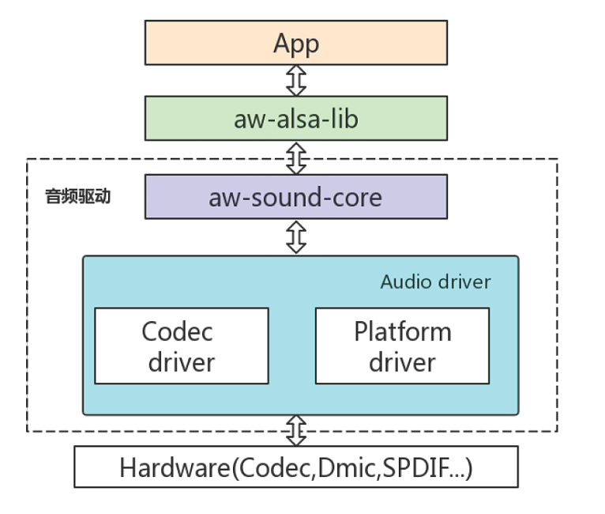

### 音频时钟树

R128 音频模块时钟源有4 个系列，分别为24.576MHz、22.5792MHz、8.192MHz 以及高频时钟。

- 24.576MHz、22.5792MHz 用于 Audiocodec、I2S/PCM 的播放和录音，S/PDIF 的播放，DMIC 的录音；
- 8.192MHz 用于系统休眠时供 Audiocodec、DMIC 录音，以及 mad 模块；
- 高频时钟用于 S/PDIF 的录音，以及 I2S/PCM 的 ASRC 模块；

时钟树如下图所示：


## AudioCodec

### 驱动特性

- 支持多种采样率格式
  - 播放：8~384kHz
  - 录音：8~96kHz
- 支持多通道播放和录音
  - 播放：1~2
  - 录音：1~3
- 支持16/24/32bit 数据精度（硬件支持16/24bit）
- 支持硬件HPF、DRC、EQ 算法
- 支持的物理接口
  - INPUT : MIC
  - OUTPUT: LINEOUT
  - MIC, LINEOUT 支持差分和单端模式
- 支持同时playback 和capture (全双工模式)

### 音频通路

1. 播放流

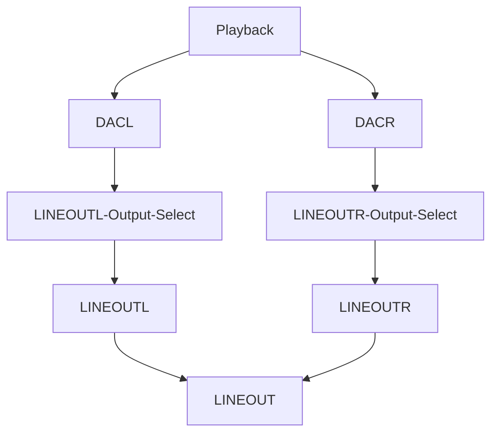

2. 录音流

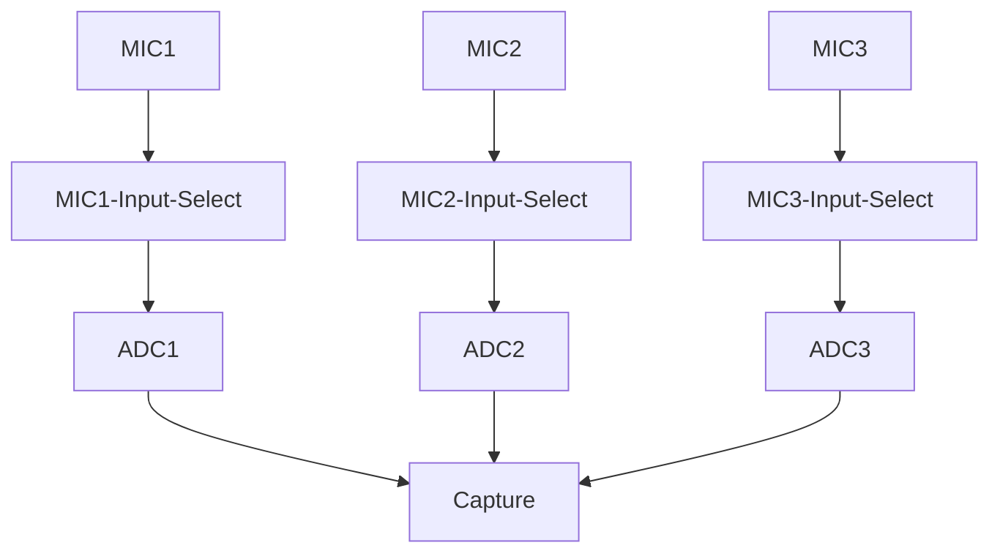

### 驱动配置

驱动配置在 menuconfig 中在下列位置

```
Drivers Options --->
	soc related device drivers --->
		SOUND Devices --->
			[*] Sound card support
				AllWinner CODEC drivers --->
					[*] Allwinner AudioCodec support
						Allwinner AudioCodec Choose --->
						[*] Allwinner AudioCodec DAC Support 
						[*] Allwinner AudioCodec ADC Support
```

其中 `Allwinner AudioCodec DAC Support ` 是 DAC 模块，`Allwinner AudioCodec ADC Support` 是 ADC 模块。

参数配置如下：

```
[audiocodec]
dacl_vol = 129 //dac左声道硬件数字音量
dacr_vol = 129 //dac右声道硬件数字音量
lineout_vol = 5 //lineout硬件数字音量
lineoutl_en = 1 //lineout左声道使能
lineoutr_en = 0 //lineout右声道禁用
adc1_vol = 129 //adc1硬件数字音量
adc2_vol = 129 //adc2硬件数字音量
adc3_vol = 129 //adc3硬件数字音量
mic1_gain = 19 //mic1硬件增益
mic2_gain = 19 //mic2硬件增益
mic3_gain = 0 //mic3硬件增益
mic1_en = 1 //mic1使能
mic2_en = 1 //mic2使能
mic3_en = 1 //mic3使能
mad_bind_en = 0 //mad禁用
pa_pin_msleep = 10 //pa开启延时
pa_pin = port:PB3<1><default><1><1> //pa引脚配置
capture_cma = 30720 //录音最大缓存配置
```

### 声卡控件

声卡控件可以通过 `AudioCodec-DAC` 命令查看。

```c
# AudioCodec-DAC
    Card Name:audiocodecdac.
    numid=0, name='DACL dig volume'
    value=129, min=0, max=255
    numid=1, name='DACR dig volume'
    value=129, min=0, max=255
    numid=2, name='LINEOUTL switch'
    value=on, enum=off on
    numid=3, name='LINEOUTR switch'
    value=on, enum=off on
    # AudioCodec-ADC
    Card Name:audiocodecadc.
    numid=0, name='bind mad function'
    value=unbound, enum=unbound mad_bind
    numid=1, name='lpsd channel sel function'
    value=0th_chan, enum=0th_chan 1st_chan 2nd_chan 3rd_chan 4th_chan 5th_chan 6 th_chan 7th_chan
    numid=2, name='mad standby channel sel function'
    value=Zero_Chan, enum=Zero_Chan Two_Chan Three_Chan Four_Chan
    numid=3, name='mad standby control'
    value=RESUME, enum=RESUME SUSPEND
    numid=4, name='MIC1 volume'
    value=31, min=0, max=31
    numid=5, name='MIC2 volume'
    value=31, min=0, max=31
    numid=6, name='MIC3 volume'
    value=31, min=0, max=31
    numid=7, name='MIC1 switch'
    value=on, enum=off on
    numid=8, name='MIC2 switch'
    value=on, enum=off on
    numid=9, name='MIC3 switch'
    value=on, enum=off on
```

控件名称与功能如下表所示：

| 控件名称        | 功能              | 数值                    |
| --------------- | ----------------- | ----------------------- |
| DACL dig volume | DACL 数字音量调节 | 0->255 (-64->63dB)      |
| DACR dig volume | DACR 数字音量调节 | 0->255 (-64->63dB)      |
| MIC1 volume     | MIC1 增益调节     | 0->31 (0,6,6,6,9->36dB) |
| MIC2 volume     | MIC2 增益调节     | 0->31 (0,6,6,6,9->36dB) |
| MIC3 volume     | MIC3 增益调节     | 0->31 (0,6,6,6,9->36dB) |
| LINEOUTL switch | LINEOUTL 输出开关 | off;on                  |
| LINEOUTR switch | LINEOUTR 输出开关 | off;on                  |
| MIC1 switch     | MIC1 输入开关     | off;on                  |
| MIC2 switch     | MIC2 输入开关     | off;on                  |
| MIC3 switch     | MIC3 输入开关     | off;on                  |

### 使用方法

> 假设 AudioCodec-DAC 声卡序号为 0，AudioCodec-ADC 声卡序号为 1。

#### 录音

用 MIC1 录音，并将数据保存在 /data/test.wav 文件

```shell
# 打开 MIC1 switch
~# amixer -c 1 set 7 1
Card Name:  audiocodecadc. numid=7,
			name='MIC1 switch'
			value=on, enum=off on

# 执行录音操作
~# arecord /data/test.wav -D hw:audiocodecadc -c 2 -r 16000 -d 5 -p 320 -b 1280

card:        hw:audiocodecadc
period_size: 320
buffer_size: 1280

malloc rest=320000
please wait...writing data(320000 bytes) into /data/test.wav
write finish...

riffType:   RIFF
waveType:   WAVE
channels:   2
rate:       16000
bits:       16
align:      4
data size:  320000
```

#### 播放

播放 /data/test.wav 音频文件

```
# 打开LINEOUTL/R switch
~# amixer -c 0 set 2 1
Card Name:  audiocodecdac. numid=2,
			name='LINEOUTL switch'
			value=on, enum=off on
			
~# amixer -c 0 set 3 1
Card Name:  audiocodecdac.
			numid=3, name='LINEOUTR switch'
			value=on, enum=off on

# 执行播放操作
~# aplay /data/test.wav -D hw:audiocodecdac -p 320 -b 1280

riffType:   RIFF
waveType:   WAVE
channels:   2
rate:       16000
bits:       16
align:      4
data size:  320000
```

## I2S/PCM

数字音频信号传输标准 I2S/PCM

### 驱动特性

- 支持多种采样率格式
  - 播放：8~384kHz
  - 录音：8~384kHz
- 支持多通道播放和录音
  - 播放：1~16
  - 录音：1~16
- 支持16/20/24/32bit 数据精度（硬件支持8/12/16/20/24/28/32bit）
- 支持 5 种TDM 模式
  - I2S standard mode
  - Left-justified mode
  - Right-justified mode
  - DSP-A mode (short frame PCM mode)
  - DSP-B mode (long frame PCM mode)
- 支持loopback 回环模式
- 支持同时playback 和capture (全双工模式)
- 支持硬件重采样
- 支持多声卡同源播放
- 支持多声卡同步录音

### 音频通路

1. 播放流

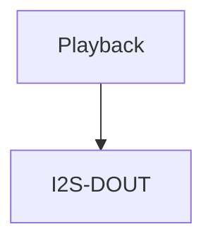

2. 录音流

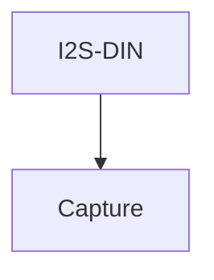

3. 回环流

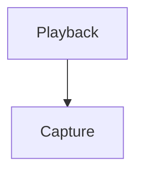

### 引脚模式配置

```shell
[daudio0]
pin_mclk = port:PA23<2><0><1><default>
pin_bclk = port:PA20<2><0><1><default>
pin_lrck = port:PA19<2><0><1><default>
pin_dout0 = port:PA22<2><0><1><default>
pin_din0 = port:PA21<2><0><1><default>
tdm_num = 0
daudio_master = 4
audio_format = 1
signal_inversion = 1
pcm_lrck_period = 64
slot_width_select = 32
msb_lsb_first = 0
frametype = 0
tx_data_mode = 0
rx_data_mode = 0
tdm_config = 1
mclk_div = 2
rx_sync_en = 0
rx_sync_ctl = 0
```

配置项说明：

| 配置项名称        | 配置项说明                                                   |
| ----------------- | ------------------------------------------------------------ |
| pin_mclk          | MCLK 引脚的设置                                              |
| pin_bclk          | BCLK 引脚的设置                                              |
| pin_lrck          | LRCK 引脚的设置                                              |
| pin_dout0         | DOUT0 引脚的设置                                             |
| pin_din0          | DIN0 引脚的设置                                              |
| tdm_num           | I2S 使用数量的设置                                           |
| daudio_master     | 设备主从模式的设置<br />1：BCLK、LRCK 由外部 CODEC 提供；<br />2：BCLK 由 SoC 提供，LRCK 由外部 CODEC 提供；<br />3：BCLK 由外部 CODEC 提供，LRCK 由 SoC 提供；<br />4：BCLK、LRCK 由 SoC 提供 |
| audio_format      | 5 种 TDM 模式的设置，标准模式为 1、左对齐模式为 2、右对齐模式为 3、长帧模式为 4、短帧模式为 5 |
| signal_inversion  | BCLK 和 MCLK 信号的翻转选择，默认都不翻转，为 1，MCLK 翻转为 2，BCLK 为 3，都翻转则为 4 |
| pcm_lrck_period   | LRCK 的宽度，可选项: 16/32/64/128/256                        |
| slot_width_select | slot 的宽度，可选项: 8/16/32                                 |
| msb_lsb_first     | 大小端的设置，0 为大端，1 为小端                             |
| frametype         | 长帧模式和短帧模式的选择，0 为短帧，1 为长帧                 |
| tx_data_mode      | 发送端数据格式的选择，0 为 16 位线性 pcm 数据                |
| rx_data_mode      | 接收端数据格式的选择，0 为 16 位线性 pcm 数据                |
| tdm_config        | 设置 TDM 模式，0 为 DSP 的两个模式，1 为 I2S 的三种模式      |
| mclk_div          | MCLK 分频系数，为 0 时无输出，可选项: 1/2/4/6/8/12/16/24/32/48/64/96/128/176/192 |
| rx_sync_en        | 同步录音功能的使能                                           |
| rx_sync_ctl       | 设置同步录音功能是否透出控件开关                             |

### 驱动配置

驱动配置在 menuconfig 中在下列位置

```
Drivers Options --->
	soc related device drivers --->
		SOUND Devices --->
			[*] Sound card support
				Platform(Audio Interface) drivers --->
					[*] Allwinner Digital Audio Support
						Allwinner Digital Audio Choose --->
							[*] Allwinner Daudio0 Support 
							[*] Allwinner Daudio1 Support 
							[*] Allwinner Daudio2 Support 
							[*] Allwinner Daudio3 Support
```

配置项说明

- Allwinner Daudio0 Support
  - I2S/PCM0 模块

- Allwinner Daudio1 Support
  - I2S/PCM1 模块
- Allwinner Daudio2 Support
  - I2S/PCM2 模块
- Allwinner Daudio3 Support
  - I2S/PCM3 模块

### 声卡控件

控件列表：

```
Card Name:snddaudio0.
	numid=0, name='tx hub mode'
		value=Off, enum=Off On
	numid=1, name='rx sync mode'
		value=Off, enum=Off On
	numid=2, name='loopback debug'
		value=Off, enum=Off On
	numid=3, name='sunxi daudio asrc function'
		value=Off, enum=Off On
```

控件名称与功能如下表所示：

| 控件名称                   | 功能         | 数值   |
| -------------------------- | ------------ | ------ |
| tx hub mode                | 同源播放开关 | Off;On |
| rx sync mode               | 同步采样开关 | Off;On |
| loopback debug             | 内部回录开关 | Off;On |
| sunxi daudio asrc function | 重采样开关   | Off;On |

### 使用方法

> 假设 snddaudio0 声卡序号为 2

#### 录音

```
~# arecord /data/test.wav -D hw:snddaudio0

card:          hw:snddaudio0
period_size:   1024
buffer_size:   4096
please set capture duration..
please wait...writing data(0 bytes) into /data/test.wav 
write finish...

riffType:   RIFF
waveType:   WAVE
channels:   3
rate:       16000
bits:       16
align:      6
data size:  0
```

#### 播放

```
~# aplay /data/test.wav -D hw:snddaudio0

riffType:   RIFF
waveType:   WAVE
channels:   3
rate:       16000
bits:       16
align:      6
data size:  0
```

#### snddaudio0 声卡内部回环，播录音频格式需保持一致

```
# 1.打开 loopback 开关
~# amixer -c 2 set 2 1

Card Name:snddaudio0.
	numid=2, name='loopback debug'
			value=On, enum=Off On
			
# 2.后台播放音频
~# fork aplay /data/test.wav -D hw:snddaudio0

riffType:   RIFF
waveType:   WAVE
channels:   3
rate:       16000
bits:       16
align:      6
data size:  0

# 3.执行录音操作
~# arecord /data/test.wav -D hw:snddaudio0

card:          hw:snddaudio0
period_size:   1024
buffer_size:   4096
please set capture duration..
please wait...writing data(0 bytes) into /data/test.wav 
write finish...

riffType:   RIFF
waveType:   WAVE
channels:   3
rate:       16000
bits:       16
align:      6
data size:  0
```

## S/PDIF

S/PDIF 数字音频接口

### 驱动特性

- 支持多种采样率格式
  - 播放：22.05~192kHz
  - 录音：22.05~192kHz
- 支持多通道播放和录音
  - 播放：1~2
  - 录音：1~2
- 支持 16/20/24/32bit 数据精度（硬件支持 16/20/24bit）
- 支持 loopback 回环模式
- 支持同时 playback 和 capture (全双工模式)
- 支持 IEC-60958 协议
- 支持 IEC-61937 协议
- 支持多声卡同源播放
- 支持透传播放

### 音频通路

1. 播放通路

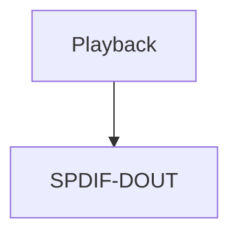

2. 录音通路

``````mermaid
graph TD;
	SPDIF-DIN-->Capture
``````

### 驱动配置

驱动配置在 menuconfig 中在下列位置

```
Drivers Options --->
	soc related device drivers --->
		SOUND Devices --->
			[*] Sound card support
				Platform(Audio Interface) drivers --->
					[*] Allwinner SPDIF Support
```

配置项说明

- Allwinner SPDIF Support
  - SPDIF 模块

### 声卡控件

控件列表：

```
Card Name:sndspdif.
numid=0, name='spdif audio format function'
	value=PCM, enum=PCM DTS
numid=1, name='spdif rx data type'
	value=IEC-60958, enum=IEC-60958 IEC-61937 numid=2, name='spdif audio hub mode'
	value=Disabled, enum=Disabled Enabled
numid=3, name='sunxi spdif loopback debug'
	value=0, min=0, max=1
```

| 控件名称                    | 功能             | 数值                |
| --------------------------- | ---------------- | ------------------- |
| spdif audio format function | 设置音频数据格式 | PCM DTS             |
| spdif rx data type          | 设置传输协议     | IEC-60958 IEC-61937 |
| spdif audio hub mode        | 同源输出开关     | Disabled : Enabled  |
| sunxi spdif loopback debug  | 内部回录开关     | 0：关闭 1：打开     |

### 使用方法

#### 播放

```c
# 播放音频
~# aplay /data/test.wav -D hw:sndspdif

riffType:   RIFF
waveType:   WAVE
channels:   2
rate:       16000
bits:       16
align:      4
data size:  320000
```

## DMIC

双/立体声数字麦克风接口。

### 驱动特性

- 支持多种采样率格式
  - 8~48kHz
- 支持多通道录音
  - channels：1~8
- 支持16/24bit 数据精度
- 支持硬件HPF 算法
- 支持多声卡同步录音

### 音频通路

1. 录音流

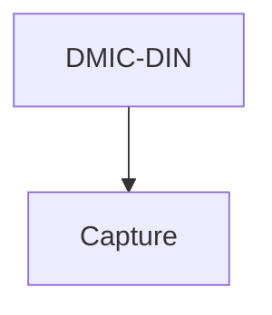

### 驱动配置

驱动配置在 menuconfig 中在下列位置

```c
Drivers Options --->
    soc related device drivers --->
        SOUND Devices --->
            [*] Sound card support
                Platform(Audio Interface) drivers --->
                	[*] Allwinner DMIC Support
```

配置项说明

- Allwinner DMIC Support
  - DMIC 模块

### 使用方法

```
# 录音
~# arecord /data/test.wav -D hw:snddmic -c 2 -r 16000 -d 5 -p 320 -b 1280

card:          hw:snddmic
period_size:   320
buffer_size:   1280
malloc rest=   320000
please set capture duration..
please wait...writing data(0 bytes) into /data/test.wav 
write finish...

riffType:   RIFF
waveType:   WAVE
channels:   2
rate:       16000
bits:       16
align:      4
data size:  320000
```

## MAD

麦克风激活检测(Microphone Activity Detection，MAD)，用于语音唤醒方案

### 驱动特性

- 支持AudioCodec、DMIC 音频传输接口；
- 支持16kHz, 48kHz 采样率，固定16bit；
- 支持一块64KB 的SRAM，可用于保存音频数据；
- 支持基于能量识别的语音检测模块LPSD（只支持单通道，16bit 数据，16kHz 采样率）。

## 音频通路

1. 唤醒状态，正常录音

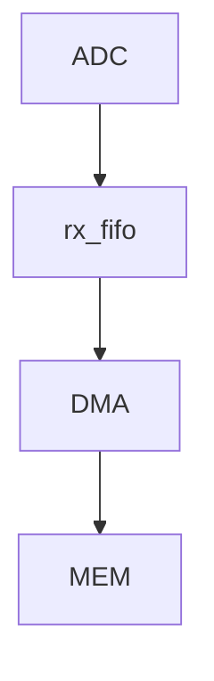

2. 进入休眠，语言能量检测

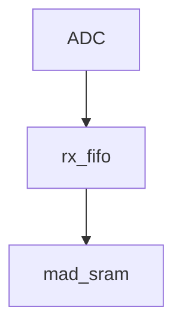

3. 触发唤醒，继续录音


### 驱动配置

驱动配置在 menuconfig 中在下列位置

```
Drivers Options --->
    soc related device drivers --->
        SOUND Devices --->
            [*] Sound card support
                Platform(Audio Interface) drivers --->
                	[*] Allwinner MAD Support
```

> 需要同时使能录音源模块驱动才可正常工作，如录音源为AudioCodec，则需使能AudioCodec 驱动。

### 声卡控件

?> 以mad 绑定AudioCodec 声卡为例。

控件列表：

```
Card Name:audiocodecadc.
	numid=0, name='bind mad function'
		value=unbound, enum=unbound mad_bind
	numid=1, name='lpsd channel sel function'
		value=0th_chan, enum=0th_chan 1st_chan 2nd_chan 3rd_chan 4th_chan 5th_chan 6th_chan 7th_chan
	numid=2, name='mad standby channel sel function'
		value=Zero_Chan, enum=Zero_Chan Two_Chan Three_Chan Four_Chan
	numid=3, name='mad standby control'
		value=RESUME, enum=RESUME SUSPEND
	numid=4, name='MIC1 volume'
		value=31, min=0, max=31
	numid=5, name='MIC2 volume'
		value=31, min=0, max=31
	numid=6, name='MIC3 volume'
		value=31, min=0, max=31
	numid=7, name='MIC1 switch'
		value=on, enum=off on
	numid=8, name='MIC2 switch'
		value=on, enum=off on
	numid=9, name='MIC3 switch'
		value=on, enum=off on
```

如上，控件0-3 为mad 模块控件，控件4-9 为AudioCodec 模块控件。

| 控件名称                         | 功能                      | 数值                         |
| -------------------------------- | ------------------------- | ---------------------------- |
| bind mad function                | 是否绑定 MAD 功能         | 0: 不绑定; 1: 绑定           |
| lpsd channel sel Function        | 选择作为能量唤醒的通道    | 0: 通道 0; 1: 通道 1;        |
| mad_standby channel sel Function | 设定休眠时 mad 录音通道数 | Zero_Chan: 实际录音通道      |
| mad standby control              | 休眠测试使用              | Two_Chan: 只录制两通道Off;On |

### 使用方法

#### 语音唤醒

安静环境下，开启录音后进入休眠暂停录音，此时外界制造音量较大的声音，mad 模块触发唤醒
cpu，并自动继续录音。

1. 录音前控件设置

假设使用AudioCodec 模块MIC1 单通道作为能量能量唤醒通道。

```
~# amixer -c 0 set "bind mad function" 1
~# amixer -c 0 set "lpsd channel sel function" 0
~# amixer -c 0 set "mad standby channel sel function" 0
~# amixer -c 0 set "MIC2 switch" 0
~# amixer -c 0 set "MIC3 switch" 0
```

2. 开启录音

```
# 录音参数为单通道、16kHz采样率、16bit。
~# fork arecord -D hw:audiocodecadc -c 1 -r 16000 -d 20 -p 320 -b 1280 /data/test.wav
```

3. 进入休眠

```
# 如使用休眠测试命令进入休眠，此时arecord 录音将被暂停
~# rpccli arm standby
```

4. 外界声音唤醒

制造较大音量的外界声音，系统唤醒，并自动恢复arecord 录音，查看录音文件可录到外界唤醒声音。

#### 语音唤醒能量唤醒阈值参数

语音唤醒能量唤醒阈值参数能量唤醒模块lpsd，识别能量主要有两个方向，瞬时能量和累计能量（前者比如是关门声，后者比如是不断说话）能量检测参数配置在 `lichee/rtos-hal/hal/source/sound/platform/sunximad.c` 修改。

| 参数名称   | 功能                 | 可设范围     | 推荐值 |
| ---------- | -------------------- | ------------ | ------ |
| lpsd_th    | 累积语音能量检测阈值 | 0x0 - 0xFFFF | 1200   |
| lpsd_rrun  | 语音能量检测开始时间 | 0x0 - 0xFF   | 145    |
| lpsd_rstop | 语音能量检测结束时间 | 0x0 - 0xFF   | 170    |

- 瞬时能量检测参数，主要是 lpsd_rrun 和 lpsd_rstop。

  - 一般只对 stop 值进行修改;

  - 如果录音数据经常缺少唤醒词的第一个字，则可以尝试降低 stop 值，可以有效提高唤醒词数据的完整性。但同时会提高误唤醒率，环境噪音也会很容易触发能量检测，唤醒系统;

  - 如果想要降低误唤醒率 (环境噪音造成唤醒)，则可以尝试提高 stop 值。同样的，这会导致一些唤醒词录音数据不完整，例如一些音量较低，音调较低的语料;

  - 唤醒词识别率以及误唤醒率无法同时兼得，客户需要根据实际需求、场景，权衡配置参数;

- 累积能量检测参数，主要是 lpsd_th。
  - 建议使用默认值 1200，建议修改范围 50~1200。

## 模块接口说明

### 源文件列表

1. `platform` 层

```
lichee/rtos-hal/hal/source/sound/platform .
├── Kconfig
├── Makefile
├── objects.mk
├── sun8iw19-daudio.c
├── sunxi-daudio.c           # platform 层 –> I2S/PCM，负责 I2S/PCM 模块硬件参数、DMA 相关配置。
├── sunxi-daudio.h           # platform 层 –> I2S/PCM，负责 I2S/PCM 模块硬件参数、DMA 相关配置。
├── sunxi-dmic.c
├── sunxi-dmic.h
├── sunxi-dummy-cpudai.c     # platform 层 –> AudioCodec，负责 AudioCodec 模块 DMA 相关配置。
├── sunxi-mad.c
├── sunxi-mad.h
├── sunxi-pcm.c              # platform 层 –> 公共部分，负责音频流传输，使用 DMA 方式，提供注册 platform 设备的公共函数。
├── sunxi-pcm.h              # platform 层 –> 公共部分，负责音频流传输，使用 DMA 方式，提供注册 platform 设备的公共函数。
├── sunxi-spdif.c            # platform 层 –> SPDIF，负责 SPDIF 模块硬件参数、DMA 相关配置。
├── sunxi-spdif.h            # platform 层 –> SPDIF，负责 SPDIF 模块硬件参数、DMA 相关配置。
├── platforms
    ├── daudio-sun20iw2.h    # platform 层 –> DMIC、SPDIF、DAUDIO 时钟框架代码
    ├── dmic-sun20iw2.h      # platform 层 –> DMIC、SPDIF、DAUDIO 时钟框架代码
    ├── mad-sun20iw2.c       # platform 层 –> DMIC、SPDIF、DAUDIO 时钟框架代码
    ├── mad-sun20iw2.h       # platform 层 –> DMIC、SPDIF、DAUDIO 时钟框架代码
    ├── spdif-sun20iw2.h     # platform 层 –> DMIC、SPDIF、DAUDIO 时钟框架代码
```

2. `codec` 层

```
lichee/rtos-hal/hal/source/sound/codecs .
├── ac101s.c               # codec 层 –> AC101s codec
├── ac101s.h               # codec 层 –> AC101s codec
├── dummy_codec.c          
├── sun20iw2-codec-adc.c   # codec 层 –> AudioCodec，负责 AudioCodec 模块硬件参数配置
├── sun20iw2-codec.c       # codec 层 –> AudioCodec，负责 AudioCodec 模块硬件参数配置
├── sun20iw2-codec-dac.c   # codec 层 –> AudioCodec，负责 AudioCodec 模块硬件参数配置
├── sun20iw2-codec.h       # codec 层 –> AudioCodec，负责 AudioCodec 模块硬件参数配置
├── sunxi-codec.h          # codec 层 –> 公共部分
├── sunxi_rw_func.c
```

3. `machine` 层

```
lichee/rtos/projects/xxx/src .
├── card_default.c         # 负责 platform 层和 codec 层绑定。
```

## 软件框图

### 关键数据结构

#### pcm 数据类结构体

1. `sunxi_dma_params`

定义audio DAI DMA 相关参数。

```c
struct sunxi_dma_params {
	char *name;
	dma_addr_t dma_addr;
	uint32_t src_maxburst;
	uint32_t dst_maxburst;
	uint8_t dma_drq_type_num;
};
```

2. platform 类结构体 

- `DAUDIO`

I2S/PCM 模块总结构体，包含基础平台资源、特定功能私有参数

```c
struct sunxi_daudio_info {
	struct snd_platform *platform;
	struct sunxi_daudio_clk clk;
	struct daudio_pinctrl *pinctrl;
	uint8_t pinctrl_num;
	struct pa_config *pa_cfg;
	uint8_t pa_cfg_num;

	struct sunxi_daudio_param param;
	struct sunxi_dma_params playback_dma_param;
	struct sunxi_dma_params capture_dma_param;

	uint8_t global_enable;
	unsigned int hub_mode;
	bool playback_en;
	bool capture_en;
	int asrc_en;
};
```

- `SPDIF`

```c
/* 用于描述引脚*/
typedef struct {
    gpio_pin_t gpio;
    unsigned int mux;
} spdif_gpio;

/* 用于描述SPDIF 引脚*/
typedef struct {
    spdif_gpio out;
    spdif_gpio in;
} spdif_gpio_t;

/* 包含了DMA 相关参数以及时钟结构体*/
struct sunxi_spdif {
    struct sunxi_dma_params playback_dma_param;
    struct sunxi_dma_params capture_dma_param;
    struct sunxi_spdif_clk clk;
};
```

- `DMIC`

```c
/* 用于描述引脚*/
typedef struct {
    gpio_pin_t gpio;
    int mux;
} dmic_gpio;

/* 用于描述DMIC 引脚*/
typedef struct {
    dmic_gpio clk;
    dmic_gpio din0;
    dmic_gpio din1;
    dmic_gpio din2;
    dmic_gpio din3;
} dmic_gpio_t;

/* 用于描述DMIC 采样率*/
struct dmic_rate {
    unsigned int samplerate;
    unsigned int rate_bit;
};

/* 包含了DMA 相关参数，通道数以及时钟结构体*/
struct sunxi_dmic {
    struct sunxi_dma_params capture_dma_param;
    u32 chanmap;
    struct sunxi_dmic_clk clk;
};
```

### codec 类结构体

#### AudioCodec

AudioCodec 模块总结构体，包含基础平台资源、特定功能私有参数

```c
struct sunxi_codec_info {
	struct snd_codec *codec;

	void *codec_base_addr;
	struct sunxi_codec_clk clk;
	struct sunxi_codec_param param;

#ifdef CONFIG_SND_PLATFORM_SUNXI_MAD
	int capturing;
	struct sunxi_mad_priv mad_priv;
#endif
};
```

## 软件重要接口

> 仅说明自定义软件接口，alsa 框架内部接口不做说明。

### pcm 相关接口

#### 创建 pcm 设备

函数原型：

```c
int sunxi_pcm_new(struct snd_pcm *pcm)
```

参数:

- pcm: pcm设备信息

返回值:

- 0: 成功
- 其他:失败

#### 释放 pcm 设备

函数原型

```c
void sunxi_pcm_free_dma_buffer(struct snd_pcm *pcm, int stream)
```

参数:

- pcm: pcm设备信息
- stream: pcm 流信息

返回值: 无

#### 开启 pcm 设备

函数原型:

```c
int sunxi_pcm_open(struct snd_pcm_substream *substream)
```

参数:

- substream: pcm 子流信息

返回值:

- 0: 成功
- 其他:失败

#### 设置 pcm 设备参数

函数原型:

```c
int sunxi_pcm_hw_params(struct snd_pcm_substream *substream, struct snd_pcm_hw_params *params)
```

参数:

- substream: pcm 子流信息
- params: pcm 硬件参数

返回值:

- 0: 成功
- 其他:失败

#### 触发 pcm 设备运行

函数原型:

```c
int sunxi_pcm_trigger(struct snd_pcm_substream *substream, int cmd)
```

参数:

- substream: pcm 子流信息
- cmd: 触发命令

返回值:

- 0: 成功
- 其他:失败

#### 获取 pcm 设备帧点

函数原型:

```c
snd_pcm_uframes_t snd_dmaengine_pcm_pointer(struct snd_pcm_substream *substream)
```

参数:

- substream: pcm 子流信息

返回值:

- snd_pcm_uframes_t：当前DMA 缓冲指针

### Platform 层接口

#### AudioCodec接口

##### 初始化 DMA 参数

函数原型:

```c
int sunxi_cpudai_platform_probe(struct snd_platform *platform)
```

参数:

- platform: platform 信息

返回值:

- 0: 成功
- 其他:失败

##### 更新设置 DMA 参数

函数原型:

```c
int sunxi_cpudai_startup(struct snd_pcm_substream *substream, struct snd_dai *dai)
```

参数:

- substream: pcm 子流信息
- dai: cpu dai 信息

返回值:

- 0: 成功
- 其他:失败

#### I2S/PCM接口

##### I2S/PCM 模块休眠（保存寄存器、关闭时钟）

函数原型:

```c
int sunxi_daudio_suspend(struct pm_device *dev, suspend_mode_t mode)
```

参数:

- dev: 设备信息
- mode: 休眠模式

返回值:

- 0: 成功
- 其他:失败

##### I2S/PCM 模块唤醒（开启时钟、初始化模块、恢复寄存器）

函数原型:

```c
int sunxi_daudio_resume(struct pm_device *dev, suspend_mode_t mode)
```

参数:

- dev: 设备信息
- mode: 休眠模式

返回值:

- 0: 成功
- 其他:失败

##### 设置模块BCLK 分频系数

函数原型:

```c
int sunxi_daudio_set_clkdiv(struct snd_dai *dai, int clk_id, int clk_div)
```

参数:

- dai: cpu dai 信息
- clk_id: clk 辅助信息
- clk_div: clk 分频系数

返回值:

- 0: 成功
- 其他:失败

##### 设置模块工作时钟

函数原型:

```c
int sunxi_daudio_set_sysclk(struct snd_dai *dai, int clk_id, unsigned int freq, int dir)
```

参数:

- dai: cpu dai 信息
- clk_id: clk 辅助信息
- freq: 时钟频率
- dir: 时钟输出方向

返回值:

- 0: 成功
- 其他:失败

##### 设置模块I2S 格式

函数原型:

```c
int sunxi_daudio_set_fmt(struct snd_dai *dai, unsigned int fmt)
```

参数:

- dai: cpu dai 信息
- fmt: I2S 格式信息

返回值:

- 0: 成功
- 其他:失败

##### 设置模块开启工作资源(DMA 参数、组件功能等)

函数原型:

```c
int sunxi_daudio_startup(struct snd_pcm_substream *substream, struct snd_dai *dai)
```

参数:

- substream: pcm 子流信息
- dai: cpu dai 信息

返回值:

- 0: 成功
- 其他:失败

##### 设置模块硬件参数

函数原型:

```c
int sunxi_daudio_hw_params(struct snd_pcm_substream *substream, struct snd_pcm_hw_params *params, struct snd_dai *dai)
```

参数:

- substream: pcm 子流信息
- params: 硬件参数
- dai: cpu dai 信息

返回值:

- 0: 成功
- 其他:失败

##### 清除模块fifo

函数原型:

```c
int sunxi_daudio_prepare(struct snd_pcm_substream *substream, struct snd_dai *dai)
```

参数:

- substream: pcm 子流信息
- dai: cpu dai 信息

返回值:

- 0: 成功
- 其他:失败

##### 触发模块工作

函数原型:

```c
int sunxi_daudio_trigger(struct snd_pcm_substream *substream, int cmd, struct snd_dai *dai)
```

参数:

- substream: pcm 子流信息
- cmd: 触发命令
- dai: cpu dai 信息

返回值:

- 0: 成功
- 其他:失败

##### 设置模块关闭工作资源(组件功能等)

函数原型:

```c
void sunxi_daudio_shutdown(struct snd_pcm_substream *substream, struct snd_dai *dai)
```

参数:

- substream: pcm 子流信息
- dai: cpu dai 信息

返回值:

- 0: 成功
- 其他:失败

#### SPDIF

##### 初始化cpu dai (DMA、模块寄存器)

函数原型:

```c
int sunxi_spdif_dai_probe(struct snd_dai *dai)
```

参数:

- dai: cpu dai 信息

返回值:

- 0: 成功
- 其他:失败

##### 模块休眠（保存寄存器、关闭时钟）

函数原型:

```c
int sunxi_spdif_suspend(struct pm_device *dev, suspend_mode_t mode)
```

参数：

- dev: 设备信息
- mode: 休眠模式

返回值:

- 0: 成功
- 其他:失败

##### 模块唤醒（开启时钟、初始化模块、恢复寄存器）

函数原型:

```c
int sunxi_spdif_resume(struct pm_device *dev, suspend_mode_t mode)
```

参数：

- dev: 设备信息
- mode: 休眠模式

返回值:

- 0: 成功
- 其他:失败

##### 设置模块分频系数

函数原型：

```c
int sunxi_spdif_set_clkdiv(struct snd_dai *dai, int clk_id, int clk_div)
```

参数：

- dai: cpu dai 信息
- clk_id: clk 辅助信息
- clk_div: clk 分频系数

返回值:

- 0: 成功
- 其他:失败

##### 设置模块工作时钟

函数原型：

```c
int sunxi_spdif_set_sysclk(struct snd_dai *dai, int clk_id, unsigned int freq, int dir)
```

参数：

- dai: cpu dai 信息
- clk_id: clk 辅助信息
- freq: 时钟频率
- dir: 时钟输出方向

返回值:

- 0: 成功
- 其他:失败

##### 设置模块开启工作资源(DMA 参数、组件功能等)

函数原型：

```c
int sunxi_spdif_startup(struct snd_pcm_substream *substream, struct snd_dai *dai)
```

参数：

- substream: pcm 子流信息
- dai: cpu dai 信息

返回值:

- 0: 成功
- 其他:失败

##### 设置模块硬件参数

函数原型：

```c
int sunxi_spdif_hw_params(struct snd_pcm_substream *substream, struct snd_pcm_hw_params *params, struct snd_dai *dai)
```

参数：

- substream: pcm 子流信息
- params: 硬件参数
- dai: cpu dai 信息

返回值:

- 0: 成功
- 其他:失败

##### 清除模块fifo，清除中断

函数原型：

```c
int sunxi_spdif_prepare(struct snd_pcm_substream *substream, struct snd_dai *dai)
```

参数：

- substream: pcm 子流信息
- dai: cpu dai 信息

返回值:

- 0: 成功
- 其他:失败

##### 触发模块工作

函数原型：

```c
int sunxi_spdif_trigger(struct snd_pcm_substream *substream, int cmd, struct snd_dai *dai)
```

参数：

- substream: pcm 子流信息
- cmd: 触发命令
- dai: cpu dai 信息

返回值:

- 0: 成功
- 其他:失败

#### DMIC

##### 初始化cpu dai (DMA、模块寄存器)

函数原型：

```c
int sunxi_dmic_dai_probe(struct snd_dai *dai)
```

参数：

- dai: cpu dai 信息

返回值:

- 0: 成功
- 其他:失败

##### 模块休眠（保存寄存器、关闭时钟）

函数原型：

```c
int sunxi_dmic_suspend(struct pm_device *dev, suspend_mode_t mode)
```

参数：

- dev: 设备信息
- mode: 休眠模式

返回值:

- 0: 成功
- 其他:失败

##### 模块唤醒（开启时钟、恢复寄存器）

函数原型：

```c
int sunxi_dmic_resume(struct pm_device *dev, suspend_mode_t mode)
```

参数：

- dev: 设备信息
- mode: 休眠模式

返回值:

- 0: 成功
- 其他:失败

##### 设置模块 pll clk

函数原型：

```c
int sunxi_dmic_set_sysclk(struct snd_dai *dai, int clk_id, unsigned int freq, int dir)
```

参数：

- dai: cpu dai 信息
- clk_id: clk 辅助信息
- freq: 时钟频率
- dir: 时钟输出方向

返回值:

- 0: 成功
- 其他:失败

##### 设置模块开启工作资源(DMA 参数、组件功能等)

函数原型：

```c
int sunxi_dmic_startup(struct snd_pcm_substream *substream, struct snd_dai *dai)
```

参数：

- substream: pcm 子流信息
- dai: cpu dai 信息

返回值:

- 0: 成功
- 其他:失败

##### 设置模块硬件参数

函数原型：

```c
int sunxi_dmic_hw_params(struct snd_pcm_substream *substream, struct snd_pcm_hw_params *params, struct snd_dai *dai)
```

参数：

- substream: pcm 子流信息
- params: 硬件参数
- dai: cpu dai 信息

返回值:

- 0: 成功
- 其他:失败

##### 清除模块 fifo，清除中断

函数原型：

```c
int sunxi_dmic_prepare(struct snd_pcm_substream *substream, struct snd_dai *dai)
```

参数：

- substream: pcm 子流信息
- dai: cpu dai 信息

返回值:

- 0: 成功
- 其他:失败

##### 触发模块工作

函数原型：

```c
int sunxi_dmic_trigger(struct snd_pcm_substream *substream, int cmd, struct snd_dai *dai)
```

参数：

- substream: pcm 子流信息
- cmd: 触发命令
- dai: cpu dai 信息

返回值:

- 0: 成功
- 其他:失败

### Codec 层

#### AudioCodec(ADC/DAC)

##### 模块休眠（保存寄存器、关闭时钟）

函数原型：

```c
int sunxi_codec_suspend(struct pm_device *dev, suspend_mode_t mode)
```

参数：

- dev: 设备信息
- mode: 休眠模式

返回值:

- 0: 成功
- 其他:失败

##### 模块唤醒（开启时钟、恢复寄存器）

函数原型：

```c
int sunxi_codec_resume(struct pm_device *dev, suspend_mode_t mode)
```

参数：

- dev: 设备信息
- mode: 休眠模式

返回值:

- 0: 成功
- 其他:失败

##### 设置模块时钟

函数原型：

```c
int sunxi_codec_set_sysclk(struct snd_dai *dai, int clk_id, unsigned int freq, int dir)
```

参数：

- dai: cpu dai 信息
- clk_id: clk 辅助信息
- freq: 时钟频率
- dir: 时钟输出方向

返回值:

- 0: 成功
- 其他:失败

##### 设置模块硬件参数

函数原型：

```c
int sunxi_codec_hw_params(struct snd_pcm_substream *substream, struct snd_pcm_hw_params *params, struct snd_dai *dai)
```

参数：

- substream: pcm 子流信息
- params: 硬件参数
- dai: cpu dai 信息

返回值:

- 0: 成功
- 其他:失败

##### 清除模块fifo，清除中断

函数原型：

```c
int sunxi_codec_prepare(struct snd_pcm_substream *substream, struct snd_dai *dai)
```

参数：

- substream: pcm 子流信息
- dai: cpu dai 信息

返回值:

- 0: 成功
- 其他:失败

##### 触发模块工作

函数原型：

```c
int sunxi_codec_trigger(struct snd_pcm_substream *substream, int cmd, struct snd_dai *dai)
```

参数：

- name: 声卡名称
- codec: codec 设备信息
- platform_type: platform 层设备类型

返回值:

- 0: 成功
- 其他:失败

### 软件调试接口

| 模块   | 接口              | 命令              |
| ------ | ----------------- | ----------------- |
| DMIC   | `cmd_dmic_dump`   | `cmd_dmic_dump`   |
| SPDIF  | `cmd_spdif_dump`  | `cmd_spdif_dump`  |
| DAUDIO | `cmd_daudio_dump` | `cmd_daudio_dump` |

## 模块使用

一个声卡的简单测试，包含两部分，分别为声卡的控件设置及音频测试工具的使用。本章节将从以下 4 个通用小节和 1 个外挂 codec 小节介绍声卡如何使用。

1. menuconfig 配置
2. 声卡设备查看
3. 声卡控件
4. 声卡测试工具使用
5. I2S 外挂 CODEC

### menuconfig 配置

进入menuconfig 界面：

```c
# 进入RTOS 目录执行以下命令
mrtos_menuconfig
```


```c
Drivers Options ‑‑‑>
    soc related device drivers ‑‑‑>
        SOUND Devices ‑‑‑>
            [*] Sound card support
                AW Sound Compenents ‑‑‑>
                    Allwinner alsa library (tiny alsa library) ‑‑‑>
```

还提供 aw‑tiny‑alsa‑lib, 包含了 alsa‑lib 主要的接口，没有任何插件，作用类似于 tinyalsa。aw‑tiny‑alsa‑lib 配置方法：

```
Drivers Options ‑‑‑>
    soc related device drivers ‑‑‑>
        SOUND Devices ‑‑‑>
            [*] Sound card support
                AW Sound Compenents ‑‑‑>
                    Allwinner alsa library (tiny alsa library) ‑‑‑>
```

音频工具 aw‑alsa‑utils 相关配置项：

```
Drivers Options ‑‑‑>
    soc related device drivers ‑‑‑>
        SOUND Devices ‑‑‑>
            [*] Sound card support
                AW Sound Compenents ‑‑‑>
                    [*] alsa library utils select
                    [*] alsa library utils amixer
                    [*] alsa library utils aplay
                    [*] alsa library utils arecord
                    [ ] alsa library utils aloop
```


### 声卡设备查看

可输入以下命令查看系统挂载上的声卡

```c
~# amixer -l
============= Sound Card list =============
card_num card_name
    0 	audiocodecdac
    1 	audiocodecadc
    2 	snddaudio0
    3 	snddmic
    4 	sndspdif
```

?> 可通过在 `card_default.c` 修改 “card_name”  变量，设定声卡名称。

### 声卡加载配置

声卡配置位于代码中, 路径如下：

在每个方案目录下面：
```
projects/方案/src/card_default.c
```
使用 `snd_card_register` 函数进行声卡的注册
```c
int snd_card_register(const char *name, struct snd_codec *codec, int platform_type)
```
- name: 表示声卡的名字，aw‑alsa‑lib中都需要通过该名字找到对应的声卡
- codec: codec结构体，根据实际使用的codec进行配置，如R128的audiocodec,使用sun20iw2_codec;如ac108,使用 ac108_codec
- platform_type: 与linux中ASOC框架类似，也需要指定使用哪种类型的platform,如CPUDAI, DAUDIO等

例如注册 AC108 声卡
```c
snd_card_register("ac108", &ac108_codec, SND_PLATFORM_TYPE_DAUDIO1);
```

### 声卡控件

#### alsa-utils 工具

alsa-utils 主要提供三个工具：

1. aplay: 用于完成与播放相关的操作；
2. arecord: 用于完成与录音相关的操作；
3. amixer: 用于设置相关参数。

##### aplay

输入aplay 或aplay -h 可打印出使用方法

```c
~# aplay

Usage: aplay [OPTION]... [FILE]...

-h, --help help
	--version print current version
-l, --list-devices list all soundcards and digital audio devices
-L, --list-pcms list device names
-D, --device=NAME select PCM by name
-q, --quiet quiet mode
-t, --file-type TYPE file type (voc, wav, raw or au)
-c, --channels=# channels
-f, --format=FORMAT sample format (case insensitive)
-r, --rate=# sample rate
-d, --duration=# interrupt after # seconds
...
```

**查看可以用于播放的声卡**

````c
~# aplay -l
**** List of PLAYBACK Hardware Devices ****
card 0: audiocodec [audiocodec], device 0: soc@03000000:codec_plat-sunxi-snd-codec sunxisnd-codec-0 []
	Subdevices: 1/1
	Subdevice #0: subdevice #0
card 2: snddaudio0 [snddaudio0], device 0: 2032000.daudio0_plat-snd-soc-dummy-dai snd-socdummy-dai-0 []
	Subdevices: 1/1
	Subdevice #0: subdevice #0
````

**用声卡0 设备0 播放test.wav(用 ctrl c 退出)**

```c
~# aplay -D hw:0,0 test.wav
Playing WAVE 'test.wav' : Signed 16 bit Little Endian, Rate 8000 Hz, Mono

^C Aborted by signal Interrupt...
```

##### arecord

输入arecord 或arecord -h 可打印出使用方法

```c
~# arecord

Usage: arecord [OPTION]... [FILE]...

-h, --help help
	--version print current version
-l, --list-devices list all soundcards and digital audio devices
-L, --list-pcms list device names
-D, --device=NAME select PCM by name
-q, --quiet quiet mode
-t, --file-type TYPE file type (voc, wav, raw or au)
-c, --channels=# channels
-f, --format=FORMAT sample format (case insensitive)
-r, --rate=# sample rate
-d, --duration=# interrupt after # seconds
-M, --mmap mmap stream
-N, --nonblock nonblocking mode
-F, --period-time=# distance between interrupts is # microseconds
-B, --buffer-time=# buffer duration is # microseconds
```

**查看可以用于录音的声卡**

```c
~# arecord -l

**** List of CAPTURE Hardware Devices ****
card 0: audiocodec [audiocodec], device 0: soc@03000000:codec_plat-sunxi-snd-codec sunxisnd-codec-0 []
	Subdevices: 1/1
	Subdevice #0: subdevice #0
card 1: snddmic [snddmic], device 0: 2031000.dmic_plat-snd-soc-dummy-dai snd-soc-dummy-dai-0 []
	Subdevices: 1/1
	Subdevice #0: subdevice #0
card 2: snddaudio0 [snddaudio0], device 0: 2032000.daudio0_plat-snd-soc-dummy-dai snd-socdummy-dai-0 []
	Subdevices: 1/1
	Subdevice #0: subdevice #0
...
```

**用声卡1 的设备0 进行采样位数为16 的录音，并把数据保存在test.wav(用ctrl c 退出)**

```c
~# arecord -D hw:1,0 -f S16_LE test.wav

Recording WAVE 'test.wav' : Signed 16 bit Little Endian, Rate 8000 Hz, Mono

^C Aborted by signal Interrupt...
```

##### amixer

输入amixer 或amixer -h 可打印出使用方法

```c
~# amixer -h

Usage: amixer <options> [command]

Available options:
-h,--help this help
-c,--card N select the card
-D,--device N select the device, default 'default'
-d,--debug debug mode
-n,--nocheck do not perform range checking
-v,--version print version of this program
-q,--quiet be quiet
-i,--inactive show also inactive controls
-a,--abstract L select abstraction level (none or basic)
-s,--stdin Read and execute commands from stdin sequentially
-R,--raw-volume Use the raw value (default)
-M,--mapped-volume Use the mapped volume

Available commands:
scontrols show all mixer simple controls
scontents show contents of all mixer simple controls (default command)
sset sID P set contents for one mixer simple control
sget sID get contents for one mixer simple control
controls show all controls for given card
contents show contents of all controls for given card
cset cID P set control contents for one control
cget cID get control contents for one control
```

**查看声卡 1 的控件**

```c
~# amixer -c 1 scontrols

Simple mixer control 'L0 volume',0
Simple mixer control 'L1 volume',0
Simple mixer control 'L2 volume',0
Simple mixer control 'L3 volume',0
Simple mixer control 'R0 volume',0
Simple mixer control 'R1 volume',0
Simple mixer control 'R2 volume',0
Simple mixer control 'R3 volume',0
Simple mixer control 'rx sync mode',0
```

**查看声卡 1 的控件的具体配置**

```c
~# amixer -c 1 scontents
Simple mixer control 'L0 volume',0
    Capabilities: volume volume-joined
    Playback channels: Mono
    Capture channels: Mono
    Limits: 0 - 255
    Mono: 176 [69%]
Simple mixer control 'L1 volume',0
    Capabilities: volume volume-joined
    Playback channels: Mono
    Capture channels: Mono
    Limits: 0 - 255
    Mono: 176 [69%]
Simple mixer control 'L2 volume',0
    Capabilities: volume volume-joined
    Playback channels: Mono
    Capture channels: Mono
    Limits: 0 - 255
    Mono: 176 [69%]
...
```

**设置声卡 1 第一个控件的值**

```c
# 拿到声卡1所有控件
~# amixer -c 1 controls
numid=2,iface=MIXER,name='L0 volume'
numid=4,iface=MIXER,name='L1 volume'
numid=6,iface=MIXER,name='L2 volume'
numid=8,iface=MIXER,name='L3 volume'
numid=3,iface=MIXER,name='R0 volume'
numid=5,iface=MIXER,name='R1 volume'
numid=7,iface=MIXER,name='R2 volume'
numid=9,iface=MIXER,name='R3 volume'
numid=1,iface=MIXER,name='rx sync mode'

# 拿到控件内容
~# amixer cget numid=2,iface=MIXER,name='L0 volume'
numid=2,iface=MIXER,name='rx sync mode'
    ; type=ENUMERATED,access=rw------,values=1,items=2
    ; Item #0 'Off'
    ; Item #1 'On'
    : values=0

# 设置控件值
~# amixer cset numid=2,iface=MIXER,name='L0 volume' 1
numid=2,iface=MIXER,name='rx sync mode'
    ; type=ENUMERATED,access=rw------,values=1,items=2
    ; Item #0 'Off'
    ; Item #1 'On'
    : values=1
```

###  aw‑alsa‑lib 插件配置

aw‑alsa‑lib 与 linux 上 alsa‑lib 一样支持多种插件, 插件的选择、使用, 需要在代码中进行配置, 路径如下:

```c
在每个方案目录下面：
projects/方案/src/alsa_config.c
```

下面根据插件类型进行简单说明

####  hw 插件

```c
static const snd_pcm_hw_config_t snd_pcm_hw_config = {
    .card_name = "audiocodec",
    .device_num = 0,
};
```

- card_name: 声卡名称,需要与card_default.c中注册声卡时指定的名称一致
- device_num: pcm设备序号，目前仅支持一个pcm设备，所以只能为0

#### dmix 插件

```c
static const snd_pcm_dmix_config_t snd_pcm_dmix_config = {
    .type = "dmix",
    .ipc_key = 2222,
    .slave = {
        .pcm = "hw:audiocodec",
        .format = SND_PCM_FORMAT_S16_LE,
        .rate = 48000,
        .channels = 1,
        .period_size = 1024,
        .periods = 4,
    },
};
```

- type: 插件类型dmix
- ipc_key: 需要进行混音的均要指定同一ipc_key
- slave: pcm从设备的信息
  - pcm: pcm设备的名称,必须为hw类型
  - format: 采样格式
  - rate: 采样率
  - channels: 通道数
  - period_size: period_size大小,决定中断触发频率
  - periods: periods大小,决定buffer size大小

####  dsnoop 插件

```c
static const snd_pcm_dsnoop_config_t snd_pcm_dsnoop_ref_config = {
    .type = "dsnoop",
    .ipc_key = 1114,
    .slave = {
        .pcm = "hw:ac107",
        .format = SND_PCM_FORMAT_S16_LE,
        .rate = 16000,
        .channels = 1,
        .period_size = 1024,
        .periods = 4,
    },
};
```

- type: 插件类型 dsnoop
- ipc_key: 需要进行混音的均要指定同一ipc_key
- slave: pcm从设备的信息
  - pcm: pcm设备的名称,必须为hw类型
  - format: 采样格式
  - rate: 采样率
  - channels: 通道数
  - period_size: period_size大小,决定中断触发频率
  - periods: periods大小,决定buffer size大小

#### softvol 插件

```c
static const snd_pcm_softvol_config_t snd_pcm_softvol_config = {
    .type = "softvol",
    .slave = {
        .pcm = "PlaybackPlug",
    },
    .control = {
        .control_name = "Soft Volume Master",
        .card_name = "audiocodec",
    },
    .min_dB = ‑51.0,
    .max_dB = 0.0,
    .resolution = 256,
};
```

- type: 插件类型softvol
- slave: pcm从设备的信息
  - pcm: pcm设备的名称,必须为hw类型
- control: 控件信
  - control_name: 控件名称
  - card_name: 声卡名称，指定控件位于哪个声卡中
- min_dB: 最小衰减
- max_dB: 最大衰减
- resolution: 精度

> 注意, 在第一次使用 softvol 插件进行播放时才会生成该控件; 如果想要在声卡驱动加载的时候就添加该控件，请修改对应的 codec 文件，例如 `SND_CTL_KCONTROL_USER("Soft Volume Master", 255, 0, 255)`

#### asym 插件

```c
static const snd_pcm_asym_config_t snd_pcm_asym_config = {
    .type = "asym",
    .playback_pcm = "PlaybackSoftVol",
    .capture_pcm = "CaptureDsnoop",
};
```

- type: 插件类型softvol
- playback_pcm: 指定播放设备的名称
- capture_pcm: 指定录音设备的名称

####  route 插件

```c
static const snd_pcm_route_config_t snd_pcm_route_config = {
	.type = "route",
    .slave = {
        .pcm = "PlaybackRate",
        .channels = 1,
    },
    .ttable = {
        {0, 0, 0.5},
        {1, 0, 0.5},
        TTABLE_CONFIG_END
    },
};
```

- type: 插件类型route
- slave: pcm从设备的信息
  - pcm: pcm设备的名称
  - channels: 通道数
- ttable: 各通道配置,上面的配置表示将输入的两声道数据分别作0.5倍衰减，然后合成单声道数据
  - 第一个值表示输入的通道序号
  - 第二个值表示输出的通道序号
  - 第三个值表示衰减值
  - ttable配置最后请务必添加TTABLE_CONFIG_END,表示配置结束

####  rate 插件

```c
static const snd_pcm_rate_config_t snd_pcm_rate_config = {
	.type = "rate",
    .slave = {
        .pcm = "PlaybackDmix",
        .format = SND_PCM_FORMAT_S16_LE,
        .rate = 48000,
    },
	.converter = "speexrate",
};
```

- type: 插件类型rate
- slave: pcm从设备的信息
  - pcm: pcm设备的名称
  - format 采样精度
  - rate 采样率
- converter 指定使用的重采样算法,建议使用speexrate

#### file 插件

```c
static const snd_pcm_file_config_t snd_pcm_file_cap_config = {
	.type = "file",
    .slave = {
    	.pcm = "CaptureDsnoop",
    },
    .format = "raw",
    .mode = "adb",
    .port = 20191,
};
```

- type: 插件类型file
- slave: pcm从设备的信息
  - pcm: pcm设备的名称
- format: 音频格式，目前仅支持raw
- mode: file插件保存数据的模式，目前仅支持adb
- port: 端口号
- server: 服务器端ip，当mode为network时才有效

#### multi 插件

```c
static const snd_pcm_multi_config_t snd_pcm_3mic_1ref_config = {
    .type = "multi",
    .slaves = {
        { "a", "CaptureDsnoop3Mic", 3 },
        { "b", "CaptureDsnoopRef", 1 },
        { NULL, NULL, ‑1 },
    },
    .bindings = {
        { 0, "a", 0 },
        { 1, "a", 1 },
        { 2, "a", 2 },
        { 3, "b", 0 },
        { ‑1, NULL, ‑1 },
    },
};
```

- type: 插件类型multi
- slaves: pcm从设备的信息,上述配置表示同时对a,b两个pcm设备进行录音
  - 第一个参数表示pcm设备的别名,方便后续bingdings域指定不同的pcm设备
  - 第二个参数表示pcm设备的名称
  - 第三个参数表示通道总数
  - 注意请在配置最后添加{ NULL, NULL, ‑1 },表示结束
- bindings: 指定多个声卡的通道数排列,上述配置表示a声卡的3通道分别作为通道0,1,2输出,b声卡的通道0作为通道3输出
  - 第一个参数表示录音输出的通道序号
  - 第二个参数表示指定声卡的通道序号
  - 注意请在配置最后添加{ ‑1, NULL, ‑1 },表示结束

#### plug 插件

```C
static const snd_pcm_plug_config_t snd_pcm_plug_config = {
    .type = "plug",
    .slave = {
        .pcm = "PlaybackDmix",
        .format = SND_PCM_FORMAT_S16_LE,
        .channels = 1,
        .rate = 48000,
    },
    .rate_converter = "speexrate",
    .route_policy = "default",
    .ttable = {
        TTABLE_CONFIG_END
    },
};
```

- type: 插件类型plug
- slave: pcm从设备的信息
  - pcm: pcm设备的名称
  - format: 采样格式
  - channels: 通道数
  - rate: 采样率
- rate_converter: 指定使用的重采样算法名称
- route_policy: 使用route插件时的策略,可选average,copy,duplicate,default即为copy

- ttable: 各通道配置,上面的配置表示将输入的两声道数据分别作0.5倍衰减，然后合成单声道数据

  - 第一个值表示输入的通道序号

  - 第二个值表示输出的通道序号

  - 第三个值表示衰减值

  - ttable配置最后请务必添加TTABLE_CONFIG_END,表示配置结束

### I2S 外挂CODEC

#### 硬件连接

确保外部CODEC 芯片与SoC I2S 接口正确连接，具体确认连接如下。

- LRCK, BCLK: 确认该两线是否连接；
- MCLK: 确认外部CODEC 是否需要MCLK，若需要，则确认MCLK 信号线连接；
- DIN: 确认外部CODEC 是否需要录音功能，若需要，则确认DIN 信号线连接；
- DOUT: 确认外部 CODEC 是否需要播放功能，若需要，则确认 DOUT 信号线连接。

#### 获取外部 CODEC I2S 协议格式

确认外部 CODEC I2S 协议格式如下。

1.	功能需求：只录音、只播放、录音播放；
2.	引脚确认：I2S 序号、data 引脚序号；
3.	主从模式：SoC 作主（由 SoC 提供 BCLK,LRCK）、外挂 CODEC 作主（由外挂 CODEC提供 BCLK,LRCK）；
4.	I2S 模式：标准 I2S、I2S_L、I2S_R、DSP_A、DSP_B；
5.	LRCK 信号是否翻转；
6.	BCLK 信号是否翻转；
7.	MCLK 信号：MCLK 频率；
8.	slot 个数：最高要支持多少 slot（音频通道数）；
9.	slot 宽度：最高要支持多少 slot 宽度（音频采样位深）。

查看 “模块介绍” 说明的 “AHUB” 或 “I2S/PCM” -> “sys_conf 配置” 中的配置项说明，根据 I2S 协议格式进行配置。

## AudioSystem

对于多核异构芯片，包含 RV/M33/DSP 三个核，各自运行这一个 RTOS，他们无法同时访问操作同一个音频硬件接口，因此软件上会实现跨核音频相关的功能，并且会屏蔽底层实现细节，让应用无感知，这套软件我们称之为 AudioSystem。

### AudioSystem 软件框架

任意核上都能运行 AudioSystem, 因此可以提供统一的音频软件接口，而 AudioSystem 里面会根据实际配置对接到具体音频硬件接口，或者跨核音频接口。主要框图如下：

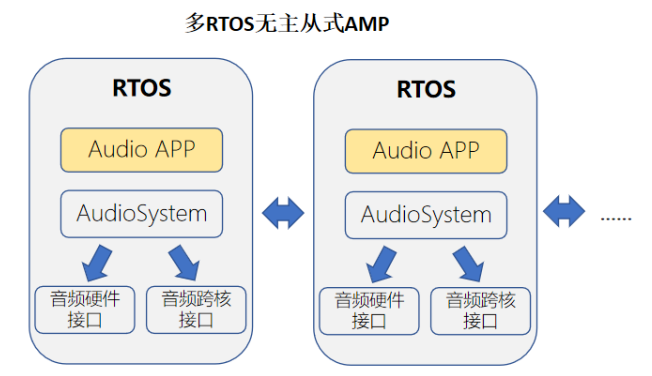

AudioSystem 可实现的功能包括：

- AudioTrack，支持多实例播放
- AudioRecord，支持多实例录音
- audio_plugin, 支持软件音量、重采样、精度转换、通道映射等功能
- audio_hw, 向上给 AudioTrack/AudioRecord 提供通用的数据读写接口，向下可对接本地声卡、跨核音频接口，甚至是 BT a2dp source 等功能。

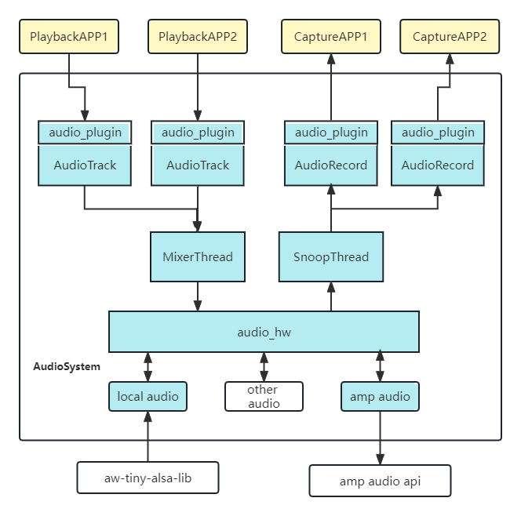

### 软件配置

```
System components ‑‑‑>
	aw components ‑‑‑>
	AudioSystem Support ‑‑‑>
        [*] AW Audio System Support
        [*] Audio HW Support
        [*] Audio HW Support PCM
        [ ] Audio HW Support Multi PCM
        [ ] Audio HW Support AMP
        [ ] Audio HW Support BT
        [*] Audio HW Support EQ
        [ ] Audio HW Support AW EQ
        [*] Audio HW Support DRC
        [*] Audio Track Support
        [*] Audio Record Support
        [*] Audio System Utils
        [*] Audio Plugin Support
```

### 参数配置

AudioSystem 默认使能录音和播放的参数设置，涉及到的相关配置如下:

```
board/r128s2/pro/configs/sys_config.fex
```

根据板子的型号来选择对应的目录。这里是r128s2的pro板。录音和播放相关的参数如下：

```
[audio_hw_rv] //RV核参数配置
pcm_pb_rate = 48000
pcm_pb_channels = 1
pcm_pb_bits = 16
pcm_pb_period_size = 960
pcm_pb_periods = 4
pcm_pb_card = "hw:audiocodecdac" //播放声卡名称
amp_cap_rate = 16000
amp_cap_channels = 3
amp_cap_bits = 16
amp_cap_period_size = 320
amp_cap_periods = 4
amp_cap_card = "capture" //跨核声卡的名称

[audio_hw_dsp] //dsp核参数配置
pcm_cap_rate = 48000
pcm_cap_channels = 3
pcm_cap_bits = 16
pcm_cap_period_size = 320
pcm_cap_periods = 4
pcm_cap_card = "hw:audiocodecadc" //录音声卡名称
```

> 请根据实际使用需求配置参数，不要随意设置参数，否则会导致录音或播放失败，因为驱动会限制 periods，period_size 还有buffer_bytes 的最小值和最大值。如果录音出现 overrun，可以尝试增大 periods，不要随意修改 period_size。

### 音频接口

头文件

```
#include <AudioSystem.h>
```

AudioSystem.h 包含了 AudioTrack.h 以及 AudioRecord.h，因此应用上可以只包含 AudioSystem.h 即可

####  AudioTrack 接口

头文件

```
#include <AudioTrack.h>
```

##### 创建 AudioTrack

```c
tAudioTrack *AudioTrackCreate(const char *name)
```

参数：

- name: 指定audio_hw名称

返回值：

- 成功则返回AudioTrack句柄，失败返回NULL。

> name 参数可支持的值，可以通过 ahw_list 命令查看, 例如 default,amp 也可以在代码中自定义添加需要的名称，详情可以参考 audio_hw/audio_hw.c 中的 add_default_ahw 函数

##### 创建指定音频流类型的 AudioTrack

```c
tAudioTrack *AudioTrackCreateWithStream(const char *name, uint16_t type)
```

参数：

- name: 指定audio_hw名称
- type: 音频流类型，每个类型都有独自的音量调节曲线

返回值：

- 成功则返回AudioTrack句柄，失败返回NULL。

> 如果使用 AudioTrackCreate 接口，默认使用的音频流类型是 AUDIO_STREAM_SYSTEM 音频流音量曲线在 audio_plugin/softvolume.c 里面定义, 可以参考 softvol_stream_init 函数默认加载了两种类型的曲线。

##### 设置 AudioTrack 相关音频参数

```c
int AudioTrackSetup(tAudioTrack *at, uint32_t rate, uint8_t channels, uint8_t bits)
```

参数：

- at: AudioTrack句柄
- rate: 采样率
- channels: 通道数
- bits: 采样精度

返回值：

- 成功则返回0,否则返回error code

##### 写入 PCM 数据

```c
int AudioTrackWrite(tAudioTrack *at, void *data, uint32_t size)
```

参数：

- at: AudioTrack句柄
- data: 要写入的pcm数据
- size: 数据大小,bytes

返回值：

- 成功则返回写入的字节数否则返回error code

##### 开启 AudioTrack

```c
int AudioTrackStart(tAudioTrack *at)
```

参数：

- at: AudioTrack句柄

返回值：

- 成功则返回0,否则返回error code

> 放音流程中不一定要执行 AudioTrackStart 函数，因为在调用 AudioTrackWrite 的时候，内部会根据状态自动调用 start 的。

##### 停止 AudioTrack

```c
int AudioTrackStop(tAudioTrack *at)
```

参数：

- at: AudioTrack句柄

返回值：

- 成功则返回0,否则返回error code

##### 获取当前 AudioTrack 仍有多少数据未送入声卡

```c
int AudioTrackDelay(tAudioTrack *at)
```

参数：

- at: AudioTrack句柄

返回值：

- 成功则返回0,否则返回error code

##### 销毁 AudioTrack

```c
int AudioTrackDestroy(tAudioTrack *at)
```

参数：

- at: AudioTrack句柄

返回值：

- 成功则返回0,否则返回error code

####  AudioRecord 接口

头文件

```
#include <AudioRecord.h>
```

##### 创建 AudioRecord

```c
tAudioRecord *AudioRecordCreate(const char *name)
```

参数：

- name: 指定audio_hw名称

返回值：

- 成功则返回AudioRecord句柄，失败返回NULL。

##### 设置 AudioRecord 相关音频参数

```c
int AudioRecordSetup(tAudioRecord *ar, uint32_t rate, uint8_t channels, uint8_t bits)
```

参数：

- ar: AudioRecord句柄
- rate: 采样率
- channels: 通道数
- bits: 采样精度

返回值：

- 成功则返回0,否则返回error code

##### 获取 PCM 数据

```c
int AudioRecordRead(tAudioRecord *ar, void *data, uint32_t size)
```

参数：

- ar: AudioRecord句柄
- data: 读取的pcm数据存放的地址
- size: 数据大小,bytes

返回值：

- 成功则返回写入的字节数,否则返回error code

##### 开启 AudioRecord

```c
int AudioRecordStart(tAudioRecord *ar)
```

参数：

- ar: AudioRecord句柄

返回值：

- 成功则返回0,否则返回error code

> 放音流程中不一定要执行 AudioRecordStart 函数，因为在调用 AudioRecordRead 的时候，内部会根据状态自动调用 start

##### 停止 AudioRecord

```c
int AudioRecordStop(tAudioRecord *ar)
```

参数：

- ar: AudioRecord句柄

返回值：

- 成功则返回0,否则返回error code

##### 销毁 AudioRecord

```c
int AudioRecordDestroy(tAudioRecord *ar)
```

参数：

- ar: AudioRecord句柄

返回值：

- 成功则返回0,否则返回error code

####  AudioSystem 其他接口

头文件

```c
#include <AudioSystem.h>
```

##### AudioSystem 初始化

```c
int AudioSystemInit(void)
```

参数：

- 无

返回值：

- 成功则返回0,否则返回error code

> AudioSystemInit 一般在 os 的初始化流程中调用 (例如 main.c 中)

##### 软件音量控制接口

```c
int softvol_control_with_streamtype(int stream_type, uint32_t *vol_index, int16_t mode)
```

参数：

- stream_type: 音频流类型
- vol_index: 据mode得到的音量数值
- mode: 操作模式。0:读取；1：写入；2：读取范围

返回值：

- 成功则返回0,否则返回error code

> 当 mode 为 2 时，vol_index 的值表示音量范围，低 16bit 表示最小值，高 16bit 表示最大值。

####  AudioSystem 接口示例

```c
#include <stdio.h>
#include <unistd.h>
#include <string.h>
#include <stdlib.h>
#include <unistd.h>
#include <math.h>

#include <sys/types.h>
#include <sys/stat.h>
#include <fcntl.h>

#include <console.h>

#include <AudioSystem.h>

#include "wav_parser.h"
#include <hal_thread.h>

static int g_loop_count = 0;
static int8_t g_play_or_cap = 0;
static int8_t g_record_then_play = 0;
static int8_t g_bits = 0;
static int g_run_time = 0;
static int g_at_task_id = 0;
static int g_ar_task_id = 0;
static int g_rate = 0;
static int g_channels = 0;
static char g_wav_path[128] = "16K_16bit_1ch";
static int g_tmp_arg = 0;
static char g_at_name[12] = "default";
static char g_ar_name[12] = "default";
static int g_ar_forward_port = 0;

#define LOCAL_PRIORITIES	\
	(configMAX_PRIORITIES > 20 ? configMAX_PRIORITIES - 8 : configMAX_PRIORITIES - 3)

struct as_test_data {
	int loop_count;
	int type;		/* 0:wav, 1:data */
	uint32_t rate,channels;
	void *ptr;
	int data_bytes;
	uint8_t bits;
	int8_t sec;
	int8_t record_then_play;
};

#define PI (3.1415926)
static int sine_generate(void *buf, uint32_t len, uint32_t rate, uint32_t channels, uint8_t bits, float amp)
{
	int sine_hz = 1000;
	int sine_point, sine_cycle, sine_point_bytes;
	int i,j;
	int accuracy = INT16_MAX;
	int frame_bytes;

	if (amp > 1.0)
		amp = 1.0;
	else if (amp < 0.01)
		amp = 0.01;

	frame_bytes = channels * bits / 8;
	sine_point = rate / sine_hz;
	sine_point_bytes = frame_bytes * sine_point;
	sine_cycle = len / sine_point_bytes;
	if (bits == 16) {
		int16_t *data = buf;
		accuracy = INT16_MAX;
		for (j = 0; j < sine_point; j++) {
			int16_t value = (int16_t)(amp * accuracy * sin(2 * (double)PI * j / sine_point));
			if (channels == 1) {
				data[j] = value;
			} else if (channels == 2) {
				data[2 * j] = value;
				data[2 * j + 1] = value;
			} else {
				printf("unsupport channels:%d\n", channels);
				while(1);
			}
		}
	} else if (bits == 32) {
		int32_t *data = buf;
		accuracy = INT32_MAX;
		for (j = 0; j < sine_point; j++) {
			int32_t value = (int32_t)(amp * accuracy * sin(2 * (double)PI * j / sine_point));
			if (channels == 1) {
				data[j] = value;
			} else if (channels == 2) {
				data[2 * j] = value;
				data[2 * j + 1] = value;
			} else {
				printf("unsupport channels:%d\n", channels);
				while(1);
			}
		}
	}

	for (i = 1; i < sine_cycle; i++) {
		memcpy(buf + i * sine_point_bytes, buf, sine_point_bytes);
		/*printf("[%s] line:%d buf:%p, dest:%p, ofs:%u\n", __func__, __LINE__,*/
			/*buf, buf + i * sine_point_bytes, i * sine_point_bytes);	*/
	}

	return sine_cycle * sine_point_bytes;
}

static void play_sine(tAudioTrack *at, uint32_t rate, uint8_t channels, uint8_t bits, int sec)
{
	int frame_loop = 480;
	int count, frame_bytes;
	void *buf;
	int len, size = 0;

	frame_bytes = frame_loop * channels * (bits == 16 ? 2 : 4);
	count = rate * sec / frame_loop;

	buf = malloc(frame_bytes);
	/*printf("[%s] line:%d malloc %u bytes\n", __func__, __LINE__, frame_bytes);*/
	if (!buf)
		return;

	len = sine_generate(buf, frame_bytes, rate, channels, bits, 0.8);
	while (count--) {
		size = AudioTrackWrite(at, buf, len);
		if (size != len) {
			printf("at write return %d\n", size);
			break;
		}
	}
	free(buf);
}

static void at_sine_task(void *arg)
{
	tAudioTrack *at;
	int channels = g_channels;
	int rate = g_rate;
	int sec = g_run_time;
	uint8_t bits = g_bits;

#if 1
	at = AudioTrackCreate(g_at_name);
#else
	at = AudioTrackCreateWithStream(g_at_name, AUDIO_STREAM_MUSIC);
#endif
	if (!at) {
		printf("at create failed\n");
		goto err;
	}

	AudioTrackSetup(at, rate, channels, bits);
	play_sine(at, rate, channels, bits, sec);

	AudioTrackStop(at);

	AudioTrackDestroy(at);
err:
	vTaskDelete(NULL);
}

static void at_sine_task_create()
{
	hal_thread_t handle;
	char buf[32];

	snprintf(buf, sizeof(buf), "at_sine%d", g_at_task_id);
	g_at_task_id++;
	handle = hal_thread_create(at_sine_task, NULL, buf, 8192, HAL_THREAD_PRIORITY_APP);
}

static void at_task(void *arg)
{
	tAudioTrack *at;
	struct as_test_data *data = arg;

	at = AudioTrackCreate(g_at_name);
	if (!at) {
		printf("at create failed\n");
		goto err;
	}

	if (data->type == 0)  {
        /* Pass */
	} else if (data->type == 1 && data->ptr != NULL){
		/* play pcm data */
		int value = 0;
		int count = data->loop_count;
		AudioTrackSetup(at, data->rate, data->channels, data->bits);
		while (count--) {
			AudioTrackWrite(at, data->ptr, data->data_bytes);
			value++;
			printf("[%s] line:%d playback count=%d\n", __func__, __LINE__, value);
		}
	}
	AudioTrackStop(at);

	AudioTrackDestroy(at);
err:
	if (data->ptr)
		free(data->ptr);
	free(data);
	vTaskDelete(NULL);
}

static void at_task_create(struct as_test_data *data)
{
	hal_thread_t handle;
	char buf[32];
	struct as_test_data *d;

	d = malloc(sizeof(struct as_test_data));
	if (!data) {
		d->type = 0;
		d->ptr = NULL;
		d->loop_count = g_loop_count;
	} else {
		memcpy(d, data, sizeof(struct as_test_data));
	}
	snprintf(buf, sizeof(buf), "at_task%d", g_at_task_id);
	g_at_task_id++;
	handle = hal_thread_create(at_task, d, buf, 2048, HAL_THREAD_PRIORITY_APP);
}
extern int adb_forward_create_with_rawdata(int port);
extern int adb_forward_send(int port, void *data, unsigned len);
extern int adb_forward_end(int port);
static void ar_task(void *arg)
{
	tAudioRecord *ar;
	struct as_test_data *data = arg;
	uint32_t rate = data->rate;
	uint32_t channels = data->channels;
	uint8_t bits = data->bits;
	int total, read_size, size, read = 0;
	int frame_bytes = bits / 8  * channels;
	int frames_bytes_loop = frame_bytes * rate / 100; /* 10ms */
	void *buf = NULL;

	if (data->sec)
		total = data->sec * rate * frame_bytes;
	else
		total = frames_bytes_loop; /* 10ms buffer */

#ifdef CONFIG_COMPONENTS_USB_GADGET_ADB_FORWARD
	int _port = g_ar_forward_port;
	if (g_ar_forward_port > 0)
		g_ar_forward_port = 0;
	if (adb_forward_create_with_rawdata(_port) < 0)
		_port = -1;
#endif
	ar = AudioRecordCreate(g_ar_name);
	if (!ar) {
		printf("ar create failed\n");
		goto err;
	}

	buf = malloc(total);
	if (!buf) {
		printf("no memory\n");
		goto err;
	}

	AudioRecordSetup(ar, rate, channels, bits);
	AudioRecordStart(ar);

	printf("[%s] line:%d buf:%p, %d\n", __func__, __LINE__, buf, total);
	while (data->loop_count--) {
		if (data->sec)
			total = data->sec * rate * frame_bytes;
		else
			total = frames_bytes_loop;
		read = 0;
		while (total > 0) {
			if (total > frames_bytes_loop)
				size = frames_bytes_loop;
			else
				size = total;
			read_size = AudioRecordRead(ar, buf + read, size);
			if (read_size != frames_bytes_loop) {
				printf("read_size(%d) != frames_bytes_loop(%d)\n", read_size, frames_bytes_loop);
				break;
			}
#ifdef CONFIG_COMPONENTS_USB_GADGET_ADB_FORWARD
			adb_forward_send(_port, buf + read, size);
#endif
			total -= read_size;
			read += read_size;
			/*printf("[%s] line:%d residue:%d read=%u\n", __func__, __LINE__, total, read);*/
		}
		if (read_size < 0)
			break;
	}
	AudioRecordStop(ar);
	AudioRecordDestroy(ar);
	ar = NULL;
#ifdef CONFIG_COMPONENTS_USB_GADGET_ADB_FORWARD
	adb_forward_end(_port);
	/* don't destroy port for repeating record */
	/*adb_forward_destroy(_port);*/
#endif

	vTaskDelay(pdMS_TO_TICKS(500));
	if (data->record_then_play != 0) {
		struct as_test_data d = {
			.loop_count = 1,
			.type = 1,
			.rate = rate,
			.channels = channels,
			.ptr = buf,
			.data_bytes = read,
			.bits = bits,
		};
		at_task_create(&d);
		buf = NULL;
	}

err:
	if (ar)
		AudioRecordDestroy(ar);
	free(data);
	if (buf)
		free(buf);
	vTaskDelete(NULL);
}

static void ar_task_create(struct as_test_data *data)
{
	hal_thread_t handle;
	char buf[32];
	struct as_test_data *d;

	d = malloc(sizeof(struct as_test_data));
	if (!data) {
		d->type = 0;
		d->ptr = NULL;
		d->rate = g_rate;
		d->channels = g_channels;
		d->bits = g_bits;
		d->record_then_play = g_record_then_play;
		d->loop_count = g_loop_count;
		d->sec = g_run_time;
	} else {
		memcpy(d, data, sizeof(struct as_test_data));
	}
	snprintf(buf, sizeof(buf), "ar_task%d", g_ar_task_id);
	g_ar_task_id++;
	handle = hal_thread_create(ar_task, d, buf, 2048, HAL_THREAD_PRIORITY_APP);
}

static void as_test_usage()
{
	printf("Usgae: as_test [option]\n");
	printf("-h,          as_test help\n");
	printf("-s,          stream, 0-playback; 1-capture; 2-playback sine\n");
	printf("-d,          duration, sec\n");
	printf("-r,          rate\n");
	printf("-c,          channels\n");
	printf("-b,          bits\n");
	printf("-t,          capture and then playback\n");
	printf("-n,          AudioTrack name\n");
	printf("-m,          AudioRecord name\n");
	printf("-l,          loop count\n");
	printf("-f,          adb forward port\n");
	printf("\n");
	printf("play sine:\n");
	printf("as_test -s 2 -d 10 -r 48000\n");
	printf("capture:\n");
	printf("as_test -s 1 -d 0 -l 1000 -r 16000 -c 3\n");
	printf("capture and forward:\n");
	printf("as_test -s 1 -d 0 -l 1000 -r 16000 -c 3 -f 20227\n");
	printf("\n");
}

int cmd_as_test(int argc, char *argv[])
{
	int c = 0;
	g_play_or_cap = 0;
	g_loop_count = 1;
	g_run_time = 3;
	g_rate = 16000;
	g_channels = 2;
	g_bits = 16;
	g_record_then_play = 0;

	optind = 0;
	while ((c = getopt(argc, argv, "htl:s:ad:r:c:b:g:n:m:f:")) != -1) {
		switch (c) {
		case 'h':
			as_test_usage();
			return 0;
		case 'l':
			g_loop_count = atoi(optarg);
			break;
		case 's':
			/*
			 * 0: playback
			 * 1: capture
			 * 2: playback sine
			 * */
			g_play_or_cap = atoi(optarg);
			break;
		case 'd':
			g_run_time = atoi(optarg);
			break;
		case 'r':
			g_rate = atoi(optarg);
			break;
		case 'c':
			g_channels = atoi(optarg);
			break;
		case 'b':
			g_bits = atoi(optarg);
			break;
		case 't':
			g_record_then_play = 1;
			break;
		case 'g':
			g_tmp_arg = atoi(optarg);
			break;
		case 'n':
			strncpy(g_at_name, optarg, sizeof(g_at_name));
			break;
		case 'm':
			strncpy(g_ar_name, optarg, sizeof(g_ar_name));
			break;
		case 'f':
			g_ar_forward_port = atoi(optarg);
			break;
		default:
			return -1;
		}
	}

	if (optind < argc) {
		strncpy(g_wav_path, argv[optind], sizeof(g_wav_path) - 1);
	} else {
		strcpy(g_wav_path, "16K_16bit_1ch");
	}

	switch (g_play_or_cap) {
	case 0:
		at_task_create(NULL);
		break;
	case 1:
		ar_task_create(NULL);
		break;
	case 2:
		at_sine_task_create(NULL);
		break;
	default:
		printf("unknown 's' command\n");
		break;
	}
	return  0;
}
FINSH_FUNCTION_EXPORT_CMD(cmd_as_test, as_test, audio system test);


static void as_volume_usage(void)
{
	printf("Usgae: as_volume [option]\n");
	printf("-h,          as_volume help\n");
	printf("-t,          volume type\n");
	printf("             1:system\n");
	printf("             2:music\n");
	printf("-m,          option mode\n");
	printf("             0:get\n");
	printf("             1:set\n");
	printf("             2:get range\n");
	printf("\n");
}

static int cmd_as_volume(int argc, char *argv[])
{
	int type = AUDIO_STREAM_SYSTEM;
	int volume_mode = 0;
	uint32_t volume_value = 0;
	int c = 0, ret = 0;

	optind = 0;
	while ((c = getopt(argc, argv, "ht:m:")) != -1) {
		switch (c) {
		case 't':
			type = atoi(optarg);
			break;
		case 'm':
			volume_mode = atoi(optarg);
			break;
		case 'h':
		default:
			as_volume_usage();
			return -1;
		}
	}

	if (optind < argc) {
		int value = atoi(argv[optind]);
		volume_value = (uint32_t)(value | value << 16);
	}

	ret = softvol_control_with_streamtype(type, &volume_value, volume_mode);
	if (ret != 0) {
		printf("softvol(t:%d, m:%d), control failed:%d\n", type, volume_mode, ret);
		return -1;
	}

	switch (volume_mode) {
	case 0: /* read */
		printf("softvol(%d) read, value=%d,%d\n", type,
				(volume_value & 0xffff),
				((volume_value >> 16) & 0xffff));
		break;
	case 1: /* write */
		printf("softvol(%d) write, value=%d,%d\n", type,
				(volume_value & 0xffff),
				((volume_value >> 16) & 0xffff));
		break;
	case 2: /* read range */
		printf("softvol(%d) read, min=%u, max=%u\n", type,
				(volume_value & 0xffff),
				((volume_value >> 16) & 0xffff));
		break;
	}

	return 0;
}
FINSH_FUNCTION_EXPORT_CMD(cmd_as_volume, as_volume, audio system volume control);
```

### AudioSystem 测试工具

#### ahw_list 命令

用于查看当前 audio_hw 中支持了哪些 audio_hw_elem

```
audio hw list:
instance |name |read |write
0 |default |0x04064128|0x04063ff4
2 |playback |0000000000|0x04063ff4

第一列instance, 每个elem都有一个instasnce值，决定他们是哪种类型的HW_TYPE
第二列name, 每个elem都有唯一的标志名称。
第三列read，表示读函数指针，0表示不支持读。
第四列write,表示写函数指针，0表示不支持写。
```

#### as_test 命令

as_test 可用于测试播放录音功能。

| 选项 | 功能                                                         |
| ---- | ------------------------------------------------------------ |
| ‑s   | 哪种测试；0: playback; 1: capture; 2: 播放 sine              |
| ‑d   | 运行时间 (秒); 注意, 录音会根据该值申请对应大小的内存 buffer，不能设置太大 |
| ‑l   | 循环执行次数；可以结合‑d 参数实现较低内存长时间的测试        |
| ‑r   | 采样率                                                       |
| ‑c   | 通道数                                                       |
| ‑b   | 采样精度                                                     |
| ‑t   | 录音然后播放                                                 |
| ‑n   | 指定创建 AudioTrack 时的 name 参数                           |
| ‑m   | 指定创建 AudioRecord 时的 name 参数                          |
| ‑f   | adb forward 的端口号                                         |

测试举例：

```c
播放5s 48K,2ch的正弦波数据:
as_test ‑s 2 ‑d 5 ‑r 48000 ‑c 2
    
播放5s 48K,2ch,32bit的正弦波数据:
as_test ‑s 2 ‑d 5 ‑r 48000 ‑c 2 ‑b 32
    
播放10s 16K 1ch的正弦波数据：
as_test ‑s 2 ‑d 10 ‑r 16000 ‑c 1
    
播放U盘中指定的文件：
as_test ‑s 0 ‑n playback /usb_msc/test.wav
    
录音1s钟
as_test ‑s 1 ‑m amp ‑d 1 ‑c 3 ‑f 20227
    
3通道录音100s(‑d 0表示由‑l决定时间=10000*10ms=100s)
as_test ‑s 1 ‑m amp ‑d 0 ‑l 10000 ‑c 3 ‑f 20227
    
2通道录音3s然后播放出来
as_test ‑s 1 ‑d 3 ‑c 2 ‑m amp ‑t
    
如果是在dsp使用录音的话，‑m参数要使用default。
```

####  as_volume 命令

可以通过 as_volume 命令获取或者设置不同类型的音量值。

注意需要选中 COMPONENTS_AW_AUDIO_SYSTEM_PLUGIN 之后才有该功能。

```
获取SYSTEM类型的当前音量值
命令：
as_volume ‑t 1 ‑m 0
结果：
softvol(1) read, value=5,5

设置SYSTEM类型的音量值
命令：
as_volume ‑t 1 ‑m 1 8
结果：
softvol(1) read, value=8,8

获取MUSIC类型的音量范围
命令：
as_volume ‑t 2 ‑m 2
结果：
softvol(2) read, min=0, max=10
```
####  as_debug 命令

as_debug 用于开启、关闭 AudioSystem 的调试模式。开启后会有更多 (对应代码中 `_debug `打印) 的调试信息。

开启方式：
```
as_debug 1
```


## AW 音效

FreeRTOS 中使用 AudioSystem 的 audio hw 层来实现 AW EQ 功能。该功能是 AW（AllWinner）提供的软件音效 EQ 音效，需要选择 EQ 库才能使用。

### 编译 AudioSystem 的 AW EQ

下面是编译的配置。要先选择 EQ Module，才会出现 Audio HW Support AW EQ。

```c
System components ‑‑‑>
    aw components ‑‑‑>
        Algorithm Process Module ‑‑‑>
        	[*] EQ Module
        AudioSystem Support ‑‑‑>
            [*] AW Audio System Support
            [*] Audio HW Support
            [*] Audio HW Support PCM
            [ ] Audio HW Support Multi PCM
            ‑*‑ Audio HW Support AMP
            [ ] Audio HW Support BT
            [ ] Audio HW Support EQ
            [*] Audio HW Support AW EQ
            [ ] Audio HW Support DRC
            [*] Audio Track Support
            [*] Audio Record Support
            [*] Audio System Utils
            [*] Audio Plugin Support
```

### 使用软件 AW EQ

1. 确保 data 目录下有 EQ.conf 配置文件，该配置文件保存的是调试 EQ 的参数。

EQ.conf 的路径如下:

```
board/芯片/项目/data/UDISK
```

例如 R128S2的pro板。

```
board/r128s2/pro/data/UDISK
```

2. 在应用核（RV）使用如下命令，即可调用软件 EQ 进行播放。

```
as_test ‑s 0 ‑n playbackEQ /usb_msc/test.wav
```

3. 如果更新了 EQ 参数，需要更新配置文件 EQ.conf 到 data/UDISK 目录下，使用上述命令即可生效。

### 使用 AudioSystem 的硬件 HW EQ 功能

R128 平台支持硬件 DAC 的 20‑band main EQ 和 5‑band post EQ，所以软件 AW EQ 默认不使用。

FreeRTOS 中使用 AudioSystem 的 audio hw 层来实现 HW EQ 功能。

#### 编译 AudioSystem 的 HW EQ

```
System components ‑‑‑>
    aw components ‑‑‑>
        AudioSystem Support ‑‑‑>
            [*] AW Audio System Support
            [*] Audio HW Support
            [*] Audio HW Support PCM
            [ ] Audio HW Support Multi PCM
            ‑*‑ Audio HW Support AMP
            [ ] Audio HW Support BT
            [*] Audio HW Support EQ
            [ ] Audio HW Support AW EQ
            [ ] Audio HW Support DRC
            [*] Audio Track Support
            [*] Audio Record Support
            [*] Audio System Utils
            [*] Audio Plugin Support
```

#### 使用离线 HW EQ

1. 确保 data 目录下有 R128EQ‑5band.conf 或 R128EQ‑20band.conf 配置文件，该配置文件保存的是硬件 EQ 的参数。如果上述配置文件都没有，HW EQ 就不会生效。

R128EQ‑5band.conf或R128EQ‑20band.conf的路径如下:

```
board/r128s2/pro/data/UDISK
```

根据硬件配置来选择路径。这里对应的是R128S2的pro板。

如果没有文件会打印

```
Parse from config file /data/R128EQ‑20band.conf
Failed to open /data/R128EQ‑5band.conf (2)

第一行打印表示已经读取了20band EQ的配置文件，并设置到硬件。
第二行打印表示对应路径没有配置文件，读取失败，不会配置。
```

2. 在应用核（RV）使用如下命令，即可调用 HW EQ 进行播放。

```
as_test ‑s 0 ‑n playback /usb_msc/test.wav
```

如果更新了 HW EQ 参数，需要更新配置文件 R128EQ‑5band.conf 或 R128EQ‑20band.conf 到data/UDISK 目录下。

> 因为是硬件 EQ 是配置寄存器，所以只有开机后第一次播放音乐会生效，没有必要每次播放都更新硬件寄存器。如果更新了 HW EQ 参数，就要重启后，再次播放音乐生效

## 常用调试方法

### dump 寄存器

通过 reg_read/reg_write 命令可以读写 SoC 上的寄存器，可以通过查看 SoC 的 user manual, 得到具体模块的寄存器地址。

例如：

```c
audiocodec模块寄存器基地址为0x5096000

将0x5096000开始后面4个寄存器打印出来:
reg_read 0x5096000 0x10

将0x5096010的值设置为0x60004000
reg_write 0x5096010 0x80004000
```

### 实时获取录音数据

很多时候需要获取设备实际录音数据，用于确认数据的准确性、声学性能等，而在 RTOS 中存储介质比较有限，并且写入速度慢，并不能用于保存录音数据。这里利用 adb forword 功能，配合 alsa file 插件，可以实现基于 USB 传输的 PC 端实时获取录音数据的功能。

#### PC 端通过脚本，实时获取录音数据

> PC 上使用脚本录音，需要对应 python2.0 的版本。如果使用更高版本的 python，需要修改代码。最终保存的文件是 pcm 数据。

准备一个 adb_record.py 写入以下脚本

```py
#!/usr/bin/python2
import sys
import socket
import time
import datetime

pc_port=11112
upload_file="data.pcm"
upload_start="‑‑>AW_RTOS_SOCKET_UPLOAD_START"
upload_end="‑‑>AW_RTOS_SOCKET_UPLOAD_END"
data_length=4096

def client_test(port):
	s = socket.socket()
	host = "localhost"
	s.connect((host,port))
	while True:
		data = s.recv(data_length)
		if upload_start in data:
			print 'recv upload start flag...data_len=%d, flag_len=%d' % (len(data), len(upload_start))
			now_time = datetime.datetime.now().strftime("%Y‑%m‑%d‑%H‑%M‑%S")
			upload_file="record‑" + now_time + ".pcm"
			if (len(upload_start) != len(data)):
				with open(upload_file.decode('utf‑8'), 'ab+') as f:
					f.write(data[len(upload_start):])
		elif upload_end in data:
			index = data.find(upload_end)
			print 'recv upload end flag...data_len=%d, str_index=%d' % (len(data), index)
			if index > 0:
				with open(upload_file.decode('utf‑8'), 'ab+') as f:
				f.write(data[:index])
				break
			else:
				if (len(data) == 0):
					print 'data is 0'
					break;
				# print 'recv data, len is ', len(data)
				with open(upload_file.decode('utf‑8'), 'ab+') as f:
					f.write(data)
					print 'finish...'
					s.close()

def main():
	if (len(sys.argv) == 2):
		port = int(sys.argv[1])
	else:
		port = pc_port
		client_test(port)
		
if __name__=='__main__':
	main()
```

借用adb工具配置好forward相关功能，并执行python脚本adb_record.py开始都等待获取录音数据

```
adb shell af ‑p 20191 ‑r
adb forward tcp:11112 tcp:20191
./adb_record.py &
```

#### 小机端使用方法

##### 使用 alsa 插件录音

可以通过串口，或者adb让设备进行录音，下面以adb方式举例：

录音60s:

```
adb shell arecord ‑DCaptureFile ‑d 60
```

一直录音：

```c
adb shell arecord ‑DCaptureFile ‑l
```

如果想终止录音，可以再起一个终端输入命令：

```
adb shell arecord ‑k
```

这里arecord命令指定的pcm设备是CaptureFile, 通过alsa_config.c配置文件发现这是一个file插件，也就是说录音数据会经过file插件处理(通过adb发送数据到PC端)

## 相关操作
### 声卡驱动的加载

声卡配置位于代码中, 路径如下：

在每个方案目录下面：
```
projects/方案/src/card_default.c
```
如果是dsp方案，该文件会在rtos‑hal仓库下：
```
rtos‑hal/hal/source/sound/card_default.c
```
使用snd_card_register函数进行声卡的注册
```c
int snd_card_register(const char *name, struct snd_codec *codec, int platform_type)
```
- name:  表示声卡的名字，aw‑alsa‑lib中都需要通过该名字找到对应的声卡
- codec: codec结构体，根据实际使用的codec进行配置
- platform_type: 与linux中ASOC框架类似，也需要指定使用哪种类型的platform,如CPUDAI, DAUDIO等

举例：

注册R128 audiocodecdac声卡
```c
card_name = "audiocodecdac";
snd_card_register(card_name, audio_codec, SND_PLATFORM_TYPE_CPUDAI_DAC);
```

### 声卡加载配置

`snd_pcm_open` 打开的声卡名字都是由 `alsa_config.c` 中配置的，该文件一般在：

在每个方案目录下面：
```
projects/方案/src/alsa_config.c
```
如果是dsp方案，该文件会在rtos‑hal仓库下：
```
rtos‑hal/hal/source/sound/component/aw‑tiny‑alsa‑lib/alsa_config.c
```
配置举例：
```c
static DEFINE_SND_PCM_HW_CONFIG(audiocodec, 0);
const snd_pcm_config_t snd_pcm_global_configs[] = {
	SND_PCM_CONFIG("hw:audiocodec", "hw", &snd_audiocodec_hw_config),
};
```
表示`snd_pcm_open`可用"hw:audiocodec"名字打开声卡，而底层声卡名字是audiocodec。

### 音量设置
录音或者播放，会出现声音过小或者过大的问题。目前可以调整音量的有两处：

#### 硬件音量调整
可以通过 amixer 去调整控件。
对于 dac 来说，硬件音量分为 DAC Digtal volume 和 LINEOUT volume

```
amixer ‑c audiocodecdac
numid=0, name='DACL dig volume'
value=129, min=0, max=255
numid=1, name='DACR dig volume'
value=129, min=0, max=255
numid=2, name='LINEOUT volume'
value=5, min=0, max=7

amixer ‑c audiocodecdac set 0 150
amixer ‑c audiocodecdac set 1 150

dig volume是硬件的数字音量调节。
amixer ‑c audiocodecdac set 2 5
这个是输出的增益。
```
上述两组硬件音量，需要根据硬件来设置，过大会导致声音出现失真。  
对于 adc 来说，硬件音量有 ADC Digtal volume 和 adc pga gain
```
amixer ‑c audiocodecadc
numid=0, name='ADC1 volume'
value=129, min=0, max=255
numid=1, name='ADC2 volume'
value=129, min=0, max=255
numid=2, name='ADC3 volume'
value=129, min=0, max=255
numid=3, name='MIC1 volume'
value=31, min=0, max=31
numid=4, name='MIC2 volume'
value=31, min=0, max=31
numid=5, name='MIC3 volume'
value=31, min=0, max=31

amixer ‑c audiocodecadc set 0 150
ADC1 volume指的是ADC Digtal volume

amixer ‑c audiocodecadc set 3 19
MIC1 volume指的是硬件pga gain。
```
上述硬件音量，需要根据硬件来设置，过大会导致声音出现失真。

#### 软件音量调整
对于使用 aw‑alsa‑lib 的系统，可以使用 softvol 插件。
该插件可以生成一个用于调整音量的控件 “Soft Volume Master”。

```
amixer ‑c audiocodec
numid=5, name='Soft Volume Master'
value=255, min=0, max=255

amixer ‑c audiocodec set 5 200
```
对于使用 aw‑tiny‑alsa‑lib 的系统，配置 AudioSystem 后，才能可以使用 softvol plugin，默认会
配置软件音量调节的功能。

```
as_volume ‑h
Usgae: as_volume [option]
    ‑h, as_volume help
    ‑t, volume type
        1:system
        2:music
    ‑m, option mode
        0:get
        1:set
        2:get range

as_volume ‑t 1 ‑m 2
softvol(1) read, min=0, max=10

as_volume ‑t 2 ‑m 2
softvol(2) read, min=0, max=10

设置system类型的音频曲线
as_volume ‑t 1 ‑m 1 8
softvol(1) write, value=8,8

读取system类型的音频曲线
as_volume ‑t 1 ‑m 0
softvol(1) read, value=8,8

设置music类型的音频曲线
as_volume ‑t 2 ‑m 1 8
softvol(2) write, value=8,8

读取music类型的音频曲线
as_volume ‑t 2 ‑m 0
softvol(2) read, value=8,8
```

## FAQ

### 常见问题

若下列问题无法解决您所遇到的问题，请到 [全志在线开发者论坛](https://bbs.aw-ol.com/) 发帖询问

#### 录音或播放变速

1. 确认录音和播放采样率和父时钟 PLL_AUDIO 是否属于同一频段。

#### AudioCodec 输入输出无声音

1. 确认通路设置。

   通过 amixer 查看 route 状态，确认是否设置了需要的上下电通路。

2. 对于喇叭，确认功放芯片使能设置。

   查看驱动源码中 gpio_spk 的 GPIO 配置并和硬件原理图比对，确认是否适配了对应的 GPIO。

#### DMIC 录音异常（静音/通道移位）
1. 确认GPIO 是否正常。

   1. 通过DataSheet 核对sys_config.fex 部分的DMIC Pin 设置；
   2. 若sys_config.fex 不支持引脚设置，则到dmic-sun20iw2.h 直接查看g_dmic_gpio 结构
      体的设置

2. 确认CLK 的频率。

   以上正常情况下，示波器查看DMIC CLK 的频率是否满足`clk_rate = sample * over_sample_rate`关系。

3. 排查硬件连接和DMIC 物料问题。

#### 外放无声
使用 aplay 进行播放，发现外放无声。通常需要排查三个方面。
1. 通路是否正确配置
```
amixer ‑c audiocodecdac
numid=3, name='LINEOUTL switch'
value=on, enum=off on

设置lineout通路
amixer ‑c audiocodecdac set 3 1
```
2. 查看 gpio 是否正确配置
```
board/r128s2/pro/configs/sys_config.fex
[audiocodec]
dacl_vol = 129
dacr_vol = 129
lineout_vol = 5
lineoutl_en = 1
lineoutr_en = 0
mic1_gain = 19
mic2_gain = 19
mic3_gain = 0
mic1_en = 1
mic2_en = 1
mic3_en = 1
mad_bind_en = 0
pa_pin_msleep = 10
pa_pin = port:PB3<1><default><1><1>
capture_cma = 30720
```
3. 查看音量是否设置为 0

#### AudioSystem 接口创建实例失败
```
as_test ‑s 2 ‑d 5 ‑n playback ‑r 48000 ‑c 2

[RV‑AudioTrack‑ERR][AudioTrackCreateWithStream](562) mt add at failed
at create failed
```
打开 as_debug
```
as_debug 1
set audio system debug:1
[RV‑AudioSystem‑INF][print_test](47) Audio System test
[RV‑AudioSystem‑DBG][print_test](48) Audio System test
[RV‑AudioSystem‑ERR][print_test](49) Audio System test
```

再次播放
```
as_test ‑s 2 ‑d 5 ‑n playback ‑r 48000 ‑c 2
[RV‑AudioTrack‑DBG][AudioTrackCreateWithStream](540)
[RV‑MixerThread‑DBG][MixerThreadAddAT](445)
[RV‑AudioHW‑DBG][find_alias_name](146) ahw alias name:playback vs playback stream:0
[RV‑AudioHW‑DBG][find_alias_name](146) ahw alias name:amp‑cap vs playback stream:0
[RV‑AudioTrack‑ERR][AudioTrackCreateWithStream](562) mt add at failed
at create failed
```
声卡驱动在 RV 核，不可能会使用跨核接口 “amp‑cap”。使用 ahw_list 查看
```
c906> ahw_list

audio hw list:
instance |name |read |write
‑‑‑‑‑‑‑‑‑‑‑‑‑‑‑‑‑‑‑‑‑‑‑
audio hw alias:
p: default ‑‑> playback
c: default ‑‑> amp‑cap
```
说明 audio_hw 中没有本地的 audio_hw_elem。在开机的时候，并没有初始化 AudioSystem 导致缺少本地 audio_hw_elem。

在启动中加上下面的代码，最好是加在声卡注册后。
`lichee/rtos/projects/r128s2/pro_c906/src/main.c`

```c
#ifdef CONFIG_COMPONENTS_AW_AUDIO_SYSTEM
AudioSystemInit();
#endif
```
#### AudioSystem 接口播放失败
```
c906> as_test ‑s 2 ‑d 5 ‑n playback ‑r 48000 ‑c 2

[RV‑AP‑chmap‑INF][chmap_ap_update_mode](151) ALL ‑> ch0(average)
[AWALSA_ERR][_snd_pcm_hw_open:452]no such card:audiocodec
[AWALSA_ERR][snd_pcm_open:258]pcm "hw:audiocodec": snd_pcm_open_config failed (return: ‑19)
[RV‑AudioHWPCM‑ERR][pcm_ahw_open](221) pcm open failed:‑19
[RV‑AudioTrack‑ERR][__AudioTrackWrite](397) writw error(MT transfer data error?)
[RV‑AudioTrack‑ERR][_AudioTrackWrite](505) write_size=480, in_size=480, written=‑1
at write return ‑1
```
上述 log 可以很明显的看到，声卡的名字不匹配，导致打开声卡失败。查看声卡的名字，以 R128 为例。

```
c906>soundcard ‑l
Sound Card list:
card_num card_name
    0 audiocodecdac
```
改为0 声卡，正常播放
```
c906> as_test ‑s 0 ‑d 5 ‑n playback ‑r 48000 ‑c 2
```

#### AudioSystem 接口录音失败

输入的指令是正确的，但是设置参数却失败。log如下
```
as_test ‑s 1 ‑d 3 ‑c 2 ‑m amp ‑t

[RV‑AudioRecord‑INF][AudioRecordParamSetup](153) create tbuf:0000000008313AA0, 1920
[RV‑AP‑chmap‑INF][chmap_ap_update_mode](153) ch0 ‑> ch0
[SND_ERR][sunxi_codec_hw_params:1036]capture only support 1~3 channel
[RV‑AP‑chmap‑INF][chmap_ap_update_mode](153) ch1 ‑> ch1
[SND_ERR][soc_pcm_hw_params:434]codec_dai set hw params failed
[ar_task] line:549 buf:00000000083EE960, 192000
Unable to install hw prams!
c906>[DSP‑AudioRecord‑ERR][__AudioRecordRead](228) read error(ST transfer data error?)
AudioRecordReadRM failed!!, return ‑1
```
这个问题也比较常见，因为驱动增加了检查，没有设置通路，直接录音就会导致这个错误。跟外放无声类似，出现录音失败或无声的问题，也是按照下面的顺序排查。
1. 录音通路是否正确配置。
2. 录音音量是否设置为 0。

## 其他

### GPIO 功能复用配置

- AudioCodec 模块：
  - 所用引脚功能均固化，无需进行 pin 功能复用配置。
- I2S/PCM，SPDIF，DMIC 模块：
  - 可选择不进行 pin 功能复用配置，该情况仍可生成声卡，但引脚无实际输入输出功能。

> 驱动会直接从配置文件获取节点的所有引脚，与引脚的名称无关

```
# port:端口+组内序号<功能分配><内部电阻状态><驱动能力><输出电平状态> 
# <> 内为默认值则取 default

pin_xxx = port:PA23<2><0><1><default>
```

