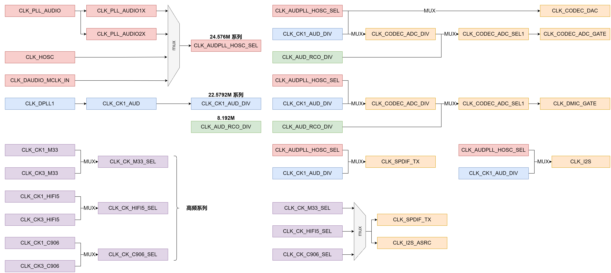
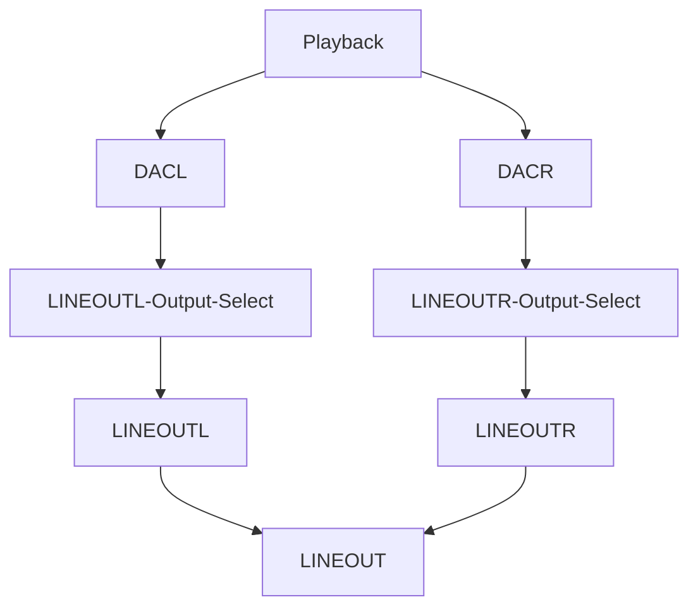
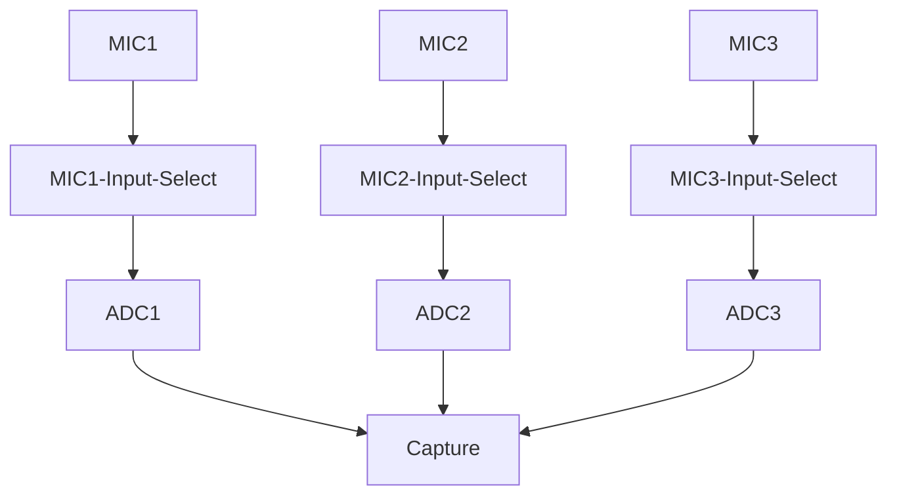
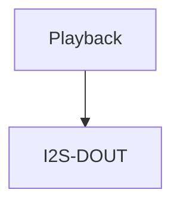
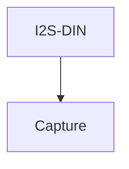
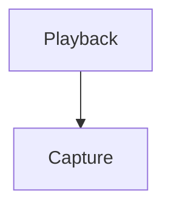
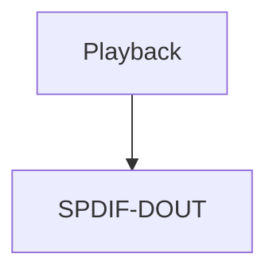
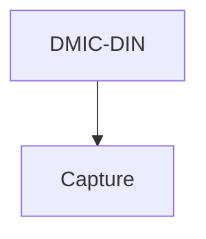
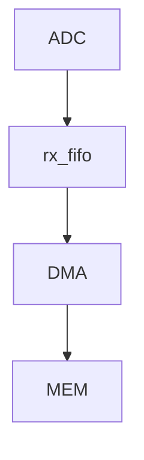
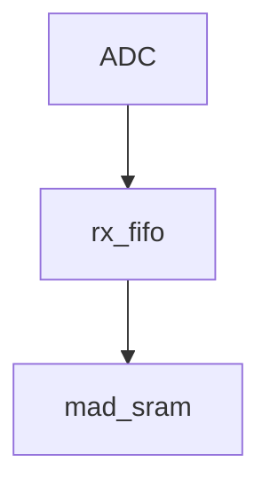

# 音频框架

## 简介

本文档基于 RTOS 平台基础音频框架介绍，能够让使用者在 RTOS 平台开发使用音频驱动，内容分四大部分。

1. 音频时钟树-> 驱动特性-> 音频流通路->sys_config 配置-> 编译配置-> 声卡控件介绍->常见使用方法  等部分，介绍音频驱动的测试验证和使用；
2. 源码结构-> 驱动框架-> 关键数据结构-> 接口说明 等部分，介绍音频驱动的二次开发；
3. 声卡查看-> 声卡测试工具-> 外挂 CODEC 等部分，介绍声卡模块的测试验证和使用；
4. FAQ”章节：调试方法及常见问题汇总。

## 模块介绍

在 sunxi 平台中，从软件上通常存在5 类音频设备，如下：

- AudioCodec
- I2S/PCM
- AHUB
- DMIC
- S/PDIF

以上每一类音频设备均适配ASoC 架构。

对于 R128 平台，具有以下音频接口资源

- AudioCodec x1
- I2S/PCM x1
- S/PDIF x1
- DMIC x1

另外还具有 MAD 模块，用于语音能量检测，非接口类型。

### 音频时钟树

R128 音频模块时钟源有4 个系列，分别为24.576MHz、22.5792MHz、8.192MHz 以及高频时钟。

- 24.576MHz、22.5792MHz 用于 Audiocodec、I2S/PCM 的播放和录音，S/PDIF 的播放，DMIC 的录音；
- 8.192MHz 用于系统休眠时供 Audiocodec、DMIC 录音，以及 mad 模块；
- 高频时钟用于 S/PDIF 的录音，以及 I2S/PCM 的 ASRC 模块；

时钟树如下图所示：



## AudioCodec

### 驱动特性

- 支持多种采样率格式
  - 播放：8~384kHz
  - 录音：8~96kHz
- 支持多通道播放和录音
  - 播放：1~2
  - 录音：1~3
- 支持16/24/32bit 数据精度（硬件支持16/24bit）
- 支持硬件HPF、DRC、EQ 算法
- 支持的物理接口
  - INPUT : MIC
  - OUTPUT: LINEOUT
  - MIC, LINEOUT 支持差分和单端模式
- 支持同时playback 和capture (全双工模式)

### 音频通路

1. 播放流



2. 录音流



### 驱动配置

驱动配置在 menuconfig 中在下列位置

```
Drivers Options --->
	soc related device drivers --->
		SOUND Devices --->
			[*] Sound card support
				AllWinner CODEC drivers --->
					[*] Allwinner AudioCodec support
						Allwinner AudioCodec Choose --->
						[*] Allwinner AudioCodec DAC Support 
						[*] Allwinner AudioCodec ADC Support
```

其中 `Allwinner AudioCodec DAC Support ` 是 DAC 模块，`Allwinner AudioCodec ADC Support` 是 ADC 模块。

### 声卡控件

声卡控件可以通过 `AudioCodec-DAC` 命令查看。

```c
# AudioCodec-DAC
    Card Name:audiocodecdac.
    numid=0, name='DACL dig volume'
    value=129, min=0, max=255
    numid=1, name='DACR dig volume'
    value=129, min=0, max=255
    numid=2, name='LINEOUTL switch'
    value=on, enum=off on
    numid=3, name='LINEOUTR switch'
    value=on, enum=off on
    # AudioCodec-ADC
    Card Name:audiocodecadc.
    numid=0, name='bind mad function'
    value=unbound, enum=unbound mad_bind
    numid=1, name='lpsd channel sel function'
    value=0th_chan, enum=0th_chan 1st_chan 2nd_chan 3rd_chan 4th_chan 5th_chan 6 th_chan 7th_chan
    numid=2, name='mad standby channel sel function'
    value=Zero_Chan, enum=Zero_Chan Two_Chan Three_Chan Four_Chan
    numid=3, name='mad standby control'
    value=RESUME, enum=RESUME SUSPEND
    numid=4, name='MIC1 volume'
    value=31, min=0, max=31
    numid=5, name='MIC2 volume'
    value=31, min=0, max=31
    numid=6, name='MIC3 volume'
    value=31, min=0, max=31
    numid=7, name='MIC1 switch'
    value=on, enum=off on
    numid=8, name='MIC2 switch'
    value=on, enum=off on
    numid=9, name='MIC3 switch'
    value=on, enum=off on
```

控件名称与功能如下表所示：

| 控件名称        | 功能              | 数值                    |
| --------------- | ----------------- | ----------------------- |
| DACL dig volume | DACL 数字音量调节 | 0->255 (-64->63dB)      |
| DACR dig volume | DACR 数字音量调节 | 0->255 (-64->63dB)      |
| MIC1 volume     | MIC1 增益调节     | 0->31 (0,6,6,6,9->36dB) |
| MIC2 volume     | MIC2 增益调节     | 0->31 (0,6,6,6,9->36dB) |
| MIC3 volume     | MIC3 增益调节     | 0->31 (0,6,6,6,9->36dB) |
| LINEOUTL switch | LINEOUTL 输出开关 | off;on                  |
| LINEOUTR switch | LINEOUTR 输出开关 | off;on                  |
| MIC1 switch     | MIC1 输入开关     | off;on                  |
| MIC2 switch     | MIC2 输入开关     | off;on                  |
| MIC3 switch     | MIC3 输入开关     | off;on                  |

### 使用方法

!> 假设 AudioCodec-DAC 声卡序号为 0，AudioCodec-ADC 声卡序号为 1。

#### 录音

用 MIC1 录音，并将数据保存在 /data/test.wav 文件

```shell
# 打开 MIC1 switch
~# amixer -c 1 set 7 1
Card Name:  audiocodecadc. numid=7,
			name='MIC1 switch'
			value=on, enum=off on

# 执行录音操作
~# arecord /data/test.wav -D hw:audiocodecadc -c 2 -r 16000 -d 5 -p 320 -b 1280

card:        hw:audiocodecadc
period_size: 320
buffer_size: 1280

malloc rest=320000
please wait...writing data(320000 bytes) into /data/test.wav
write finish...

riffType:   RIFF
waveType:   WAVE
channels:   2
rate:       16000
bits:       16
align:      4
data size:  320000
```

#### 播放

播放 /data/test.wav 音频文件

```
# 打开LINEOUTL/R switch
~# amixer -c 0 set 2 1
Card Name:  audiocodecdac. numid=2,
			name='LINEOUTL switch'
			value=on, enum=off on
			
~# amixer -c 0 set 3 1
Card Name:  audiocodecdac.
			numid=3, name='LINEOUTR switch'
			value=on, enum=off on

# 执行播放操作
~# aplay /data/test.wav -D hw:audiocodecdac -p 320 -b 1280

riffType:   RIFF
waveType:   WAVE
channels:   2
rate:       16000
bits:       16
align:      4
data size:  320000
```

## I2S/PCM

数字音频信号传输标准 I2S/PCM

### 驱动特性

- 支持多种采样率格式
  - 播放：8~384kHz
  - 录音：8~384kHz
- 支持多通道播放和录音
  - 播放：1~16
  - 录音：1~16
- 支持16/20/24/32bit 数据精度（硬件支持8/12/16/20/24/28/32bit）
- 支持 5 种TDM 模式
  - I2S standard mode
  - Left-justified mode
  - Right-justified mode
  - DSP-A mode (short frame PCM mode)
  - DSP-B mode (long frame PCM mode)
- 支持loopback 回环模式
- 支持同时playback 和capture (全双工模式)
- 支持硬件重采样
- 支持多声卡同源播放
- 支持多声卡同步录音

### 音频通路

1. 播放流



2. 录音流



3. 回环流



### 引脚模式配置

```shell
[daudio0]
pin_mclk = port:PA23<2><0><1><default>
pin_bclk = port:PA20<2><0><1><default>
pin_lrck = port:PA19<2><0><1><default>
pin_dout0 = port:PA22<2><0><1><default>
pin_din0 = port:PA21<2><0><1><default>
tdm_num = 0
daudio_master = 4
audio_format = 1
signal_inversion = 1
pcm_lrck_period = 64
slot_width_select = 32
msb_lsb_first = 0
frametype = 0
tx_data_mode = 0
rx_data_mode = 0
tdm_config = 1
mclk_div = 2
rx_sync_en = 0
rx_sync_ctl = 0
```

配置项说明：

| 配置项名称        | 配置项说明                                                   |
| ----------------- | ------------------------------------------------------------ |
| pin_mclk          | MCLK 引脚的设置                                              |
| pin_bclk          | BCLK 引脚的设置                                              |
| pin_lrck          | LRCK 引脚的设置                                              |
| pin_dout0         | DOUT0 引脚的设置                                             |
| pin_din0          | DIN0 引脚的设置                                              |
| tdm_num           | I2S 使用数量的设置                                           |
| daudio_master     | 设备主从模式的设置<br />1：BCLK、LRCK 由外部 CODEC 提供；<br />2：BCLK 由 SoC 提供，LRCK 由外部 CODEC 提供；<br />3：BCLK 由外部 CODEC 提供，LRCK 由 SoC 提供；<br />4：BCLK、LRCK 由 SoC 提供 |
| audio_format      | 5 种 TDM 模式的设置，标准模式为 1、左对齐模式为 2、右对齐模式为 3、长帧模式为 4、短帧模式为 5 |
| signal_inversion  | BCLK 和 MCLK 信号的翻转选择，默认都不翻转，为 1，MCLK 翻转为 2，BCLK 为 3，都翻转则为 4 |
| pcm_lrck_period   | LRCK 的宽度，可选项: 16/32/64/128/256                        |
| slot_width_select | slot 的宽度，可选项: 8/16/32                                 |
| msb_lsb_first     | 大小端的设置，0 为大端，1 为小端                             |
| frametype         | 长帧模式和短帧模式的选择，0 为短帧，1 为长帧                 |
| tx_data_mode      | 发送端数据格式的选择，0 为 16 位线性 pcm 数据                |
| rx_data_mode      | 接收端数据格式的选择，0 为 16 位线性 pcm 数据                |
| tdm_config        | 设置 TDM 模式，0 为 DSP 的两个模式，1 为 I2S 的三种模式      |
| mclk_div          | MCLK 分频系数，为 0 时无输出，可选项: 1/2/4/6/8/12/16/24/32/48/64/96/128/176/192 |
| rx_sync_en        | 同步录音功能的使能                                           |
| rx_sync_ctl       | 设置同步录音功能是否透出控件开关                             |

### 驱动配置

驱动配置在 menuconfig 中在下列位置

```
Drivers Options --->
	soc related device drivers --->
		SOUND Devices --->
			[*] Sound card support
				Platform(Audio Interface) drivers --->
					[*] Allwinner Digital Audio Support
						Allwinner Digital Audio Choose --->
							[*] Allwinner Daudio0 Support 
							[*] Allwinner Daudio1 Support 
							[*] Allwinner Daudio2 Support 
							[*] Allwinner Daudio3 Support
```

配置项说明

- Allwinner Daudio0 Support
  - I2S/PCM0 模块

- Allwinner Daudio1 Support
  - I2S/PCM1 模块
- Allwinner Daudio2 Support
  - I2S/PCM2 模块
- Allwinner Daudio3 Support
  - I2S/PCM3 模块

### 声卡控件

控件列表：

```
Card Name:snddaudio0.
	numid=0, name='tx hub mode'
		value=Off, enum=Off On
	numid=1, name='rx sync mode'
		value=Off, enum=Off On
	numid=2, name='loopback debug'
		value=Off, enum=Off On
	numid=3, name='sunxi daudio asrc function'
		value=Off, enum=Off On
```

控件名称与功能如下表所示：

| 控件名称                   | 功能         | 数值   |
| -------------------------- | ------------ | ------ |
| tx hub mode                | 同源播放开关 | Off;On |
| rx sync mode               | 同步采样开关 | Off;On |
| loopback debug             | 内部回录开关 | Off;On |
| sunxi daudio asrc function | 重采样开关   | Off;On |

### 使用方法

!> 假设 snddaudio0 声卡序号为 2

#### 录音

```
~# arecord /data/test.wav -D hw:snddaudio0

card:          hw:snddaudio0
period_size:   1024
buffer_size:   4096
please set capture duration..
please wait...writing data(0 bytes) into /data/test.wav 
write finish...

riffType:   RIFF
waveType:   WAVE
channels:   3
rate:       16000
bits:       16
align:      6
data size:  0
```

#### 播放

```
~# aplay /data/test.wav -D hw:snddaudio0

riffType:   RIFF
waveType:   WAVE
channels:   3
rate:       16000
bits:       16
align:      6
data size:  0
```

#### snddaudio0 声卡内部回环，播录音频格式需保持一致

```
# 1.打开 loopback 开关
~# amixer -c 2 set 2 1

Card Name:snddaudio0.
	numid=2, name='loopback debug'
			value=On, enum=Off On
			
# 2.后台播放音频
~# fork aplay /data/test.wav -D hw:snddaudio0

riffType:   RIFF
waveType:   WAVE
channels:   3
rate:       16000
bits:       16
align:      6
data size:  0

# 3.执行录音操作
~# arecord /data/test.wav -D hw:snddaudio0

card:          hw:snddaudio0
period_size:   1024
buffer_size:   4096
please set capture duration..
please wait...writing data(0 bytes) into /data/test.wav 
write finish...

riffType:   RIFF
waveType:   WAVE
channels:   3
rate:       16000
bits:       16
align:      6
data size:  0
```

## S/PDIF

S/PDIF 数字音频接口

### 驱动特性

- 支持多种采样率格式
  - 播放：22.05~192kHz
  - 录音：22.05~192kHz
- 支持多通道播放和录音
  - 播放：1~2
  - 录音：1~2
- 支持 16/20/24/32bit 数据精度（硬件支持 16/20/24bit）
- 支持 loopback 回环模式
- 支持同时 playback 和 capture (全双工模式)
- 支持 IEC-60958 协议
- 支持 IEC-61937 协议
- 支持多声卡同源播放
- 支持透传播放

### 音频通路

1. 播放通路



2. 录音通路

``````mermaid
graph TD;
	SPDIF-DIN-->Capture
``````

### 驱动配置

驱动配置在 menuconfig 中在下列位置

```
Drivers Options --->
	soc related device drivers --->
		SOUND Devices --->
			[*] Sound card support
				Platform(Audio Interface) drivers --->
					[*] Allwinner SPDIF Support
```

配置项说明

- Allwinner SPDIF Support
  - SPDIF 模块

### 声卡控件

控件列表：

```
Card Name:sndspdif.
numid=0, name='spdif audio format function'
	value=PCM, enum=PCM DTS
numid=1, name='spdif rx data type'
	value=IEC-60958, enum=IEC-60958 IEC-61937 numid=2, name='spdif audio hub mode'
	value=Disabled, enum=Disabled Enabled
numid=3, name='sunxi spdif loopback debug'
	value=0, min=0, max=1
```

| 控件名称                    | 功能             | 数值                |
| --------------------------- | ---------------- | ------------------- |
| spdif audio format function | 设置音频数据格式 | PCM DTS             |
| spdif rx data type          | 设置传输协议     | IEC-60958 IEC-61937 |
| spdif audio hub mode        | 同源输出开关     | Disabled : Enabled  |
| sunxi spdif loopback debug  | 内部回录开关     | 0：关闭 1：打开     |

### 使用方法

#### 播放

```c
# 播放音频
~# aplay /data/test.wav -D hw:sndspdif

riffType:   RIFF
waveType:   WAVE
channels:   2
rate:       16000
bits:       16
align:      4
data size:  320000
```

## DMIC

双/立体声数字麦克风接口。

### 驱动特性

- 支持多种采样率格式
  - 8~48kHz
- 支持多通道录音
  - channels：1~8
- 支持16/24bit 数据精度
- 支持硬件HPF 算法
- 支持多声卡同步录音

### 音频通路

1. 录音流



### 驱动配置

驱动配置在 menuconfig 中在下列位置

```c
Drivers Options --->
    soc related device drivers --->
        SOUND Devices --->
            [*] Sound card support
                Platform(Audio Interface) drivers --->
                	[*] Allwinner DMIC Support
```

配置项说明

- Allwinner DMIC Support
  - DMIC 模块

### 使用方法

```
# 录音
~# arecord /data/test.wav -D hw:snddmic -c 2 -r 16000 -d 5 -p 320 -b 1280

card:          hw:snddmic
period_size:   320
buffer_size:   1280
malloc rest=   320000
please set capture duration..
please wait...writing data(0 bytes) into /data/test.wav 
write finish...

riffType:   RIFF
waveType:   WAVE
channels:   2
rate:       16000
bits:       16
align:      4
data size:  320000
```

## MAD

麦克风激活检测(Microphone Activity Detection，MAD)，用于语音唤醒方案

### 驱动特性

- 支持AudioCodec、DMIC 音频传输接口；
- 支持16kHz, 48kHz 采样率，固定16bit；
- 支持一块64KB 的SRAM，可用于保存音频数据；
- 支持基于能量识别的语音检测模块LPSD（只支持单通道，16bit 数据，16kHz 采样率）。

## 音频通路

1. 唤醒状态，正常录音



2. 进入休眠，语言能量检测



3. 触发唤醒，继续录音


### 驱动配置

驱动配置在 menuconfig 中在下列位置

```
Drivers Options --->
    soc related device drivers --->
        SOUND Devices --->
            [*] Sound card support
                Platform(Audio Interface) drivers --->
                	[*] Allwinner MAD Support
```

!> 需要同时使能录音源模块驱动才可正常工作，如录音源为AudioCodec，则需使能AudioCodec 驱动。

### 声卡控件

?> 以mad 绑定AudioCodec 声卡为例。

控件列表：

```
Card Name:audiocodecadc.
	numid=0, name='bind mad function'
		value=unbound, enum=unbound mad_bind
	numid=1, name='lpsd channel sel function'
		value=0th_chan, enum=0th_chan 1st_chan 2nd_chan 3rd_chan 4th_chan 5th_chan 6th_chan 7th_chan
	numid=2, name='mad standby channel sel function'
		value=Zero_Chan, enum=Zero_Chan Two_Chan Three_Chan Four_Chan
	numid=3, name='mad standby control'
		value=RESUME, enum=RESUME SUSPEND
	numid=4, name='MIC1 volume'
		value=31, min=0, max=31
	numid=5, name='MIC2 volume'
		value=31, min=0, max=31
	numid=6, name='MIC3 volume'
		value=31, min=0, max=31
	numid=7, name='MIC1 switch'
		value=on, enum=off on
	numid=8, name='MIC2 switch'
		value=on, enum=off on
	numid=9, name='MIC3 switch'
		value=on, enum=off on
```

如上，控件0-3 为mad 模块控件，控件4-9 为AudioCodec 模块控件。

| 控件名称                         | 功能                      | 数值                         |
| -------------------------------- | ------------------------- | ---------------------------- |
| bind mad function                | 是否绑定 MAD 功能         | 0: 不绑定; 1: 绑定           |
| lpsd channel sel Function        | 选择作为能量唤醒的通道    | 0: 通道 0; 1: 通道 1;        |
| mad_standby channel sel Function | 设定休眠时 mad 录音通道数 | Zero_Chan: 实际录音通道      |
| mad standby control              | 休眠测试使用              | Two_Chan: 只录制两通道Off;On |

### 使用方法

#### 语音唤醒

安静环境下，开启录音后进入休眠暂停录音，此时外界制造音量较大的声音，mad 模块触发唤醒
cpu，并自动继续录音。

1. 录音前控件设置

假设使用AudioCodec 模块MIC1 单通道作为能量能量唤醒通道。

```
~# amixer -c 0 set "bind mad function" 1
~# amixer -c 0 set "lpsd channel sel function" 0
~# amixer -c 0 set "mad standby channel sel function" 0
~# amixer -c 0 set "MIC2 switch" 0
~# amixer -c 0 set "MIC3 switch" 0
```

2. 开启录音

```
# 录音参数为单通道、16kHz采样率、16bit。
~# fork arecord -D hw:audiocodecadc -c 1 -r 16000 -d 20 -p 320 -b 1280 /data/test.wav
```

3. 进入休眠

```
# 如使用休眠测试命令进入休眠，此时arecord 录音将被暂停
~# rpccli arm standby
```

4. 外界声音唤醒

制造较大音量的外界声音，系统唤醒，并自动恢复arecord 录音，查看录音文件可录到外界唤醒声音。

#### 语音唤醒能量唤醒阈值参数

语音唤醒能量唤醒阈值参数能量唤醒模块lpsd，识别能量主要有两个方向，瞬时能量和累计能量（前者比如是关门声，后者比如是不断说话）能量检测参数配置在 `lichee/rtos-hal/hal/source/sound/platform/sunximad.c` 修改。

| 参数名称   | 功能                 | 可设范围     | 推荐值 |
| ---------- | -------------------- | ------------ | ------ |
| lpsd_th    | 累积语音能量检测阈值 | 0x0 - 0xFFFF | 1200   |
| lpsd_rrun  | 语音能量检测开始时间 | 0x0 - 0xFF   | 145    |
| lpsd_rstop | 语音能量检测结束时间 | 0x0 - 0xFF   | 170    |

- 瞬时能量检测参数，主要是 lpsd_rrun 和 lpsd_rstop。

  - 一般只对 stop 值进行修改;

  - 如果录音数据经常缺少唤醒词的第一个字，则可以尝试降低 stop 值，可以有效提高唤醒词数据的完整性。但同时会提高误唤醒率，环境噪音也会很容易触发能量检测，唤醒系统;

  - 如果想要降低误唤醒率 (环境噪音造成唤醒)，则可以尝试提高 stop 值。同样的，这会导致一些唤醒词录音数据不完整，例如一些音量较低，音调较低的语料;

  - 唤醒词识别率以及误唤醒率无法同时兼得，客户需要根据实际需求、场景，权衡配置参数;

- 累积能量检测参数，主要是 lpsd_th。
  - 建议使用默认值 1200，建议修改范围 50~1200。

## 模块接口说明

### 源文件列表

1. `platform` 层

```
lichee/rtos-hal/hal/source/sound/platform .
├── Kconfig
├── Makefile
├── objects.mk
├── sun8iw19-daudio.c
├── sunxi-daudio.c           # platform 层 –> I2S/PCM，负责 I2S/PCM 模块硬件参数、DMA 相关配置。
├── sunxi-daudio.h           # platform 层 –> I2S/PCM，负责 I2S/PCM 模块硬件参数、DMA 相关配置。
├── sunxi-dmic.c
├── sunxi-dmic.h
├── sunxi-dummy-cpudai.c     # platform 层 –> AudioCodec，负责 AudioCodec 模块 DMA 相关配置。
├── sunxi-mad.c
├── sunxi-mad.h
├── sunxi-pcm.c              # platform 层 –> 公共部分，负责音频流传输，使用 DMA 方式，提供注册 platform 设备的公共函数。
├── sunxi-pcm.h              # platform 层 –> 公共部分，负责音频流传输，使用 DMA 方式，提供注册 platform 设备的公共函数。
├── sunxi-spdif.c            # platform 层 –> SPDIF，负责 SPDIF 模块硬件参数、DMA 相关配置。
├── sunxi-spdif.h            # platform 层 –> SPDIF，负责 SPDIF 模块硬件参数、DMA 相关配置。
├── platforms
    ├── daudio-sun20iw2.h    # platform 层 –> DMIC、SPDIF、DAUDIO 时钟框架代码
    ├── dmic-sun20iw2.h      # platform 层 –> DMIC、SPDIF、DAUDIO 时钟框架代码
    ├── mad-sun20iw2.c       # platform 层 –> DMIC、SPDIF、DAUDIO 时钟框架代码
    ├── mad-sun20iw2.h       # platform 层 –> DMIC、SPDIF、DAUDIO 时钟框架代码
    ├── spdif-sun20iw2.h     # platform 层 –> DMIC、SPDIF、DAUDIO 时钟框架代码
```

2. `codec` 层

```
lichee/rtos-hal/hal/source/sound/codecs .
├── ac101s.c               # codec 层 –> AC101s codec
├── ac101s.h               # codec 层 –> AC101s codec
├── dummy_codec.c          
├── sun20iw2-codec-adc.c   # codec 层 –> AudioCodec，负责 AudioCodec 模块硬件参数配置
├── sun20iw2-codec.c       # codec 层 –> AudioCodec，负责 AudioCodec 模块硬件参数配置
├── sun20iw2-codec-dac.c   # codec 层 –> AudioCodec，负责 AudioCodec 模块硬件参数配置
├── sun20iw2-codec.h       # codec 层 –> AudioCodec，负责 AudioCodec 模块硬件参数配置
├── sunxi-codec.h          # codec 层 –> 公共部分
├── sunxi_rw_func.c
```

3. `machine` 层

```
lichee/rtos/projects/xxx/src .
├── card_default.c         # 负责 platform 层和 codec 层绑定。
```

## 软件框图

### 关键数据结构

#### pcm 数据类结构体

1. `sunxi_dma_params`

定义audio DAI DMA 相关参数。

```c
struct sunxi_dma_params {
	char *name;
	dma_addr_t dma_addr;
	uint32_t src_maxburst;
	uint32_t dst_maxburst;
	uint8_t dma_drq_type_num;
};
```

2. platform 类结构体 

- `DAUDIO`

I2S/PCM 模块总结构体，包含基础平台资源、特定功能私有参数

```c
struct sunxi_daudio_info {
	struct snd_platform *platform;
	struct sunxi_daudio_clk clk;
	struct daudio_pinctrl *pinctrl;
	uint8_t pinctrl_num;
	struct pa_config *pa_cfg;
	uint8_t pa_cfg_num;

	struct sunxi_daudio_param param;
	struct sunxi_dma_params playback_dma_param;
	struct sunxi_dma_params capture_dma_param;

	uint8_t global_enable;
	unsigned int hub_mode;
	bool playback_en;
	bool capture_en;
	int asrc_en;
};
```

- `SPDIF`

```c
/* 用于描述引脚*/
typedef struct {
    gpio_pin_t gpio;
    unsigned int mux;
} spdif_gpio;

/* 用于描述SPDIF 引脚*/
typedef struct {
    spdif_gpio out;
    spdif_gpio in;
} spdif_gpio_t;

/* 包含了DMA 相关参数以及时钟结构体*/
struct sunxi_spdif {
    struct sunxi_dma_params playback_dma_param;
    struct sunxi_dma_params capture_dma_param;
    struct sunxi_spdif_clk clk;
};
```

- `DMIC`

```c
/* 用于描述引脚*/
typedef struct {
    gpio_pin_t gpio;
    int mux;
} dmic_gpio;

/* 用于描述DMIC 引脚*/
typedef struct {
    dmic_gpio clk;
    dmic_gpio din0;
    dmic_gpio din1;
    dmic_gpio din2;
    dmic_gpio din3;
} dmic_gpio_t;

/* 用于描述DMIC 采样率*/
struct dmic_rate {
    unsigned int samplerate;
    unsigned int rate_bit;
};

/* 包含了DMA 相关参数，通道数以及时钟结构体*/
struct sunxi_dmic {
    struct sunxi_dma_params capture_dma_param;
    u32 chanmap;
    struct sunxi_dmic_clk clk;
};
```

### codec 类结构体

#### AudioCodec

AudioCodec 模块总结构体，包含基础平台资源、特定功能私有参数

```c
struct sunxi_codec_info {
	struct snd_codec *codec;

	void *codec_base_addr;
	struct sunxi_codec_clk clk;
	struct sunxi_codec_param param;

#ifdef CONFIG_SND_PLATFORM_SUNXI_MAD
	int capturing;
	struct sunxi_mad_priv mad_priv;
#endif
};
```

## 软件重要接口

!> 仅说明自定义软件接口，alsa 框架内部接口不做说明。

### pcm 相关接口

#### 创建 pcm 设备

函数原型：

```c
int sunxi_pcm_new(struct snd_pcm *pcm)
```

参数:

- pcm: pcm设备信息

返回值:

- 0: 成功
- 其他:失败

#### 释放 pcm 设备

函数原型

```c
void sunxi_pcm_free_dma_buffer(struct snd_pcm *pcm, int stream)
```

参数:

- pcm: pcm设备信息
- stream: pcm 流信息

返回值: 无

#### 开启 pcm 设备

函数原型:

```c
int sunxi_pcm_open(struct snd_pcm_substream *substream)
```

参数:

- substream: pcm 子流信息

返回值:

- 0: 成功
- 其他:失败

#### 设置 pcm 设备参数

函数原型:

```c
int sunxi_pcm_hw_params(struct snd_pcm_substream *substream, struct snd_pcm_hw_params *params)
```

参数:

- substream: pcm 子流信息
- params: pcm 硬件参数

返回值:

- 0: 成功
- 其他:失败

#### 触发 pcm 设备运行

函数原型:

```c
int sunxi_pcm_trigger(struct snd_pcm_substream *substream, int cmd)
```

参数:

- substream: pcm 子流信息
- cmd: 触发命令

返回值:

- 0: 成功
- 其他:失败

#### 获取 pcm 设备帧点

函数原型:

```c
snd_pcm_uframes_t snd_dmaengine_pcm_pointer(struct snd_pcm_substream *substream)
```

参数:

- substream: pcm 子流信息

返回值:

- snd_pcm_uframes_t：当前DMA 缓冲指针

### Platform 层接口

#### AudioCodec接口

##### 初始化 DMA 参数

函数原型:

```c
int sunxi_cpudai_platform_probe(struct snd_platform *platform)
```

参数:

- platform: platform 信息

返回值:

- 0: 成功
- 其他:失败

##### 更新设置 DMA 参数

函数原型:

```c
int sunxi_cpudai_startup(struct snd_pcm_substream *substream, struct snd_dai *dai)
```

参数:

- substream: pcm 子流信息
- dai: cpu dai 信息

返回值:

- 0: 成功
- 其他:失败

#### I2S/PCM接口

##### I2S/PCM 模块休眠（保存寄存器、关闭时钟）

函数原型:

```c
int sunxi_daudio_suspend(struct pm_device *dev, suspend_mode_t mode)
```

参数:

- dev: 设备信息
- mode: 休眠模式

返回值:

- 0: 成功
- 其他:失败

##### I2S/PCM 模块唤醒（开启时钟、初始化模块、恢复寄存器）

函数原型:

```c
int sunxi_daudio_resume(struct pm_device *dev, suspend_mode_t mode)
```

参数:

- dev: 设备信息
- mode: 休眠模式

返回值:

- 0: 成功
- 其他:失败

##### 设置模块BCLK 分频系数

函数原型:

```c
int sunxi_daudio_set_clkdiv(struct snd_dai *dai, int clk_id, int clk_div)
```

参数:

- dai: cpu dai 信息
- clk_id: clk 辅助信息
- clk_div: clk 分频系数

返回值:

- 0: 成功
- 其他:失败

##### 设置模块工作时钟

函数原型:

```c
int sunxi_daudio_set_sysclk(struct snd_dai *dai, int clk_id, unsigned int freq, int dir)
```

参数:

- dai: cpu dai 信息
- clk_id: clk 辅助信息
- freq: 时钟频率
- dir: 时钟输出方向

返回值:

- 0: 成功
- 其他:失败

##### 设置模块I2S 格式

函数原型:

```c
int sunxi_daudio_set_fmt(struct snd_dai *dai, unsigned int fmt)
```

参数:

- dai: cpu dai 信息
- fmt: I2S 格式信息

返回值:

- 0: 成功
- 其他:失败

##### 设置模块开启工作资源(DMA 参数、组件功能等)

函数原型:

```c
int sunxi_daudio_startup(struct snd_pcm_substream *substream, struct snd_dai *dai)
```

参数:

- substream: pcm 子流信息
- dai: cpu dai 信息

返回值:

- 0: 成功
- 其他:失败

##### 设置模块硬件参数

函数原型:

```c
int sunxi_daudio_hw_params(struct snd_pcm_substream *substream, struct snd_pcm_hw_params *params, struct snd_dai *dai)
```

参数:

- substream: pcm 子流信息
- params: 硬件参数
- dai: cpu dai 信息

返回值:

- 0: 成功
- 其他:失败

##### 清除模块fifo

函数原型:

```c
int sunxi_daudio_prepare(struct snd_pcm_substream *substream, struct snd_dai *dai)
```

参数:

- substream: pcm 子流信息
- dai: cpu dai 信息

返回值:

- 0: 成功
- 其他:失败

##### 触发模块工作

函数原型:

```c
int sunxi_daudio_trigger(struct snd_pcm_substream *substream, int cmd, struct snd_dai *dai)
```

参数:

- substream: pcm 子流信息
- cmd: 触发命令
- dai: cpu dai 信息

返回值:

- 0: 成功
- 其他:失败

##### 设置模块关闭工作资源(组件功能等)

函数原型:

```c
void sunxi_daudio_shutdown(struct snd_pcm_substream *substream, struct snd_dai *dai)
```

参数:

- substream: pcm 子流信息
- dai: cpu dai 信息

返回值:

- 0: 成功
- 其他:失败

#### SPDIF

##### 初始化cpu dai (DMA、模块寄存器)

函数原型:

```c
int sunxi_spdif_dai_probe(struct snd_dai *dai)
```

参数:

- dai: cpu dai 信息

返回值:

- 0: 成功
- 其他:失败

##### 模块休眠（保存寄存器、关闭时钟）

函数原型:

```c
int sunxi_spdif_suspend(struct pm_device *dev, suspend_mode_t mode)
```

参数：

- dev: 设备信息
- mode: 休眠模式

返回值:

- 0: 成功
- 其他:失败

##### 模块唤醒（开启时钟、初始化模块、恢复寄存器）

函数原型:

```c
int sunxi_spdif_resume(struct pm_device *dev, suspend_mode_t mode)
```

参数：

- dev: 设备信息
- mode: 休眠模式

返回值:

- 0: 成功
- 其他:失败

##### 设置模块分频系数

函数原型：

```c
int sunxi_spdif_set_clkdiv(struct snd_dai *dai, int clk_id, int clk_div)
```

参数：

- dai: cpu dai 信息
- clk_id: clk 辅助信息
- clk_div: clk 分频系数

返回值:

- 0: 成功
- 其他:失败

##### 设置模块工作时钟

函数原型：

```c
int sunxi_spdif_set_sysclk(struct snd_dai *dai, int clk_id, unsigned int freq, int dir)
```

参数：

- dai: cpu dai 信息
- clk_id: clk 辅助信息
- freq: 时钟频率
- dir: 时钟输出方向

返回值:

- 0: 成功
- 其他:失败

##### 设置模块开启工作资源(DMA 参数、组件功能等)

函数原型：

```c
int sunxi_spdif_startup(struct snd_pcm_substream *substream, struct snd_dai *dai)
```

参数：

- substream: pcm 子流信息
- dai: cpu dai 信息

返回值:

- 0: 成功
- 其他:失败

##### 设置模块硬件参数

函数原型：

```c
int sunxi_spdif_hw_params(struct snd_pcm_substream *substream, struct snd_pcm_hw_params *params, struct snd_dai *dai)
```

参数：

- substream: pcm 子流信息
- params: 硬件参数
- dai: cpu dai 信息

返回值:

- 0: 成功
- 其他:失败

##### 清除模块fifo，清除中断

函数原型：

```c
int sunxi_spdif_prepare(struct snd_pcm_substream *substream, struct snd_dai *dai)
```

参数：

- substream: pcm 子流信息
- dai: cpu dai 信息

返回值:

- 0: 成功
- 其他:失败

##### 触发模块工作

函数原型：

```c
int sunxi_spdif_trigger(struct snd_pcm_substream *substream, int cmd, struct snd_dai *dai)
```

参数：

- substream: pcm 子流信息
- cmd: 触发命令
- dai: cpu dai 信息

返回值:

- 0: 成功
- 其他:失败

#### DMIC

##### 初始化cpu dai (DMA、模块寄存器)

函数原型：

```c
int sunxi_dmic_dai_probe(struct snd_dai *dai)
```

参数：

- dai: cpu dai 信息

返回值:

- 0: 成功
- 其他:失败

##### 模块休眠（保存寄存器、关闭时钟）

函数原型：

```c
int sunxi_dmic_suspend(struct pm_device *dev, suspend_mode_t mode)
```

参数：

- dev: 设备信息
- mode: 休眠模式

返回值:

- 0: 成功
- 其他:失败

##### 模块唤醒（开启时钟、恢复寄存器）

函数原型：

```c
int sunxi_dmic_resume(struct pm_device *dev, suspend_mode_t mode)
```

参数：

- dev: 设备信息
- mode: 休眠模式

返回值:

- 0: 成功
- 其他:失败

##### 设置模块 pll clk

函数原型：

```c
int sunxi_dmic_set_sysclk(struct snd_dai *dai, int clk_id, unsigned int freq, int dir)
```

参数：

- dai: cpu dai 信息
- clk_id: clk 辅助信息
- freq: 时钟频率
- dir: 时钟输出方向

返回值:

- 0: 成功
- 其他:失败

##### 设置模块开启工作资源(DMA 参数、组件功能等)

函数原型：

```c
int sunxi_dmic_startup(struct snd_pcm_substream *substream, struct snd_dai *dai)
```

参数：

- substream: pcm 子流信息
- dai: cpu dai 信息

返回值:

- 0: 成功
- 其他:失败

##### 设置模块硬件参数

函数原型：

```c
int sunxi_dmic_hw_params(struct snd_pcm_substream *substream, struct snd_pcm_hw_params *params, struct snd_dai *dai)
```

参数：

- substream: pcm 子流信息
- params: 硬件参数
- dai: cpu dai 信息

返回值:

- 0: 成功
- 其他:失败

##### 清除模块 fifo，清除中断

函数原型：

```c
int sunxi_dmic_prepare(struct snd_pcm_substream *substream, struct snd_dai *dai)
```

参数：

- substream: pcm 子流信息
- dai: cpu dai 信息

返回值:

- 0: 成功
- 其他:失败

##### 触发模块工作

函数原型：

```c
int sunxi_dmic_trigger(struct snd_pcm_substream *substream, int cmd, struct snd_dai *dai)
```

参数：

- substream: pcm 子流信息
- cmd: 触发命令
- dai: cpu dai 信息

返回值:

- 0: 成功
- 其他:失败

### Codec 层

#### AudioCodec(ADC/DAC)

##### 模块休眠（保存寄存器、关闭时钟）

函数原型：

```c
int sunxi_codec_suspend(struct pm_device *dev, suspend_mode_t mode)
```

参数：

- dev: 设备信息
- mode: 休眠模式

返回值:

- 0: 成功
- 其他:失败

##### 模块唤醒（开启时钟、恢复寄存器）

函数原型：

```c
int sunxi_codec_resume(struct pm_device *dev, suspend_mode_t mode)
```

参数：

- dev: 设备信息
- mode: 休眠模式

返回值:

- 0: 成功
- 其他:失败

##### 设置模块时钟

函数原型：

```c
int sunxi_codec_set_sysclk(struct snd_dai *dai, int clk_id, unsigned int freq, int dir)
```

参数：

- dai: cpu dai 信息
- clk_id: clk 辅助信息
- freq: 时钟频率
- dir: 时钟输出方向

返回值:

- 0: 成功
- 其他:失败

##### 设置模块硬件参数

函数原型：

```c
int sunxi_codec_hw_params(struct snd_pcm_substream *substream, struct snd_pcm_hw_params *params, struct snd_dai *dai)
```

参数：

- substream: pcm 子流信息
- params: 硬件参数
- dai: cpu dai 信息

返回值:

- 0: 成功
- 其他:失败

##### 清除模块fifo，清除中断

函数原型：

```c
int sunxi_codec_prepare(struct snd_pcm_substream *substream, struct snd_dai *dai)
```

参数：

- substream: pcm 子流信息
- dai: cpu dai 信息

返回值:

- 0: 成功
- 其他:失败

##### 触发模块工作

函数原型：

```c
int sunxi_codec_trigger(struct snd_pcm_substream *substream, int cmd, struct snd_dai *dai)
```

参数：

- name: 声卡名称
- codec: codec 设备信息
- platform_type: platform 层设备类型

返回值:

- 0: 成功
- 其他:失败

### 软件调试接口

| 模块   | 接口              | 命令              |
| ------ | ----------------- | ----------------- |
| DMIC   | `cmd_dmic_dump`   | `cmd_dmic_dump`   |
| SPDIF  | `cmd_spdif_dump`  | `cmd_spdif_dump`  |
| DAUDIO | `cmd_daudio_dump` | `cmd_daudio_dump` |

## 模块使用

一个声卡的简单测试，包含两部分，分别为声卡的控件设置及音频测试工具的使用。本章节将从以下 4 个通用小节和 1 个外挂 codec 小节介绍声卡如何使用。

1. menuconfig 配置
2. 声卡设备查看
3. 声卡控件
4. 声卡测试工具使用
5. I2S 外挂 CODEC

### menuconfig 配置

进入menuconfig 界面：

```c
# 进入RTOS 目录执行以下命令
mrtos_menuconfig
```

### 声卡设备查看

可输入以下命令查看系统挂载上的声卡

```c
~# amixer -l
============= Sound Card list =============
card_num card_name
    0 	audiocodecdac
    1 	audiocodecadc
    2 	snddaudio0
    3 	snddmic
    4 	sndspdif
```

?> 可通过在 `card_default.c` 修改 “card_name”  变量，设定声卡名称。

### 声卡控件

具体配置选项，根据芯片平台、内核版本、所需音频模块，各模块的常见使用方法说明和“声卡测试工具使用” 说明。

#### alsa-utils 工具

alsa-utils 主要提供三个工具：

1. aplay: 用于完成与播放相关的操作；
2. arecord: 用于完成与录音相关的操作；
3. amixer: 用于设置相关参数。

##### aplay

输入aplay 或aplay -h 可打印出使用方法

```c
~# aplay

Usage: aplay [OPTION]... [FILE]...

-h, --help help
	--version print current version
-l, --list-devices list all soundcards and digital audio devices
-L, --list-pcms list device names
-D, --device=NAME select PCM by name
-q, --quiet quiet mode
-t, --file-type TYPE file type (voc, wav, raw or au)
-c, --channels=# channels
-f, --format=FORMAT sample format (case insensitive)
-r, --rate=# sample rate
-d, --duration=# interrupt after # seconds
...
```

**查看可以用于播放的声卡**

````c
~# aplay -l
**** List of PLAYBACK Hardware Devices ****
card 0: audiocodec [audiocodec], device 0: soc@03000000:codec_plat-sunxi-snd-codec sunxisnd-codec-0 []
	Subdevices: 1/1
	Subdevice #0: subdevice #0
card 2: snddaudio0 [snddaudio0], device 0: 2032000.daudio0_plat-snd-soc-dummy-dai snd-socdummy-dai-0 []
	Subdevices: 1/1
	Subdevice #0: subdevice #0
````

**用声卡0 设备0 播放test.wav(用 ctrl c 退出)**

```c
~# aplay -D hw:0,0 test.wav
Playing WAVE 'test.wav' : Signed 16 bit Little Endian, Rate 8000 Hz, Mono

^C Aborted by signal Interrupt...
```

##### arecord

输入arecord 或arecord -h 可打印出使用方法

```c
~# arecord

Usage: arecord [OPTION]... [FILE]...

-h, --help help
	--version print current version
-l, --list-devices list all soundcards and digital audio devices
-L, --list-pcms list device names
-D, --device=NAME select PCM by name
-q, --quiet quiet mode
-t, --file-type TYPE file type (voc, wav, raw or au)
-c, --channels=# channels
-f, --format=FORMAT sample format (case insensitive)
-r, --rate=# sample rate
-d, --duration=# interrupt after # seconds
-M, --mmap mmap stream
-N, --nonblock nonblocking mode
-F, --period-time=# distance between interrupts is # microseconds
-B, --buffer-time=# buffer duration is # microseconds
```

**查看可以用于录音的声卡**

```c
~# arecord -l

**** List of CAPTURE Hardware Devices ****
card 0: audiocodec [audiocodec], device 0: soc@03000000:codec_plat-sunxi-snd-codec sunxisnd-codec-0 []
	Subdevices: 1/1
	Subdevice #0: subdevice #0
card 1: snddmic [snddmic], device 0: 2031000.dmic_plat-snd-soc-dummy-dai snd-soc-dummy-dai-0 []
	Subdevices: 1/1
	Subdevice #0: subdevice #0
card 2: snddaudio0 [snddaudio0], device 0: 2032000.daudio0_plat-snd-soc-dummy-dai snd-socdummy-dai-0 []
	Subdevices: 1/1
	Subdevice #0: subdevice #0
...
```

**用声卡1 的设备0 进行采样位数为16 的录音，并把数据保存在test.wav(用ctrl c 退出)**

```c
~# arecord -D hw:1,0 -f S16_LE test.wav

Recording WAVE 'test.wav' : Signed 16 bit Little Endian, Rate 8000 Hz, Mono

^C Aborted by signal Interrupt...
```

##### amixer

输入amixer 或amixer -h 可打印出使用方法

```c
~# amixer -h

Usage: amixer <options> [command]

Available options:
-h,--help this help
-c,--card N select the card
-D,--device N select the device, default 'default'
-d,--debug debug mode
-n,--nocheck do not perform range checking
-v,--version print version of this program
-q,--quiet be quiet
-i,--inactive show also inactive controls
-a,--abstract L select abstraction level (none or basic)
-s,--stdin Read and execute commands from stdin sequentially
-R,--raw-volume Use the raw value (default)
-M,--mapped-volume Use the mapped volume

Available commands:
scontrols show all mixer simple controls
scontents show contents of all mixer simple controls (default command)
sset sID P set contents for one mixer simple control
sget sID get contents for one mixer simple control
controls show all controls for given card
contents show contents of all controls for given card
cset cID P set control contents for one control
cget cID get control contents for one control
```

**查看声卡 1 的控件**

```c
~# amixer -c 1 scontrols

Simple mixer control 'L0 volume',0
Simple mixer control 'L1 volume',0
Simple mixer control 'L2 volume',0
Simple mixer control 'L3 volume',0
Simple mixer control 'R0 volume',0
Simple mixer control 'R1 volume',0
Simple mixer control 'R2 volume',0
Simple mixer control 'R3 volume',0
Simple mixer control 'rx sync mode',0
```

**查看声卡 1 的控件的具体配置**

```c
~# amixer -c 1 scontents
Simple mixer control 'L0 volume',0
    Capabilities: volume volume-joined
    Playback channels: Mono
    Capture channels: Mono
    Limits: 0 - 255
    Mono: 176 [69%]
Simple mixer control 'L1 volume',0
    Capabilities: volume volume-joined
    Playback channels: Mono
    Capture channels: Mono
    Limits: 0 - 255
    Mono: 176 [69%]
Simple mixer control 'L2 volume',0
    Capabilities: volume volume-joined
    Playback channels: Mono
    Capture channels: Mono
    Limits: 0 - 255
    Mono: 176 [69%]
...
```

**设置声卡 1 第一个控件的值**

```c
# 拿到声卡1所有控件
~# amixer -c 1 controls
numid=2,iface=MIXER,name='L0 volume'
numid=4,iface=MIXER,name='L1 volume'
numid=6,iface=MIXER,name='L2 volume'
numid=8,iface=MIXER,name='L3 volume'
numid=3,iface=MIXER,name='R0 volume'
numid=5,iface=MIXER,name='R1 volume'
numid=7,iface=MIXER,name='R2 volume'
numid=9,iface=MIXER,name='R3 volume'
numid=1,iface=MIXER,name='rx sync mode'

# 拿到控件内容
~# amixer cget numid=2,iface=MIXER,name='L0 volume'
numid=2,iface=MIXER,name='rx sync mode'
    ; type=ENUMERATED,access=rw------,values=1,items=2
    ; Item #0 'Off'
    ; Item #1 'On'
    : values=0

# 设置控件值
~# amixer cset numid=2,iface=MIXER,name='L0 volume' 1
numid=2,iface=MIXER,name='rx sync mode'
    ; type=ENUMERATED,access=rw------,values=1,items=2
    ; Item #0 'Off'
    ; Item #1 'On'
    : values=1
```

### I2S 外挂CODEC

#### 硬件连接

确保外部CODEC 芯片与SoC I2S 接口正确连接，具体确认连接如下。

- LRCK, BCLK: 确认该两线是否连接；
- MCLK: 确认外部CODEC 是否需要MCLK，若需要，则确认MCLK 信号线连接；
- DIN: 确认外部CODEC 是否需要录音功能，若需要，则确认DIN 信号线连接；
- DOUT: 确认外部 CODEC 是否需要播放功能，若需要，则确认 DOUT 信号线连接。

#### 获取外部 CODEC I2S 协议格式

确认外部 CODEC I2S 协议格式如下。

1.	功能需求：只录音、只播放、录音播放；
2.	引脚确认：I2S 序号、data 引脚序号；
3.	主从模式：SoC 作主（由 SoC 提供 BCLK,LRCK）、外挂 CODEC 作主（由外挂 CODEC提供 BCLK,LRCK）；
4.	I2S 模式：标准 I2S、I2S_L、I2S_R、DSP_A、DSP_B；
5.	LRCK 信号是否翻转；
6.	BCLK 信号是否翻转；
7.	MCLK 信号：MCLK 频率；
8.	slot 个数：最高要支持多少 slot（音频通道数）；
9.	slot 宽度：最高要支持多少 slot 宽度（音频采样位深）。

查看 “模块介绍” 说明的 “AHUB” 或 “I2S/PCM” -> “sys_conf 配置” 中的配置项说明，根据 I2S 协议格式进行配置。

## FAQ

### 常见问题

若下列问题无法解决您所遇到的问题，请到 [全志在线开发者论坛](https://bbs.aw-ol.com/) 发帖询问

#### 录音或播放变速

1. 确认录音和播放采样率和父时钟 PLL_AUDIO 是否属于同一频段。

#### AudioCodec 输入输出无声音

1. 确认通路设置。

   通过 amixer 查看 route 状态，确认是否设置了需要的上下电通路。

2. 对于喇叭，确认功放芯片使能设置。

   查看驱动源码中 gpio_spk 的 GPIO 配置并和硬件原理图比对，确认是否适配了对应的 GPIO。

#### DMIC 录音异常（静音/通道移位）
1. 确认GPIO 是否正常。

   1. 通过DataSheet 核对sys_config.fex 部分的DMIC Pin 设置；
   2. 若sys_config.fex 不支持引脚设置，则到dmic-sun20iw2.h 直接查看g_dmic_gpio 结构
      体的设置

2. 确认CLK 的频率。

   以上正常情况下，示波器查看DMIC CLK 的频率是否满足`clk_rate = sample * over_sample_rate`关系。

3. 排查硬件连接和DMIC 物料问题。

## 其他

### GPIO 功能复用配置

- AudioCodec 模块：
  - 所用引脚功能均固化，无需进行 pin 功能复用配置。
- I2S/PCM，SPDIF，DMIC 模块：
  - 可选择不进行 pin 功能复用配置，该情况仍可生成声卡，但引脚无实际输入输出功能。

!> 驱动会直接从配置文件获取节点的所有引脚，与引脚的名称无关

```
# port:端口+组内序号<功能分配><内部电阻状态><驱动能力><输出电平状态> 
# <> 内为默认值则取 default

pin_xxx = port:PA23<2><0><1><default>
```

