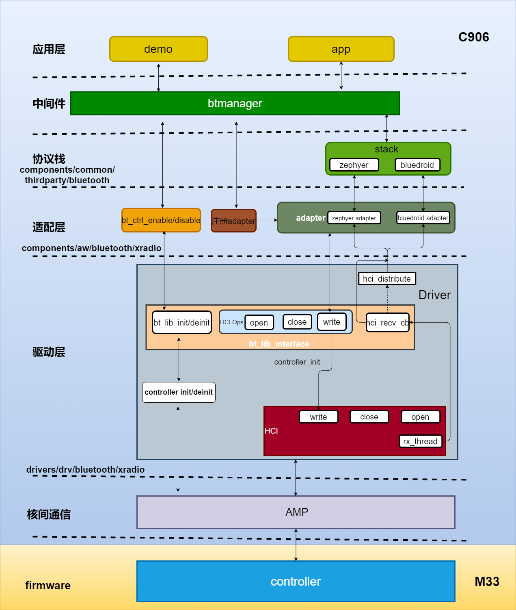

# RTOS 蓝牙

本文档主要介绍 FreeRTOS 平台上 Bluetooth 开发，主要包括蓝牙配置介绍、蓝牙 API 接口介绍以及 demo 的使用。

## 蓝牙框架介绍

蓝牙框架如下图所示，从上往下可以划分为应用、中间件、适配层、驱动层，固件层，R128 芯片内置蓝牙模块，支持 BR/EDR、BLE 双模。在软件实现上，蓝牙 controller 运行在 ARM m33 CPU 上，蓝牙 HOST 运行在 RV C906 CPU 上。其中蓝牙 HOST 包含 bluedroid 和 zephyr 两个协议栈，bluedroid 协议栈提供 BR/EDR 功能支持，例如 A2DP Sink、A2DP Source、AVRCP、HFP HF、SPP 等 Profile，zephyr 协议栈提供 BLE 相关的功能支持，例如 GATT Client、GATT Server、Mesh 等。



### 应用层

用户所开发的蓝牙应用，一般推荐使用中间件 btmanager API 进行应用开发。

### 中间件

中间件指 btmanager 软件，它向上提为应用提供 API，向下对接协议栈，屏蔽了协议栈使用细节，降低蓝牙应用开发门槛。本文档将会重点介绍如何使 btmanager 进行蓝牙应用开发

代码路径：

```
lichee/rtos‑components/aw/wireless/btmanager/src
```

### 协议栈

HOST 使用双栈方式支持 BR/EDR、BLE 蓝牙功能。BR/EDR 使用 Bluedroid 协议栈，BLE 使用 zephyr 协议栈。

bluedroid 协议栈路径：

```
lichee/rtos‑components/thirdparty/bluetooth/bluedroid
```

zephyr 协议栈路径：

```
lichee/rtos‑components/thirdparty/bluetooth/zephyr
```

### 适配层

适配层主要有两个作用：

- 对接不同协议栈
- 对接驱动层

代码路径：

```
lichee/rtos/components/aw/bluetooth/xradio
```

#### 适配层对接不同协议栈

适配层提供 bluedroid 和 zephyr 的 adapter，如下所示：

```
.
├── bluedroid
│   └── bt_bluedroid_adapter.c
├── Makefile
└── zephyr
	└── bt_zephyr_adapter.c
```

提供的接口如下：

```C
int bt_zephyr_adapter_register(void)
int bt_zephyr_adapter_unregister(void)
int bt_bluedroid_adapter_register(void)
int bt_bluedroid_adapter_unregister(void)
```

实现 adapter 主要填充实现 bt_hci_driver 接口，例如 hci 接口初始化、数据发送功能等。

```C
static const struct bt_hci_driver drv = {
	.name = "",
	.bus = BT_HCI_DRIVER_BUS_VIRTUAL,
	.open = virtual_hci_open,
#if defined(CONFIG_BT_DEINIT)
	.close = virtual_hci_close,
#endif
	.send = virtual_hci_h2c,
};
```

其中，在 `hci_open` 的时候，会注册数据接收回调，以 zephyr adater 为例：

```C
static bt_hc_callbacks_t zephyr_hc_callbacks = {
	.data_ind = zephyr_data_ind,
};

static int virtual_hci_open(void)
{
	bt_lib_if = bt_lib_get_interface();
	if (bt_lib_if && bt_lib_if‑>hci_ops && bt_lib_if‑>hci_ops‑>open) {
		bt_zephyr_id = bt_lib_if‑>hci_ops‑>open(BT_FEATURES_BLE, &zephyr_hc_callbacks);
		if (bt_zephyr_id >= 0)
		return 0;
	}
	return ‑1;
}
```

如果 controller 上报数据，就会通过 callback 调用到 zephyr_data_ind，把数据传递给协议栈。

#### 适配层对接驱动层

通过适配层的接口可以直接对 controller 使能：

```C
int bt_ctrl_enable(void)
int bt_ctrl_disable(void)
```

以上接口内部是通过 bt_lib_get_interface 获取到驱动层提供的接口完成 controller 初始化。

```C
if ((bt_lib_interface = bt_lib_get_interface()) && bt_lib_interface‑>init) {
	bt_lib_interface‑>init();
} else {
	BT_CTRL_ERR("BT LIB Interface not exist!\n");
	return ‑1;
}	
```

### 驱动层

驱动层为适配层提供接口，完成蓝牙硬件相关的初始化。

代码路径：
```
lichee/rtos/drivers/drv/bluetooth/xradio
```

目录结构如下：

```
├── driver
│   ├── common
│   ├── controller
│   ├── interface
│   ├── Kconfig
│   └── Makefile
├── hci_distribute
│   └── hci_distribute.c
├── include
│   ├── driver
│   ├── hci_distribute
│   └── lib
├── Kconfig
├── lib
│   └── bt_lib.c
└── Makefile
```

因为 R128 内置蓝牙，所以 HCI 使用 VHCI，而不是 UART 等物理接口。

为适配层提供接口，适配层可以通过 bt_lib_get_interface 获取到控制驱动的 btLibInterface。

```c
static const bt_lib_interface_t btLibInterface = {
    .init = bt_lib_init,
    .deinit = bt_lib_deinit,
    .hci_ops = &btHCLibInterface,
    .hci_ctrl_ops = &btHCLibCtrlInterface,
};
```

其中 bt_lib_init 可以完成 controller 初始化。btHCLibInterface 则是对 HCI 接口操作：

```c
static const bt_hc_interface_t btHCLibInterface = {
    .open = hci_open,
    .write = hci_write,
    .read = hci_read,
    .close = hci_close,
};
```

hci_open、hci_write 等在 VHCI 中实现。

### firmware

蓝牙固件是 libxrbtc.a 文件，路径如下：

```
lichee/rtos/drivers/drv/bluetooth/driver/controller/xradio/sun20iw2
```

M33 系统编译时会把 libxrbtc.a 编译上。

## 蓝牙配置说明

R128 芯片内置蓝牙，硬件无需外接蓝牙模组，蓝牙软件分别运行在两个核上：

- M33 核：蓝牙 Controller 的代码
- C906 核：蓝牙 Host 协议栈与应用代码

因此配置蓝牙功能分两部分说明，一般默认已经配置蓝牙，若功能异常，请参考说明检查配置。

###  M33 核

#### Driver

```
Drivers Options ‑‑‑>
    other drivers ‑‑‑>
        bluetooth drivers ‑‑‑>
        [*] BLUETOOTH xradio driver
        [*] Enable Blutooth Drivers Lib
        	Bluetooth Driver Controller (Xradio BT Controller) ‑‑‑>
        	xradio bt controller ‑‑‑>
        	Bluetooth Driver Interface (Virtual HCI) ‑‑‑>
        [ ] Enable Blutooth Drivers HCI Log Parse
        	Distribution method (Distribute Corresponding) ‑‑‑>
        [ ] corresponding mode debug log
        (2) Blutooth Drivers Lib Log Level
```

#### AMP

```
System components ‑‑‑>
    aw components ‑‑‑>
        AMP Components Support ‑‑‑>
            [*] AMP BT Support
            	[*] AMP Bluetooth Stub Functions
            	[*] AMP Bluetooth Service
```

### C906 核

#### Driver

```
Drivers Options ‑‑‑>
    other drivers ‑‑‑>
        bluetooth drivers ‑‑‑>
            [*] BLUETOOTH xradio driver
            [*] Enable Blutooth Drivers Lib
            	Bluetooth Driver Controller (Xradio BT Controller) ‑‑‑>
            	xradio bt controller ‑‑‑>
            	Bluetooth Driver Interface (Virtual HCI) ‑‑‑>
            [*] Enable Blutooth Drivers HCI Log Parse
            [ ] Enable Blutooth Drivers Log hcidump
            [*] Enable Blutooth Drivers Log btsnoop
            (512) The extra thread stack size of using FileSystem
            	Distribution method (Distribute Corresponding) ‑‑‑>
            [ ] corresponding mode debug log
            (1) Blutooth Drivers Lib Log Level
```

#### AMP

```
System components ‑‑‑>
    aw components ‑‑‑>
        AMP Components Support ‑‑‑>
            [*] AMP BT Support
            	[*] AMP Bluetooth Stub Functions
            	[*] AMP Bluetooth Service
```

#### 协议栈

BLE 使用 Zephyr 协议栈，BR/EDR 使用 Bluedroid 协议栈；

##### Zephyr

```
System components ‑‑‑>
	thirdparty components ‑‑‑>
        [*] bluetooth ‑‑‑>
            [*] Zephyr ‑‑‑>
                [*] Use iterable section instead with XRadio implement
                Max compiled‑in log level for bt (Info) ‑‑‑>
                Bluetooth Stack Selection (HCI‑based) ‑‑‑>
                [ ] RAW HCI access
                [*] Peripheral Role support
                [*] Central Role support
                [ ] Extended Advertising and Scanning support [EXPERIMENTAL]
                (5) Maximum number of simultaneous connections
                [ ] Controller to Host ACL flow control support
                [*] Enable fetching of remote version
                [*] PHY Update
                [*] Data Length Update
                [*] BLE Deinit
                [ ] BLE Global Variable Memory Dynamic Allocation
                [*] Custom Bluetooth assert implementation
                [*] Print out an assert string when using BT_ASSERT
                [ ] Use k_panic() instead of k_oops()
                Bluetooth debug type (No debug log) ‑‑‑>
                Networking ‑‑‑>
                Debugging Options ‑‑‑>
                [*] Logging ‑‑‑>
                [*] Enable settings subsystem with non‑volatile storage ‑‑‑>
                Work Queue Options ‑‑‑>
                [*] Store kernel timeouts in 64 bit precision
                *** Host Stack Configuration ***
                (2) Number of HCI command buffers
                (20) Number of HCI RX buffers
                (88) Maximum supported HCI RX buffer length
                (20) Number of discardable event buffers
                (88) Size of discardable event buffers
                (1024) HCI ECC thread stack size
                (2200) Size of the receiving thread stack
                [*] Load CCC values from settings when peer connects
                [ ] Store CCC value immediately after it has been written
                [*] Enable whitelist support
                (3) Maximum number of pending TX buffers with a callback
                [*] User control of PHY Update Procedure
                [ ] Auto‑initiate PHY Update Procedure
                [*] User control of Data Length Update Procedure
                [ ] Auto‑initiate Data Length Update procedure
                [*] Enable application access to remote information
                [*] Enable remote version information
                [*] Security Manager Protocol support
                [*] Privacy Feature
                (900) Resolvable Private Address timeout
                [*] Data signing support
                [*] Accept or reject pairing initiative
                [ ] Disable legacy pairing
                [ ] Secure Connections Only Mode
                [ ] Force Out Of Band Legacy pairing
                [*] Allow unauthenticated pairing for paired device
                [ ] Forbid usage of insecure legacy pairing methods
                [*] Allow unauthenticated pairing for paired device
                [ ] Use a fixed passkey for pairing
                [ ] Enable Security Manager Debug Mode
                [*] Bondable Mode
                [ ] Always require bonding
                [ ] Store Debug Mode bonds
                [*] Enforce MITM protection
                [*] Overwrite oldest keys with new ones if key storage is full
                [ ] Store aging counter every time a successful paring occurs
                L2CAP Options ‑‑‑>
                ATT and GATT Options ‑‑‑>
                (5) Maximum number of paired devices
                (3) Timeout for pending LE Create Connection command in seconds
                (5000) Peripheral connection parameter update timeout in milliseconds
                (2048) Scan interval used for background scanning in 0.625 ms units
                (18) Scan window used for background scanning in 0.625 ms units
                [*] Allow to set Bluetooth device name on runtime
                (28) Maximum size in bytes for device name
                (Xradio) Bluetooth device name
                (0) Bluetooth device appearance
                (2) Maximum number of local identities
                [ ] Enable Direction Finding support [EXPERIMENTAL]
                ‑*‑ Enable ECDH key generation support
                [*] Emulate ECDH in the Host using TinyCrypt library
                ‑*‑ Enable host side AES‑CCM module
                [ ] Bluetooth Testing
                [ ] User Vendor‑Specific event handling
                (0x05F1) Company Id
                [*] Bluetooth Mesh support ‑‑‑>
```

##### Bluedroid

```
System components ‑‑‑>
    thirdparty components ‑‑‑>
        [*] bluetooth ‑‑‑>
            [*] Bluedroid ‑‑‑>
                [*] Bluedroid enable
                [*] Bluedroid ‑ Dual‑mode
                [*] Bluedroid Host
                Bluedroid‑BT Options ‑‑‑>
                (4096) Bluetooth event (callback to application) task stack size
                The cpu core which Bluedroid run (Core 0 (PRO CPU)) ‑‑‑>
                (4096) Bluetooth Bluedroid Host Stack task stack size
                [ ] Bluedroid memory debug
                [*] Classic Bluetooth
                [*] A2DP
                [*] SPP
                [*] Hands Free/Handset Profile
                	Hands‑free Profile Role configuration (Hands Free Unit) ‑‑‑>
                	audio(SCO) data path (HCI) ‑‑‑>
                [*] Wide Band Speech
                [ ] Classic BT HID Host
                [*] Secure Simple Pairing
                [ ] Bluetooth Low Energy
                [ ] Disable BT debug logs (minimize bin size)
                BT DEBUG LOG LEVEL ‑‑‑>
                (4) BT/BLE MAX ACL CONNECTIONS(1~7)
                [ ] BT/BLE will first malloc the memory from the PSRAM
                [*] Use dynamic memory allocation in BT/BLE stack
                [*] BLE queue congestion check
                (30) Timeout of BLE connection establishment
                (248) Maximum size in bytes for bredr device name
            XRADIO_COMMON ‑‑‑>
                [*] HCI LAYER RX support
                [*] hcilog enable
                [*] A2dp source process feature support
                (1) hcidmp buffer
                [*] bluedroid use settings
                (8) bluedroid max store value
                (1536) bluedroid max file size
                (2048) bluedroid file defaule length
                (bt_cfg_key) bluedroid store key name
                (2) bluedroid log defaule level
```

#### btmanager

btmanager 配置如下

```
System components ‑‑‑>
    aw components ‑‑‑>
        wireless ‑‑‑>
        [*] btmanager ‑‑‑>
            [*] btmg core
            [ ] Enable AudioTrack send audio data
            [*] btmg cmd
```

其中 “Enable AudioTrack send audio data” 默认不打开，如果需要使用 AudioTrack 接管 A2DP Source 蓝牙音乐播放需要选上。

选上之后，通过 btcli demo 将无法测试 A2DP Source 蓝牙，请参考 as_test demo 使用。

#### Tools

常用的蓝牙工具有 btetf 和 btsnoop

##### btetf 

```
System components ‑‑‑>
    aw components ‑‑‑>
        aw bluetooth ‑‑‑>
            [*] etf
```

##### btsnoop

用于抓 hci log，默认打开

```
Drivers Options ‑‑‑>
    other drivers ‑‑‑>
        bluetooth drivers ‑‑‑>
        	[*] Enable Blutooth Drivers Log btsnoop
```

## BR/EDR 开发介绍

### 基础 API

| API 接口                       | 说明                                                         |
| ------------------------------ | ------------------------------------------------------------ |
| btmg_core_init                 | btmanager 内部资源初始化接口，进行内存资源申请               |
| btmg_core_deinit               | btmanager 内部资源发始化接口                                 |
| btmg_set_profile               | 设置蓝牙 profile 功能，在 btmg_adapter_enable() 之前设置有效，在用户未反初始化退出的情况下该设置一直生效 |
| btmg_set_loglevel              | 设置 btmanager 内部打印等级，默认打印等级是BTMG_LOG_LEVEL_WARNG |
| btmg_get_loglevel              | 获取 btmanager 内部当前使用的打印等级                        |
| btmg_set_ex_debug              | 设置拓展调试标志位，用于打开特殊打印输出                     |
| btmg_get_ex_debug              | 获取当前设置拓展调试标志位的值                               |
| btmg_get_error_info            | 获取错误信息                                                 |
| btmg_adapter_enable            | 开关蓝牙的作用，会进行 firmware 和蓝牙协议栈等初始化/反初始化 |
| btmg_adapter_get_state         | 获取蓝牙开关状态                                             |
| btmg_adapter_get_address       | 获取本地蓝牙设备地址                                         |
| btmg_adapter_set_name          | 设置本地蓝牙设备名称                                         |
| btmg_adapter_get_name          | 获取本地蓝牙设备名称                                         |
| btmg_adapter_set_scanmode      | 设置本地 BT 设备扫描模式（PSCAN,ISCAN），决定设备是否可连接，可发现 |
| btmg_adapter_set_io_capability | 设置本地蓝牙设备的输入、输出能力                             |
| btmg_adapter_start_scan        | 开始扫描周围的蓝牙设备                                       |
| btmg_adapter_stop_scan         | 停止 BT 扫描                                                 |
| btmg_adapter_is_scanning       | 获得当前 BT 扫描状态                                         |
| btmg_adapter_pair_device       | 发起蓝牙配对                                                 |
| btmg_adapter_unpair_device     | 取消蓝牙配对                                                 |
| btmg_get_paired_device_num     | 获取已配对设备数量                                           |
| btmg_get_paired_devices        | 获取所有已配对设备信息                                       |
| btmg_set_page_timeout          | N/A                                                          |
| btmg_device_is_connected       | 判断对端设备是否跟本地设备存在连接关系                       |
| btmg_device_get_name           | 获取指定蓝牙设备的名称                                       |
| btmg_device_remove             | N/A                                                          |
| btmg_device_pincode_reply      | 回复 pincode                                                 |
| btmg_device_passkey_reply      | 回复 passkey                                                 |
| btmg_device_passkey_confirm    | 确认 passkey                                                 |
| btmg_device_pairing_confirm    | 确认配对                                                     |

### A2DP Sink 开发 API

A2DP Sink 设备一般作为音箱类产品，会被手机等 A2DP Source 设备连接并推送音频流播放音乐

| API 接口                  | 说明                                          |
| ------------------------- | --------------------------------------------- |
| btmg_a2dp_sink_connect    | 连接指定 A2DP Source 设备，可用于回连功能开发 |
| btmg_a2dp_sink_disconnect | 主动断开与指定设备的连接                      |

####  A2DP Sink API 调用流程

关于 A2DP Sink 功能的实现，已编写了使用示例，执行 `btcli init ‑p a2dp‑sink` 即可运行，供用户使用参考，代码如下：

```c
#include "cmd_util.h"
#include <stdio.h>
#include <stdlib.h>
#include <getopt.h>

#include "btmg_dev_list.h"
#include "bt_manager.h"

btmg_callback_t btmg_cbs;
dev_list_t *discovered_devices = NULL;

#ifdef CONFIG_BT_A2DP_ENABLE
extern void btcli_a2dp_source_connection_state_cb(const char *bd_addr,
                                                  btmg_a2dp_source_connection_state_t state);
extern void btcli_a2dp_source_audio_state_cb(const char *bd_addr,
                                             btmg_a2dp_source_audio_state_t state);
extern void btcli_a2dp_sink_connection_state_cb(const char *bd_addr,
                                                btmg_a2dp_sink_connection_state_t state);
extern void btcli_a2dp_sink_audio_state_cb(const char *bd_addr, btmg_a2dp_sink_audio_state_t state);
extern void btcli_avrcp_ct_play_state_cb(const char *bd_addr, btmg_avrcp_play_state_t state);
extern void btcli_avrcp_ct_track_changed_cb(const char *bd_addr, btmg_track_info_t *track_info);
extern void btcli_avrcp_ct_play_position_cb(const char *bd_addr, int song_len, int song_pos);
extern void btcli_avrcp_audio_volume_cb(const char *bd_addr, unsigned int volume);
extern void btcli_avrcp_tg_play_state_cb(const char *bd_addr, btmg_avrcp_play_state_t state);
#endif
#ifdef CONFIG_BT_SPP_ENABLED
extern void btcli_sppc_conn_status_cb(const char *bd_addr, btmg_spp_connection_state_t status);
extern void btcli_sppc_recvdata_cb(const char *bd_addr, char *data, int data_len);
extern void btcli_spps_conn_status_cb(const char *bd_addr, btmg_spp_connection_state_t status);
extern void btcli_spps_recvdata_cb(const char *bd_addr, char *data, int data_len);
#endif
#ifdef CONFIG_BT_HFP_CLIENT_ENABLE
extern void btcli_hfp_hf_event_cb(btmg_hfp_hf_event_t event, void *data);
extern void btcli_hfp_hf_connection_state_cb(const char *bd_addr,
                                             btmg_hfp_hf_connection_state_t state);
#endif
#ifdef CONFIG_BT_HFP_AG_ENABLE
extern void btcli_hfp_ag_event_cb(btmg_hfp_ag_event_t event, void *data);
extern void btcli_hfp_ag_connection_state_cb(const char *bd_addr,
                                             btmg_hfp_ag_connection_state_t state);
extern void btcli_hfp_ag_audio_incoming_cb(const uint8_t *buf, uint32_t sz);
extern uint32_t btcli_hfp_ag_audio_outgoing_cb(uint8_t *p_buf, uint32_t sz);
#endif
extern void btcli_ble_scan_cb(le_scan_cb_para_t *data);
extern void btcli_ble_connection_cb(le_connection_para_t *data);
extern void btcli_gattc_dis_att_cb(gattc_dis_cb_para_t *data);
extern void btcli_gattc_notify_indicate_cb(gattc_notify_indicate_cb_para_t *data);
extern void btcli_gatts_get_db_cb(gatts_get_db_t *data);
extern void btcli_gatts_char_read_req_cb(gatts_char_read_req_t *data);
extern void btcli_gatts_char_write_req_cb(gatts_char_write_req_t *data);
extern void btcli_gatts_ccc_cfg_cb(gatts_ccc_cfg_t *data);
extern void btcli_gattc_read_cb(gattc_read_cb_para_t *data);
extern void btcli_gattc_write_cb(gattc_write_cb_para_t *data);

#define AUTH_IDLE            0
#define AUTH_PIN_CODE        1
#define AUTH_ENTER_PASSKEY   2
#define AUTH_PASSKEY_CONFIRM 3
#define AUTH_PAIRING_CONFIRM 4

typedef struct {
    char addr[18];
    uint32_t passkey;
    uint8_t flag; //0:none 1:pin code 2:enter passkey 3:passkey_confirm 4: pairing confirm
} pair_req_t;

static btmg_gatt_db_t *db;
static int ble_gatt_register_service(void)
{
    if (db != NULL) {
        CMD_ERR("gatt already registered\n");
        return 0;
    }

    btmg_uuid_t uuid;
    btmg_gatt_properties_t prop;
    btmg_gatt_permission_t perm = BTMG_GATT_PERM_READ | BTMG_GATT_PERM_WRITE;

    /* service1 start, uuid=0xABCD */
    db = btmg_gatt_attr_create(12); //CHAR+2 other+1
    uuid.type = BTMG_UUID_16;
    uuid.value.u16 = 0xABCD;
    btmg_gatt_attr_primary_service(db, uuid); // +1

    uuid.value.u16 = 0xfff2;
    prop = BTMG_GATT_CHRC_READ | BTMG_GATT_CHRC_WRITE;
    btmg_gatt_attr_characteristic(db, uuid, prop, perm); // +2

    uuid.value.u16 = 0xfff3;
    prop = BTMG_GATT_CHRC_READ | BTMG_GATT_CHRC_WRITE | BTMG_GATT_CHRC_NOTIFY | BTMG_GATT_CHRC_INDICATE;
    btmg_gatt_attr_characteristic(db, uuid, prop, perm); // +2
    btmg_gatt_attr_ccc(db, perm);                        // +1
    /* service1 end*/
    /* service2 start, uuid=0x7788 */
    uuid.type = BTMG_UUID_16;
    uuid.value.u16 = 0x7788;
    btmg_gatt_attr_primary_service(db, uuid); // +1

    uuid.value.u16 = 0x1122;
    prop = BTMG_GATT_CHRC_READ;
    btmg_gatt_attr_characteristic(db, uuid, prop, perm); // +2

    uuid.value.u16 = 0x3344;
    prop = BTMG_GATT_CHRC_READ | BTMG_GATT_CHRC_WRITE | BTMG_GATT_CHRC_NOTIFY;
    btmg_gatt_attr_characteristic(db, uuid, prop, perm); // +2
    btmg_gatt_attr_ccc(db, perm);                        // +1
    /* service2 end*/

    btmg_gatt_register_service(db);

    return CMD_STATUS_OK;
}

static int ble_gatt_unregister_service(void)
{
    if (db == NULL) {
        CMD_ERR("gatt already unregistered\n");
        return 0;
    }

    btmg_gatt_unregister_service(db);

    return CMD_STATUS_OK;
}

static int ble_set_adv_data(void)
{
    int index = 0;
    uint16_t uuid = 0x1234;
    char ble_name[] = "aw-btcli-ble";

    btmg_adv_scan_rsp_data_t adv_data;

    adv_data.data[index] = 0x02; /* flag len */
    adv_data.data[index + 1] = 0x01; /* type for flag */
    adv_data.data[index + 2] = 0x1A; //0x05

    index += adv_data.data[index] + 1;

    adv_data.data[index] = strlen(ble_name) + 1; /* name len */
    adv_data.data[index + 1] = 0x09; /* type for local name */
    int name_len;
    name_len = strlen(ble_name);
    strcpy(&(adv_data.data[index + 2]), ble_name);
    index += adv_data.data[index] + 1;

    adv_data.data[index] = 0x03; /* uuid len */
    adv_data.data[index + 1] = 0x03; /* type for complete list of 16-bit uuid */
    adv_data.data[index + 2] = (char)(uuid & 0xFF);
    adv_data.data[index + 3] = (char)((uuid >> 8) & 0xFF);
    index += adv_data.data[index] + 1;

    adv_data.data_len = index;

    return btmg_le_set_adv_scan_rsp_data(&adv_data, NULL);
}

static int ble_advertise_on(void)
{
    btmg_le_adv_param_t adv_param;

    adv_param.interval_min = 0x0020;
    adv_param.interval_max = 0x01E0;
    adv_param.adv_type = BTMG_LE_ADV_IND;

    btmg_le_set_adv_param(&adv_param);
    ble_set_adv_data();
    return btmg_le_enable_adv(true);
}

static pair_req_t pair_req = { { 0 }, 0, 0 };

void btcli_scan_status_cb(btmg_scan_state_t status)
{
    if (status == BTMG_SCAN_STARTED) {
        CMD_DBG("start scanning\n");
    } else if (status == BTMG_SCAN_STOPPED) {
        CMD_DBG("stop scanning\n");
    }
}

void btcli_scan_dev_add_cb(btmg_device_t *device)
{
    dev_node_t *dev_node = NULL;

    CMD_DBG("name:[%s]\t\taddress:[%s]\t\tclass:[%d]\t\trssi:[%d]\n", device->name, device->address,
            device->cod, device->rssi);

    dev_node = btmg_dev_list_find_device(discovered_devices, device->address);
    if (dev_node != NULL) {
        return;
    }

    btmg_dev_list_add_device(discovered_devices, device->name, device->address, 0);
}

void btcli_adapter_name_cb(char *name)
{
    CMD_DBG("btcli get adapter name:%s\n", name);
}

void btcli_device_name_cb(char *name)
{
    CMD_DBG("btcli get remote device name:%s\n", name);
}

void btcli_bonded_device_cb(btmg_bond_state_t state, const char *bd_addr)
{
    dev_node_t *dev_discovered_node = NULL;

    CMD_DBG("bonded device state:%d, addr:%s\n", state, bd_addr);

    dev_discovered_node = btmg_dev_list_find_device(discovered_devices, bd_addr);
    if (state == BTMG_BOND_STATE_BONDED) {
        if (dev_discovered_node != NULL) {
            btmg_dev_list_remove_device(discovered_devices, bd_addr);
        }
        CMD_DBG("Pairing state for %s is BONDED \n", bd_addr);
    } else if (state == BTMG_BOND_STATE_BOND_FAILED) {
        CMD_DBG("Pairing state for %s is BOND_FAILED \n", bd_addr);
    }
}

void btcli_device_pindcoe_request_cb(const char *addr)
{
    CMD_DBG("dev:%s,pindcoe request, Please enter pincode\n", addr);
    memcpy(pair_req.addr, addr, sizeof(pair_req.addr));
    pair_req.flag = AUTH_PIN_CODE;
}

void btcli_device_passkey_request_cb(const char *addr)
{
    CMD_DBG("dev:%s,passkey_request, Please enter passkey!\n", addr);
    memcpy(pair_req.addr, addr, sizeof(pair_req.addr));
    pair_req.flag = AUTH_ENTER_PASSKEY;
}

void btcli_device_passkey_confirm_cb(const char *addr, uint32_t passkey)
{
    CMD_DBG("please confirm the passkey(%d) sent by the %s device!\n", passkey, addr);
    memcpy(pair_req.addr, addr, sizeof(pair_req.addr));
    pair_req.passkey = passkey;
    pair_req.flag = AUTH_PASSKEY_CONFIRM;
}

void btcli_device_pairing_confirm_cb(const char *addr, uint32_t passkey)
{
    CMD_DBG("dev:%s,pairing_confirm,please compare the passkey numeric value: %d\n", addr, passkey);
    memcpy(pair_req.addr, addr, sizeof(pair_req.addr));
    pair_req.passkey = passkey;
    pair_req.flag = AUTH_PAIRING_CONFIRM;
}

void btcli_adapter_status_cb(btmg_adapter_state_t status)
{
    char bt_addr[18] = { 0 };
    char bt_name_buf[64] = { 0 };
    char bt_name[64] = { 0 };

    if (status == BTMG_ADAPTER_OFF) {
        CMD_DBG("BT is off\n");
    } else if (status == BTMG_ADAPTER_ON) {
        CMD_DBG("BT is on\n");
        btmg_adapter_get_address(bt_addr);
        if (bt_addr[0] != '\0') {
            snprintf(bt_name_buf, 12, "aw-btcli-%s-", (char *)(bt_addr + 12));
            sprintf(bt_name, "%s-%s", bt_name_buf, (char *)(bt_addr + 15));
            btmg_adapter_set_name(bt_name);
        } else {
            btmg_adapter_set_name("aw-btcli");
        }
        btmg_adapter_set_io_capability(BTMG_IO_CAP_NOINPUTNOOUTPUT);
        btmg_adapter_set_scanmode(BTMG_SCAN_MODE_CONNECTABLE_DISCOVERABLE);
    } else if (status == BTMG_ADAPTER_TURNING_ON) {
        CMD_DBG("BT is turnning on\n");
    } else if (status == BTMG_ADAPTER_TURNING_OFF) {
        CMD_DBG("BT is turnning off\n");
    }
}

/* btcli pincode <0000~9999> */
enum cmd_status btcli_pincode(char *cmd)
{
    if (pair_req.flag != AUTH_PIN_CODE) {
        CMD_ERR("No need to enter pin code now\n");
        return CMD_STATUS_FAIL;
    }

    int argc;
    char *argv[1];

    argc = cmd_parse_argv(cmd, argv, 1);
    if (argc < 1) {
        CMD_ERR("invalid param number %d\n", argv[0]);
        return CMD_STATUS_INVALID_ARG;
    }

    btmg_device_pincode_reply(argv[0]);
    pair_req.flag = AUTH_IDLE;

    return CMD_STATUS_OK;
}

#if (BT_SSP_INCLUDED == TRUE)
/* btcli passkey <000000~999999> */
enum cmd_status btcli_passkey(char *cmd)
{
    if (pair_req.flag != AUTH_ENTER_PASSKEY) {
        CMD_ERR("No need to enter passkey now\n");
        return CMD_STATUS_FAIL;
    }

    uint32_t passkey = 0;
    int argc;
    char *argv[1];

    argc = cmd_parse_argv(cmd, argv, 1);
    if (argc < 1) {
        CMD_ERR("invalid param number %d\n", argc);
        return CMD_STATUS_INVALID_ARG;
    }
    passkey = atoi(argv[0]);
    if (passkey > 999999) {
        CMD_ERR("Passkey should be between 0-999999");
        return CMD_STATUS_INVALID_ARG;
    }

    btmg_device_passkey_reply(passkey);
    pair_req.flag = AUTH_IDLE;

    return CMD_STATUS_OK;
}

/* btcli passkey_confirm */
enum cmd_status btcli_passkey_confirm(char *cmd)
{
    if (pair_req.flag != AUTH_PASSKEY_CONFIRM) {
        CMD_ERR("No need to enter this command now\n");
        return CMD_STATUS_FAIL;
    }

    btmg_device_passkey_confirm(pair_req.passkey);
    pair_req.flag = AUTH_IDLE;

    return CMD_STATUS_OK;
}

/* btcli pairing_confirm */
enum cmd_status btcli_pairing_confirm(char *cmd)
{
    if (pair_req.flag != AUTH_PAIRING_CONFIRM) {
        CMD_ERR("No need to need to enter this command now\n");
        return CMD_STATUS_FAIL;
    }

    btmg_device_pairing_confirm();
    pair_req.flag = AUTH_IDLE;

    return CMD_STATUS_OK;
}
#endif

/* btcli scan_list */
enum cmd_status btcli_scan_list(char *cmd)
{
    dev_node_t *dev_node = NULL;

    if (discovered_devices == NULL) {
        CMD_WRN("scan list is empty\n");
        return CMD_STATUS_OK;
    }

    dev_node = discovered_devices->head;
    while (dev_node != NULL) {
        CMD_DBG("addr: %s, name: %s\n", dev_node->dev_addr, dev_node->dev_name);
        dev_node = dev_node->next;
    }

    return CMD_STATUS_OK;
}

/* btcli paired_list */
enum cmd_status btcli_paired_list(char *cmd)
{
    int device_num = -1;
    btmg_err ret;

    btmg_get_paired_device_num(&device_num);
    if (device_num <= 0) {
        CMD_DBG("no device is bonded!\n");
        return CMD_STATUS_OK;
    }

    btmg_paired_device_t paired_list[device_num];

    if ((ret = btmg_get_paired_devices(device_num, paired_list)) != BT_OK) {
        CMD_ERR("return failed: %d\n", ret);
        return CMD_STATUS_FAIL;
    }

    CMD_DBG("get paired device_list:\n");
    for (int i = 0; i < device_num; i++) {
        CMD_DBG("device[%s]\n", paired_list[i].address);
    }

    return CMD_STATUS_OK;
}

/* btcli scan_mode <0~2> */
enum cmd_status btcli_set_scanmode(char *cmd)
{
    int argc;
    char *argv[1];
    int mode;

    argc = cmd_parse_argv(cmd, argv, 1);
    if (argc != 1) {
        CMD_ERR("invalid param number %d\n", argc);
        return CMD_STATUS_INVALID_ARG;
    }
    mode = cmd_atoi(argv[0]);

    btmg_adapter_set_scanmode(mode);

    return CMD_STATUS_OK;
}

/* btcli scan <on/off> */
enum cmd_status btcli_scan(char *cmd)
{
    int argc;
    char *argv[1];

    argc = cmd_parse_argv(cmd, argv, cmd_nitems(argv));
    if (argc != 1) {
        CMD_ERR("invalid param number %d\n", argc);
        return CMD_STATUS_INVALID_ARG;
    }

    if (!strcmp(argv[0], "on")) {
        if (discovered_devices != NULL) {
            btmg_dev_list_free(discovered_devices);
            discovered_devices = NULL;
        }
        discovered_devices = btmg_dev_list_new();
        if (discovered_devices == NULL)
            return CMD_STATUS_FAIL;
        btmg_adapter_start_scan();
    } else if (!strcmp(argv[0], "off")) {
        btmg_adapter_stop_scan();
    }

    return CMD_STATUS_OK;
}

/* btcli io_cap <0~4> */
enum cmd_status btcli_set_io_cap(char *cmd)
{
    int argc;
    char *argv[1];
    int io_cap;

    argc = cmd_parse_argv(cmd, argv, 1);
    if (argc != 1) {
        CMD_ERR("invalid param number %d\n", argc);
        return CMD_STATUS_INVALID_ARG;
    }
    io_cap = cmd_atoi(argv[0]);

    btmg_adapter_set_io_capability(io_cap);

    return CMD_STATUS_OK;
}

/* btcli get_dev_name */
enum cmd_status btcli_get_device_name(char *cmd)
{
    int argc;
    char *argv[1];

    argc = cmd_parse_argv(cmd, argv, 1);
    if (argc != 1) {
        CMD_ERR("invalid param number %d\n", argc);
        return CMD_STATUS_INVALID_ARG;
    }

    btmg_device_get_name(argv[0]);

    return CMD_STATUS_OK;
}

/* btcli get_name */
enum cmd_status btcli_get_adapter_name(char *cmd)
{
    btmg_adapter_get_name();

    return CMD_STATUS_OK;
}

/* btcli set_name <name> */
enum cmd_status btcli_set_adapter_name(char *cmd)
{
    int argc;
    char *argv[1];

    argc = cmd_parse_argv(cmd, argv, 1);
    if (argc != 1) {
        CMD_ERR("invalid param number %d\n", argc);
        return CMD_STATUS_INVALID_ARG;
    }

    btmg_adapter_set_name(argv[0]);

    return CMD_STATUS_OK;
}

/* btcli get_mac */
enum cmd_status btcli_get_adapter_mac(char *cmd)
{
    char mac[18] = { 0 };

    btmg_adapter_get_address(mac);
    CMD_DBG("adapter mac is:%s", mac);

    return CMD_STATUS_OK;
}

static bool btcli_init_state = false;
static int profile = 0;

/* btcli init or btcli init -p a2dp-source -d 4 */
enum cmd_status btcli_init(char *cmd)
{
    int i = 0;
    int argc;
    char *argv[10];

    btmg_log_level_t debug;

    argc = cmd_parse_argv(cmd, argv, cmd_nitems(argv));

    for (i = 0; i < argc; i++) {
        if (strcmp(argv[i], "-h") == 0) {
            CMD_DBG("Usage:\n"
                   "  [OPTION]...\n"
                   "\nOptions:\n"
                   "  -h, --help\t\tprint this help and exit\n"
                   "  -d, --debug\t open debug :-d [0~5]\n"
                   "  -p, --profile=NAME\tenable bluetooth profile\n"
                   "  [supported profile name]:\n"
                   "  - a2dp-source\tAdvanced Audio Source\n"
                   "  - a2dp-sink\tAdvanced Audio Sink\n"
                   "  - hfp-hf\tHands-Free\n"
                   "  - spp-server\tSerial Port Profile-Server role\n"
                   "  - spp-client\tSerial Port Profile-Client role\n"
                   "  - gatt-server\tble gatt server\n"
                   "  - gatt-client\tble gatt client\n");
            return CMD_STATUS_OK;
        }

        if (strcmp(argv[i], "-p") == 0) {
            if (i + 1 < argc) {
                int c;
                struct {
                    const char *name;
                    int value;
                } map[] = {
                    { "a2dp-sink",      BTMG_A2DP_SINK },
                    { "a2dp-source",    BTMG_A2DP_SOURCE },
                    { "hfp-hf",         BTMG_HFP_HF},
                    { "hfp-ag",         BTMG_HFP_AG},
                    { "spp-server",     BTMG_SPP_SERVER },
                    { "spp-client",     BTMG_SPP_CLIENT },
                    { "gatt-server",    BTMG_GATT_SERVER },
                    { "gatt-client",    BTMG_GATT_CLIENT},
                };

                for (c = 0; c < ARRAY_SIZE(map); c++) {
                    if (strcasecmp(argv[i+1], map[c].name) == 0) {
                        profile |= map[c].value;
                        break;
                    }
                }
                if (c == ARRAY_SIZE(map)) {
                    CMD_ERR("Invalid BT profile name: %s\n", argv[i+1]);
                }
            }else {
                CMD_ERR("invalid parameter, please specify a profile\n");
                break;
            }
        }

        if (strcmp(argv[i], "-d") == 0) {
            if (i + 1 < argc) {
                debug = (btmg_log_level_t)atoi(argv[i+1]);
                CMD_DBG("debug loglevel :%d\n", (int)debug);
                btmg_set_loglevel(debug);
            } else {
                CMD_ERR("invalid parameter, please specify a level\n");
                break;
            }
        }
    }
    if (btcli_init_state) {
        CMD_WRN("BT is already INIT!\n");
        return CMD_STATUS_OK;
    }

    if (profile == 0) {
        CMD_DBG("use default profile\n");
        profile |= BTMG_A2DP_SINK;
    }

    btmg_cbs.btmg_adapter_cb.state_cb = btcli_adapter_status_cb;
    btmg_cbs.btmg_adapter_cb.scan_status_cb = btcli_scan_status_cb;
    btmg_cbs.btmg_device_cb.device_add_cb = btcli_scan_dev_add_cb;
    btmg_cbs.btmg_adapter_cb.bonded_device_cb = btcli_bonded_device_cb;
    btmg_cbs.btmg_adapter_cb.get_name_cb = btcli_adapter_name_cb;
    btmg_cbs.btmg_device_cb.pindcoe_request_cb = btcli_device_pindcoe_request_cb;
    btmg_cbs.btmg_device_cb.passkey_request_cb = btcli_device_passkey_request_cb;
    btmg_cbs.btmg_device_cb.passkey_confirm_cb = btcli_device_passkey_confirm_cb;
    btmg_cbs.btmg_device_cb.pairing_confirm_cb = btcli_device_pairing_confirm_cb;
#ifdef CONFIG_BT_A2DP_ENABLE
    if (profile & BTMG_A2DP_SINK) {
        btmg_cbs.btmg_a2dp_sink_cb.conn_state_cb = btcli_a2dp_sink_connection_state_cb;
        btmg_cbs.btmg_a2dp_sink_cb.audio_state_cb = btcli_a2dp_sink_audio_state_cb;
    }
    if (profile & BTMG_A2DP_SOURCE) {
        btmg_cbs.btmg_a2dp_source_cb.conn_state_cb = btcli_a2dp_source_connection_state_cb;
        btmg_cbs.btmg_a2dp_source_cb.audio_state_cb = btcli_a2dp_source_audio_state_cb;
    }
    btmg_cbs.btmg_avrcp_cb.avrcp_ct_play_state_cb = btcli_avrcp_ct_play_state_cb;
    btmg_cbs.btmg_avrcp_cb.avrcp_ct_play_position_cb = btcli_avrcp_ct_play_position_cb;
    btmg_cbs.btmg_avrcp_cb.avrcp_ct_track_changed_cb = btcli_avrcp_ct_track_changed_cb;
    btmg_cbs.btmg_avrcp_cb.avrcp_tg_play_state_cb = btcli_avrcp_tg_play_state_cb;
    btmg_cbs.btmg_avrcp_cb.avrcp_audio_volume_cb = btcli_avrcp_audio_volume_cb;
#endif
#ifdef CONFIG_BT_SPP_ENABLED
    if (profile & BTMG_SPP_CLIENT) {
        btmg_cbs.btmg_sppc_cb.conn_state_cb = btcli_sppc_conn_status_cb;
        btmg_cbs.btmg_sppc_cb.recvdata_cb = btcli_sppc_recvdata_cb;
    }
    if (profile & BTMG_SPP_SERVER) {
        btmg_cbs.btmg_spps_cb.conn_state_cb = btcli_spps_conn_status_cb;
        btmg_cbs.btmg_spps_cb.recvdata_cb = btcli_spps_recvdata_cb;
    }
#endif
#ifdef CONFIG_BT_HFP_CLIENT_ENABLE
    if (profile & BTMG_HFP_HF) {
        btmg_cbs.btmg_hfp_hf_cb.conn_state_cb = btcli_hfp_hf_connection_state_cb;
        btmg_cbs.btmg_hfp_hf_cb.event_cb = btcli_hfp_hf_event_cb;
    }
#endif
#ifdef CONFIG_BT_HFP_AG_ENABLE
    if (profile & BTMG_HFP_AG) {
        btmg_cbs.btmg_hfp_ag_cb.conn_state_cb = btcli_hfp_ag_connection_state_cb;
        btmg_cbs.btmg_hfp_ag_cb.event_cb = btcli_hfp_ag_event_cb;
        btmg_cbs.btmg_hfp_ag_cb.audio_incoming_cb = btcli_hfp_ag_audio_incoming_cb;
        btmg_cbs.btmg_hfp_ag_cb.audio_outgoing_cb = btcli_hfp_ag_audio_outgoing_cb;
    }
#endif
    if (profile & BTMG_GATT_SERVER) {
        btmg_cbs.btmg_gatts_cb.conn_cb = btcli_ble_connection_cb;
        btmg_cbs.btmg_gatts_cb.get_db_cb = btcli_gatts_get_db_cb;
        btmg_cbs.btmg_gatts_cb.char_read_req_cb = btcli_gatts_char_read_req_cb;
        btmg_cbs.btmg_gatts_cb.char_write_req_cb = btcli_gatts_char_write_req_cb;
        btmg_cbs.btmg_gatts_cb.ccc_cfg_cb = btcli_gatts_ccc_cfg_cb;
    }
    if (profile & BTMG_GATT_CLIENT) {
        btmg_cbs.btmg_gattc_cb.le_scan_cb = btcli_ble_scan_cb;
        btmg_cbs.btmg_gattc_cb.conn_cb = btcli_ble_connection_cb;
        btmg_cbs.btmg_gattc_cb.dis_att_cb = btcli_gattc_dis_att_cb;
        btmg_cbs.btmg_gattc_cb.read_cb = btcli_gattc_read_cb;
        btmg_cbs.btmg_gattc_cb.write_cb = btcli_gattc_write_cb;
        btmg_cbs.btmg_gattc_cb.notify_indicate_cb = btcli_gattc_notify_indicate_cb;
    }

    btmg_core_init();
    btmg_register_callback(&btmg_cbs);
    btmg_set_profile(profile);
    btmg_adapter_enable(true);
    btcli_init_state = true;

    if (profile & BTMG_GATT_SERVER) {
        ble_gatt_register_service();
        ble_advertise_on();
    }

    return CMD_STATUS_OK;
}

enum cmd_status btcli_deinit(char *cmd)
{
    if (profile & BTMG_GATT_SERVER) {
        ble_gatt_unregister_service();
        btmg_le_enable_adv(false);
        btmg_gatt_attr_destory(db);
        db  = NULL;
    }
    btmg_adapter_enable(false);
    btmg_core_deinit();
    btmg_unregister_callback();
    btcli_init_state = false;

    if (discovered_devices != NULL) {
        btmg_dev_list_free(discovered_devices);
        discovered_devices = NULL;
    }

    return CMD_STATUS_OK;
}

tatic enum cmd_status btcli_sink_help(char *cmd);

void btcli_a2dp_sink_connection_state_cb(const char *bd_addr,
                                         btmg_a2dp_sink_connection_state_t state)
{
    if (state == BTMG_A2DP_SINK_DISCONNECTED) {
        CMD_DBG("A2DP sink disconnected with device: %s\n", bd_addr);
        btmg_adapter_set_scanmode(BTMG_SCAN_MODE_CONNECTABLE_DISCOVERABLE);
    } else if (state == BTMG_A2DP_SINK_CONNECTING) {
        CMD_DBG("A2DP sink connecting with device: %s\n", bd_addr);
    } else if (state == BTMG_A2DP_SINK_CONNECTED) {
        CMD_DBG("A2DP sink connected with device: %s\n", bd_addr);
    } else if (state == BTMG_A2DP_SINK_DISCONNECTING) {
        CMD_DBG("A2DP sink disconnecting with device: %s\n", bd_addr);
    }
}

void btcli_a2dp_sink_audio_state_cb(const char *bd_addr, btmg_a2dp_sink_audio_state_t state)
{
    if (state == BTMG_A2DP_SINK_AUDIO_SUSPENDED) {
        CMD_DBG("A2DP sink audio suspended with device: %s\n", bd_addr);
    } else if (state == BTMG_A2DP_SINK_AUDIO_STOPPED) {
        CMD_DBG("A2DP sink audio stopped with device: %s\n", bd_addr);
    } else if (state == BTMG_A2DP_SINK_AUDIO_STARTED) {
        CMD_DBG("A2DP sink audio started with device: %s\n", bd_addr);
    }
}

/* btcli a2dp_snk connect <device mac> */
enum cmd_status btcli_sink_connect(char *cmd)
{
    int argc;
    char *argv[1];

    argc = cmd_parse_argv(cmd, argv, 1);
    if (argc < 1) {
        CMD_ERR("invalid param number %d\n", argc);
        return CMD_STATUS_INVALID_ARG;
    }

    btmg_a2dp_sink_connect(argv[0]);

    return CMD_STATUS_OK;
}

/* btcli a2dp_snk disconnect <device mac> */
enum cmd_status btcli_sink_disconnect(char *cmd)
{
    int argc;
    char *argv[1];

    argc = cmd_parse_argv(cmd, argv, 1);
    if (argc < 1) {
        CMD_ERR("invalid param number %d\n", argc);
        return CMD_STATUS_INVALID_ARG;
    }

    btmg_a2dp_sink_disconnect(argv[0]);

    return CMD_STATUS_OK;
}

static const struct cmd_data a2dp_sink_cmds[] = {
    { "connect",    btcli_sink_connect,    CMD_DESC("<device mac>")},
    { "disconnect", btcli_sink_disconnect, CMD_DESC("<device mac>")},
    { "help",       btcli_sink_help,       CMD_DESC(CMD_HELP_DESC) },
};

/* btcli a2dp_snk help */
static enum cmd_status btcli_sink_help(char *cmd)
{
	return cmd_help_exec(a2dp_sink_cmds, cmd_nitems(a2dp_sink_cmds), 10);
}

enum cmd_status btcli_a2dp_sink(char *cmd)
{
    return cmd_exec(cmd, a2dp_sink_cmds, cmd_nitems(a2dp_sink_cmds));
}
```

##### 初始化

1. 总回调结构体是 btmg_callback_t，先设置 a2dp sink 相关回调函数；
2. 调用 btmg_core_init 初始化 btmanager;
3. 调用 btmg_register_callback 注册步骤 1 设置好的回调函数；
4. 调用 btmg_set_profile(BTMG_A2DP_SINK) 使能蓝牙 Profile；
5. 调用 btmg_adapter_enable(true) 使能蓝牙
6. 蓝牙使能成功后触发 state_cb，参考 btcli_adapter_status_cb；
7. 在 state_cb 中调用 btmg_adapter_set_name，设置蓝牙名称；
8. 在 state_cb 中调用 btmg_adapter_set_io_capability，设置 io_capability 能力；
9. 在 state_cb 中调用 btmg_adapter_set_scanmode，设置发现模式；

##### 音乐播放控制

1. 蓝牙初始化完成后，手机可以搜索和连接，连接成功的回调是 conn_state_cb，参考btcli_a2dp_sink_connection_state_cb；
2. 播放状态，歌曲进度，歌曲信息通过 btmg_avrcp_cb 的 avrcp_play_state_cb/avrcp_play_position_cb/avrcp_track_changed_cb 回调获得；
3. 获取/设置音量，API 调用参考 btcli_get_absolute_volume/btcli_set_absolute_volume;
4. 主动断开连接调用 btmg_a2dp_sink_disconnect 实现；
5. bt_manager 默认没有集成蓝牙回连的功能，用户可以基于 btmg_a2dp_sink_connect 接口进行功能实现；
6. 音频数据的处理默认在 bt_manager 内部处理播放，用户如果需要直接获取音频数据做音效等处理，打开 CONFIG_A2DP_SINK_AUDIO_CB 宏后，应用可以通过 stream_cb 拿到数据；

### AVRCP 开发

AVRCP 分为 AVRCP CT 和 AVRCP TG 两个角色，一个设备可以同时拥有该两种角色。

以蓝牙音箱为例:

- 手机连接音箱播放音乐，音箱端可以通过 AVRCP 控制手机上下曲控制等，此时手机作为被控制方，是 AVRCP TG，音箱是控制方，是 AVRCP CT；
- 手机和音箱都支持绝对音量，手机端可以通过 AVRCP 设置音箱音量，并通过 RegisterNotification 注册音量变化的通知事件，音箱音量变化后，手机会收到音箱的 RegisterNotification response 通知。这种情况手机作为 AVRCP CT，音箱作为 AVRCP TG；

####  AVRCP CT API

| API 接口                          | 说明                         |
| --------------------------------- | ---------------------------- |
| btmg_avrc_ct_send_passthrough_cmd | 发送命令控制 AVRCP TG        |
| btmg_avrc_set_absolute_volume     | 发送命令设置 AVRCP TG 的音量 |
| btmg_avrc_get_absolute_volume     | 发送命令获取音量             |

#### AVRCP TG API

| API 接口                      | 说明                                                         |
| ----------------------------- | ------------------------------------------------------------ |
| btmg_avrc_set_absolute_volume | 此接口同样适用 AVRCP TG，内部设置好本地音量变化后，也会通知 AVRCP CT |
| btmg_avrc_get_absolute_volume | 发送命令获取音量                                             |

AVRCP TG 目前只有 1 个 API，其重点是回调函数，有如下 callback 使用：

```c
typedef struct {
    bt_avrcp_ct_play_state_cb avrcp_ct_play_state_cb; //ct播放状态
    bt_avrcp_ct_track_changed_cb avrcp_ct_track_changed_cb; //歌曲信息&歌词信息
    bt_avrcp_ct_play_position_cb avrcp_ct_play_position_cb; //播放进度条信息
    bt_avrcp_tg_play_state_cb avrcp_tg_play_state_cb; //tg播放状态
    bt_avrcp_audio_volume_cb avrcp_audio_volume_cb; //音量大小
} btmg_avrcp_callback_t;
```

### A2DP Source 开发

A2DP Source 设备一般支持音乐播放功能，例如扫读笔、学习机等产品。此类产品有连接蓝牙耳机/蓝牙音箱等 A2DP Sink 设备需求。

#### A2DP Source API

| API 接口                         | 说明                                                         |
| -------------------------------- | ------------------------------------------------------------ |
| btmg_a2dp_source_connect         | 连接指定 A2DP Sink 设备                                      |
| btmg_a2dp_source_disconnect      | 断开与指定设备的连接                                         |
| btmg_a2dp_source_set_audio_param | 设置需要播放的音频流的参数：通道数与采样率，以便 btmanager 对音频进行处理 |
| btmg_a2dp_source_send_data       | 应用层发送音频流数据给 btmanager                             |
| btmg_a2dp_source_play_start      | 开始处理音频数据，建议在btmg_a2dp_source_send_data 之前运行  |
| btmg_a2dp_source_play_stop       | 停止处理音频数据，参数为 true 时表示立即停止，丢弃缓存中的数据，反之保留 |
| btmg_a2dp_source_is_ready        | 判断是否已经初始化就绪                                       |

#### A2DP source API 调用流程

```c
#include "cmd_util.h"
#include <stdio.h>
#include <stdlib.h>
#include <getopt.h>

#include "btmg_dev_list.h"
#include "bt_manager.h"

btmg_callback_t btmg_cbs;
dev_list_t *discovered_devices = NULL;

#ifdef CONFIG_BT_A2DP_ENABLE
extern void btcli_a2dp_source_connection_state_cb(const char *bd_addr,
                                                  btmg_a2dp_source_connection_state_t state);
extern void btcli_a2dp_source_audio_state_cb(const char *bd_addr,
                                             btmg_a2dp_source_audio_state_t state);
extern void btcli_a2dp_sink_connection_state_cb(const char *bd_addr,
                                                btmg_a2dp_sink_connection_state_t state);
extern void btcli_a2dp_sink_audio_state_cb(const char *bd_addr, btmg_a2dp_sink_audio_state_t state);
extern void btcli_avrcp_ct_play_state_cb(const char *bd_addr, btmg_avrcp_play_state_t state);
extern void btcli_avrcp_ct_track_changed_cb(const char *bd_addr, btmg_track_info_t *track_info);
extern void btcli_avrcp_ct_play_position_cb(const char *bd_addr, int song_len, int song_pos);
extern void btcli_avrcp_audio_volume_cb(const char *bd_addr, unsigned int volume);
extern void btcli_avrcp_tg_play_state_cb(const char *bd_addr, btmg_avrcp_play_state_t state);
#endif
#ifdef CONFIG_BT_SPP_ENABLED
extern void btcli_sppc_conn_status_cb(const char *bd_addr, btmg_spp_connection_state_t status);
extern void btcli_sppc_recvdata_cb(const char *bd_addr, char *data, int data_len);
extern void btcli_spps_conn_status_cb(const char *bd_addr, btmg_spp_connection_state_t status);
extern void btcli_spps_recvdata_cb(const char *bd_addr, char *data, int data_len);
#endif
#ifdef CONFIG_BT_HFP_CLIENT_ENABLE
extern void btcli_hfp_hf_event_cb(btmg_hfp_hf_event_t event, void *data);
extern void btcli_hfp_hf_connection_state_cb(const char *bd_addr,
                                             btmg_hfp_hf_connection_state_t state);
#endif
#ifdef CONFIG_BT_HFP_AG_ENABLE
extern void btcli_hfp_ag_event_cb(btmg_hfp_ag_event_t event, void *data);
extern void btcli_hfp_ag_connection_state_cb(const char *bd_addr,
                                             btmg_hfp_ag_connection_state_t state);
extern void btcli_hfp_ag_audio_incoming_cb(const uint8_t *buf, uint32_t sz);
extern uint32_t btcli_hfp_ag_audio_outgoing_cb(uint8_t *p_buf, uint32_t sz);
#endif
extern void btcli_ble_scan_cb(le_scan_cb_para_t *data);
extern void btcli_ble_connection_cb(le_connection_para_t *data);
extern void btcli_gattc_dis_att_cb(gattc_dis_cb_para_t *data);
extern void btcli_gattc_notify_indicate_cb(gattc_notify_indicate_cb_para_t *data);
extern void btcli_gatts_get_db_cb(gatts_get_db_t *data);
extern void btcli_gatts_char_read_req_cb(gatts_char_read_req_t *data);
extern void btcli_gatts_char_write_req_cb(gatts_char_write_req_t *data);
extern void btcli_gatts_ccc_cfg_cb(gatts_ccc_cfg_t *data);
extern void btcli_gattc_read_cb(gattc_read_cb_para_t *data);
extern void btcli_gattc_write_cb(gattc_write_cb_para_t *data);

#define AUTH_IDLE            0
#define AUTH_PIN_CODE        1
#define AUTH_ENTER_PASSKEY   2
#define AUTH_PASSKEY_CONFIRM 3
#define AUTH_PAIRING_CONFIRM 4

typedef struct {
    char addr[18];
    uint32_t passkey;
    uint8_t flag; //0:none 1:pin code 2:enter passkey 3:passkey_confirm 4: pairing confirm
} pair_req_t;

static btmg_gatt_db_t *db;
static int ble_gatt_register_service(void)
{
    if (db != NULL) {
        CMD_ERR("gatt already registered\n");
        return 0;
    }

    btmg_uuid_t uuid;
    btmg_gatt_properties_t prop;
    btmg_gatt_permission_t perm = BTMG_GATT_PERM_READ | BTMG_GATT_PERM_WRITE;

    /* service1 start, uuid=0xABCD */
    db = btmg_gatt_attr_create(12); //CHAR+2 other+1
    uuid.type = BTMG_UUID_16;
    uuid.value.u16 = 0xABCD;
    btmg_gatt_attr_primary_service(db, uuid); // +1

    uuid.value.u16 = 0xfff2;
    prop = BTMG_GATT_CHRC_READ | BTMG_GATT_CHRC_WRITE;
    btmg_gatt_attr_characteristic(db, uuid, prop, perm); // +2

    uuid.value.u16 = 0xfff3;
    prop = BTMG_GATT_CHRC_READ | BTMG_GATT_CHRC_WRITE | BTMG_GATT_CHRC_NOTIFY | BTMG_GATT_CHRC_INDICATE;
    btmg_gatt_attr_characteristic(db, uuid, prop, perm); // +2
    btmg_gatt_attr_ccc(db, perm);                        // +1
    /* service1 end*/
    /* service2 start, uuid=0x7788 */
    uuid.type = BTMG_UUID_16;
    uuid.value.u16 = 0x7788;
    btmg_gatt_attr_primary_service(db, uuid); // +1

    uuid.value.u16 = 0x1122;
    prop = BTMG_GATT_CHRC_READ;
    btmg_gatt_attr_characteristic(db, uuid, prop, perm); // +2

    uuid.value.u16 = 0x3344;
    prop = BTMG_GATT_CHRC_READ | BTMG_GATT_CHRC_WRITE | BTMG_GATT_CHRC_NOTIFY;
    btmg_gatt_attr_characteristic(db, uuid, prop, perm); // +2
    btmg_gatt_attr_ccc(db, perm);                        // +1
    /* service2 end*/

    btmg_gatt_register_service(db);

    return CMD_STATUS_OK;
}

static int ble_gatt_unregister_service(void)
{
    if (db == NULL) {
        CMD_ERR("gatt already unregistered\n");
        return 0;
    }

    btmg_gatt_unregister_service(db);

    return CMD_STATUS_OK;
}

static int ble_set_adv_data(void)
{
    int index = 0;
    uint16_t uuid = 0x1234;
    char ble_name[] = "aw-btcli-ble";

    btmg_adv_scan_rsp_data_t adv_data;

    adv_data.data[index] = 0x02; /* flag len */
    adv_data.data[index + 1] = 0x01; /* type for flag */
    adv_data.data[index + 2] = 0x1A; //0x05

    index += adv_data.data[index] + 1;

    adv_data.data[index] = strlen(ble_name) + 1; /* name len */
    adv_data.data[index + 1] = 0x09; /* type for local name */
    int name_len;
    name_len = strlen(ble_name);
    strcpy(&(adv_data.data[index + 2]), ble_name);
    index += adv_data.data[index] + 1;

    adv_data.data[index] = 0x03; /* uuid len */
    adv_data.data[index + 1] = 0x03; /* type for complete list of 16-bit uuid */
    adv_data.data[index + 2] = (char)(uuid & 0xFF);
    adv_data.data[index + 3] = (char)((uuid >> 8) & 0xFF);
    index += adv_data.data[index] + 1;

    adv_data.data_len = index;

    return btmg_le_set_adv_scan_rsp_data(&adv_data, NULL);
}

static int ble_advertise_on(void)
{
    btmg_le_adv_param_t adv_param;

    adv_param.interval_min = 0x0020;
    adv_param.interval_max = 0x01E0;
    adv_param.adv_type = BTMG_LE_ADV_IND;

    btmg_le_set_adv_param(&adv_param);
    ble_set_adv_data();
    return btmg_le_enable_adv(true);
}

static pair_req_t pair_req = { { 0 }, 0, 0 };

void btcli_scan_status_cb(btmg_scan_state_t status)
{
    if (status == BTMG_SCAN_STARTED) {
        CMD_DBG("start scanning\n");
    } else if (status == BTMG_SCAN_STOPPED) {
        CMD_DBG("stop scanning\n");
    }
}

void btcli_scan_dev_add_cb(btmg_device_t *device)
{
    dev_node_t *dev_node = NULL;

    CMD_DBG("name:[%s]\t\taddress:[%s]\t\tclass:[%d]\t\trssi:[%d]\n", device->name, device->address,
            device->cod, device->rssi);

    dev_node = btmg_dev_list_find_device(discovered_devices, device->address);
    if (dev_node != NULL) {
        return;
    }

    btmg_dev_list_add_device(discovered_devices, device->name, device->address, 0);
}

void btcli_adapter_name_cb(char *name)
{
    CMD_DBG("btcli get adapter name:%s\n", name);
}

void btcli_device_name_cb(char *name)
{
    CMD_DBG("btcli get remote device name:%s\n", name);
}

void btcli_bonded_device_cb(btmg_bond_state_t state, const char *bd_addr)
{
    dev_node_t *dev_discovered_node = NULL;

    CMD_DBG("bonded device state:%d, addr:%s\n", state, bd_addr);

    dev_discovered_node = btmg_dev_list_find_device(discovered_devices, bd_addr);
    if (state == BTMG_BOND_STATE_BONDED) {
        if (dev_discovered_node != NULL) {
            btmg_dev_list_remove_device(discovered_devices, bd_addr);
        }
        CMD_DBG("Pairing state for %s is BONDED \n", bd_addr);
    } else if (state == BTMG_BOND_STATE_BOND_FAILED) {
        CMD_DBG("Pairing state for %s is BOND_FAILED \n", bd_addr);
    }
}

void btcli_device_pindcoe_request_cb(const char *addr)
{
    CMD_DBG("dev:%s,pindcoe request, Please enter pincode\n", addr);
    memcpy(pair_req.addr, addr, sizeof(pair_req.addr));
    pair_req.flag = AUTH_PIN_CODE;
}

void btcli_device_passkey_request_cb(const char *addr)
{
    CMD_DBG("dev:%s,passkey_request, Please enter passkey!\n", addr);
    memcpy(pair_req.addr, addr, sizeof(pair_req.addr));
    pair_req.flag = AUTH_ENTER_PASSKEY;
}

void btcli_device_passkey_confirm_cb(const char *addr, uint32_t passkey)
{
    CMD_DBG("please confirm the passkey(%d) sent by the %s device!\n", passkey, addr);
    memcpy(pair_req.addr, addr, sizeof(pair_req.addr));
    pair_req.passkey = passkey;
    pair_req.flag = AUTH_PASSKEY_CONFIRM;
}

void btcli_device_pairing_confirm_cb(const char *addr, uint32_t passkey)
{
    CMD_DBG("dev:%s,pairing_confirm,please compare the passkey numeric value: %d\n", addr, passkey);
    memcpy(pair_req.addr, addr, sizeof(pair_req.addr));
    pair_req.passkey = passkey;
    pair_req.flag = AUTH_PAIRING_CONFIRM;
}

void btcli_adapter_status_cb(btmg_adapter_state_t status)
{
    char bt_addr[18] = { 0 };
    char bt_name_buf[64] = { 0 };
    char bt_name[64] = { 0 };

    if (status == BTMG_ADAPTER_OFF) {
        CMD_DBG("BT is off\n");
    } else if (status == BTMG_ADAPTER_ON) {
        CMD_DBG("BT is on\n");
        btmg_adapter_get_address(bt_addr);
        if (bt_addr[0] != '\0') {
            snprintf(bt_name_buf, 12, "aw-btcli-%s-", (char *)(bt_addr + 12));
            sprintf(bt_name, "%s-%s", bt_name_buf, (char *)(bt_addr + 15));
            btmg_adapter_set_name(bt_name);
        } else {
            btmg_adapter_set_name("aw-btcli");
        }
        btmg_adapter_set_io_capability(BTMG_IO_CAP_NOINPUTNOOUTPUT);
        btmg_adapter_set_scanmode(BTMG_SCAN_MODE_CONNECTABLE_DISCOVERABLE);
    } else if (status == BTMG_ADAPTER_TURNING_ON) {
        CMD_DBG("BT is turnning on\n");
    } else if (status == BTMG_ADAPTER_TURNING_OFF) {
        CMD_DBG("BT is turnning off\n");
    }
}

/* btcli pincode <0000~9999> */
enum cmd_status btcli_pincode(char *cmd)
{
    if (pair_req.flag != AUTH_PIN_CODE) {
        CMD_ERR("No need to enter pin code now\n");
        return CMD_STATUS_FAIL;
    }

    int argc;
    char *argv[1];

    argc = cmd_parse_argv(cmd, argv, 1);
    if (argc < 1) {
        CMD_ERR("invalid param number %d\n", argv[0]);
        return CMD_STATUS_INVALID_ARG;
    }

    btmg_device_pincode_reply(argv[0]);
    pair_req.flag = AUTH_IDLE;

    return CMD_STATUS_OK;
}

#if (BT_SSP_INCLUDED == TRUE)
/* btcli passkey <000000~999999> */
enum cmd_status btcli_passkey(char *cmd)
{
    if (pair_req.flag != AUTH_ENTER_PASSKEY) {
        CMD_ERR("No need to enter passkey now\n");
        return CMD_STATUS_FAIL;
    }

    uint32_t passkey = 0;
    int argc;
    char *argv[1];

    argc = cmd_parse_argv(cmd, argv, 1);
    if (argc < 1) {
        CMD_ERR("invalid param number %d\n", argc);
        return CMD_STATUS_INVALID_ARG;
    }
    passkey = atoi(argv[0]);
    if (passkey > 999999) {
        CMD_ERR("Passkey should be between 0-999999");
        return CMD_STATUS_INVALID_ARG;
    }

    btmg_device_passkey_reply(passkey);
    pair_req.flag = AUTH_IDLE;

    return CMD_STATUS_OK;
}

/* btcli passkey_confirm */
enum cmd_status btcli_passkey_confirm(char *cmd)
{
    if (pair_req.flag != AUTH_PASSKEY_CONFIRM) {
        CMD_ERR("No need to enter this command now\n");
        return CMD_STATUS_FAIL;
    }

    btmg_device_passkey_confirm(pair_req.passkey);
    pair_req.flag = AUTH_IDLE;

    return CMD_STATUS_OK;
}

/* btcli pairing_confirm */
enum cmd_status btcli_pairing_confirm(char *cmd)
{
    if (pair_req.flag != AUTH_PAIRING_CONFIRM) {
        CMD_ERR("No need to need to enter this command now\n");
        return CMD_STATUS_FAIL;
    }

    btmg_device_pairing_confirm();
    pair_req.flag = AUTH_IDLE;

    return CMD_STATUS_OK;
}
#endif

/* btcli scan_list */
enum cmd_status btcli_scan_list(char *cmd)
{
    dev_node_t *dev_node = NULL;

    if (discovered_devices == NULL) {
        CMD_WRN("scan list is empty\n");
        return CMD_STATUS_OK;
    }

    dev_node = discovered_devices->head;
    while (dev_node != NULL) {
        CMD_DBG("addr: %s, name: %s\n", dev_node->dev_addr, dev_node->dev_name);
        dev_node = dev_node->next;
    }

    return CMD_STATUS_OK;
}

/* btcli paired_list */
enum cmd_status btcli_paired_list(char *cmd)
{
    int device_num = -1;
    btmg_err ret;

    btmg_get_paired_device_num(&device_num);
    if (device_num <= 0) {
        CMD_DBG("no device is bonded!\n");
        return CMD_STATUS_OK;
    }

    btmg_paired_device_t paired_list[device_num];

    if ((ret = btmg_get_paired_devices(device_num, paired_list)) != BT_OK) {
        CMD_ERR("return failed: %d\n", ret);
        return CMD_STATUS_FAIL;
    }

    CMD_DBG("get paired device_list:\n");
    for (int i = 0; i < device_num; i++) {
        CMD_DBG("device[%s]\n", paired_list[i].address);
    }

    return CMD_STATUS_OK;
}

/* btcli scan_mode <0~2> */
enum cmd_status btcli_set_scanmode(char *cmd)
{
    int argc;
    char *argv[1];
    int mode;

    argc = cmd_parse_argv(cmd, argv, 1);
    if (argc != 1) {
        CMD_ERR("invalid param number %d\n", argc);
        return CMD_STATUS_INVALID_ARG;
    }
    mode = cmd_atoi(argv[0]);

    btmg_adapter_set_scanmode(mode);

    return CMD_STATUS_OK;
}

/* btcli scan <on/off> */
enum cmd_status btcli_scan(char *cmd)
{
    int argc;
    char *argv[1];

    argc = cmd_parse_argv(cmd, argv, cmd_nitems(argv));
    if (argc != 1) {
        CMD_ERR("invalid param number %d\n", argc);
        return CMD_STATUS_INVALID_ARG;
    }

    if (!strcmp(argv[0], "on")) {
        if (discovered_devices != NULL) {
            btmg_dev_list_free(discovered_devices);
            discovered_devices = NULL;
        }
        discovered_devices = btmg_dev_list_new();
        if (discovered_devices == NULL)
            return CMD_STATUS_FAIL;
        btmg_adapter_start_scan();
    } else if (!strcmp(argv[0], "off")) {
        btmg_adapter_stop_scan();
    }

    return CMD_STATUS_OK;
}

/* btcli io_cap <0~4> */
enum cmd_status btcli_set_io_cap(char *cmd)
{
    int argc;
    char *argv[1];
    int io_cap;

    argc = cmd_parse_argv(cmd, argv, 1);
    if (argc != 1) {
        CMD_ERR("invalid param number %d\n", argc);
        return CMD_STATUS_INVALID_ARG;
    }
    io_cap = cmd_atoi(argv[0]);

    btmg_adapter_set_io_capability(io_cap);

    return CMD_STATUS_OK;
}

/* btcli get_dev_name */
enum cmd_status btcli_get_device_name(char *cmd)
{
    int argc;
    char *argv[1];

    argc = cmd_parse_argv(cmd, argv, 1);
    if (argc != 1) {
        CMD_ERR("invalid param number %d\n", argc);
        return CMD_STATUS_INVALID_ARG;
    }

    btmg_device_get_name(argv[0]);

    return CMD_STATUS_OK;
}

/* btcli get_name */
enum cmd_status btcli_get_adapter_name(char *cmd)
{
    btmg_adapter_get_name();

    return CMD_STATUS_OK;
}

/* btcli set_name <name> */
enum cmd_status btcli_set_adapter_name(char *cmd)
{
    int argc;
    char *argv[1];

    argc = cmd_parse_argv(cmd, argv, 1);
    if (argc != 1) {
        CMD_ERR("invalid param number %d\n", argc);
        return CMD_STATUS_INVALID_ARG;
    }

    btmg_adapter_set_name(argv[0]);

    return CMD_STATUS_OK;
}

/* btcli get_mac */
enum cmd_status btcli_get_adapter_mac(char *cmd)
{
    char mac[18] = { 0 };

    btmg_adapter_get_address(mac);
    CMD_DBG("adapter mac is:%s", mac);

    return CMD_STATUS_OK;
}

static bool btcli_init_state = false;
static int profile = 0;

/* btcli init or btcli init -p a2dp-source -d 4 */
enum cmd_status btcli_init(char *cmd)
{
    int i = 0;
    int argc;
    char *argv[10];

    btmg_log_level_t debug;

    argc = cmd_parse_argv(cmd, argv, cmd_nitems(argv));

    for (i = 0; i < argc; i++) {
        if (strcmp(argv[i], "-h") == 0) {
            CMD_DBG("Usage:\n"
                   "  [OPTION]...\n"
                   "\nOptions:\n"
                   "  -h, --help\t\tprint this help and exit\n"
                   "  -d, --debug\t open debug :-d [0~5]\n"
                   "  -p, --profile=NAME\tenable bluetooth profile\n"
                   "  [supported profile name]:\n"
                   "  - a2dp-source\tAdvanced Audio Source\n"
                   "  - a2dp-sink\tAdvanced Audio Sink\n"
                   "  - hfp-hf\tHands-Free\n"
                   "  - spp-server\tSerial Port Profile-Server role\n"
                   "  - spp-client\tSerial Port Profile-Client role\n"
                   "  - gatt-server\tble gatt server\n"
                   "  - gatt-client\tble gatt client\n");
            return CMD_STATUS_OK;
        }

        if (strcmp(argv[i], "-p") == 0) {
            if (i + 1 < argc) {
                int c;
                struct {
                    const char *name;
                    int value;
                } map[] = {
                    { "a2dp-sink",      BTMG_A2DP_SINK },
                    { "a2dp-source",    BTMG_A2DP_SOURCE },
                    { "hfp-hf",         BTMG_HFP_HF},
                    { "hfp-ag",         BTMG_HFP_AG},
                    { "spp-server",     BTMG_SPP_SERVER },
                    { "spp-client",     BTMG_SPP_CLIENT },
                    { "gatt-server",    BTMG_GATT_SERVER },
                    { "gatt-client",    BTMG_GATT_CLIENT},
                };

                for (c = 0; c < ARRAY_SIZE(map); c++) {
                    if (strcasecmp(argv[i+1], map[c].name) == 0) {
                        profile |= map[c].value;
                        break;
                    }
                }
                if (c == ARRAY_SIZE(map)) {
                    CMD_ERR("Invalid BT profile name: %s\n", argv[i+1]);
                }
            }else {
                CMD_ERR("invalid parameter, please specify a profile\n");
                break;
            }
        }

        if (strcmp(argv[i], "-d") == 0) {
            if (i + 1 < argc) {
                debug = (btmg_log_level_t)atoi(argv[i+1]);
                CMD_DBG("debug loglevel :%d\n", (int)debug);
                btmg_set_loglevel(debug);
            } else {
                CMD_ERR("invalid parameter, please specify a level\n");
                break;
            }
        }
    }
    if (btcli_init_state) {
        CMD_WRN("BT is already INIT!\n");
        return CMD_STATUS_OK;
    }

    if (profile == 0) {
        CMD_DBG("use default profile\n");
        profile |= BTMG_A2DP_SINK;
    }

    btmg_cbs.btmg_adapter_cb.state_cb = btcli_adapter_status_cb;
    btmg_cbs.btmg_adapter_cb.scan_status_cb = btcli_scan_status_cb;
    btmg_cbs.btmg_device_cb.device_add_cb = btcli_scan_dev_add_cb;
    btmg_cbs.btmg_adapter_cb.bonded_device_cb = btcli_bonded_device_cb;
    btmg_cbs.btmg_adapter_cb.get_name_cb = btcli_adapter_name_cb;
    btmg_cbs.btmg_device_cb.pindcoe_request_cb = btcli_device_pindcoe_request_cb;
    btmg_cbs.btmg_device_cb.passkey_request_cb = btcli_device_passkey_request_cb;
    btmg_cbs.btmg_device_cb.passkey_confirm_cb = btcli_device_passkey_confirm_cb;
    btmg_cbs.btmg_device_cb.pairing_confirm_cb = btcli_device_pairing_confirm_cb;
#ifdef CONFIG_BT_A2DP_ENABLE
    if (profile & BTMG_A2DP_SINK) {
        btmg_cbs.btmg_a2dp_sink_cb.conn_state_cb = btcli_a2dp_sink_connection_state_cb;
        btmg_cbs.btmg_a2dp_sink_cb.audio_state_cb = btcli_a2dp_sink_audio_state_cb;
    }
    if (profile & BTMG_A2DP_SOURCE) {
        btmg_cbs.btmg_a2dp_source_cb.conn_state_cb = btcli_a2dp_source_connection_state_cb;
        btmg_cbs.btmg_a2dp_source_cb.audio_state_cb = btcli_a2dp_source_audio_state_cb;
    }
    btmg_cbs.btmg_avrcp_cb.avrcp_ct_play_state_cb = btcli_avrcp_ct_play_state_cb;
    btmg_cbs.btmg_avrcp_cb.avrcp_ct_play_position_cb = btcli_avrcp_ct_play_position_cb;
    btmg_cbs.btmg_avrcp_cb.avrcp_ct_track_changed_cb = btcli_avrcp_ct_track_changed_cb;
    btmg_cbs.btmg_avrcp_cb.avrcp_tg_play_state_cb = btcli_avrcp_tg_play_state_cb;
    btmg_cbs.btmg_avrcp_cb.avrcp_audio_volume_cb = btcli_avrcp_audio_volume_cb;
#endif
#ifdef CONFIG_BT_SPP_ENABLED
    if (profile & BTMG_SPP_CLIENT) {
        btmg_cbs.btmg_sppc_cb.conn_state_cb = btcli_sppc_conn_status_cb;
        btmg_cbs.btmg_sppc_cb.recvdata_cb = btcli_sppc_recvdata_cb;
    }
    if (profile & BTMG_SPP_SERVER) {
        btmg_cbs.btmg_spps_cb.conn_state_cb = btcli_spps_conn_status_cb;
        btmg_cbs.btmg_spps_cb.recvdata_cb = btcli_spps_recvdata_cb;
    }
#endif
#ifdef CONFIG_BT_HFP_CLIENT_ENABLE
    if (profile & BTMG_HFP_HF) {
        btmg_cbs.btmg_hfp_hf_cb.conn_state_cb = btcli_hfp_hf_connection_state_cb;
        btmg_cbs.btmg_hfp_hf_cb.event_cb = btcli_hfp_hf_event_cb;
    }
#endif
#ifdef CONFIG_BT_HFP_AG_ENABLE
    if (profile & BTMG_HFP_AG) {
        btmg_cbs.btmg_hfp_ag_cb.conn_state_cb = btcli_hfp_ag_connection_state_cb;
        btmg_cbs.btmg_hfp_ag_cb.event_cb = btcli_hfp_ag_event_cb;
        btmg_cbs.btmg_hfp_ag_cb.audio_incoming_cb = btcli_hfp_ag_audio_incoming_cb;
        btmg_cbs.btmg_hfp_ag_cb.audio_outgoing_cb = btcli_hfp_ag_audio_outgoing_cb;
    }
#endif
    if (profile & BTMG_GATT_SERVER) {
        btmg_cbs.btmg_gatts_cb.conn_cb = btcli_ble_connection_cb;
        btmg_cbs.btmg_gatts_cb.get_db_cb = btcli_gatts_get_db_cb;
        btmg_cbs.btmg_gatts_cb.char_read_req_cb = btcli_gatts_char_read_req_cb;
        btmg_cbs.btmg_gatts_cb.char_write_req_cb = btcli_gatts_char_write_req_cb;
        btmg_cbs.btmg_gatts_cb.ccc_cfg_cb = btcli_gatts_ccc_cfg_cb;
    }
    if (profile & BTMG_GATT_CLIENT) {
        btmg_cbs.btmg_gattc_cb.le_scan_cb = btcli_ble_scan_cb;
        btmg_cbs.btmg_gattc_cb.conn_cb = btcli_ble_connection_cb;
        btmg_cbs.btmg_gattc_cb.dis_att_cb = btcli_gattc_dis_att_cb;
        btmg_cbs.btmg_gattc_cb.read_cb = btcli_gattc_read_cb;
        btmg_cbs.btmg_gattc_cb.write_cb = btcli_gattc_write_cb;
        btmg_cbs.btmg_gattc_cb.notify_indicate_cb = btcli_gattc_notify_indicate_cb;
    }

    btmg_core_init();
    btmg_register_callback(&btmg_cbs);
    btmg_set_profile(profile);
    btmg_adapter_enable(true);
    btcli_init_state = true;

    if (profile & BTMG_GATT_SERVER) {
        ble_gatt_register_service();
        ble_advertise_on();
    }

    return CMD_STATUS_OK;
}

enum cmd_status btcli_deinit(char *cmd)
{
    if (profile & BTMG_GATT_SERVER) {
        ble_gatt_unregister_service();
        btmg_le_enable_adv(false);
        btmg_gatt_attr_destory(db);
        db  = NULL;
    }
    btmg_adapter_enable(false);
    btmg_core_deinit();
    btmg_unregister_callback();
    btcli_init_state = false;

    if (discovered_devices != NULL) {
        btmg_dev_list_free(discovered_devices);
        discovered_devices = NULL;
    }

    return CMD_STATUS_OK;
}

static enum cmd_status btcli_source_help(char *cmd);

#define A2DP_SRC_BUFF_SIZE (512)

XR_OS_Thread_t a2dp_play_thread;
int music_fd = -1;

typedef enum {
    STOP = 0,
    PLAY,
    PAUSE,
    FORWARD,
    BACKWARD,
} play_state_t;

typedef struct {
    char music_path[128];
    int number;
} wav_musiclist_t;

typedef struct {
    char type;
    char parameter[128];
} a2dp_src_thread_args_t;

typedef struct {
    unsigned int riff_type;
    unsigned int riff_size;
    unsigned int wave_type;
    unsigned int format_type;
    unsigned int format_size;
    unsigned short compression_code;
    unsigned short num_channels;
    unsigned int sample_rate;
    unsigned int bytes_per_second;
    unsigned short block_align;
    unsigned short bits_per_sample;
    unsigned int data_type;
    unsigned int data_size;
} wav_header_t;

static bool a2dp_src_loop = false;
static bool is_folder_play = false;
wav_musiclist_t *musiclist = NULL;
static int musiclist_number = 1;
static a2dp_src_thread_args_t *thread_args = NULL;
play_state_t play_state;
bool dev_connnect, music_canwrite, is_pause = true;

static play_state_t get_play_state(void)
{
    return play_state;
}

static void set_play_state(play_state_t state)
{
    play_state = state;
}

void btcli_avrcp_tg_play_state_cb(const char *bd_addr, btmg_avrcp_play_state_t state)
{
    if (state == BTMG_AVRCP_PLAYSTATE_STOPPED) {
        CMD_DBG("Receive event[STOP] from devices device: %s\n", bd_addr);
        set_play_state(STOP);
    } else if (state == BTMG_AVRCP_PLAYSTATE_PLAYING) {
        CMD_DBG("Receive event[PLAY] from devices device: %s\n", bd_addr);
        set_play_state(PLAY);
    } else if (state == BTMG_AVRCP_PLAYSTATE_PAUSED) {
        CMD_DBG("Receive event[PAUSE] from devices device: %s\n", bd_addr);
        set_play_state(PAUSE);
    } else if (state == BTMG_AVRCP_PLAYSTATE_FORWARD) {
        CMD_DBG("Receive event[FORWARD] from devices device: %s\n", bd_addr);
        if (!is_folder_play) {
            CMD_WRN("need specify the folder with -p to start\n");
            return;
        }
        set_play_state(FORWARD);
    } else if (state == BTMG_AVRCP_PLAYSTATE_BACKWARD) {
        CMD_DBG("Receive event[BACKWARD] from devices device: %s\n", bd_addr);
        if (!is_folder_play) {
            CMD_WRN("need specify the folder with -p to start\n");
            return;
        }
        set_play_state(BACKWARD);
    }
}

static int open_file(char *file_path)
{
    return open(file_path, O_RDONLY);
}

static void close_file(int fd)
{
    close(fd);
}

static int traverse_musiclist(char *foldpath)
{
    char file_format[8] = { 0 };
    DIR *record_dir = NULL;
    struct dirent *de = NULL;
    FILE *file = NULL;
    int file_count = 0;

    record_dir = opendir(foldpath);
    if (record_dir == NULL) {
        CMD_ERR("Path OPEN error \n");
        return -1;
    }

    if (musiclist != NULL) {
        free(musiclist);
    }

    musiclist_number = 1;
    musiclist = (wav_musiclist_t *)malloc(1 * sizeof(wav_musiclist_t));

    while ((de = readdir(record_dir)) != 0) {
        if (strcmp(de->d_name, ".") == 0 || strcmp(de->d_name, "..") == 0) {
            continue;
        } else if (de->d_type == 1) { /* file */
            int filelen = strlen(de->d_name);
            memset(file_format, '\0', sizeof(file_format));
            strncpy(file_format, de->d_name + filelen - 3, 3); /* 记录文件格式 */
            if (!strcmp("wav", file_format)) {
                wav_musiclist_t *ml = &musiclist[musiclist_number - 1];
                if (foldpath[strlen(foldpath) - 1] != '/')
                    sprintf(ml->music_path, "%s/%s", foldpath, de->d_name);
                else
                    sprintf(ml->music_path, "%s%s", foldpath, de->d_name);

                ml->number = musiclist_number;
                musiclist_number++;
                CMD_DBG("find path:%s\n", ml->music_path);

                wav_musiclist_t *new_musiclist;
                new_musiclist = (wav_musiclist_t *)realloc(
                        musiclist, musiclist_number * sizeof(wav_musiclist_t));
                if (new_musiclist == NULL) {
                    CMD_ERR("realloc fail\n");
                    free(musiclist);
                    musiclist = NULL;
                    return -1;
                } else {
                    musiclist = new_musiclist;
                }
            }
        }
    }

    closedir(record_dir);
    return 0;
}

static void btcli_a2dp_src_thread(void *arg)
{
    int ret = -1;
    int send_len = -1;
    int path_length = 0;
    wav_header_t wav_header;
    static int wav_number = 0;
    char buffer[A2DP_SRC_BUFF_SIZE] = { 0 };
    char muisc_path[128] = { 0 };
    unsigned int c = 0, written = 0, count = 0, len = 0;
    a2dp_src_thread_args_t *thread_arg = (a2dp_src_thread_args_t *)arg;
    char type = thread_arg->type;

    if (type == 'f') {
        strcpy(muisc_path, thread_arg->parameter);
    } else if (type == 'p' | type == 'P') {
        ret = traverse_musiclist(thread_arg->parameter);
        if (ret == -1) {
            CMD_ERR("traverse musiclist fail \n");
            goto failed;
        }
        strcpy(muisc_path, (const char *)&musiclist[wav_number].music_path);
    }

start:
    c = 0, written = 0, count = 0, len = 0;
    path_length = strlen(muisc_path);
    if (path_length < 5) { //File path meets at least length 5
        CMD_ERR("Please enter the correct file path \n");
        goto failed;
    }

    if (strcmp(".wav", &muisc_path[path_length - 4])) {
        CMD_ERR("Please enter the correct audio format - 'wav'\n");
        goto failed;
    }

    if (music_fd > 0) {
        CMD_DBG("close music fd\n");
        close_file(music_fd);
    }

    music_fd = open_file(muisc_path);
    if (music_fd < 0) {
        CMD_ERR("Cannot open input file\n");
    }

    ret = read(music_fd, &wav_header, sizeof(wav_header_t));
    if (ret != sizeof(wav_header_t)) {
        CMD_ERR("read wav file header failed\n");
        close_file(music_fd);
        goto failed;
    }

    CMD_DBG("btcli_a2dp_src_thread start !\n");
    memset(buffer, 0, sizeof(buffer));
    btmg_a2dp_source_set_audio_param(wav_header.num_channels, wav_header.sample_rate);
    count = wav_header.data_size;
    CMD_DBG("start a2dp src loop, data size:%d, ch:%d, sample:%d ,path: %s \n",
            wav_header.data_size, wav_header.num_channels, wav_header.sample_rate, muisc_path);

    a2dp_src_loop = true;
    set_play_state(PLAY);

    while (a2dp_src_loop) {
        switch (get_play_state()) {
        case PLAY:
            if (is_pause) {
                btmg_a2dp_source_play_start();
                is_pause = false;
            }
            if (!music_canwrite) {
                /* Wait for the callback to complete before the
                other party's audio channel is actually opened */
                usleep(5);
                break;
            }
            if (send_len != 0) {
                c = count - written;
                if (c > A2DP_SRC_BUFF_SIZE) {
                    c = A2DP_SRC_BUFF_SIZE;
                }
                len = read(music_fd, buffer, c);
                if (len == 0) {
                    lseek(music_fd, 0, SEEK_SET);
                    written = 0;
                    CMD_DBG("audio file read complete\n");
                    continue;
                }
                if (len < 0) {
                    CMD_DBG("read file error,ret:%d,c=%d\n", len, c);
                    break;
                }
            } else {
                usleep(5);
            }
            if (len > 0) {
                if (get_play_state() != PLAY) {
                    usleep(5);
                    break;
                }
                send_len = btmg_a2dp_source_send_data(buffer, len);
                written += send_len;
            }
            break;
        case PAUSE:
            if (!is_pause) {
                btmg_a2dp_source_play_stop(false);
                music_canwrite = false, is_pause = true;
            }
            usleep(10 * 1000);
            break;
        case FORWARD:
            wav_number++;
            if (wav_number >= musiclist_number - 1) {
                wav_number = 0;
            }
            memset(muisc_path, 0, sizeof(muisc_path));
            strcpy(muisc_path, (const char *)&musiclist[wav_number].music_path);
            close_file(music_fd);
            music_fd = 0;
            a2dp_src_loop = false;
            goto start;
            break;
        case BACKWARD:
            wav_number--;
            if (wav_number < 0) {
                wav_number = musiclist_number - 1 - 1;
            }
            memset(muisc_path, 0, sizeof(muisc_path));
            strcpy(muisc_path, (const char *)&musiclist[wav_number].music_path);
            close_file(music_fd);
            music_fd = 0;
            a2dp_src_loop = false;
            goto start;
            break;
        case STOP:
            CMD_DBG("A2DP SRC Thread STOP\n");
            a2dp_src_loop = false;
            break;
        default:
            break;
        }
    }

    close_file(music_fd);
    music_fd = 0;
failed:
    CMD_DBG("Delete a2dp_play_thread\n");
    music_canwrite = false, is_pause = true;
    btmg_a2dp_source_play_stop(true);
    if (musiclist != NULL) {
        free(musiclist);
        musiclist = NULL;
    }
    if (thread_args != NULL) {
        free(thread_args);
        thread_args = NULL;
    }
    XR_OS_ThreadDelete(&a2dp_play_thread);
    return;
}

void btcli_a2dp_source_audio_state_cb(const char *bd_addr, btmg_a2dp_source_audio_state_t state)
{
    if (state == BTMG_A2DP_SOURCE_AUDIO_STARTED) {
        music_canwrite = true;
        set_play_state(PLAY);
        CMD_DBG("start btcli_a2dp_src_thread from devices device: %s\n", bd_addr);
    } else if (state == BTMG_A2DP_SOURCE_AUDIO_STOPPED) {
        music_canwrite = false;
        set_play_state(PAUSE); //need PAUSE not STOP
        CMD_DBG("stop btcli_a2dp_src_thread from devices device: %s\n", bd_addr);
    } else if (state == BTMG_A2DP_SOURCE_AUDIO_SUSPENDED) {
        /*SUSPENDED protocol stack not used???*/
        music_canwrite = false;
        set_play_state(PAUSE);
        CMD_DBG("a2dp source audio suspend from devices device: %s\n", bd_addr);
    }
}

void btcli_a2dp_source_connection_state_cb(const char *bd_addr,
                                           btmg_a2dp_source_connection_state_t state)
{
    if (state == BTMG_A2DP_SOURCE_DISCONNECTED) {
        /* It should be noted that there will be no disconnecting callback
        when the other party disconnects abnormally, so it is necessary to
        ensure that the thread can be released */
        set_play_state(STOP);
        dev_connnect = false;
        CMD_DBG("A2DP source disconnected with device: %s\n", bd_addr);
    } else if (state == BTMG_A2DP_SOURCE_CONNECTING) {
        CMD_DBG("A2DP source connecting with device: %s\n", bd_addr);
    } else if (state == BTMG_A2DP_SOURCE_CONNECTED) {
        dev_connnect = true;
        CMD_DBG("A2DP source connected with device: %s\n", bd_addr);
    } else if (state == BTMG_A2DP_SOURCE_DISCONNECTING) {
        //The disconnecting stage should exit the playback thread
        set_play_state(STOP);
        CMD_DBG("A2DP source disconnecting with device: %s\n", bd_addr);
    }
}

/* btcli a2dp_src connect <device mac> */
enum cmd_status btcli_source_connect(char *cmd)
{
    int argc;
    char *argv[1];

    argc = cmd_parse_argv(cmd, argv, 1);
    if (argc < 1) {
        CMD_ERR("invalid param number %d\n", argc);
        return CMD_STATUS_INVALID_ARG;
    }

    btmg_a2dp_source_connect(argv[0]);

    return CMD_STATUS_OK;
}

/* btcli a2dp_src disconnect <device mac> */
enum cmd_status btcli_source_disconnect(char *cmd)
{
    int argc;
    char *argv[1];

    argc = cmd_parse_argv(cmd, argv, 1);
    if (argc < 1) {
        CMD_ERR("invalid param number %d\n", argc);
        return CMD_STATUS_INVALID_ARG;
    }

    btmg_a2dp_source_disconnect(argv[0]);

    return CMD_STATUS_OK;
}

/* btcli a2dp_src start -f xxx.wav or btcli a2dp_src start -p /data */
enum cmd_status btcli_source_start(char *cmd)
{
    int ret = -1, i = 0, argc = 0, len = 0;
    char *argv[2];

    if (!dev_connnect) {
        CMD_ERR("Please complete the device connection first\n");
        return CMD_STATUS_FAIL;
    }

    if (get_play_state() != STOP | a2dp_src_loop == true) {
        CMD_WRN("a2dp_src_play_t thread already started\n");
        return CMD_STATUS_FAIL;
    }

    is_folder_play = false;

    argc = cmd_parse_argv(cmd, argv, 2);

    if (a2dp_src_loop == false) {
        if (thread_args)
            free(thread_args);
        thread_args = (a2dp_src_thread_args_t *)malloc(sizeof(a2dp_src_thread_args_t));
        if (strcmp("-f", argv[0]) == 0 || strcmp("-F", argv[0]) == 0) {
            thread_args->type = 'f';
            memset(thread_args->parameter, 0, sizeof(thread_args->parameter));
            strcpy(thread_args->parameter, argv[1]);
        } else if (strcmp("-p", argv[0]) == 0 || strcmp("-P", argv[0]) == 0) {
            thread_args->type = 'p';
            is_folder_play = true;
            memset(thread_args->parameter, 0, sizeof(thread_args->parameter));
            strcpy(thread_args->parameter, argv[1]);
        } else {
            CMD_ERR("please enter the parameters correctly \n");
            free(thread_args);
            thread_args = NULL;
            return CMD_STATUS_FAIL;
        }
    }

    XR_OS_ThreadCreate(&a2dp_play_thread, "a2dp_src_play_t", btcli_a2dp_src_thread,
                        thread_args, 2, 1024 * 6);

    return CMD_STATUS_OK;
}

/* btcli a2dp_src stop */
enum cmd_status btcli_source_stop(char *cmd)
{
    set_play_state(STOP);

    return CMD_STATUS_OK;
}

enum cmd_status btcli_source_control(char *cmd)
{
    int argc;
    char *argv[1];

    argc = cmd_parse_argv(cmd, argv, 1);
    if (argc < 1) {
        CMD_ERR("invalid param number %d\n", argc);
        return CMD_STATUS_INVALID_ARG;
    }

    if (!dev_connnect) {
        CMD_ERR("Please complete the device connection first\n");
        return CMD_STATUS_FAIL;
    }

    if (get_play_state() == STOP) {
        CMD_ERR("Please run first a2dp_src:  btcli a2dp_src start xxxx\n");
        return CMD_STATUS_FAIL;
    }

    if (strcmp("play", argv[0]) == 0) {
        set_play_state(PLAY);
    } else if (strcmp("pause", argv[0]) == 0) {
        set_play_state(PAUSE);
    } else if (strcmp("forward", argv[0]) == 0) {
        if (!is_folder_play) {
            CMD_ERR("need specify the folder with -p to start\n");
            CMD_STATUS_FAIL;
        }
        set_play_state(FORWARD);
    } else if (strcmp("backward", argv[0]) == 0) {
        if (!is_folder_play) {
            CMD_ERR("need specify the folder with -p to start\n");
            CMD_STATUS_FAIL;
        }
        set_play_state(BACKWARD);
    } else {
        CMD_ERR("This operation is not supported\n");
    }

    return CMD_STATUS_OK;
}

/* btcli a2dp_src vol */
enum cmd_status btcli_source_vol(char *cmd)
{
    int argc;
    char *argv[1];

    argc = cmd_parse_argv(cmd, argv, 1);
    if (argc < 1) {
        CMD_ERR("invalid param number %d\n", argc);
        return CMD_STATUS_INVALID_ARG;
    }
    int val = cmd_atoi(argv[0]);
    printf("val is %d", val);
    if (val < 0 || val > 99) {
        CMD_ERR("return failed\n");
        return CMD_STATUS_FAIL;
    }

    return CMD_STATUS_OK;
}

/*
    $btcli a2dp_src connect <mac>
    $btcli a2dp_src disconnect <mac>
    $btcli a2dp_src start
    $btcli a2dp_src stop
    $btcli a2dp_src control
    $btcli a2dp_src vol <val>
*/
static const struct cmd_data a2dp_source_cmds[] = {
    { "connect",    btcli_source_connect,    CMD_DESC("<device mac>")},
    { "disconnect", btcli_source_disconnect, CMD_DESC("<device mac>")},
    { "start",      btcli_source_start,      CMD_DESC("<-p [folder path] or -f [file path]>")},
    { "control",    btcli_source_control,    CMD_DESC("<cmd>(pause play forward backward)")},
    { "stop",       btcli_source_stop,       CMD_DESC("No parameters")},
    { "vol",        btcli_source_vol,        CMD_DESC("<val>(val:0~100)")},
    { "help",       btcli_source_help,       CMD_DESC(CMD_HELP_DESC)},
};

/* btcli a2dp_src help */
static enum cmd_status btcli_source_help(char *cmd)
{
    return cmd_help_exec(a2dp_source_cmds, cmd_nitems(a2dp_source_cmds), 10);
}

enum cmd_status btcli_a2dp_source(char *cmd)
{
    return cmd_exec(cmd, a2dp_source_cmds, cmd_nitems(a2dp_source_cmds));
}
```

##### 初始化

1. 总回调结构体是 btmg_callback_t，先设置 a2dp source 相关回调函数；
2. 调用 btmg_core_init 初始化 btmanager;
3. 调用 btmg_register_callback 注册步骤 1 设置好的回调函数；
4. 调用 btmg_set_profile(BTMG_A2DP_SOURCE) 使能蓝牙 Profile；
5. 调用 btmg_adapter_enable(true) 使能蓝牙；
6. 蓝牙使能成功后触发 state_cb，参考 btcli_adapter_status_cb；
7. 在 state_cb 中调用 btmg_adapter_set_name，设置蓝牙名称；
8. 在 state_cb 中调用 btmg_adapter_set_io_capability，设置 io_capability 能力；
9. 在 state_cb 中调用 btmg_adapter_set_scanmode，设置发现模式；

##### 扫描连接

蓝牙初始化完成后，可以扫描和连接周围设备。

1. 调用 btmg_adapter_start_scan 扫描周围设备，可参考 btcli_scan。发起扫描后，扫到的设备会通过 btmg_device_cb.device_add_cb 回调，此时应用可以把设备管理起来，建立应用的扫描列表，可参考 btcli_scan_dev_add_cb，扫描列表可以参考 btcli_scan_list，请根据自身需求管理设备列表；
2. 调 用 btmg_a2dp_source_connect 指 定 设 备 （mac 地 址） 发 起 连 接， 连 接 状 态 通 过btmg_a2dp_source_cb.conn_state_cb 上报，根据连接或断开做应用逻辑开发，可参考btcli_a2dp_source_connection_state_cb；

##### 音频播放

设备连接后，可以往 A2DP Sink 设备推流。音频播放根据数据处理的方式不同分为两种：

1. btmanager 通路

btmanager 包含抖动 fifo、音频重采样的功能，直接使用 A2DP Source API 开发即可。

2. Audio System 通路

Audio System 对接 btmanager，把 A2DP Source 蓝牙设备抽象为一个声卡，细节可以参考 Audio 的开发指南文档。btmanager 也需要做相应的配置，btmanager 通路和 Audio System 通路只能二选一；

###### bt_manager 通路

请参考 btcli_a2dp_source.c 的实现，目前只支持接收 PCM 数据，因此应用推送的音频流务必是PCM 数据，发送流程如下：

1. 通过 btmg_a2dp_source_play_start 函数通知协议栈准备开始处理数据；
2. 通过 btmg_a2dp_source_set_audio_param 把将要播放音频流的通道数和采样率传递给btmanager。除第一次外，以后在音频参数变化时调用即可。例如当前播放的是 44100HZ，单声道的音频 A，播放完音频 A 之后，需要如果要播放44100HZ，单声道的音频 B，可以不用进行重新设置。但如果要播放的是 48000HZ，单声道的音频 C，务必调用，否则播放不正常；
3. 通过 btmg_a2dp_source_send_data 把 pcm 传递给 bt_manager，建议每次发送 512 字节，bt_manager 内部对数据处理（缓存与重采样），再把数据传给协议栈，协议栈把数据编码成 SBC 格式给到蓝牙控制器，蓝牙控制器最终通过无线射频传给对端蓝牙设备。反复调用send_data 接口直到数据发完完毕；
4. 设置/获取蓝牙音乐播放音量可以通过 btmg_avrc_set_absolute_volume/btmg_avrc_get_absolute_volume 接口;
5. 如果不再发送数据，务必调用 btmg_a2dp_source_play_stop 告知协议栈停止数据处理;

###### Audio System 通路

1. 默认不走此通路，RV 核需要做以下配置

```
System components ‑‑‑>
	aw components ‑‑‑>
		wireless ‑‑‑>
			[*] btmanager ‑‑‑>
 			   [*] Enable AudioTrack send audio data
 			   
		AudioSystem Support‑‑‑>
			AW Audio System Support ‑‑‑>
				Audio HW Support ‑‑‑>
```

##### 反初始化

反初始化是指关闭蓝牙，可以参考 btcli_deinit，主要是以下函数：

```c
btmg_adapter_enable(false);
btmg_core_deinit();
btmg_unregister_callback(void);
```

还需要关注释放应用额外申请的内存资源等。

### HFP HF 开发

####  HFP HF API

| API 接口                                  | 说明                                                     |
| ----------------------------------------- | -------------------------------------------------------- |
| btmg_hfp_hf_connect                       | 连接指定设备                                             |
| btmg_hfp_hf_disconnect                    | 断开与指定设备的连接                                     |
| btmg_hfp_hf_start_voice_recognition       | 开启语音识别                                             |
| btmg_hfp_hf_stop_voice_recognition        | 关闭语音识别                                             |
| btmg_hfp_hf_spk_vol_update                | 更新扩音器音量                                           |
| btmg_hfp_hf_mic_vol_update                | 更新麦克风音量                                           |
| btmg_hfp_hf_dial                          | 指定号码拨打电话                                         |
| btmg_hfp_hf_dial_memory                   | 快速拨号，手机必须有设置快速拨号的号码                   |
| btmg_hfp_hf_send_chld_cmd                 | 多方通话控制                                             |
| btmg_hfp_hf_send_btrh_cmd                 | 发送响应和保持动作的命令                                 |
| btmg_hfp_hf_answer_call                   | 接听来电                                                 |
| btmg_hfp_hf_reject_call                   | 拒绝来电                                                 |
| btmg_hfp_hf_query_calls                   | 查询当前通话列表                                         |
| btmg_hfp_hf_query_operator                | 查询当前选择的网络运营商名称                             |
| btmg_hfp_hf_query_number                  | 查阅本机号码                                             |
| btmg_hfp_hf_send_dtmf                     | 在通话过程中传输 DTMF 码，即在通话过程中使用键盘输入内容 |
| btmg_hfp_hf_request_last_voice_tag_number | 向 AG 请求与最后录制的语音标签相对应的电话号码           |
| btmg_hfp_hf_send_nrec                     | 关闭回声消除和降噪                                       |

#### HFP HF API 调用流程

```c
#include <AudioSystem.h>

static enum cmd_status btcli_hfp_help(char *cmd);

static const char *s_hfp_event_str[] = { "BTMG_HFP_HF_BVRA_EVT",
                                         "BTMG_HFP_HF_CIND_CALL_EVT",
                                         "BTMG_HFP_HF_CIND_CALL_SETUP_EVT",
                                         "BTMG_HFP_HF_CIND_CALL_HELD_EVT",
                                         "BTMG_HFP_HF_CIND_SERVICE_AVAILABILITY_EVT",
                                         "BTMG_HFP_HF_CIND_SIGNAL_STRENGTH_EVT",
                                         "BTMG_HFP_HF_CIND_ROAMING_STATUS_EVT",
                                         "BTMG_HFP_HF_CIND_BATTERY_LEVEL_EVT",
                                         "BTMG_HFP_HF_COPS_CURRENT_OPERATOR_EVT",
                                         "BTMG_HFP_HF_BTRH_EVT",
                                         "BTMG_HFP_HF_CLIP_EVT",
                                         "BTMG_HFP_HF_CCWA_EVT",
                                         "BTMG_HFP_HF_CLCC_EVT",
                                         "BTMG_HFP_HF_VOLUME_CONTROL_EVT",
                                         "BTMG_HFP_HF_CNUM_EVT",
                                         "BTMG_HFP_HF_BSIR_EVT",
                                         "BTMG_HFP_HF_BINP_EVT",
                                         "BTMG_HFP_HF_RING_IND_EVT" };

static const char *_hfp_event_to_string(btmg_hfp_hf_event_t event)
{
    return s_hfp_event_str[event - 2];
}

#ifdef XRADIO_HFP_ADJUST_VOLUME
#define XRADIO_AMIXER_HFP_MAX 63
static uint8_t bluedroid_amixer(uint8_t volume)
{
    int ret = 0;
    int type = AUDIO_STREAM_SYSTEM;
    uint32_t volume_value = 0;
    uint8_t max_volume = 0;

    ret = softvol_control_with_streamtype(type, &volume_value, 2);
    if (ret != 0) {
        CMD_ERR("get softvol range failed:%d\n", ret);
        return -1;
    }
    max_volume = (volume_value >> 16) & 0xffff;
    volume_value = (value * max_volume / 100) & 0xffff;
    ret = softvol_control_with_streamtype(type, &volume_value, 1);
    if (ret != 0) {
        CMD_ERR("set softvol failed:%d\n", ret);
        return -1;
    }

    return ret;
}
#endif

void btcli_hfp_hf_connection_state_cb(const char *bd_addr, btmg_hfp_hf_connection_state_t state)
{
    if (state == BTMG_HFP_HF_DISCONNECTED) {
        CMD_DBG("hfp hf disconnected with device: %s\n", bd_addr);
    } else if (state == BTMG_HFP_HF_CONNECTING) {
        CMD_DBG("hfp hf connecting with device: %s\n", bd_addr);
    } else if (state == BTMG_HFP_HF_CONNECTED) {
        CMD_DBG("hfp hf connected with device: %s\n", bd_addr);
    } else if (state == BTMG_HFP_HF_SLC_CONNECTED) {
        CMD_DBG("hfp hf slc_connected with device: %s\n", bd_addr);
    } else if (state == BTMG_HFP_HF_DISCONNECTING) {
        CMD_DBG("hfp hf disconnecting with device: %s\n", bd_addr);
    }
}

void btcli_hfp_hf_event_cb(btmg_hfp_hf_event_t event, void *data)
{
    CMD_DBG("event:%s \n", _hfp_event_to_string(event));
}

/* btcli hfp voice_rec <0/1> */
static enum cmd_status btcli_hfp_voice_recognition(char *cmd)
{
    btmg_err ret;
    int start = 0;

    /* get param */
    int cnt = cmd_sscanf(cmd, "%d ", &start);
    if (cnt != 1) {
        CMD_ERR("invalid param number %d\n", cnt);
        return CMD_STATUS_INVALID_ARG;
    }

    if (start == 1) {
        if ((ret = btmg_hfp_hf_start_voice_recognition()) != BT_OK) {
            CMD_ERR("return failed: %d\n", ret);
            return CMD_STATUS_FAIL;
        }
    } else if (start == 0) {
        if ((ret = btmg_hfp_hf_stop_voice_recognition() != BT_OK)) {
            CMD_ERR("return failed: %d\n", ret);
            return CMD_STATUS_FAIL;
        }
    } else {
        CMD_ERR("invalid param %d\n", start);
        return CMD_STATUS_INVALID_ARG;
    }

    return CMD_STATUS_OK;
}

/* btcli hfp vol_update <spk/mic> <vol> */
static enum cmd_status btcli_hfp_vol_update(char *cmd)
{
    btmg_err ret;
    char devc[10] = { 0 };
    int vol;

    /* get param */
    int cnt = cmd_sscanf(cmd, "%s %d", devc, &vol);
    if (cnt != 2) {
        CMD_ERR("invalid param number %d\n", cnt);
        return CMD_STATUS_INVALID_ARG;
    }

    if (!cmd_strcmp(devc, "spk")) {
        if ((ret = btmg_hfp_hf_spk_vol_update(vol)) != BT_OK) {
            CMD_ERR("return failed: %d\n", ret);
            return CMD_STATUS_FAIL;
        }
#ifdef XRADIO_HFP_ADJUST_VOLUME
        int ret = -1;
        CMD_DBG("adjusting the volume by ourselves\n");
        vol = XRADIO_AMIXER_HFP_MAX - (uint32_t)vol * 4;
        CMD_DBG("volume is %d\n", vol);
        ret = bluedroid_amixer(vol);
        if (ret != XR_OK) {
            CMD_ERR("Set vol by ourself failed \n");
        }
#endif
    } else if (!cmd_strcmp(devc, "mic")) {
        if ((ret = btmg_hfp_hf_mic_vol_update(vol)) != BT_OK) {
            CMD_ERR("return failed: %d\n", ret);
            return CMD_STATUS_FAIL;
        }
    } else {
        CMD_ERR("invalid param %s\n", devc);
        return CMD_STATUS_INVALID_ARG;
    }

    return CMD_STATUS_OK;
}

/* btcli hfp dial 10086 */
static enum cmd_status btcli_hfp_dial(char *cmd)
{
    btmg_err ret;
    char number[30] = { 0 };

    /* get param */
    int cnt = cmd_sscanf(cmd, "%s", number);
    if (cnt != 1) {
        CMD_ERR("invalid param number %d\n", cnt);
        return CMD_STATUS_INVALID_ARG;
    }

    if ((ret = btmg_hfp_hf_dial(number)) != BT_OK) {
        CMD_ERR("return failed: %d\n", ret);
        return CMD_STATUS_FAIL;
    }

    return CMD_STATUS_OK;
}

/* btcli hfp dial_mem 2 */
static enum cmd_status btcli_hfp_dial_mem(char *cmd)
{
    btmg_err ret;
    int loc;

    /* get param */
    int cnt = cmd_sscanf(cmd, "%d", &loc);
    if (cnt != 1) {
        CMD_ERR("invalid param number %d\n", cnt);
        return CMD_STATUS_INVALID_ARG;
    }

    if ((ret = btmg_hfp_hf_dial_memory(loc)) != BT_OK) {
        CMD_ERR("return failed: %d\n", ret);
        return CMD_STATUS_FAIL;
    }

    return CMD_STATUS_OK;
}

/* btcli hfp chld 0 0 */
static enum cmd_status btcli_hfp_chld(char *cmd)
{
    btmg_err ret;
    int chld;
    int idx = 0;

    /* get param */
    int cnt = cmd_sscanf(cmd, "%d %d", &chld, &idx);
    if (cnt != 2 && (chld == BTMG_HF_CHLD_TYPE_REL_X || chld == BTMG_HF_CHLD_TYPE_PRIV_X)) {
        CMD_ERR("invalid param number %d\n", cnt);
        return CMD_STATUS_INVALID_ARG;
    }

    if ((ret = btmg_hfp_hf_send_chld_cmd((btmg_hf_chld_type_t)chld, idx)) != BT_OK) {
        CMD_ERR("return failed: %d\n", ret);
        return CMD_STATUS_FAIL;
    }

    return CMD_STATUS_OK;
}

/* btcli hfp btrh <hold/accept/reject> */
static enum cmd_status btcli_hfp_btrh(char *cmd)
{
    btmg_err ret;
    char btrhcmd[10] = { 0 };
    btmg_hf_btrh_cmd_t btrh;

    /* get param */
    int cnt = cmd_sscanf(cmd, "%s", btrhcmd);
    if (cnt != 1) {
        CMD_ERR("invalid param number %d\n", cnt);
        return CMD_STATUS_INVALID_ARG;
    }

    if (!cmd_strcmp(btrhcmd, "hold"))
        btrh = BTMG_HF_BTRH_CMD_HOLD;
    else if (!cmd_strcmp(btrhcmd, "accept"))
        btrh = BTMG_HF_BTRH_CMD_ACCEPT;
    else if (!cmd_strcmp(btrhcmd, "reject"))
        btrh = BTMG_HF_BTRH_CMD_REJECT;
    else {
        CMD_ERR("invalid param %s\n", btrhcmd);
        return CMD_STATUS_INVALID_ARG;
    }

    if ((ret = btmg_hfp_hf_send_btrh_cmd(btrh)) != BT_OK) {
        CMD_ERR("return failed: %d\n", ret);
        return CMD_STATUS_FAIL;
    }
    return CMD_STATUS_OK;
}

/* btcli hfp answer */
static enum cmd_status btcli_hfp_answer(char *cmd)
{
    btmg_err ret;

    if ((ret = btmg_hfp_hf_answer_call() != BT_OK)) {
        CMD_ERR("return failed: %d\n", ret);
        return CMD_STATUS_FAIL;
    }
    return CMD_STATUS_OK;
}

/* btcli hfp reject */
static enum cmd_status btcli_hfp_reject(char *cmd)
{
    btmg_err ret;

    if ((ret = btmg_hfp_hf_reject_call()) != BT_OK) {
        CMD_ERR("return failed: %d\n", ret);
        return CMD_STATUS_FAIL;
    }
    return CMD_STATUS_OK;
}

/* btcli hfp query <call/name> */
static enum cmd_status btcli_hfp_query(char *cmd)
{
    btmg_err ret;
    char query[10] = { 0 };

    /* get param */
    int cnt = cmd_sscanf(cmd, "%s", query);
    if (cnt != 1) {
        CMD_ERR("invalid param number %d\n", cnt);
        return CMD_STATUS_INVALID_ARG;
    }

    if (!cmd_strcmp(query, "call")) {
        if ((ret = btmg_hfp_hf_query_calls()) != BT_OK) {
            CMD_ERR("return failed: %d\n", ret);
            return CMD_STATUS_FAIL;
        }
    } else if (!cmd_strcmp(query, "name")) {
        if ((ret = btmg_hfp_hf_query_operator()) != BT_OK) {
            CMD_ERR("return failed: %d\n", ret);
            return CMD_STATUS_FAIL;
        }
    } else {
        CMD_ERR("invalid param %s\n", query);
        return CMD_STATUS_INVALID_ARG;
    }

    return CMD_STATUS_OK;
}

/* btcli hfp number */
static enum cmd_status btcli_hfp_phone_number(char *cmd)
{
    btmg_err ret;

    if ((ret = btmg_hfp_hf_query_number()) != BT_OK) {
        CMD_ERR("return failed: %d\n", ret);
        return CMD_STATUS_FAIL;
    }
    return CMD_STATUS_OK;
}

/* btcli hfp dtmf <0-9/#/ * > */
static enum cmd_status btcli_hfp_dtmf(char *cmd)
{
    btmg_err ret;
    char c = '\0';

    /* get param */
    int cnt = cmd_sscanf(cmd, "%c", &c);
    if (cnt != 1) {
        CMD_ERR("invalid param number %d\n", cnt);
        return CMD_STATUS_INVALID_ARG;
    }

    if ((ret = btmg_hfp_hf_send_dtmf(c)) != BT_OK) {
        CMD_ERR("return failed: %d\n", ret);
        return CMD_STATUS_FAIL;
    }
    return CMD_STATUS_OK;
}

/* btcli hfp last_vnum */
static enum cmd_status btcli_hfp_last_vnum(char *cmd)
{
    btmg_err ret;

    if ((ret = btmg_hfp_hf_request_last_voice_tag_number()) != BT_OK) {
        CMD_ERR("return failed: %d\n", ret);
        return CMD_STATUS_FAIL;
    }
    return CMD_STATUS_OK;
}

/* btcli hfp nrec_close */
static enum cmd_status btcli_hfp_nrec_close(char *cmd)
{
    btmg_err ret;

    if ((ret = btmg_hfp_hf_send_nrec()) != BT_OK) {
        CMD_ERR("return failed: %d\n", ret);
        return CMD_STATUS_FAIL;
    }
    return CMD_STATUS_OK;
}

static const struct cmd_data hfp_cmds[] = {
    { "voice_rec",  btcli_hfp_voice_recognition,  CMD_DESC("<state：1/0>") },
    { "vol_update", btcli_hfp_vol_update,         CMD_DESC("<spk/mic> <vol>")},
    { "dial",       btcli_hfp_dial,               CMD_DESC("<phone_num>")},
    { "dial_mem",   btcli_hfp_dial_mem,           CMD_DESC("<local>")},
    { "chld",       btcli_hfp_chld,               CMD_DESC("<type：0~6> <index>")},
    { "btrh",       btcli_hfp_btrh,               CMD_DESC("<hold/accept/reject>")},
    { "answer",     btcli_hfp_answer,             CMD_DESC("No parameters")},
    { "reject",     btcli_hfp_reject,             CMD_DESC("No parameters")},
    { "query",      btcli_hfp_query,              CMD_DESC("<call/name>")},
    { "number",     btcli_hfp_phone_number,        CMD_DESC("No parameters")},
    { "dtmf",       btcli_hfp_dtmf,               CMD_DESC("<code：0-9，#，*，A-D>")},
    { "last_vnum",  btcli_hfp_last_vnum,          CMD_DESC("No parameters")},
    { "nrec_close", btcli_hfp_nrec_close,         CMD_DESC("No parameters")},
    { "help",       btcli_hfp_help,               CMD_DESC(CMD_HELP_DESC) },
};

static enum cmd_status btcli_hfp_help(char *cmd)
{
	return cmd_help_exec(hfp_cmds, cmd_nitems(hfp_cmds), 10);
}

enum cmd_status btcli_hfp(char *cmd)
{
    return cmd_exec(cmd, hfp_cmds, cmd_nitems(hfp_cmds));
}
```

##### 初始化

1.  总回调结构体是 btmg_callback_t，先设置 hfp hf 的回调函数；
2. 调用 btmg_core_init 初始化 bt_manager;
3. 调用 btmg_register_callback 注册步骤 1 设置好的回调函数；
4. 调用 btmg_set_profile(BTMG_HFP_HF) 使能蓝牙 Profile；如果与 A2DP Sink 一起使用，调用 btmg_set_profile(BTMG_HFP_HF | BTMG_A2DP_SINK )；
5. 调用 btmg_adapter_enable(true) 使能蓝牙；
6. 蓝牙使能成功后触发 state_cb，参考 btcli_adapter_status_cb；
7. 在 state_cb 中调用 btmg_adapter_set_name，设置蓝牙名称；
8. 在 state_cb 中调用 btmg_adapter_set_io_capability，设置 io_capability 能力；
9. 在 state_cb 中调用 btmg_adapter_set_scanmode，设置发现模式；

##### 设备连接

1. 初始化完成后，手机可以搜索与连接，连接的回调函数 btmg_hfp_hf_cb.conn_state_cb。在连接过程中，会存在 AT 命令的交互，因此会收到相关 AT 的事件，在btmg_hfp_hf_cb.event_cb 回调上来，在示例中只是把相关事件打印出来。
2. 如果需要主动连接与断开，使用 btmg_hfp_hf_connect 或 btmg_hfp_hf_disconnect 接口。

##### 通话与控制

1. 手机收到来电，并且手机端主动接听电话后，设备会接管手机的通话功能，通话的声音会在设备扬声器播放，通话的录音也会使用设备的麦克风。当前播放和录音的处理放在 bt_manager内部处理，后续计划透出相关的数据 cb；
2. 如果需要在设备上接听电话，挂断电话等控制，一般需要通过发送 AT 命令，相关的命令已经通过 API 的方式集成，用户可以参考 btcli_hfp.c 相关命令的实现。

##### 反初始化

反初始化参考 btcli_deinit，主要是以下函数：

```c
btmg_adapter_enable(false);
btmg_core_deinit();
btmg_unregister_callback(void);
```

