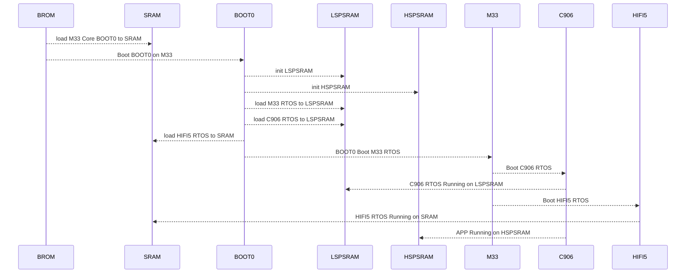

# 启动

下面简单介绍一下 R128 方案的资源划分与启动流程。

## 资源划分

### CPU 资源划分

!> 这只是默认配置方案，CPU 资源划分可以按照需求任意修改。

| CPU   | 功能说明                                                     |
| ----- | ------------------------------------------------------------ |
| M33   | 控制核。运行 WI-FI/BT 固件、协议栈、驱动、休眠唤醒、安全启动、安全控制 |
| C906  | 应用核。运行大部分驱动与主要应用，控制台                     |
| HIFI5 | 算法核。运行音频相关驱动与算法                               |

### 内存配置

R128 方案目前三个核 OS 运行的地址范围如下表。

!> 这只是默认配置方案，运行地址可以按照需求任意修改。

| CPU   | 内存使用地址                                  |
| ----- | --------------------------------------------- |
| M33   | `lspsram`，运行地址范围 0x8000000 - 0x8300000 |
| C906  | `lspsram`，运行地址范围 0x8300000 - 0x8800000 |
| HIFI5 | `sram`，运行地址 0x4040000 - 0x40F0000        |

## 启动流程

R128 方案非安全启动流程如下，其中 M33 为启动核：

!> 这只是默认配置方案，启动流程可以按照需求任意修改。

1. BROM
   1. 加载 M33 BOOT0 至 SRAM
   2. 跳转 M33 BOOT0 运行
2. M33 BOOT0
   1. 初始化 LSPSRAM 与 HSPSRAM
   2. 加载 M33 RTOS 至 LSPSRAM
   3. 加载 C906 RTOS 至 LSPSRAM
   4. 加载 HIFI5 RTOS 至 SRAM
   5. 跳转运行 M33 RTOS
3. M33 RTOS
   1. 启动运行 C906 RTOS
   2. 启动运行 HIFI5 RTOS
4. C906 RTOS
   1. 启动运行用户程序

## 修改启动核心

