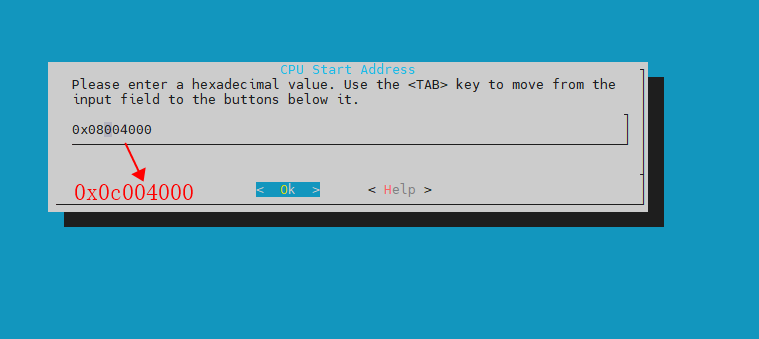

# 启动与资源划分

下面简单介绍一下 R128 方案的资源划分与启动流程。

## 资源划分

### CPU 资源划分

**这只是默认配置方案，CPU 资源划分可以按照需求任意修改**

| CPU   | 功能说明                                                     |
| ----- | ------------------------------------------------------------ |
| M33   | 控制核。运行 WI-FI/BT 固件、协议栈、驱动、休眠唤醒、安全启动、安全控制 |
| C906  | 应用核。运行大部分驱动与主要应用，控制台                     |
| HIFI5 | 算法核。运行音频相关驱动与算法                               |

### 内存配置

R128-S2 方案目前三个核 OS 运行的地址范围如下表。

1. 1M SRAM用在 M33 的PM功能上。
2. LPSRAM 共 8M，前面 2M 给 M33 核使用，M33 的代码运行在前面 2M 上，另外这 2M 中有 16K 是`sysconfig` 配置。
3. 剩余 6M 交给 C906 使用。
4. 8M `hpsram` 全部给 `dsp` 核使用。

**这只是默认配置方案，CPU 资源划分可以按照需求任意修改。**

>  `lspsram` 地址空间为 `0x8000000-0x87fffff`，`hspsram` 地址空间为 `0xc000000-0xc7fffff`。

| CPU   | 内存使用地址                                      | 作用                                            |
| ----- | ------------------------------------------------- | ----------------------------------------------- |
| M33   | `SRAM`, 运行地址范围 `0x4000000`-`0x40FFFFF`      | PM功能，休眠唤醒低功耗等                        |
| M33   | `lspsram`，运行地址范围 `0x8004000` - `0x8200000` | WI-FI/BT 固件、协议栈、驱动、安全启动、安全控制 |
| C906  | `lspsram`，运行地址范围 `0x8200000` - `0x87fffff` | 驱动与主要应用，控制台                          |
| HIFI5 | `hspsram`，运行地址范围 `0xC000660` - `0xC0A0660` | 运行音频相关驱动与算法                          |

R128-S3 方案目前三个核 OS 运行的地址范围如下表。

**这只是默认配置方案，CPU 资源划分可以按照需求任意修改。**

> `hspsram` 地址空间为 `0x0C000000-0x0DFFFFFF`

| CPU   | 内存使用地址                                      | 作用                                            |
| ----- | ------------------------------------------------- | ----------------------------------------------- |
| M33   | `SRAM`, 运行地址范围 `0x4000000`-`0x40FFFFF`      | PM功能，休眠唤醒低功耗等                        |
| M33   | `hspsram`，运行地址范围 `0xC004000` - `0xC200000` | WI-FI/BT 固件、协议栈、驱动、安全启动、安全控制 |
| C906  | `hspsram`，运行地址范围 `0xC200000` - `0xD7fffff` | 驱动与主要应用，控制台                          |
| HIFI5 | `hspsram`，运行地址范围 `0xD800660` - `0xD8A0660` | 运行音频相关驱动与算法                          |

## 启动流程

R128-S2 方案非安全启动流程如下，其中 M33 为启动核：

> 这只是默认配置方案，启动流程可以按照需求任意修改。

1. BROM
   1. 加载 M33 BOOT0 至 SRAM
   2. 跳转 M33 BOOT0 运行
2. M33 BOOT0
   1. 初始化 LSPSRAM 与 HSPSRAM
   2. 加载 M33 RTOS 至 LSPSRAM
   3. 加载 C906 RTOS 至 LSPSRAM
   4. 加载 HIFI5 RTOS 至 HSPSRAM
   5. 跳转运行 M33 RTOS
3. M33 RTOS
   1. 启动运行 C906 RTOS
   2. 启动运行 HIFI5 RTOS
4. C906 RTOS
   1. 启动运行用户程序


## 修改运行核心

系统有三个不同的核心，分别是 M33，C906，HIFI5，其中M33是启动核心不可以关闭，另外两个核心都可以关闭。当不需要使用 C906 核心或者 HIFI5 DSP 核心的时候，可以将这两个核心关闭。方法如下：

### 关闭 HIFI5 核心

首先，选择好 M33 的方案，因为 HIFI5 是由 M33 来启动的。

```
source envsetup.sh
lunch_rtos r128s2_m33
```

直接取消勾选即可：


### 关闭 C906 核心

首先，选择好 M33 的方案，因为 C906 是由 M33 来启动的。

```
source envsetup.sh
lunch_rtos r128s2_m33
```

直接取消勾选即可：


## 修改核心运行内存空间

### 修改到 HSPSRAM 运行

R128 的 M33 和 C906 两个核运行的系统都是默认运行在 LSPSRAM，这里示例如何修改到 HSPSRAM

1. 关闭启动 HIFI5 核心

首先，选择好 M33 的方案，因为 HIFI5 是由 M33 来启动的。

```
source envsetup.sh
lunch_rtos r128s2_m33
```

由于默认 HIFI5 是运行在 HSPSRAM 的，这里需要释放 HSPSRAM。运行 `mrtos_menuconfig` 启动配置。

直接取消勾选即可。


2. 将 M33 和 C906 设置成在 HSPSRAM 运行

首先选择 M33 的方案：

```
source envsetup.sh
lunch_rtos r128s2_m33
```

接着运行 `mrtos_menuconfig` 修改启动地址，所需要修改的配置如下图所示：


> lspsram 地址空间为 `0x8000000-0x87fffff`，hspsram 地址空间为 `0xc000000-0xc7fffff`。

这里将所需要的修改的核的地址，将8改成c即可。如修改 M33 的起始地址，将 `0x08004000`，修改成`0x0c004000` 即可，如下图。



然后保存配置，重新编译 M33 方案。接下来修改 C906 的地址，选择 C906 的方案

```
source envsetup.sh
lunch_rtos r128s2_c906
```

接着运行 `mrtos_menuconfig` 修改启动地址，所需要修改的配置如下图所示：


然后保存配置，重新编译 C906 方案。

## 查看代码内存分布

可以在 SDK 中运行 `kamp` 命令查看代码的内存分布


可以在最后查看内存的总使用情况


## 配置XIP

R128-S2 内置 NOR FLASH，可以将运行效率要求不高的代码保存在 XIP 段中，减少内存的占用。

配置 XIP 需要把对应的函数和库文件加入 `xip.lds.S` 中，具体语法请参照 ld 语法。


## 配置多个堆内存

有些时候当不需要使用 DSP 核心或者 DSP 核心内存使用量较少时，可以配置多个堆内存，将一部分内存放置于不同的 RAM 上使用。这里以 R128-S2 关闭 DSP 核心并将 HSPSRAM 分配给 C906 核心使用为例：

### 配置前内存分布情况

配置前进入 C906 核心运行 `free` 命令查看当前内存使用分布情况。


### 关闭 DSP 核心

首先，选择好 M33 的方案，因为 DSP 是由 M33 来启动的。

```
source envsetup.sh
lunch_rtos r128s2_m33
```

由于默认 DSP 是运行在 HSPSRAM 的，这里需要释放 HSPSRAM。运行 `mrtos_menuconfig` 启动配置。

直接取消勾选即可。

 

修改后请重新编译 M33 核心的固件。


### 将 HPSRAM 全部分配给 C906 使用

选择好 C906 的方案，运行配置界面

```
source envsetup.sh
lunch_rtos r128s2_c906
```


找到 `Kernel Options`


找到 ` Heap Memory Manager (Use heap-4 to allocate memory)  --->` 


选中 `Use heap-multiple to allocate memory`


配置 `Default Heap Ram` 为 `heap in lpsram` 配置默认内存堆为 `lpsram`


勾选 `lpsram heap` 和 `lpsram heap dynamic address`，意思是 `lpsram` 的内存是动态分布的

 

配置 `lpsram heap size` 的大小是`0x600000`，因为前面 `2M` 给 `M33` 使用，所以剩下 `6M`


配置 `hpsram heap` 使能 HPSRAM，并配置 `hpsram heap start address` 为 `0xc000000`，`hpsram heap size` 为 `0x7FFFFF` 表示将 HPSRAM 全部分配给 C906 核心使用。


### 将 HPSRAM 部分分配给 C906 使用

如果 HPSRAM 需要运行 DSP，可以分配部分给 C906 使用，配置 `hpsram heap start address`为 `0xc400000 `，`0xc000000` 是 HPSRAM 的开始地址，前面 4M 已经分配给 DSP 使用；并配置 `hpsram heap size` 为  `0x400000` 意思是可以用的 HPSRAM 大小是 4M。


### 配置后的内存分布情况

编译打包烧录后，可以使用 `free` 命令查看配置后的内存分布情况。可以看到 HPSRAM 的8M内存全部分配给 C906 使用了，C906 一共可以用 4M LPSRAM + 8M HPSRAM = 12M RAM


