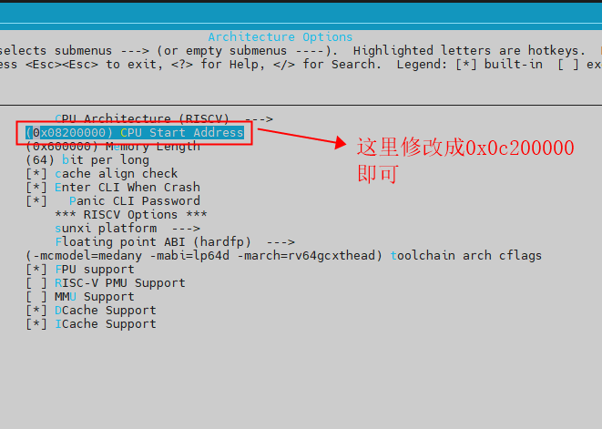

# 启动

下面简单介绍一下 R128 方案的资源划分与启动流程。

## 资源划分

### CPU 资源划分

> 这只是默认配置方案，CPU 资源划分可以按照需求任意修改。

| CPU   | 功能说明                                                     |
| ----- | ------------------------------------------------------------ |
| M33   | 控制核。运行 WI-FI/BT 固件、协议栈、驱动、休眠唤醒、安全启动、安全控制 |
| C906  | 应用核。运行大部分驱动与主要应用，控制台                     |
| HIFI5 | 算法核。运行音频相关驱动与算法                               |

### 内存配置

R128 方案目前三个核 OS 运行的地址范围如下表。

> 这只是默认配置方案，运行地址可以按照需求任意修改。

| CPU   | 内存使用地址                                  |
| ----- | --------------------------------------------- |
| M33   | `lspsram`，运行地址范围 0x8000000 - 0x8300000 |
| C906  | `lspsram`，运行地址范围 0x8300000 - 0x8800000 |
| HIFI5 | `hspsram`，运行地址范围 0xC000660 - 0xC0A0660 |

## 启动流程

R128 方案非安全启动流程如下，其中 M33 为启动核：

> 这只是默认配置方案，启动流程可以按照需求任意修改。

1. BROM
   1. 加载 M33 BOOT0 至 SRAM
   2. 跳转 M33 BOOT0 运行
2. M33 BOOT0
   1. 初始化 LSPSRAM 与 HSPSRAM
   2. 加载 M33 RTOS 至 LSPSRAM
   3. 加载 C906 RTOS 至 LSPSRAM
   4. 加载 HIFI5 RTOS 至 HSPSRAM
   5. 跳转运行 M33 RTOS
3. M33 RTOS
   1. 启动运行 C906 RTOS
   2. 启动运行 HIFI5 RTOS
4. C906 RTOS
   1. 启动运行用户程序


## 修改运行核心

系统有三个不同的核心，分别是 M33，C906，HIFI5，其中M33是启动核心不可以关闭，另外两个核心都可以关闭。当不需要使用 C906 核心或者 HIFI5 DSP 核心的时候，可以将这两个核心关闭。方法如下：

### 关闭 HIFI5 核心

首先，选择好 M33 的方案，因为 HIFI5 是由 M33 来启动的。

```
source envsetup.sh
lunch_rtos r128s2_m33
```

直接取消勾选即可：


### 关闭 C906 核心

首先，选择好 M33 的方案，因为 C906 是由 M33 来启动的。

```
source envsetup.sh
lunch_rtos r128s2_m33
```

直接取消勾选即可：


## 修改核心运行内存空间

### 修改到 HSPSRAM 运行

R128 的 M33 和 C906 两个核运行的系统都是默认运行在 LSPSRAM，这里示例如何修改到 HSPSRAM

1. 关闭启动 HIFI5 核心

首先，选择好 M33 的方案，因为 HIFI5 是由 M33 来启动的。

```
source envsetup.sh
lunch_rtos r128s2_m33
```

由于默认 HIFI5 是运行在 HSPSRAM 的，这里需要释放 HSPSRAM。运行 `mrtos_menuconfig` 启动配置。

直接取消勾选即可。


2. 将 M33 和 C906 设置成在 HSPSRAM 运行

首先选择 M33 的方案：

```
source envsetup.sh
lunch_rtos r128s2_m33
```

接着运行 `mrtos_menuconfig` 修改启动地址，所需要修改的配置如下图所示：


> lspsram 地址空间为 0x8000000-0x87fffff，hspsram 地址空间为 0xc000000-0xc7fffff。

这里将所需要的修改的核的地址，将8改成c即可。如修改 M33 的起始地址，将 `0x08004000`，修改成`0x0c004000` 即可，如下图。


然后保存配置，重新编译 M33 方案。接下来修改 C906 的地址，选择 C906 的方案

```
source envsetup.sh
lunch_rtos r128s2_c906
```

接着运行 `mrtos_menuconfig` 修改启动地址，所需要修改的配置如下图所示：



然后保存配置，重新编译 C906 方案。

3. 修改配置文件

首先，确认自己方案使用的 `image_header` 文件，运行一次打包的命令 `pack`，从打包的 `log` 中能看出方案所选的文件，如下图：


如果需要修改 M33 的地址，则只修改 M33 的即可，C906同理。如果取消启动 DSP，则直接注销掉 DSP的配置代码。

最后，修改 M33 和 C906 在 HSPSRAM 运行，并且取消运行 HIFI5 的 `image_header` 文件修改可如下所示：

```diff
diff --git a/r128s2/pro/configs/image_header_xip.cfg b/r128s2/pro/configs/image_header_xip.cfg
index 5c83ac1..fc87d06 100755
--- a/r128s2/pro/configs/image_header_xip.cfg
+++ b/r128s2/pro/configs/image_header_xip.cfg
@@ -30,9 +30,9 @@
         {"id": "0xa5e05a00", "bin": "boot0_spinor.fex", "attr": "0x01", "sram_offs": "0x40b0000", "ep": "0x40b0080"},
         {"id": "0xa5e05a00", "bin": "boot0_sdcard.fex", "attr": "0x01", "sram_offs": "0x40b0000", "ep": "0x40b0080"},
         {"id": "0xa5e15a01", "bin": "freertos-gz.fex", "attr": "0x01"},
-        {"id": "0xa5e05a01", "bin": "rtos_arm.fex", "attr": "0x01", "sram_offs": "0x8004000", "ep": "0x8004000"},
-        {"id": "0xa5e05a01", "bin": "rtos_riscv.fex", "attr": "0x01", "sram_offs": "0x8200000", "ep": "0x8200000"},
-           {"id": "0xa5e05a01", "bin": "rtos_dsp.fex", "attr": "0x01", "sram_offs": "0xc000000", "ep": "0xc000660"},
+        {"id": "0xa5e05a01", "bin": "rtos_arm.fex", "attr": "0x01", "sram_offs": "0xc004000", "ep": "0xc004000"},
+        {"id": "0xa5e05a01", "bin": "rtos_riscv.fex", "attr": "0x01", "sram_offs": "0xc200000", "ep": "0xc200000"},
+       //    {"id": "0xa5e05a01", "bin": "rtos_dsp.fex", "attr": "0x01", "sram_offs": "0xc000000", "ep": "0xc000660"},
         {"id": "0xa5e05a01", "bin": "etf.fex", "attr": "0x01", "sram_offs": "0x4000000", "ep": "0x4000000"},
         {"id": "0xa5e05a01", "bin": "rtos_xip_rv.fex", "attr": "0x02"},
         {}
```

