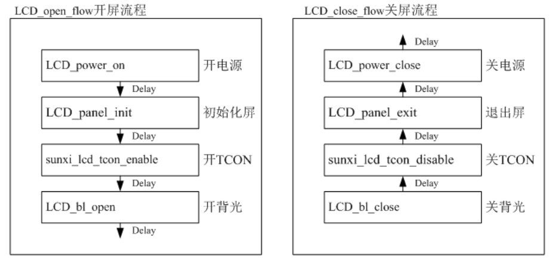
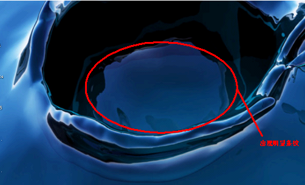
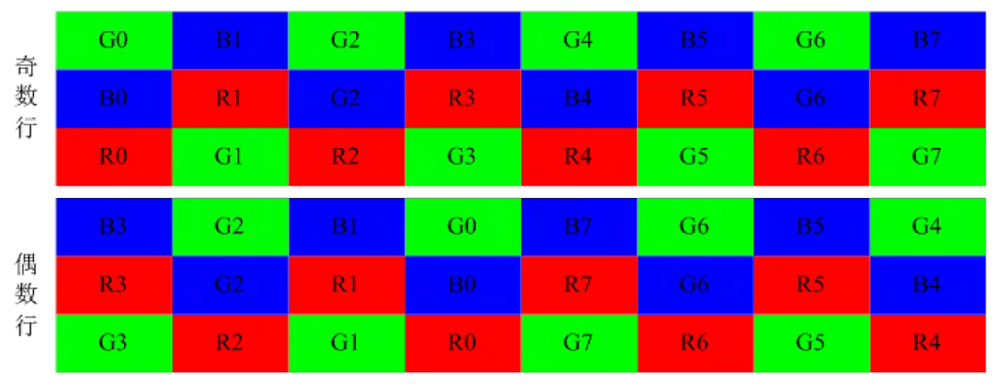
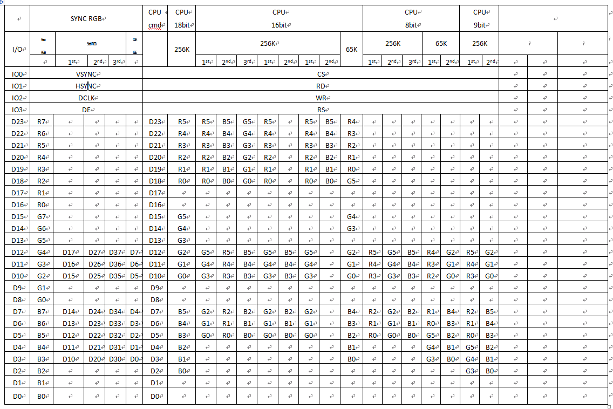

# 显示与屏幕驱动

RTOS 提供了一套完整的屏幕驱动，支持 RGB, i8080, SPI, DBI 格式的屏幕。

**（1）RGB 接口**

RGB接口在全志平台又称HV接口（Horizontal同步和Vertical同步）。有些LCD屏支持高级的功能比如 gamma，像素格式的设置等，但是 RGB 协议本身不支持图像数据之外的传输，所以无法通过 RGB 管脚进行对 LCD 屏进行配置，所以拿到一款 RGB 接口屏，要么不需要初始化命令，要么这个屏会提供额外的管脚给 SoC 来进行配置，比如 SPI 和 I2C 等。RGB 屏幕有许多格式，不同的位宽，不同的时钟周期。下表是位宽与时钟周期的区别。

| 位宽    | 时钟周期数 | 颜色数量和格式       | 并行\串行 RGB |
| ------- | ---------- | -------------------- | ------------- |
| 24 bits | 1 cycle    | 16.7M colors, RGB888 | 并行          |
| 18 bits | 1 cycle    | 262K colors, RGB666  | 并行          |
| 16 bits | 1 cycle    | 65K colors, RGB565   | 并行          |
| 6 bits  | 3 cycles   | 262K colors, RGB666  | 串行          |
| 6 bits  | 3 cycles   | 65K colors, RGB565   | 串行          |

串行 RGB 是相对于并行 RGB 来说，而并不是说它只用一根线来发数据，只要通过多个时钟周期才能把一个像素的数据发完，那么这样的 RGB 接口就是串行 RGB。

**（2）I8080 屏幕**

Intel 8080 接口屏(又称 MCU 接口)，很老的协议，一般用在分辨率很小的屏上。

管脚的控制脚有6种：

1. CS 片选信号，决定该芯片是否工作.
2. RS 寄存器选择信号，低表示选择 index 或者 status 寄存器，高表示选择控制寄存器。实际场景中一般接SoC的LCD_DE脚（数据使能脚）
3. WR （低表示写数据) 数据命令区分信号，也就是写时钟信号，一般接 SoC 的 LCD_CLK 脚
4. RD （低表示读数据）数据读信号，也就是读时钟信号，一般接 SoC 的 LCD_HSYNC 脚
5. RESET 复位LCD（ 用固定命令系列 0 1 0来复位)
6. Data 是双向的数据通路

I8080 根据的数据位宽接口有 8/9/16/18，连哪些脚参考，即使位宽一样，连的管脚也不一样，还要考虑的因素是 RGB 格式。

1. RGB565，总共有 65K 这么多种颜色
2. RGB666，总共有 262K 那么多种颜色
3. 9bit 固定为 262K

**（3）SPI 屏幕**

SPI LCD 是使用 SPI 总线传输图像数据的屏幕，只会出现在很低分辨率的屏幕上。一般来说开屏前都需要初始化操作。

## 适配 LCD 屏幕的步骤

1. 确保全志显示框架的内核配置有使能
2. 前期准备以下资料和信息：
   1. 屏手册。主要是描述屏基本信息和电气特性等，向屏厂索要。
   2. Driver IC 手册。主要是描述屏 IC 的详细信息。这里主要是对各个命令进行详解，对我们进行初始化定制有用，向屏厂索要。
   3. 屏时序信息。请向屏厂索要。
   4. 屏初始化代码，请向屏厂索要。一般情况下 DSI 和 I8080 屏等都需要初始化命令对屏进行初始化。
   5. 万用表。调屏避免不了测量相关电压。
3. 通过第2步屏厂提供的资料，定位该屏的类型，然后选择一个已有同样类型的屏驱动作为模板进行屏驱动添加或者直接在上面修改。
4. 修改屏驱动目录下的 `panel.c` 和 `panel.h`。在全局结构体变量 `panel_array` 中新增刚才添加 `strcut __lcd_panel` 的变量指针。`panel.h` 中新增 `strcut __lcd_panel` 的声明。
5. 修改 Makefile。在 lcd 屏驱动目录的上一级的 `Makefile` 文件中的`disp-objs`中新增刚才添加屏驱动.o
6. 修改 `sys_config.fex` 中的 `lcd0` 节点。
7. 编译测试

## LCD 屏幕驱动源码

### LCD 屏幕驱动源码结构

```
.
├── Kconfig
├── Makefile
├── disp
│   ├── Kconfig
│   ├── Makefile
│   ├── de                            # Display Engine 层驱动，包括图层与显示控制
│   │   ├── Makefile
│   │   ├── bsp_display.h
│   │   ├── disp_capture.c
│   │   ├── disp_capture.h
│   │   ├── disp_device.c
│   │   ├── disp_device.h
│   │   ├── disp_display.c
│   │   ├── disp_display.h
│   │   ├── disp_enhance.c
│   │   ├── disp_enhance.h
│   │   ├── disp_features.c
│   │   ├── disp_features.h
│   │   ├── disp_hdmi.c
│   │   ├── disp_hdmi.h
│   │   ├── disp_lcd.c
│   │   ├── disp_lcd.h
│   │   ├── disp_manager.c
│   │   ├── disp_manager.h
│   │   ├── disp_private.c
│   │   ├── disp_private.h
│   │   ├── disp_smart_backlight.c
│   │   ├── disp_smart_backlight.h
│   │   ├── disp_tv.c
│   │   ├── disp_tv.h
│   │   ├── disp_vdevice.c
│   │   ├── disp_vdevice.h
│   │   ├── include.h
│   │   └── lowlevel_v2x               # DISP 底层驱动，硬件寄存器交互
│   │       ├── Makefile
│   │       ├── de_ase.c
│   │       ├── de_ase_type.h
│   │       ├── de_bws.c
│   │       ├── de_bws_type.h
│   │       ├── de_ccsc.c
│   │       ├── de_clock.c
│   │       ├── de_clock.h
│   │       ├── de_csc.h
│   │       ├── de_csc_type.h
│   │       ├── de_dcsc.c
│   │       ├── de_dsi.c
│   │       ├── de_dsi.h
│   │       ├── de_dsi_28.c
│   │       ├── de_dsi_type.h
│   │       ├── de_dsi_type_28.h
│   │       ├── de_eink.c
│   │       ├── de_eink.h
│   │       ├── de_enhance.c
│   │       ├── de_enhance.h
│   │       ├── de_fcc.c
│   │       ├── de_fcc_type.h
│   │       ├── de_fce.c
│   │       ├── de_fce_type.h
│   │       ├── de_feat.c
│   │       ├── de_feat.h
│   │       ├── de_gsu.c
│   │       ├── de_gsu_type.h
│   │       ├── de_hal.c
│   │       ├── de_hal.h
│   │       ├── de_lcd.c
│   │       ├── de_lcd.h
│   │       ├── de_lcd_sun50iw10.c
│   │       ├── de_lcd_type.h
│   │       ├── de_lti.c
│   │       ├── de_lti_type.h
│   │       ├── de_peak.c
│   │       ├── de_peak_type.h
│   │       ├── de_rtmx.c
│   │       ├── de_rtmx.h
│   │       ├── de_rtmx_type.h
│   │       ├── de_scaler.h
│   │       ├── de_scaler_table.c
│   │       ├── de_scaler_table.h
│   │       ├── de_smbl.c
│   │       ├── de_smbl.h
│   │       ├── de_smbl_tab.h
│   │       ├── de_smbl_type.h
│   │       ├── de_vep.h
│   │       ├── de_vep_table.c
│   │       ├── de_vep_table.h
│   │       ├── de_vsu.c
│   │       ├── de_vsu_type.h
│   │       ├── de_wb.c
│   │       ├── de_wb.h
│   │       ├── de_wb_type.h
│   │       ├── disp_al.c
│   │       ├── disp_al.h
│   │       ├── disp_eink_data.c
│   │       ├── disp_eink_data.h
│   │       ├── disp_waveform.c
│   │       ├── disp_waveform.h
│   │       ├── rtmx_eink.c
│   │       └── rtmx_eink.h
│   ├── dev_disp.c                 # DISP 公共端口
│   ├── dev_disp.h
│   ├── disp_debug.c
│   ├── disp_debug.h
│   ├── disp_sys_intf.c
│   ├── disp_sys_intf.h
│   ├── lcd                        # LCD 面板驱动，包括自定义初始化控制，上下电时序控制
│   │   ├── Kconfig
│   │   ├── S6D7AA0X01.c
│   │   ├── S6D7AA0X01.h
│   │   ├── VVX07H005A10.c
│   │   ├── VVX07H005A10.h
│   │   ├── WilliamLcd.c
│   │   ├── WilliamLcd.h
│   │   ├── b080uan01_mipi1200x1920.c
│   │   ├── b080uan01_mipi1200x1920.h
│   │   ├── cl40bc1019_cpu.c
│   │   ├── cl40bc1019_cpu.h
│   │   ├── cpu_gg1p4062utsw.c
│   │   ├── cpu_gg1p4062utsw.h
│   │   ├── default_eink.c
│   │   ├── default_eink.h
│   │   ├── default_panel.c
│   │   ├── default_panel.h
│       └── wtq05027d01.h
├── soc                             # SoC 层特化驱动
│   ├── Kconfig
│   ├── Makefile
│   ├── VVX07H005A10_mipi_config.c
│   ├── disp_board_config.c
│   ├── disp_board_config.h
│   ├── he0801a068_mipi_config.c
│   ├── platform_resource.c
│   ├── platform_resource.h
│   ├── sun20iw2.c
└── tv                               # TV 驱动，R128不使用
    ├── Makefile
    ├── de_tve_sun8iw11.c
    ├── de_tve_sun8iw7.c
    ├── de_tve_v1.c
    ├── de_tvec.h
    ├── drv_tv.c
    ├── drv_tv.h
    ├── gm7121.c
    ├── tv_ac200.c
    ├── tv_ac200.h
    ├── tv_ac200_lowlevel.c
    └── tv_ac200_lowlevel.h
```

### 屏驱动源码位置

#### RGB 面板驱动

对于不需要初始化的 RGB 屏幕（一般是 40PIN，50PIN）使用 `default_panel.c` 

```
lichee/rtos‑hal/hal/source/disp2/disp/lcd/default_panel.c
```

#### LCD 面板特化驱动

部分 LCD 面板需要写 IIC，SPI初始化，或者有特殊的上下电要求，需要编写特化的屏幕驱动

```
lichee/rtos‑hal/hal/source/disp2/disp/lcd/
```

#### 配置文件

其中 “芯片型号” 例如 r128s3，和 “板子名称” 例如 pro，请根据实际替换。

```
board/芯片型号/板子名称/configs/
```

### 屏幕驱动配置

lcd 相关代码包含在 disp 驱动模块中，执行命令进入 menuconfig 配置主界面，并按以下步骤操作：

## 添加新屏

添加一款新屏幕通常需要以下步骤：

- `panel.c` 和 `panel.h`，当用户添加新屏驱动时，是需要修改这两个文件的，需要将屏结构体变量添加到全局结构体变量panel_array中。
- `lcd_source.c` 和 `lcd_source.h`，这两个文件实现的是给屏驱动使用的函数接口，比如电源开关，gpio，dsi 读写接口等，用户不需要修改只需要用。
- 屏驱动。除了上面提到的源文件外，其它的一般一个 c 文件和一个 h 文件就代表一个屏驱动。
- 在屏驱动源码位置的上一级，有用户需要修改的 `Makefile` 文件。

我们可以打开 `lichee/rtos‑hal/hal/source/disp2/disp/lcd/default_panel.c` 作为屏驱动的例子，在该文件的最后：

```c
struct __lcd_panel default_panel = {
    /* panel driver name, must mach the lcd_drv_name in sys_config.fex */
    .name = "default_lcd",
    .func = {
        .cfg_panel_info = LCD_cfg_panel_info,
        .cfg_open_flow = LCD_open_flow,
        .cfg_close_flow = LCD_close_flow,
    },
};
```

- 该全局变量 `default_panel` 的成员 `name` 与 `lcd_driver_name` 必须一致，这个关系到驱动能否找到指定的文件。

- 接 下 来 是 `func` 成 员 的 初 始 化， 这 里 最 主 要 实 现 三 个 回 调 函 数。`LCD_cfg_panel_info`, `LCD_open_flow` 和 `LCD_close_flow`。
- 开关屏流程即屏上下电流程，屏手册或者 driver IC 手册中里面的 Power on Sequence 和 Power off Sequence。用于开关屏的操作流程如下图所示



- 其中，`LCD_open_flow` 和 `LCD_close_flow` 称为开关屏流程函数。方框中的函数，如 `LCD_power_on`，称为开关屏步骤函数。
- 不需要进行初始化操作的 LCD 屏，例如部分 RGB 屏等，`LCD_panel_init` 及 `LCD_panel_exit` 这些函数可以为空。

#### LCD_open_flow

LCD_open_flow 函数只会在系统初始化的时候调用一次，执行每个 LCD_OPEN_FUNC 即是把对应的开屏步骤函数进行注册，先注册先执行，但并没有立刻执行该开屏步骤函数。

函数原型：

```c
static __s32 LCD_open_flow(__u32 sel)
```

函数常用内容为：

```c
static __s32 LCD_open_flow(__u32 sel)
{
    LCD_OPEN_FUNC(sel, LCD_power_on,10);
    LCD_OPEN_FUNC(sel, LCD_panel_init, 50);
    LCD_OPEN_FUNC(sel, sunxi_lcd_tcon_enable, 100);
    LCD_OPEN_FUNC(sel, LCD_bl_open, 0);
    return 0;
}
```

如上，调用四次 LCD_OPEN_FUNC 注册了四个回调函数，对应了四个开屏流程, 先注册先执行。实际上注册多少个函数是用户自己的自由，只要合理即可。

1. LCD_power_on 即打开 LCD 电源，再延迟 10ms；这个步骤一般用于打开 LCD 相关电源和相关管脚比如复位脚。这里一般是使用电源控制函数说明和管脚控制函数说明进行操作。
2. LCD_panel_init 即初始化屏，再延迟 50ms；不需要初始化的屏，可省掉此步骤，这个函数一般用于发送初始化命令给屏进行屏初始化。如果是 I8080 屏用I8080 接口函数说明，如果是其它情况比如 i2c 或者 spi 可以看使用 iic/spi 串行接口初始化，也可以用 GPIO 来进行模拟。
3. sunxi_lcd_tcon_enable 打开 TCON，再延迟 100ms；这一步是固定的，表示开始发送图像信号。
4. LCD_bl_open 打开背光，再延迟 0ms。前面三步搞定之后才开背光，这样不会看到闪烁。这里一般使用的函数请看背光控制函数说明。

#### LCD_OPEN_FUNC

注册开屏步骤函数到开屏流程中，记住这里是注册不是执行！

函数原型：

```c
void LCD_OPEN_FUNC(__u32 sel, LCD_FUNC func, __u32 delay)
```

参数说明：

`func` 是一个函数指针，其类型是：`void (*LCD_FUNC) (__u32 sel)`，用户自己定义的函数必须也要用统一的形式。比如：

```c
void user_defined_func(__u32 sel)
{
	// do something
}
```

`delay` 是执行该步骤后，再延迟的时间，时间单位是毫秒。

LCD_OPEN_FUNC 的第二个参数是前后两个步骤的延时长度，单位 ms，注意这里的数值请按照屏手册规定去填，乱填可能导致屏初始化异常或者开关屏时间过长，影响用户体验。

#### LCD_close_flow

与 `LCD_open_flow` 对应的是 `LCD_close_flow`，它用于注册关屏函数。使用 `LCD_CLOSE_FUNC` 进行函数注册，先注册先执行。这里只是注册回调函数，不是立刻执行。

```c
static s32 LCD_close_flow(u32 sel)
{
    /* close lcd backlight, and delay 0ms */
    LCD_CLOSE_FUNC(sel, LCD_bl_close, 0);
    /* close lcd controller, and delay 0ms */
    LCD_CLOSE_FUNC(sel, sunxi_lcd_tcon_disable, 50);
    /* open lcd power, than delay 200ms */
    LCD_CLOSE_FUNC(sel, LCD_panel_exit, 100);
    /* close lcd power, and delay 500ms */
    LCD_CLOSE_FUNC(sel, LCD_power_off, 0);
    return 0;
}
```

- 先关闭背光，这样整个关屏过程，用户不会看到闪烁的过程；
- 关闭 TCON（即停止发送数据）再延迟 50ms；
- 执行关屏代码，再延迟 200ms；（不需要初始化的屏，可省掉此步骤）
- 最后关闭电源，再延迟 0ms。

#### LCD_cfg_panel_info

配置的 TCON 扩展参数，比如 gamma 功能和颜色映射功能。

函数原型：

```c
static void LCD_cfg_panel_info(__panel_extend_para_t *info)
```

TCON 的扩展参数只能在屏文件中配置，参数的定义：

#####  lcd_frm

Lcd Frame Rate Modulator, FRM 是解决由于 PIN 减少导致的色深问题，有些 LCD 屏的像素格式是 18bit 色深（RGB666）或 16bit 色深（RGB565），建议打开 FRM 功能，通过 dither 的方式弥补色深，使显示达到 24bit 色深（RGB888）的效果。如下图所示，上图是色深为 RGB66 的 LCD 屏显示，下图是打开 dither 后的显示，打开 dither 后色彩渐变的地方过度平滑。

参数设置相应值对应含义为：

```
0：RGB888 ‑‑ RGB888 direct
1：RGB888 ‑‑ RGB666 dither
2：RGB888 ‑‑ RGB565 dither
```



#####  lcd_gamma_en

Lcd Gamma Correction Enable，设置相应值的对应含义为：

```
0：LCD 的 Gamma 校正功能关闭
1：LCD 的 Gamma 校正功能开启
```

设置为 1 时，需要在屏驱动中对 `lcd_gamma_tbl[256]` 进行赋值。

##### lcd_cmap_en

Lcd Color Map Enable， 设置为 1 时，需要对 `lcd_cmap_tbl [2][3][4]` 进行赋值 `Lcd Color Map Table`。

每个像素有 R、G、B 三个单元，每四个像素组成一个选择项，总共有 12 个可选。数组第一维表示奇偶行，第二维表示像素的 RGB，第三维表示第几个像素，数组的内容即表示该位置映射到的内容。

LCD CMAP 是对像素的映射输出功能，只有像素有特殊排布的 LCD 屏才需要配置。

LCD CMAP 定义每行的 4 个像素为一个总单元，每个像素分 R、G、B 3 个小单元，总共有 12 个小单元。通过 lcd_cmap_tbl 定义映射关系，输出的每个小单元可随意映射到 12 个小单元之一。

```c
__u32 lcd_cmap_tbl[2][3][4] = {
    {
        {LCD_CMAP_G0,LCD_CMAP_B1,LCD_CMAP_G2,LCD_CMAP_B3},
        {LCD_CMAP_B0,LCD_CMAP_R1,LCD_CMAP_B2,LCD_CMAP_R3},
        {LCD_CMAP_R0,LCD_CMAP_G1,LCD_CMAP_R2,LCD_CMAP_G3},
    },
    {
        {LCD_CMAP_B3,LCD_CMAP_G2,LCD_CMAP_B1,LCD_CMAP_G0},
        {LCD_CMAP_R3,LCD_CMAP_B2,LCD_CMAP_R1,LCD_CMAP_B0},
        {LCD_CMAP_G3,LCD_CMAP_R2,LCD_CMAP_G1,LCD_CMAP_R0},
    },
};
```

如上，上三行代表奇数行的像素排布，下三行代表偶数行的像素排布；

每四个像素为一个单元，第一列代表每四个像素的第一个像素映射，第二列代表每四个像素的第二个像素映射，以此类推。

如上的定义，像素的输出格式如下图所示。



##### lcd_rb_swap

调换 `TCON` 模块 `RGB` 中的 R 分量和 B 分量。

```
0：不变
1：调换R分量和B分量
```

需要 gamma 校正，或色彩映射，在 `sys_config.fex` 中将相应模块的 `enable` 参数置 1，`lcd_gamma_en`, `lcd_cmap_en`，并且填充 3 个系数表，`lcd_gamma_tbl`, `lcd_cmap_tbl`，注意的是：gamma，模板提供了 18 段拐点值，然后再插值出所有的值（255 个）。可以往相应表格内添加子项以补充细节部分。cmap_tbl 的大小是固定的，不能减小或增加表的大小。最终生成的 gamma 表项是由 rgb 三个 gamma 值组成的，各占 8bit。目前提供的模板中，三个 gamma 值是相同的。

#### 延时函数

函数原型

（毫秒级别）

```c
s32 sunxi_lcd_delay_ms(u32 ms)
```

（微秒级别）

```c
s32 sunxi_lcd_delay_us(u32 us)
```

#### 图像数据使能函数

打开 LCD 控制器，开始刷新 LCD 显示

```c
void sunxi_lcd_tcon_enable(u32 screen_id)
```

关闭 LCD 控制器，停止刷新数据

```c
void sunxi_lcd_tcon_disable(u32 screen_id)
```

#### 背光控制函数

打开背光，操作的是 `sys_config.fex` 中 `lcd_bl` 配置的 `gpio`。

```c
void sunxi_lcd_backlight_enable(u32 screen_id)
```

关闭背光，操作的是 `sys_config.fex` 中 `lcd_bl` 配置的 `gpio`。

```c
void sunxi_lcd_backlight_disable(u32 screen_id)
```

打开PWM背光，打开时 pwm 将往外输出 pwm 波形。对应的是` lcd_pwm_ch` 所对应的那一路 pwm。

```c
s32 sunxi_lcd_pwm_enable(u32 screen_id)
```

关闭PWM背光，打开时 pwm 将往外输出 pwm 波形。对应的是 `lcd_pwm_ch` 所对应的那一路 pwm。

```c
s32 sunxi_lcd_pwm_disable(u32 screen_id)
```

#### 电源控制函数

打开 `Lcd` 电源，操作的是 `sys_config.fex` 中的 `lcd_power/lcd_power1/lcd_power2`。（ `pwr_id`标识电源索引）

```c
void sunxi_lcd_power_enable(u32 screen_id, u32 pwr_id)
```

关闭 `Lcd` 电源，操作的是 `sys_config.fex` 中的 `lcd_power/lcd_power1/lcd_power2`。（ `pwr_id`标识电源索引）

```c
void sunxi_lcd_power_disable(u32 screen_id, u32 pwr_id)
```

1. pwr_id = 0：对应于 sys_config.fex 中的 lcd_power。

2. pwr_id = 1：对应于 sys_config.fex 中的 lcd_power1。
3. pwr_id = 2：对应于 sys_config.fex 中的 lcd_power2。
4. pwr_id = 3：对应于 sys_config.fex 中的 lcd_power3。

#### sunxi_lcd_pin_cfg

配置 lcd 的 io

函数原型

```c
s32 sunxi_lcd_pin_cfg(u32 screen_id, u32 bon)
```

配置 `lcd` 的 `data/clk` 等 `pin`，对应 `sys_config.fex` 中的 `lcdd0‑lcdd23/lcddclk/lcdde/lcdhsync/lcdvsync`。

参数：

- Bon: 1: 为开，0：为配置成 disable 状态。

####  I8080 接口函数说明

显示驱动提供 5 个接口函数可供使用。如下：

##### **sunxi_lcd_cpu_write**

设定 CPU 屏的指定寄存器为指定的值。

函数原型

```c
void sunxi_lcd_cpu_write(__u32 sel, __u32 index, __u32 data)
{
    sunxi_lcd_cpu_write_index(sel, index);
    sunxi_lcd_cpu_wirte_data(sel, data);
}
```

实现了 8080 总线上的两个写操作

- `sunxi_lcd_cpu_write_index` 实现第一个写操作，这时 PIN 脚 RS（A1）为低电平，总线数据上的数据内容为参数 index 的值。
- `sunxi_lcd_cpu_wirte_data` 实现第二个写操作，这时 PIN 脚 RS（A1）为高电平，总线数据上的数据内容为参数 data 的值。

##### **sunxi_lcd_cpu_write_index**

设定 CPU 屏为指定寄存器。

```c
void sunxi_lcd_cpu_write_index(__u32 sel,__u32 index)
```

参数：

- sel：显示屏 id
- index: 要设定的寄存器

##### **sunxi_lcd_cpu_write_data**

设定 CPU 屏寄存器的值为指定的值

```c
void sunxi_lcd_cpu_write_data(__u32 sel, __u32 data)
```

参数：

- sel：显示屏 id
- index: 要设定的寄存器的值

##### tcon0_cpu_rd_24b_data

读操作

```c
s32 tcon0_cpu_rd_24b_data(u32 sel, u32 index, u32 *data, u32 size)
```

参数：

- sel：显示屏 id
- index: 要读取的寄存器
- data：用于存放读取接口的数组指针，用户必须保证其有足够空间存放数据
- size：要读取的字节数

#### 管脚控制函数

##### **sunxi_lcd_gpio_set_value**

LCD_GPIO PIN 脚上输出高电平或低电平

```c
s32 sunxi_lcd_gpio_set_value(u32 screen_id, u32 io_index, u32 value)
```

参数：

- io_index = 0：对应于 sys_config.fex 中的 lcd_gpio_0。
- io_index = 1：对应于 sys_config.fex 中的 lcd_gpio_1。
- io_index = 2：对应于 sys_config.fex 中的 lcd_gpio_2。
- io_index = 3：对应于 sys_config.fex 中的 lcd_gpio_3。
- value = 0：对应 IO 输出低电平。
- value = 1：对应 IO 输出高电平。

只用于该 GPIO 定义为输出的情形。

##### **sunxi_lcd_gpio_set_direction**

设置 LCD_GPIO PIN 脚为输入或输出模式

```c
s32 sunxi_lcd_gpio_set_direction(u32 screen_id, u32 io_index, u32 direction)
```

参数：

- io_index = 0：对应于 sys_config.fex 中的 lcd_gpio_0。
- io_index = 1：对应于 sys_config.fex 中的 lcd_gpio_1。
- io_index = 2：对应于 sys_config.fex 中的 lcd_gpio_2。
- io_index = 3：对应于 sys_config.fex 中的 lcd_gpio_3。
- direction = 0：对应 IO 设置为输入。
- direction = 1：对应 IO 设置为输出。

一部分屏需要进行初始化操作，在开屏步骤函数中，对应于 `LCD_panel_init` 函数，提供了几种方式对屏的初始化。对于 CPU 屏，是通过 8080 总线的方式，使用的是 LCDIO（PD,PH）进行初始化。这种初始化方式，其总线的引脚位置定义与 CPU 屏一致。对于 SPI/IIC 初始化的 LCD，使用独立的IO初始化。

### 使用 SPI 初始化

一般使用 GPIO 模拟的方式初始化 SPI 屏幕，其中 SPI 模拟如下所示

```c
#define spi_scl_1 sunxi_lcd_gpio_set_value(0, 3, 1)  // 配置 lcd_gpio_3 为 SCL
#define spi_scl_0 sunxi_lcd_gpio_set_value(0, 3, 0)
#define spi_sdi_1 sunxi_lcd_gpio_set_value(0, 2, 1)  // 配置 lcd_gpio_2 为 SDI
#define spi_sdi_0 sunxi_lcd_gpio_set_value(0, 2, 0)
#define spi_cs_1 sunxi_lcd_gpio_set_value(0, 1, 1)   // 配置 lcd_gpio_1 为 CS
#define spi_cs_0 sunxi_lcd_gpio_set_value(0, 1, 0)

static void spi_write_cmd(u8 value)
{
	int i;

	spi_cs_0;
	spi_scl_0;

	spi_sdi_0;
	spi_scl_1;
	spi_scl_0;

	for (i = 0; i < 8; i++) {
		if (value & 0x80)
			spi_sdi_1;
		else
			spi_sdi_0;
		value <<= 1;

		spi_scl_1;
		spi_scl_0;
	}
	spi_cs_1;
}

static void spi_write_data(u8 value)
{
	int i;

	spi_cs_0;
	spi_scl_0;

	spi_sdi_1;
	spi_scl_1;
	spi_scl_0;

	for (i = 0; i < 8; i++) {
		if (value & 0x80)
			spi_sdi_1;
		else
			spi_sdi_0;
		value <<= 1;

		spi_scl_1;
		spi_scl_0;
	}
	spi_cs_1;
}
```

然后就可以调用 `spi_write_cmd(u8 value)` 与 `spi_write_data(u8 value)` 函数写入初始化命令。

也可以使用 硬件 SPI 初始化屏幕，代码如下

```c
static int spi_init(void)
{
    int ret = ‑1;
    struct spi_master *master;
    master = spi_busnum_to_master(1);
    if (!master)
    {
        lcd_fb_wrn("fail to get master\n");
        goto OUT
    }
    spi_device = spi_alloc_device(master);
    if (!spi_device)
    {
        lcd_fb_wrn("fail to get spi device\n");
        goto OUT;
    }
    spi_device‑> bits_per_word = 8;
    spi_device‑> max_speed_hz = 50000000; /*50MHz*/
    spi_device‑> mode = SPI_MODE_0;
    ret = spi_setup(spi_device);
    if (ret)
    {
        lcd_fb_wrn("Faile to setup spi\n");
        goto FREE;
    }
    lcd_fb_inf("Init spi1:bits_per_word:%d max_speed_hz:%d mode:%d\n", spi_device‑> bits_per_word,
               spi_device‑> max_speed_hz, spi_device‑> mode);
    ret = 0;
    goto OUT;
FREE:
    spi_master_put(master);
    kfree(spi_device);
    spi_device = NULL;
OUT:
    return ret;
}

static int comm_out(unsigned int sel, unsigned char cmd)
{
    struct spi_transfer t;
    if (!spi_device)
        return ‑1;
    DC(sel, 0);
    memset(&t, 0, sizeof(struct spi_transfer));
    t.tx_buf = &cmd;
    t.len = 1;
    t.bits_per_word = 8;
    t.speed_hz = 24000000;
    return spi_sync_transfer(spi_device, &t, 1);
}
```

首先调用 `spi_init` 函数对 `spi` 硬件进行初始化，`spi_init` 函数可以分为几个步骤，第一获取 `master`；根据实际的硬件连接，选择 `spi`（代码中选择了 `spi1`），如果这一步返回错误说 `spi` 没有配置好。第二步设置 `spi device`，这里包括最大速度，`spi` 传输模式，以及每个字包含的比特数。最后调用 `spi_setup` 完成 `master` 和 `device` 的关联。

`comm_out` 是一个 `spi` 传输的例子，核心就是 `spi_sync_transfer` 函数。

## 并行 RGB 接口

当我们配置并行 RGB 接口时，在配置里面并不需要区分是 24 位，18 位和 16 位，最大位宽是哪种是参考 pin mux 表格，如果 LCD 屏本身支持的位宽比 SoC 支持的位宽少，当然只能选择少的一方。

因为不需要初始化，RGB 接口极少出现问题，重点关注 lcd 的 timing 的合理性，也就是lcd_ht，lcd_hspw，lcd_hbp，lcd_vt，lcd_vspw 和 lcd_vbp 这个属性的合理性。

下面是典型并行 RGB 接口 sys_config.fex 配置示例，其中用空行把配置分成几个部分

```ini
;--------------------------------------------------
;Parallel RGB LCD
;--------------------------------------------------
[lcd0]
; Part 1
lcd_used            = 1
lcd_driver_name     = "default_lcd"

; Part 2
lcd_if              = 0

; Part 3
lcd_x               = 480
lcd_y               = 480
lcd_width           = 150
lcd_height          = 94
lcd_rb_swap         = 0
lcd_dclk_freq       = 21
lcd_hv_clk_phase    = 1

; Part 4
lcd_backlight       = 150
lcd_pwm_used        = 1
lcd_pwm_ch          = 5
lcd_pwm_freq        = 5000
lcd_pwm_pol         = 1

; Part 5
lcd_hbp             = 80
lcd_ht              = 648
lcd_hspw            = 8
lcd_vbp             = 10
lcd_vt              = 522
lcd_vspw            = 2
lcd_lvds_if         = 0
lcd_lvds_colordepth = 1
lcd_lvds_mode       = 0
lcd_frm             = 1
lcd_io_phase        = 0x0000
lcd_gamma_en        = 0
lcd_bright_curve_en = 0
lcd_cmap_en         = 0

deu_mode            = 0
lcdgamma4iep        = 22
smart_color         = 90

; Part 6
;LCD_D2-LCD_D7
lcd_gpio_4               = port:PA00<8><0><3><0>
lcd_gpio_5               = port:PA01<8><0><3><0>
lcd_gpio_6               = port:PA02<8><0><3><0>
lcd_gpio_7               = port:PA03<8><0><3><0>
lcd_gpio_8               = port:PA04<8><0><3><0>
lcd_gpio_9               = port:PA05<8><0><3><0>

;LCD_D10-LCD_D15
lcd_gpio_10              = port:PA11<8><0><3><0>
lcd_gpio_11              = port:PA10<8><0><3><0>
lcd_gpio_12              = port:PA08<8><0><3><0>
lcd_gpio_13              = port:PA07<8><0><3><0>
lcd_gpio_14              = port:PA06<8><0><3><0>
lcd_gpio_15              = port:PA09<8><0><3><0>

;LCD_D18-LCD_D23
lcd_gpio_16              = port:PA12<8><0><3><0>
lcd_gpio_17              = port:PA13<8><0><3><0>
lcd_gpio_18              = port:PA14<8><0><3><0>
lcd_gpio_19              = port:PA15<8><0><3><0>
lcd_gpio_20              = port:PB03<8><0><3><0>
lcd_gpio_21              = port:PB02<8><0><3><0>

;LCD_VSYNC, LCD_HSYNC, LCD_DCLK, LCD_DE
lcd_gpio_0              = port:PA18<8><0><3><0>
lcd_gpio_1              = port:PA19<8><0><3><0>
lcd_gpio_2              = port:PA20<8><0><3><0>
lcd_gpio_3              = port:PA21<8><0><3><0>
```

1. 第一部分，决定该配置是否使用，以及使用哪个屏驱动，lcd_driver_name 决定了用哪个屏驱动来初始化，这里是 default_lcd，是针对不需要初始化设置的 RGB 屏。
2. 第二部分决定下面的配置是一个并行 RGB 的配置。
3. 第三部分决定 SoC 中的 LCD 模块发送时序。请查看屏时序参数说明。
4. 第四部分决定背光（pwm 和 lcd_bl_en）。请看背光相关参数。
5. 第五部分是显示效果部分的配置，如果非 24 位的 RGB，那么一般情况下需要设置lcd_frm。
6. 第六部分就是电源和管脚配置。是用 RGB666 还是 RGB888，需要根据实际 pinmux 表来决定，如果该芯片只有 18 根 rgb 数据则只能 rgb18。请看电源和管脚参数。

## 串行 RGB 接口

串行 RGB 是相对于并行 RGB 来说，而并不是说它只用一根线来发数据，只要通过多个时钟周期才能把一个像素的数据发完，那么这样的 RGB 接口就是串行 RGB。

同样与并行 RGB 接口一样，配置中并不需要也无法体现具体是哪种串行 RGB 接口，你要做的就是把硬件连接对就行。

> 这里需要注意的是，对于该接口，SoC 总共需要三个周期才能发完一个 pixel，所以我们配置时序的时候，需要满足 `lcd_dclk_freq*3=lcd_ht*lcd_vt60`，或者 `lcd_dclk_freq=lcd_ht/3*lcd_vt*60` 要么 3 倍 `lcd_ht` 要么 3 倍 `lcd_dclk_freq`。

## I8080 接口

Intel 8080 接口屏 (又称 MCU 接口) 很老的协议，一般用在分辨率很小的屏上

管脚的控制脚有 6 种:

| 管脚                | 作用说明                                                     |
| ------------------- | ------------------------------------------------------------ |
| CS 片选信号         | 决定该芯片是否工作。                                         |
| RS 寄存器选择信号   | 低表示选择 index 或者 status 寄存器，高表示选择控制寄存器。实际场景中一般接 SoC 的 LCD_DE 脚（数据使能脚）。 |
| WR 数据命令区分信号 | 即写时钟信号，一般接 SoC 的 LCD_CLK 脚。（低表示写数据)      |
| RD 数据读信号       | 即读时钟信号，一般接 SoC 的 LCD_HSYNC 脚。（低表示读数据）   |
| RESET               | 复位 LCD（用固定命令系列 0 1 0 来复位）                      |
| Data                | 双向数据                                                     |

I8080 根据 Data 的数据位宽接口有 8/9/16/18，连哪些脚参考，即使位宽一样，连的管脚也不一样，还要考虑的因素是 rgb 格式。

1. RGB565，总共有 65K 种颜色
2. RGB666，总共有 262K 种颜色。
3. 9bit 固定为 262K。

## RGB 和 I8080 管脚配置示意图



## sys_config 参数说明

###  LCD 接口参数说明

#### lcd_driver_name

Lcd 屏驱动的名字（字符串），必须与屏驱动的名字对应。

####  lcd_model_name

Lcd 屏模型名字，非必须，可以用于同个屏驱动中进一步区分不同屏。

####  lcd_if

Lcd Interface，设置相应值的对应含义为：

```
0：HV RGB接口
1：CPU/I80接口
```

####  lcd_hv_if

Lcd HV panel Interface， 这个参数只有在 lcd_if=0 时才有效。定义 RGB 同步屏下的几种接口类型，设置相应值的对应含义为：

```
0：Parallel RGB
8：Serial RGB
10：Dummy RGB
11：RGB Dummy
12：Serial YUV (CCIR656)
```

####  lcd_hv_clk_phase

这个参数只有在 lcd_if=0 时才有效。定义 RGB 同步屏的 clock 与 data 之间的相位关系。总共有 4个相位可供调节,设置相应值的对应含义为：

```
0: 0 degree
1: 90 degree
2: 180 degree
3: 270 degree
```

#### lcd_hv_sync_polarity

这个参数只有在 lcd_if=0 时才有效。定义 RGB 同步屏的 hsync 和 vsync 的极性。设置相应值的对应含义为：

```
0：vsync active low，hsync active low
1：vsync active high，hsync active low
2：vsync active low，hsync active high
3：vsync active high，hsync active high
```

####  lcd_hv_srgb_seq

这个参数只有在 lcd_if=0 且 lcd_hv_if=8（Serial RGB）时才有效。定义奇数行 RGB 输出的顺序：

```
0: Odd lines R‑G‑B; Even line R‑G‑B
1: Odd lines B‑R‑G; Even line R‑G‑B
2: Odd lines G‑B‑R; Even line R‑G‑B
4: Odd lines R‑G‑B; Even line B‑R‑G
5: Odd lines B‑R‑G; Even line B‑R‑G
6: Odd lines G‑B‑R; Even line B‑R‑G
8: Odd lines R‑G‑B; Even line B‑R‑G
9: Odd lines B‑R‑G; Even line G‑B‑R
10: Odd lines G‑B‑R; Even line G‑B‑R
```

####  lcd_hv_syuv_seq

这个参数只有在 lcd_if=0 且 lcd_hv_if=12（Serial YUV）时才有效。定义 YUV 输出格式：

```
0：YUYV
1：YVYU
2：UYVY
3：VYU
```

####  lcd_hv_syuv_fdly

这个参数只有在 lcd_if=0 且 lcd_hv_if=12（Serial YUV）时才有效。定义 CCIR656 编码时 F 相对有效行延迟的行数：

```
0：F toggle right after active video line
1：Delay 2 lines (CCIR PAL)
2：Delay 3 lines (CCIR NTSC)
```

####  lcd_cpu_if

这个参数只有在 lcd_if=1 时才有效, 具体时序可参照RGB 和 I8080 管脚配置示意图中 CPU 那几列。设置相应值的对应含义为：

```
0：18bit/1cycle (RGB666)
2: 16bit/3cycle (RGB666)
4：16bit/2cycle (RGB666)
6：16bit/2cycle (RGB666)
8：16bit/1cycle (RGB565)
10：9bit/1cycle (RGB666)
12：8bit/3cycle (RGB666)
14：8bit/2cycle (RGB565)
```

####  lcd_cpu_te

设置相应值的对应含义为，设置为 0 时，刷屏间隔时间为 lcd_ht × lcd_vt；设置为 1 或 2 时，刷屏间隔时间为两个 te 脉冲：

```
0：frame trigged automatically
1：frame trigged by te rising edge
2：frame trigged by te falling edge
```

####  lcd_cpu_mode

设置相应值的对应含义为，设置为 0 时，刷屏间隔时间为 lcd_ht × lcd_vt；设置为 1 或 2 时，刷屏间隔时间为两个 te 脉冲：

```
0：中断自动根据时序，由场消隐信号内部触发
1：中断根据数据Block的counter触发或者由外部te触发。
```

## 屏时序参数说明

下面几个参数对于调屏非常关键，决定了发送端（SoC）发送数据时序。由于涉及到发送端和接收端的调试，除了分辨率和尺寸之外，其它几个数值都不是绝对不变的，两款一样分辨率，同种接口的屏，它们的数值也有可能不一样。

获取途径如下：

1. 询问 LCD 屏厂。
2. 从屏手册或者 Driver IC 手册中查找（向屏厂索要这些文档）
3. 在前面两步都搞不定的情况下，可以根据 vesa 标准来设置，主要是 DMT 和 CVT 标准。

由下面两条公式得知，我们不需要设置 `lcd_hfp` 和 `lcd_vfp` 参数，因为驱动会自动根据其它几个已知参数中算出 `lcd_hfp` 和 `lcd_vfp`。

### LCD 时序参数

#### lcd_x

显示屏的水平像素数量，即屏分辨率中的宽

####  lcd_y

显示屏的垂直行数，即屏分辨率中的高。

####  lcd_ht

指一行总的 dclk 的 cycle 个数。

####  lcd_hbp

指有效行间，行同步信号（hsync）开始，到有效数据开始之间的 dclk 的 cycle 个数，包括同步信号区。包含了 hspw 段，即lcd_hbp=实际的hbp+实际的hspw。

####  lcd_hspw

指行同步信号的宽度。单位为 1 个 dclk 的时间（即是 1 个 data cycle 的时间）。

####  lcd_vt

指一场的总行数。

####  lcd_vbp

指场同步信号（vsync）开始，到有效数据行开始之间的行数，包括场同步信号区。包含了 vspw 段，即 lcd_vbp= 实际的 vbp+ 实际的 vspw。

####  lcd_vspw

指场同步信号的宽度。单位为行。

####  lcd_dclk_freq

传输像素传送频率（单位为 MHz）。

```
fps = (lcd_dclk_freq * 1000 * 1000) / (ht * vt)
```

这个值根据以下公式计算

```
lcd_dclk_freq = lcd_ht * lcd_vt * fps
```

注意：

1. 后面的三个参数都是从屏手册中获得，fps 一般是 60。
2. 如果是串行接口，发完一个像素需要 2 到 3 个周期的，那么可以用以下公式计算：

```
lcd_dclk_freq * cycles = lcd_ht * lcd_vt * fps
lcd_dclk_freq = lcd_ht * cycles * lcd_vt * fps
```

####  lcd_width

此参数描述 lcd 屏幕的物理宽度，单位是 mm，用于计算 dpi。

####  lcd_height

此参数描述 lcd 屏幕的物理高度，单位是 mm，用于计算 dpi。

### 背光相关参数

目前用得比较广泛的就是 pwm 背光调节，原理是利用 pwm 脉冲开关产生的高频率闪烁效应，通过调节占空比，达到欺骗人眼，调节亮暗的目的。

####  lcd_pwm_used

是否使用 pwm，此参数标识用以背光亮度的控制

####  lcd_pwm_ch

此参数标识使用的 Pwm 通道，这里是指使用 SoC 哪个 pwm 通道，通过查看原理图连接可知。

####  lcd_pwm_freq

这个参数配置 PWM 信号的频率，单位为 Hz。

- 频率不宜过低否则很容易就会看到闪烁，频率不宜过快否则背光调节效果差。部分屏手册会标明所允许的 pwm 频率范围，请遵循屏手册固定范围进行设置。
- 在低亮度的时候容易看到闪烁，是正常现象，目前已知用上 pwm 的背光都是如此。

####  lcd_pwm_pol

这个参数配置 PWM 信号的占空比的极性。设置相应值对应含义为：

```
0：active high
1：active low
```

####  lcd_pwm_max_limit

Lcd backlight PWM 最高限制，以亮度值表示。

比如 150，则表示背光最高只能调到 150，0‑255 范围内的亮度值将会被线性映射到 0‑150 范围内。用于控制最高背光亮度，节省功耗

####  lcd_bl_en

背光使能脚，非必须，看原理图是否有，用于使能或者禁止背光电路的电压。

示例：

```
lcd_bl_en = port:PD24<1><2><default><1>
```

含义：PD24 输出高电平时打开 LCD 背光；下拉，默认高电平。

- 第一个尖括号：功能分配。1 为输出。
- 第二个尖括号：内置电阻。使用 0 的话，标示内部电阻高阻态，如果是 1 则是内部电阻上拉，2就代表内部电阻下拉。使用 default 的话代表默认状态，即电阻上拉。其它数据无效。
- 第三个尖括号：驱动能力。default 表驱动能力是等级 1。
- 第四个尖括号：电平。0 为低电平，1 为高电平。

需要在屏驱动调用相应的接口进行开、关的控制。

一般来说，高电平是使能，在这个前提下，建议将内阻电阻设置成下拉，防止硬件原因造成的上拉，导致背光提前亮。默认电平填写高电平，这是 uboot 显示过度到内核显示、平滑无闪烁的需要。

####  lcd_bl_n_percent

背光映射值，n 为 (0‑100)。

此功能是针对亮度非线性的 LCD 屏的，按照配置的亮度曲线方式来调整亮度变化，以使亮度变化更线性。

比如 lcd_bl_50_percent = 60，表明将 50% 的亮度值调整成 60%，即亮度比原来提高 10%。

> 修改此属性不当可能导致背光调节效果差。

#### lcd_backlight

背光默认值，0‑255。

此属性决定在 uboot 显示 logo 阶段的亮度，进入都内核时则是读取保存的配置来决定亮度。

> 显示 logo 阶段，一般来说需要比较亮的亮度，业内做法都是如此。

### 显示效果相关参数

####  lcd_frm

Lcd Frame Rate Modulator, FRM 是解决由于 PIN 减少导致的色深问题，有些 LCD 屏的像素格式是 18bit 色深（RGB666）或 16bit 色深（RGB565），建议打开 FRM 功能，通过 dither 的方式弥补色深，使显示达到 24bit 色深（RGB888）的效果。如下图所示，上图是色深为 RGB66 的 LCD 屏显示，下图是打开 dither 后的显示，打开 dither 后色彩渐变的地方过度平滑。

参数设置相应值对应含义为：

```
0：RGB888 ‑‑ RGB888 direct
1：RGB888 ‑‑ RGB666 dither
2：RGB888 ‑‑ RGB565 dither
```


####  lcd_gamma_en

Lcd Gamma Correction Enable，设置相应值的对应含义为：

```
0：LCD 的 Gamma 校正功能关闭
1：LCD 的 Gamma 校正功能开启
```

设置为 1 时，需要在屏驱动中对 `lcd_gamma_tbl[256]` 进行赋值。

#### lcd_cmap_en

Lcd Color Map Enable， 设置为 1 时，需要对 `lcd_cmap_tbl [2][3][4]` 进行赋值 `Lcd Color Map Table`。

每个像素有 R、G、B 三个单元，每四个像素组成一个选择项，总共有 12 个可选。数组第一维表示奇偶行，第二维表示像素的 RGB，第三维表示第几个像素，数组的内容即表示该位置映射到的内容。

LCD CMAP 是对像素的映射输出功能，只有像素有特殊排布的 LCD 屏才需要配置。

LCD CMAP 定义每行的 4 个像素为一个总单元，每个像素分 R、G、B 3 个小单元，总共有 12 个小单元。通过 lcd_cmap_tbl 定义映射关系，输出的每个小单元可随意映射到 12 个小单元之一。

```c
__u32 lcd_cmap_tbl[2][3][4] = {
    {
        {LCD_CMAP_G0,LCD_CMAP_B1,LCD_CMAP_G2,LCD_CMAP_B3},
        {LCD_CMAP_B0,LCD_CMAP_R1,LCD_CMAP_B2,LCD_CMAP_R3},
        {LCD_CMAP_R0,LCD_CMAP_G1,LCD_CMAP_R2,LCD_CMAP_G3},
    },
    {
        {LCD_CMAP_B3,LCD_CMAP_G2,LCD_CMAP_B1,LCD_CMAP_G0},
        {LCD_CMAP_R3,LCD_CMAP_B2,LCD_CMAP_R1,LCD_CMAP_B0},
        {LCD_CMAP_G3,LCD_CMAP_R2,LCD_CMAP_G1,LCD_CMAP_R0},
    },
};
```

如上，上三行代表奇数行的像素排布，下三行代表偶数行的像素排布；

每四个像素为一个单元，第一列代表每四个像素的第一个像素映射，第二列代表每四个像素的第二个像素映射，以此类推。

如上的定义，像素的输出格式如下图所示。


#### lcd_rb_swap

调换 `TCON` 模块 `RGB` 中的 R 分量和 B 分量。

```
0：不变
1：调换R分量和B分量
```

需要 gamma 校正，或色彩映射，在 `sys_config.fex` 中将相应模块的 `enable` 参数置 1，`lcd_gamma_en`, `lcd_cmap_en`，并且填充 3 个系数表，`lcd_gamma_tbl`, `lcd_cmap_tbl`，注意的是：gamma，模板提供了 18 段拐点值，然后再插值出所有的值（255 个）。可以往相应表格内添加子项以补充细节部分。cmap_tbl 的大小是固定的，不能减小或增加表的大小。最终生成的 gamma 表项是由 rgb 三个 gamma 值组成的，各占 8bit。目前提供的模板中，三个 gamma 值是相同的。

### 电源和管脚参数

####  lcd_power

配置好之后，需要在屏驱动调用相应的接口进行开、关的控制。

注意：如果有多个电源需要打开，则定义 lcd_power1，lcd_power2 等。

####  lcd_pin_power

用法 lcd_power一致，区别是用户设置之后，不需要在屏驱动中去操作，而是驱动框架自行在屏驱动之前使能，在屏驱动之后禁止。

注意：如果需要多组，则添加 lcd_pin_power1，lcd_pin_power2 等。除了 lcddx 之外，这里的电源还有可能是 pwm 所对应管脚的电源。

####  lcd_gpio_0

示例：

```
lcd_gpio_0 = port:PD25<0><0><default><0>
```

含义：lcd_gpio_0 引脚为 PD25。

- 第一个尖括号：功能分配。1 为输出。
- 第二个尖括号：内置电阻。使用 0 的话，标示内部电阻高阻态，如果是 1 则是内部电阻上拉，2就代表内部电阻下拉。使用 default 的话代表默认状态，即电阻上拉。其它数据无效。
- 第三个尖括号：驱动能力。default 表驱动能力是等级 1。
- 第四个尖括号：电平。0 为低电平，1 为高电平。

注意：如果有多个 gpio 脚需要控制，则定义 lcd_gpio_0，lcd_gpio_1 等。

1. 配置 LCD 的控制 PIN。可以在屏驱动调用相应的接口进行拉高，拉低的控制，例如 LCD 的 RESET 脚等。
2. 配置 LCD 的数据 PIN。重点关注 PIN 脚的复用功能数值，具体的 IO 对应关系可参考 user manual 手册进行配置

## 调试

系统起来之后可以输入disp相关调试命令，来协助调试。

| 选项 | 参数                            | 解释                                 | 举例                       |
| ---- | ------------------------------- | ------------------------------------ | -------------------------- |
| 空   | 空                              | 打印出当前显示的信息                 | disp                       |
| -c   | Screen_id,color 模式            | 显示 colorbar。共有 8 种模式，0 到 8 | disp ‑c 0 8                |
| -b   | Screen_id, 背光值               | 调整 lcd 背光，背光值范围时 0 到 255 | disp ‑b 0 255              |
| -d   | Screen_id, 文件路径             | 抓 DE 图层回写到文件                 | disp ‑d 0 /sdmmc/xx.bmp    |
| -s   | Screen_id，显示类型，显示分辨率 | 切换显示类型或分辨率                 | disp ‑s 0 1 4 打开LCD 显示 |

### 查看显示信息

输入disp命令，会有 Log 打印信息。以下信息是所有信息中最重要的。

```
disp

screen 0:
derate 297000000 hz, ref_fps:60
mgr0: 1280x800 fmt[rgb] cs[0x204] range[full] eotf[0x4] bits[8bits] err[0] force_sync[0] unblank direct_show[false]
lcd output backlight( 50) fps:60.9 1280x 800

err:0 skip:31 irq:1942 vsync:0 vsync_skip:0
BUF enable ch[1] lyr[0] z[0] prem[N] a[globl 255] fmt[ 8] fb[1280, 800;1280, 800;1280, 800] crop[ 0, 0,1280, 800] frame[
	0, 0,1280, 800] addr[ 0, 0, 0] flags[0x 0] trd[0,0]
```

#### **lcd output**

表示当前显示接口是 LCD 输出。

#### 1280x800

表示当前 LCD 的分辨率，与 sys_config.fex 中 lcd0 的设置一样。

#### ref_fps:60

是根据你在 sys_config.fex 的 lcd0 填的时序算出来的理论值。

#### fps:60.9

后面的数值是实时统计的，正常来说应该是在 60(期望的 fps) 附近，如果差太多则不正常，重新检查屏时序，和在屏驱动的初始化序列是否有被调用到。

#### irq:1942

这是 vsync 中断的次数，每加 1 都代表刷新了一帧，正常来说是一秒 60（期望的 fps）次，重复 cat sys，如果无变化，则异常。

#### BUF

开头的表示图层信息，一行 BUF 表示一个图层，如果一个 BUF 都没有出现，那么将是黑屏，不过和屏驱动本身关系就不大了，应该查看应用层 & 框架层。

#### err:0

这个表示缺数，如果数字很大且一直变化，屏幕会花甚至全黑，全红等。

####  skip:31

这个表示跳帧的数量，如果这个数值很大且一直变化，有可能卡顿，如果数字与 irq 后面的数字一样，说明每一帧都跳，会黑屏（有背光）

### 查看时钟信息

```
hal_ccmu
```

这个命令可以看哪个时钟是否使能，然后频率是多少。与显示相关的是 tcon，pll_video等。

#### 查看接口自带 colorbar

显示是一整条链路，中间任何一个环节出错，最终的表现都是显示异常，图像显示异常几个可能原因：

1. 图像本身异常。
2. 图像经过 DE（Display Engine）后异常。
3. 图像经过接口模块后异常。这是我们关注的点。

有一个简单的方法可以初步判断，接口模块（tcon 和 dsi 等）可以自己输出内置的一些 patten，比如说彩条，灰阶图，棋盘图等。当接口输出这些内置 patten 的时候，如果这时候显示就异常，这说明了：

1. LCD 的驱动或者配置有问题
2. LCD 屏由于外部环境导致显示异常

显示自带 patten 的方式：

```
disp ‑c 0 X
```

上面的操作是显示 colorbar，其中的 X 可以是 0 到 8

## FAQ

### 屏显示异常

总结过往经验，绝大部分屏显异常都是由于上下电时序和 timing 不合理导致。

### 黑屏‑无背光

问题表现：完全黑屏，背光也没有

1. 屏驱动添加失败。驱动没有加载屏驱动，导致背光电源相关函数没有运行到。这个你可以通过相关模块的测试命令定位下。
2. pwm 配置和背光电路的问题，pwm 的信息可以查看 pwm 模块测试命令和背光相关参数，另外就是直接测量下硬件测量下相关管脚和电压，再检查屏是否初始化成功。

### 黑屏‑有背光

黑屏但是有背光，可能有多种原因导致，请依次按以下步骤检查

1. 没送图层。如果应用没有送任何图层那么表现的现象就是黑屏，通过查看显示信息一小节可以确定有没有送图层。如果确定没有图层，可以通过查看接口自带 colorbar，确认屏能否正常显示。
2. SoC 端的显示接口模块没有供电。SoC 端模块没有供电自然无法传输视频信号到屏上。
3. 复位脚没有复位。如果有复位脚，请确保硬件连接正确，确保复位脚的复位操作有放到屏驱动中。
4. sys_config.fex 中 lcd0 有严重错误。第一个是 lcd 的 timing 搞错了，请严格按照屏手册中的提示来写。参考屏时序参数说明。第二个就是，接口类型搞错，比如接的 DSI 屏，配置却写成LVDS 的。
5. 屏的初始化命令不对。包括各个步骤先后顺序，延时等，这个时候请找屏厂确认初始化命令。

### 闪屏

分为几种：

1. 屏的整体在闪：这个最大可能是背光电路的电压不稳定，检查电压
2. 屏部分在闪，而且是概率性：sys_config.fex 中的时序填写不合理。
3. 屏上由一个矩形区域在闪：屏极化导致，需要关机放一边再开机则不会。

### 条形波纹

有些 LCD 屏的像素格式是 18bit 色深（RGB666）或 16bit 色深（RGB565），建议打开 FRM 功能，通过 dither 的方式弥补色深，使显示达到 24bit 色深（RGB888）的效果。

设置 [lcd0] 的 lcd_frm 属性可以改善这种现象。

### 背光太亮或者太暗

重新配置背光参数

### 花屏

花屏的第一个原因是 fps 过高，超过屏的限制：

FPS 异常是一件非常严重的事情，关系到整个操作系统的稳定，如果 fps 过高会造成系统带宽增加，送显流程异常，fps 过高还会造成 LCD 屏花屏不稳定，容易造成 LCD 屏损坏，FPS 过低则造成用户体验过差。

1. 通过查看查看显示信息一节，可以得知现在的实时统计的 fps
2. 如果 fps 离正常值差很多，首先检查 sys_config.fex 中 [lcd0] 节点，所填信息必须满足下面公式：

```
lcd_dclk_freq * num_of_pixel_clk = lcd_ht * lcd_vt * fps / 1e9
```

其中，num_of_pixel_clk 通常为 1，表示发送一个像素所需要的时钟周期为 1 一个，低分辨率的MCU 和串行接口通常需要 2 到 3 个时钟周期才能发送完一个像素。

如果上面填写没有错，通过查看查看时钟信息可以确认下几个主要时钟的频率信息，把这些信息和 sys_config.fex 发给维护者进一步分析。

###  RGB 接口或者 I8080 接口显示抖动有花纹

1. 改大时钟管脚的管脚驱动能力
2. 修改时钟相位，也就是修改 lcd_hv_clk_phase。由于发送端和接收端时钟相位的不同导致接收端解错若干位。

### LCD 屏出现极化和残影

何谓液晶极化现象：实际上就是液晶电介质极化。就是在外界电场作用下，电介质内部沿电场方向产生感应偶极矩，在电解质表明出现极化电荷的现象叫做电介质的极化。

通俗的讲就是在液晶面板施加一定电压后，会聚集大量电荷，当电压消失的时候，这些聚集的电荷也要释放，但由于介电效应，这些聚集的电荷不会立刻释放消失，这些不会马上消失的惰性电荷造成了液晶的 DC 残留从而形成了极化现象。

**几种常见的液晶极化现象**

1. 液晶长期静止某个画面的时候，切换到灰阶画面的时候出现屏闪，屏闪一段时间后消失。这种现象属于残留电荷放电的过程。
2. 液晶长期静止某个画面的时候，出现四周发黑中间发白的现象，业内称为黑白电视框异常。
3. 非法关机的时候，重新上电会出现屏闪，屏闪一定时间后消失。与第一种原因相同。
4. 残影现象：当液晶静止在一个画面比较久的情况下，切换其他画面出现的镜像残留。残影的本质来说是液晶 DC 残留电荷导致，某种意义来说也属于液晶极化现象

针对液晶屏出现极化和残影现象，有如下对策。

1. 调整 vcom 电压大小。

VCOM 是液晶分子偏转的参考电压，要求要稳定，对液晶显示有直接影响，具体的屏不同的话也是不同的。电压的具体值是根据输入的数据以及 Vcom 电压大小来确定的，用来显示各种不同灰阶，也就是实现彩色显示 GAMMA。Gamma 电压是用来控制显示器的灰阶的，一般情况下分为G0~G14，不同的 Gamma 电压与 Vcom 电压之间的压差造成液晶旋转角度不同从而形成亮度的差异，Vcom 电压最好的状况是位于 G0 和 G14 的中间值，这样液晶屏的闪烁状况会最好。调节 vcom 电压的方式，如果屏管脚有 vcom 管脚，直接调整相关电路，如果屏 driver IC 提供寄存器接口，可以通过寄存器接口来调整大小。

2. 严格按照屏规定的上下电时序来对屏进行开关屏。许多极化残影现象并非长时间显示静止显示某个画面导致的，而是由于关机或者关屏时没有严格按照下电时序导致的，比如该关的电没关,或者延时不够。

## 典型屏幕参数配置

### 1024x600 RGB666 屏幕

```
;--------------------------------------------------
;Parallel RGB LCD
;--------------------------------------------------
[lcd0]
lcd_used            = 1

lcd_driver_name     = "default_lcd"
lcd_backlight       = 150
lcd_if              = 0
lcd_x               = 1024
lcd_y               = 600
lcd_width           = 150
lcd_height          = 94
lcd_rb_swap         = 0
lcd_dclk_freq       = 48
lcd_pwm_used        = 1
lcd_pwm_ch          = 7
lcd_pwm_freq        = 500000
lcd_pwm_pol         = 1
lcd_hbp             = 160
lcd_ht              = 1344
lcd_hspw            = 20
lcd_vbp             = 20
lcd_vt              = 635
lcd_vspw            = 3
lcd_lvds_if         = 0
lcd_lvds_colordepth = 1
lcd_lvds_mode       = 0
lcd_frm             = 0
lcd_io_phase        = 0x0000
lcd_gamma_en        = 0
lcd_bright_curve_en = 0
lcd_cmap_en         = 0

;reset
;lcd_gpio_0               = port:GPIO_EXP15<1><0><3><1>
;cs
;lcd_gpio_1               = port:GPIO_EXP03<1><0><3><0>
;sdi
;lcd_gpio_2               = port:GPIO_EXP06<1><0><3><0>
;scl
;lcd_gpio_3               = port:GPIO_EXP07<1><0><3><0>

;LCD_D2-LCD_D7
lcd_gpio_4               = port:PA00<8><0><3><0>
lcd_gpio_5               = port:PA01<8><0><3><0>
lcd_gpio_6               = port:PA02<8><0><3><0>
lcd_gpio_7               = port:PA03<8><0><3><0>
lcd_gpio_8               = port:PA04<8><0><3><0>
lcd_gpio_9               = port:PA05<8><0><3><0>

;LCD_D10-LCD_D15
lcd_gpio_10              = port:PA11<8><0><3><0>
lcd_gpio_11              = port:PA10<8><0><3><0>
lcd_gpio_12              = port:PA08<8><0><3><0>
lcd_gpio_13              = port:PA07<8><0><3><0>
lcd_gpio_14              = port:PA06<8><0><3><0>
lcd_gpio_15              = port:PA09<8><0><3><0>

;LCD_D18-LCD_D23
lcd_gpio_16              = port:PA12<8><0><3><0>
lcd_gpio_17              = port:PA13<8><0><3><0>
lcd_gpio_18              = port:PA14<8><0><3><0>
lcd_gpio_19              = port:PA15<8><0><3><0>
lcd_gpio_20              = port:PB03<8><0><3><0>
lcd_gpio_21              = port:PB02<8><0><3><0>

;LCD_VSYNC, LCD_HSYNC, LCD_DCLK, LCD_DE
lcd_gpio_0              = port:PA18<8><0><3><0>
lcd_gpio_1              = port:PA19<8><0><3><0>
lcd_gpio_2              = port:PA20<8><0><3><0>
lcd_gpio_3              = port:PA21<8><0><3><0>
```

### 320x480 ST7796 i8080 屏幕

```
;--------------------------------------------------
;MCU LCD
;--------------------------------------------------
[lcd0]
lcd_used            = 1

lcd_driver_name     = "cl40bc1019_cpu"
lcd_backlight       = 150
lcd_if              = 1
lcd_x               = 320
lcd_y               = 480
lcd_width           = 150
lcd_height          = 94
lcd_rb_swap         = 0

lcd_pwm_used        = 1
lcd_pwm_ch          = 7
lcd_pwm_freq        = 5000
lcd_pwm_pol         = 1

lcd_cpu_mode        = 0
lcd_cpu_te          = 0
lcd_cpu_if          = 12

lcd_dclk_freq       = 32
lcd_hbp             = 75
lcd_ht              = 1060
lcd_hspw            = 40
lcd_vbp             = 6
lcd_vt              = 490
lcd_vspw            = 2

lcd_lvds_if         = 0
lcd_lvds_colordepth = 1
lcd_lvds_mode       = 0
lcd_frm             = 0
lcd_io_phase        = 0x0000
lcd_gamma_en        = 0
lcd_bright_curve_en = 0
lcd_cmap_en         = 0

deu_mode            = 0
lcdgamma4iep        = 22
smart_color         = 90

;reset pin
lcd_gpio_0               = port:PB03<1><0><3><0>
;CS
lcd_gpio_1               = port:PA12<1><0><3><0>

;LCD_D3-LCD_D7
lcd_gpio_2               = port:PA01<8><0><3><0>
lcd_gpio_3               = port:PA02<8><0><3><0>
lcd_gpio_4               = port:PA03<8><0><3><0>
lcd_gpio_5               = port:PA04<8><0><3><0>
lcd_gpio_6               = port:PA05<8><0><3><0>

;LCD_D10-LCD_D12
lcd_gpio_7               = port:PA11<8><0><3><0>
lcd_gpio_8               = port:PA10<8><0><3><0>
lcd_gpio_9               = port:PA08<8><0><3><0>

;WR
lcd_gpio_10              = port:PA06<7><0><3><0>
;RD
lcd_gpio_11              = port:PA07<7><0><3><0>
;RS
lcd_gpio_12              = port:PA09<7><0><3><0>
```

### 480x480 RGB 86 面板屏

```
;--------------------------------------------------
;Parallel RGB LCD
;--------------------------------------------------
[lcd0]
lcd_used            = 1

lcd_driver_name     = "p0400060a"
lcd_backlight       = 150
lcd_if              = 0
lcd_x               = 480
lcd_y               = 480
lcd_width           = 94
lcd_height          = 94
lcd_rb_swap         = 0
lcd_dclk_freq       = 21
lcd_hv_clk_phase    = 1
lcd_pwm_used        = 1
lcd_pwm_ch          = 6
lcd_pwm_freq        = 5000
lcd_pwm_pol         = 1
lcd_hbp             = 80
lcd_ht              = 648
lcd_hspw            = 8
lcd_vbp             = 10
lcd_vt              = 522
lcd_vspw            = 2
lcd_lvds_if         = 0
lcd_lvds_colordepth = 1
lcd_lvds_mode       = 0
lcd_frm             = 1
lcd_io_phase        = 0x0000
lcd_gamma_en        = 0
lcd_bright_curve_en = 0
lcd_cmap_en         = 0

deu_mode            = 0
lcdgamma4iep        = 22
smart_color         = 90

;reset
lcd_gpio_0               = port:PB01<1><0><3><1>
;cs
lcd_gpio_1               = port:PA27<1><0><3><0>
;sdi
lcd_gpio_2               = port:PA28<1><0><3><0>
;scl
lcd_gpio_3               = port:PB00<1><0><3><0>


;LCD_D2-LCD_D7
lcd_gpio_4               = port:PA00<8><0><3><0>
lcd_gpio_5               = port:PA01<8><0><3><0>
lcd_gpio_6               = port:PA02<8><0><3><0>
lcd_gpio_7               = port:PA03<8><0><3><0>
lcd_gpio_8               = port:PA04<8><0><3><0>
lcd_gpio_9               = port:PA05<8><0><3><0>

;LCD_D10-LCD_D15
lcd_gpio_10              = port:PA11<8><0><3><0>
lcd_gpio_11              = port:PA10<8><0><3><0>
lcd_gpio_12              = port:PA08<8><0><3><0>
lcd_gpio_13              = port:PA07<8><0><3><0>
lcd_gpio_14              = port:PA06<8><0><3><0>
lcd_gpio_15              = port:PA09<8><0><3><0>

;LCD_D18-LCD_D23
lcd_gpio_16              = port:PA12<8><0><3><0>
lcd_gpio_17              = port:PA13<8><0><3><0>
lcd_gpio_18              = port:PA14<8><0><3><0>
lcd_gpio_19              = port:PA15<8><0><3><0>
lcd_gpio_20              = port:PB03<8><0><3><0>
lcd_gpio_21              = port:PB02<8><0><3><0>

;LCD_VSYNC, LCD_HSYNC, LCD_DCLK, LCD_DE
lcd_gpio_22              = port:PA18<8><0><3><0>
lcd_gpio_23              = port:PA19<8><0><3><0>
lcd_gpio_24              = port:PA20<8><0><3><0>
lcd_gpio_25              = port:PA21<8><0><3><0>
```

### 320x320 i8080 86 面板屏

```
[lcd0]
lcd_used            = 1

lcd_driver_name     = "d392t9390v0_cpu"
lcd_backlight       = 200
lcd_if              = 1
lcd_x               = 320
lcd_y               = 320
lcd_width           = 78
lcd_height          = 78
lcd_rb_swap         = 1

lcd_pwm_used        = 1
lcd_pwm_ch          = 7
lcd_pwm_freq        = 50000
lcd_pwm_pol         = 1

lcd_cpu_mode        = 0
lcd_cpu_te          = 0
lcd_cpu_if          = 12

lcd_dclk_freq       = 32
lcd_hbp             = 75
lcd_ht              = 1060
lcd_hspw            = 40
lcd_vbp             = 6
lcd_vt              = 490
lcd_vspw            = 2

lcd_lvds_if         = 0
lcd_lvds_colordepth = 1
lcd_lvds_mode       = 0

lcd_frm             = 0
lcd_io_phase        = 0x0000
lcd_gamma_en        = 0
lcd_bright_curve_en = 0
lcd_cmap_en         = 0

deu_mode            = 0
lcdgamma4iep        = 22
smart_color         = 90

;reset pin
lcd_gpio_0               = port:PA12<1><0><3><0>

;LCD_D3-LCD_D7
lcd_gpio_2               = port:PA01<8><0><3><0>
lcd_gpio_3               = port:PA02<8><0><3><0>
lcd_gpio_4               = port:PA03<8><0><3><0>
lcd_gpio_5               = port:PA04<8><0><3><0>
lcd_gpio_6               = port:PA05<8><0><3><0>

;LCD_D10-LCD_D12
lcd_gpio_7               = port:PA11<8><0><3><0>
lcd_gpio_8               = port:PA10<8><0><3><0>
lcd_gpio_9               = port:PA08<8><0><3><0>

;WR
lcd_gpio_10              = port:PA06<7><0><3><0>
;RD
lcd_gpio_11              = port:PA07<7><0><3><0>
;RS
lcd_gpio_12              = port:PA09<7><0><3><0>
```

### 800x480 标准 40Pin RGB屏

```
[lcd0]
lcd_used            = 1

lcd_driver_name     = "default_lcd"
lcd_backlight       = 150
lcd_if              = 0
lcd_x               = 800
lcd_y               = 480
lcd_width           = 150
lcd_height          = 94
lcd_rb_swap         = 0
lcd_dclk_freq       = 33
lcd_pwm_used        = 1
lcd_pwm_ch          = 6
lcd_pwm_freq        = 5000
lcd_pwm_pol         = 1
lcd_hbp             = 46
lcd_ht              = 1055
lcd_hspw            = 0
lcd_vbp             = 23
lcd_vt              = 525
lcd_vspw            = 0
lcd_lvds_if         = 0
lcd_lvds_colordepth = 1
lcd_lvds_mode       = 0
lcd_frm             = 0
lcd_io_phase        = 0x0000
lcd_gamma_en        = 0
lcd_bright_curve_en = 0
lcd_cmap_en         = 0

deu_mode            = 0
lcdgamma4iep        = 22
smart_color         = 90

;LCD_D2-LCD_D7
lcd_gpio_0               = port:PA00<8><0><3><0>
lcd_gpio_1               = port:PA01<8><0><3><0>
lcd_gpio_2               = port:PA02<8><0><3><0>
lcd_gpio_3               = port:PA03<8><0><3><0>
lcd_gpio_4               = port:PA04<8><0><3><0>
lcd_gpio_5               = port:PA05<8><0><3><0>

;LCD_D10-LCD_D15
lcd_gpio_6               = port:PA11<8><0><3><0>
lcd_gpio_7               = port:PA10<8><0><3><0>
lcd_gpio_8               = port:PA08<8><0><3><0>
lcd_gpio_9               = port:PA07<8><0><3><0>
lcd_gpio_10              = port:PA06<8><0><3><0>
lcd_gpio_11              = port:PA09<8><0><3><0>

;LCD_D18-LCD_D23
lcd_gpio_12              = port:PA12<8><0><3><0>
lcd_gpio_13              = port:PA13<8><0><3><0>
lcd_gpio_14              = port:PA14<8><0><3><0>
lcd_gpio_15              = port:PA15<8><0><3><0>
lcd_gpio_16              = port:PB03<8><0><3><0>
lcd_gpio_17              = port:PB02<8><0><3><0>

;LCD_VSYNC, LCD_HSYNC, LCD_DCLK, LCD_DE
lcd_gpio_18              = port:PA18<8><0><3><0>
lcd_gpio_19              = port:PA19<8><0><3><0>
lcd_gpio_20              = port:PA20<8><0><3><0>
lcd_gpio_21              = port:PA21<8><0><3><0>
```

