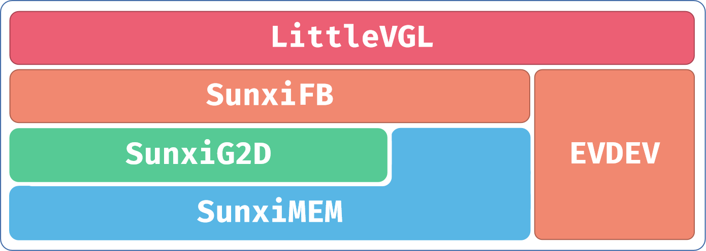

# GUI 图形系统

针对 R128 平台，提供了LVGL作为图形系统。

## LVGL 说明

LVGL 是一个免费的开源图形库，提供了创建嵌入式GUI 所需的一切，具有易于使用的图形元素，美观的视觉效果和低内存占用，采用MIT 许可协议，可以访问LittlevGL官网获取更多资料。

- 强大的构建块：按钮、图表、列表、滑块、图像等。
- 高级图形引擎：动画、抗锯齿、不透明度、平滑滚动、混合模式等。
- 支持各种输入设备：触摸屏、鼠标、键盘、编码器、按钮等。
- 支持多显示器。
- 独立于硬件，可与任何微控制器和显示器一起使用。
- 可扩展以使用少量内存（64 kB 闪存、16 kB RAM）运行。
- 多语言支持，支持UTF-8 处理、CJK、双向和阿拉伯语。
- 通过类CSS 样式完全可定制的图形元素。
- 受CSS 启发的强大布局：Flexbox 和Grid。
- 支持操作系统、外部内存和GPU，但不是必需的。
- 使用单个帧缓冲区也能平滑渲染。
- 用C 编写并与C++ 兼容。
- Micropython Binding 在Micropython 中公开LVGL API。
- 可以在PC 上使用模拟器开发。
- 100 多个简单的例子。
- 在线和PDF 格式的文档和API 参考。

目前RTOS 中移植了LVGL 8.1.0 核心组件与Demo，下表列出LVGL 相关库说明：

| 包名        | 说明                                                      |
| :---------- | :-------------------------------------------------------- |
| lv_demos    | lvgl的官方demo                                            |
| lv_drivers  | lvgl的官方设备驱动程序，集成了sunxifb、sunxig2d和sunximem |
| lv_examples | lvgl测试用例，最终调用的是lv_demos中的函数                |
| lvgl        | lvgl核心库                                                |
| lv_g2d_test | g2d测试用例，专门测试已经对接好的g2d接口                  |
| lv_monitor  | 压力测试与状态监测软件                                    |
| sunxifb.mk  | 公共配置文件，写应用Makefile时需要包含进去                |

## LVGL 配置

`mrtos_menuconfig` 配置如下

```c
System components --->
    thirdparty components --->
        [*] Littlevgl-8 --->
        [*] lvgl examples （lvgl官方demo）
        [ ] lvgl g2d test （g2d 接口测试用例）
        [*] lvgl-8.1.0 use sunxifb double buffer （使能双缓冲，解决撕裂问题）
        [*] lvgl-8.1.0 use sunxifb cache （使能fb cache）
        [ ] lvgl-8.1.0 use sunxifb g2d （使能G2D硬件加速）
        [ ] lvgl-8.1.0 use sunxifb g2d rotate （使能G2D硬件旋转）
        [ ] lvgl-8.1.0 use freetype （使能freetype）
```

## LVGL 框架

LVGL 源码位于 `lichee/rtos-components/thirdparty/littlevgl-8`， 其框架如图：



### SunxiFB

在 `sunxifb` 中，我们提供了一组显示接口，如下：

| 接口                | 说明                                                         |
| :------------------ | :----------------------------------------------------------- |
| `sunxifb_init`      | 该函数主要功能是初始化显示引擎。带一个旋转参数，使能g2d旋转的话，就用这个参数指定旋转方向 |
| `sunxifb_exit`      | 该函数比较简单，实现关闭`cache`，关闭`g2d`，释放旋转`buffer`，关闭`fb0` |
| `sunxifb_flush`     | 该函数比较重要，负责把`draw buffer`拷贝到`back buffer`中，并且绘制最后一帧后，交换`front`与`back buffer`。应用不要调用该函数 |
| `sunxifb_get_sizes` | 该函数获取屏幕分辨率，这样应用程序就可以不用写死初始化时的分辨率了 |
| `sunxifb_alloc`     | 该函数主要用来申请系统绘图内存，使能部分`g2d`功能后，会申请连续物理内存 |
| `sunxifb_free`      | 该函数用来释放`sunxifb_alloc`申请的内存                      |

代码位置如下：

```c
lichee/rtos-components/thirdparty/littlevgl-8/lv_drivers/display/sunxifb.c
```

在`sunxifb_init(rotated)`，中`rotated`的旋转值可以为：

`LV_DISP_ROT_NONE`，`LV_DISP_ROT_90`，`LV_DISP_ROT_180`，`LV_DISP_ROT_270`。

最后还有赋值 `disp_drv.rotated = rotated` 。如果没有g2d旋转，也可以指定`disp_drv.sw_rotate = 1` 使用软件旋转。

### sunxig2d

在 `sunxig2d` 中，实现了对`g2d` `ioctl`的封装，这些函数都**不需要应用调用**，但能加深对整个框架的理解，相关的接口如下：

| 接口                     | 说明                                                         |
| :----------------------- | :----------------------------------------------------------- |
| `sunxifb_g2d_init`       | `g2d` 模块初始化函数，打开 `/dev/g2d` 节点，设置 `g_format`。初始化时，根据使能的宏，打印相应的 `log` |
| `sunxifb_g2d_deinit`     | 该函数关闭 `g2d` 设备                                        |
| `sunxifb_g2d_get_limit`  | 该函数获取 `g2d` 使用阈值                                    |
| `sunxifb_g2d_blit_to_fb` | 该函数用来拷贝 `fb0` 的 `front` 和 `back buffer` 这两块 `buffer`，也可以把 `rotate buffer` 旋转到 `back buffer` |
| `sunxifb_g2d_fill`       | 该函数使用g2d填充一个颜色矩形，颜色可以带透明度              |
| `sunxifb_g2d_blit`       | 该函数用来拷贝图像，不能 `blend` 图像                        |
| `sunxifb_g2d_blend`      | 该函数可以进行图像 `blend`                                   |
| `sunxifb_g2d_scale`      | 该函数用来缩放图像                                           |

代码位置如下：

```c
lichee/rtos-components/thirdparty/littlevgl-8/lv_drivers/display/sunxig2d.c
```

以上 `g2d` 函数，都已经对接 `lvgl` 绘图框架，使用 `lvgl` 的 `lv_draw_map`、`lv_img_set_zoom` 和 `lv_canvas_draw_img` 函数就可以使用起来。

`lv_g2d_test` 应用中有完整的使用示例。

### sunximem

在`sunximem`中，实现了管理物理内存的封装，这些函数都**不需要应用调用**，但能加深对整个框架的理解，如下：

| 接口                      | 说明                                                         |
| :------------------------ | :----------------------------------------------------------- |
| `sunxifb_mem_init`        | 该函数会在`sunxifb_init`中调用，初始化物理内存申请接口，使用的是 `libuapi` 中间件 |
| `sunxifb_mem_deinit`      | 该函数通过调用 `SunxiMemClose`，释放申请的接口资源           |
| `sunxifb_mem_alloc`       | 该函数比较重要，许多地方都会用到，需要传入申请的字节数和使用说明 |
| `sunxifb_mem_free`        | 该函数用来释放调用 `sunxifb_mem_alloc` 申请的内存            |
| `sunxifb_mem_get_phyaddr` | 该函数把 `sunxifb_mem_alloc` 申请内存的虚拟地址转换为物理地址，`g2d` 驱动只接受 `buffer` 的物理地址或者fd |
| `sunxifb_mem_flush_cache` | 该函数用来刷 `sunxifb_mem_alloc` 申请`buffer` 的 `cache`     |

代码位置如下：

```c
lichee/rtos-components/thirdparty/littlevgl-8/lv_drivers/display/sunxigmem.c
```

因为`g2d`驱动只能使用物理连续内存，因此解码图片时，必须要通过 `sunxifb_mem_alloc` 来申请内存。

> 当前只实现了bmp、png和gif图片的内存申请，jpeg图片暂未实现

当使用 `lv_canvas_set_buffer` 时，传入的 `buffer` 需要是 `sunxifb_alloc` 申请的 `buffer`，`sunxifb_alloc` 中会判断是否需要申请物理连续内存。

> 自定义画布lv_canvas暂未对接g2d缩放功能

### evdev

触摸我们用的是`lvgl`官方的`evdev`

代码位置如下：

```
lichee/rtos-components/thirdparty/littlevgl-8/lv_drivers/indev/evdev.c
```

lvgl 使用触控功能，需在应用lv_drv_conf.h 文件中配置：
```c
# define USE_EVDEV 1
```

应用`lv_drv_conf.h` 中的`EVDEV_NAME` 要与所使用的触摸屏驱动对应，例如 `lv_examples` 的配置文件：

```
lichee/rtos-components/thirdparty/littlevgl-8/lv_examples/src/lv_drv_conf.h
```

如果disp_drv.rotated 指定了旋转90 或者180 度，lvgl 内部会自行旋转触摸坐标，不用触摸驱动内部去旋转触摸坐标。

### color depth

在应用 `lv_conf.h` 文件中有关于色彩深度 `LV_COLOR_DEPTH` 的配置，例如 `lv_examples` 的配置文件：

```
lichee/rtos-components/thirdparty/littlevgl-8/lv_examples/src/lv_conf.h
```

```c
/*Color depth: 1 (1 byte per pixel), 8 (RGB332), 16 (RGB565), 32 (ARGB8888)*/
#define LV_COLOR_DEPTH 32
```

使用SPI 屏显示，应用 `LV_COLOR_DEPTH` 必须和屏幕所支持的像素格式匹配；而其他类型的屏，应用`LV_COLOR_DEPTH` 选择 16 或32 都可正常显示。

`LV_COLOR_DEPTH` 选择16 位相较于32 位，内存占用更小，帧率更快，但是色彩总数较少，显示渐变颜色可能会过渡不平滑。

## LVGL 新建应用

推荐以 `lv_g2d_test` 为模板，复制一个新项目：

```
lichee/rtos-components/thirdparty/littlevgl-8/lv_g2d_test
```

在 `Makefile` 中，需要包含 `sunxifb.mk `公共配置，在编译应用时会把宏传递下去。方式如下：

```
lichee/rtos-components/thirdparty/littlevgl-8/lv_g2d_test/Makefile
```

```c
include components/common/thirdparty/littlevgl-8/sunxifb.mk
```

另外可以注意到有以下配置，这些配置需要按需开启，在部分芯片上是不支持 `G2D_BLEND` 等操作的，只支持简单的旋转功能：

```makefile
ifeq ($(CONFIG_LVGL8_USE_SUNXIFB_G2D),y)
CFLAGS+=-DLV_USE_SUNXIFB_G2D_FILL \
        -DLV_USE_SUNXIFB_G2D_BLEND \
        -DLV_USE_SUNXIFB_G2D_BLIT \
        -DLV_USE_SUNXIFB_G2D_SCALE
endif
```

在应用编译的实际 `Makefile` 中，可以只编译需要的文件，缩减可执行文件的大小。

关于lvgl 的配置文件，也是建议用 `lv_g2d_test` 中的，可以对比原始未修改过的配置，然后再根据实际场景开关相应配置。配置文件如下：

```c
lichee/rtos-components/thirdparty/littlevgl-8/lv_g2d_test/src/lv_conf.h
lichee/rtos-components/thirdparty/littlevgl-8/lv_g2d_test/src/lv_drv_conf.h
```

原文件：

```
lichee/rtos-components/thirdparty/littlevgl-8/lvgl/lv_conf_template.h
lichee/rtos-components/thirdparty/littlevgl-8/lv_drivers/lv_drv_conf_template.h.h
```

最后就是应用的初始化了，在 `lv_g2d_test` 中，有比较清晰的调用流程了，需要注意的是 `sunxifb_init` 需要传入旋转参数和 `sunxifb_alloc` 申请内存即可。

## LVGL 运行

我们提供了几个测试用例，执行命令如下：

```c
lv_examples 0, is lv_demo_widgets
lv_examples 1, is lv_demo_music
lv_examples 2, is lv_demo_benchmark
lv_examples 3, is lv_demo_keypad_encoder
lv_examples 4, is lv_demo_stress
```

在初始化时，会有如下打印，根据配置的不同会有差异，表示打开了某项配置：

```
wh=800x480, vwh=800x960, bpp=32, rotated=0
Turn on double buffering.
Turn on 2d hardware acceleration.
Turn on 2d hardware acceleration fill.
Turn on 2d hardware acceleration blit.
Turn on 2d hardware acceleration blend.
Turn on 2d hardware acceleration scale.
Turn on 2d hardware acceleration rotate.
```

## LVGL 开启触控功能

`lvgl` 使用触控功能，需在应用 `lv_drv_conf.h` 文件中使能宏 `USE_EVDEV`。前提要确认好触摸屏驱动模块能够正常加载使用，并且使 `lv_drv_conf.h` 中的 `EVDEV_NAME` 与所使用的触摸屏驱动对应：

```c
# define USE_EVDEV 1
# define EVDEV_NAME "touchscreen"
```

lvgl 对接触摸屏驱动的代码位置如下：

```
lichee/rtos-components/thirdparty/littlevgl-8/lv_drivers/indev/evdev.c
```

## LVGL 开启 `LOG` 日志调试

lvgl 自带的Log 日志调试功能，在应用 `lv_conf.h` 文件使能宏 `LV_USE_LOG` 及相关配置：

```
#define LV_USE_LOG 1
#define LV_LOG_LEVEL LV_LOG_LEVEL_INFO
#define LV_LOG_PRINTF 1
```

另外在 `sunxifb.c` 文件或 `Makefile` 中定义宏 `LV_USE_SUNXIFB_DEBUG`，可以 Log 打印出LVGL 实际刷图显示的帧率。

## SPI 屏显示 LVGL 画面异常

应用 `lv_conf.h` 文件中的`LV_COLOR_DEPTH` 要和SPI 屏所支持的像素格式匹配：

```
/*Color depth: 1 (1 byte per pixel), 8 (RGB332), 16 (RGB565), 32 (ARGB8888)*/
#define LV_COLOR_DEPTH 32
```

