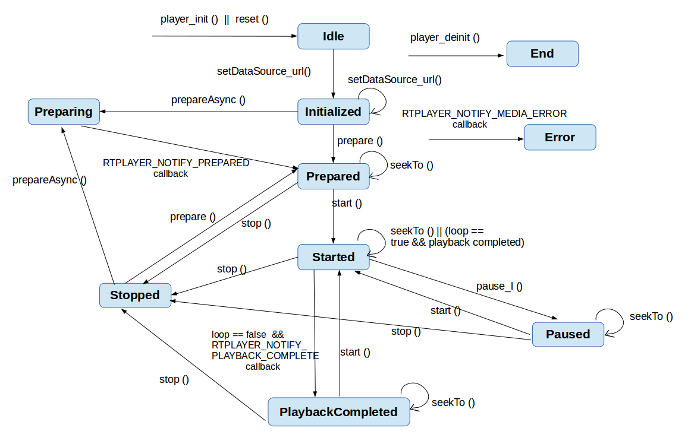

# RTOS 多媒体解码

介绍 FreeRTOS 下如何使用 rtplayer 的接口来开发播放器应用程序，方便播放器开发人员快速正确地开发，以及播放器测试人员如何根据该文档对 rtplayer 播放器进行验证测试。

### rtplayer 状态图

这张状态转换图清晰地描述了 rtlayer 的各个状态，也列举了主要的方法的调用时序，每种方法只能在一些特定的状态下使用，否则会出错。另外，只有在 Prepared、Started、Paused、Play‑backCompleted 这四种状态下可以进行 seekTo() 操作，并且 seekTo() 之后，状态不变。



#### Idle 状态

Idle 状态：当调用 player_init() 创建一个 rtplayer 或者调用了其 reset() 方法时，rtplayer 处于 idle状态。

#### Initialized 状态

这个状态比较简单，调用 setDateSource_url() 方法就进入 Initialized 状态，表示此时要播放的文件已经设置好了

####  Preparing 状态

调用 prepare() 函数还没返回或者是调用 prepareAsync() 并且还没收到 RTPLAYER_NOTIFY_PREPARED 这个回调消息的时候就处于 Preparing 状态

#### Prepared 状态

调用 prepare() 函数已经返回或者是调用 prepareAsync() 并且已经收到 RTPLAYER_NOTIFY_PREPARED 这个回调消息之后的状态就处于 Prepared 状态。在这个状态下说明所有的资源都已经就绪了，调用 start() 函数就可以播放了。

#### Started 状态

rtplayer 一旦 prepare 完成，就可以调用 start() 方法，这样 rtplayer 就处于 Started 状态，这表明 rtplayer 正在播放文件过程中。可以使用 XPlayerIsPlaying() 测试 rtplayer 是否处于了 Started 状态。如果播放完毕，而又设置了循环播放，则 rtplayer 仍然会处于 Started 状态。

####  Paused 状态

Started 状态下可以调用 pause_l() 方法暂停 rtplayer，从而进入 Paused 状态，rtplayer 暂停后再次调用 start() 则可以继续 TPlayer 的播放，转到 Started 状态。

#### Stopped 状态

Started 或者 Paused 状态下均可调用 stop() 停止 rtplayer，而处于 Stop 状态的 rtplayer 要想重新播放，需要通过 prepareAsync() 和 prepare() 回到先前的 Prepared 状态重新开始才可以。

####  PlaybackCompleted 状态

文件正常播放完毕，而又没有设置循环播放的话就进入该状态，并且会通过 RTPLAYER_NOTIFY_PLAYBACK_COMPLETE 这个消息回调给应用。此时可以调用 start() 方法重新从头播放文件，也可以 stop() 停止 rtplayer，或者也可以 seekTo() 来重新定位播放位置。

#### Error 状态

由于某种原因 rtplayer 出现了错误，就会进入该状态，并且会通过 RTPLAYER_NOTIFY_MEDIA_ERROR 这个消息回调给应用。如果 rtplayer 进入了 Error 状态，可以通过调用 reset() 来恢复，使得 rtplayer 重新返回到 Idle 状态。

#### End 状态

通过 plater_deinit() 的方法可以进入 End 状态，只要 rtplayer 不再被使用，就应当尽快将其 destroy 掉。

##  rtplayer 层接口

### 创建一个 rtplayer

函数原型

```c
uint32_t player_init(void)
```

参数：

- 无

返回值：

- 成功返回 rtplayer 的指针，失败返回 NULL

### 销毁一个 rtplayer

函数原型

```c
void player_deinit(void* handle)
```

参数：

-  handle: 通过 player_init() 函数创建的 rtplayer 指针

返回值：

- 无

### 设置 rtplayer 的消息回调函数

函数原型

```c
void registerCallback(void* handle, void* userData, player_callback_t fn)
```

参数：

-  handle: 通过 player_init() 函数创建的 rtplayer 指针
- userData: 回调消息处理对象
- fn: 回调消息处理函数指针，需要由应用实现

返回值：

- 无

> 创建完 rtplayer 播放器之后，就要调用该函数设置回调消息处理函数。

### 设置播放文件的 url

可以是本地文件也可以是网络源

函数原型

```c
status_t setDataSource_url(void* handle,void* userData, const char * url, int id)
```

参数：

- handle: 通过 player_init() 函数创建的 rtplayer 指针
- userData: 回调消息处理对象
- url: 需要播放的文件的 url
- id: 回调时使用的播放索引, 为 0 即可

返回值：

- 成功返回 0，失败返回‑1 或错误码

### 解析文件头部信息，获取元数据

函数原型

```c
status_t prepare(void* handle)
```

参数：

- handle: 通过 player_init() 函数创建的 rtplayer 指针;

返回值：

- 成功返回 0，失败返回‑1 或错误码

### 异步解析文件头部信息，获取元数据

函数原型

```c
status_t prepareAsync(void* handle)
```

参数：

- handle: 通过 player_init() 函数创建的 rtplayer 指针;

返回值：

- 成功返回 0，失败返回‑1

> 该函数是非阻塞函数，需要等到 RTPLAYER_NOTIFY_P‑ REPARED 消息回调之后才能调 start() 函数进行播放，而且 start() 函数不能在回调函数中调用

### 开始播放

函数原型

```c
status_t start(void* handle)
```

参数：

- handle: 通过 player_init() 函数创建的 rtplayer 指针;

返回值：

- 成功返回 0，失败返回‑1

### 暂停播放

函数原型

```c
 status_t pause_l(void* handle)
```

参数：

-  handle: 通过 player_init() 函数创建的 rtplayer 指针;

返回值：

- 成功返回 0，失败返回‑1

### 停止播放

函数原型

```c
 status_t stop(void* handle)
```

参数：

- handle: 通过 player_init() 函数创建的 rtplayer 指针

返回值：

- 成功返回 0，失败返回‑1

### 重置播放器

函数原型

```c
status_t reset(void* handle)
```

参数：

- handle: 通过 player_init() 函数创建的 rtplayer 指针;

返回值：

- 成功返回 0，失败返回‑1

> 在任何状态下都可以调用该函数，每次播放不同的音频之前，都需要调用该函数重置播放器，另外，一般收到 RTPLAYER_NOTIFY_MEDIA_ERROR 这个消息的时候，也需要通过调用该函数来重置播放器。但是不能在回调函数中调用该函数，否则会出现死锁

### 跳播

函数原型

```c
status_t seekTo(void* handle, int sec)
```

参数：

- handle: 通过 player_init() 函数创建的 rtplayer 指针
- sec: 跳播的位置，单位是：s

返回值：

- 成功返回 0，失败返回‑1

### 获取当前播放的位置

函数原型

```c
status_t getCurrentPosition(void* handle, int * sec)
```

参数：

- handle: 通过 player_init() 函数创建的 rtplayer 指针;
- sec: 存放当前播放的位置值，单位：s

返回值：

- 成功返回 0，失败返回‑1

### 获取播放的文件总时长

函数原型

```c
status_t getDuration(void* handle, int * sec)
```

参数：

- handle: 通过 player_init() 函数创建的 rtplayer 指针;
- sec: 存储文件总时长，单位：s

返回值：

- 成功返回 0，失败返回‑1

> 需要在 prepared 状态之后才可以调用该函数

### 获取播放的文件信息

函数原型

```c
MediaInfo* getMediaInfo(void* handle)
```

参数：

- handle: 通过 player_init() 函数创建的 rtplayer 指针;

返回值：

- 成功返回 0，失败返回‑1

> 需要在 prepared 状态之后才可以调用该函数

### 设置循环播放模式

函数原型

```c
status_t setLooping(void* handle, int loop)
```

参数：

-  handle: 通过 player_init() 函数创建的 rtplayer 指针;
- loop:1 表示单曲循环，0 表示不会单曲循环

返回值：

- 成功返回 0，失败返回‑1

##  XPlayer 层播放接口

### 创建一个 XPlayer

函数原型

```c
XPlayer* XPlayerCreate()
```

参数：

- 无

返回值：

- 成功: XPlayer 指针; 失败: NULL

### 设置 XPlayer 的回调通知

函数原型

```c
int XPlayerSetNotifyCallback(XPlayer* p, XPlayerNotifyCallback notifier, void* pUserData)
```

参数：

- P：通过 XPlayerCreate 创建的 Xplayer 指针 
- notifier：回调通知
- pUserData：应用程序传下来的自定义数据

返回值：

- 成功：XPlayer 指针；失败：NULL

> Xplayer 将接收来自下层的回调通知，进行相应的操作

### 创建指向音频播放设备管理模块的指针，用于播放音频

函数原型

```c
SoundCtrl* RTSoundDeviceCreate(int card)
```

参数：

- card:声卡序号0：default;1：sw:audio1;2:sw:audio2;3:sw:audio3;4:sw:audio4;5:sw:audio5

返回值：

- 成功：音频播放设备管理模块的指针；失败：NULL

### 创建指向音频播放设备管理模块的指针，用于播放音频

函数原型

```c
int XPlayerSetDataSourceUrl(XPlayer* p, const char* pUrl, void* httpService, const CdxKeyedVectorT* pHeaders)
```

参数：

- pUrl：url 地址 
- httpService：服务器信息 
- pHeaders：头文件信息

返回值：

- 返回值: 成功：0；失败：‑1 或线程响应设置数据源命令的返回值或线程响应 xplayer prepare 命令的返回值

> 调用说明: 发送 SetDataSource 命令，获取需要播放的音频数据内容

### 将 XPlayer 置为准备状态, 解析头部信息，获取元数据

函数原型

```c
int XPlayerPrepare(XPlayer* p)
```

参数：

- p：通过 XPlayerCreate 创建的 Xplayer 指针

返回值：

- 成功：线程响应异步 Prepare 命令的返回值；失败：NULL

> 该函数是阻塞函数，调用完返回之后就进入了 Prepared 状态，此时可调 XPlayerStart() 函数进行播放

### 将 XPlayer 置为异步准备状态

函数原型

```c
int XPlayerPrepareAsync(XPlayer* p)
```

参数：

- p：通过 XPlayerCreate 创建的 XPlayer 指针

返回值：

- 成功：线程响应异步 Prepare 命令的返回值；失败：NULL

>  网络播放源一般采用 PrepareAsync，而不是 Prepare 命令，PrepareAsync 命令的返回值为 0 时说明响应成功，播放器准备工作已经完成可以开始播放，为‑1 时说明响应失败

### 将 XPlayer 置为启动状态

函数原型

```c
int XPlayerStart(XPlayer* p)
```

参数：

-  p：通过 XPlayerCreate 创建的 XPlayer 指针

返回值：

- 成功：线程响应 start 命令的返回值；失败：NULL

> Start 命令的返回值为 0 时说明响应成功，为‑1 时说明响应失败

### 将 XPlayer 置为暂停状态

函数原型

```c
int XPlayerPause(XPlayer* p)
```

参数：

- p：通过 XPlayerCreate 创建的 XPlayer 指针

返回值：

- 成功：线程响应 pause 命令的返回值；失败：NULL

> 在 XPlayer 处于 start 状态时可调用此接口，Pause 命令的返回值为 0 时说明响应成功，为‑1 时说明响应失败

### 将 XPlayer 置为停止状态

函数原型

```c
int XPlayerStop(XPlayer* p)
```

参数：

- p：通过 XPlayerCreate 创建的 XPlayer 指针

返回值：

- 成功：返回 0；失败：返回‑1

### 重置 XPlayer

将相关变量复位，并销毁各模块，如音频解码模块、音频解码数据接收模块等

函数原型

```c
int XPlayerReset(XPlayer* p)
```

参数：

- p：通过 XPlayerCreate 创建的 XPlayer 指针

返回值：

- 成功：线程响应 Reset 命令的返回值；失败：NULL

>  Reset 命令的返回值为 0 时说明响应成功，为‑1 时说明响应失败

### 获取节目时长

函数原型

```c
int XPlayerGetDuration(XPlayer* p, int *msec)
```

参数：

- p：通过 XPlayerCreate 创建的 Xplayer 指针
- msec：保存节目时长

返回值：

- 成功：0；失败：‑1

> 在 XPlayer 处于 PREPARED、STARTED、PAUSED、STOPPED 或 COMPLETE 状态下才可调用此接口，否则操作无效

###  Seek 到给定的时间点

函数原型

```c
int XPlayerSeekTo(XPlayer* p, int nSeekTimeMs)
```

参数：

- p：通过 XPlayerCreate 创建的 Xplayer 指针 
- nSeekTimeMs：跳转的时间点

返回值：

-  成功：线程响应 Seek 命令的返回值；失败：NULL

> 如果跳转前播放处于暂停状态，则跳转后将保持在暂停状态

### 获取媒体文件的总时长

函数原型

```c
int XPlayerGetDuration(XPlayer* p, int *msec)
```

参数：

- p：通过 XPlayerCreate 创建的 XPlayer 指针 
- msec：保存媒体文件的总时长

返回值：

- 成功：0；失败：‑1

> 需要在 prepared 状态之后才可以调用该函数

### 获取当前的播放时间点（即播放位置）

在 XPlayer 处于 PREPARED、STARTED、PAUSED、STOPPED 或 COMPLETE 状态下才可调用此接口，否则操作无效，在 complete 状态下，可能会调用 prepare 方法并更改媒体信息，获取的播放时间以 ms 为单位

函数原型

```c
int XPlayerGetCurrentPosition(XPlayer* p, int* msec)
```

参数：

-  p：通过 XPlayerCreate 创建的 XPlayer 指针
-  msec：保存当前的播放时间

返回值：

- 成功：0；失败：‑1

### 获取媒体信息

函数原型

```c
MediaInfo* XPlayerGetMediaInfo(XPlayer* p)
```

参数：

- p：通过 XPlayerCreate 创建的 XPlayer 指针

返回值：

- 成功返回 0，失败返回‑1。如果失败，则 mediaInfo 指针为 NULL

> 需要在 prepared 状态之后才可以调用该函数

### 设置循环播放模式

函数原型

```c
int XPlayerSetLooping(XPlayer* p, int loop)
```

参数：

- p：通过 XPlayerCreate 创建的 XPlayer 指针 
- loop: 1: 表示单曲循环模式；0：表示不会循环

返回值：

- 无

### 查询是否正在播放

函数原型

```c
int XPlayerIsPlaying(XPlayer* p)
```

参数：

- p：通过 XPlayerCreate 创建的 XPlayer 指针

返回值：

-  1：正在播放；0：未播放


### 销毁一个 XPlayer

函数原型

```c
void XPlayerDestroy(XPlayer* p)
```

参数：

- p：通过 XPlayerCreate 创建的 XPlayer 指针

返回值：

- 无

## 播放器开发示例

1. player_init() 创建一个播放器
2. registerCallback()  设置消息回调函数
3. setDataSource_url() 设置 url
4. prepare() 或 prepareAsync()  解析头部信息，获取元数据，并根据元数据的信息初始化对应的解码器
5. start() 播放 (注: 如果是用 prepareAsync() 函数，则需要等到 RTPLAYER_NOTIFY_PREPARED 消息回调之后才可以调用 start() 函数进行播放)
6. 如果需要跳播，则可以调用 seekTo() 函数
7. 如果需要暂停，则调用 pause_l() 函数进行暂停
8. 如果需要停止，则可以调用 stop() 或 reset() 函数进行停止 (注：建议用 reset() 函数进行停止，因为任何状态下都可以调用 reset() 函数)
9. 如果需要播放下一个或其他的，则可以先调用 reset() 函数使播放器进入 idle 状态，然后再重复 (3)(4)(5) 的步骤

```c
#include <stdio.h>
#include <stdint.h>
#include <FreeRTOS.h>
#include <task.h>
#include <portable.h>
#include <string.h>
#include <console.h>
#include <semaphore.h>
#include <pthread.h>
#include <unistd.h>
#include <mqueue.h>
#include <fcntl.h>
#include <stdlib.h>
#include "FreeRTOS_POSIX/utils.h"
#include "rtplayer.h"
#include "xplayer.h"

#define PAUSE_CMD           'P'
#define PING_CMD            'p'
#define STOP_CMD            'S'
#define SEEK_TO_CMD         's'
#define SEEK_TO_CMD2        'j'
#define BACKGROUND_CMD      'b'
#define SHOW_BUFFER_CMD     'B'
#define QUIT_CMD            'q'
#define LOOP_CMD            'l'
#define GET_DURATION_CMD    'G'
#define GET_POSITION_CMD    'g'
#define HELP_CMD            'h'
#define INFO_CMD            'i'
#define REPLAY_CMD          'r'
#define RETRY_CMD           256

#define USE_PREPARE_ASYNC 0

#define LOGD(msg, arg...)      //printf("[PLAYER_DBG] <%s : %d> " msg "\n", __func__, __LINE__, ##arg)
#define LOGI(msg, arg...)      //printf("[PLAYER_INFO] <%s : %d> " msg "\n", __func__, __LINE__, ##arg)
#define LOGW(msg, arg...)      printf("[PLAYER_WRN] <%s : %d> " msg "\n", __func__, __LINE__, ##arg)
#define LOGE(msg, arg...)      printf("[PLAYER_ERR] <%s : %d> " msg "\n", __func__, __LINE__, ##arg)
typedef struct DemoPlayerContext
{
    RTPlayer* mRTplayer;
    sem_t mPreparedSem;
    mqd_t mRTplayerMq;
    pthread_t mThreadId;
    char *pUrl;
    int mSeekable;
    char isPlayingFlag;
    char mError;
    int inputMode;
    int isSetLoop;
    char quitFlag;//no_shell_input mode quitFlag
    int testMode;
    MediaInfo* mMediaInfo;
    int SoundCard;
}DemoPlayerContext;

typedef struct DemoPlayerMsg
{
    int msg;
    int data;
}DemoPlayerMsg;

#define INVALID_MQD     ( ( mqd_t ) -1 )
#define DEFAULT_MODE    0600
static const char *pcRTplayerMqName = "/rtplayerMq";
static volatile mqd_t mRTplayerMq = INVALID_MQD;
static int mRTplayerUserInput = 0;
static struct mq_attr xRTplayerMqAttr =
    {
        .mq_flags   =   0,
        .mq_maxmsg  =   3,
        .mq_msgsize =   sizeof(DemoPlayerMsg),
        .mq_curmsgs =   0
    };

static void showHelp(){
    printf("\n");
    printf("**************************\n");
    printf("* This is a simple audio player, when it is started, you can input commands to tell\n");
    printf("* what you want it to do.\n");
    printf("* Usage: \n");
    printf("*   tplayer_demo /data/test.mp3  : this means play test.mp3\n");
    printf("*   P  :this will Pause if in playing status,or Play in paused status \n");
    printf("*   S  :this means Stop \n");
    printf("*   s  :this means seek to 10s \n");
    printf("*   B  :show buffer \n");
    printf("*   b  :this means player will run in the background \n");
    printf("*   q  :this means quit the player \n");
    printf("*   l  :this means loop play \n");
    printf("*   G :this means Get  duration \n");
    printf("*   g :this means get  position \n");
    printf("*   i :this means show media info \n");
    printf("*   h :this means show the help information \n");
    printf("*   r : replay the current audio\n");
    printf("**************************\n");
}
static int rtplayer_clear_cmd(mqd_t mq){
    struct timespec cur, delay, abstime;
    clock_gettime( CLOCK_REALTIME, &cur );
    delay.tv_sec = 0;
    delay.tv_nsec = 5*1000*1000;
    UTILS_TimespecAdd(&cur, &delay, &abstime);
    DemoPlayerMsg msg;
    while(mq_timedreceive(mq, (char *)&msg, sizeof(msg), NULL, &abstime)!=-1);
    return 0;
}
static int rtplayer_send_cmd(mqd_t mq, int msg, int data){
    DemoPlayerMsg pmsg = {msg, data};
    struct timespec tsn, ts;
    clock_gettime(CLOCK_REALTIME, &tsn);
    UTILS_TimespecAddNanoseconds(&tsn, 20*1000*1000, &ts);
    int status = mq_timedsend(mq, (char *)&pmsg, sizeof(pmsg), 0, &ts);
    if(status)
        LOGE("send cmd %c,%d failed!", pmsg.msg, pmsg.data);
    return status;
}

static int rtplayer_send_cmd_force(mqd_t mq, int msg, int data){
    int try_times = 0;
    DemoPlayerMsg pmsg = {msg, data};
    struct timespec tsn, ts;
    int status;
try_send:
    clock_gettime(CLOCK_REALTIME, &tsn);
    UTILS_TimespecAddNanoseconds(&tsn, 20*1000*1000, &ts);
    status = mq_timedsend(mq, (char *)&pmsg, sizeof(pmsg), 0, &ts);
    if(status){
        try_times++;
        if(try_times<5){
            LOGE("send cmd %c,%d failed, retry...", pmsg.msg, pmsg.data);
            goto try_send;
        }
        else if(try_times<10){
            DemoPlayerMsg tmp;
            LOGE("send cmd %c,%d failed, retry...", pmsg.msg, pmsg.data);
            clock_gettime(CLOCK_REALTIME, &tsn);
            UTILS_TimespecAddNanoseconds(&tsn, 20*1000*1000, &ts);
            status = mq_timedreceive(mq, (char *)&tmp, sizeof(tmp), NULL, &ts);
            if(status<0){
                LOGE("mq_receive fail %d", status);
                goto fail_exit;
            }
            LOGW("drop: %c, %d", tmp.msg, tmp.data);
            goto try_send;
        }
        goto fail_exit;
    }
    return status;
fail_exit:
    LOGE("send cmd %c,%d failed!\n", pmsg.msg, pmsg.data);
    return status;
}

static void callbackFromRTplayer(void* userData,int msg, int id, int ext1, int ext2);
static void* RTplayerThread(void* arg){
    DemoPlayerContext* demoPlayer = (DemoPlayerContext*)arg;
    char quitFlag = 0;

    if(demoPlayer->inputMode)
    {
	while(1)
	{
	     if(demoPlayer->quitFlag)
	     {
		if(demoPlayer->mRTplayer != NULL)
		{
			printf("player finsh, quit the rtplayer\n");
			mRTplayerMq = INVALID_MQD;
#if USE_PREPARE_ASYNC
			sem_destroy(&demoPlayer->mPreparedSem);
#endif
			player_deinit(demoPlayer->mRTplayer);
			free(demoPlayer->pUrl);
			free(demoPlayer);
		}
		break;
	     }
		usleep(50*1000);
	}
	return NULL;

    }
    while(!quitFlag){
        int cRxed = 0;
        int data = 0;
        DemoPlayerMsg msg;
        ssize_t status;
        if(demoPlayer->mRTplayerMq!=INVALID_MQD){
            usleep(50*1000);
            ssize_t status = mq_receive(demoPlayer->mRTplayerMq, (char *)&msg, sizeof(msg), NULL);
            if(status<=-1){
                LOGE("mq_receive fail %d", status);
                usleep(1*1000*1000);
                continue;
            }
            printf("receive %c,%d\n", msg.msg, msg.data);
            cRxed = msg.msg;
            data = msg.data;
        }
        else{
            cRxed = QUIT_CMD;
        }
        switch(cRxed){
            case PAUSE_CMD:
            {
                if(demoPlayer->isPlayingFlag){
                    printf("pause the rtplayer\n");
                    pause_l(demoPlayer->mRTplayer);
                    demoPlayer->isPlayingFlag = 0;
                }else{
                    printf("play the rtplayer\n");
                    start(demoPlayer->mRTplayer);
                    demoPlayer->isPlayingFlag = 1;
                }
                break;
            }
            case STOP_CMD:
            {
                printf("stop the rtplayer\n");
                stop(demoPlayer->mRTplayer);
                demoPlayer->isPlayingFlag = 0;
                break;
            }
            case SEEK_TO_CMD:
            {
                printf("rtplayer seek to 10 second\n");
                seekTo(demoPlayer->mRTplayer,10);
                break;
            }
            case SEEK_TO_CMD2:
            {
                printf("rtplayer seek to %d second\n", data);
                seekTo(demoPlayer->mRTplayer,data);
                break;
            }
            case QUIT_CMD:
            {
                printf("quit the rtplayer\n");
                mRTplayerMq = INVALID_MQD;
                //mq_close(demoPlayer->mRTplayerMq);
#if USE_PREPARE_ASYNC
                sem_destroy(&demoPlayer->mPreparedSem);
#endif
                player_deinit(demoPlayer->mRTplayer);
                free(demoPlayer->pUrl);
                free(demoPlayer);
                quitFlag = 1;
                break;
            }
            case LOOP_CMD:
            {
                printf("let the rtplayer loop play\n");
                demoPlayer->isSetLoop = 1;
                setLooping(demoPlayer->mRTplayer,1);
                break;
            }
            case GET_DURATION_CMD:
            {
                printf("get the audio duration\n");
                int duration;
                getDuration(demoPlayer->mRTplayer,&duration);
                printf("duration:%d s\n",duration);
                break;
            }
            case GET_POSITION_CMD:
            {
                printf("get the current position\n");
                int position;
                getCurrentPosition(demoPlayer->mRTplayer,&position);
                printf("current position:%d s\n",position);
                break;
            }
            case HELP_CMD:
            {
                printf("show the help information\n");
                showHelp();
                break;
            }
	    case INFO_CMD:
	    {
		printf("**************************\n");
		printf("* show media information:\n");
		MediaInfo* mi = NULL;
		demoPlayer->mMediaInfo = getMediaInfo(demoPlayer->mRTplayer);
		if(demoPlayer->mMediaInfo != NULL){
                        mi = demoPlayer->mMediaInfo;
                        printf("* file size = %lld KB\n",mi->nFileSize/1024);
                        printf("* duration = %lld ms\n",mi->nDurationMs);
                        printf("* bitrate = %d Kbps\n",mi->nBitrate/1024);
                        printf("* container type = %d\n",mi->eContainerType);
                        printf("* audio stream num = %d\n",mi->nAudioStreamNum);
                        if(mi->pAudioStreamInfo != NULL){
                            printf("* audio codec tpye = %d\n",mi->pAudioStreamInfo->eCodecFormat);
                            printf("* audio channel num = %d\n",mi->pAudioStreamInfo->nChannelNum);
                            printf("* audio BitsPerSample = %d\n",mi->pAudioStreamInfo->nBitsPerSample);
                            printf("* audio sample rate  = %d\n",mi->pAudioStreamInfo->nSampleRate);
                        }
		printf("**************************\n");
                    }
                    break;

	    }
	    case SHOW_BUFFER_CMD:
	    {
		printf("**************************\n");
		printf("* show buffer information:\n");
		player_show_buffer();
		printf("**************************\n");
		break;

	    }
            case REPLAY_CMD:
            {
                printf("replay %s\n", demoPlayer->pUrl);
                int ret;
                if(demoPlayer->testMode){
                    printf("test mode: destroy & create instead of reset\n");
                    player_deinit(demoPlayer->mRTplayer);
                    usleep(50*1000);
                    demoPlayer->mRTplayer = (RTPlayer*)(uintptr_t)player_init();
                    printf("demoPlayer.mRTplayer = %p\n",demoPlayer->mRTplayer);
                    if(!demoPlayer->mRTplayer){
                        printf("init rtplayer fail\n");
                        free(demoPlayer->pUrl);
                        free(demoPlayer);
                        quitFlag = 1;
                        continue;
                    }
                    registerCallback(demoPlayer->mRTplayer, demoPlayer, callbackFromRTplayer);
                }
                else
                    reset(demoPlayer->mRTplayer);
                ret = setDataSource_url(demoPlayer->mRTplayer, demoPlayer, demoPlayer->pUrl, 0);
                if(ret){
                    printf("setDataSource_url failed\n");
                    break;
                }
                ret = prepare(demoPlayer->mRTplayer);
                if(ret){
                    printf("prepare failed\n");
                    break;
                }
                start(demoPlayer->mRTplayer);
                demoPlayer->isPlayingFlag = 1;
		if(demoPlayer->isSetLoop)
		{
                    setLooping(demoPlayer->mRTplayer,1);
		}
                break;
            }
            case RETRY_CMD:
            {
                int position = data;
                if(data==-1)
                    getCurrentPosition(demoPlayer->mRTplayer,&position);
                printf("retry %s\n", demoPlayer->pUrl);
                int ret;
                if(demoPlayer->testMode){
                    printf("test mode: destroy & create instead of reset\n");
                    player_deinit(demoPlayer->mRTplayer);
                    usleep(50*1000);
                    demoPlayer->mRTplayer = (RTPlayer*)(uintptr_t)player_init();
                    printf("demoPlayer.mRTplayer = %p\n",demoPlayer->mRTplayer);
                    if(!demoPlayer->mRTplayer){
                        LOGE("init rtplayer fail");
                        free(demoPlayer->pUrl);
                        free(demoPlayer);
                        quitFlag = 1;
                        continue;
                    }
                    registerCallback(demoPlayer->mRTplayer, demoPlayer, callbackFromRTplayer);
                }
                else
                    reset(demoPlayer->mRTplayer);
                ret = setDataSource_url(demoPlayer->mRTplayer, demoPlayer, demoPlayer->pUrl, 0);
                if(ret){
                    LOGE("setDataSource_url failed");
                    rtplayer_send_cmd_force(demoPlayer->mRTplayerMq, RETRY_CMD, position);
                    usleep(500*1000);
                    break;
                }
                ret = prepare(demoPlayer->mRTplayer);
                if(ret){
                    LOGE("prepare failed");
                    rtplayer_send_cmd_force(demoPlayer->mRTplayerMq, RETRY_CMD, position);
                    usleep(500*1000);
                    break;
                }
                start(demoPlayer->mRTplayer);
                demoPlayer->isPlayingFlag = 1;
                //seekTo(demoPlayer->mRTplayer, position);
                if(demoPlayer->isSetLoop)
                    setLooping(demoPlayer->mRTplayer,1);
                break;
            }
            default:
            {
                LOGW("warning: unknown command,cmd = %d",cRxed);
                break;
            }
        }
        if(quitFlag){
            return NULL;
        }
    }
    return NULL;
}
static void callbackFromRTplayer(void* userData,int msg, int id, int ext1, int ext2){

    LOGI("call back from RTplayer,msg = %d,id = %d,ext1 = %d,ext2 = %d\n",msg,id,ext1,ext2);

	DemoPlayerContext* pDemoPlayer = (DemoPlayerContext*)userData;
    switch(msg)
    {
        case RTPLAYER_NOTIFY_PREPARED:
        {
            printf("RTPLAYER_NOTIFY_PREPARED:has prepared.\n");
 #if USE_PREPARE_ASYNC           
            sem_post(&pDemoPlayer->mPreparedSem);
            pDemoPlayer->mPreparedFlag = 1;
 #endif
            break;
        }
        case RTPLAYER_NOTIFY_PLAYBACK_COMPLETE:
        {
            printf("RTPLAYER_NOTIFY_PLAYBACK_COMPLETE:play complete\n");
            pDemoPlayer->isPlayingFlag = 0;
	    if(pDemoPlayer->inputMode)
	    {
		pDemoPlayer->quitFlag = 1;
	    }
            break;
        }
        case RTPLAYER_NOTIFY_SEEK_COMPLETE:
        {
            printf("RTPLAYER_NOTIFY_SEEK_COMPLETE:seek ok\n");
            break;
        }
        case RTPLAYER_NOTIFY_MEDIA_ERROR:
        {
            switch (ext1)
            {
                case RTPLAYER_MEDIA_ERROR_UNKNOWN:
                {
                    printf("erro type:TPLAYER_MEDIA_ERROR_UNKNOWN\n");
                    break;
                }
                case RTPLAYER_MEDIA_ERROR_UNSUPPORTED:
                {
                    printf("erro type:TPLAYER_MEDIA_ERROR_UNSUPPORTED\n");
                    break;
                }
                case RTPLAYER_MEDIA_ERROR_IO:
                {
                    printf("erro type:TPLAYER_MEDIA_ERROR_IO\n");
                    break;
                }
            }
            printf("RTPLAYER_NOTIFY_MEDIA_ERROR\n");
            pDemoPlayer->mError = 1;
#if USE_PREPARE_ASYNC            
            if(pDemoPlayer->mPreparedFlag == 0){
                printf("recive err when preparing\n");
                sem_post(&pDemoPlayer->mPreparedSem);
            }
#endif 
            if( pDemoPlayer->mRTplayerMq!=INVALID_MQD ){
                rtplayer_send_cmd_force(pDemoPlayer->mRTplayerMq, RETRY_CMD, -1);
            }
            else{
                printf("io error, mqueue not exist\n");
            }
            break;
        }
        case RTPLAYER_NOTIFY_NOT_SEEKABLE:
        {
            pDemoPlayer->mSeekable = 0;
            printf("info: media source is unseekable.\n");
            break;
        }
        case RTPLAYER_NOTIFY_DETAIL_INFO:
        {
            int flag = *(int *)(uintptr_t)ext2;
            //printf("detail info: %d\n", flag);
            break;
        }
        default:
        {
            printf("warning: unknown callback from RTplayer.\n");
            break;
        }
    }
}
int cmd_rtplayer_test(int argc, char ** argv)
{
    int inputMode = 0;
    int testMode = 0;
	/*
    printf("argc = %d\n",argc);
    for(int i=0; i < argc;i++){
        printf("argv[%d]=%s\n",i,argv[i]);
    }
	*/
	printf("rtplayer source:%s\n", argv[1]);

    if(argc == 3){
        if( !strncmp("no_shell_input", argv[2], sizeof("no_shell_input")-1) ){
            argc--;
            inputMode = 1;
        }
        else if( !strncmp("test_mode", argv[2], sizeof("test_mode")-1) ){
            argc--;
            testMode = 1;
        }
    }
    if(argc != 2){
        LOGW("the parameter is error,usage is as following:");
        showHelp();
        goto rtp_failed;
    }
#if USE_PREPARE_ASYNC
    int waitErr = 0;
#endif
    DemoPlayerContext* demoPlayer = (DemoPlayerContext*)malloc(sizeof(DemoPlayerContext));
    if(demoPlayer == NULL){
        LOGE("malloc DemoPlayerContext fail");
        goto rtp_failed;
    }
    memset(demoPlayer, 0, sizeof(DemoPlayerContext));
    demoPlayer->mSeekable = 1;
    demoPlayer->mRTplayerMq = INVALID_MQD;
    demoPlayer->inputMode = inputMode;
    demoPlayer->testMode = testMode;
    demoPlayer->quitFlag = 0;
    demoPlayer->mMediaInfo = NULL;
    if(strlen(argv[1])<=0){
        LOGE("url error");
        goto rtp_url_failed;
    }
    demoPlayer->pUrl = malloc(strlen(argv[1])+1);
    if(!demoPlayer->pUrl){
        LOGE("pUrl malloc fail");
        goto rtp_url_failed;
    }
    memset(demoPlayer->pUrl, 0, strlen(argv[1]));
    strcpy(demoPlayer->pUrl, argv[1]);
#if USE_PREPARE_ASYNC    
     sem_init(&demoPlayer->mPreparedSem, 0, 0);
#endif
    demoPlayer->mRTplayer = (RTPlayer*)(uintptr_t)player_init();
    LOGI("demoPlayer.mRTplayer = %p",demoPlayer->mRTplayer);
    if(!demoPlayer->mRTplayer){
        LOGE("init rtplayer fail");
        goto rtp_init_failed;
    }

    registerCallback(demoPlayer->mRTplayer, demoPlayer, callbackFromRTplayer);
    status_t ret = setDataSource_url(demoPlayer->mRTplayer,demoPlayer,demoPlayer->pUrl, 0);
    if(ret){
        LOGE("set DataSource url fail");
        goto rtp_prepare_failed;
    }
#if USE_PREPARE_ASYNC
    demoPlayer->mPreparedFlag = 0;
    if(prepareAsync(demoPlayer->mRTplayer) != 0)
    {
        printf("TPlayerPrepareAsync() return fail.\n");
    }else{
        printf("preparing...\n");
    }
    struct timespec t;
    t.tv_nsec = 0;
    t.tv_sec = 30;
    waitErr = sem_timedwait(&demoPlayer->mPreparedSem, &t);
    if(waitErr == -1){
        printf("prepare timeout,has wait %d s\n",t.tv_sec);
        sem_destroy(&demoPlayer->mPreparedSem);
        goto rtp_prepare_failed;
    }else if(demoPlayer.mError == 1){
        printf("prepare fail\n");
        sem_destroy(&demoPlayer->mPreparedSem);
        goto rtp_prepare_failed;
    }
    printf("prepared ok\n");
#else
    ret = prepare(demoPlayer->mRTplayer);
    if(ret){
        LOGE("prepare fail");
        goto rtp_prepare_failed;
    }
#endif
    start(demoPlayer->mRTplayer);
    demoPlayer->isPlayingFlag = 1;

    if( mRTplayerMq==INVALID_MQD ){
        mRTplayerMq = mq_open( pcRTplayerMqName, O_CREAT | O_RDWR, DEFAULT_MODE, &xRTplayerMqAttr );
        if(mRTplayerMq==INVALID_MQD){
            LOGE("mq_open fail");
        }
    }
    demoPlayer->mRTplayerMq = mRTplayerMq;
    rtplayer_clear_cmd(demoPlayer->mRTplayerMq);

    pthread_attr_t attr;
    pthread_attr_init(&attr);
    struct sched_param sched;
    sched.sched_priority = 4;
    pthread_attr_setschedparam(&attr, &sched);
    pthread_attr_setstacksize(&attr, 32768);
    pthread_attr_setdetachstate(&attr, PTHREAD_CREATE_DETACHED);

    if( pthread_create(&demoPlayer->mThreadId, &attr, RTplayerThread, demoPlayer) ){
        LOGE("pthread_create failed, quit the rtplayer");
        mRTplayerMq = INVALID_MQD;
        //mq_close(demoPlayer->mRTplayerMq);
#if USE_PREPARE_ASYNC
        sem_destroy(&demoPlayer->mPreparedSem);
#endif
        goto rtp_prepare_failed;
    }
    pthread_setname_np(demoPlayer->mThreadId, "RTplayerThread");

    if(demoPlayer->inputMode)
        goto rtp_succeed;
    while(1){
        char cRxed = getchar();
        if(cRxed==BACKGROUND_CMD){
            printf("shell input exit, rtplayer will run in the background\n");
            break;
        }
        rtplayer_send_cmd(demoPlayer->mRTplayerMq, cRxed, 0);
        if(cRxed==QUIT_CMD)
            break;
        usleep(50*1000);
    }
rtp_succeed:
    return 0;
rtp_prepare_failed:
    player_deinit(demoPlayer->mRTplayer);
rtp_init_failed:
    free(demoPlayer->pUrl);
rtp_url_failed:
    free(demoPlayer);
rtp_failed:
    return -1;
}
FINSH_FUNCTION_EXPORT_CMD(cmd_rtplayer_test, rtplayer_test, test the rtplayer);

static int cmd_rtplayer_controller(int argc, char ** argv){
    if(mRTplayerMq==INVALID_MQD){
        printf("mRTplayerMq = INVALID_MQD!\n");
        return -1;
    }
    if( (argc!=2) && (argc!=3) ){
        printf("usage:rtpc <cmd> [data]\n");
        return -1;
    }
    int data = 0;

    if(argc==3)
        data = atoi(argv[2]);
    rtplayer_send_cmd(mRTplayerMq, argv[1][0], data);

    return 0;
}
FINSH_FUNCTION_EXPORT_CMD(cmd_rtplayer_controller, rtpc, control the rtplayer);
```

## 注意事项

- 目前 rtplayer/xplayer 仅支持音频解码，且不支持对视频文件进行解封装，因此 rtplayer 播放器应用只支持音频文件的播放。

- `void registerCallback(void* handle, void* userData, player_callback_t fn)` 函数必须要调用，而且 fn 不能为 NULL。
- 回调函数中不能调用 rtplayer 的任何一个接口，如：reset、stop、start 等这些接口不能在回调函数中调用。
- 播放本地文件的情况下，set url 时，XPlayer 会进行一次同步 prepare，用于提前获取信息给 parser，因此异步 prepare 前，应对 XPlayerSetDataSourceUrl 的返回值进行判断。
- 改变播放器的状态，应满足状态图中的对应的函数调用流程，如播放结束后需要播放下一首歌，应调用 reset 清空信息，进入 idle 状态，再调用 setDataSource_Url 进行填充下一首歌到播放器中
- 采取异步 prepare 时（prepareAsync），应注意添加信号量进行同步。
