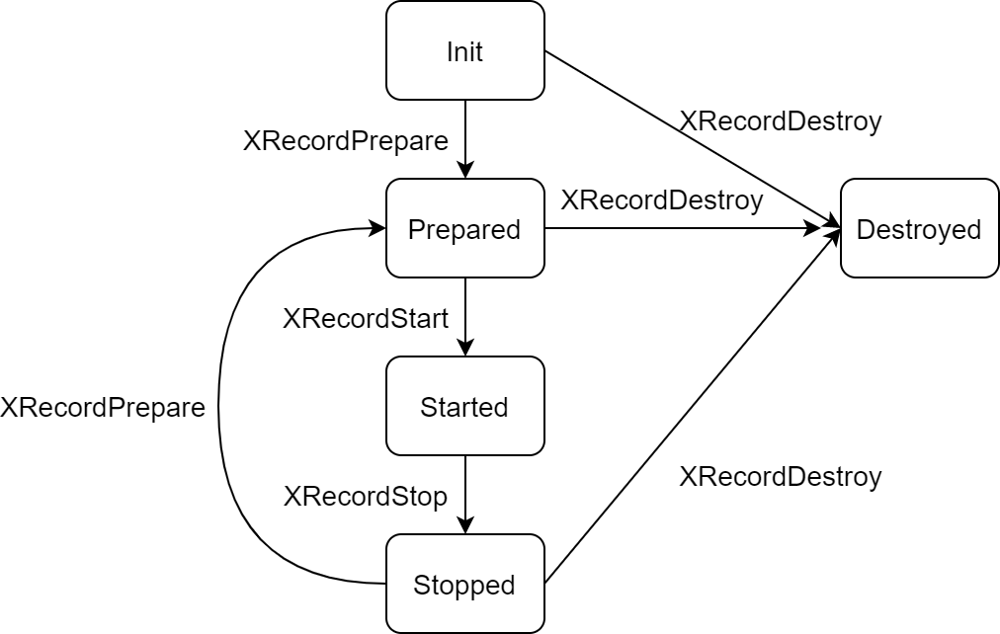

# RTOS 多媒体编码

介绍 FreeRTOS 下如何使用 xrecorder 的接口来开发录制应用程序，方便录制应用开发人员快速正确地开发，以及录制应用测试人员如何根据该文档对基于 xrecord 的录制应用进行验证测试。

## 编码支持情况

目前 RTOS 平台多媒体编码应用支持的编码格式分别为：pcm、amr、mp3、speex、opus。

其中 pcm、amr、mp3 可通过 xrecorder 进行编码以及录制；speex 和 opus 可通过第三方示例工程进行编码。

## xrecorder 状态图



这张状态转换图清晰地描述了 xrecorder 的各个状态，也列举了主要的方法的调用时序，每种方法只能在一些特定的状态下使用，否则会出错。

###  Init 状态

Idle 状态：当调用 XRecordCreate() 创建一个 xrecord 时，处于 idle 状态。

### Prepared 状态

调用 XRecordPrepare() 函数并返回后，xrecorder 处于 Prepared 状态。在这个状态下说明所有的资源都已经就绪了，调用 XRecordStart() 函数就可以进行录制。

###  Started 状态

xrecorder prepare 完成后，调用 XRecordStart() 进行录制，当应用开始录制后，xrecorder 就处于 Started 状态，这表明 xrecorder 正在录制文件。

### Stopped 状态

Started 状态下均可调用 XrecordStop() 停止 xrecorder，而处于 Stop 状态的 xrecorder 要想重新录制，需要通过 XRecorderPrepare() 回到先前的 Prepared 状态重新开始才可以。

### Destroyed 状态

通过 XRecordDestroy() 的方法可以进入 Destroyed 状态，只要 xrecorder 不再被使用，就应当尽快将其 destroy 掉。

## 接口函数

### 创建一个 XRecord

```c
XRecord *XRecordCreate()
```

参数：

- 无

返回值：

- 无


### 设置录制音频的编码格式

```c
int XRecordSetAudioEncodeType(XRecord *p, XRECODER_AUDIO_ENCODE_TYPE type, XRecordConfig *config)
```

参数：

- p: 通过 XRecordCreate 创建的 XRecord 指针
- type: 已支持的编码格式
- config: 上层应用对音频属性的配置

返回值：

- 成功: 0; 失败: ‑1


### 获取指针

获取指向音频设备管理模块的指针，用于录制音频

```c
void XRecordSetAudioCap(XRecord* p, const CaptureCtrl* audioSrc)
```

参数：

-  p: 通过 XRecordCreate 创建的 XRecord 指针
- audioSrc: 由上层应用获取的音频设备管理模块的指针

返回值：

- 无

audioSrc 可在上层应用通过调用 cedarx 的音频设备管理模块的 RTCaptureDeviceCreate 来创建。


### 设置录制后文件的保存的路径

```c
int XRecordSetDataDstUrl(XRecord* p, const char* pUrl, void* arg, const CdxKeyedVectorT* pHeaders)
```

参数：

- p: 通过 XRecordCreate 创建的 XRecord 指针 
- pUrl：url 地址

返回值：

- 成功：0；失败：‑1


###  将 XRecord 置为准备状态, 准备 Muxer

```c
int XRecordPrepare(XRecord* p)
```

参数：

- p：通过 XRecordCreate 创建的 XRecord 指针

返回值：

- 成功：0；失败：‑1


### 将 XRecord 置为启动状态

```c
int XRecordStart(XRecord* p)
```

参数：

- p：通过 XRecordCreate 创建的 XRecord 指针

返回值：

- 成功：0；失败：‑1


### 将 XRecord 置为停止状态

```c
int XRecordStop(XRecord* p)
```

参数：

- p：通过 XRecordCreate 创建的 XRecord 指针

返回值：

- 成功： 0；失败：‑1


### 编码数据入队封装

提供接口给下层编码模块，将编码数据放进缓存队列中等待封装

```c
int onAudioDataEnc(XRecord* app, CdxMuxerPacketT* buff)
```

参数：

- app: xrecorder 的环境句柄；
- buff：编码后的缓存数据

返回值：

- 成功： 0；失败：‑1


### 销毁一个 XRecord

```c
int XRecordDestroy(XRecord* p)
```

参数：

- p：通过 XRecordCreate 创建的 XRecord 指针

返回值：

- 成功： 0；失败：‑1

## XRecorder 开发流程

1. `XRecordCreate()` //创建一个录制应用
2. `XRecordSetAudioCap()` //设置音频采集设备；可先调用 `RTCaptureDeviceCreate` 创建。
3. `XRecordSetDataDstUrl()` //设置录制后文件保存位置
4. `XRecordSetAudioEncodeType()` //设置音频数据的编码格式
5. `XRecordPrepare()` //设置 Muxer，让 xrecorder 进入准备状态
6. `XRecordStart()` //开始录制
7. `XRecordStop()` //停止录制
8. `XRecordDestroy()` //当不需要进行录制的时候，销毁 xrecorder

## 注意事项

1. 在调用 XRecordSetAudioCap 设置音频采集设备之前，需先打开音频采集设备来获取句柄。在 rtos 平台可调用 libcedarx 提供的音频采集设备控制模块 rtosCaptureControl.c 中的 `RTCaptureDeviceCreate` 来创建句柄。
2. recorder 应用未支持暂停录制。
3. recorder 的录制时长为调用 XRecordStart 至调用 XRecordStop 之间的时长来决定，因此上层应用需要录制指定时长的音频时，录制的步骤应为调用 XRecordStart，等待指定的时间，调用XRecordStop。

## 示例代码

```c
#include <stdio.h>
#include <stdlib.h>
#include <stdbool.h>
#include <string.h>
#include <aw_common.h>
#include <console.h>

#include "vfs.h"
#include "xrecord.h"

#define RECORDER_LOGD(msg, arg...)      printf("[RECORDER_DBG] <%s : %d> " msg "\n", __func__, __LINE__, ##arg)
#define RECORDER_LOGI(msg, arg...)      printf("[RECORDER_INFO] <%s : %d> " msg "\n", __func__, __LINE__, ##arg)
#define RECORDER_LOGW(msg, arg...)      printf("[RECORDER_WRN] <%s : %d> " msg "\n", __func__, __LINE__, ##arg)
#define RECORDER_LOGE(msg, arg...)      printf("[RECORDER_ERR] <%s : %d> " msg "\n", __func__, __LINE__, ##arg)

typedef struct recorder_base recorder_base;

typedef struct rec_cfg
{
    XRECODER_AUDIO_ENCODE_TYPE   type;
    int                 sample_rate;
    int                 chan_num;
    int                 bitrate;
    int                 sampler_bits;
} rec_cfg;

struct recorder_base
{
    int (*start)(recorder_base *base, const char *url, const rec_cfg *cfg);
    int (*stop)(recorder_base *base);
};

struct ExampleCustomerWriterImpl
{
    CdxWriterT base;
    vfs_file_t *vfs;
};

typedef struct recorder
{
    recorder_base base;
    XRecord *xrecorder;
    CaptureCtrl *cap;
} recorder;

recorder_base *recorder_create();
int recorder_destroy(recorder_base *base);

/* Example Customer Writer */
static int __CdxExampleConnect(CdxWriterT *writer)
{
    struct ExampleCustomerWriterImpl *impl;

    impl = (struct ExampleCustomerWriterImpl *)writer;

    vfs_unlink("data/record/2.amr");
    impl->vfs = vfs_open("data/record/2.amr", VFS_RDWR | VFS_CREAT);
    if (impl->vfs == NULL) {
        return -1;
    }

    return 0;
}

static int __CdxExampleRead(CdxWriterT *writer, void *buf, int size)
{
    return 0;
}

static int __CdxExampleWrite(CdxWriterT *writer, void *buf, int size)
{
    uint32_t write_len;
    struct ExampleCustomerWriterImpl *impl;

    impl = (struct ExampleCustomerWriterImpl *)writer;

    write_len = vfs_write(impl->vfs, buf, size);

    return write_len;
}

static long __CdxExampleSeek(CdxWriterT *writer, long moffset, int mwhere)
{
    return 0;
}

static long __CdxExampleTell(CdxWriterT *writer)
{
    return 0;
}

static int __CdxExampleClose(CdxWriterT *writer)
{
    struct ExampleCustomerWriterImpl *impl;

    impl = (struct ExampleCustomerWriterImpl *)writer;

    vfs_close(impl->vfs);
    free(impl);

    return 0;
}

static const struct CdxWriterOps exampleCustomerWriteOps =
{
    .cdxConnect   =  __CdxExampleConnect,
    .cdxRead      =  __CdxExampleRead,
    .cdxWrite     =  __CdxExampleWrite,
    .cdxSeek      =  __CdxExampleSeek,
    .cdxTell      =  __CdxExampleTell,
    .cdxClose     =  __CdxExampleClose
};

CdxWriterT *ExampleCustomerWriterCreat()
{
    struct ExampleCustomerWriterImpl *impl;

    impl = malloc(sizeof(*impl));
    if (impl == NULL) {
        printf("example customer writer create fail.\n");
        return NULL;
    }

    memset(impl, 0, sizeof(*impl));

    impl->base.ops = &exampleCustomerWriteOps;

    return &impl->base;
}

/* Main App */
static void showHelp(){
    printf("\n");
    printf("**************************\n");
    printf("* This is a simple audio recoder, when it is started, you can input commands to tell\n");
    printf("* what you want it to do.\n");
    printf("* Usage: \n");
    printf("*   cedarx_record amr 10  : this means record 10s amr music\n");
    printf("*   cedarx_record pcm 10  : this means record 10s pcm music\n");
    printf("**************************\n");
}

recorder *recorder_singleton = NULL;

static int record_start(recorder_base *base, const char *url, const rec_cfg *cfg)
{
    recorder *impl = container_of(base, recorder, base);

    XRecordConfig audioConfig;

    if (cfg->type == XRECODER_AUDIO_ENCODE_PCM_TYPE)
    {
        audioConfig.nChan = cfg->chan_num;
        audioConfig.nSamplerate = cfg->sample_rate;
        audioConfig.nSamplerBits = cfg->sampler_bits;
        audioConfig.nBitrate = cfg->bitrate;
    }
    else if (cfg->type == XRECODER_AUDIO_ENCODE_AMR_TYPE)
    {
        audioConfig.nChan = 1;
        audioConfig.nSamplerate = 8000;//amr-nb 8000Hz amr-wb 16000Hz
        audioConfig.nSamplerBits = 16;
        audioConfig.nBitrate = 12200;//amr-nb 12200  amr-wb 23850
    } else {
        audioConfig.nChan = cfg->chan_num;
        audioConfig.nSamplerate = cfg->sample_rate;
        audioConfig.nSamplerBits = cfg->sampler_bits;
        audioConfig.nBitrate = cfg->bitrate;
    }

    XRecordSetDataDstUrl(impl->xrecorder, url, NULL, NULL);
    XRecordSetAudioEncodeType(impl->xrecorder, cfg->type, &audioConfig);

    XRecordPrepare(impl->xrecorder);
    XRecordStart(impl->xrecorder);
    RECORDER_LOGI("record start");
    return 0;
}

static int record_stop(recorder_base *base)
{
    recorder *impl = container_of(base, recorder, base);
    XRecordStop(impl->xrecorder);
    return 0;
}

extern CaptureCtrl* RTCaptureDeviceCreate();

recorder_base *recorder_create()
{
    if (recorder_singleton != NULL)
        return &recorder_singleton->base;

    recorder *impl = malloc(sizeof(*impl));
    if (impl == NULL)
        return NULL;
    memset(impl, 0, sizeof(*impl));

    impl->xrecorder = XRecordCreate();
    if (impl->xrecorder == NULL)
        goto failed;

    impl->cap = (void *)(uintptr_t)RTCaptureDeviceCreate();
    if (impl->cap == NULL)
        goto failed;
    XRecordSetAudioCap(impl->xrecorder, impl->cap);

    impl->base.start = record_start;
    impl->base.stop = record_stop;

    recorder_singleton = impl;

    return &impl->base;

failed:
    RECORDER_LOGE("recorder create failed");
    if (impl->xrecorder)
        XRecordDestroy(impl->xrecorder);
    if (impl)
        free(impl);
    return NULL;
}

int recorder_destroy(recorder_base *base)
{
    recorder *impl = container_of(base, recorder, base);

    if (impl->xrecorder) {
        XRecordDestroy(impl->xrecorder);
    }

    free(impl);

    recorder_singleton = NULL;

    return 0;
}

static int cedarx_record_test(int argc, char **argv)
{
	recorder_base *recorder;
	rec_cfg cfg;
	char music_url[64];
	char file_url[64];
	CdxWriterT *writer;
	memset(file_url, 0, 64);
	if(argc == 3){
        if( !strncmp("amr", argv[1], sizeof("amr")-1) ){
            cfg.type = XRECODER_AUDIO_ENCODE_AMR_TYPE;
            snprintf(file_url, 64, "file://data/%ds.amr", atoi(argv[2]));
            cfg.sample_rate = 8000;//8000
            cfg.chan_num = 1;//1
            cfg.bitrate = 12200;
            cfg.sampler_bits = 16;
        }
        else if( !strncmp("pcm", argv[1], sizeof("pcm")-1) ){
            cfg.type = XRECODER_AUDIO_ENCODE_PCM_TYPE;
            snprintf(file_url, 64, "file://data/%ds.pcm", atoi(argv[2]));
            cfg.sample_rate = 8000;//8000
            cfg.chan_num = 1;//1
            cfg.bitrate = 12200;
            cfg.sampler_bits = 16;
        }
        else if( !strncmp("mp3", argv[1], sizeof("mp3")-1) ){
            cfg.type = XRECODER_AUDIO_ENCODE_MP3_TYPE;
            snprintf(file_url, 64, "file://data/%ds.mp3", atoi(argv[2]));
            cfg.sample_rate = 16000;
            cfg.chan_num = 1;
            cfg.bitrate = 32000;
            cfg.sampler_bits = 16;
        } else {
            printf("now support!\n");
            return -1;
        }
	}else{
        printf("the parameter is error,usage is as following:\n");
        showHelp();
        return -1;
	}

	recorder = recorder_create();
	if (recorder == NULL) {
		printf("recorder create fail, exit\n");
		return -1;
	}

	printf("===start record %s now, last for %d s===\n", argv[1], atoi(argv[2]));
	recorder->start(recorder, file_url, &cfg);
	sleep(atoi(argv[2]));
	recorder->stop(recorder);
	printf("record %s over.\n", argv[1]);
exit:
	return recorder_destroy(recorder);
}

FINSH_FUNCTION_EXPORT_CMD(cedarx_record_test, cedarx_record, cedarx record test demo);
```


