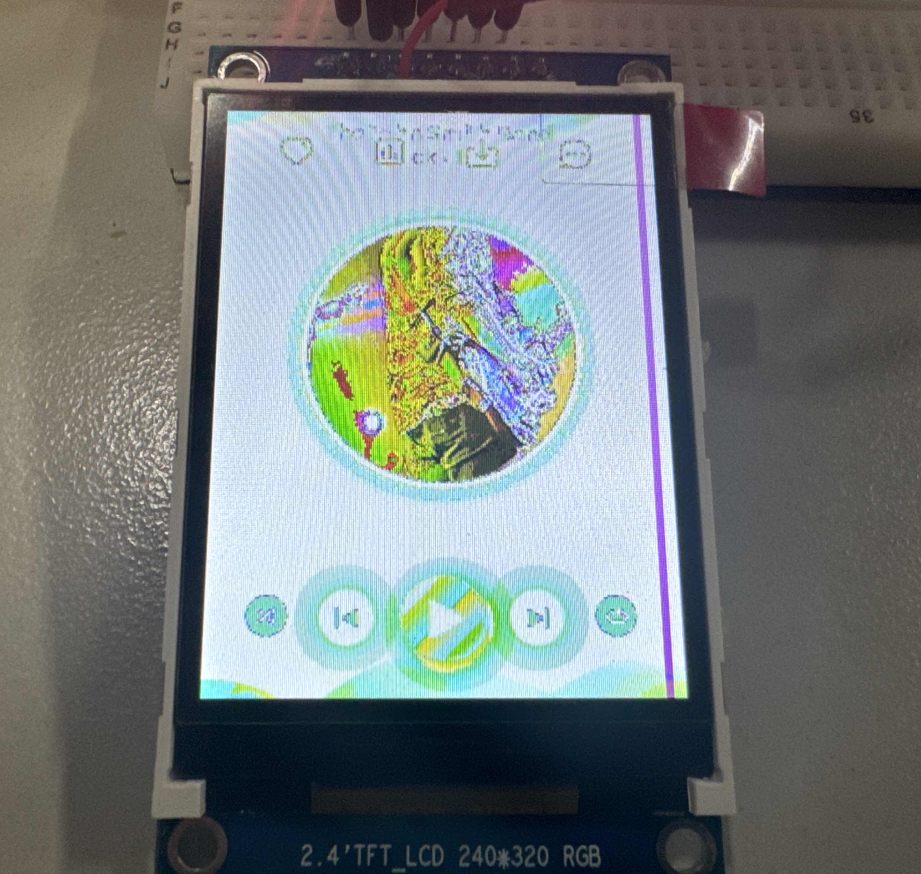

# SPI LCD 显示驱动

## 简介

R128 平台提供了 SPI DBI 的 SPI TFT 接口，具有如下特点：

- Supports DBI Type C 3 Line/4 Line Interface Mode
- Supports 2 Data Lane Interface Mode
- Supports data source from CPU or DMA
- Supports RGB111/444/565/666/888 video format
- Maximum resolution of RGB666 240 x 320@30Hz with single data lane
- Maximum resolution of RGB888 240 x 320@60Hz or 320 x 480@30Hz with dual data lane
- Supports tearing effect
- Supports software flexible control video frame rate

同时，提供了SPILCD驱动框架以供 SPI 屏幕使用。

## 模块驱动

### menuconfig配置说明

SPILCD 模块 menuconfig 的配置如下（以选择kld2844b屏为例）：

```
Drivers Options  --->
    soc related device drivers  --->
        SPILCD Devices  --->
            [*] DISP Driver Support(spi_lcd)
            [*]   spilcd hal APIs test           //spilcd模块测试用例
            LCD_FB panels select  --->           //spilcd屏驱动配置
                [*] LCD support kld2844B panel
                [ ] LCD support kld35512 panel
            Board select  --->
                [ ] board kld2844b support       //板级显示使用显示驱动私有方式的配置项，而使用sys_config.fex方式不用配置
```

另外可能需依赖的配置项有：

- DRIVERS_SPI
- DRIVERS_DBI
- DRIVERS_PWM

### 源码结构介绍

源码结构及主要驱动文件如下：

```
spilcd/
├── lcd_fb/
│   ├── dev_lcd_fb.c				# spilcd driver 层
│   ├── disp_display.c
│   ├── disp_lcd.c
│   ├── lcd_fb_intf.c
│   └── panels/					    # lcd驱动相关
│       ├── kld2844b.c
│       ├── lcd_source.c
│       ├── panels.c
│       └── panels.h
└── soc/
    ├── disp_board_config.c			# 板级配置解析
    └── kld2844b_config.c			# 显示私有方式的板级配置文件

```

## 模块参数配置

当前板级显示支持两种配置方法，一是使用 `sys_config.fex` 的方式进行配置，二是在不支持`sys_config.fex` 情况下，可以通过显示驱动私有的方式进行配置。下面分别对两种方式进行说明。

### 使用 sys_config.fex 的方式进行配置

FreeRTOS系统路径：`board/芯片名/方案名/configs/sys_config.fex`

> 配置文件具体要看芯片方案所实际使用的，也可能使用的配置文件名称为sys_config_xxx.fex（xx是存储方案的标识，例如sys_config_nor.cfg、sys_config_nand.cfg）

具体配置举例如下：

```
;----------------------------------------------------------------------------------
;lcd_fb0 configuration
;----------------------------------------------------------------------------------
[lcd_fb0]
lcd_used            = 1              ; 使用显示屏
lcd_model_name      = "spilcd"       ; 模型：spilcd
lcd_driver_name     = "jlt35031c"    ; 屏幕驱动：jlt35031c
lcd_x               = 320            ; 屏幕宽分辨率
lcd_y               = 480            ; 屏幕高分辨率
lcd_width           = 49             ; 屏幕物理宽度
lcd_height          = 74             ; 屏幕物理高度
lcd_data_speed      = 60             ; SPI 驱动频率 60MHz
lcd_pwm_used        = 1              ; lcd使用pwm背光
lcd_pwm_ch          = 1              ; lcd使用pwm背光通道1
lcd_pwm_freq        = 5000           ; lcd使用pwm背光频率5000Hz
lcd_pwm_pol         = 0              ; lcd使用pwm背光相位0
lcd_if              = 0              ; lcd使用spi接口，0-spi, 1-dbi
lcd_pixel_fmt       = 11             
lcd_dbi_fmt         = 2
lcd_dbi_clk_mode    = 1
lcd_dbi_te          = 1
fb_buffer_num       = 2
lcd_dbi_if          = 4
lcd_rgb_order       = 0
lcd_fps             = 60
lcd_spi_bus_num     = 1
lcd_frm             = 2
lcd_gamma_en        = 1
lcd_backlight       = 100

lcd_power_num       = 0
lcd_gpio_regu_num   = 0
lcd_bl_percent_num  = 0

lcd_spi_dc_pin      = port:PA19<1><0><3><0> ; DC脚
;RESET Pin
lcd_gpio_0          = port:PA20<1><0><2><0> ; 复位脚
```

#### lcd_driver_name

Lcd屏驱动的名字（字符串），必须与屏驱动中`strcut __lcd_panel`变量的`name`成员一致。

#### lcd_model_name

Lcd屏模型名字，非必须，可以用于同个屏驱动中进一步区分不同屏。

#### lcd_if

Lcd Interface

设置相应值的对应含义为：

```
0：spi接口
1：dbi接口
```

`spi`接口就是俗称的4线模式，这是因为发送数据时需要额外借助`DC`线来区分命令和数据，与`sclk`，`cs`和`sda`共四线。


如果设置了`dbi`接口，那么还需要进一步区分`dbi`接口，需要设置 `lcd_dbi_if`

#### lcd_dbi_if

Lcd dbi 接口设置。

这个参数只有在`lcd_if=1`时才有效。

设置相应值的对应含义为：

```
0：L3I1
1：L3I2
2：L4I1
3：L4I2
4：D2LI
```

所有模式在发送数据时每个周期的比特数量根据不同像素格式不同而不同。

`L3I1`和`L3I2`是三线模式（不需要`DC`脚），区别是读时序，也就是是否需要额外脚来读寄存器。读写时序图如下：


`L4I1`和`L4I2`是四线模式，与spi接口协议一样，区别是DC脚的控制是否自动化控制，另外I2和I1的区别是读时序，也就是否需要额外脚来读取寄存器。


`D2LI`是两data lane模式。发送命令部分时序与读时序与`L3I1`一致，下图是发送数据时的时序，不同像素格式时钟周期数量不一样。


#### lcd_dbi_fmt

`DBI`接口像素格式。


```
0：RGB111
1：RGB444
2：RGB565
3：RGB666
4：RGB888
```

选择的依据是接收端屏`Driver IC`的支持情况，请查看`Driver IC`手册或询问屏厂。

然后必须配合`lcd_pixel_fmt`的选择，比如说选RGB565时，`lcd_pixel_fmt`也要选565格式。


#### lcd_dbi_te

使能te触发。

te即（Tearing effect），也就是撕裂的意思，由于读写不同导致撕裂现象，te脚的功能就是用于同步读写，te脚的频率也就是屏的刷新率，所以te脚也可以看做vsync脚（垂直同步脚）

```
0: 禁止te
1: 下降沿触发
2: 上升沿触发
```

查看[带te脚的屏](#带te脚的屏)进一步说明。

#### lcd_dbi_clk_mode

选择dbi时钟的行为模式。

```
0:自动停止。有数据就有时钟，没发数据就没有
1:一直保持。无论发不发数据都有时钟
```

注意上面的选项关系屏兼容性。

#### lcd_rgb_order

输入图像数据rgb顺序识别设置，仅当lcd_if=1时有效。

```
0:RGB
1:RBG
2:GRB
3:GBR
4:BRG
5:BGR
6:G_1RBG_0
7:G_0RBG_1
8:G_1BRG_0
9:G_0BRG_1
```

非RGB565格式用0到5即可。

针对rgb565格式说明如下：

rgb565格式会遇到大小端问题，arm平台和PC平台存储都是小端(little endian，低字节放在低地址，高字节放在高地址），但是许多spi屏都是默认大端（Big Endian）。

也就是存储的字节顺序和发送的字节顺序不对应。

这个时候选择6以下，DBI接口就会自动将小端转成大端。

如果遇到默认是小端的spi屏，则需要选择6以上，DBI接口会自动用回小端方式。

6以上格式这样解释：

R是5比特，G是6比特，B是5比特，再把G拆成高3位(G_1)和低3位(G_0)
所以以下两种顺序：


1. R-G_1-G_0-B，大端。
2. G_0-B-R-G_1，对应上面的9，小端。

#### lcd_x

显示屏的水平像素数量，注意如果屏支持横竖旋转，那么lcd_x和lcd_y也要对调。

#### lcd_y

显示屏的行数，注意如果屏支持横竖旋转，那么lcd_x和lcd_y也要对调。


#### lcd_data_speed

用于设置spi/dbi接口时钟的速率，单位MHz。

1. 发送端（SOC)的最大限制是100MHz。
2. 接收端（屏Driver IC）的限制，请查看对应Driver IC手册或者询问屏厂支持。
3. 超出以上限制都有可能导致显示异常。

#### lcd_fps

设置屏的刷新率，单位Hz。当[lcd_dbi_te](#lcd_dbi_te)使能时，这个值设置无效。


#### lcd_pwm_used

是否使用pwm。

此参数标识是否使用pwm用以背光亮度的控制。


#### lcd_pwm_ch

Pwm channel used

此参数标识使用的Pwm通道。


#### lcd_pwm_freq

Lcd backlight PWM Frequency

这个参数配置PWM信号的频率，单位为Hz。


#### lcd_pwm_pol

Lcd backlight PWM Polarity

这个参数配置PWM信号的占空比的极性。设置相应值对应含义为：

```
0：active high
1：active low
```

#### lcd_pwm_max_limit

Lcd backlight PWM

最高限制，以亮度值表示。

比如150，则表示背光最高只能调到150，0～255范围内的亮度值将会被线性映射到0～150范围内。用于控制最高背光亮度，节省功耗。

#### lcd_backlight

默认背光值，取值范围0到255，值越大越亮。

#### lcd_bl_en

背光使能脚定义


#### lcd_spi_dc_pin

指定作为DC的管脚，用于spi接口时。


#### lcd_gpio_x

x表示数字。如果有多个gpio脚需要控制，则定义lcd_gpio_0，lcd_gpio_1等。


#### lcd_spi_bus_num

选择spi总线id，只有spi1支持DBI协议，所以这里一般选择1。

取值范围：0到1。


#### lcd_pixel_fmt

选择传输数据的像素格式。

可选值如下，当你更换RGB分量顺序的时候，也得相应修改lcd_rgb_order，或者修改屏驱动的rgb分量顺序（一般是3Ah寄存器）。

DBI接口只支持RGB32和RGB16的情况。

SPI接口只支持RGB16的情况。


```
		enum lcdfb_pixel_format {
			LCDFB_FORMAT_ARGB_8888 = 0x00,	// MSB  A-R-G-B  LSB
			LCDFB_FORMAT_ABGR_8888 = 0x01,
			LCDFB_FORMAT_RGBA_8888 = 0x02,
			LCDFB_FORMAT_BGRA_8888 = 0x03,
			LCDFB_FORMAT_XRGB_8888 = 0x04,
			LCDFB_FORMAT_XBGR_8888 = 0x05,
			LCDFB_FORMAT_RGBX_8888 = 0x06,
			LCDFB_FORMAT_BGRX_8888 = 0x07,
			LCDFB_FORMAT_RGB_888 = 0x08,
			LCDFB_FORMAT_BGR_888 = 0x09,
			LCDFB_FORMAT_RGB_565 = 0x0a,
			LCDFB_FORMAT_BGR_565 = 0x0b,
			LCDFB_FORMAT_ARGB_4444 = 0x0c,
			LCDFB_FORMAT_ABGR_4444 = 0x0d,
			LCDFB_FORMAT_RGBA_4444 = 0x0e,
			LCDFB_FORMAT_BGRA_4444 = 0x0f,
			LCDFB_FORMAT_ARGB_1555 = 0x10,
			LCDFB_FORMAT_ABGR_1555 = 0x11,
			LCDFB_FORMAT_RGBA_5551 = 0x12,
			LCDFB_FORMAT_BGRA_5551 = 0x13,
		};
```

#### fb_buffer_num

显示framebuffer数量，为了平滑显示，这里一般是2个，为了省内存也可以改成1。

### 模块 sys_config.fex 配置案例

#### 典型2 data lane配置

一些屏支持双数据线传输以加快数据传输速度，此时需要走DBI协议，典型配置如下:

```
[lcd_fb0]
lcd_used          = 1
lcd_driver_name   = "kld2844b"
lcd_if            = 1
lcd_dbi_if        = 4
lcd_data_speed    = 60
lcd_spi_bus_num   = 1
lcd_x             = 320
lcd_y             = 240
lcd_pwm_used      = 1
lcd_pwm_ch        = 4
lcd_pwm_freq      = 5000
lcd_pwm_pol       = 0
lcd_pixel_fmt     = 0
lcd_dbi_fmt       = 3
lcd_rgb_order     = 0
fb_buffer_num     = 2
lcd_backlight     = 200
lcd_fps           = 60
lcd_dbi_te        = 0
lcd_bl_en         = port:PB04<1><0><default><1>
lcd_gpio_0        = port:PB02<1><0><default><1>
```

1. 硬件连接上，第二根数据脚连接到原来1 data lane的DC脚，可以这样理解：2数据线在传输数据时就自带D/C(Data/Commend)信息了，所以原来的DC脚就可以空出来作为第二根数据线了。
2. 屏驱动上，需要使能2 data lane模式，具体寄存器查看对应driverIC手册或者询问屏厂。
3. 这里的针对对2 data lane的关键参数是[lcd_if](#lcd_if)，[lcd_dbi_if](#lcd_dbi_if)，[lcd_dbi_fmt](#lcd_dbi_fmt)和[lcd_spi_bus_num](#lcd_spi_bus_num)。
4. [lcd_x](#lcd_x)和[lcd_y](#lcd_y)是屏分辨率。如果屏支持旋转（横竖旋转），这里也需要对调。
5. [lcd_pwm](#lcd_pwm_used)开头，[lcd_backlight](#lcd_backlight)和[lcd_bl_en](#lcd_bl_en)的是背光相关设置，如果有相关硬件连接的话。
6. [lcd_pixel_fmt](#lcd_pixel_fmt)和[fb_buffer_num](#fb_buffer_num)是显示framebuffer的设置。
7. [lcd_gpio_](#lcd_gpio_x)开头的是自定义gpio的设置（比如复位脚）。
8. [lcd_fps](#lcd_fps)和[lcd_dbi_te](#lcd_dbi_te)是刷新方式相关的设置。


#### 原SPI接口屏配置

如果IC支持DBI接口，那么就没有必要用SPI接口，DBI接口其协议能覆盖所有情况。

一些IC不支持DBI，那么只能用spi接口（通过设置[lcd_if](#lcd_if)），如果使用spi接口，它有一些限制。

1. 不支持2 data lane。
2. 必须指定DC脚。这是由于spi协议不会自动控制DC脚来区分数据命令，通过设置[lcd_spi_dc_pin](#lcd_spi_dc_pin)可以完成这个目的，这跟管脚不必用spi里面的脚。
3. 只支持rgb565的像素格式。由于只有单data lane，速度过慢，rgb565以上格式都不现实。

```
[lcd_fb0]
lcd_used          = 1
lcd_driver_name   = "kld2844b"
lcd_if            = 0
lcd_data_speed    = 60
lcd_spi_bus_num   = 1
lcd_x             = 320
lcd_y             = 240
lcd_pwm_used      = 1
lcd_pwm_ch        = 4
lcd_pwm_freq      = 5000
lcd_pwm_pol       = 0
lcd_pixel_fmt     = 10
lcd_rgb_order     = 0
fb_buffer_num     = 2
lcd_backlight     = 200
lcd_fps           = 60
lcd_dbi_te        = 0
lcd_bl_en         = port:PB04<1><0><default><1>
lcd_gpio_0        = port:PB02<1><0><default><1>
lcd_spi_dc_pin    = port:PA19<1><0><3><1>
```


#### 带te脚的屏

te即（Tearing effect），也就是撕裂的意思，是由于读写不同步导致撕裂现象，te脚的功能就是用于同步读写，te脚的频率也就是屏的刷新率，所以te脚也可以看做vsync脚（垂直同步脚）。

1. 硬件设计阶段，需要将屏的te脚连接到IC的DBI接口的te脚。
2. 配置上接口使用dbi接口。
3. 然后使能[lcd_dbi_te](#lcd_dbi_te)。
4. 屏驱动使能te功能，寄存器一般是35h，详情看屏对应的driver IC手册。
5. 屏驱动设置帧率，根据屏能接受的传输速度选择合理的帧率（比如ST7789H2里面是通过c6h来设置te频率）。

```
[lcd_fb0]
lcd_used          = 1
lcd_driver_name   = "kld2844b"
lcd_if            = 1
lcd_dbi_if        = 4
lcd_data_speed    = 60
lcd_spi_bus_num   = 1
lcd_x             = 320
lcd_y             = 240
lcd_pwm_used      = 1
lcd_pwm_ch        = 4
lcd_pwm_freq      = 5000
lcd_pwm_pol       = 0
lcd_pixel_fmt     = 0
lcd_dbi_fmt       = 3
lcd_rgb_order     = 0
fb_buffer_num     = 2
lcd_backlight     = 200
lcd_fps           = 60
lcd_dbi_te        = 1
lcd_bl_en         = port:PB04<1><0><default><1>
lcd_gpio_0        = port:PB02<1><0><default><1>
```

#### 横竖屏旋转

1. 平台没有硬件旋转功能，软件旋转太慢而且耗费CPU。
2. 不少spi屏支持内部旋转，需要在屏驱动初始化的时候进行设置，一般是**36h**寄存器。

```
// 转成横屏
sunxi_lcd_cmd_write(sel, 0x36);
sunxi_lcd_para_write(sel, 0xa0);
```

1. lcd_fb0的配置中需要将[lcd_x](#lcd_x)和[lcd_y](#lcd_y)的值对调，此时软件将屏视为横屏。
2. 屏内部旋转出图效果可能会变差，建议选屏的时候直接选好方向。

#### 帧率控制

屏的刷新率受限于多方面：

1. SPI/DBI硬件传输速度，也就是时钟脚的频率。设置[lcd_data_speed](#lcd_data_speed)可以设置硬件传输速度，最大不超过100MHz。如果屏能正常接收，这个值自然是越大越好。
2. 屏driver IC接收能力。Driver IC手册中会提到屏的能接受的最大sclk周期。
3. 使用2 data lane还是1 data lane，理论上2 data lane的速度会翻倍。见[典型2 data lane配置](#典型2_data_lane配置)。
4. 像素格式。像素格式决定需要传输的数据量，颜色数量越小的像素格式，帧率越高，但是效果越差。
5. [带te脚的屏](#带te脚的屏)一节中我们知道，te相关设置直接影响到屏刷新率。
6. 如果不支持te，可以通过设置[lcd_fps](#lcd_fps)来控制帧率，你需要根据第一点和第二点选择一个合适的值。


#### 背光控制

1. 硬件需要支持pwm背光电路。
2. 驱动支持pwm背光调节，只需要配置好[lcd_pwm](#lcd_pwm_used)开头，[lcd_backlight](#lcd_backlight)和[lcd_bl_en](#lcd_bl_en)等背光相关配置即可。


#### 像素格式相关

1. [lcd_pixel_fmt](#lcd_pixel_fmt)，这个设置项用于设置fbdev的像素格式。
2. [lcd_dbi_fmt](#lcd_dbi_fmt)，这个用于设置DBI接口发送的像素格式。

SPI/DBI发送数据的时候没有必要发送alpha通道，但是应用层却有对应的alpha通道，比如ARGB8888格式。

这个时候硬件会自动帮我们处理好alpha通道，所以lcd_pixel_fmt选择有alpha通道的格式时，lcd_dbi_fmt可以选rgb666或者rgb888，不用和它一样。


#### 电源配置

有多个电源的话，就用lcd_power1，lcd_power2......然后屏驱动里面调用[sunxi_lcd_power_enable](#sunxi_lcd_power_enable)接口即可。

#### GPIO配置说明

[lcd_bl_en](#lcd_bl_en)、[lcd_spi_dc_pin](#lcd_spi_dc_pin)以及[lcd_gpio_x](#lcd_gpio_x)都是属于GPIO属性类型。

下面以lcd_spi_dc_pin为例，具体说明GPIO属性的参数值含义：

```
lcd_spi_dc_pin   = port:PA19<1><0><3><1>
```

引脚说明：port: 端口 < 复用功能 >< 上下拉 >< 驱动能力 >< 输出值 >

等式右边的从左到右5个字段代表的具体含义如下：

- `PA19`：端口，表示GPIO管脚。`PA`表示PA组管脚，`19`表示第19根管脚；即PA19管脚。
- `<1>`：复用功能，表示GPIO复用类型。1表示将PA19选择为通用GPIO功能，0为输入，1为输出。
- `<0>`：上下拉，表示内置电阻。使用0的话，表示内部电阻高阻态，如果是1则是内部电阻上拉，2就代表内部电阻下拉。其它数据无效。
- `<3>`：表示驱动能力。1是默认等级，数字越大驱动能力越强，最大是3。
- `<1>`：表示默认输出电平值。0为低电平，1为高电平。

#### 多个显示

1. 确定硬件有没有多余的spi/dbi接口。
2. 需要在sys_config.fex里面新增lcd_fb1，配置方式与lcd_fb0一样（或者在显示私有方式的板级配置文件里面新增`g_lcd1_config`，配置方式与g_lcd0_config一样），其中[lcd_spi_bus_num](#lcd_spi_bus_num)不能一样。

#### 依赖驱动配置

spilcd模块依赖spi，dbi，pwm等驱动。

### 使用显示私有方式进行配置

路径：`rtos-hal/hal/source/spilcd/soc/`

具体板级显示配置文件可参考该路径下的 `kld2844b_config.c` 配置文件。

该文件模仿 `sys_config.fex`来配置一些板级相关的资源，源文件中需要定义4个全局变量：`g_lcd0_config`、`g_lcd1_config`、`g_lcd0_config_len`和`g_lcd1_config_len`，且变量名字固定，不能修改。

具体说明如下：

1. `g_lcd0_config`：第一个屏的配置变量，`struct property_t`数据类型。
2. `g_lcd1_config`：第二个屏的配置变量，`struct property_t`数据类型。
3. `g_lcd0_config_len`和`g_lcd1_config_len`是对应上面两个数组变量的长度，照搬即可。   

`struct property_t`数据类型，用于定义一个属性的信息：   

1. 属性名字。对应其成员`name`，字符串。
2. 属性类型。对应其成员`type`，看`enum proerty_type`的定义，共有整型，字符串，GPIO，专用pin和电源。
3. 属性值。根据上面的属性类型来选择`union`中成员来赋值。

对于上述常用的属性类型举例如下：

整型：

```
	{
		.name = "lcd_used",
		.type = PROPERTY_INTGER,
		.v.value = 1,
	},
```

字符串：

```
	{
		.name = "lcd_driver_name",
		.type = PROPERTY_STRING,
		.v.str = "kld2844b",
	},
```

GPIO：

```
	{
		.name = "lcd_spi_dc_pin",
		.type = PROPERTY_GPIO,
		.v.gpio_list = {
			.gpio = GPIOA(19),
			.mul_sel = GPIO_DIRECTION_OUTPUT,
			.pull = 0,
			.drv_level = 3,
			.data = 1,
		},
	},
```


g_lcd0_config的含义与前述的使用sys_config.fex方式中的lcd_fb0一致。

## 编写屏驱动

屏驱动源码位置：

```
rtos-hal/hal/source/spilcd/lcd_fb/panels
```

1. 在屏驱动源码位置下拷贝现有一个屏驱动，包括头文件和源文件，然后将文件名改成有意义的名字，比如屏型号。

2. 修改源文件中的`strcut __lcd_panel`变量的名字，以及这个变量成员`name`的名字，这个名字必须和 `sys_config.fex` 中 `[lcd_fb0]`（或板级配置文件中`g_lcd0_config`）的`lcd_driver_name`一致。

3. 在屏驱动目录下修改`panel.c`和`panel.h`。在全局结构体变量`panel_array`中新增刚才添加`strcut __lcd_panel`的变量指针。`panel.h`中新增`strcut __lcd_panel`的声明。并用宏括起来。

4. 修改`rtos-hal/hal/source/spilcd/lcd_fb/panels/Kconfig`，新增一个config，与第三点提到的宏对应。

5. 修改`rtos-hal/hal/source/spilcd/lcd_fb/`路径下的Makefile文件。给lcd_fb-obj变量新增刚才加入的源文件对应`.o`。

6. 根据本手册以及屏手册，Driver IC手册修改sys_config.fex中的[lcd_fb0]节点（或显示私有方式的板级配置文件中的`g_lcd0_config`配置变量）下面的属性

7. 实现屏源文件中的`LCD_open_flow`，`LCD_close_flow`，`LCD_panel_init`，`LCD_power_on`等函数

### 开关屏流程函数解析

开关屏的操作流程如下图所示。

其中，LCD_open_flow和LCD_close_flow称为开关屏流程函数，该函数利用LCD_OPEN_FUNC进行注册回调函数，先注册先执行，可以注册多个，不限制数量。


#### LCD_open_flow

功能：初始化开屏的步骤流程。

原型：

```c
static __s32 LCD_open_flow(__u32 sel)
```

函数常用内容为：

```c
static __s32 LCD_open_flow(__u32 sel)
{
	LCD_OPEN_FUNC(sel, LCD_power_on,10);
	LCD_OPEN_FUNC(sel, LCD_panel_init, 50);
	LCD_OPEN_FUNC(sel, lcd_fb_black_screen, 100); 
	LCD_OPEN_FUNC(sel, LCD_bl_open, 0);
	return 0;
}
```

如上，初始化整个开屏的流程步骤为四个：

1. 打开LCD电源，再延迟10ms。
2. 初始化屏，再延迟50ms；（不需要初始化的屏，可省掉此步骤）。
3. 向屏发送全黑的数据。这一步骤是必须的，而且需要在开背光之前。
4. 打开背光，再延迟0ms。

`LCD_open_flow` 函数只会系统初始化的时候调用一次，执行每个 `LCD_OPEN_FUNC` 即是把对应的开屏步骤函数进行注册，**并没有立即执行该开屏步骤函数**。LCD_open_flow函数的内容必须统一用 `LCD_OPEN_FUNC(sel, function, delay_time)` 进行函数注册的形式，确保正常注册到开屏步骤中。

LCD_OPEN_FUNC的第二个参数是前后两个步骤的延时长度，单位ms，注意这里的数值请按照屏手册规定去填，乱填可能导致屏初始化异常或者开关屏时间过长，影响用户体验。

#### LCD_close_flow

功能：初始化关屏的步骤流程。

原型：

```c
static __s32 LCD_close_flow(__u32 sel)
```

函数常用内容为：

```c
static __s32 LCD_close_flow(__u32 sel)
{
	LCD_CLOSE_FUNC(sel, LCD_bl_close, 50);
	LCD_CLOSE_FUNC(sel, LCD_panel_exit, 10);
	LCD_CLOSE_FUNC(sel, LCD_power_off, 10);
	return 0;
}
```

1. LCD_bl_close，是关背光，关完背光在处理其它事情，不会影响用户视觉。
2. LCD_panel_exit，发送命令让屏退出工作状态。
3. 关电复位，让屏彻底关闭。


#### LCD_OPEN_FUNC

功能：注册开屏步骤函数到开屏流程中，记住这里是注册不是执行！

原型：

```c
void LCD_OPEN_FUNC(__u32 sel, LCD_FUNC func, __u32 delay)
```

参数说明：

func是一个函数指针，其类型是：`void (*LCD_FUNC) (__u32 sel)`，用户自己定义的函数必须也要用统一的形式。比如：

```
void user_defined_func(__u32 sel)
{
	//do something
}
```

delay是执行该步骤后，再延迟的时间，时间单位是毫秒。

#### LCD_power_on

这是开屏流程中第一步，一般在这个函数使用[sunxi_lcd_gpio_set_value](#sunxi_lcd_gpio_set_value)进行GPIO控制，用[sunxi_lcd_power_enable](#sunxi_lcd_power_enable)函数进行电源开关。

参考屏手册里面的上电时序（Power on sequence）。

#### LCD_panel_init

这是开屏流程第二步，一般使用[sunxi_lcd_cmd_write](#sunxi_lcd_cmd_write)和sunxi_lcd_para_write对屏寄存器进行初始化。

请向屏厂索要初始化寄存器代码或者自行研究屏Driver IC手册。

#### lcd_fb_black_screen

向屏传输全黑数据的接口，是必须的，否则打开背光后，呈现的将是雪花屏。

#### LCD_bl_open

这是背光使能，固定调用。

1. [sunxi_lcd_backlight_enable](#sunxi_lcd_backlight_enable), 打开lcd_bl_en脚。
2. [sunxi_lcd_pwm_enable](#sunxi_lcd_pwm_enable), 使能pwm。


#### LCD_bl_close

这是关闭背光。固定调用下面两个函数，分别是：

1. [sunxi_lcd_backlight_disable](#sunxi_lcd_backlight_enable)，lcd_bl_en关闭
2. [sunxi_lcd_pwm_disable](#sunxi_lcd_pwm_enable), 关闭pwm。

#### LCD_power_off

这是关屏流程中最后一步，一般在这个函数使用[sunxi_lcd_gpio_set_value](#sunxi_lcd_gpio_set_value)进行GPIO控制，用[sunxi_lcd_power_enable](#sunxi_lcd_power_enable)函数进行电源开关。

参考屏手册里面的下电时序（Power off sequence）。

#### sunxi_lcd_delay_ms

函数：**sunxi_lcd_delay_ms/sunxi_lcd_delay_us**

功能：延时函数，分别是毫秒级别/微秒级别的延时。

原型：`s32 sunxi_lcd_delay_ms(u32 ms); / s32 sunxi_lcd_delay_us(u32 us);`

#### sunxi_lcd_backlight_enable

函数：**sunxi_lcd_backlight_enable/ sunxi_lcd_backlight_disable**

功能：打开/关闭背光，操作的是[lcd_bl_en](#lcd_bl_en)。

原型：

- `void sunxi_lcd_backlight_enable(u32 screen_id);`

- `void sunxi_lcd_backlight_disable(u32 screen_id);`

#### sunxi_lcd_pwm_enable

函数：**sunxi_lcd_pwm_enable / sunxi_lcd_pwm_disable**

功能：打开/关闭pwm控制器，打开时pwm将往外输出pwm波形。对应的是lcd_pwm_ch所对应的那一路pwm。

原型：

- `s32 sunxi_lcd_pwm_enable(u32 screen_id);`

- `s32 sunxi_lcd_pwm_disable(u32 screen_id);`

#### sunxi_lcd_power_enable

函数：**sunxi_lcd_power_enable / sunxi_lcd_power_disable**

功能：打开/关闭Lcd电源，操作的是板级配置文件中的`lcd_power/lcd_power1/lcd_power2`。（pwr_id标识电源索引）。

原型：

- `void sunxi_lcd_power_enable(u32 screen_id, u32 pwr_id);`

- `void sunxi_lcd_power_disable(u32 screen_id, u32 pwr_id);`

1. pwr_id = 0：对应于配置文件中的lcd_power。
2. pwr_id = 1：对应于配置文件中的lcd_power1。
3. pwr_id = 2：对应于配置文件中的lcd_power2。
4. pwr_id = 3：对应于配置文件中的lcd_power3。

#### sunxi_lcd_cmd_write

函数：**sunxi_lcd_cmd_write**

功能：使用spi/dbi发送命令。

原型：`s32 sunxi_lcd_cmd_write(u32 screen_id, u8 cmd);`

#### sunxi_lcd_para_write

函数：**sunxi_lcd_para_write**

功能：使用spi/dbi发送参数。

原型：`s32 sunxi_lcd_para_write(u32 screen_id, u8 para);`


#### sunxi_lcd_gpio_set_value

函数：**sunxi_lcd_gpio_set_value**

功能：LCD_GPIO PIN脚上输出高电平或低电平。

原型：`s32 sunxi_lcd_gpio_set_value(u32 screen_id, u32 io_index, u32 value);`

参数说明：

- io_index = 0：对应于配置文件中的lcd_gpio_0。
- io_index = 1：对应于配置文件中的lcd_gpio_1。
- io_index = 2：对应于配置文件中的lcd_gpio_2。
- io_index = 3：对应于配置文件中的lcd_gpio_3。
- value = 0：对应IO输出低电平。
- Value = 1：对应IO输出高电平。

只用于该GPIO定义为输出的情形。

#### sunxi_lcd_gpio_set_direction

函数：**sunxi_lcd_gpio_set_direction**

功能：设置LCD_GPIO PIN脚为输入或输出模式。

原型：

```
s32 sunxi_lcd_gpio_set_direction(u32 screen_id, u32 io_index, u32 direction);
```

参数说明：

- io_index = 0：对应于配置文件中的lcd_gpio_0。
- io_index = 1：对应于配置文件中的lcd_gpio_1。
- io_index = 2：对应于配置文件中的lcd_gpio_2。
- io_index = 3：对应于配置文件中的lcd_gpio_3。
- direction = 0：对应IO设置为输入。
- direction = 1：对应IO设置为输出。

## 模块测试用例

```c
#include <stdio.h>
#include <stdlib.h>
#include <stdint.h>
#include <string.h>
#include <unistd.h>

#include <hal_cache.h>
#include <hal_mem.h>
#include <hal_log.h>
#include <hal_cmd.h>
#include <hal_lcd_fb.h>

static uint32_t width;
static uint32_t height;
static long int screensize = 0;
static char *fbsmem_start = 0;

static void lcdfb_fb_init(uint32_t yoffset, struct fb_info *p_info)
{
    p_info->screen_base = fbsmem_start;
    p_info->var.xres = width;
    p_info->var.yres = height;
    p_info->var.xoffset = 0;
    p_info->var.yoffset = yoffset;
}

int show_rgb(unsigned int sel)
{
    int i = 0, ret = -1;
    struct fb_info fb_info;
    int bpp = 4;
    unsigned char color[4] = {0xff,0x0,0xff,0x0};

    width = bsp_disp_get_screen_width(sel);
    height = bsp_disp_get_screen_height(sel);

    screensize = width * bpp * height;
    fbsmem_start = hal_malloc_coherent(screensize);

    hal_log_info("width = %d, height = %d, screensize = %d, fbsmem_start = %x\n",
            width, height, screensize, fbsmem_start);

    memset(fbsmem_start, 0, screensize);
    for (i = 0; i < screensize / bpp; ++i) {
        memcpy(fbsmem_start+i*bpp, color, bpp);
    }

    memset(&fb_info, 0, sizeof(struct fb_info));
    lcdfb_fb_init(0, &fb_info);
    hal_dcache_clean((unsigned long)fbsmem_start, screensize);
    bsp_disp_lcd_set_layer(sel, &fb_info);

    hal_free_coherent(fbsmem_start);
    return ret;
}

static int cmd_test_spilcd(int argc, char **argv)
{
    uint8_t ret;

    hal_log_info("Run spilcd hal layer test case\n");

    ret = show_rgb(0);

    hal_log_info("spilcd test finish\n");

    return ret;
}

FINSH_FUNCTION_EXPORT_CMD(cmd_test_spilcd, test_spilcd, spilcd hal APIs tests)
```

测试命令：

```
test_spilcd
```

测试结果：

```
1.如果LCD是ARGB8888像素格式输入，执行命令后会显示一帧紫色画面。
2.如果LCD是RGB565像素格式输入，执行命令后会显示一帧蓝色画面（SPI 协议是黄色画面（没有RB Swap））
```

## FAQ

### 怎么判断屏初始化成功

屏初始化成功，一般呈现的现象是雪花屏。因为屏驱动里面，在 `LCD_open_flow` 中添加了`lcd_fb_black_screen`的注册，故正常情况下开机是有背光的黑屏画面。


### 黑屏-无背光

一般是电源或者pwm相关配置没有配置好。参考[lcd_pwm](#lcd_pwm_used)开头的相关配置。


### 送图无显示

排除步骤:

1. 首先执行spilcd模块测试命令`test_spilcd`，如果能正常显示颜色画面，说明显示通路正常，只是应用未能正确配置送图接口。如果执行测试用例无法正常显示颜色画面，接着下面步骤。
2. 屏驱动里面，在`LCD_open_flow`中删除`lcd_fb_black_screen`的注册，启动后，如果屏初始化成功应该是花屏状态(大部分屏如此)。
3. 如果屏没有初始化成功，请检查屏电源，复位脚状态。
4. 如果屏初始化成功，但是发数据时又没法显示，那么需要检查是不是帧率过快，查看[帧率控制](#帧率控制)。
5. 如果电源复位脚正常，请检查配置，[lcd_dbi_if](#lcd_dbi_if), [lcd_dbi_fmt](#lcd_dbi_fmt)是否正确，屏是否支持, 如果支持，在屏驱动里面是否有对应上。
6. 尝试修改[lcd_dbi_clk_mode](#lcd_dbi_clk_mode)。


### 闪屏

非常有可能是速度跑太快，参考[帧率控制](#帧率控制)一小节。


### 画面偏移

画面随着数据的发送偏移越来越大。

尝试修改[lcd_dbi_clk_mode](#lcd_dbi_clk_mode)。

### 屏幕白屏

屏幕白屏，但是背光亮起


白屏是因为屏幕没有初始化，需要检查屏幕初始化序列或者初始化数据是否正确。

### 屏幕花屏

 屏幕花屏，无法控制


花屏一般是因为屏幕初始化后没有正确设置 `addrwin`，或者初始化序列错误。

### LVGL 屏幕颜色不正确

出现反色，颜色异常



请配置 LVGL `LV_COLOR_DEPTH` 参数为 16，`LV_COLOR_16_SWAP` 为 1，这是由 SPI LCD 的特性决定的。


### 显示反色

运行  `test_spilcd` ，屏幕显示蓝色。

这是由于屏幕启动了 RB SWAP，一般是 `0x36` 寄存器修改

正常显示

```
sunxi_lcd_cmd_write(sel, 0X36);
sunxi_lcd_para_write(sel, 0x00);
```

反色显示

```
sunxi_lcd_cmd_write(sel, 0X36);
sunxi_lcd_para_write(sel, 0x08);
```

### LVGL 出现 DMA Over Size


这是由于 LVGL 配置的 `LV_COLOR_DEPTH` 为 32，但是 SPI 屏配置为16位。请修改 `lv_conf.h`


### 出现部分花屏


- 检查 `address` 函数是否正确
- 检查 `sys_config.fex` 屏幕配置分辨率是否正确


## 总结

调试LCD显示屏实际上就是调试发送端芯片（全志SOC）和接收端芯片（LCD屏上的driver IC）的一个过程：

1. 添加屏驱动请看编写屏驱动
2. 仔细阅读屏手册以及driver IC手册（有的话）。
3. 仔细阅读板级显示配置参数详解。
4. 确保LCD所需要的各路电源管脚正常。

### SPI LCD 颜色相关问题

首先，得先确定显示屏使用的是SPI接口，还是DBI接口，不同的接口，输入数据的解析方式是不一样的。

DBI接口的全称是 `Display Bus Serial Interface` ，在显示屏数据手册中，一般会说这是SPI接口，所以有人会误认为SPI屏可以使用 `normal spi` 去直接驱动。

阅读`lcd_dbi_if`部分的介绍可以知道，在3线模式时，发送命令前有1位A0用于指示当前发送的是数据，还是命令。而命令后面接着的数据就没有这个A0位了，代表SPI需要在9位和8位之间来回切换，而在读数据时，更是需要延时 `dummy clock` 才能读数据，`normal spi` 都很难，甚至无法实现。所以 `normal spi` 只能模拟4 线的DBI的写操作。

对于R128这类支持DBI接口的CPU，可以选择不去了解SPI。如果需要用到SPI去驱动显示屏，必须把显示屏设置成小端。

#### RGB565和RGB666

SPI显示屏一般支持RGB444,RGB565和RGB666，RGB444使用的比较少，所以只讨论RGB565和RGB666.

RGB565代表一个点的颜色由2字节组成，也就是R（红色）用5位表示，G（绿色）用6位表示，B（蓝色）用5位表示，如下图所示：


RGB666一个点的颜色由3字节组成，每个字节代表一个颜色，其中每个字节的低2位会无视，如下图所示：


#### SPI 接口

因为SPI接口的通讯效率不高，所以建议使用RGB565的显示，以 `jlt35031c` 显示屏为例，他的显示驱动芯片是 `ST7789`，设置显示格式的方式是往 `3a` 寄存器写入`0x55（RGB565`）或者 `0x66（RGB666）`，在 `R128SDK` 中，已经把 `jlt35031c` 的通讯格式写死为 `0x55`，`lcd_pixel_fmt`配置选项无效：

```
sunxi_lcd_cmd_write(sel, 0x3a);
sunxi_lcd_para_write(sel, 0x55);
```

在例程中，输入的数据是 `0xff，0x00，0xff，0x00`，对于SPI接口，是按字节发送。实际上，例程只需要每次发送2字节即可，因为前后发送的都是相同的ff 00，所以没有看出问题。

根据对 `565` 的数据解析，我们拆分 `ff 00` 就可以得到红色分量是 `0b11111`，也就是 `31`，绿色是`0b111000`，也就是 `56`，，蓝色是 `0`.我们等效转换成 `RGB888`，有：

```
R = 31/31*255 = 255
G = 56/63*255 = 226
```

在调色板输入对应颜色，就可以得到黄色


#### DBI 接口

因为 `DBI` 通讯效率较高，所以可以使用 `RGB565` 或者 `RGB666`，使用 `DBI` 接口，也就是 `lcd_if` 设置为`1`时，驱动会根据 `lcd_pixel_fmt` 配置寄存器，以 `SDK` 中的 `kld2844b.c` 为例，这显示屏的显示驱动也是 `ST7789`，但是不同的屏幕，厂家封装时已经限制了通讯方式，所以即使是能使用 DBI 接口的驱动芯片的屏幕，或许也用不了DBI。

```c
sunxi_lcd_cmd_write(sel, 0x3A); /* Interface Pixel Format */
/* 55----RGB565;66---RGB666 */
if (info[sel].lcd_pixel_fmt == LCDFB_FORMAT_RGB_565 ||
	info[sel].lcd_pixel_fmt == LCDFB_FORMAT_BGR_565) {
	sunxi_lcd_para_write(sel, 0x55);
	if (info[sel].lcd_pixel_fmt == LCDFB_FORMAT_RGB_565)
		rotate &= 0xf7;
	else
		rotate |= 0x08;
} else if (info[sel].lcd_pixel_fmt < LCDFB_FORMAT_RGB_888) {
	sunxi_lcd_para_write(sel, 0x66);
	if (info[sel].lcd_pixel_fmt == LCDFB_FORMAT_BGRA_8888 ||
		info[sel].lcd_pixel_fmt == LCDFB_FORMAT_BGRX_8888 ||
		info[sel].lcd_pixel_fmt == LCDFB_FORMAT_ABGR_8888 ||
		info[sel].lcd_pixel_fmt == LCDFB_FORMAT_XBGR_8888) {
		rotate |= 0x08;
	}
} else {
	sunxi_lcd_para_write(sel, 0x66);
}
```

对于 DBI 格式，不再是以字节的形式去解析，而是以字的方式去解析，为了统一，软件已经规定了，`RGB565` 格式时，字大小是2字节，也就是16位，而 `RGB666` 格式时，字大小是4字节，也就是32位。

对于 `RGB565` 格式，同样是设置为 `0xff,0x00`。因为屏幕是大端，而芯片存储方式是小端，所以芯片的 DBI 模块，会自动把数据从新排列，也就是实际上 DBI 发送数据时，会先发送`0x00`，再发送`0xff`，也就是红色分量为0，绿色分量为 `0b000111`，也就是7，蓝色分量是 `0x11111`，也就是31，我们同样转换成RGB888

```
G = 7/63*255 = 28
B= 31/31*255 = 255
```

在调色板上输入，可以得到蓝色。


如果是 `RGB666`，虽然占用的是3个字节，但是没有CPU是3字节对齐的，所以需要一次性输入4字节，然后 DBI 硬件模块，会自动舍弃1个字节，软件同意舍弃了最后一个字节。

依旧以例程为例，例程输入了 `0xff，0x00，0xff，0x00`，为了方便说明，标准为 `0xff(1)，0x00(1)，0xff(2)，0x00(2)`，其中 `0x00(2)`会被舍弃掉，然后发送顺序是`0xff(2)，0x00(1)，0xff(1)`，也就是 `0xff(2)` 是红色分量，`0xff(1)` 是蓝色分量，混合可以得到紫色。


