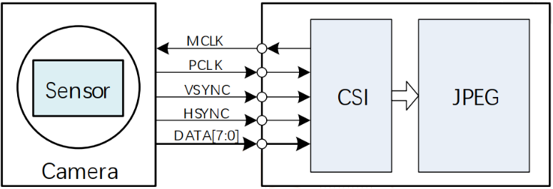
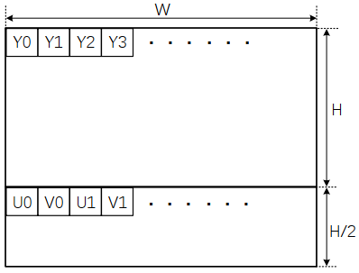
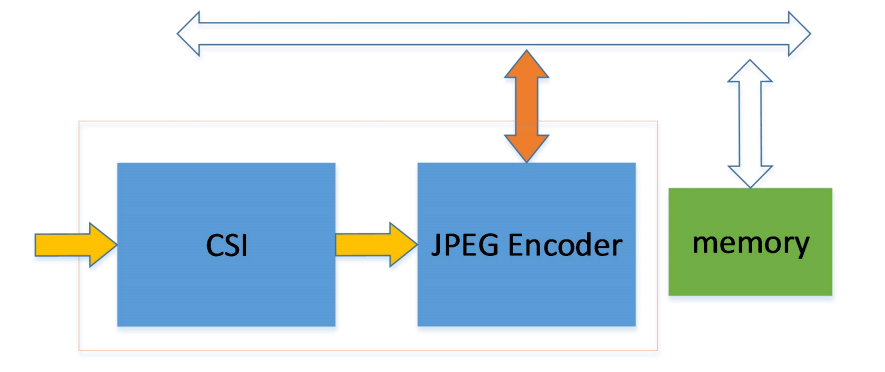
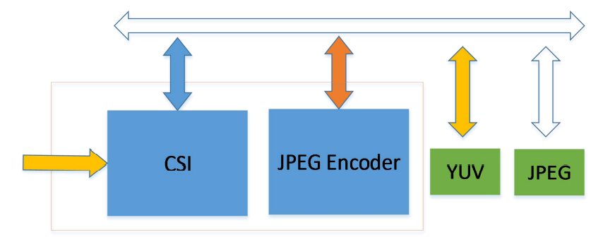

# 图像采集

## CSI（DVP） 图像采集

### SENSOR -> CSI 通路

CSI （CMOS sensor interface）接口时序上可支持独立 SYNC 和嵌入 SYNC(CCIR656)。支持接收 YUV422 或 YUV420 数据。



VSYNC 和HSYNC 的有效电平可以是正极性，也可以是负极性。在配置时，需要保证摄像头和 CSI 内部配置保持一致。

最常见的 YUV422 格式输入后，内部只能处理成 YUV420 格式，并输出到 memory 存以 NV12布局形式。



### CSI -> JPEG 通路

#### 编码格式

JPEG 模块只支持 YUV420 格式的编码，因此 CSI 捕获的数据输出给 JPEG 模块编码的图像格式必须是 YUV420。若 CSI 输入 JPEG 模块是 JPEG 码流，JPEG 模块也能正常将其输出。

#### 编码模式

JPEG 模块支持 online 及 offline 模式编码。

- online 模式即在线模式，CSI 每接收到 16 行数据就自动进行 JPEG 编码，当前帧图像接收完，编码也随即完成。该模式 CSI 不会将接收的原始图像数据保存起来，只输出 JPEG 编码后的数据。编码数据输出的方式又有：整帧模式和分块模式。
- offline 模式即离线模式，CSI 接收到的数据会先存到内存中，待一帧完整数据全部存储完成后，由软件启动 JPEG 编码。所以此时 JPEG 不是实时处理，可以对任何已经保存好的 YUV420 图像数据进行编码。

##### online 模式

Online 模式的通路框图如下图所示：



Sensor(摄像头) 输出 YUV422 格式数据到 CSI，CSI 接收到 YUV422 后处理成 YUV420 格式，每接收到 16 行数据后，硬件会自动启动 JPEG encoder 进行一次编码操作，编码输出的码流通过总线直接写到设定好的内存中，故可认为 Online 模式下图像的接收和编码是同时进行的。在一帧数据接收完并编码结束后，JPEG encoder 会产生 ve finish(编码完成) 中断。因此，对图像分辨率的要求是行列数为 16 的整数倍，支持的最小分辨率为 32*32。

Online 分块模式与整帧模式的区别在于，分块模式可以在 JPEG 编码输出数据量达到设定值 (例如 2KB/4KB) 后产生中断，并且可以在一帧编码过程中循环使用编码输出空间，例如只分配 8KB的编码输出空间，而一帧图像编码数据有 20KB，则在第一次写满 8KB 后，JPEG 将会从这 8KB的首地址开始存储，循环使用，故需要软件配合将之前的数据读走，否则之前的数据会被覆盖。

##### offline 模式

Offline 模式的通路框图如下图所示：



Offline 模式下，CSI 会将 YUV420 的原始图像数据存储到 YUV memory 中，存放格式为NV12。一帧图像全部存完后，产生写回中断 (wb finish)，然后由软件启动 JPEG 开始编码， JPEG 编码器会读取 YUV memory 中的原始数据送给 Encoder 进行编码，编码后的数据写到JPEG memory 中。

### 模块配置

#### menuconfig 配置说明

其 menuconfig 的配置如下（以选择GC0308 摄像头为例）：

```c
Drivers Options --->
    soc related device drivers --->
        CSI Devices --->
            [*] enable csi driver
            [*] enable csi camera driver
            [*] csi camera choice --->
                --- csi camera choice
                [*] csi camera GC0308
            [*] enable jpeg encoder
            [*] enable csi demo test command  // csi_jpeg模块测试用例Copy to clipboardErrorCopied
```

#### 板级配置说明

请根据硬件原理图，进行CSI 模块引脚配置。具体配置举例如下：

```ini
;‑‑‑‑‑‑‑‑‑‑‑‑‑‑‑‑‑‑‑‑‑‑‑‑‑‑‑‑‑‑‑‑‑‑‑‑‑‑‑‑‑‑‑‑‑‑‑‑‑‑‑‑‑‑‑‑‑‑‑‑‑‑‑‑‑‑‑‑‑‑‑‑‑‑‑‑‑‑‑‑
;vip (video input port) configuration
;vip_used: 0:disable 1:enable
;‑‑‑‑‑‑‑‑‑‑‑‑‑‑‑‑‑‑‑‑‑‑‑‑‑‑‑‑‑‑‑‑‑‑‑‑‑‑‑‑‑‑‑‑‑‑‑‑‑‑‑‑‑‑‑‑‑‑‑‑‑‑‑‑‑‑‑‑‑‑‑‑‑‑‑‑‑‑‑‑
[csi0]
vip_used = 1
vip_csi_hsync = port:PA18<7><0><3><default>
vip_csi_vsync = port:PA19<7><0><3><default>
vip_csi_pck = port:PA20<7><0><3><default>
vip_csi_mck = port:PA21<7><0><3><default>
vip_csi_d0 = port:PA22<8><0><3><default>
vip_csi_d1 = port:PA23<8><0><3><default>
vip_csi_d2 = port:PA27<8><0><3><default>
vip_csi_d3 = port:PA26<8><0><3><default>
vip_csi_d4 = port:PA29<8><0><3><default>
vip_csi_d5 = port:PA25<8><0><3><default>
vip_csi_d6 = port:PA24<8><0><3><default>
vip_csi_d7 = port:PA28<8><0><3><default>
vip_dev0_twi_id = 1
vip_dev0_reset = port:PA10<1><0><3><0>
vip_dev0_pwdn = port:PA11<1><0><3><0>
```

### 源码结构

驱动位于 `rtos-hal/hal/source/drivers/hal/source/csi`

```c
csi/
├── csi_camera/         ;csi driver
│   ├── csi.c
│   ├── csi.h
│   ├── csi_reg/
│   │   ├── csi_reg.c
│   │   └── csi_reg.h
│   └── sensor/         ;cmos sensor driver
│   ├── drv_gc0308.c
│   ├── sensor_helper.c
│   └── sensor_helper.h
├── hal_csi_jpeg.c      ;csi_jpeg模块驱动实现主体
├── jpeg/               ;jpeg driver
│   ├── hal_jpeg.c
│   ├── hal_jpeg.h
│   ├── jpegenc.c
│   ├── jpegenc.h
│   ├── jpeglib.c
│   ├── jpeglib.h
│   ├── jpeg_marker.h
│   └── jpeg_reg/
│   ├── jpeg_reg.c
│   └── jpeg_reg.h
└── utility
    ├── cj_board_cfg.h
    ├── cj_platform_cfg.h
    └── sensor/
        ├── camera_sensor.h
        └── drv_gc0308.h
```

### 接口使用说明

详细说明见 [SDK HAL 模块开发指南 - CSI  模块接口说明](https://yuzukihd.top/R128Module/#/sdk_module/csi?id=%e6%a8%a1%e5%9d%97%e6%8e%a5%e5%8f%a3%e8%af%b4%e6%98%8e)

### 常见问题

- 画面看起来像油画效果，过渡渐变的地方有一圈一圈
  - 一般是CSI 的data 线没有接好，或短路，或断路。
- 画面大体轮廓正常，颜色出现大片绿色和紫红色
  - 一般可能是CSI 采样到的yuyv 顺序出现错位。确认camera 输出的yuyv 顺序的设置与camera 的spec 是否一致。
  - 若camera 输出的yuyv 顺序没有问题，则可能是由于走线问题，导致pclk 采样data 时发生错位，此时可以调整pclk 的采样沿。具体做法如下：
  - 在对应的camara 驱动源码，如drv_gc0308.c 里面，找到宏定义#define CLK_POL。此宏定义可以有两个值MBUS_PCLK_SAMPLE_RISING 和MBUS_PCLK_SAMPLE_FALLING。若原来是其中一个值，则修改成另外一个值，便可将PCLK 的采样沿做反相。
- 画面大体轮廓正常，但出现不规则的绿色紫色条纹
  - 一般可能是pclk 驱动能力不足，导致某个时刻采样data 时发生错位。
  - 若 pclk 走线上有串联电阻，尝试将电阻阻值减小。
  - 增强 pclk 的驱动能力，需要设置camera 的内部寄存器。

## UVC (USB Video Class) 图像采集

FreeRTOS UVC 参考linux v4l2 框架，对接usb 驱动，实现对usb camera 的配置、使用。usb camera在FreeRTOS 应用端，与linux camera 应用类似，通过ioctl 操作进行分辨率配置、图像获取等操作。

### 模块配置

```
‑> Drivers Options
    ‑> soc related device drivers
        ‑> USB Drivers
            ‑> USB HOST
                [*]   Support usb host ehci0
                [*]   Support usb host ohci0
                [*]     UVC support
```

### 模块接口说明

当前支持的 ioctl 主要有：

| ioctl            | 参数结构                   | 描述                                       |
| ---------------- | -------------------------- | ------------------------------------------ |
| VIDIOC_QUERYCAP  | struct v4l2_capability     | 获取uvc driver 信息，实际使用可忽略该ioctl |
| VIDIOC_S_PARM    | struct v4l2_streamparm     | 设置帧率                                   |
| VIDIOC_S_FMT     | struct v4l2_format         | 设置分辨率                                 |
| VIDIOC_REQBUFS   | struct v4l2_requestbuffers | 申请接收buf                                |
| VIDIOC_QBUF      | struct v4l2_buffer         | 将buf 添加到驱动待使用                     |
| VIDIOC_DQBUF     | struct v4l2_buffer         | 从驱动获取填充了图像数据的buf              |
| VIDIOC_STREAMON  | enum v4l2_buf_type type    | 开始传输usb camera 数据                    |
| VIDIOC_STREAMOFF | enum v4l2_buf_type type    | 停止传输usb camera 数据                    |

#### VIDIOC_QUERYCAP

获取uvc driver 信息，可不调用。

```c
struct v4l2_capability cap; /* Query device capabilities */
/* Query device capabilities */
memset(&cap, 0, sizeof(cap));
if (ioctl(fd, VIDIOC_QUERYCAP, &cap) < 0) {
  printf(" Query device capabilities fail!!!\n");
} else {
  printf(" Querey device capabilities succeed\n");
  printf(" cap.driver=%s\n", cap.driver);
  printf(" cap.card=%s\n", cap.card);
  printf(" cap.bus_info=%s\n", cap.bus_info);
  printf(" cap.version=0x%08x\n", cap.version);
  printf(" cap.capabilities=0x%08x\n", cap.capabilities);
}
```

#### VIDIOC_S_PARM

usb camera 本身支持多帧率的，可以通过VIDIOC_S_PARM 配置输出的帧率。

```c
struct v4l2_streamparm parms; /* set streaming parameters */
/* set streaming parameters */
memset(&parms, 0, sizeof(struct v4l2_streamparm));
parms.type = V4L2_BUF_TYPE_VIDEO_CAPTURE;
parms.parm.capture.timeperframe.numerator = 1;
parms.parm.capture.timeperframe.denominator = 30; /* 通过denominator 配置帧率*/
if (ioctl(fd, VIDIOC_S_PARM, &parms) < 0) {
  printf(" Setting streaming parameters failed, numerator:%d denominator:%d\n",
         parms.parm.capture.timeperframe.numerator,
         parms.parm.capture.timeperframe.denominator);
  close(fd);
  return ‑1;
}
```

#### VIDIOC_S_FMT

配置分辨率和图像输出格式。

```c
struct v4l2_format fmt; /* setting format */
/* set the data format */
memset(&fmt, 0, sizeof(struct v4l2_format));
fmt.type = V4L2_BUF_TYPE_VIDEO_CAPTURE;
fmt.fmt.pix.width = 1920;                     /* 分辨率的宽*/
fmt.fmt.pix.height = 1080;                    /* 分辨率的高*/
fmt.fmt.pix.pixelformat = V4L2_PIX_FMT_MJPEG; /* 输出格式*/
fmt.fmt.pix.field = V4L2_FIELD_INTERLACED;
if (ioctl(fd, VIDIOC_S_FMT, &fmt) < 0) {
  printf(" setting the data format failed!\n");
  close(fd);
  return ‑1;
}
```

#### VIDIOC_REQBUFS

底层需要有buf 接收usb camera 传输过来的数据，通过VIDIOC_REQBUFS 可以指定申请多少个buf 给驱动使用。

```c
struct v4l2_requestbuffers req; /* Initiate Memory Mapping or User Pointer I/O */
/* Initiate Memory Mapping or User Pointer I/O */
memset(&req, 0, sizeof(struct v4l2_requestbuffers));
req.count = 3; /* 申请的buf个数，该数值需要大于或等于3，当count 为0时则是释放buf */
req.type = V4L2_BUF_TYPE_VIDEO_CAPTURE;
req.memory = V4L2_MEMORY_MMAP;
if (ioctl(fd, VIDIOC_REQBUFS, &req) < 0) {
  printf(" VIDIOC_REQBUFS failed\n");
  close(fd);
  return ‑1;
}
```

#### VIDIOC_QBUF

uvc 驱动需要知道当前有多少个空闲buf 可以使用，需要通过VIDIOC_QBUF 将空闲buf 添加给驱动使用。

```c
struct v4l2_buffer buf; /* Query the status of a buffer */
memset(&buf, 0, sizeof(struct v4l2_buffer));
buf.index = n_buffers;
/* uvc驱动通过buf.index 获取得到相应的buf 信息，所以index */
/* 不能超过VIDIOC_REQBUFS 申请的 buf数量，同时，VIDIOC_REQBUFS 申请得到buf */
/* 之后应通过QBUF 添加到uvc 驱动。当VIDIOC_DQBUF 得到buf 使用 */
/* 完之后也应该进行VIDIOC_QBUF。*/
if (ioctl(fd, VIDIOC_QBUF, &buf) == ‑1) {
  printf(" VIDIOC_QBUF error\n");
  close(fd);
  return ‑1;
}
```

#### VIDIOC_DQBUF

获取uvc 驱动已经填充好图像数据的buf，该操作在uvc 驱动没有填充完成的buf 时会阻塞。

```c
struct v4l2_buffer buf; /* Query the status of a buffer */
memset(&buf, 0, sizeof(struct v4l2_buffer));
if (ioctl(fd, VIDIOC_DQBUF, &buf) == ‑1) {
  printf(" VIDIOC_DQBUF error\n");
  close(fd);
  return ‑1;
}
```

在VIDIOC_DQBUF 操作成功返回之后， buf.mem_buf 指向的是保存图像数据的内存位置，而buf.length 则是图像数据的有效长度。

#### VIDIOC_STREAMON

在完成配置之后，通过VIDIOC_STREAMON 使能usb camera 输出图像数据。

```c
enum v4l2_buf_type type;
/* streamon */
type = V4L2_BUF_TYPE_VIDEO_CAPTURE;
if (ioctl(fd, VIDIOC_STREAMON, &type) == ‑1) {
  printf(" VIDIOC_STREAMON error! %s\n", strerror(errno));
} else {
  printf(" stream on succeed\n");
}
```

#### VIDIOC_STREAMOFF

在完成配置之后，通过VIDIOC_STREAMON 使能usb camera 输出图像数据。

```c
enum v4l2_buf_type type;
/* streamon */
type = V4L2_BUF_TYPE_VIDEO_CAPTURE;
if (ioctl(fd, VIDIOC_STREAMOFF, &type) == ‑1) {
  printf(" VIDIOC_STREAMOFF error! %s\n", strerror(errno));
} else
  printf(" stream off succeed\n");
```

### 接口使用流程

FreeRTOS uvc 应用流程需要先设置帧率、分辨率、格式等参数，然后申请buf，将buf 提供给驱动，然后开启传输。关闭传输之后，需要释放buf 再释放相应的句柄。

```c
fd = open(/dev/video, xxx)
ioctl(fd, VIDIOC_QUERYCAP, xxx)
ioctl(fd, VIDIOC_S_PARM, xxx) //设置帧率
ioctl(fd, VIDIOC_S_FMT, xxx) //设置分辨率和格式
ioctl(fd, VIDIOC_REQBUFS, xxx) //申请buf，count >= 3
for(; < count; )
	ioctl(fd, VIDIOC_QBUF, xxx) //将buf都提供给uvc驱动
ioctl(fd, VIDIOC_STREAMON, xxx) //开启流传输
while
ioctl(fd, VIDIOC_DQBUF, xxx) //获取填充好的buf数据
app use buf...
ioctl(fd, VIDIOC_QBUF, xxx) //buf使用完之后还给uvc驱动
ioctl(fd, VIDIOC_STREAMOFF, xxx) //停止流传输
ioctl(fd, VIDIOC_REQBUFS, xxx) //释放buf，count = 0
close(fd) //释放句柄
```

FreeRTOS 目前仅支持单摄接收。

### 模块使用范例

前提条件：机器接上电源，并且机器的USB接口通过OTG线连接上USB摄像头

```c
#include <fcntl.h>
#include <sys/ioctl.h>

#include "usb_test.h"
#include "uvcvideo.h"

extern int msleep(unsigned int msecs);

static void *uvc_thread = NULL;
static void *file_thread = NULL;
static hal_mailbox_t uvc_mailbox = NULL;

static int save_frame_to_file(void *str, void *start, int length) {
  FILE *fp = NULL;

  fp = fopen(str, "wb+"); // save more frames
  if (!fp) {
    printf(" Open %s error\n", (char *)str);

    return -1;
  }

  if (fwrite(start, length, 1, fp)) {
    fclose(fp);

    return 0;
  } else {
    printf(" Write file fail (%s)\n", strerror(errno));
    fclose(fp);

    return -1;
  }

  return 0;
}

void usb_uvc_file_thread(void *para) {
  char source_data_path[64];
  unsigned int value = 0;
  struct v4l2_buffer *mailbuf;
  int np = 0;
  while (1) {
    hal_mailbox_recv(uvc_mailbox, &value, -1);
    if (value != 0) {
      mailbuf = (struct v4l2_buffer *)(uintptr_t)value;
      printf("np = %d\n", np);
      sprintf(source_data_path, "/data/source_frame_%d.jpg", np++);
      save_frame_to_file(source_data_path,
                         (uint32_t *)((int64_t)mailbuf->mem_buf),
                         mailbuf->length);
      free((void *)((int64_t)mailbuf->mem_buf));
      free(mailbuf);
      mailbuf = NULL;
      value = 0;
    }
  }
}

void usb_uvc_test_thread(void *para) {
  int fd;
  struct v4l2_capability cap;   /* Query device capabilities */
  struct v4l2_streamparm parms; /* set streaming parameters */
  struct v4l2_format fmt;       /* try a format */
  struct v4l2_requestbuffers
      req;                /* Initiate Memory Mapping or User Pointer I/O */
  struct v4l2_buffer buf; /* Query the status of a buffer */
  struct v4l2_buffer *mailbuf = NULL;
  enum v4l2_buf_type type;
  int n_buffers;
  int np;

  /* 1.open /dev/videoX node */
  fd = open("/dev/video", O_RDWR);

  /* 2.Query device capabilities */
  memset(&cap, 0, sizeof(cap));
  if (ioctl(fd, VIDIOC_QUERYCAP, &cap) < 0) {
    printf(" Query device capabilities fail!!!\n");
  } else {
    printf(" Querey device capabilities succeed\n");
    printf(" cap.driver=%s\n", cap.driver);
    printf(" cap.card=%s\n", cap.card);
    printf(" cap.bus_info=%s\n", cap.bus_info);
    printf(" cap.version=0x%08x\n", cap.version);
    printf(" cap.capabilities=0x%08x\n", cap.capabilities);
  }

  /* 7.set streaming parameters */
  memset(&parms, 0, sizeof(struct v4l2_streamparm));
  parms.type = V4L2_BUF_TYPE_VIDEO_CAPTURE;
  parms.parm.capture.timeperframe.numerator = 1;
  parms.parm.capture.timeperframe.denominator = 30;
  if (ioctl(fd, VIDIOC_S_PARM, &parms) < 0) {
    printf(
        " Setting streaming parameters failed, numerator:%d denominator:%d\n",
        parms.parm.capture.timeperframe.numerator,
        parms.parm.capture.timeperframe.denominator);
    close(fd);
    return;
  }

  /* 9.set the data format */
  memset(&fmt, 0, sizeof(struct v4l2_format));
  fmt.type = V4L2_BUF_TYPE_VIDEO_CAPTURE;
  fmt.fmt.pix.field = V4L2_FIELD_INTERLACED;

  fmt.fmt.pix.width = 320;
  fmt.fmt.pix.height = 240;
  fmt.fmt.pix.pixelformat = V4L2_PIX_FMT_MJPEG;

  if (ioctl(fd, VIDIOC_S_FMT, &fmt) < 0) {
    printf(" setting the data format failed!\n");
    close(fd);
    return;
  }

  /* 10.Initiate Memory Mapping or User Pointer I/O */
  memset(&req, 0, sizeof(struct v4l2_requestbuffers));
  req.count = 5;
  req.type = V4L2_BUF_TYPE_VIDEO_CAPTURE;
  req.memory = V4L2_MEMORY_MMAP;
  if (ioctl(fd, VIDIOC_REQBUFS, &req) < 0) {
    printf(" VIDIOC_REQBUFS failed\n");
    close(fd);
    return;
  }

  /* 11.Exchange a buffer with the driver */
  for (n_buffers = 0; n_buffers < req.count; n_buffers++) {
    memset(&buf, 0, sizeof(struct v4l2_buffer));

    buf.index = n_buffers;
    if (ioctl(fd, VIDIOC_QBUF, &buf) == -1) {
      printf(" VIDIOC_QBUF error\n");

      close(fd);
      return;
    }
  }

  /* streamon */
  type = V4L2_BUF_TYPE_VIDEO_CAPTURE;
  if (ioctl(fd, VIDIOC_STREAMON, &type) == -1) {
    printf(" VIDIOC_STREAMON error! %s\n", strerror(errno));
  } else
    printf(" stream on succeed\n");

  np = 0;
  while (1) {
    printf(" camera capture num is [%d]\n", np);

    /* wait uvc frame */
    memset(&buf, 0, sizeof(struct v4l2_buffer));

    if (ioctl(fd, VIDIOC_DQBUF, &buf) == -1) {
      printf(" VIDIOC_DQBUF error\n");

      goto EXIT;
    } else {
      // printf("*****DQBUF[%d] FINISH*****\n", buf.index);
    }
    mailbuf = malloc(sizeof(struct v4l2_buffer));
    mailbuf->mem_buf = (uint32_t)(uintptr_t)malloc(buf.length);
    if (mailbuf->mem_buf != 0) {
      memcpy((uint32_t *)((uint64_t)mailbuf->mem_buf),
             (uint32_t *)((uint64_t)buf.mem_buf), buf.length);
      mailbuf->length = buf.length;
      if (hal_mailbox_send_wait(uvc_mailbox, (uint32_t)(uintptr_t)mailbuf,
                                100) < 0) {
        printf("uvc data send failed, data lost\n");
      }
    }
    if (ioctl(fd, VIDIOC_QBUF, &buf) == -1) {
      printf(" VIDIOC_QBUF error\n");

      goto EXIT;
    } else {
      printf("************QBUF[%d] FINISH**************\n\n", buf.index);
    }

    np++;
  }

  printf("\n\n Capture thread finish\n");

EXIT:
  type = V4L2_BUF_TYPE_VIDEO_CAPTURE;
  ioctl(fd, VIDIOC_STREAMOFF, &type);

  memset(&req, 0, sizeof(struct v4l2_requestbuffers));
  req.count = 0;
  req.type = V4L2_BUF_TYPE_VIDEO_CAPTURE;
  req.memory = V4L2_MEMORY_MMAP;
  ioctl(fd, VIDIOC_REQBUFS, &req);

  close(fd);
  while (hal_is_queue_empty(uvc_mailbox) != 1) {
    msleep(100);
  }
  printf("close.......\n");
  hal_mailbox_delete(uvc_mailbox);
  hal_thread_stop(file_thread);
  hal_thread_stop(uvc_thread);
}

int usb_test_cmd_uvc(int argc, const char **argv) {
  uvc_mailbox = hal_mailbox_create("ucv_queue", 320);
  if (uvc_mailbox == NULL) {
    printf("mailbox create failed\n");
    goto fail_exit1;
  }
  printf("uvc_mailbox create sucess!\n");
  // usb thread is HAL_THREAD_PRIORITY_SYS,must be lower than
  // HAL_THREAD_PRIORITY_SYS
  uvc_thread = hal_thread_create(usb_uvc_test_thread, NULL, "uvc_thread",
                                 4 * 1024, (HAL_THREAD_PRIORITY_APP + 1));
  if (uvc_thread == NULL) {
    printf("usb_uvc_test_thread create failed\n");
    goto fail_exit2;
  }
  hal_thread_start(uvc_thread);

  file_thread = hal_thread_create(usb_uvc_file_thread, NULL, "uvc_file_thread",
                                  2 * 1024, (HAL_THREAD_PRIORITY_APP));
  if (file_thread == NULL) {
    printf("uvc file thread create failed\n");
    goto fail_exit3;
  }
  hal_thread_start(file_thread);

  return 0;
fail_exit3:
  hal_thread_stop(uvc_thread);
fail_exit2:
  hal_mailbox_delete(uvc_mailbox);
fail_exit1:
  return -1;
}
```

测试命令：`usb uvc_test`

测试结果：在小机端/data/目录下生成图像文件（source_frame_X.jpg）