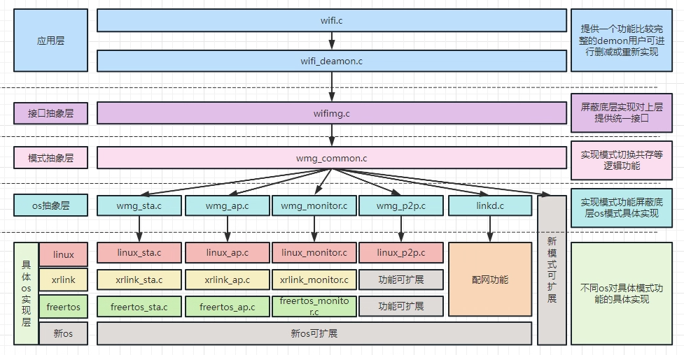
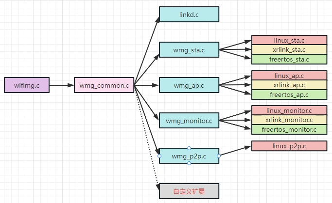

# Wi-Fi - Wi-Fi Manager

## Wi-Fi 简介

FreeRTOS 上的网络，驱动部分源码没有开源，用户实际使用时也无需关系具体实现，更多的是做网络管理的逻辑接口开发，所以我们提供了网络中间件 `Wi-Fi Manager`，`Wi-Fi Manager` 支持`sta`, `ap`, `monitor` 等多种网络工作模式的管理，本文档重点介绍 `Wi-Fi Manager` 中间件的使用，配置，框架，接口。

### Wi‑Fi 工作的几种模式

目前R128 平台上的Wi‑Fi 一般可处于3 种工作模式，分别是STATION，AP，MONITOR。

- STATION：连接无线网络的终端，大部分无线网卡默认都处于该模式，也是常用的一种模式。 
- AP：无线接入点，常称热点，比如路由器功能。
- MONITOR：也称为混杂设备监听模式，所有数据包无过滤传输到主机。

### 代码路径

FreeRTOS 中wlan 相关代码主要分布在四个地方：

```
1）驱动部分：lichee/rtos/drivers/drv/wireless/xradio
2）协议栈部分：lichee/rtos‑components/thirdparty/network/lwip‑2.1.2
3）应用协议部分：lichee/rtos‑components/aw/network/service
4）中间件部分：lichee/rtos‑components/aw/wireless/Wi-Fi Manager
```

### 配置介绍

FreeRTOS 中 wlan 相关配置分为 c906 和 m33：

#### C906 配置

1. Wi-Fi Manager demo 配置

```
> System components > aw components > wireless
[*] wireless common
[*] Wi-Fi Manager‑v2.0 ‑‑‑>
    Wi-Fi Manager‑v2.0 Configuration ‑‑‑>
    [ ] CONFIG_WMG_PROTOCOL_SOFTAP
    [ ] CONFIG_WMG_PROTOCOL_BLE
    [ ] CONFIG_WMG_PROTOCOL_XCONFIG
    [ ] CONFIG_WMG_PROTOCOL_SOUNDWAVE
    	Wi-Fi Manager support platform (FREERTOS PLATFORM OS) ‑‑‑>
            (X) FREERTOS PLATFORM OS
        [*] Wi-Fi Manager unregister callback function
        [*] Wi-Fi Manager support send expand cmd
            Wi-Fi Manager support mode Configuration ‑‑‑>
                [*] Wi-Fi Manager support sta mode enable
                [*] Wi-Fi Manager support ap mode enable
                [ ] Wi-Fi Manager support monitor mode enable
                [ ] Wi-Fi Manager support p2p mode enable
                Wi-Fi Manager set default debug level (default debug level: to info) ‑‑‑>
                    (X) default debug level: to info
```

2. driver 配置

```
> Drivers Options > other drivers
	[*] rfkill drivers

> Drivers Options > other drivers > wireless devices
  	[*] XRADIO driver ‑‑‑>
    [*] Enable xradio test cmd
    	Xradio chip (Enable r128 driver) ‑‑‑>
    [*] Wi‑Fi Certification of WFA
    [*] wlan station mode
    [ ] wlan station mode with wps support
    [*] wlan monitor mode
    [*] wlan ap mode
    	select the source of frequency offset (SDD file) ‑‑‑>
    [ ] wlan ETF test
```

3. 应用协议配置

```
> System components > aw components > aw network
    [*] tcp ip adapter
    [ ] loop interface test demo
    [ ] wifi test demo
    [ ] wifi fast connect test demo
    [ ] get mac_addr test demo
    [ ] set/get country code optional
    service ‑‑‑>
        [ ] udhcpd demo
        [ ] sntp demo
        [*] iperf demo
        [*] ping demo
        [ ] nopoll demo
        [ ] mqtt demo
        [ ] shttpd demo
        [ ] mbedtls demo
        [ ] httpc demo
        [ ] mini_wget
        [ ] telnet
```

4. AMP 网络配置

```
> System components > aw components > AMP Components Support
    [*] AMP Network Stub Functions
    [*] AMP Network Service
```

5. 协议配置

```
> System components > thirdparty components > network
    ‑*‑ lwip ‑‑‑>
    	lwip version (lwip‑2.1.2) ‑‑‑>
    ‑*‑ udhcpd (DHCP Server)
    [*] ping
    ‑*‑ mbedtls ‑‑‑>
    	mbedtls version (mbedtls‑2.16.0) ‑‑‑>
    [ ] httpclient
    [ ] websocket
    [ ] nghttp2
    [ ] sntp
    [ ] nopoll
    [ ] shttpd
    [ ] mqtt
```

#### M33 配置

1. driver 配置

```
> Drivers Options > other drivers
	[*] rfkill drivers

> Drivers Options > other drivers > wireless devices
  	[*] XRADIO driver ‑‑‑>
    [*] Enable xradio test cmd
    	Xradio chip (Enable r128 driver) ‑‑‑>
    [*] Wi‑Fi Certification of WFA
    [*] wlan station mode
    [ ] wlan station mode with wps support
    [*] wlan monitor mode
    [*] wlan ap mode
    	select the source of frequency offset (SDD file) ‑‑‑>
    [ ] wlan ETF test
```

2. AMP 网络配置

```
> System components > aw components > AMP Components Support
    [*] AMP Network Stub Functions
    [*] AMP Network Service
```

3. 协议配置

```
> System components > thirdparty components > network
    [ ] lwip ‑‑‑‑
    [ ] udhcpd (DHCP Server)
    [ ] ping
    ‑*‑ mbedtls ‑‑‑>
    	mbedtls version (mbedtls‑2.16.0) ‑‑‑>
    [ ] httpclient
    [ ] nghttp2
    [ ] sntp
    [ ] nopoll
    [ ] shttpd
    [ ] mqtt
```

## Wi-Fi Manager 简介

Wi-Fi Manager 用于wifi 的连接管理，通信以及wifi 的一些额外功能。支持sta、ap、monitor、p2p 模式，并且集成了配网模式以及其他功能。屏蔽了底层系统的具体实现，能对接各种差异化系统平台例如 linux，rtos，xrlink(linux 系统mcu 模组)。用户如果需要进行独自的2 次开发(把对应的wifi 功能集成到各自的应用里)，请重点查阅 Wi-Fi Manager 框架，Wi-Fi Manager 代码目录结构，核心层代码章节。用户如果不需要独自的2 次开发，可以直接使用 Wi-Fi Manager 提供的命令行demo，仅需查看Wi-Fi Manager demo 介绍章节。

### Wi-Fi Manager 框架



Wi-Fi Manager: 兼容linux，xrlink，freertos 等系统。支持sta，ap，monitor 和p2p 等模式，集成了softap，ble，xconfig，soundwave 等配网功能。提供了完善的api 接口方便用户调用，同时提供了一个基本完整功能的demo，方便用户直接使用和测试。上图是Wi-Fi Manager 的软件结构，整体分为3 部分：应用层，lib 层(接口抽象层，模式抽象层，os 抽象层)，os 具体实现层。

- 应用层：主要提供一个基本完整功能的demo，方便用户直接使用，用户也可以不使用该 demo，直接调用lib 库提供的api 接口。把具体功能集成到自己的应用。
- lib 层：包含了接口层，模式抽象层，os 抽象层，对上提供统一的api 接口(wifimg.h)，处理各种模式的逻辑以及共存功能，对下屏蔽os 的具体模式功能。
- 具体 os 实现层：该层主要是不同系统对 wifi 功能的具体功能。

### Wi-Fi Manager 代码目录结构

wifimager 开发包在FreeRTOS SDK 里的路径如下：

```
rtos/lichee/rtos‑components/aw/wireless/Wi-Fi Manager
```

Wi-Fi Manager 的主要目录结构如下：

```
├── app                   // 用于保存配网时使用的一些配网工具。
├── core                  // 核心代码
│ ├── include             // 存放核心代码相关头文件
│ │ └── wifimg.h          // 对上提供的api接口头文件
│ └── src                 // 核心代码具体实现
│ ├── linkd.c             // 配网抽象层代码
│ ├── wifimg.c            // 对上提供的api接口实现代码
│ ├── wmg_common.c        // 模式切换共存逻辑处理层实现代码
│ ├── wmg_sta.c           // sta模式抽象层代码
│ ├── wmg_ap.c            // ap模式抽象层代码
│ ├── wmg_monitor.c       // monitor模式抽象层代码
│ ├── wmg_p2p.c           // p2p模式抽象层代码
│ ├── expand_cmd.c        // 扩展命令(与模组或系统特殊功能有关，例如获取或设置mac地址，设置特殊模组的ioct等)
│ └── os                  // 具体os(linux,xrlink,freertos)模式功能实现代码
├── demo                  // 比较完整功能的demo实例
│ ├── wifi.c
│ └── wifi_daemon.c
├── files                 // 相关的配置文件
```

- app 目录：存放用于配网测试的apk 安装包。
- core 目录：存放Wi-Fi Manager 核心代码的目录，会编译出libwifimg‑v2.0 库
- demo 目录：存放一个使用libwifimg‑v2.0 接口的demo，用户可以直接使用该demo，也可以
  参考该demo 对libwifimg‑v2.0 库api 的使用方式，把功能集成到自己的应用中去。
- files：存放相关的配置文件

## Wi-Fi Manager 核心代码

### Wi-Fi Manager 核心代码目录结构

```
.
├── include
│ ├── linkd.h
│ ├── os
│ ├── wifi_log.h
│ ├── wifimg.h
│ ├── wmg_ap.h
│ ├── wmg_common.h
│ ├── wmg_monitor.h
│ ├── wmg_p2p.h
│ ├── expand_cmd.h
│ └── wmg_sta.h
└── src
├── linkd.c
├── log
├── os
│ ├── linux      // (在非linux系统该目录不存在)
│ ├── xrlink     // (在非xrlink系统该目录不存在)
│ └── freertos   // (在非freertos系统该目录不存在)
├── wifimg.c
├── wmg_ap.c
├── wmg_common.c
├── wmg_monitor.c
├── wmg_p2p.c
├── expand_cmd.c
└── wmg_sta.c
```

- include: 保存核心代码相关头文件目录
- src : 保存核心代码源码文件目录
- src/log：打印相关代码
- src/wifimg.c : 用户接口对接口层文件（提供用户对接层API 接口文件，对接api 请查看
wifimg.h）
- src/wmg_common.c：wifi 模式抽象层（各种模式的抽象层，处理切换和共存逻辑）
- src/wmg_sta.c：station 模式抽象层
- src/wmg_ap.c：ap 模式抽象层
- src/wmg_monitor.c: monitor 模式抽象层。
- src/expand_cmd.c：特殊额外功能抽象层。
- src/os : 对应的系统模式实现层代码。
- src/os/linux：linux 平台wifi 模式功能具体实现代码存放目录(在非linux 系统该目录不存在)
- src/os/xrlink：xrlink 平台wifi 模式功能具体实现代码存放目录(在非xrlink 系统该目录不存在)
- src/os/freertos：freertos 平台wifi 模式功能具体实现代码存放目录(在非freertos 系统该目录不存在)

核心代码里各文件调用关系图如下：



1. 用户会调用wifimg.c 提供的接口函数
2. wifimg.c 的接口函数会调用到模式抽象层wmg_common.c 里的函数
3. wmg_common.c 里的函数会根据不同的模式调用到wmg_sta.c(sta 模式抽象层)，wmg_ap.c(ap 模式抽象层)wmg_monitor.c(monitor 模式抽象层)wmg_p2p.c(p2p 模式抽象层) 里的函数
4. wmg_sta.c(sta 模式抽象层) 会根据不同的平台调用到linux_sta.c(linux 平台具体实现文件)，xrlink_sta.c(xrlink 平台具体实现文件)，freertos_sta.c(rtos 平台具体实现文件)。
5. wmg_ap.c(ap 模式抽象层) 会根据不同的平台调用到freertos_ap.c(linux 平台具体实现文件)，xrlink_ap.c(xrlink 平台具体实现文件)，freertos_ap.c(rtos 平台具体实现文件)。
6. wmg_monitor.c(monitor 模式抽象层) 会根据不同的平台调用到linux_monitor.c(linux 平台具体实现文件)，xrlink_monitor.c(xrlink 平台具体实现文件)，freertos_monitor.c(rtos 平台具体实现文件)。
7. wmg_p2p.c(p2p 模式抽象层) 会根据不同的平台调用到linux_p2p.c(linux 平台具体实现文件)。
8. 自定义扩展(expand_cmd.c) 与系统或模组特殊功能有关，例如设置或获取mac 地址，特殊ioct等功能。

## Wi-Fi Manager 核心代码关键结构体说明

该章节主要用于描述核心代码中使用到的一些关键的结构体。不需要单独阅读该章节，该章节属于查询性质，当在其他章节中查看到需要查询的结构体时再查询该章节即可。该章节的关键结构体都在 `Wi-Fi Manager/core/include/wifimg.h` 文件里定义。

### 定义Wi-Fi Manager 的错误码

结构体描述：该结构体主要用于定义Wi-Fi Manager 各函数执行后的返回码

```c
typedef enum {
    WMG_STATUS_SUCCESS = 0,
    WMG_STATUS_FAIL = ‑1,
    WMG_STATUS_NOT_READY = ‑2,
    WMG_STATUS_NOMEM = ‑3,
    WMG_STATUS_BUSY = ‑4,
    WMG_STATUS_UNSUPPORTED = ‑5,
    WMG_STATUS_INVALID = ‑6,
    WMG_STATUS_TIMEOUT = ‑7,
    WMG_STATUS_UNHANDLED = ‑8,
} wmg_status_t;
```

- WMG_STATUS_SUCCESS：函数执行成功
- WMG_STATUS_FAIL：函数执行失败
- WMG_STATUS_NOT_READY：函数没有准备好
- WMG_STATUS_NOMEM：函数无法申请到需要的内存
- WMG_STATUS_BUSY：函数处于忙状态
- WMG_STATUS_UNSUPPORTED：函数不支持该功能
- WMG_STATUS_INVALID：函数收到无效数据
- WMG_STATUS_TIMEOUT：函数执行超时
- WMG_STATUS_UNHANDLED：函数不处理该次调用

### 定义Wi-Fi Manager 支持的模式
结构体描述：该结构体主要用于定义Wi-Fi Manager 的模式

```c
typedef enum {
    WIFI_MODE_UNKNOWN = 0b0,
    WIFI_STATION = 0b1,
    WIFI_AP = 0b10,
    WIFI_MONITOR = 0b100,
    WIFI_P2P = 0b1000,
} wifi_mode_t;
```

- WIFI_STATION：station 模式
- WIFI_AP：ap 模式
- WIFI_MONITOR：monitor 模式
- WIFI_P2P：p2p 模式
- WIFI_MODE_UNKNOWN：未定义模式

### 定义Wi-Fi Manager 网络接口状态

结构体描述：该结构体主要用于定义Wi-Fi Manager 对网卡设备状态的识别

```c
typedef enum {
    WLAN_STATUS_DOWN,
    WLAN_STATUS_UP,
} wifi_dev_status_t;
```

- WLAN_STATUS_DOWN：网卡设备关闭
- WLAN_STATUS_UP：网卡设备启动

### 定义Wi-Fi Manager 收到的消息类型

结构体描述：该结构体主要用于定义Wi-Fi Manager 收到的回调消息的类型

```c
typedef enum {
    WIFI_MSG_ID_DEV_STATUS,
    WIFI_MSG_ID_STA_CN_EVENT,
    WIFI_MSG_ID_STA_STATE_CHANGE,
    WIFI_MSG_ID_AP_CN_EVENT,
    WIFI_MSG_ID_P2P_CN_EVENT,
    WIFI_MSG_ID_P2P_STATE_CHANGE,
    WIFI_MSG_ID_MONITOR,
    WIFI_MSG_ID_MAX,
} wifi_msg_id_t;
```

- WIFI_MSG_ID_DEV_STATUS：设备状态发生了改变的消息
- WIFI_MSG_ID_STA_CN_EVENT：sta 模式在连接过程中事件发生改变的消息
- WIFI_MSG_ID_STA_STATE_CHANGE：sta 模式状态发生改变的消息
- WIFI_MSG_ID_AP_CN_EVENT：ap 模式在连接过程中事件发生改变的消息
- WIFI_MSG_ID_P2P_CN_EVENT：p2p 模式在连接过程中事件发生改变的消息
- WIFI_MSG_ID_P2P_STATE_CHANGE：p2p 模式状态发生改变的消息
- WIFI_MSG_ID_MONITOR：monitor 模式的消息
- WIFI_MSG_ID_MAX：无意义消息类型，界限结构体用

### 定义Wi-Fi Manager 的加密方式

结构体描述：该结构体主要用于定义Wi-Fi Manager 的加密方式

```c
typedef enum {
    WIFI_SEC_NONE,
    WIFI_SEC_WEP,
    WIFI_SEC_WPA_PSK,
    WIFI_SEC_WPA2_PSK,
    WIFI_SEC_WPA3_PSK,
} wifi_secure_t;
```

- WIFI_SEC_NONE：没有加密
- WIFI_SEC_WEP：wep 加密方式
- WIFI_SEC_WPA_PSK：wpa 加密方式
- WIFI_SEC_WPA2_PSK：wpa2 加密方式
- WIFI_SEC_WPA3_PSK：wpa3 加密方式

### 定义Wi-Fi Manager station 模式的状态

结构体描述：该结构体主要用于定义Wi-Fi Manager 的station 模式状态

```c
typedef enum {
    WIFI_STA_IDLE,
    WIFI_STA_CONNECTING,
    WIFI_STA_CONNECTED,
    WIFI_STA_OBTAINING_IP,
    WIFI_STA_NET_CONNECTED,
    WIFI_STA_DHCP_TIMEOUT,
    WIFI_STA_DISCONNECTING,
    WIFI_STA_DISCONNECTED,
} wifi_sta_state_t;
```

- WIFI_STA_IDLE：station 模式处于空闲状态
- WIFI_STA_CONNECTING：station 模式处于正在连接ap 状态
- WIFI_STA_CONNECTED：station 模式处于已连接上ap 状态
- WIFI_STA_OBTAINING_IP：station 模式处于正在获取IP 状态
- WIFI_STA_NET_CONNECTED：station 模式处于网络连接已完成状态
- WIFI_STA_DHCP_TIMEOUT：station 模式处于DHCP 超时状态
- WIFI_STA_DISCONNECTING：station 模式处于正在取消连接状态
- WIFI_STA_DISCONNECTED：station 模式处于已取消连接状态

### 定义Wi-Fi Manager station 模式在连接过程中的事件

结构体描述：该结构体主要用于定义Wi-Fi Manager 的station 模式在连接ap 过程中的事件

```
typedef enum {
    WIFI_DISCONNECTED,
    WIFI_SCAN_STARTED,
    WIFI_SCAN_FAILED,
    WIFI_SCAN_RESULTS,
    WIFI_NETWORK_NOT_FOUND,
    WIFI_PASSWORD_INCORRECT,
    WIFI_AUTHENTIACATION,
    WIFI_AUTH_REJECT,
    WIFI_ASSOCIATING,
    WIFI_ASSOC_REJECT,
    WIFI_ASSOCIATED,
    WIFI_4WAY_HANDSHAKE,
    WIFI_GROUNP_HANDSHAKE,
    WIFI_GROUNP_HANDSHAKE_DONE,
    WIFI_CONNECTED,
    WIFI_CONNECT_TIMEOUT,
    WIFI_DEAUTH,
    WIFI_DHCP_START,
    WIFI_DHCP_TIMEOUT,
    WIFI_DHCP_SUCCESS,
    WIFI_TERMINATING,
    WIFI_UNKNOWN,
} wifi_sta_event_t;
```

- WIFI_DISCONNECTED：已取消连接
- WIFI_SCAN_STARTED：扫描开始
- WIFI_SCAN_FAILED：扫描失败
- WIFI_SCAN_RESULTS：获取到扫描结果
- WIFI_NETWORK_NOT_FOUND：没有找到对应的network
- WIFI_PASSWORD_INCORRECT：密码不正确
- WIFI_AUTHENTIACATION：认证
- WIFI_AUTH_REJECT：认证被拒绝
- WIFI_ASSOCIATING：关联
- WIFI_ASSOC_REJECT：关联被拒绝
- WIFI_ASSOCIATED：关联完成
- WIFI_4WAY_HANDSHAKE：4 次握手
- WIFI_GROUNP_HANDSHAKE：交换组密钥
- WIFI_GROUNP_HANDSHAKE_DONE：交换组密钥完成
- WIFI_CONNECTED：连接完成
- WIFI_CONNECT_TIMEOUT：连接超时
- WIFI_DEAUTH：取消认证
- WIFI_DHCP_START：DHCP 开始
- WIFI_DHCP_TIMEOUT：DHCP 超时
- WIFI_DHCP_SUCCESS：DHCP 成功
- WIFI_TERMINATING：终止
- WIFI_UNKNOWN：未知

### 定义 Wi-Fi Manager station 模式的一些信息

结构体描述：该结构体主要用于定义Wi-Fi Manager 的station 模式的一些信息

```
typedef struct {
    int id;
    int freq;
    int rssi;
    uint8_t bssid[6];
    char ssid[SSID_MAX_LEN + 1];
    uint8_t mac_addr[6];
    uint8_t ip_addr[4];
    uint8_t gw_addr[4];
    wifi_secure_t sec;
} wifi_sta_info_t;
```

- id：wpa_supplicant 里保存的network id 号
- freq：频率(指的是信道频率，2412 = channel 1)
- rssi：信号强度
- bssid[6]：连接的ap 的bssid
- ssid[SSID_MAX_LEN]：连接的ap 的ssid
- mac_addr[6]：本地mac 地址
- ip_addr[4]：本地ip 地址
- gw_addr[4]：网关地址
- sec：加密方式

### 定义Wi-Fi Manager station 模式保存的ap 信息

结构体描述：该结构体主要用于定义Wi-Fi Manager station 模式时曾经连接过的一条ap 信息

```c
typedef struct {
    int id;
    char ssid[SSID_MAX_LEN + 1];
    uint8_t bssid[6];
    char flags[16];
} wifi_sta_list_nod_t;
```

- id：wpa_supplicant 里保存的network id 号，某些系统不会使用到，用户可以不用关心
- ssid[SSID_MAX_LEN]：连接过的ap 的ssid
- bssid[BSSID_MAX_LEN]：连接过的ap 的bssid
- flags[16]：一些状态码，用户可以不用关心

### 定义Wi-Fi Manager station 模式时要进行连接的ap 的配置信息

结构体描述：该结构体主要用于描述Wi-Fi Manager station 模式时要连接过的ap 的配置信息，在连接某个特定ap 时，用户需要填充这个结构体。

```c
typedef struct {
    const char * ssid;
    const char * password;
    wifi_secure_t sec;
    bool fast_connect;
} wifi_sta_cn_para_t;
```

- ssid：要连接的ap 的ssid
- password：要连接的ap 的password
- sec：要连接的ap 的加密方式
- fast_connect：该参数暂时没有作用，扩展用，用户可以不用关心

### 定义Wi-Fi Manager station 模式时扫描到的一条 ap 结果

结构体描述：该结构体主要用于定义Wi-Fi Manager station 模式时扫描到的一条ap 结果包含什么内容

```c
typedef struct {
    uint8_t bssid[6];
    char ssid[SSID_MAX_LEN + 1];
    uint32_t freq;
    int rssi;
    wifi_secure_t key_mgmt;
} wifi_scan_result_t;
```

- bssid：扫描到的ap 的bssid
- ssid：扫描到的ap 的ssid
- freq：扫描到的ap 的频率(指的是信道频率，2412 = channel 1)
- rssi：扫描到的ap 的信号强度
- key_mgmt：扫描到的ap 的加密方式

### 定义Wi-Fi Manager ap 模式的状态

结构体描述：该结构体主要用于描述Wi-Fi Manager ap 模式时的状态

```c
typedef enum {
    WIFI_AP_DISABLE,
    WIFI_AP_ENABLE,
} wifi_ap_state_t;
```

- WIFI_AP_DISABLE：ap 模式处于非使能状态
-  WIFI_AP_ENABLE：ap 模式处于使能状态

### 定义Wi-Fi Manager ap 模式时的事件

结构体描述：该结构体主要用于描述Wi-Fi Manager ap 模式时的状态

```c
typedef enum {
    WIFI_AP_ENABLED = 1,
    WIFI_AP_DISABLED,
    WIFI_AP_STA_DISCONNECTED,
    WIFI_AP_STA_CONNECTED,
    WIFI_AP_UNKNOWN,
} wifi_ap_event_t;
```

- WIFI_AP_ENABLED：ap 模式已使能
- WIFI_AP_DISABLED：ap 模式未使能
- WIFI_AP_STA_DISCONNECTED：ap 模式触发了有sta 取消连接事件
- WIFI_AP_STA_CONNECTED：ap 模式触发了有sta 进行连接事件
- WIFI_AP_UNKNOWN：ap 模式下未定义事件

### 定义Wi-Fi Manager ap 模式时开启的ap 热点的配置信息

结构体描述：该结构体主要用于定义Wi-Fi Manager ap 模式时开启的ap 热点的配置信息

```c
typedef struct {
    char *ssid;
    char *psk;
    wifi_secure_t sec;
    uint8_t channel;
    int key_mgmt;
    uint8_t mac_addr[6];
    uint8_t ip_addr[4];
    uint8_t gw_addr[4];
    char *dev_list[STA_MAX_NUM];
    uint8_t sta_num;
} wifi_ap_config_t;
```

- ssid：要开启的ap 热点的ssid
- psk：要开启的ap 热点的密码
- sec：要开启的ap 热点的加密方式
- channel：要开启的ap 热点的信道
- key_mgmt：加密类型
- mac_addr：开启的ap 地址(信息获取非设置)
- ip_addr：开启的ap 的ip 地址(信息获取非设置)
- gw_addr：开启的ap 的网关(信息获取非设置)
- dev_list：连接到ap 热点的sta 设备(信息获取非设置)
- sta_num：连接到ap 热点的sta 设备的个数(信息获取非设置)

### 定义Wi-Fi Manager monitor 模式的状态

结构体描述：该结构体主要用于定义Wi-Fi Manager monitor 模式的状态

```c
typedef enum {
    WIFI_MONITOR_DISABLE,
    WIFI_MONITOR_ENABLE,
} wifi_monitor_state_t;
```

- WIFI_MONITOR_DISABLE：使能状态的monitor 模式
- WIFI_MONITOR_ENABLE：使能状态的monitor 模式

### 定义Wi-Fi Manager monitor 模式时收到的数据帧

结构体描述：该结构体主要用于描述Wi-Fi Manager monitor 模式时收到的帧的内容

```c
typedef struct {
    uint8_t *data;
    uint32_t len;
    uint8_t channel;
    void *info;
} wifi_monitor_data_t;
```

- data：monitor 模式时收到的帧数据
- len：monitor 模式时收到的帧的长度
- channel：monitor 模式时从什么信道收到的帧
- info：monitor 模式时收到帧的扩展信息(目前暂时没有意义)

### 定义Wi-Fi Manager p2p 模式时开启p2p 热点的配置信息

```c
typedef struct {
    char *dev_name;
    int listen_time;
    int p2p_go_intent;
    bool auto_connect;
} wifi_p2p_config_t;
```

- dev_name：p2p 设备名
- listen_time：启动p2p 模式时进行监听多少秒
- p2p_go_intent：启动p2p 模式是go intent 值设置多少(0 ~ 15 会影响到gc go 的协商)
- auto_connect：是否支持被动连接

### 定义Wi-Fi Manager p2p 模式时p2p 连接成功后的信息

```c
typedef struct {
    uint8_t bssid[6];
    int mode;
    int freq;
    char ssid[SSID_MAX_LEN + 1];
} wifi_p2p_info_t;
```

- bssid：p2p 的bssid
- mode：连接成功后协助的模式go/gc
- freq：连接成功后的频率(信道)
- ssid：连接成功后的ssid

### 定义Wi-Fi Manager p2p 模式时的状态

```c
typedef enum {
    WIFI_P2P_ENABLE,
    WIFI_P2P_DISABLE,
    WIFI_P2P_CONNECTD_GC,
    WIFI_P2P_CONNECTD_GO,
    WIFI_P2P_DISCONNECTD,
} wifi_p2p_state_t;
```

- WIFI_P2P_ENABLE：使能状态的p2p 模式
- WIFI_P2P_DISABLE：不使能状态的p2p 模式
- WIFI_P2P_CONNECTD_GC：连接状态，协商模式为gc
- WIFI_P2P_CONNECTD_GO：连接状态，协商模式未go
- WIFI_P2P_DISCONNECTD：未连接状态

### 定义Wi-Fi Manager p2p 模式时的事件

```c
typedef enum {
    WIFI_P2P_DEV_FOUND,
    WIFI_P2P_DEV_LOST,
    WIFI_P2P_PBC_REQ,
    WIFI_P2P_GO_NEG_RQ,
    WIFI_P2P_GO_NEG_SUCCESS,
    WIFI_P2P_GO_NEG_FAILURE,
    WIFI_P2P_GROUP_FOR_SUCCESS,
    WIFI_P2P_GROUP_FOR_FAILURE,
    WIFI_P2P_GROUP_STARTED,
    WIFI_P2P_GROUP_REMOVED,
    WIFI_P2P_CROSS_CONNECT_ENABLE,
    WIFI_P2P_CROSS_CONNECT_DISABLE,
    /*Wi-Fi Manager self‑defined state*/
    WIFI_P2P_SCAN_RESULTS,
    WIFI_P2P_GROUP_DHCP_DNS_FAILURE,
    WIFI_P2P_GROUP_DHCP_SUCCESS,
    WIFI_P2P_GROUP_DHCP_FAILURE,
    WIFI_P2P_GROUP_DNS_SUCCESS,
    WIFI_P2P_GROUP_DNS_FAILURE,
    WIFI_P2P_UNKNOWN,
} wifi_p2p_event_t;
```

- WIFI_P2P_DEV_FOUND：寻找p2p 设备事件

- WIFI_P2P_DEV_LOST：p2p 设备丢失事件
- WIFI_P2P_PBC_REQ：以pbc 方式连接请求事件
- WIFI_P2P_GO_NEG_RQ：go 模式协商请求事件
- WIFI_P2P_GO_NEG_SUCCESS：go 模式协商成功事件
- WIFI_P2P_GO_NEG_FAILURE：go 模式协商失败事件
- WIFI_P2P_GROUP_FOR_SUCCESS：p2p 组创建成功事件
- WIFI_P2P_GROUP_FOR_FAILURE：p2p 组创建失败事件
- WIFI_P2P_GROUP_STARTED：p2p 组创建开始事件
- WIFI_P2P_GROUP_REMOVED：p2p 移除组事件
- WIFI_P2P_CROSS_CONNECT_ENABLE
- WIFI_P2P_CROSS_CONNECT_DISABLE
- /Wi-Fi Manager self‑defined state/ –> Wi-Fi Manager 自定义事件
- WIFI_P2P_SCAN_RESULTS：p2p 扫描完成事件
- WIFI_P2P_GROUP_DHCP_DNS_FAILURE：p2p 组dhcp/dns 启动失败事件
- WIFI_P2P_GROUP_DHCP_SUCCESS：p2p dhcp 成功事件(gc 模式下获取到了ip 地址)
- WIFI_P2P_GROUP_DHCP_FAILURE：p2p dhcp 失败事件
- WIFI_P2P_GROUP_DNS_SUCCESS：p2p dns 服务启动成功事件(go 模式下dns 服务成功)
- WIFI_P2P_GROUP_DNS_FAILURE：p2p dns 服务启动失败事件
- WIFI_P2P_UNKNOWN：未知p2p 事件

### 定义Wi-Fi Manager 收到的回调事件

```c
typedef struct {
wifi_msg_id_t id;
    union {
        wifi_dev_status_t d_status;
        wifi_sta_event_t event;
        wifi_sta_state_t state;
        wifi_ap_event_t ap_event;
        wifi_ap_state_t ap_state;
        wifi_monitor_state_t mon_state;
        wifi_monitor_data_t *frame;
        wifi_p2p_event_t p2p_event;
        wifi_p2p_state_t p2p_state;
    } data;
} wifi_msg_data_t;
```

- id：回调事件的数据类型，根据这个id 好确定data 里的数据是什么类型的data：数据类型
- d_status：回调事件数据类型是设备状态变化信息
- even：回调事件数据类型是sta 模式连接ap 过程中状态变化信息
- state：回调事件数据类型是sta 模式状态信息
- ap_event：回调事件数据类型是ap 模式连接过程中状态变化信息
- ap_state：回调事件数据类型是ap 模式状态信息
- mon_state：回调事件数据类型是monitor 模式状态信息
- p2p_event：回调事件数据类型是p2p 模式连接过程中状态变化信息
- p2p_state：回调事件数据类型是p2p 模式状态信息
- frame：回调事件数据类型是monitor 模式收到的数据帧

## Wi-Fi Manager 核心代码各函数说明

该章节主要用于介绍核心代码中各API (需要2 次开发的人员重点关注和查阅)

### 初始化Wi-Fi Manager

想要使用Wi-Fi Manager 的功能前，必须调用该函数进行Wi-Fi Manager 初始化。

函数原型
```c
wmg_status_t wifi_init(void)
```

参数：

- void

返回值：

- 0：Wi-Fi Manager 初始化成功；
- 0：Wi-Fi Manager 初始化失败。


### 反初始化Wi-Fi Manager

反初始化Wi-Fi Manager

函数原型

```c
wmg_status_t wifi_deinit(void)
```

参数：

- void

返回值：

- 0：Wi-Fi Manager 反初始化成功；
- 非0：Wi-Fi Manager 反初始化失败。


### 打开Wi-Fi Manager 某种模式

想要使用Wi-Fi Manager 的功能前，必须调用该函数进行Wi-Fi Manager 初始化。

函数原型

```c
wmg_status_t wifi_on(wifi_mode_t mode)
```

参数：

- wifi_mode_t：需要打开的模式（WIFI_STATION / WIFI_AP / WIFI_MONITOR/WIFI_P2P）

返回值：

- 0：Wi-Fi Manager；
- 非0：Wi-Fi Manager 初始化失败。


### 关闭Wi-Fi Manager

关闭Wi-Fi Manager 后，要重新使用Wi-Fi Manager 需要重新调用wifi_on

函数原型

```c
wmg_status_t wifi_off(void);
```

参数：

- void

返回值：

- 0：成功
- 非0：失败


### sta 模式下连接ap

连接到某个特定的ap

函数原型

```c
wmg_status_t wifi_sta_connect(wifi_sta_cn_para_t * cn_para）
```

参数：

- wifi_sta_cn_para_t 需要连接的ap 的信息

返回值：

- 0：成功；
- 非0：失败；


### sta 模式下断开与ap 的连接

只有在已连接上某个ap 后调用该接口才有用，否则会返回失败

函数原型

```c
wmg_status_t wifi_sta_disconnect(void)
```

参数：

- void

返回值：

- 0：成功；
- 非0：失败；


### sta 模式下自动连接上某个ap

该功能主要有2 个附加作用

1. 当系统有保存已连接过的ap 信息时，调用该接口后会自动尝试去连接已连接过的ap。
2. 当已连接上某个ap 后，因某些原因导致了与ap 断开，打开了该功能会尝试继续连接该ap；

函数原型

```c
wmg_status_t wifi_sta_auto_reconnect(wmg_bool_t enable)
```

参数：

- wmg_bool_t：打开或关闭该功能；

返回值：

- 0：成功；
- 非0：失败；


### sta 模式下获取当前状态的一些信息

获取当前station 模式状态的一些信息(包括连接上的ap 的ssid，bssid 等)

函数原型

```c
wmg_status_t wifi_sta_get_info(wifi_sta_info_t * sta_info)
```

参数：

- wifi_sta_info_t，station 模式的一些信息

返回值：

- 0：成功；
- 非0：失败；


### sta 模式下列出已保存的ap 的信息

在sta 模式下移除某个ap 信息

函数原型

```c
wmg_status_t wifi_sta_list_networks(wifi_sta_list_t * sta_list);
```

参数：

- wifi_sta_list_t 保存列表信息

返回值：

- 0：成功；
- 非0：失败；


### sta 模式下移除某个ap 信息

该接口主要配合wifi_sta_list_networks 接口使用

函数原型

```c
wmg_status_t wifi_sta_remove_networks(char * ssid)
```

参数：

- ssid：要移除的ap 的ssid

返回值：

- 0：成功；
- 非0：失败；


### ap 模式下使能ap 热点功能

根据 wifi_ap_config_t 的设置不同，启动的热点会不同

函数原型

```c

```

参数：

- wifi_ap_config_t，使能ap 热点时的配置参数

返回值：

- 0：成功；
- 非0：失败；


### ap 模式下关闭ap 热点功能

在ap 模式下关闭ap 热点功能

函数原型

```c
wmg_status_t wifi_ap_disable(void)
```

参数：

- void

返回值：

- 0：成功；
- 非0：失败；


### ap 模式下获取当前ap 热点的配置信息

该接口主要是用于获取当前启动的ap 热点的配置信息

函数原型

```c
wifi_ap_get_config(wifi_ap_config_t * ap_config)
```

参数：

- ifi_ap_config_t，ap 热点的配置参数

返回值：

- 0：成功；
- 非0：失败；


### monitor 模式使能monitor 功能

在monitor 模式下使能monitor 功能

函数原型

```c
wmg_status_t wifi_monitor_enable(uint8_t channel)
```

参数：

- channel：使能monitor 模式时需要监听的信道

返回值：

- 0：成功；
- 非0：失败；


### monitor 模式下动态切换监听的信道

在monitor 模式下动态切换要监听信道

函数原型

```c
wmg_status_t wifi_monitor_set_channel(uint8_t channel)
```

参数：

- channel：要修改监听的信道

返回值：

- 0：成功；
- 非0：失败；


### monitor 模式下关闭monitor 功能

monitor 模式下关闭monitor 功能

函数原型

```c
wmg_status_t wifi_monitor_disable(void)
```

参数：

- void

返回值：

- 0：成功；
- 非0：失败；


### p2p 模式下使能p2p 功能


函数原型

```c
wmg_status_t wifi_p2p_enable(wifi_p2p_config_t *p2p_config)
```

参数：

- p2p_config_t，使能p2p 时的配置参数

返回值：

- 0：成功；
- 非0：失败；


### p2p 模式下关闭p2p 功能


函数原型

```c
wmg_status_t wifi_p2p_disable(void);
```

参数：

- void

返回值：

- 0：成功；
- 非0：失败；


### p2p 模式下发起扫描

在执行扫描的过程中也需要对端发起扫描，否则扫描不到对端设备

函数原型

```c
wmg_status_t wifi_p2p_find(wifi_p2p_peers_t *p2p_peers, uint8_t find_second);
```

参数：

- p2p_config_t，使能p2p 时的配置参数

返回值：

- 0：成功；
- 非0：失败；


### p2p 模式下连接另外一个p2p 设备

连接的过程中需要对方同意连接，否则会连接失败

函数原型

```c
wmg_status_t wifi_p2p_connect(uint8_t *p2p_mac_addr);
```

参数：

- p2p_mac_addr：需要连接的p2p 设备的mac 地址

返回值：

- 0：成功；
- 非0：失败；

### p2p 模式下断开已连接的p2p 设备

函数原型

```c
wmg_status_t wifi_p2p_disconnect(uint8_t *p2p_mac_addr);
```

参数：

- p2p_mac_addr：需要断开的p2p 设备的mac 地址

返回值：

- 0：成功；
- 非0：失败；

### p2p 模式下获取p2p 设备的某些信息
函数原型

```c

```

参数：

- p2p_info，p2p 设备信息参数

返回值：

- 0：成功；
- 非0：失败；

### 任意模式下注册回调函数

该接口可以在任意模式下调用，但必须在调用wifi_on 函数后才能调用，否则会注册回调函数失败。

函数原型

```c
wmg_status_t wifi_register_msg_cb(wifi_msg_cb_t msg_cb)
```

参数：

- wifi_msg_cb_t：要回调的回调函数

返回值：

- 0：成功；
- 非0：失败；


### sta 模式下设置扫描参数

预留接口，功能没有实现

函数原型

```c
wmg_status_t wifi_set_scan_param(wifi_scan_param_t * scan_param)
```

参数：

- 无效

返回值：

- 0：成功；
- 非0：失败；


### sta 模式下获取扫描结果

调用者需要根据具体情况申请内存

函数原型

```c
wmg_status_t wifi_get_scan_results(wifi_scan_result_t * result, uint32_t *bss_num, uint32_t arr_size)
```

参数：

- wifi_scan_result_t，扫描结果保存结构体

返回值：

- 0：成功；
- 非0：失败；


### 任意模式下设置mac 地址

该接口可以在任意模式下调用，但必须在调用wifi_on 函数后才能调用，否则会设置失败。

函数原型

```c
wifi_set_mac(const char * ifname, uint8_t * mac_addr)
```

参数：

- ifname：要设置mac 地址的网卡名
- mac_addr：要设置mac 地址

返回值：

- 0：成功；
- 非0：失败；


### 任意模式下获取mac 地址

该接口可以在任意模式下调用，但必须在调用wifi_on 函数后才能调用，否则会设置失败。需要调用者申请内存来保存mac 地址

函数原型

```c
wifi_get_mac(const char * ifname, uint8_t * mac_addr)
```

参数：

- ifname：要设置mac 地址的网卡名
- mac_addr: 获取到的mac 地址

返回值：

- 0：成功；
- 非0：失败；


### 配网模式

该接口可以在任意模式下调用，调用后已某种配网模式去获取配网结果(ssid和psk)，配网模式根据当前系统的支持

函数原型

```c
wmg_status_t wifi_linkd_protocol(wifi_linkd_mode_t mode, void params, int second, wifi_linkd_result_t linkd_result);
```

参数：

- mode：要使用哪种配网模式params: 配网模式的参数
- second：配网多少秒
- linkd_result: 配网获取到的结果(ssid 和psk)

返回值：

- 0：成功；
- 非0：失败；


### 任意模式下获取Wi-Fi Manager 的状态信息
该接口可以在任意模式下调用，用于获取Wi-Fi Manager 的状态信息，只有返回值为0 时获取的状态信息才有效

函数原型

```c
wmg_status_t wifi_get_wmg_state(wifi_wmg_state_t *wmg_state);
```

参数：

- wmg_state：获取到的Wi-Fi Manager 的状态信息

返回值：

- 0：成功；
- 非0：失败；

## Wi-Fi Manager 核心代码函数调用流程介绍

下面提供Wi-Fi Manager 各功能的开发流程(简单介绍api 的调用流程)。更详细的调用流程可以参考wifi_deamon.c 文件里的编写流程。

### 以某种模式打开Wi-Fi Manager

```c
1.wifi_on(WIFI_STATION) ‑‑‑‑> 以station模式打开Wi-Fi Manager
2.wifi_on(WIFI_AP) ‑‑‑‑> 以ap模式打开Wi-Fi Manager
3.wifi_on(WIFI_MONITOR) ‑‑‑‑> 以monitor模式打开Wi-Fi Manager
4.wifi_on(WIFI_P2P) ‑‑‑‑> 以p2p模式打开Wi-Fi Manager
在调用libwifimg‑v2.0库中的任何api前都必须调用Wi-Fi Manager_init函数
```

### station 模式—关闭Wi-Fi Manager

```c
wifi_on(WIFI_STATION); ‑‑‑‑> 以station模式打开Wi-Fi Manager
wifi_off(); ‑‑‑‑> 关闭Wi-Fi Manager
1.以station模式打开Wi-Fi Manager
2.wifi_off函数只需在不再使用Wi-Fi Manager时调用一次即可，中间无法频繁调用
备注:
调用wifi_off后想再使用Wi-Fi Manager必须重新再调用一次wifi_on。
```

### station 模式—扫描环境中存在哪些ap

```c
wifi_on(WIFI_STATION);
wifi_get_scan_results(scan_res, &bss_num, RES_LEN);

1.以station模式打开Wi-Fi Manager
2.获取扫描结果
(1).wifi_scan_result_t scan_res:该参数需要用户申请内存，主要是用于保存扫描结果
(2).uint32_t bss_num:该参数用于传到库底层，记录系统能扫到多少条结果。
(3).uint32_t RES_LEN:该参数主要是表明scan_res的大小。
备注:
    假设用户在调用该函数前，申请了一个可以保存5条扫描结果的buff，那么scan_res填写buff指针，RES_LEN填写5，扫描后系统扫到了20条结果。用户只能获取到5条扫描结果，不过可以在bss_num中获取到系统中实际上扫描到20条结果。用户环境ap如果多，可以把buff调大点，如果少可以把buff调小一点。
```

### station 模式—连接某个特定的ap

```c
wifi_on(WIFI_STATION);
wifi_sta_connect(&cn_para);
1.以station模式打开Wi-Fi Manager
2.填充好连接参数，调用连接函数即可
备注:
其中cn_para是一个连接参数配置结构体，只需要填充好ssid，password，sec字段参数即可，fast_connect字段预留字段，暂时没有作用。
```

### station 模式—断开与某个ap 的连接

```c
wifi_on(WIFI_STATION);
wifi_sta_connect(&cn_para);
wifi_sta_disconnect()；
1.以station模式打开Wi-Fi Manager
2.连接某个ap
3.断开与ap的连接
备注:
在连接上某个ap后调用wifi_sta_disconnect函数可以断开与ap的连接。
```

### station 模式—设置自动连接功能

```c
wifi_on(WIFI_STATION);
wifi_sta_auto_reconnect(true);
wifi_sta_connect(&cn_para);
wifi_sta_auto_reconnect(false);
1.以station模式打开Wi-Fi Manager
2.打开自动连接功能
3.连接上某个ap
4.关闭自动连接功能
备注:
自动连接功能在底层有2种作用
(1).开启自动连接功能后，如果连接上了某个ap，该ap的信息会保存在系统中，下次系统启动后会尝试去连接已连接过的ap
(2).开启自动连接功能后，如果已经连上了某个ap，但某些原因与该ap断开了连接，系统会尝试继续与该ap进行连接
```

### station 模式—列出已保存的ap 列表信息

```c
wifi_on(WIFI_STATION);
wifi_sta_list_networks(&sta_list_networks);
1.以station模式打开Wi-Fi Manager
2.调用列出ap列表函数
备注:
	sta_list_networks参数是wifi_sta_list_t类型的结构体，需要用户申请相关的内存，其中list_nod字段用于保存列表信息，list_num字段用于告诉系统列表空间的大小，sys_list_num字段是返回值，调用函数后系统实际列表项数目会保存在该字段。
```

### station 模式—列出连接的ap 信息

```c
wifi_on(WIFI_STATION);
wifi_sta_connect(&cn_para);
wifi_sta_get_info(&wifi_sta_info);
1.以station模式打开Wi-Fi Manager
2.连接上某个特定的ap
3.获取连接的ap的信息
备注:
该函数主要是获取连接的ap的信息，因此需要连接上某个ap后才能调用，调用是用户需要自己申请一个wifi_sta_info结构体
```

### station 模式—移除某个或全部已保存的ap 信息
```c
wifi_on(WIFI_STATION);
wifi_sta_remove_networks(NULL/ssid);
1.以station模式打开Wi-Fi Manager
2.移除某个ssid或全部已保存的ap的信息
备注:
该函数要配合wifi_sta_list_networks函数来使用，调用wifi_sta_list_networks函数列出已保存的ap信息，再根据信息来移除不需要的ap。如果wifi_sta_remove_networks传入的参数是一个具体的ssid，那么仅仅移除该ssid的信息，如果传入的参数是一个NULL指针，那么把所有的已保存的ap信息都删掉。
```

### ap 模式—启动ap 节点

```c
wifi_on(WIFI_AP);
wifi_ap_enable(&ap_config);
1.以ap模式打开Wi-Fi Manager
2.使能ap功能
备注:
如果想启动无密码ap，需要把ap_config结构体中的psk字段填充“NULL”字符串。其它字段按实际需求填写
```

### ap 模式—获取ap 配置信息

```c
wifi_on(WIFI_AP);
wifi_ap_enable(&ap_config);
wifi_ap_get_config(&ap_config);
1.以ap模式打开Wi-Fi Manager
2.使能ap功能
3.获取ap模式的配置信息
备注: 无
```

### ap 模式—关闭ap 热点

```c
wifi_on(WIFI_AP);
wifi_ap_enable(&ap_config);
wifi_ap_disable(void);
1.以ap模式打开Wi-Fi Manager
2.使能ap功能
3.关闭ap热点
备注: 无
```

### monitor 模式—使用monitor 功能

```c
wifi_on(WIFI_MONITOR);
wifi_monitor_enable(channel);
1.以monitor模式打开Wi-Fi Manager
2.使能monitor功能
备注: channel指的是监听哪条信道
```

### monitor 模式—切换监听的信道

```c
wifi_on(WIFI_MONITOR);
wifi_monitor_enable(channel);
wifi_monitor_set_channel(channel);
1.以monitor模式打开Wi-Fi Manager
2.使能monitor功能
3.切换要监听的信道
备注: 无
```

### monitor 模式—关闭monitor 功能

```c
wifi_on(WIFI_MONITOR);
wifi_monitor_enable(channel);
wifi_monitor_disable(void);
1.以monitor模式打开Wi-Fi Manager
2.使能monitor功能
3.关闭monitor功能
备注: 无
```

### p2p 模式—启动p2p 功能

```c
wifi_on(WIFI_P2P);
wifi_p2p_enable(&p2p_config);
1.以p2p模式打开Wi-Fi Manager
2.使能p2p功能
备注: 启动p2p功能时可以对p2p设备名，协商等级等一下参数进行设置
```

### p2p 模式—关闭p2p 功能

```c
wifi_on(WIFI_P2P);
wifi_p2p_enable(&p2p_config);
wifi_p2p_disable(void);
1.以ap模式打开Wi-Fi Manager
2.使能ap功能
3.获取ap模式的配置信息
备注: 无
```

### p2p 模式—扫描周围p2p 设备

```c
wifi_on(WIFI_P2P);
wifi_p2p_find(&p2p_peers, find_second);
1.以p2p模式打开Wi-Fi Manager
2.扫描周围p2p设备
备注: 对端设备也必须处于扫描状态才能被发现
```

### p2p 模式—连接某个p2p 设备

```c
wifi_on(WIFI_P2P);
wifi_p2p_find(&p2p_peers, find_second);
wifi_p2p_connect(p2p_mac_addr);
1.以p2p模式打开Wi-Fi Manager
2.扫描周围p2p设备
3.连接某个p2p设备
备注: 在连接前必须进行扫描，只有相互发现后才能连接成功
```

### p2p 模式—断开与p2p 设备的连接

```c
wifi_on(WIFI_P2P);
wifi_p2p_find(&p2p_peers, find_second);
wifi_p2p_connect(p2p_mac_addr);
wifi_p2p_disconnect(uint8_t *p2p_mac_addr);
1.以p2p模式打开Wi-Fi Manager
2.扫描周围p2p设备
3.连接某个p2p设备
4.断开与p2p设备的连接
备注: 无
```

### p2p 模式—获取p2p 设备信息

```c
wifi_on(WIFI_P2P);
wifi_p2p_find(&p2p_peers, find_second);
wifi_p2p_connect(p2p_mac_addr);
wifi_p2p_get_info(&p2p_info);
1.以p2p模式打开Wi-Fi Manager
2.扫描周围p2p设备
3.连接某个p2p设备
4.获取p2p设备信息
备注: 无
```

### 任意模式—获取mac 地址

```c
wifi_on(XXX);
wifi_get_mac(ifname, mac_addr);
1.打开任意模式
2.调用函数获取mac地址
备注:
用户需要申请空间mac_addr来保存获取到的mac地址，ifname是网卡名，如果传入的网卡名为NULL，那么底层逻辑默认获取wlan0网卡的mac地址
```

### 任意模式—设置mac 地址

```c
wifi_on(XXX);
wifi_set_mac(ifname, mac_addr);
1.打开任意模式
2.调用函数设置mac地址
备注:
用户需要申请空间mac_addr来保存获取到的mac地址，ifname是网卡名，如果传入的网卡名为NULL，那么底层逻辑默认设置wlan0网卡的mac地址，设置网卡的mac地址是临时性的，重启后设置的mac地址会失效。
```

### 任意模式—获取打印等级

```c
wmg_get_debug_level();
1.获取Wi-Fi Manager的当前打印等级
备注:
该函数不需要调用wifi_on即可调用
```

### 任意模式—设置打印等级

```c
wmg_set_debug_level(XXX);
1.设置Wi-Fi Manager的当前打印等级
备注:
该函数不需要调用wifi_on即可调用
```

## Wi-Fi Manager 配网模式

wifimager 集成了smartlink 部分的配网功能，便于用户使用，用户只需要使用wifimager 提供的demo 即可进行配网功能，无需额外再使用smartlink。

### wifimager 配网模式简介

目前wifimager 支持sofap，蓝牙，xconfig 和声波配网4 种配网模式。所有的配网模式实质上都只包含了2 部分。
1. 获取连接ap 的ssid 和psk

2. 根据获取到的信息进行联网

每种配网模式的第二部分的实现都是一样的，调用libwifimg‑v2.0 里提供的API 进行网络连接。差异化部分只有获取ap 的ssid 和psk 部分。sofap 配网模式是通过开启一个ap 热点，用户通过手机app 连上该ap 热点后把配网信息传送到小机端。蓝牙配网模式是启动蓝牙后，用户通过手机app把配网信息通过蓝牙传送到小机端。xconfig 配网模式是启动了monitor 模式，用户通过手机app发送一些特定的配网包从而达到把配网信息传递到小机端。声波配网模式是启动mic 后，用户通过手机app 发送一段带有配网信息的声波给小机端。

### Wi-Fi Manager 扩展模式

Wi-Fi Manager 同样集成了扩展模式，扩展模式主要用于扩展wifi 差异性功能。这些功能与模组或系统有强相关，非通用性。例如A 模组支持使用ioct 或设备节点控制唤醒功能，但B 模组没有这些功能，A 模组的这些差异性功能就会被集成到扩展模式里。扩展功能没有通用性，因此不在此处进行简述，需要自行查看源码，同样也可以根据模组的特性在此处添加模组差异性功能。

`core/src/expand_cmd.c` 文件是扩展命令屏蔽层，该文件(层) 屏蔽了系统性差异功能。

`core/src/os/linux/expand/ –> linux` 系统差异性功能具体实现代码(非通用性，自行查阅以及增删)

`core/src/os/xrlink/expand/ –> xrlink `系统差异性功能具体实现代码(非通用性，自行查阅以及增删)

`core/src/os/freertos/expand/ –> freertos` 系统差异性功能具体实现代码(非通用性，自行查阅以及增删)

## Wi-Fi Manager demo 

Wi-Fi Manager demo 是提供给用户的一个参考demo，它提供了基本的网络功能，用户可以直接使用该demo 来进行网络配置，连接等。也可以参考该demo 对核心代码API 的使用方法，把对应的功能集成到用户自己的应用中去。

### Wi-Fi Manager demo 目录结构

wifimager demo 在SDK 里的路径如下：

``` 
Wi-Fi Manager/demo
```

Wi-Fi Manager demo 的主要目录结构如下：

```
├── wifi.c
├── wifi_deamon.c
└── wifi_deamon.h
```

- wifi.c：wifi 组件主要是提供了一些简单易用的命令行命令给用户。用户可以直接使用这些简单的命令行命令即可连接网络和配网。
-  wifi_deamon.c：wifi_deamon，linux 下的实现，wifi.c 文件通过解析用户输入的命令后通过socket 接口发送给后台组件wifi_deamon，由wifi_deamon 组件实现真正的网络功能。freertos下的实现，直接采用函数调用的方式。
-  wifi_deamon.h：wifi_deamon 头文件

### 编译 Wi-Fi Manager demo

勾选选项并编译即可

```
> System components > aw components > wireless
    [*] wireless common
    [*] Wi-Fi Manager ‑‑‑>
        [*] Wi-Fi Manager demo
```


## Wi-Fi Manager demo 快速测试命令简介

### station 模式常用命令

| 测试命令                 | 解释说明                         |
| ------------------------ | -------------------------------- |
| wifi ‑o sta              | 以sta 模式打开Wi-Fi Manager      |
| wifi ‑s                  | 扫描周围网络                     |
| wifi ‑c ssid [passwd]    | 以加密或非加密的方式连接指定网络 |
| wifi ‑d                  | 断开已经连接的网络               |
| wifi ‑l [all]            | 列出保存的网络                   |
| wifi ‑a [enable/disable] | 重连断开的网络                   |
| wifi ‑r [ssid/all]       | 移除保存的指定网络               |

> ssid 网络名，passwd 密码，在使用 sta 模式其他命令前先要执行wifi ‑o sta 打开sta 模式。

### ap 模式常用命令

| 测试命令                   | 解释说明                    |
| -------------------------- | --------------------------- |
| wifi ‑o ap [ssid] [passwd] | 以ap 模式打开Wi-Fi Manager  |
| wifi ‑l                    | 列出连接到ap 热点的sta 信息 |

> ssid 网络名，passwd 密码，在使用ap 模式其他命令前先要执行wifi ‑o ap 打开ap 模式。

### monitor 模式常用命令

| 测试命令        | 解释说明                        |
| --------------- | ------------------------------- |
| wifi ‑o monitor | 以monitor 模式打开Wi-Fi Manager |

### 额外功能常用命令

| 测试命令                                             | 解释说明          |
| ---------------------------------------------------- | ----------------- |
| wifi ‑f                                              | 关闭Wi-Fi Manager |
| wifi ‑p [softap/ble/xconfig/soundwave]               | 配网              |
| wifi ‑D [error/warn/info/debug/dump/exce/open/colse] | 设置打印等级      |
| wifi ‑g                                              | 获取mac 地址信息  |
| wifi ‑i                                              | 查看网络状态      |
| wifi ‑m [macaddr]                                    | 设置mac 地址      |
| wifi ‑e [freertos: XXX]                              | 支持扩展命令      |
| wifi ‑h                                              | 打印帮助信息      |

