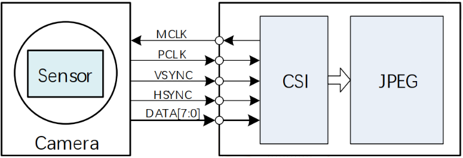
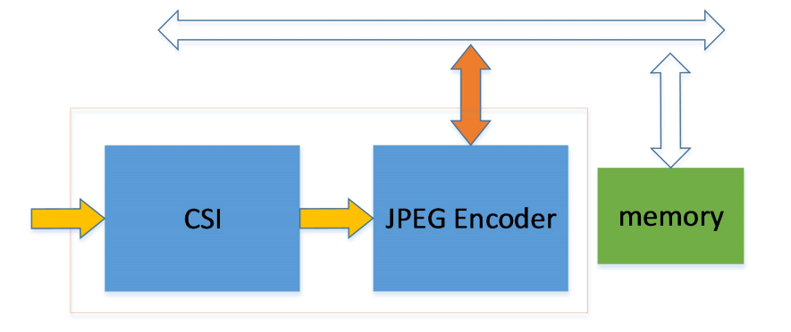
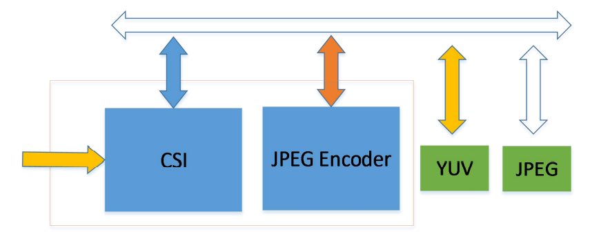

# CMOS sensor interface

介绍sunxi 平台RTOS 上CSI_JPEG 驱动hal 的一般使用方法及调试接口，为开发与调试提供参考。

## 模块介绍

### SENSOR -> CSI 通路

CSI （CMOS sensor interface）接口时序上可支持独立 SYNC 和嵌入 SYNC(CCIR656)。支持接收 YUV422 或 YUV420 数据。



VSYNC 和HSYNC 的有效电平可以是正极性，也可以是负极性。在配置时，需要保证摄像头和 CSI 内部配置保持一致。

最常见的 YUV422 格式输入后，内部只能处理成 YUV420 格式，并输出到 memory 存以 NV12布局形式。


### CSI -> JPEG 通路

#### 编码格式

JPEG 模块只支持 YUV420 格式的编码，因此 CSI 捕获的数据输出给 JPEG 模块编码的图像格式必须是 YUV420。若 CSI 输入 JPEG 模块是 JPEG 码流，JPEG 模块也能正常将其输出。

#### 编码模式

JPEG 模块支持 online 及 offline 模式编码。

- online 模式即在线模式，CSI 每接收到 16 行数据就自动进行 JPEG 编码，当前帧图像接收完，编码也随即完成。该模式 CSI 不会将接收的原始图像数据保存起来，只输出 JPEG 编码后的数据。编码数据输出的方式又有：整帧模式和分块模式。
- offline 模式即离线模式，CSI 接收到的数据会先存到内存中，待一帧完整数据全部存储完成后，由软件启动 JPEG 编码。所以此时 JPEG 不是实时处理，可以对任何已经保存好的 YUV420 图像数据进行编码。

##### online 模式

Online 模式的通路框图如下图所示：



Sensor(摄像头) 输出 YUV422 格式数据到 CSI，CSI 接收到 YUV422 后处理成 YUV420 格式，每接收到 16 行数据后，硬件会自动启动 JPEG encoder 进行一次编码操作，编码输出的码流通过总线直接写到设定好的内存中，故可认为 Online 模式下图像的接收和编码是同时进行的。在一帧数据接收完并编码结束后，JPEG encoder 会产生 ve finish(编码完成) 中断。因此，对图像分辨率的要求是行列数为 16 的整数倍，支持的最小分辨率为 32*32。

Online 分块模式与整帧模式的区别在于，分块模式可以在 JPEG 编码输出数据量达到设定值 (例如 2KB/4KB) 后产生中断，并且可以在一帧编码过程中循环使用编码输出空间，例如只分配 8KB的编码输出空间，而一帧图像编码数据有 20KB，则在第一次写满 8KB 后，JPEG 将会从这 8KB的首地址开始存储，循环使用，故需要软件配合将之前的数据读走，否则之前的数据会被覆盖。

##### offline 模式

Offline 模式的通路框图如下图所示：



Offline 模式下，CSI 会将 YUV420 的原始图像数据存储到 YUV memory 中，存放格式为NV12。一帧图像全部存完后，产生写回中断 (wb finish)，然后由软件启动 JPEG 开始编码， JPEG 编码器会读取 YUV memory 中的原始数据送给 Encoder 进行编码，编码后的数据写到JPEG memory 中。

## 模块配置

其menuconfig 的配置如下（以选择GC0308 摄像头为例）：

```c
Drivers Options --->
    soc related device drivers --->
        CSI Devices --->
            [*] enable csi driver
            [*] enable csi camera driver
            [*] csi camera choice --->
                --- csi camera choice
                [*] csi camera GC0308
            [*] enable jpeg encoder
            [*] enable csi demo test command  // csi_jpeg模块测试用例
```

## 源码结构

驱动位于 `rtos-hal/hal/source/drivers/hal/source/csi`

```c
csi/
├── csi_camera/         ;csi driver
│   ├── csi.c
│   ├── csi.h
│   ├── csi_reg/
│   │   ├── csi_reg.c
│   │   └── csi_reg.h
│   └── sensor/         ;cmos sensor driver
│   ├── drv_gc0308.c
│   ├── sensor_helper.c
│   └── sensor_helper.h
├── hal_csi_jpeg.c      ;csi_jpeg模块驱动实现主体
├── jpeg/               ;jpeg driver
│   ├── hal_jpeg.c
│   ├── hal_jpeg.h
│   ├── jpegenc.c
│   ├── jpegenc.h
│   ├── jpeglib.c
│   ├── jpeglib.h
│   ├── jpeg_marker.h
│   └── jpeg_reg/
│   ├── jpeg_reg.c
│   └── jpeg_reg.h
└── utility
    ├── cj_board_cfg.h
    ├── cj_platform_cfg.h
    └── sensor/
        ├── camera_sensor.h
        └── drv_gc0308.h
```

## 模块接口说明

### 数据结构

#### `csi_jpeg_fmt`

作用：用于描述csi_jpeg 模块的属性参数

成员：

- line_mode：JPEG 的工作模式。
- output_mode：CSI_JPEG 的输出图像格式。
- cb：CSI/JPEG 的硬件中断的回调函数。可以用做实现JPEG 分块模式的数据提取功能。

```c
struct csi_jpeg_fmt {
    unsigned int width;
    unsigned int height;
    enum line_mode_t line_mode;
    enum pix_output_fmt_mode_t output_mode;
    CapStatusCb cb;
    unsigned char fps; //reserve
}；
    
// 成员line_mode结构体
enum line_mode_t {
    OFFLINE_MODE = 0,
    ONLINE_MODE,
};

// 成员output_mode结构体
enum pix_output_fmt_mode_t {
    PIX_FMT_OUT_NV12 = 0x1,
    PIX_FMT_OUT_JPEG = 0x2,
    PIX_FMT_OUT_MAX = 0x3,
};
```

#### `csi_ipeg_mem`

作用：用于描述 CSI/JPEG 模块所申请 buffer 相关的属性信息

成员：

- buf : 所申请的 buffer。
- mpart_info : JPEG 分块模式的块属性信息。

```c
struct csi_ipeg_mem {
    unsigned char index;
	struct csi_ipeg_buf buf;
    jpeg_mpartbuffinfo mpart_info;
    struct list_head list;
};

// 成员buf结构体
struct csi_ipeg_buf {
    unsigned int size;
    void *addr;
};

// 成员mpart_info结构体
typedef struct {
    uint8_t buff_index;   /* Indicate which buffer the currently encoded part jpeg is stored in */
    uint32_t buff_offset; /* Indicate the offset of the current part of jpeg in the buffer */
    uint8_t tail;         /* Indicates whether it is the last part of a jpeg image */
    uint32_t size;        /* Indicate the size of the current part of jpeg encoding */
} jpeg_mpartbuffinfo;
```

### 模块加载初始化

csi_jpeg 模块的加载函数，主要是CSI/JPEG 模块的初始化、申请中断和clk 初始化等

函数原型：

```c
HAL_Status hal_csi_jpeg_probe(void)
```

参数：

- 无

返回值：

- 0：成功
- 负数：失败

### 模块去初始化

csi_jpeg 模块的移除函数，主要是CSI/JPEG 模块的反初始化、注销中断和clk 反初始化等。

```c
HAL_Status hal_csi_jpeg_remove(void)
```

参数：

- 无

返回值：

- 0：成功
- 负数：失败

### 配置参数

设置csi_jpeg 模块的属性参数。

函数原型：

```c
void hal_csi_jpeg_set_fmt(struct csi_jpeg_fmt *intput_fmt)
```

参数：

- intput_fmt：指向csi_jpeg_fmt 结构体类型的配置参数。

返回值：

- 无

### 申请图像buffer

CSI/JPEG 模块获取存放图像数据的buffer。多个缓存可以用于建立FIFO，来提高视频采集的效率。

函数原型：

```c
int hal_csi_jpeg_reqbuf(unsigned int count)
```

参数：

- count: buffer 数目

返回值：

- 0：成功
- 负数：失败

### 释放图像buffer

CSI/JPEG 模块释放存放图像数据的buffer。

函数原型：

```c
int hal_csi_jpeg_freebuf(void)
```

参数：

- 无

返回值：

- 0：成功
- 负数：失败

### 配置流开关

csi_jpeg 模块的开流/关流函数，主要是CSI/JPEG 模块的配置和控制CSI 采集功能等。

函数原型：

```c
void hal_csi_jpeg_s_stream(unsigned int on)
```

参数：

- on：“非0” 值代表开启，“0” 值代表关闭

返回值：

- 无

### CSI buffer 出列

将CSI driver 已经填充好数据的 buffer 出列，供应用使用。

函数原型：

```c
unsigned int hal_csi_dqbuf(struct csi_ipeg_mem *csi_mem, unsigned int timeout_msec)
```

参数：

- csi_mem：CSI buffer，指向csi_ipeg_mem 结构体类型的配置参数。
- timeout_msec：单位ms。

返回值：

- 正数代表成功，返回csi_mem
- 负数代表失败

### CSI buffer 入队

将 User 空间已经处理过的buffer，重新入队，移交给CSI driver，等待填充数据。

函数原型：

```c
void hal_csi_qbuf(void)
```

参数：

- 无

返回值：

- 无

### JPEG buffer 出列

将 JPEG driver 已经填充好数据的 buffer 出列，供应用使用。

函数原型：

```c
unsigned int hal_jpeg_dqbuf(struct csi_ipeg_mem *jpeg_mem, unsigned int timeout_msec)
```

参数：

- jpeg_mem：JPEG  buffer，指向csi_ipeg_mem 结构体类型的配置参数。
- timeout_msec：单位ms。

返回值：

- 正数代表成功，返回csi_mem
- 负数代表失败

### JPEG buffer 入队

将User 空间已经处理过的buffer，重新入队，移交给JPEG driver，等待填充数据。

函数原型：

```c
void hal_jpeg_qbuf(void)
```

参数：

- 无

返回值：

- 无

## 模块使用范例

### online 模式

```c
#include <stdio.h>
#include <string.h>
#include <unistd.h>
#include "FreeRTOS/_os_semaphore.h"
#include "FreeRTOS/_os_time.h"
#include "sunxi_hal_twi.h"
#include <fcntl.h>
#include <hal_cmd.h>
#include <hal_log.h>
#include <hal_thread.h>
#include "hal_csi_jpeg.h"
#include "jpegenc.h"
#include "cj_platform_cfg.h"

/* Macro JPEG_MPART_ENABLE defined in jpegenc.h */
#if JPEG_MPART_ENABLE
#define JPEG_MPART_SIZE			(50*1024)
#endif

static int read_whole_jpg(struct csi_ipeg_mem *jpeg_mem, int order)
{
	FILE* fd;
	long long res;
	void *addr;
	int size;
	char name[128];

	hal_log_info("%s line: %d addr = 0x%08x size = %d\n", __func__, __LINE__,
				jpeg_mem->buf.addr, jpeg_mem->buf.size);

	sprintf(name, "/data/test_%d.jpg", order);
	fd = fopen(name, "ab");
	if (fd < 0) {
		hal_log_info("open /data/test.jpg error %d\n", fd);
		return -1;
	}
	addr = jpeg_mem->buf.addr - JPEG_HEADER_LEN;
	size = jpeg_mem->buf.size + JPEG_HEADER_LEN;

	res = fwrite(addr, size, 1, fd);
	if (res < 0) {
		hal_log_info("write fail(%d), line%d..\n", res, __LINE__);
		fclose(fd);
		return -1;
	}
	hal_log_info("write JPEG image ok\n");

	fclose(fd);

	return 0;
}

static int read_part_jpg(void *addr, int size, int order)
{
	FILE* fd;
	long long res;
	char name[128];

	hal_log_info("%s line: %d addr = 0x%08x size = %d\n", __func__, __LINE__, addr, size);

	sprintf(name, "/data/test_%d.jpg", order);
	fd = fopen(name, "ab");
	if (fd < 0) {
		hal_log_info("open /data/test.jpg error %d\n", fd);
		return -1;
	}

	res = fwrite(addr, size, 1, fd);
	if (res < 0) {
		hal_log_info("write fail(%d), line%d..\n", res, __LINE__);
		fclose(fd);
		return -1;
	}
	hal_log_info("write JPEG image ok\n");

	fclose(fd);

	return 0;
}

#if JPEG_MPART_ENABLE
static uint8_t* gmpartaddr[3];
static uint32_t gmpartsize[3];
static void jpeg_mpart_cb(struct csi_ipeg_mem *jpeg_mem)
{
	static uint32_t offset = 0;
	static int index = 0;
	hal_dcache_clean_invalidate((unsigned long)jpeg_mem->buf.addr +
			jpeg_mem->mpart_info.buff_offset, jpeg_mem->mpart_info.size); /* necessary operation */
	memcpy(gmpartaddr[index] + offset, jpeg_mem->buf.addr + jpeg_mem->mpart_info.buff_offset,
			jpeg_mem->mpart_info.size);
	offset += jpeg_mem->mpart_info.size;
	if (jpeg_mem->mpart_info.tail) { /*  encode one jpeg finish */
		gmpartsize[index] = offset;
		offset = 0;
		index++;
		if (index > 3)
			index = 0;
	}
}
#endif

static void main_test()
{
	struct csi_jpeg_fmt fmt;
	unsigned int count, i;
	struct csi_ipeg_mem *csi_mem;
	struct csi_ipeg_mem *jpeg_mem[3];
	unsigned int test_count;
	unsigned int timeout_msec;
	unsigned int j = 0;

	fmt.width = 640;
	fmt.height = 480;
	fmt.line_mode = ONLINE_MODE;
	fmt.output_mode = PIX_FMT_OUT_MAX;
#if JPEG_MPART_ENABLE
	fmt.cb = &jpeg_mpart_cb;
#endif
	hal_csi_jpeg_set_fmt(&fmt);

	count = 3;

	if (hal_csi_jpeg_reqbuf(count) != 0) {
		return;
	}

	test_count = 3;

	hal_csi_jpeg_s_stream(1);

	hal_log_info("csi stream on!");

	timeout_msec = 2000;

#if JPEG_MPART_ENABLE
	for (i = 0; i < count; i++) {
		gmpartaddr[i] = malloc(JPEG_MPART_SIZE);
		hal_log_info("jpeg pic addr = %x\n", gmpartaddr[i]);
		memset(gmpartaddr[i], 0 , JPEG_MPART_SIZE);
	}
#endif

	while (test_count-- > 0) {
		jpeg_mem[j] = hal_jpeg_dqbuf(jpeg_mem[j], timeout_msec);
		hal_jpeg_qbuf();
		j++;
		if (j > count)
			j = 0;
	}
	hal_disable_irq(CSI_JPEG_IRQn);

#if JPEG_MPART_ENABLE
	for (i = 0; i < count; i++) {
		read_part_jpg(jpeg_mem[i]->buf.addr - JPEG_HEADER_LEN, JPEG_HEADER_LEN, i);
		read_part_jpg(gmpartaddr[i], gmpartsize[i], i);
		free(gmpartaddr[i]);
	}
#else
	for (i = 0; i < count; i++)
		read_whole_jpg(jpeg_mem[i], i);
#endif

	hal_csi_jpeg_s_stream(0);
	hal_csi_jpeg_freebuf();
	hal_log_info("csi stream off!!\n");

}

int cmd_csi_jpeg_online_test(int argc, const char **argv)
{
	hal_log_info("csi jpeg demo started\n");
	hal_csi_jpeg_probe();

	main_test();

	hal_csi_jpeg_remove();
	hal_log_info("csi jpeg demo over\n");

	return 0;
}

FINSH_FUNCTION_EXPORT_CMD(cmd_csi_jpeg_online_test, hal_csi_jpeg_online, csi jpeg online encode test)
```

### offline 模式

```c
#include <stdio.h>
#include <string.h>
#include <unistd.h>
#include "FreeRTOS/_os_semaphore.h"
#include "FreeRTOS/_os_time.h"
#include "sunxi_hal_twi.h"
#include <fcntl.h>
#include <hal_cmd.h>
#include <hal_log.h>
#include <hal_thread.h>
#include "hal_csi_jpeg.h"
#include "jpegenc.h"

static int out_fmt = 0;
#define CSI_JPEG_IRQn	109  // rv
//#define CSI_JPEG_IRQn	93  // arm

static int read_frame(struct csi_ipeg_mem *csi_mem)
{
	FILE* fd;
	long long res;

	hal_disable_irq(CSI_JPEG_IRQn);  // when write bin, close irq, r/w too slow
	hal_log_info("%s line: %d addr = 0x%08x size = %d\n", __func__, __LINE__,
				csi_mem->buf.addr, csi_mem->buf.size);

	fd = fopen("/data/nv12.bin", "ab");
	if (fd < 0) {
		hal_log_info("open /data/nv12.bin error %d\n", fd);
		return -1;
	}

	res = fwrite(csi_mem->buf.addr, csi_mem->buf.size, 1, fd);
	if (res < 0) {
		hal_log_info("write fail(%d), line%d..\n", res, __LINE__);
		fclose(fd);
		return -1;
	}
	hal_log_info("write YUV image ok\n");

	fclose(fd);

	hal_enable_irq(CSI_JPEG_IRQn);	// after write bin, open irq, r/w too slow
	return 0;
}

static int read_jpg(struct csi_ipeg_mem *jpeg_mem)
{
	FILE* fd;
	long long res;
	void *addr;
	unsigned int size;
	char name[128];

	hal_disable_irq(CSI_JPEG_IRQn);  // cfm when write bin, close irq
	hal_log_info("%s line: %d addr = 0x%08x size = %d\n", __func__, __LINE__,
				jpeg_mem->buf.addr, jpeg_mem->buf.size);

	fd = fopen("/data/test.jpg", "ab");
	if (fd < 0) {
		hal_log_info("open /data/test_online.jpg error %d\n", fd);
		return -1;
	}

	addr = jpeg_mem->buf.addr - JPEG_HEADER_LEN;
	size = jpeg_mem->buf.size + JPEG_HEADER_LEN;

	res = fwrite(addr, size, 1, fd);
	if (res < 0) {
		hal_log_info("write fail(%d), line%d..\n", res, __LINE__);
		fclose(fd);
		return -1;
	}
	hal_log_info("write JPEG image ok\n");

	fclose(fd);
	hal_enable_irq(CSI_JPEG_IRQn);	// cfm after write bin, open irq

	return 0;
}

static void main_test()
{
	struct csi_jpeg_fmt fmt;
	unsigned int count;
	struct csi_ipeg_mem *csi_mem;
	struct csi_ipeg_mem *jpeg_mem;
	unsigned int test_count;
	unsigned int timeout_msec;

	fmt.width = 640;
	fmt.height = 480;
	fmt.line_mode = OFFLINE_MODE;
	fmt.output_mode = PIX_FMT_OUT_MAX;
	hal_csi_jpeg_set_fmt(&fmt);

	count = 3;

	if (hal_csi_jpeg_reqbuf(count) != 0) {
		return ;
	}

	hal_csi_jpeg_s_stream(1);
	hal_log_info("csi stream on!");

	test_count = 200;
	timeout_msec = 2000;  // recommend 2s, 10s for pm test

	if (!out_fmt) {
		while (test_count-- > 0) {
			hal_log_info("test count = %d\n", test_count);
			csi_mem = hal_csi_dqbuf(csi_mem, timeout_msec);
			if (test_count == 1)
				read_frame(csi_mem);
			hal_csi_qbuf();
		}
	} else {
		while (test_count-- > 0) {
			hal_log_info("test count = %d\n", test_count);
			jpeg_mem = hal_jpeg_dqbuf(jpeg_mem, timeout_msec);
			if (test_count == 1)
				read_jpg(jpeg_mem);
			hal_jpeg_qbuf();
		}
	}

	hal_csi_jpeg_s_stream(0);
	hal_csi_jpeg_freebuf();
	hal_log_info("csi stream off!!\n");

}

struct rt_thread *thread;

static void csi_thread(void *data)
{
	hal_log_info("csi jpeg demo started\n");
	hal_csi_jpeg_probe();

	main_test();

	hal_csi_jpeg_remove();
	hal_log_info("csi jpeg demo over\n");

	kthread_stop(thread);

	return 0;
}

int cmd_csi_jpeg_offline_test(int argc, const char **argv)
{
	int ret;
	if (argc < 2)
	{
		hal_log_info("Usage: hal_csi_jpeg_offline num. num: 0 is nv12, 1 is jpeg\n");
	} else {
		out_fmt = strtol(argv[1], NULL, 0);
	}

	thread = kthread_create((void *)csi_thread, NULL, "csi_thread", 409600, HAL_THREAD_PRIORITY_SYS);
	kthread_start(thread);

	return 0;
}

FINSH_FUNCTION_EXPORT_CMD(cmd_csi_jpeg_offline_test, hal_csi_jpeg_offline, csi jpeg offline encode test)
```

