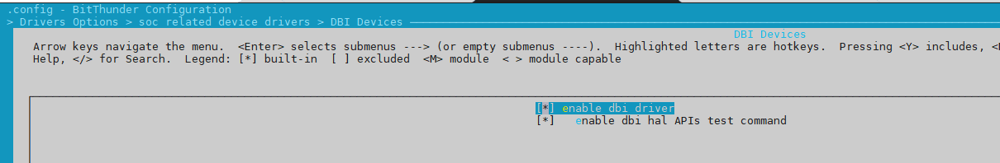

# SPI DBI

## 模块介绍

DBI 为显示总线接口，用于传输视频数据，其主要有以下特点：

- 支持3线、4线、2 data line 模式
- 支持由CPU或者DMA搬运数据
- 支持RGB111/RGB444/RGB565/RGB666/RGB888 video 格式
- 一条data line 的情况下，支持最大 RGB666 240x320 @30HZ
- 两条data line 情况下，最大支持 RGB888 320x480 @30HZ 或者 240x320 @60HZ
- 支持TE功能

## 模块配置介绍

配置路径如下：

```
Drivers Options 
	> soc related device drivers 
		> DBI Devices
```



## 模块源码结构

```
├── common_dbi.c
├── common_dbi.h
├── hal_dbi.c
├── Kconfig
├── Makefile
├── modules.order
├── objects.mk
├── platform
│   ├── dbi_sun20iw2.c
│   └── dbi_sun20iw2.h
└────── platform_dbi.h
```

## 模块接口说明

头文件

```c
#include <hal/sunxi_hal_dbi.h>
```

## 接口使用说明

### DBI 初始化接口

DBI 模块初始化，主要申请中断、pinctrl初始化、clk初始化等

函数原型：

```c
dbi_master_status_t hal_dbi_init(hal_dbi_master_port_t port,hal_dbi_config_t *cfg)
```

* 参数：
  + port：DBI端口号，与SPI共用物理接口，DBI实际上是SPI-DBI1，**所以填1**
  + cfg：配置初始化需要的参数，包括时钟频率，传输模式等
* 返回值：
  + 0代表成功
  + 负数代表失败

### DBI发送数据接口

发送数据，调hal_dbi_xfer接口

```c
dbi_master_status_t hal_dbi_xfer(hal_dbi_master_port_t port, hal_dbi_master_transfer_t *transfer);
```

* 参数：
  + port：DBI端口号
  + transfer：描述传输数据的结构体，包括读/写的数据buffer、数据长度等
* 返回值：
  + 0代表成功
  + 负数代表失败

### DBI去初始化接口

dbi 模块去初始化

```c
dbi_master_status_t hal_dbi_deinit(hal_dbi_master_port_t port);
```

* 参数：
  + port：DBI端口号
* 返回值：
  + 0代表成功
  + 负数代表失败