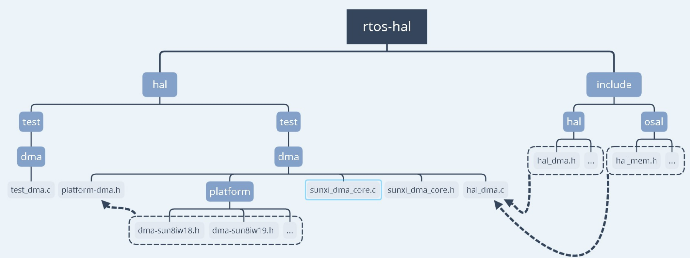

# DMA Controller

本文介绍RTOS 中DMA 驱动的接口及使用方法，为DMA 的使用者提供参考。

DMA 主要实现设备与设备、设备与 memory、memory 与 memory 之间的数据搬运与传输；BSP DMA 驱动主要实现设备驱动的底层细节，并为上层提供一套标准的 API 接口以供使用。

## 文档约定

| 数据       | 说明        |
| ---------- | ----------- |
| DRQSRC_XXX | 源 DRQ 号   |
| DRQDST_XXX | 目的 DRQ 号 |

## 模块配置

```c
Drivers Options —>
	soc related device drivers —>
    	DMA Devices —>
    		[*] enable dma driver
    		[*] 	enable dma hal API test command
```

## 源码结构

```c
hal/source/dma/       ---- 驱动源码
├── hal_dma.c
├── Kconfig
├── Makefile
├── platform
│   └── dma-sun20iw3.h
├── platform-dma.h

include/hal/          ---- 驱动APIs声明头文件
└── hal_dma.h
```

## 驱动框架



## 模块接口说明

头文件：

```c
#include <hal_dma.h>
#include <sunxi_hal_common.h>
```

### 申请 DMA 通道

函数原型：

```c
hal_dma_chan_status_t hal_dma_chan_request(struct sunxi_dma_chan **dma_chan)
```

参数：

- dma_chan: 存放 DMA 通道的指针变量

返回值：

- HAL_DMA_CHAN_STATUS_BUSY: 申请失败
- HAL_DMA_CHAN_STATUS_FREE: 申请成功

### 释放 DMA 通道

函数原型：

```c
hal_dma_status_t hal_dma_chan_free(struct sunxi_dma_chan *chan)
```

参数：

-  chan: 要释放的 DMA 通道结构体指针变量

返回值：

- HAL_DMA_STATUS_ERROR: 失败
- HAL_DMA_STATUS_OK: 成功

### 释放 DMA 通道描述符

函数原型：

```c
hal_dma_status_t hal_dma_chan_desc_free(struct sunxi_dma_chan *chan)
```

参数：

- chan: 要释放的 DMA 通道结构体指针变量

返回值：

- HAL_DMA_STATUS_ERROR: 失败
- HAL_DMA_STATUS_OK: 成功

### 初始化环形 DMA 传输

函数原型：

```c
hal_dma_status_t hal_dma_prep_cyclic(struct sunxi_dma_chan *chan, uint32_t buf_addr, uint32_t buf_len, uint32_t period_len, enum dma_transfer_direction dir)
```

参数：

- chan:DMA 通道结构体指针变量
- buf_addr: 数据缓冲区
- buf_len: 数据缓冲区长度
- period_len: 单次 DMA 搬运长度
- dir:DMA 传输方向

返回值：

- HAL_DMA_STATUS_INVALID_PARAMETER: 参数非法
- HAL_DMA_STATUS_ERROR: 失败
- HAL_DMA_STATUS_OK: 成功

### 初始化 memory to memory DMA 传输

函数原型：

```c
hal_dma_status_t hal_dma_prep_memcpy(struct sunxi_dma_chan *chan, uint32_t dest, uint32_t src, uint32_t len)
```

参数：

- chan:DMA 通道结构体指针变量
- dest: 目的地址
- src: 源地址
- len: 传输长度

返回值：

- HAL_DMA_STATUS_INVALID_PARAMETER: 参数非法
- HAL_DMA_STATUS_ERROR: 失败
- HAL_DMA_STATUS_OK: 成功

### 初始化通用 DMA 传输

函数原型：

```c
hal_dma_status_t hal_dma_prep_device(struct sunxi_dma_chan *chan, uint32_t dest, uint32_t src, uint32_t len, enum dma_transfer_direction dir)
```

参数：

-  chan:DMA 通道结构体指针变量
- dest: 目的地址
- src: 源地址
- len: 传输长度
- dir:DMA 传输方向

返回值：

- HAL_DMA_STATUS_INVALID_PARAMETER: 参数非法
- HAL_DMA_STATUS_ERROR: 失败
- HAL_DMA_STATUS_OK: 成功

### 注册 DMA 回调函数

函数原型：

```c
hal_dma_status_t hal_dma_callback_install(struct sunxi_dma_chan *chan, dma_callback callback, void *callback_param)
```

参数：

- chan:DMA 通道结构体指针变量
- callback: 回调函数 handler
- callback_param: 回调函数传参

返回值：

- HAL_DMA_STATUS_INVALID_PARAMETER: 参数非法
- HAL_DMA_STATUS_OK: 成功

### 配置 DMA 描述符传输信息

函数原型：

```c
hal_dma_status_t hal_dma_slave_config(struct sunxi_dma_chan *chan, struct dma_slave_config *config)
```

参数：

- chan:DMA 通道结构体指针变量
- config:DMA 描述符结构体指针变量

返回值：

- HAL_DMA_STATUS_INVALID_PARAMETER: 参数非法
- HAL_DMA_STATUS_OK: 成功

### 获取 DMA 发送状态

函数原型：

```c
enum dma_status hal_dma_tx_status(struct sunxi_dma_chan *chan, uint32_t *left_size)
```

参数：

- chan:DMA 通道结构体指针变
- left_size: 存放剩余长度的指针变量

返回值：

- DMA_INVALID_PARAMETER: 参数非法
- DMA_IN_PROGRESS: 正在进行
- DMA_COMPLETE: 传输完成

### 启动 DMA 传输

函数原型：

```c
hal_dma_status_t hal_dma_start(struct sunxi_dma_chan *chan)
```

参数：

- chan:DMA 通道结构体指针变量

返回值：

- HAL_DMA_STATUS_INVALID_PARAMETER: 参数非法
- HAL_DMA_STATUS_ERROR: 失败
- HAL_DMA_STATUS_OK: 成功

### 停止 DMA 传输

函数原型：

```c
hal_dma_status_t hal_dma_stop(struct sunxi_dma_chan *chan)
```

参数：

-  chan:DMA 通道结构体指针变量

返回值：

- HAL_DMA_STATUS_INVALID_PARAMETER: 参数非法
- HAL_DMA_STATUS_ERROR: 失败
- HAL_DMA_STATUS_OK: 成功

### 初始化 DMA 控制器驱动

函数原型：

```c
void hal_dma_init(void)
```

参数：

- 无

返回值：

- 无

### 申请一致性内存

函数原型：

```c
void *dma_alloc_coherent(size_t size)
```

参数：

- size: 申请内存的大小

返回值：

- ptr: 内存缓冲区指针

### 释放一致性内存

函数原型：

```c
void dma_free_coherent(void *addr)
```

参数：

- addr: 内存缓冲区指针

返回值：

- 无

## 调试节点

- `menuconfig` 选择测试文件`CONFIG_HAL_TEST_DMA`

- s系统启动后执行`hal_dma`即可，若结果为 “PASS”, 则表明当前 DMA 基本功能是否正常

## 模块使用范例

```c
#include <stdio.h>
#include <stdlib.h>
#include <string.h>

#include <hal_log.h>
#include <hal_cmd.h>
#include <hal_mem.h>
#include <hal_cache.h>
#include <hal_dma.h>

#include <sunxi_hal_common.h>

#define DMA_TEST_LEN	1024
static void dma_test_cb(void *param)
{
	hal_log_info("DMA finished, callback to do something...\n");
}

int cmd_test_dma(int argc, char **argv)
{
	int ret, i;
	struct sunxi_dma_chan *hdma = NULL;
	char *buf1 = NULL,*buf2 = NULL;
	struct dma_slave_config config = {0};
	uint32_t size = 0;

	hal_log_info("run in dma test");

	buf2 = dma_alloc_coherent(DMA_TEST_LEN);
	buf1 = dma_alloc_coherent(DMA_TEST_LEN);

	if (buf1 == NULL) {
		hal_log_err("malloc buf1 error!");
		goto end;
	}

	if (buf2 == NULL) {
		hal_log_err("malloc buf2 error!");
		goto end;
	}

	memset(buf1, 0, DMA_TEST_LEN);
	memset(buf2, 0, DMA_TEST_LEN);

	for (i = 0;i < DMA_TEST_LEN; i++)
		buf1[i] = i & 0xff;

	hal_dcache_clean_invalidate((unsigned long)buf1, DMA_TEST_LEN);
	hal_dcache_clean_invalidate((unsigned long)buf2, DMA_TEST_LEN);

	/* request dma chan */
	ret = hal_dma_chan_request(&hdma);
	if (ret == HAL_DMA_CHAN_STATUS_BUSY) {
		hal_log_err("dma channel busy!");
		goto end;
	}

	/* register dma callback */
	ret = hal_dma_callback_install(hdma, dma_test_cb, hdma);
	if (ret != HAL_DMA_STATUS_OK) {
		hal_log_err("register dma callback failed!");
		goto end;
	}

	config.direction = DMA_MEM_TO_MEM;
	config.dst_addr_width = DMA_SLAVE_BUSWIDTH_8_BYTES;
	config.src_addr_width = DMA_SLAVE_BUSWIDTH_8_BYTES;
	config.dst_maxburst = DMA_SLAVE_BURST_16;
	config.src_maxburst = DMA_SLAVE_BURST_16;
	config.slave_id = sunxi_slave_id(DRQDST_SDRAM, DRQSRC_SDRAM);

	ret = hal_dma_slave_config(hdma, &config);

	if (ret != HAL_DMA_STATUS_OK) {
		hal_log_err("dma config error, ret:%d", ret);
		goto end;
	}

	ret = hal_dma_prep_memcpy(hdma, (unsigned long)buf2, (unsigned long)buf1, DMA_TEST_LEN);
	if (ret != HAL_DMA_STATUS_OK) {
		hal_log_err("dma prep error, ret:%d", ret);
		goto end;
	}

	ret = hal_dma_start(hdma);
	if (ret != HAL_DMA_STATUS_OK) {
		hal_log_err("dma start error, ret:%d", ret);
		goto end;
	}

	while (hal_dma_tx_status(hdma, &size)!= 0);

	ret = hal_dma_stop(hdma);
	if (ret != HAL_DMA_STATUS_OK) {
		hal_log_err("dma stop error, ret:%d", ret);
		goto end;
	}

	ret = hal_dma_chan_free(hdma);
	if (ret != HAL_DMA_STATUS_OK) {
		hal_log_err("dma free error, ret:%d", ret);
		goto end;
	}

	hal_dcache_invalidate((unsigned long)buf2, DMA_TEST_LEN);

	hal_log_info("src buf:\n");
	for (i = 0;i < DMA_TEST_LEN; i++) {
		if (i % 16 == 0)
			printf("\n");
		printf("%02x ", buf1[i]);
	}
	printf("\n\n\n");
	hal_log_info("dst buf:\n");
	for (i = 0;i < DMA_TEST_LEN; i++) {
		if (i % 16 == 0)
			printf("\n");
		printf("%02x ", buf2[i]);
	}
	printf("\n\n\n");

	if (memcmp(buf1, buf2, DMA_TEST_LEN) != 0)
		printf("dma test fail\n");
	else
		printf("dma test pass\n");

end:
	dma_free_coherent(buf1);
	dma_free_coherent(buf2);

	return 0;
}

FINSH_FUNCTION_EXPORT_CMD(cmd_test_dma, hal_dma, dma hal APIs tests)
```

## 常见问题

1. 使用时出现数据搬运后数据为 0 的情况

   确保传输内存使用 `dma_alloc_coherent` 申请

