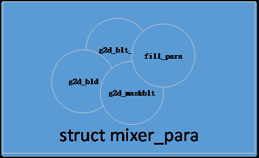

# G2D

G2D 驱动主要实现图像旋转/数据格式/颜色空间转换, 以及图层合成功能(包括包括alpha、colorkey、rotate、mirror、rop、maskblt) 等图形加速功能。

## 模块功能

### 矩形填充（fill color rectgngle）

填充矩形区域功能可以实现对某块区域进行预订的颜色值填充，如下图就填充了 0xFF0080FF的 ARGB 值，该功能还可以通过设定数据区域大小实现画点和直线，同时也可以通过设定 flag 实现一种填充颜色和目标做 alpha 运算。


### 旋转和镜像 (rotate and mirror)

旋转镜像主要是实现如下 Horizontal、Vertical、Rotate180°、Mirror45°、Rotate90°、Mirror135°、Rotate270° 共 7 种操作。


### alpha blending

不同的图层之间可以做 alpha blending。Alpha 分为 pixel alpha、plane alpha、multi alpha 三种：

- pixel alpha 意为每个像素自带有一个专属 alpha 值；
- plane alpha 则是一个图层中所有像素共用一个 globe alpha 值；
- multi alpha 则每个像素在代入 alpha 运算时的值为 globe alpha*pixel alpha，可以通过 G2D 驱动接口的 flag 去控制


###  colorkey

不同 image 之间可以做 colorkey 效果：

- 左图中 destination 的优先级高于 source，destination 中 match 部分（橙色五角星部分），则被选择透过，显示为 source 与 destination 做 alpha blending 后的效果图。

* 右图中 source 的优先级高于 destination，则 source 中 match 部分（深红色五角星部分），则被选择透过，直接显示 destination 与 source 做 alpha blending 后的效果图。


### 缩放 (Stretchblt)

Stretchblt 主要是把 source 按照 destination 的 size 进行缩放，并最终与 destination 做alpha blending、colorkey 等运算或直接旋转镜像后拷贝到目标


### 二元光栅操作 (rop2)

我们在画线和填充区域的时候将画笔和目标像素组合得到新的目标像素。

### 三元光栅操作 (maskblt rop3)

对于图像有同样光栅操作用于生成各种特殊效果, 我们要处理的有三种像素: 源图像像素, 目标图像像素, 画刷像素 (模板图像像素)。如下图所示, 从左上到右下分别是 src ptn mask dst。


## 支持的format

```
G2D_FORMAT_ARGB8888/G2D_FORMAT_ARGB8888/G2D_FORMAT_ABGR8888/
G2D_FORMAT_RGBA8888/G2D_FORMAT_BGRA8888/G2D_FORMAT_XRGB8888,
G2D_FORMAT_XBGR8888/G2D_FORMAT_RGBX8888/G2D_FORMAT_BGRX8888/
G2D_FORMAT_RGB888/G2D_FORMAT_BGR888/G2D_FORMAT_RGB565,
G2D_FORMAT_BGR565/G2D_FORMAT_ARGB4444/G2D_FORMAT_ABGR4444/
G2D_FORMAT_RGBA4444/G2D_FORMAT_BGRA4444/G2D_FORMAT_ARGB1555,
G2D_FORMAT_ABGR1555/G2D_FORMAT_RGBA5551/G2D_FORMAT_BGRA5551/
G2D_FORMAT_ARGB2101010/G2D_FORMAT_ABGR2101010,
G2D_FORMAT_RGBA1010102/G2D_FORMAT_BGRA1010102
G2D_FORMAT_IYUV422_V0Y1U0Y0, G2D_FORMAT_IYUV422_Y1V0Y0U0, G2D_FORMAT_IYUV422_U0Y1V0Y0, G2D_FORMAT_IYUV422_Y1U0Y0V0, G2D_FORMAT_YUV422UVC_V1U1V0U0, G2D_FORMAT_YUV422UVC_U1V1U0V0, G2D_FORMAT_YUV422_PLANAR, G2D_FORMAT_YUV420UVC_V1U1V0U0, G2D_FORMAT_YUV420UVC_U1V1U0V0, G2D_FORMAT_YUV420_PLANAR, G2D_FORMAT_YUV411UVC_V1U1V0U0, G2D_FORMAT_YUV411UVC_U1V1U0V0, G2D_FORMAT_YUV411_PLANAR, G2D_FORMAT_Y8,
G2D_FORMAT_YVU10_P010,
G2D_FORMAT_YVU10_P210,
G2D_FORMAT_YVU10_444,
G2D_FORMAT_YUV10_444,
```

## 模块配置

其menuconfig 的配置如下：

```
Kernel Setup --->
    Drivers Setup --->
        SoC HAL Drivers --->
            G2D devices --->
                [*] enable g2d driver
                [*] enbale g2d hal APIs Test command
```

## 源码结构

```
.
├── g2d_bld.c
├── g2d_bld.h
├── g2d_bsp.h
├── g2d.c
├── g2d_driver.h
├── g2d_driver_i.h
├── g2d_mixer.c
├── g2d_mixer.h
├── g2d_mixer_type.h
├── g2d_ovl_u.c
├── g2d_ovl_u.h
├── g2d_ovl_v.c
├── g2d_ovl_v.h
├── g2d_rcq.c
├── g2d_rcq.h
├── g2d_rotate.c
├── g2d_rotate.h
├── g2d_rotate_type.h
├── g2d_scal.c
├── g2d_scal.h
├── g2d_top.c
├── g2d_top.h
├── g2d_top_type.h
├── g2d_wb.c
├── g2d_wb.h
├── Kconfig
├── Makefile
├── simple_idr.c
└── simple_idr.h
```

## 模块接口说明

头文件

```c
#include <g2d_driver_enh.h>
```

### 数据结构

#### g2d_blt_flags

`g2d_blt_flags` 用于描述一个bitblt 和stretchblt 的flag 属性信息

```c
typedef enum {
    G2D_BLT_NONE = 0x00000000,
    G2D_BLT_PIXEL_ALPHA = 0x00000001,
    G2D_BLT_PLANE_ALPHA = 0x00000002,
    G2D_BLT_MULTI_ALPHA = 0x00000004,
    G2D_BLT_SRC_COLORKEY = 0x00000008,
    G2D_BLT_DST_COLORKEY = 0x00000010,
    G2D_BLT_FLIP_HORIZONTAL = 0x00000020,
    G2D_BLT_FLIP_VERTICAL = 0x00000040,
    G2D_BLT_ROTATE90 = 0x00000080,
    G2D_BLT_ROTATE180 = 0x00000100,
    G2D_BLT_ROTATE270 = 0x00000200,
    G2D_BLT_MIRROR45 = 0x00000400,
    G2D_BLT_MIRROR135 = 0x00000800,
}g2d_blt_flags;
```
| FLAG | 描述 |
|---|---|
| G2D_BLT_NONE | 纯拷贝|
| G2D_BLT_PIXEL_ALPHA | 点alpha标志|
| G2D_BLT_PLANE_ALPHA | 面alpha标志|
| G2D_BLT_MULTI_ALPHA | 混合alpha标志|
| G2D_BLT_SRC_COLORKEY | 源colorkey标志|
| G2D_BLT_DST_COLORKEY | 目标colorkey标志|
| G2D_BLT_FLIP_HORIZONTAL | 水平翻转|
| G2D_BLT_FLIP_VERTICAL | 垂直翻转|
| G2D_BLT_ROTATE90 | 逆时针旋转90度|
| G2D_BLT_ROTATE180 | 逆时针旋转180度|
| G2D_BLT_ROTATE270 | 逆时针旋转270度|
| G2D_BLT_MIRROR45 | 镜像45度|
| G2D_BLT_MIRROR135 | 镜像135度|

#### g2d_fillrect_flags

`g2d_fillrect_flags` 用于描述一个fillrect 属性信息

```c
typedef enum {
    G2D_FIL_NONE = 0x00000000,
    G2D_FIL_PIXEL_ALPHA = 0x00000001,
    G2D_FIL_PLANE_ALPHA = 0x00000002,
    G2D_FIL_MULTI_ALPHA = 0x00000004,
}g2d_fillrect_flags;
```
| FLAG | 描述 |
|---|---|
|G2D_FIL_NONE | 纯填充|
|G2D_FIL_PIXEL_ALPHA | 填充区域和目标做点alpha|
|G2D_FIL_PLANE_ALPHA | 填充区域和目标做面alpha|
|G2D_FIL_MULTI_ALPHA | 填充区域的alpha值 x 面alpha值后再和目标做alpha|

#### g2d_blt_flags_h

`g2d_blt_flags_h` 定义二元光栅操作码

```c
typedef enum {
	G2D_BLT_NONE_H = 0x0,
	G2D_BLT_BLACKNESS,
	G2D_BLT_NOTMERGEPEN,
	G2D_BLT_MASKNOTPEN,
	G2D_BLT_NOTCOPYPEN,
	G2D_BLT_MASKPENNOT,
	G2D_BLT_NOT,
	G2D_BLT_XORPEN,
	G2D_BLT_NOTMASKPEN,
	G2D_BLT_MASKPEN,
	G2D_BLT_NOTXORPEN,
	G2D_BLT_NOP,
	G2D_BLT_MERGENOTPEN,
	G2D_BLT_COPYPEN,
	G2D_BLT_MERGEPENNOT,
	G2D_BLT_MERGEPEN,
	G2D_BLT_WHITENESS = 0x000000ff,

	G2D_ROT_90  = 0x00000100,
	G2D_ROT_180 = 0x00000200,
	G2D_ROT_270 = 0x00000300,
	G2D_ROT_0   = 0x00000400,
	G2D_ROT_H = 0x00001000,
	G2D_ROT_V = 0x00002000,

/*	G2D_SM_TDLR_1  =    0x10000000, */
	G2D_SM_DTLR_1 = 0x10000000,
/*	G2D_SM_TDRL_1  =    0x20000000, */
/*	G2D_SM_DTRL_1  =    0x30000000, */
} g2d_blt_flags_h;
```

```c
G2D_BLT_NONE 单个源操作
G2D_BLT_BLACK BLACKNESS :使用与物理调色板的索引0相关的色彩来填充目标矩形区域,(对缺省的物理调色板,该颜
色为黑色)
G2D_BLT_NOTMERGEPEN dst = ~(dst+src) :
G2D_BLT_MASKNOTPEN dst =~src&dst
G2D_BLT_NOTCOPYPEN dst =~src
G2D_BLT_MASKPENNOT dst =src&~dst
G2D_BLT_NOT dst =~dst :使目标矩形区域颜色取反
G2D_BLT_XORPEN dst =src^dst
G2D_BLT_NOTMASKPEN dst =~(src&dst)
G2D_BLT_MASKPEN dst =src&dst
G2D_BLT_NOTXORPEN dst =~(src^dst)
G2D_BLT_NOP dst =dst
G2D_BLT_MERGENOTPEN dst =~src+dst
G2D_BLT_COPEPEN dst =src
G2D_BLT_MERGEPENNOT dst =src+~dst
G2D_BLT_MERGEPEN dst =src+dst
G2D_BLT_WHITE WHITENESS :使用与物理调色板中索引1有关的颜色填充目标矩形区域(对于缺省物理调色板来说,这
个颜色为白色)
```

#### g2d_image_enh

`g2d_image_enh` 主要描述图片的宽高、存放地址、是否做Clip 处理，是否为预乘等。

```c
typedef struct {
	int		 bbuff;
	__u32		 color;
	g2d_fmt_enh	 format;
	__u32		 laddr[3];
	__u32		 haddr[3];
	__u32		 width;
	__u32		 height;
	__u32		 align[3];

	g2d_rect	 clip_rect;
	g2d_size	 resize;
	g2d_coor	 coor;

	__u32		 gamut;
	int		 bpremul;
	__u8		 alpha;
	g2d_alpha_mode_enh mode;
	int		 fd;
	__u32 use_phy_addr;
} g2d_image_enh;
```

```
format: 图格式
laddr Buffer: 起始低位地址
haddr Buffer: 起始高位地址
width : 图宽度（in pixel）
height : 图高度（in pixel）
pitch : Buffer的pitch
clip_rect : ROI矩形
gamut : 图的色域
bpremul : 是否为预乘
alpha : 面alpha值
mode : alpha模式设置
use_phy_addr: 是否使用物理地址的标志。1表示使用，0表示使用fd
```

注意: 当 `use_phy_addr`  为 `1` 的时候，你必须自己设置好 `laddr` 和 `haddr`，并自行做好偏移。使用`fd` 则不需要设置这两个数组。

#### g2d_fmt_enh

`g2d_fmt_enh` 用于描述G2D 模块支持的格式

```
typedef enum {
	G2D_FORMAT_ARGB8888,
	G2D_FORMAT_ABGR8888,
	G2D_FORMAT_RGBA8888,
	G2D_FORMAT_BGRA8888,
	G2D_FORMAT_XRGB8888,
	G2D_FORMAT_XBGR8888,
	G2D_FORMAT_RGBX8888,
	G2D_FORMAT_BGRX8888,
	G2D_FORMAT_RGB888,
	G2D_FORMAT_BGR888,
	G2D_FORMAT_RGB565,
	G2D_FORMAT_BGR565,
	G2D_FORMAT_ARGB4444,
	G2D_FORMAT_ABGR4444,
	G2D_FORMAT_RGBA4444,
	G2D_FORMAT_BGRA4444,
	G2D_FORMAT_ARGB1555,
	G2D_FORMAT_ABGR1555,
	G2D_FORMAT_RGBA5551,
	G2D_FORMAT_BGRA5551,
	G2D_FORMAT_ARGB2101010,
	G2D_FORMAT_ABGR2101010,
	G2D_FORMAT_RGBA1010102,
	G2D_FORMAT_BGRA1010102,

	/* invailed for UI channel */
	G2D_FORMAT_IYUV422_V0Y1U0Y0 = 0x20,
	G2D_FORMAT_IYUV422_Y1V0Y0U0,
	G2D_FORMAT_IYUV422_U0Y1V0Y0,
	G2D_FORMAT_IYUV422_Y1U0Y0V0,

	G2D_FORMAT_YUV422UVC_V1U1V0U0,
	G2D_FORMAT_YUV422UVC_U1V1U0V0,
	G2D_FORMAT_YUV422_PLANAR,

	G2D_FORMAT_YUV420UVC_V1U1V0U0 = 0x28,
	G2D_FORMAT_YUV420UVC_U1V1U0V0,
	G2D_FORMAT_YUV420_PLANAR,

	G2D_FORMAT_YUV411UVC_V1U1V0U0 = 0x2c,
	G2D_FORMAT_YUV411UVC_U1V1U0V0,
	G2D_FORMAT_YUV411_PLANAR,

	G2D_FORMAT_Y8 = 0x30,

	/* YUV 10bit format */
	G2D_FORMAT_YVU10_P010 = 0x34,

	G2D_FORMAT_YVU10_P210 = 0x36,

	G2D_FORMAT_YVU10_444 = 0x38,
	G2D_FORMAT_YUV10_444 = 0x39,
	G2D_FORMAT_MAX,
} g2d_fmt_enh;
```

#### g2d_rop3_cmd_flag

`g2d_rop3_cmd_flag` 用于定义三元光栅操作码

```c
typedef enum {
	G2D_ROP3_BLACKNESS = 0x00,
	G2D_ROP3_NOTSRCERASE = 0x11,
	G2D_ROP3_NOTSRCCOPY = 0x33,
	G2D_ROP3_SRCERASE = 0x44,
	G2D_ROP3_DSTINVERT = 0x55,
	G2D_ROP3_PATINVERT = 0x5A,
	G2D_ROP3_SRCINVERT = 0x66,
	G2D_ROP3_SRCAND = 0x88,
	G2D_ROP3_MERGEPAINT = 0xBB,
	G2D_ROP3_MERGECOPY = 0xC0,
	G2D_ROP3_SRCCOPY = 0xCC,
	G2D_ROP3_SRCPAINT = 0xEE,
	G2D_ROP3_PATCOPY = 0xF0,
	G2D_ROP3_PATPAINT = 0xFB,
	G2D_ROP3_WHITENESS = 0xFF,
} g2d_rop3_cmd_flag;

```

```
G2D_ROP3_BLACKNESS dst = BLACK
G2D_ROP3_NOTSRCERASE dst = (NOT src) AND (NOT dst)
G2D_ROP3_NOTSRCCOPY dst = (NOT src) :将源矩形区域颜色取反,拷贝到目标矩形区域
G2D_ROP3_SRCERASE dst = src AND (NOT dst )
G2D_ROP3_DSTINVERT dst = (NOT dst)
G2D_ROP3_PATINVERT dst = pattern XOR dst :通过使用布尔型的异或(XOR)操作符将特定模式和目标矩形区域颜色合并
G2D_ROP3_SRCINVERT dst = src XOR dst :通过使用布尔型的异或(XOR)操作符将源和目标矩形区域颜色合并
G2D_ROP3_SRCAND dst = srcAND dst :通过使用与操作符将源和目标矩形区域颜色值合并
G2D_ROP3_MERGEPAINT dst = (NOT src) OR dst :通过使用布尔型的或(OR)操作符将反向的源矩形区域的颜色与目标矩形区域颜色合并
G2D_ROP3_MERGECOPY dst = (src AND pattern)
G2D_ROP3_SRCCOPY dst = src :将源矩形区域直接拷贝到目标矩形区域
G2D_ROP3_SRCPAINT dst = src OR dst :通过使用布尔型的或(OR)操作符将源和目标矩形区域颜色合并
G2D_ROP3_PATCOPY dst = pattern
G2D_ROP3_PATPAINT dst = DPSnoo :通过使用布尔型的或(OR)操作符将源矩形区域取反后的颜色值与特定模式的颜色合并,然后使用OR操作符与该操作的结果与目标矩形区域内的颜色合并.
G2D_ROP3_WHITENESS dst = WHITE
```

#### g2d_bld_cmd_flag

`g2d_bld_cmd_flag` 定义BLD 操作命令

```c
typedef enum {
	G2D_BLD_CLEAR = 0x00000001,
	G2D_BLD_COPY = 0x00000002,
	G2D_BLD_DST = 0x00000003,
	G2D_BLD_SRCOVER = 0x00000004,
	G2D_BLD_DSTOVER = 0x00000005,
	G2D_BLD_SRCIN = 0x00000006,
	G2D_BLD_DSTIN = 0x00000007,
	G2D_BLD_SRCOUT = 0x00000008,
	G2D_BLD_DSTOUT = 0x00000009,
	G2D_BLD_SRCATOP = 0x0000000a,
	G2D_BLD_DSTATOP = 0x0000000b,
	G2D_BLD_XOR = 0x0000000c,
	G2D_CK_SRC = 0x00010000,
	G2D_CK_DST = 0x00020000,
} g2d_bld_cmd_flag;
```

#### g2d_ck

`g2d_ck` 定义了colorkey 操作的参数

```c
typedef struct {
	int match_rule;
	__u32 max_color;
	__u32 min_color;
} g2d_ck;
```

```
match_rule 当match_rule为假时，Color Min=<Color<=Color Max表示满足匹配条件
当match_rule为真时，Color>Color Max or Color <Color Min表示满足匹配条件
ck_max_color Color Max
ck_min_color Color Min
```

#### g2d_alpha_mode_enh

`g2d_alpha_mode_enh` 定义进行alpha blend 操作时，选择的alpha mode

```
typedef enum{
    G2D_PIXEL_ALPHA,
    G2D_GLOBAL_ALPHA,
    G2D_MIXER_ALPHA,
}g2d_alpha_mode_enh;
```

```
G2D_PIXEL_ALPHA 点 alpha
G2D_GLOBAL_ALPHA 面 alpha
G2D_MIXER_ALPHA 混合 alpha
```

#### g2d_color_gmt

`g2d_color_gmt ` 定义进行位操作时，选择的颜色空间

```c
typedef enum{
    G2D_BT601,
    G2D_BT709,
    G2D_BT2020,
}g2d_color_gmt;
```

#### g2d_blt_h

`g2d_blt_h` 实现对 `foreground` 带缩放的ROP2 处理。

```c
typedef struct {
	g2d_blt_flags_h flag_h;
	g2d_image_enh src_image_h;
	g2d_image_enh dst_image_h;
} g2d_blt_h;
```

```
flag_h : blt操作flag标志，增强版标志
src_image_h : 源图像信息,增强版的图像参数,详见g2d_image_enh
dst_image_h : 目标图像信息，增强版的图像参数
color : colorkey颜色
alpha : 面alpha值
```

### 函数接口

G2D 驱动向OS 或其他 `driver hal` 暴露的接口如下表，模块使用主要通过 `ioctl` 实现，即 `sunxi_g2d_control`，后续将主要介绍该接口的用法。

#### 开启 G2D 

函数原型

```c
int sunxi_g2d_open(void);
```

参数

- 无

返回值

- 0：成功
- 其他：失败

#### 关闭 G2D

函数原型

```c
int sunxi_g2d_close(void);
```

参数

- 无

返回值

- 0：成功
- 其他：失败

#### G2D 驱动 ioctl 接口

函数原型

```c
int sunxi_g2d_control(int cmd, void *arg);
```

参数

- cmd: 操作类型
- arg：参数

返回值

- 0：成功
- 其他：失败

## G2D ioctl 操作示例

### 单幅图的缩放、格式转换

`g2d_cmd`：`G2D_CMD_BITBLT_H`

实现单幅图的缩放、格式转换等。实现对foreground 带缩放的 ROP2 处理。

#### 旋转功能

```c
blit.flag_h = G2D_ROT_90;
blit.src_image_h.addr[0] = saddr[0];
blit.src_image_h.format = G2D_FORMAT_ARGB8888;
blit.src_image_h.mode = G2D_GLOBAL_ALPHA;
blit.src_image_h.clip_rect.x = 0;
blit.src_image_h.clip_rect.y = 0;
blit.src_image_h.clip_rect.w = 1920;
blit.src_image_h.clip_rect.h = 1080;
blit.src_image_h.width = 1920;
blit.src_image_h.height = 1080;
blit.src_image_h.alpha = 0xff;
blit.dst_image_h.addr[0] = daddr[0];
blit.dst_image_h.format = G2D_FORMAT_ARGB8888;
blit.dst_image_h.mode = G2D_GLOBAL_ALPHA;
blit.dst_image_h.clip_rect.x = 0;
blit.dst_image_h.clip_rect.y = 0;
blit.dst_image_h.clip_rect.w = 1920;
blit.dst_image_h.clip_rect.h = 1080;
blit.dst_image_h.alpha = 0xff;
blit.dst_image_h.width = 1920;
blit.dst_image_h.height = 1080;

if (sunxi_g2d_control(G2D_CMD_BITBLT_H, (unsigned long)(&blit)) < 0) {
  printf("[%d][%s][%s]G2D_CMD_BITBLT_H failure!\n", __LINE__, __FILE__,__FUNCTION__);
  return ‑1;
}
```

#### 缩放功能

```c
blit.flag_h = G2D_BLT_NONE_0;
blit.src_image_h.addr[0] = saddr[0];
blit.src_image_h.format = G2D_FORMAT_ARGB8888;
blit.src_image_h.mode = G2D_GLOBAL_ALPHA;
blit.src_image_h.clip_rect.x = 0;
blit.src_image_h.clip_rect.y = 0;
blit.src_image_h.clip_rect.w = 1280;
blit.src_image_h.clip_rect.h = 800;
blit.src_image_h.width = 1280;
blit.src_image_h.height = 800;
blit.src_image_h.alpha = 0xff;
blit.dst_image_h.addr[0] = daddr[0];
blit.dst_image_h.format = G2D_FORMAT_ARGB8888;
blit.dst_image_h.mode = G2D_GLOBAL_ALPHA;
blit.dst_image_h.clip_rect.x = 0;
blit.dst_image_h.clip_rect.y = 0;
blit.dst_image_h.clip_rect.w = 1920;
blit.dst_image_h.clip_rect.h = 1080;
blit.dst_image_h.alpha = 0xff;
blit.dst_image_h.width = 1920;
blit.dst_image_h.height = 1080;

if (sunxi_g2d_control(G2D_CMD_BITBLT_H, (unsigned long)(&blit)) < 0) {
  printf("[%d][%s][%s]G2D_CMD_BITBLT_H failure!\n", __LINE__, __FILE__,
         __FUNCTION__);
  return ‑1;
}
```

#### 格式转换

```c
blit.flag_h = G2D_BLT_NONE_0;
blit.src_image_h.addr[0] = saddr[0];
blit.src_image_h.format = G2D_FORMAT_ARGB8888;
blit.src_image_h.mode = G2D_GLOBAL_ALPHA;
blit.src_image_h.clip_rect.x = 0;
blit.src_image_h.clip_rect.y = 0;
blit.src_image_h.clip_rect.w = 1280;
blit.src_image_h.clip_rect.h = 800;
blit.src_image_h.width = 1280;
blit.src_image_h.height = 800;
blit.src_image_h.alpha = 0xff;
blit.dst_image_h.addr[0] = daddr[0];
blit.dst_image_h.format = G2D_FORMAT_YUV420UVC_V1U1V0U0;
blit.dst_image_h.mode = G2D_GLOBAL_ALPHA;
blit.dst_image_h.clip_rect.x = 0;
blit.dst_image_h.clip_rect.y = 0;
blit.dst_image_h.clip_rect.w = 1280;
blit.dst_image_h.clip_rect.h = 800;
blit.dst_image_h.alpha = 0xff;
blit.dst_image_h.width = 1280;
blit.dst_image_h.height = 800;

if (sunxi_g2d_control(G2D_CMD_BITBLT_H, (unsigned long)(&blit)) < 0) {
  printf("[%d][%s][%s]G2D_CMD_BITBLT_H failure!\n", __LINE__, __FILE__,
         __FUNCTION__);
  return ‑1;
}
```

### 两幅图的BLD操作

`g2d_cmd`：`G2D_CMD_BLD_H`

实现两幅图的BLD(porter‑duff) 操作

```c
blend.bld_cmd = G2D_BLD_COPY;
blend.src_image_h.mode = G2D_GLOBAL_ALPHA;
blend.src_image_h.format = G2D_FORMAT_ARGB8888;
blend.src_image_h.alpha = 128;
blend.src_image_h.clip_rect.x = 0;
blend.src_image_h.clip_rect.y = 0;
blend.src_image_h.clip_rect.w = 1280;
blend.src_image_h.clip_rect.h = 800;
blend.src_image_h.width = 1280;
blend.src_image_h.height = 800;
blend.dst_image_h.mode = G2D_GLOBAL_ALPHA;
blend.dst_image_h.format = G2D_FORMAT_ARGB8888;
blend.dst_image_h.alpha = 128;
blend.dst_image_h.clip_rect.x = 0;
blend.dst_image_h.clip_rect.y = 0;
blend.dst_image_h.clip_rect.w = 1280;
blend.dst_image_h.clip_rect.h = 800;
blend.dst_image_h.width = 1280;
blend.dst_image_h.height = 800;
if (sunxi_g2d_control(G2D_CMD_BLD_H, (unsigned long)(&blend)) < 0) {
  printf("[%d][%s][%s]G2D_CMD_BLD_H failure!\n", __LINE__, __FILE__,
         __FUNCTION__);
  return ‑1;
}
```

### 掩膜图光栅操作

`g2d_cmd`：`G2D_CMD_MASK_H`

根据掩膜图和光栅操作码对src、pattern 和dst 进行操作，并将结果保存到dst 中.

```c
mask.back_flag = G2D_ROP3_NOTSRCCOPY;
mask.fore_flag = G2D_ROP3_SRCINVERT;
mask.src_image_h.clip_rect.x = 0;
mask.src_image_h.clip_rect.y = 0;
mask.src_image_h.clip_rect.w = 1280;
mask.src_image_h.clip_rect.h = 800;
mask.src_image_h.width = 1280;
mask.src_image_h.height = 800;
mask.src_image_h.mode = G2D_GLOBAL_ALPHA;
mask.dst_image_h.clip_rect.x = 0;
mask.dst_image_h.clip_rect.y = 0;
mask.dst_image_h.clip_rect.w = 1280;
mask.dst_image_h.clip_rect.h = 800;
mask.dst_image_h.width = 1280;
mask.dst_image_h.height = 800;
mask.dst_image_h.mode = G2D_GLOBAL_ALPHA;
mask.mask_image_h.clip_rect.x = 0;
mask.mask_image_h.clip_rect.y = 0;
mask.mask_image_h.clip_rect.w = 1280;
mask.mask_image_h.clip_rect.h = 800;
mask.mask_image_h.width = 1280;
mask.mask_image_h.height = 800;
mask.mask_image_h.mode = G2D_GLOBAL_ALPHA;
mask.ptn_image_h.clip_rect.x = 0;
mask.ptn_image_h.clip_rect.y = 0;
mask.ptn_image_h.clip_rect.w = 1280;
mask.ptn_image_h.clip_rect.h = 800;
mask.ptn_image_h.width = 1280;
mask.ptn_image_h.height = 800;
mask.ptn_image_h.mode = G2D_GLOBAL_ALPHA;
mask.src_image_h.alpha = 0xff;
mask.mask_image_h.alpha = 0xff;
mask.ptn_image_h.alpha = 0xff;
mask.dst_image_h.alpha = 0xff;
mask.src_image_h.format = G2D_FORMAT_ARGB8888;
mask.mask_image_h.format = G2D_FORMAT_ARGB8888;
mask.ptn_image_h.format = G2D_FORMAT_ARGB8888;
mask.dst_image_h.format = G2D_FORMAT_ARGB8888;

if (sunxi_g2d_control(G2D_CMD_MASK_H, (unsigned long)(&mask)) < 0) {
  printf("[%d][%s][%s]G2D_CMD_MASK_H failure!\n", __LINE__, __FILE__,
         __FUNCTION__);
      return ‑1;
}
```

### 批处理接口

`g2d_cmd`：`G2D_CMD_MIXER_TASK`

```c
struct mixer_para {
    g2d_operation_flag op_flag;
    g2d_blt_flags_h flag_h;
    g2d_rop3_cmd_flag back_flag;
    g2d_rop3_cmd_flag fore_flag;
    g2d_bld_cmd_flag bld_cmd;
    g2d_image_enh src_image_h;
    g2d_image_enh dst_image_h;
    g2d_image_enh ptn_image_h;
    g2d_image_enh mask_image_h;
    g2d_ck ck_para;
};

typedef enum {
    OP_FILLRECT = 0x1,
    OP_BITBLT = 0x2,
    OP_BLEND = 0x4,
    OP_MASK = 0x8,
    OP_SPLIT_MEM = 0x10,
} g2d_operation_flag;
```

`struct mixer_para` 是 RCQ 批处理的核心结构体，可以看到除了第一个成员，其它成员的类型都是旧驱动里面有的，`struct mixer_para` 是之前驱动接口结构体的一个合集，如图所示：



所以你可以用批处理接口完成上面其它接口的功能，只要你设置好对应的成员和`g2d_operation_flag`即可.

其中 arg 的参数如下

```
arg[0]: 设备文件标识符arg指向mixer_para指针，批处理的话就是数组指针。
arg[1]: 指针需要处理的帧的数量，大于等于1
```

用户要做的事情，就是填充好mixer_para 数组，申请好输入输出内存，将要处理的图像写入到输入内存里面，将处理好的图像在输出内存里面取出来。

下面是批处理缩放16 帧示例，其中4 帧是rgb 格式的缩放，6 帧是Y8 的是缩放，6 帧是nv12 的缩放。

```c
#define RGB_IMAGE_NAME "../../pic/c1080_good.rgb"
#define Y8_IMAGE_NAME "../../pic/en_dmabuf_bike_1280x720_220_Y8.bin"
#define NV12_IMAGE_NAME "../../pic/bike_1280x720_220.bin"
#define FRAME_TO_BE_PROCESS 16

/*4 rgb convert 6 Y8 convert 6 yuv420 convert*/
unsigned int out_width[FRAME_TO_BE_PROCESS] = {
    192,  154,  108,  321,  447,  960, 241, 320,
    1920, 1439, 1280, 1920, 2048, 720, 800, 480};

unsigned int out_height[FRAME_TO_BE_PROCESS] = {
    108,  87,  70,   217, 213, 640,
    840,  240, 1080, 777, 800, 1080,
    2048, 480, 480,  240};

struct test_info_t {
  struct mixer_para info[FRAME_TO_BE_PROCESS];
  .....
};

int main() {
  ....
  test_info.info[0].flag_h = G2D_BLT_NONE_H;
  test_info.info[0].op_flag = OP_BITBLT;
  test_info.info[0].src_image_h.format = G2D_FORMAT_RGB888;
  test_info.info[0].src_image_h.width = 1920;
  test_info.info[0].src_image_h.height = 1080;
  test_info.info[0].src_image_h.clip_rect.x = 0;
  test_info.info[0].src_image_h.clip_rect.y = 0;
  test_info.info[0].src_image_h.clip_rect.w = 1920;
  test_info.info[0].src_image_h.clip_rect.h = 1080;
  test_info.info[0].src_image_h.color = 0xee8899;
  test_info.info[0].src_image_h.mode = G2D_PIXEL_ALPHA;
  test_info.info[0].src_image_h.alpha = 0xaa;
  test_info.info[0].src_image_h.align[0] = 0;
  test_info.info[0].src_image_h.align[1] = 0;
  test_info.info[0].src_image_h.align[2] = 0;
  test_info.info[0].dst_image_h.format = G2D_FORMAT_RGB888;
  test_info.info[0].dst_image_h.width = 800;
  test_info.info[0].dst_image_h.height = 480;
  test_info.info[0].dst_image_h.clip_rect.x = 0;
  test_info.info[0].dst_image_h.clip_rect.y = 0;
  test_info.info[0].dst_image_h.clip_rect.w = 1920;
  test_info.info[0].dst_image_h.clip_rect.h = 1080;
  test_info.info[0].dst_image_h.color = 0xee8899;
  test_info.info[0].dst_image_h.mode = G2D_PIXEL_ALPHA;
  test_info.info[0].dst_image_h.alpha = 255;
  test_info.info[0].dst_image_h.align[0] = 0;
  test_info.info[0].dst_image_h.align[1] = 0;
  test_info.info[0].dst_image_h.align[2] = 0;
  for (i = 0; i < FRAME_TO_BE_PROCESS; ++i) {
    memcpy(&test_info.info[i], &test_info.info[0], sizeof(struct mixer_para));
    test_info.info[i].dst_image_h.width = out_width[i];
    test_info.info[i].dst_image_h.height = out_height[i];
    test_info.info[i].dst_image_h.clip_rect.w = out_width[i];
    test_info.info[i].dst_image_h.clip_rect.h = out_height[i];
    if (i < 4) {
      test_info.out_size[i] = test_info.info[i].dst_image_h.width *
                              test_info.info[i].dst_image_h.height * 3;
      test_info.info[i].src_image_h.format = G2D_FORMAT_BGR888;
      test_info.info[i].src_image_h.width = 1920;
      test_info.info[i].src_image_h.height = 1080;
      test_info.info[i].src_image_h.clip_rect.w = 1920;
      test_info.info[i].src_image_h.clip_rect.h = 1080;
      test_info.in_size[i] = 1920 * 1080 * 3;
      snprintf(test_info.src_image_name[i], 100, "%s", RGB_IMAGE_NAME);
    } else if (i < 10) {
      test_info.out_size[i] = test_info.info[i].dst_image_h.width *
                              test_info.info[i].dst_image_h.height;
      test_info.info[i].src_image_h.format = G2D_FORMAT_Y8;
      test_info.info[i].src_image_h.width = 1280;
      test_info.info[i].src_image_h.height = 720;
      test_info.info[i].src_image_h.clip_rect.w = 1280;
      test_info.info[i].src_image_h.clip_rect.h = 720;
      test_info.in_size[i] = 1280 * 720;
      snprintf(test_info.src_image_name[i], 100, "%s", Y8_IMAGE_NAME);
    } else {
      test_info.out_size[i] = test_info.info[i].dst_image_h.width *
                              test_info.info[i].dst_image_h.height * 2;
      test_info.info[i].src_image_h.format = G2D_FORMAT_YUV420UVC_U1V1U0V0;
      test_info.info[i].src_image_h.width = 1280;
      test_info.info[i].src_image_h.height = 720;
      test_info.info[i].src_image_h.clip_rect.w = 1280;
      test_info.info[i].src_image_h.clip_rect.h = 720;
      test_info.in_size[i] = 1280 * 720 * 2;
      snprintf(test_info.src_image_name[i], 100, "%s", NV12_IMAGE_NAME);
    }
    ret = ion_memory_request(&test_info.dst_ion[i], 1, NULL,
                             test_info.out_size[i]);
    test_info.info[i].dst_image_h.fd =
        test_info.dst_ion[i].fd_data.fd;  // rtos‑hal中的驱动不支持使用fd，这里请修改为物理地址，并设置好偏移
    test_info.info[i].dst_image_h.format = test_info.info[i].src_image_h.format;
    ret = ion_memory_request(&test_info.src_ion[i], 0,
                             test_info.src_image_name[i], test_info.in_size[i]);
    test_info.info[i].src_image_h.fd =
        test_info.src_ion[i].fd_data.fd;  // rtos‑hal中的驱动不支持使用fd，这里请修改为物理地址，并设置好偏移
  }
  arg[0] = (unsigned long)test_info.info;
  arg[1] = FRAME_TO_BE_PROCESS;
  if (sunxi_g2d_control(G2D_CMD_MIXER_TASK, (arg)) < 0) {
    printf("[%d][%s][%s]G2D_CMD_MIXER_TASK failure!\n", __LINE__, __FILE__,
           __FUNCTION__);
    goto FREE_SRC;
  }
  printf("[%d][%s][%s]G2D_CMD_MIXER_TASK SUCCESSFULL!\n", __LINE__, __FILE__,
         __FUNCTION__);
  printf("save result data to file \n");
  char sufix[40] = {0};
  for (i = 0; i < FRAME_TO_BE_PROCESS; ++i) {
    if (i < 4) {
      snprintf(sufix, 40, "rgb888");
    } else if (i < 10)
      snprintf(sufix, 40, "y8");
    else
      snprintf(sufix, 40, "nv12");
    snprintf(test_info.dst_image_name[i], 100,
             "../../ result/frame%d_%dx%d_to_%dx%d.%s", i,
             test_info.info[i].src_image_h.width,
             test_info.info[i].src_image_h.height,
             test_info.info[i].dst_image_h.width,
             test_info.info[i].dst_image_h.height, sufix);
    if ((test_info.dst_fp[i] = fopen(test_info.dst_image_name[i], "wb+")) ==
        NULL) {
      printf("open file %s fail .\ n", test_info.dst_image_name[i]);
      break;
    } else {
      ret = fwrite(test_info.dst_ion[i].virt_addr, test_info.out_size[i], 1,
                   test_info.dst_fp[i]);
      fflush(test_info.src_fp);
      printf("Frame %d saved\n", i);
    }
  }
  ....
}
```

### 创建新的批处理实例

`g2d_cmd` ：`G2D_CMD_CREATE_TASK`

```
arg[0] arg指向mixer_para指针，批处理的话就是数组指针。
arg[1] 需要处理的帧的数量，大于等于1

处理后：
arg[0]对应的指针所指向的mixer_para内容会被更新。
```

该 `ioctl` 命令用于创建新的批处理实例，但不做硬件处理, 只是准备好软件。

这个过程会构造对应帧数的 `rcq` 队列内存以及进行输入输出图像的 `dma map` 和 `dma umap` 操作，构造完毕之后会更新 `mixer_para` 回应用层。

`task_id` 是唯一的，只要不销毁批处理实例，会一直占据这个`id`，根据这个`id` 用户可以进一步操作，比如设置，销毁，获取当前 `mixer_para`。

如下例子，会创建两个不同帧数和输入输出格式的批处理实例，最终得到两个不同的`task id`，`task0` 和task1。`mixer_para` 如何构造参考 `G2D_CMD_MIXER_TASK` 的例子。

```c
arg[0] = (unsigned long)test_info.info;
arg[1] = FRAME_TO_BE_PROCESS;

task0 = sunxi_g2d_control(G2D_CMD_CREATE_TASK, (arg));

if (task0 < 1) {
  printf("[%d][%s][%s]G2D_CMD_CREATE_TASK failure!\n", __LINE__, __FILE__,
         __FUNCTION__);
  goto FREE_SRC;
}

printf("[%d][%s][%s]G2D_CMD_CREATE_TASK SUCCESSFULL!\n",
       __LINE__,
       __FILE__,
       __FUNCTION__);

arg[0] = (unsigned long)test_info2.info;
arg[1] = FRAME_TO_BE_PROCESS2;
task1 = sunxi_g2d_control(G2D_CMD_CREATE_TASK, (arg));

if (task1 < 1) {
  printf("[%d][%s][%s]G2D_CMD_CREATE_TASK failure!\n", __LINE__, __FILE__,
         __FUNCTION__);
  goto FREE_SRC;
}

printf("[%d][%s][%s]G2D_CMD_CREATE_TASK SUCCESSFULL!\n",
       __LINE__,
       __FILE__,
       __FUNCTION__);
```

### 执行批处理的硬件操作

`g2d_cmd`：`G2D_CMD_TASK_APPLY`

```
arg[0] task id(由G2D_CMD_CREATE_TASK命令获得）
arg[1] arg指向mixer_para指针，批处理的话就是数组指针
```

该 `ioctl` 命令的作用是执行批处理的硬件操作。

值得注意 `arg[1]` 中的`mixer_para`，必须是`G2D_CMD_CREATE_TASK` 之后返回的 `mixer_para` 或者是通过另外一个  `ioctl` 命令`G2D_CMD_TASK_GET_PARA` 才行，这里不需要制定帧数的原因是前面的`G2D_CMD_CREATE_TASK` 已经指定好帧数，而`G2D_CMD_TASK_APPLY` 是基于`task id` 来执行的。

```c
arg[0] = task0;
arg[1] = (unsigned long)test_info.info;
if (sunxi_g2d_control(G2D_CMD_TASK_APPLY, (arg)) < 0) {
  printf("[%d][%s][%s]G2D_CMD_TASK_APPLY failure!\n", __LINE__, __FILE__,
         __FUNCTION__);
  goto FREE_SRC;
}

printf("[%d][%s][%s]G2D_CMD_TASK_APPLY SUCCESSFULL!\n",
       __LINE__,
       __FILE__,
       __FUNCTION__);

arg[0] = task1;
arg[1] = (unsigned long)test_info2.info;
if (sunxi_g2d_control(G2D_CMD_TASK_APPLY, (arg)) < 0) {
  printf("[%d][%s][%s]G2D_CMD_TASK_APPLY failure!\n", __LINE__, __FILE__,
         __FUNCTION__);
  goto FREE_SRC;
}

printf("[%d][%s][%s]G2D_CMD_TASK_APPLY SUCCESSFULL!\n",
       __LINE__,
       __FILE__,
       __FUNCTION__);
```

### 销毁指定 task id 的批处理实例

`g2d_cmd`： `G2D_CMD_TASK_DESTROY`

该ioctl 命令的作用是销毁指定task id 的批处理实例。

```c
arg[0] = task0;

if (sunxi_g2d_control(G2D_CMD_TASK_DESTROY, (arg)) < 0) {
  printf("[%d][%s][%s]G2D_CMD_TASK_DESTROY failure!\n", __LINE__, __FILE__,
         __FUNCTION__);
  goto FREE_SRC;
}
printf("[%d][%s][%s]G2D_CMD_TASK_DESTROY SUCCESSFULL!\n",
       __LINE__,
       __FILE__,
       __FUNCTION__);
arg[0] = task1;
;
if (sunxi_g2d_control(G2D_CMD_TASK_DESTROY, (arg)) < 0) {
  printf("[%d][%s][%s]G2D_CMD_TASK_DESTROY failure!\n", __LINE__, __FILE__,
         __FUNCTION__);
  goto FREE_SRC;
}
printf("[%d][%s][%s]G2D_CMD_TASK_DESTROY SUCCESSFULL!\n",
       __LINE__,
       __FILE__,
       __FUNCTION__);
```

### 获取指定 `task id` 的 `mixer para`

`g2d_cmd`：`G2D_CMD_TASK_GET_PARA`

用户必须自行保证传入的指针所指向的内存足够存放这么多帧的参数