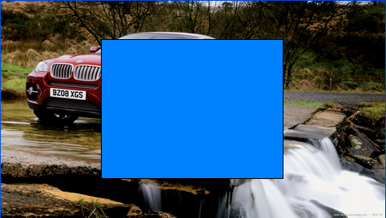
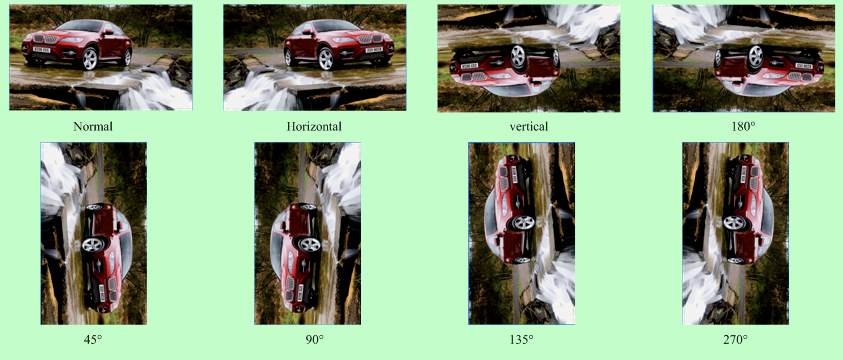
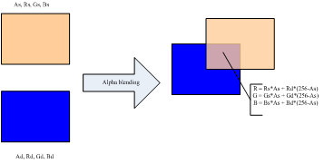
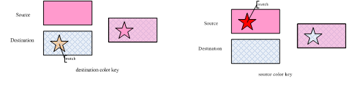
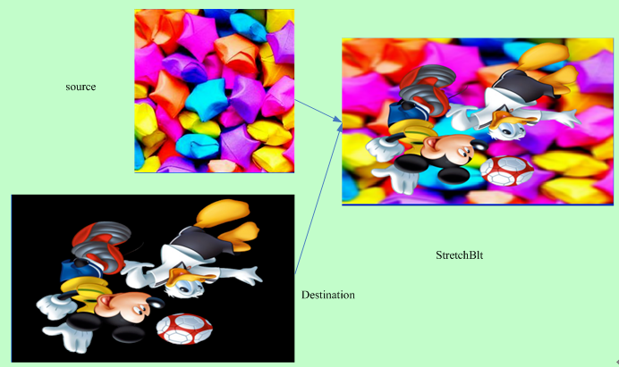
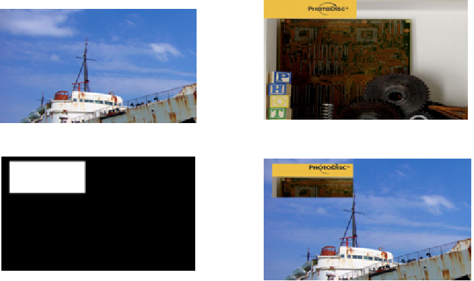

# G2D

G2D 驱动主要实现图像旋转/数据格式/颜色空间转换, 以及图层合成功能(包括包括alpha、colorkey、rotate、mirror、rop、maskblt) 等图形加速功能。

## 模块功能

### 矩形填充（fill color rectgngle）

填充矩形区域功能可以实现对某块区域进行预订的颜色值填充，如下图就填充了 0xFF0080FF的 ARGB 值，该功能还可以通过设定数据区域大小实现画点和直线，同时也可以通过设定 flag 实现一种填充颜色和目标做 alpha 运算。

### 旋转和镜像 (rotate and mirror)

旋转镜像主要是实现如下 Horizontal、Vertical、Rotate180°、Mirror45°、Rotate90°、Mirror135°、Rotate270° 共 7 种操作。

### alpha blending

不同的图层之间可以做 alpha blending。Alpha 分为 pixel alpha、plane alpha、multi alpha 三种：

- pixel alpha 意为每个像素自带有一个专属 alpha 值；
- plane alpha 则是一个图层中所有像素共用一个 globe alpha 值；
- multi alpha 则每个像素在代入 alpha 运算时的值为 globe alpha*pixel alpha，可以通过 G2D 驱动接口的 flag 去控制

###  colorkey

不同 image 之间可以做 colorkey 效果：

- 左图中 destination 的优先级高于 source，destination 中 match 部分（橙色五角星部分），则被选择透过，显示为 source 与 destination 做 alpha blending 后的效果图。

* 右图中 source 的优先级高于 destination，则 source 中 match 部分（深红色五角星部分），则被选择透过，直接显示 destination 与 source 做 alpha blending 后的效果图。

### 缩放 (Stretchblt)

Stretchblt 主要是把 source 按照 destination 的 size 进行缩放，并最终与 destination 做alpha blending、colorkey 等运算或直接旋转镜像后拷贝到目标

### 二元光栅操作 (rop2)

我们在画线和填充区域的时候将画笔和目标像素组合得到新的目标像素。

### 三元光栅操作 (maskblt rop3)

对于图像有同样光栅操作用于生成各种特殊效果, 我们要处理的有三种像素: 源图像像素, 目标图像像素, 画刷像素 (模板图像像素)。如下图所示, 从左上到右下分别是 src ptn mask dst。

